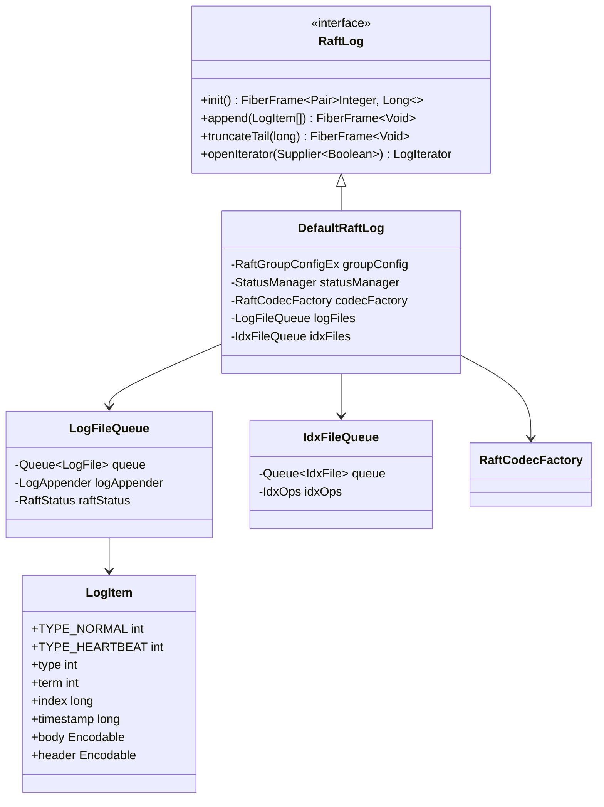
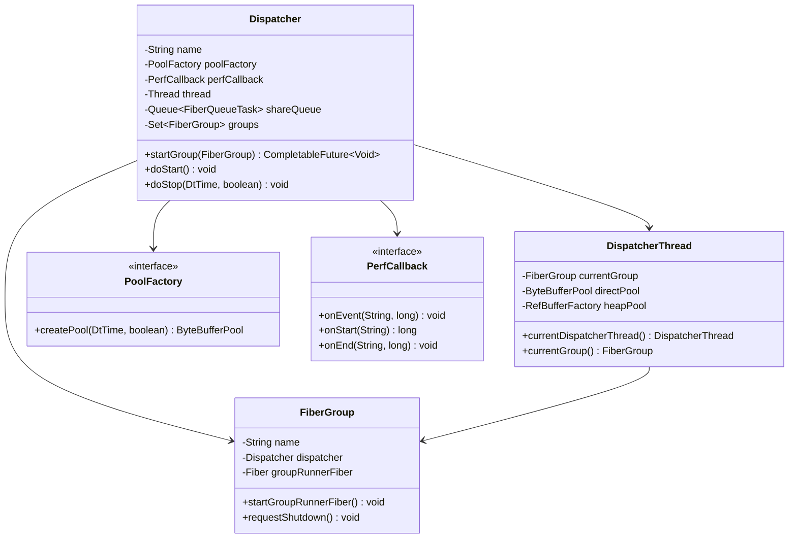
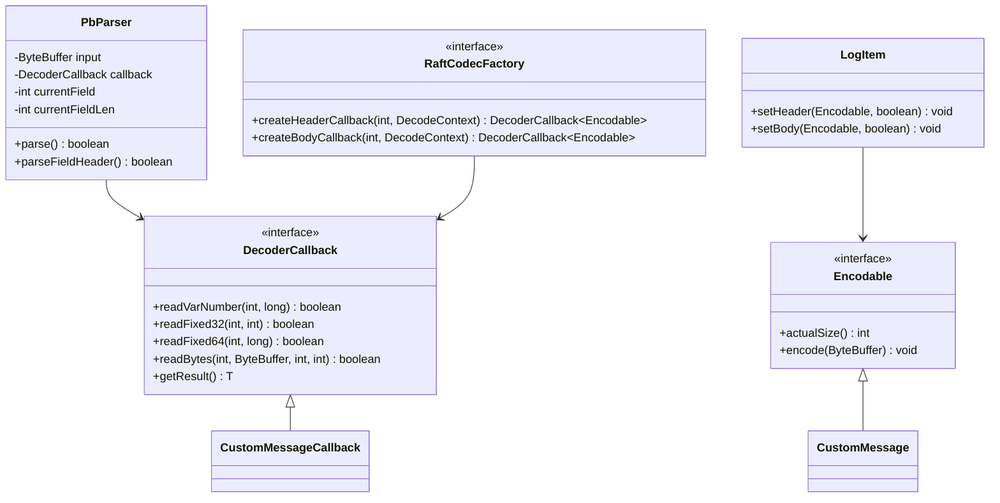
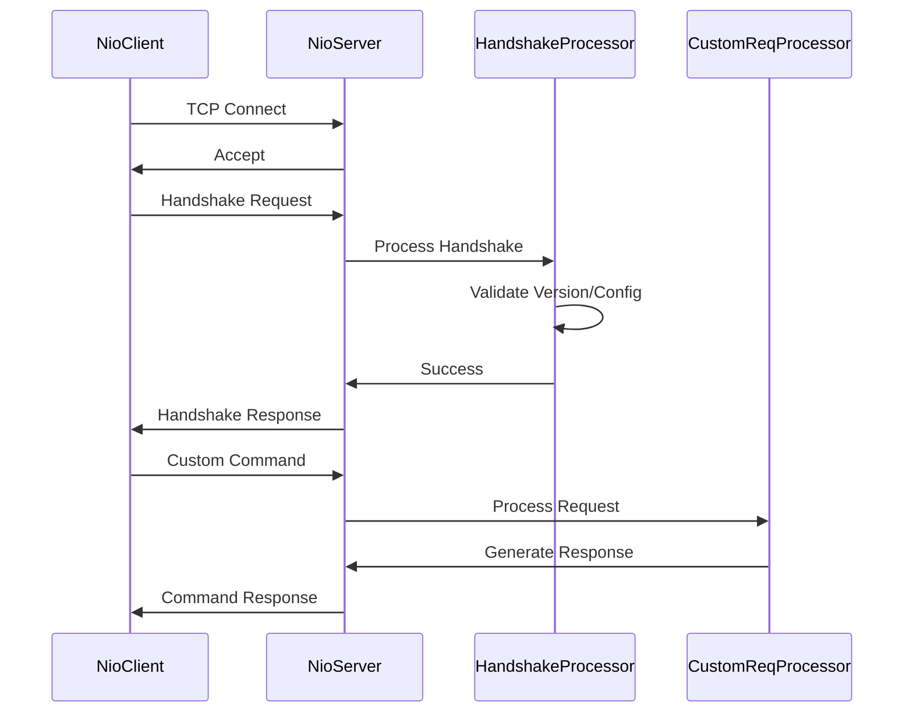

# Advanced Topics and Extensions

<cite>
**Referenced Files in This Document**   
- [DefaultRaftFactory.java](file://server/src/main/java/com/github/dtprj/dongting/raft/server/DefaultRaftFactory.java)
- [RaftFactory.java](file://server/src/main/java/com/github/dtprj/dongting/raft/server/RaftFactory.java)
- [RaftServer.java](file://server/src/main/java/com/github/dtprj/dongting/raft/server/RaftServer.java)
- [RaftLog.java](file://server/src/main/java/com/github/dtprj/dongting/raft/store/RaftLog.java)
- [DefaultRaftLog.java](file://server/src/main/java/com/github/dtprj/dongting/raft/store/DefaultRaftLog.java)
- [Dispatcher.java](file://server/src/main/java/com/github/dtprj/dongting/fiber/Dispatcher.java)
- [RaftCodecFactory.java](file://server/src/main/java/com/github/dtprj/dongting/raft/sm/RaftCodecFactory.java)
- [StateMachine.java](file://server/src/main/java/com/github/dtprj/dongting/raft/sm/StateMachine.java)
- [LogItem.java](file://server/src/main/java/com/github/dtprj/dongting/raft/server/LogItem.java)
- [Encodable.java](file://client/src/main/java/com/github/dtprj/dongting/codec/Encodable.java)
- [PbParser.java](file://client/src/main/java/com/github/dtprj/dongting/codec/PbParser.java)
- [NioServer.java](file://client/src/main/java/com/github/dtprj/dongting/net/NioServer.java)
- [NioClient.java](file://client/src/main/java/com/github/dtprj/dongting/net/NioClient.java)
- [HandshakeBody.java](file://client/src/main/java/com/github/dtprj/dongting/net/HandshakeBody.java)
</cite>

## Table of Contents
1. [Custom State Machine Implementation](#custom-state-machine-implementation)
2. [Custom RAFT Log Storage](#custom-raft-log-storage)
3. [Fiber Scheduler Customization](#fiber-scheduler-customization)
4. [Codec Framework Extension](#codec-framework-extension)
5. [Custom Network Protocols](#custom-network-protocols)
6. [Application Embedding and RPC Services](#application-embedding-and-rpc-services)
7. [Monitoring and Security Integration](#monitoring-and-security-integration)
8. [Cross-Datacenter Deployment](#cross-datacenter-deployment)
9. [Versioning and Upgrade Strategies](#versioning-and-upgrade-strategies)

## Custom State Machine Implementation

To implement custom state machines in Dongting, developers must extend the `DefaultRaftFactory` class and override the `createStateMachine` method. The `RaftFactory` interface serves as the extension point for customizing RAFT consensus behavior, allowing developers to inject their own state machine implementations that define application-specific logic for handling RAFT log entries.

When extending `DefaultRaftFactory`, the custom state machine must implement the `StateMachine` interface, which processes committed log entries and maintains application state. The state machine operates within the RAFT thread context, ensuring thread safety and linearizability. Each log entry contains a type identifier and payload that the state machine interprets according to business logic requirements.

The integration with RAFT consensus follows a well-defined lifecycle: when a log entry is committed, the RAFT layer invokes the state machine's apply method within a fiber context. This design ensures that state transitions occur sequentially and consistently across all replicas in the RAFT group. Developers can leverage the fiber framework to perform asynchronous operations while maintaining the sequential execution guarantee required by the RAFT algorithm.

**Section sources**
- [DefaultRaftFactory.java](file://server/src/main/java/com/github/dtprj/dongting/raft/server/DefaultRaftFactory.java#L40-L124)
- [RaftFactory.java](file://server/src/main/java/com/github/dtprj/dongting/raft/server/RaftFactory.java#L18)
- [RaftServer.java](file://server/src/main/java/com/github/dtprj/dongting/raft/server/RaftServer.java#L266)

## Custom RAFT Log Storage

Creating custom RAFT log storage implementations requires implementing the `RaftLog` interface from the store package. This interface defines the contract for persistent storage of RAFT log entries, including methods for appending entries, reading from the log, and truncating the log during leader election or snapshot installation.

The `RaftLog` interface operates within the RAFT thread context, ensuring that all storage operations are serialized and consistent. Implementations must handle the append operation, which takes a list of `LogItem` objects and persists them to storage. The append method returns a `FiberFrame` to enable non-blocking I/O operations through Dongting's fiber scheduler.

For efficient log access, custom storage implementations should provide optimized indexing mechanisms. The reference implementation uses segmented log files with separate index files for quick position lookups. Developers can customize this approach based on their performance requirements and storage medium characteristics. The `IdxOps` interface provides a foundation for implementing custom indexing strategies that balance memory usage and lookup performance.

**Diagram sources**
- [RaftLog.java](file://server/src/main/java/com/github/dtprj/dongting/raft/store/RaftLog.java#L31-L45)
- [DefaultRaftLog.java](file://server/src/main/java/com/github/dtprj/dongting/raft/store/DefaultRaftLog.java)
- [LogItem.java](file://server/src/main/java/com/github/dtprj/dongting/raft/server/LogItem.java#L44-L98)
- [LogFileQueue.java](file://server/src/main/java/com/github/dtprj/dongting/raft/store/LogFileQueue.java)

**Section sources**
- [RaftLog.java](file://server/src/main/java/com/github/dtprj/dongting/raft/store/RaftLog.java#L31-L45)
- [DefaultRaftLog.java](file://server/src/main/java/com/github/dtprj/dongting/raft/store/DefaultRaftLog.java)
- [LogFileQueue.java](file://server/src/main/java/com/github/dtprj/dongting/raft/store/LogFileQueue.java#L244)

## Fiber Scheduler Customization

Advanced fiber scheduler customization in Dongting is achieved through the `Dispatcher` configuration. The `Dispatcher` class serves as the core scheduling unit for fibers, managing thread execution, resource allocation, and performance monitoring. Developers can customize scheduler behavior by extending the `DefaultRaftFactory` and overriding the `createDispatcher` method to provide specialized dispatcher instances.

The dispatcher configuration allows tuning of critical performance parameters such as thread naming, memory pool allocation, and performance callback integration. Each dispatcher manages a dedicated thread for executing fibers, with configurable heap and direct memory pools to optimize buffer management. The `DispatcherThread` class provides access to current execution context, enabling fiber-aware operations and resource tracking.

Custom dispatchers can implement specialized queuing strategies, priority scheduling, or resource isolation for different RAFT groups. The fiber framework supports hierarchical dispatchers, allowing developers to create isolated execution environments for different application components while sharing underlying resources efficiently. Performance callbacks can be integrated to monitor fiber execution metrics and implement adaptive scheduling policies.

**Diagram sources**
- [Dispatcher.java](file://server/src/main/java/com/github/dtprj/dongting/fiber/Dispatcher.java#L68-L143)
- [DispatcherThread.java](file://server/src/main/java/com/github/dtprj/dongting/fiber/DispatcherThread.java#L1-L49)
- [FiberGroup.java](file://server/src/main/java/com/github/dtprj/dongting/fiber/FiberGroup.java)

**Section sources**
- [Dispatcher.java](file://server/src/main/java/com/github/dtprj/dongting/fiber/Dispatcher.java#L86-L143)
- [DefaultRaftFactory.java](file://server/src/main/java/com/github/dtprj/dongting/raft/server/DefaultRaftFactory.java#L102-L105)
- [RaftServer.java](file://server/src/main/java/com/github/dtprj/dongting/raft/server/RaftServer.java#L251-L252)

## Codec Framework Extension

Extending the codec framework for custom message types in Dongting requires implementing the `Encodable` interface and creating corresponding decoder callbacks. The codec system is built around Protocol Buffers (Pb) serialization with a streaming parser design that enables efficient, incremental message processing without full buffering.

To add custom message types, developers must implement the `Encodable` interface, which defines the `actualSize` and `encode` methods for serialization. The `PbParser` class handles deserialization through callback-driven parsing, where each message field triggers specific callback methods. Custom message types require corresponding `DecoderCallback` implementations that process field values as they are parsed from the input stream.

The `RaftCodecFactory` interface provides the extension point for registering custom codecs with the RAFT layer. By overriding the `createHeaderCallback` and `createBodyCallback` methods, developers can map message type identifiers to their custom decoder implementations. This factory pattern allows runtime selection of appropriate codecs based on message type, supporting multiple message formats within the same RAFT group.

**Diagram sources**
- [Encodable.java](file://client/src/main/java/com/github/dtprj/dongting/codec/Encodable.java)
- [DecoderCallback.java](file://client/src/main/java/com/github/dtprj/dongting/codec/DecoderCallback.java)
- [PbParser.java](file://client/src/main/java/com/github/dtprj/dongting/codec/PbParser.java)
- [RaftCodecFactory.java](file://server/src/main/java/com/github/dtprj/dongting/raft/sm/RaftCodecFactory.java#L25-L37)

**Section sources**
- [Encodable.java](file://client/src/main/java/com/github/dtprj/dongting/codec/Encodable.java)
- [PbParser.java](file://client/src/main/java/com/github/dtprj/dongting/codec/PbParser.java)
- [RaftCodecFactory.java](file://server/src/main/java/com/github/dtprj/dongting/raft/sm/RaftCodecFactory.java#L25-L37)

## Custom Network Protocols

Implementing custom network protocols and transport layers in Dongting involves extending the NIO networking components and customizing the handshake mechanism. The network stack is built on a non-blocking I/O model with protocol extensibility designed into the core architecture.

The `HandshakeBody` class defines the initial connection negotiation protocol, which includes version checking, capability exchange, and configuration validation. Custom protocols can extend this handshake by adding new fields to the configuration body or implementing alternative handshake processors. The `Commands` and `CmdCodes` classes provide the foundation for extending the command set with custom operations.

Transport layer customization can be achieved by implementing alternative `NioServer` and `NioClient` configurations with specialized packet processors. The network layer supports multiple concurrent protocols over the same TCP connection through command multiplexing. Developers can register custom `ReqProcessor` implementations to handle new command types, enabling extension of the RPC framework with domain-specific operations.

**Diagram sources**
- [NioServer.java](file://client/src/main/java/com/github/dtprj/dongting/net/NioServer.java)
- [NioClient.java](file://client/src/main/java/com/github/dtprj/dongting/net/NioClient.java)
- [HandshakeBody.java](file://client/src/main/java/com/github/dtprj/dongting/net/HandshakeBody.java#L28)
- [HandshakeProcessor.java](file://client/src/main/java/com/github/dtprj/dongting/net/HandshakeProcessor.java)

**Section sources**
- [NioServer.java](file://client/src/main/java/com/github/dtprj/dongting/net/NioServer.java)
- [NioClient.java](file://client/src/main/java/com/github/dtprj/dongting/net/NioClient.java)
- [HandshakeBody.java](file://client/src/main/java/com/github/dtprj/dongting/net/HandshakeBody.java#L28)

## Application Embedding and RPC Services

Embedding Dongting in existing applications and exposing custom RPC services requires integrating the RAFT server with the host application's lifecycle and threading model. The `RaftServer` class provides a modular design that can be instantiated and managed within larger application contexts.

To embed Dongting, applications should create a `RaftServer` instance with customized `RaftFactory` and `RaftServerConfig` objects. The server can be started and stopped programmatically, allowing integration with application startup and shutdown sequences. Custom RPC services are exposed by implementing `ReqProcessor` classes that handle specific command types and registering them with the server's command dispatch mechanism.

The fiber framework enables seamless integration of blocking and non-blocking operations within RPC handlers. Custom services can leverage the fiber scheduler to perform asynchronous database operations, external API calls, or complex computations without blocking the network thread. Response handling is managed through `RpcCallback` objects that provide completion notification and error handling.

**Section sources**
- [RaftServer.java](file://server/src/main/java/com/github/dtprj/dongting/raft/server/RaftServer.java#L109-L302)
- [ReqProcessor.java](file://client/src/main/java/com/github/dtprj/dongting/net/ReqProcessor.java)
- [RpcCallback.java](file://client/src/main/java/com/github/dtprj/dongting/net/RpcCallback.java)

## Monitoring and Security Integration

Integrating Dongting with external monitoring systems involves extending the `PerfCallback` interface and implementing custom metrics collection. The performance callback mechanism provides hooks for capturing execution metrics at various points in the RAFT and network processing pipelines.

For security implementations, developers can customize the handshake process to include authentication tokens, implement TLS encryption through custom NIO channel wrappers, or add message-level encryption for sensitive data. The codec framework supports encrypted message payloads through custom `Encodable` implementations that wrap serialized data with encryption envelopes.

The `PerfCallback` interface allows integration with popular monitoring systems like Prometheus by implementing the `onEvent`, `onStart`, and `onEnd` methods to export metrics in appropriate formats. Custom security modules can be integrated through the `ConfigBody` class, which carries configuration parameters including security settings that are exchanged during the handshake process.

**Section sources**
- [PerfCallback.java](file://client/src/main/java/com/github/dtprj/dongting/common/PerfCallback.java)
- [HandshakeBody.java](file://client/src/main/java/com/github/dtprj/dongting/net/HandshakeBody.java#L38)
- [ConfigBody.java](file://client/src/main/java/com/github/dtprj/dongting/net/ConfigBody.java)

## Cross-Datacenter Deployment

Cross-datacenter deployment patterns in Dongting leverage the multi-RAFT group architecture to provide geographic distribution and fault isolation. Each datacenter can host a subset of RAFT groups, with careful configuration of network timeouts and failure detection parameters to accommodate higher latency links.

The deployment strategy involves configuring different network parameters for intra-datacenter and inter-datacenter connections. The `NioClientConfig` and `NioServerConfig` classes provide settings for connection timeouts, heartbeat intervals, and retry policies that should be tuned based on network characteristics between datacenters.

For global consistency, applications can implement quorum-based operations that require acknowledgment from multiple datacenters. The `RaftGroupConfig` allows specification of member and observer nodes, enabling configurations where leaders are elected in primary datacenters while maintaining synchronized replicas in secondary locations for disaster recovery.

**Section sources**
- [RaftGroupConfig.java](file://server/src/main/java/com/github/dtprj/dongting/raft/server/RaftGroupConfig.java)
- [NioClientConfig.java](file://client/src/main/java/com/github/dtprj/dongting/net/NioClientConfig.java)
- [NioServerConfig.java](file://client/src/main/java/com/github/dtprj/dongting/net/NioServerConfig.java)

## Versioning and Upgrade Strategies

Versioning strategies for Dongting production systems center around backward compatibility in the handshake protocol and graceful configuration changes. The `HandshakeBody` includes major and minor version fields that enable compatibility checking between nodes during connection establishment.

Upgrade procedures should follow a rolling restart pattern, ensuring that a majority of nodes in each RAFT group remain available during the upgrade process. The system supports mixed-version operation within limits defined by the major version number, with automatic detection of incompatible versions during the handshake phase.

For schema evolution, the codec framework supports optional fields and backward-compatible message extensions. New message types can be introduced with unique identifiers, while deprecated types can be phased out gradually. The `RaftCodecFactory` enables runtime selection of appropriate codecs based on message type and version, facilitating smooth transitions during upgrades.

**Section sources**
- [HandshakeBody.java](file://client/src/main/java/com/github/dtprj/dongting/net/HandshakeBody.java#L30-L38)
- [RaftCodecFactory.java](file://server/src/main/java/com/github/dtprj/dongting/raft/sm/RaftCodecFactory.java)
- [RaftServer.java](file://server/src/main/java/com/github/dtprj/dongting/raft/server/RaftServer.java#L212-L239)