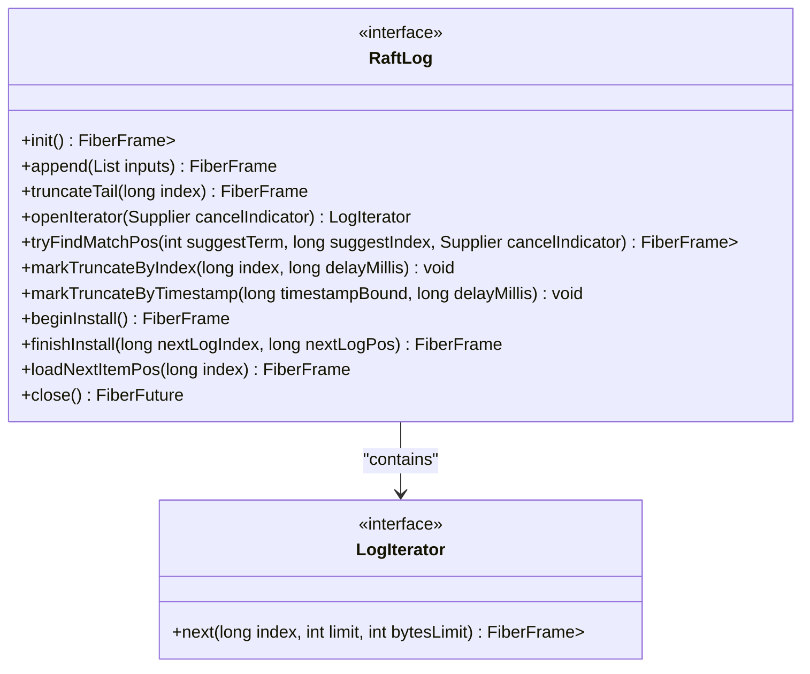
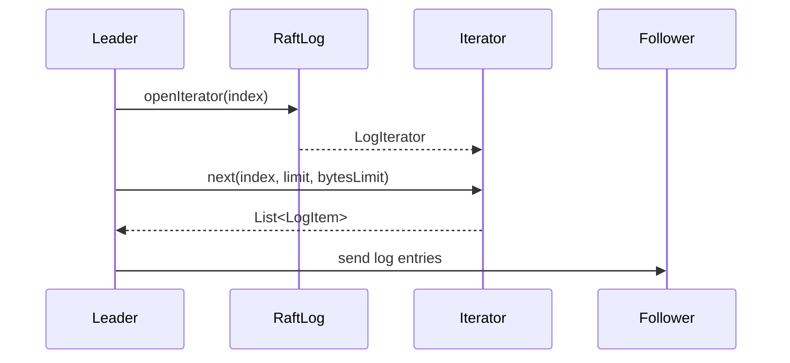
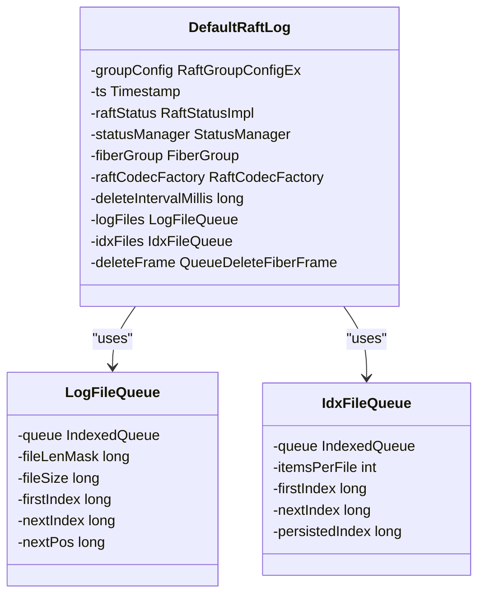
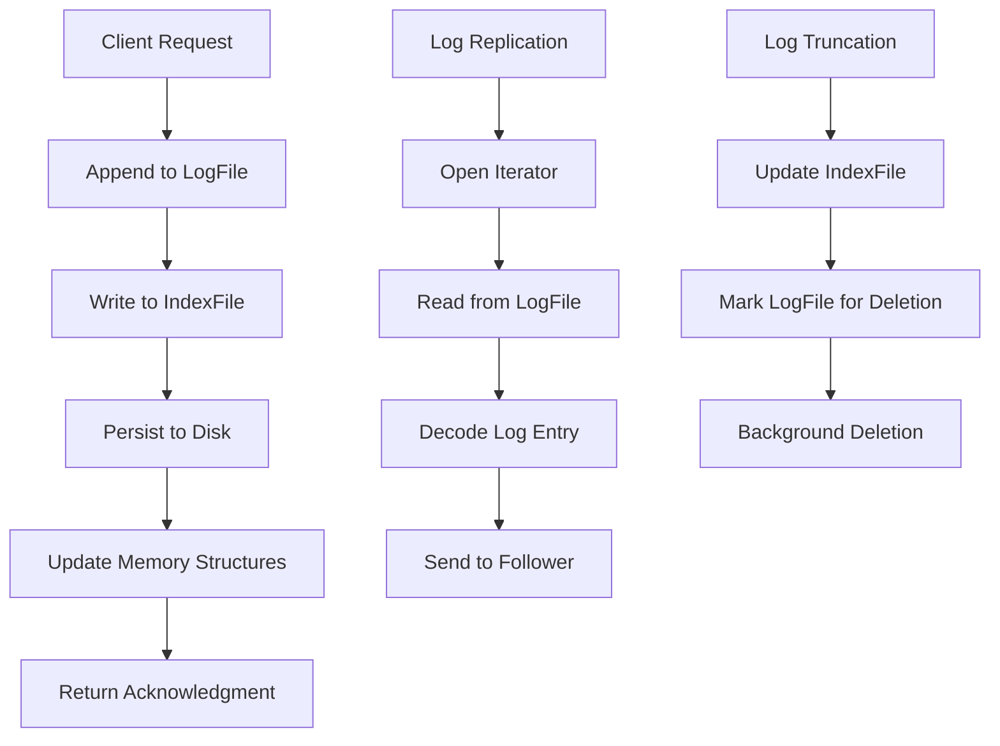
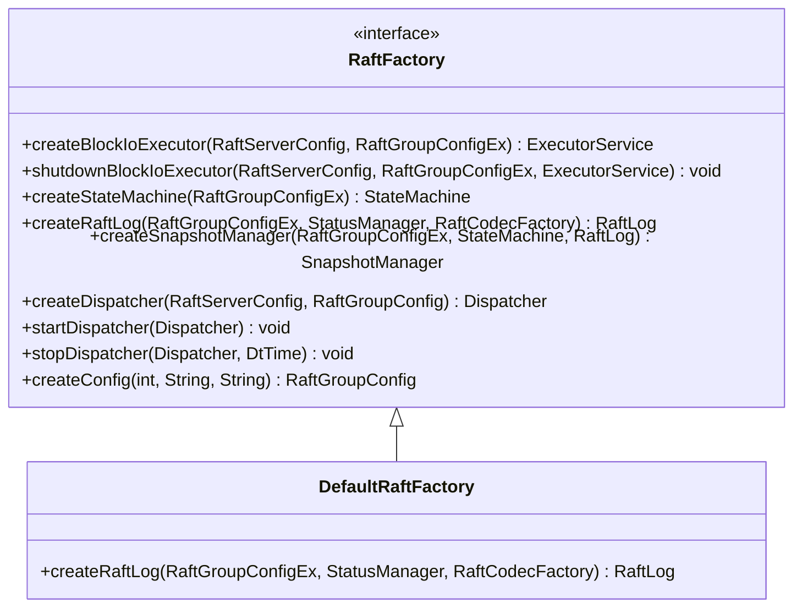

# Custom RAFT Log Storage

<cite>
**Referenced Files in This Document**   
- [RaftLog.java](file://server/src/main/java/com/github/dtprj/dongting/raft/store/RaftLog.java)
- [DefaultRaftLog.java](file://server/src/main/java/com/github/dtprj/dongting/raft/store/DefaultRaftLog.java)
- [RaftFactory.java](file://server/src/main/java/com/github/dtprj/dongting/raft/server/RaftFactory.java)
- [DefaultRaftFactory.java](file://server/src/main/java/com/github/dtprj/dongting/raft/server/DefaultRaftFactory.java)
- [FileLogLoader.java](file://server/src/main/java/com/github/dtprj/dongting/raft/store/FileLogLoader.java)
- [LogFile.java](file://server/src/main/java/com/github/dtprj/dongting/raft/store/LogFile.java)
- [AsyncIoTask.java](file://server/src/main/java/com/github/dtprj/dongting/raft/store/AsyncIoTask.java)
- [DefaultRaftLogTest.java](file://server/src/test/java/com/github/dtprj/dongting/raft/store/DefaultRaftLogTest.java)
</cite>

## Table of Contents
1. [Introduction](#introduction)
2. [RaftLog Interface Contract](#raftlog-interface-contract)
3. [Key Methods of RaftLog](#key-methods-of-raftlog)
4. [DefaultRaftLog Implementation](#defaultraftlog-implementation)
5. [Storage Architecture](#storage-architecture)
6. [Custom Storage Implementation](#custom-storage-implementation)
7. [Integration with RaftFactory](#integration-with-raftfactory)
8. [Testing Custom Implementations](#testing-custom-implementations)
9. [Performance Considerations](#performance-considerations)
10. [Conclusion](#conclusion)

## Introduction

The RAFT consensus algorithm requires a persistent log storage system to maintain the state of the distributed system. This document provides comprehensive guidance on creating custom RAFT log storage implementations that satisfy the performance and durability requirements of the RAFT consensus algorithm. The core interface for log storage is `RaftLog`, which defines the contract for all storage backends. The default implementation, `DefaultRaftLog`, provides a file-based storage system that can serve as a reference for custom implementations.

**Section sources**
- [RaftLog.java](file://server/src/main/java/com/github/dtprj/dongting/raft/store/RaftLog.java#L1-L89)
- [DefaultRaftLog.java](file://server/src/main/java/com/github/dtprj/dongting/raft/store/DefaultRaftLog.java#L1-L416)

## RaftLog Interface Contract

The `RaftLog` interface defines the contract for all RAFT log storage implementations. It provides methods for initializing the log, appending entries, truncating the log, and reading entries. The interface is designed to be implemented by storage backends that can provide the required durability and performance characteristics for RAFT consensus.

**Diagram sources**
- [RaftLog.java](file://server/src/main/java/com/github/dtprj/dongting/raft/store/RaftLog.java#L31-L88)

**Section sources**
- [RaftLog.java](file://server/src/main/java/com/github/dtprj/dongting/raft/store/RaftLog.java#L31-L88)

## Key Methods of RaftLog

### init()

The `init()` method initializes the log storage and returns the term and index of the last persisted log entry. This method is called during the startup of a RAFT node to recover the state from persistent storage.

**Section sources**
- [RaftLog.java](file://server/src/main/java/com/github/dtprj/dongting/raft/store/RaftLog.java#L36-L36)

### append()

The `append()` method appends a list of log entries to the storage. This method is called by the RAFT leader when it receives new entries from clients. The implementation must ensure that the entries are durably stored before returning.

**Section sources**
- [RaftLog.java](file://server/src/main/java/com/github/dtprj/dongting/raft/store/RaftLog.java#L38-L38)

### truncateTail()

The `truncateTail()` method truncates the log from the specified index (inclusive). This method is called when the RAFT leader discovers that its log is inconsistent with the majority of followers.

**Section sources**
- [RaftLog.java](file://server/src/main/java/com/github/dtprj/dongting/raft/store/RaftLog.java#L43-L43)

### openIterator()

The `openIterator()` method opens a log iterator for reading entries from the specified index. The iterator is used by the RAFT leader to send log entries to followers during replication.

**Diagram sources**
- [RaftLog.java](file://server/src/main/java/com/github/dtprj/dongting/raft/store/RaftLog.java#L45-L45)
- [FileLogLoader.java](file://server/src/main/java/com/github/dtprj/dongting/raft/store/FileLogLoader.java#L51-L418)

**Section sources**
- [RaftLog.java](file://server/src/main/java/com/github/dtprj/dongting/raft/store/RaftLog.java#L45-L45)

## DefaultRaftLog Implementation

The `DefaultRaftLog` class provides a file-based implementation of the `RaftLog` interface. It uses two types of files: log files for storing the actual log entries and index files for storing the position of each log entry in the log files.

**Diagram sources**
- [DefaultRaftLog.java](file://server/src/main/java/com/github/dtprj/dongting/raft/store/DefaultRaftLog.java#L47-L416)
- [LogFile.java](file://server/src/main/java/com/github/dtprj/dongting/raft/store/LogFile.java#L26-L52)

**Section sources**
- [DefaultRaftLog.java](file://server/src/main/java/com/github/dtprj/dongting/raft/store/DefaultRaftLog.java#L47-L416)

## Storage Architecture

The storage architecture of the default implementation consists of log files and index files. Log files store the actual log entries, while index files store the position of each log entry in the log files. This separation allows for efficient random access to log entries while maintaining sequential write performance.

**Diagram sources**
- [DefaultRaftLog.java](file://server/src/main/java/com/github/dtprj/dongting/raft/store/DefaultRaftLog.java#L47-L416)
- [FileLogLoader.java](file://server/src/main/java/com/github/dtprj/dongting/raft/store/FileLogLoader.java#L51-L418)
- [AsyncIoTask.java](file://server/src/main/java/com/github/dtprj/dongting/raft/store/AsyncIoTask.java#L38-L259)

**Section sources**
- [DefaultRaftLog.java](file://server/src/main/java/com/github/dtprj/dongting/raft/store/DefaultRaftLog.java#L47-L416)

## Custom Storage Implementation

To implement a custom storage backend, create a class that implements the `RaftLog` interface. The implementation must provide the required durability and performance characteristics for RAFT consensus.

### In-Memory Store

An in-memory store can be implemented for testing or scenarios where durability is not required. The implementation would store log entries in memory and provide fast access.

### Database-Backed Store

A database-backed store can be implemented using a relational or NoSQL database. The implementation would map log entries to database records and use transactions to ensure durability.

### Cloud Storage Integration

A cloud storage integration can be implemented using cloud storage services like AWS S3, Google Cloud Storage, or Azure Blob Storage. The implementation would store log entries in cloud storage and use the service's durability guarantees.

**Section sources**
- [RaftLog.java](file://server/src/main/java/com/github/dtprj/dongting/raft/store/RaftLog.java#L31-L88)

## Integration with RaftFactory

Custom storage implementations are integrated through the `RaftFactory` interface. The `createRaftLog()` method is responsible for creating instances of the custom storage implementation.

**Diagram sources**
- [RaftFactory.java](file://server/src/main/java/com/github/dtprj/dongting/raft/server/RaftFactory.java#L13-L32)
- [DefaultRaftFactory.java](file://server/src/main/java/com/github/dtprj/dongting/raft/server/DefaultRaftFactory.java#L40-L124)

**Section sources**
- [RaftFactory.java](file://server/src/main/java/com/github/dtprj/dongting/raft/server/RaftFactory.java#L13-L32)
- [DefaultRaftFactory.java](file://server/src/main/java/com/github/dtprj/dongting/raft/server/DefaultRaftFactory.java#L40-L124)

## Testing Custom Implementations

Testing custom storage implementations requires verifying correctness, durability, and performance. The `DefaultRaftLogTest` class provides examples of test patterns that can be adapted for custom implementations.

### Correctness Testing

Test that the implementation correctly handles all RAFT log operations, including initialization, appending, truncation, and reading.

### Durability Testing

Test that the implementation provides the required durability guarantees by simulating crashes and verifying that the state is recovered correctly.

### Performance Testing

Test the performance of the implementation under various workloads and compare it to the default implementation.

**Section sources**
- [DefaultRaftLogTest.java](file://server/src/test/java/com/github/dtprj/dongting/raft/store/DefaultRaftLogTest.java#L52-L532)

## Performance Considerations

When implementing a custom storage backend, consider the following performance aspects:

- **Write Amplification**: Minimize the amount of data written to storage relative to the amount of data received from the RAFT leader.
- **Read Efficiency**: Optimize for sequential reads during log replication and random access during log recovery.
- **Concurrency**: Support concurrent operations from multiple RAFT nodes and clients.
- **Memory Usage**: Balance memory usage with performance requirements.

**Section sources**
- [DefaultRaftLog.java](file://server/src/main/java/com/github/dtprj/dongting/raft/store/DefaultRaftLog.java#L47-L416)
- [AsyncIoTask.java](file://server/src/main/java/com/github/dtprj/dongting/raft/store/AsyncIoTask.java#L38-L259)

## Conclusion

Creating custom RAFT log storage implementations requires a deep understanding of the `RaftLog` interface and its requirements. The default implementation provides a solid reference for building custom storage backends that meet the performance and durability requirements of the RAFT consensus algorithm. By following the patterns and practices outlined in this document, developers can create storage implementations that integrate seamlessly with the existing RAFT framework.