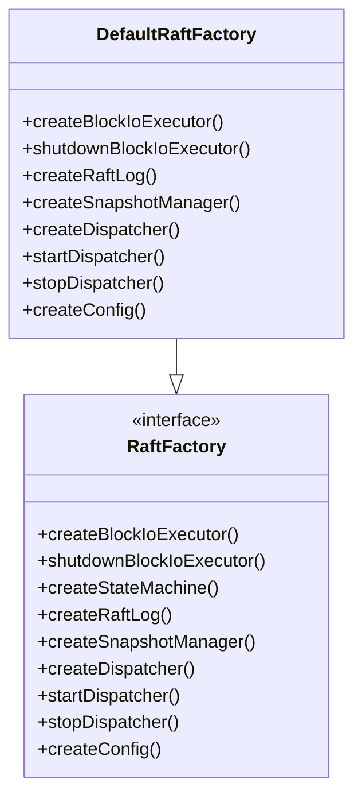
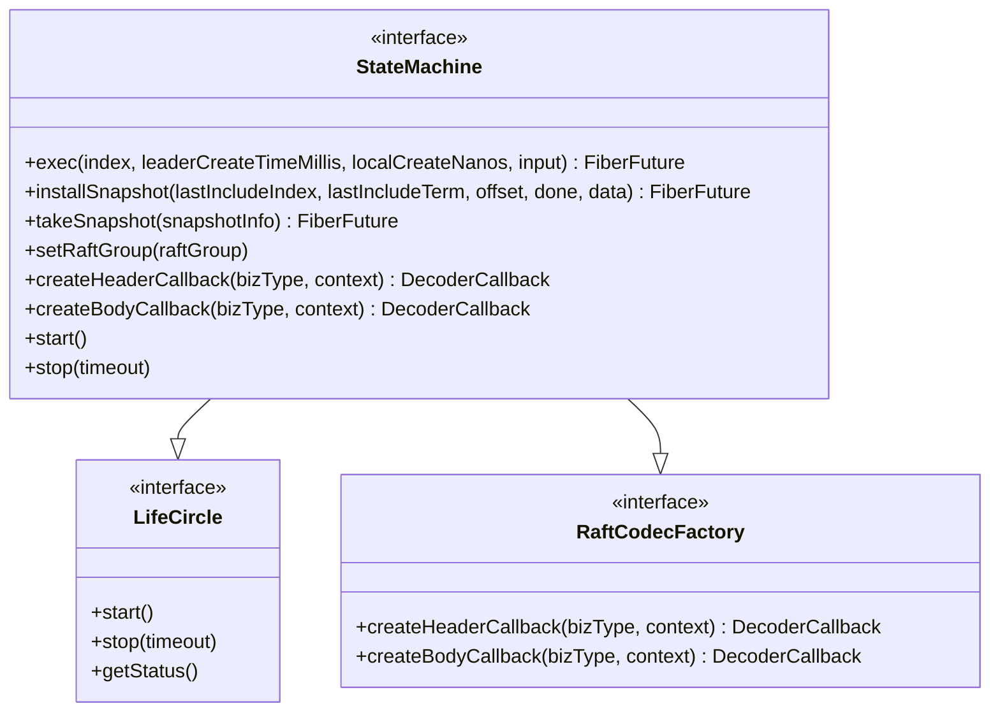
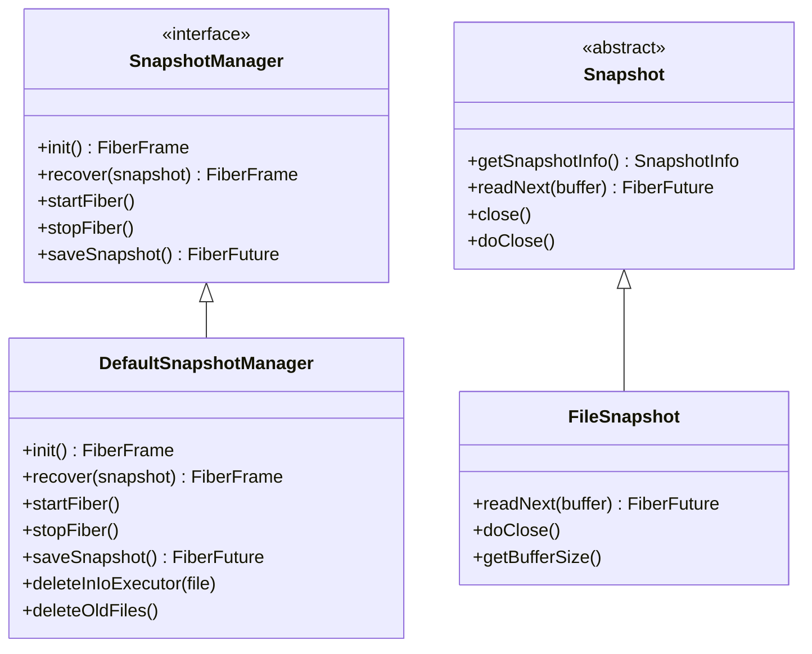
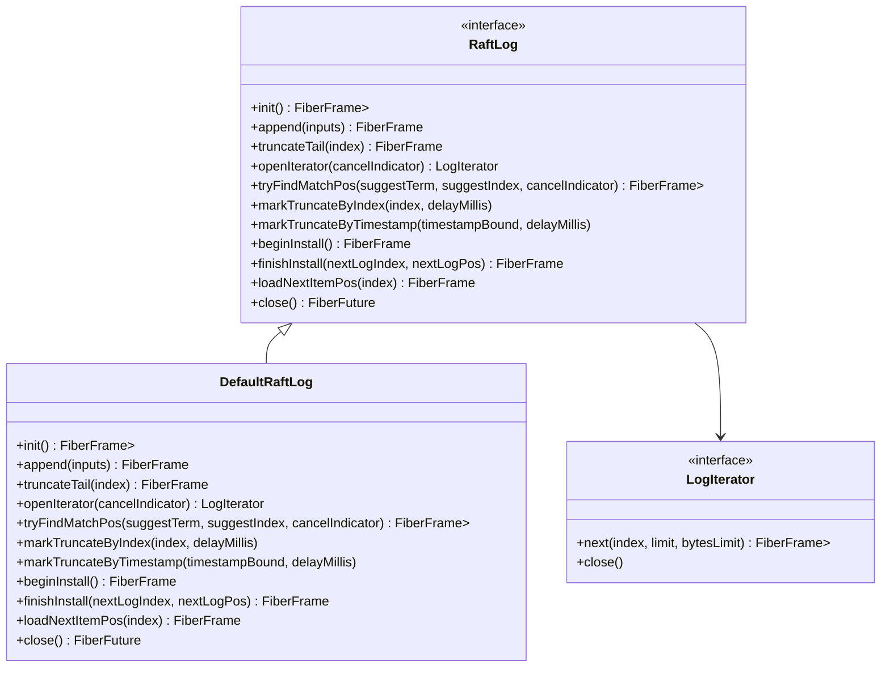
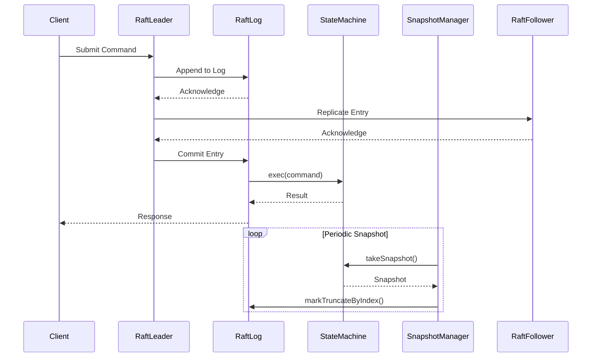
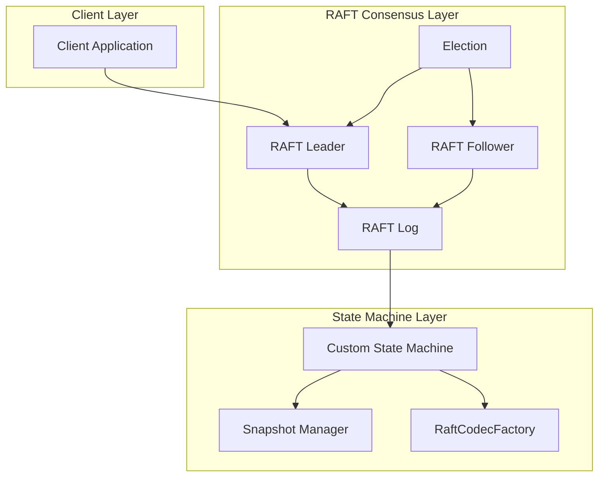

# Custom State Machine Implementation

<cite>
**Referenced Files in This Document**   
- [DefaultRaftFactory.java](file://server/src/main/java/com/github/dtprj/dongting/raft/server/DefaultRaftFactory.java)
- [StateMachine.java](file://server/src/main/java/com/github/dtprj/dongting/raft/sm/StateMachine.java)
- [SnapshotManager.java](file://server/src/main/java/com/github/dtprj/dongting/raft/sm/SnapshotManager.java)
- [RaftLog.java](file://server/src/main/java/com/github/dtprj/dongting/raft/store/RaftLog.java)
- [RaftFactory.java](file://server/src/main/java/com/github/dtprj/dongting/raft/server/RaftFactory.java)
- [KvImpl.java](file://server/src/main/java/com/github/dtprj/dongting/dtkv/server/KvImpl.java)
- [RaftGroup.java](file://server/src/main/java/com/github/dtprj/dongting/raft/server/RaftGroup.java)
- [RaftCodecFactory.java](file://server/src/main/java/com/github/dtprj/dongting/raft/sm/RaftCodecFactory.java)
- [Snapshot.java](file://server/src/main/java/com/github/dtprj/dongting/raft/sm/Snapshot.java)
- [FileSnapshot.java](file://server/src/main/java/com/github/dtprj/dongting/raft/sm/FileSnapshot.java)
- [DefaultSnapshotManager.java](file://server/src/main/java/com/github/dtprj/dongting/raft/sm/DefaultSnapshotManager.java)
- [DefaultRaftLog.java](file://server/src/main/java/com/github/dtprj/dongting/raft/store/DefaultRaftLog.java)
</cite>

## Table of Contents
1. [Introduction](#introduction)
2. [Core Components](#core-components)
3. [Extending DefaultRaftFactory](#extending-defaultraftfactory)
4. [Implementing StateMachine Interface](#implementing-statemachine-interface)
5. [Snapshot Management](#snapshot-management)
6. [RAFT Log Integration](#raft-log-integration)
7. [Command Serialization and Deserialization](#command-serialization-and-deserialization)
8. [State Transition Lifecycle](#state-transition-lifecycle)
9. [Custom State Machine Examples](#custom-state-machine-examples)
10. [Thread Safety and Performance](#thread-safety-and-performance)
11. [Error Handling Strategies](#error-handling-strategies)
12. [Testing and Debugging](#testing-and-debugging)
13. [Architecture Overview](#architecture-overview)

## Introduction
This document provides comprehensive guidance on implementing custom state machines in Dongting's RAFT consensus algorithm. The state machine is a critical component that defines the business logic of a distributed system while maintaining consistency through the RAFT consensus protocol. This guide explains how to extend the `DefaultRaftFactory` to create custom state machine logic, implement the required lifecycle methods, and integrate with the RAFT consensus algorithm. The documentation covers snapshot management, command processing, thread safety considerations, and provides concrete examples for various use cases including distributed databases, configuration stores, and coordination services.

## Core Components
The custom state machine implementation in Dongting's RAFT consensus revolves around several core components that work together to maintain distributed consistency. The `StateMachine` interface defines the contract for state transition logic, while the `SnapshotManager` handles state persistence and recovery. The `RaftLog` component manages the persistent storage of commands, and the `RaftFactory` serves as the factory pattern for creating these components. These components interact through well-defined interfaces, allowing for extensibility and customization while maintaining the integrity of the RAFT consensus algorithm.

**Section sources**
- [StateMachine.java](file://server/src/main/java/com/github/dtprj/dongting/raft/sm/StateMachine.java#L1-L49)
- [SnapshotManager.java](file://server/src/main/java/com/github/dtprj/dongting/raft/sm/SnapshotManager.java#L1-L37)
- [RaftLog.java](file://server/src/main/java/com/github/dtprj/dongting/raft/store/RaftLog.java#L1-L89)

## Extending DefaultRaftFactory
To implement a custom state machine, developers must extend the `DefaultRaftFactory` class, which provides a foundation for creating RAFT consensus components. The `DefaultRaftFactory` implements the `RaftFactory` interface and serves as a base class for custom factory implementations. When extending this class, developers can override specific methods to provide custom implementations while leveraging the default behavior for other components. The factory pattern allows for dependency injection and configuration of various RAFT components, including the state machine, snapshot manager, and RAFT log.

**Diagram sources**
- [DefaultRaftFactory.java](file://server/src/main/java/com/github/dtprj/dongting/raft/server/DefaultRaftFactory.java#L40-L123)
- [RaftFactory.java](file://server/src/main/java/com/github/dtprj/dongting/raft/server/RaftFactory.java#L13-L31)

## Implementing StateMachine Interface
The `StateMachine` interface is the core contract for implementing custom state machine logic in Dongting's RAFT consensus. This interface extends both `LifeCircle` and `RaftCodecFactory`, requiring implementations to manage their lifecycle and handle command serialization/deserialization. The interface defines three primary methods that must be implemented: `exec` for processing commands, `installSnapshot` for recovering from snapshots, and `takeSnapshot` for creating state snapshots. All methods except the codec creation methods are called within the RAFT thread, ensuring thread safety for state transitions.

**Diagram sources**
- [StateMachine.java](file://server/src/main/java/com/github/dtprj/dongting/raft/sm/StateMachine.java#L30-L49)
- [RaftCodecFactory.java](file://server/src/main/java/com/github/dtprj/dongting/raft/sm/RaftCodecFactory.java#L25-L37)

## Snapshot Management
Snapshot management is a critical aspect of state machine implementation, enabling efficient recovery and log compaction. The `SnapshotManager` interface defines the contract for snapshot operations, including initialization, recovery, and saving snapshots. The `DefaultSnapshotManager` provides a concrete implementation that handles file-based snapshot storage, automatic cleanup of old snapshots, and coordination between snapshot creation and log truncation. Custom implementations can extend this functionality to support different storage backends or snapshot formats.

**Diagram sources**
- [SnapshotManager.java](file://server/src/main/java/com/github/dtprj/dongting/raft/sm/SnapshotManager.java#L24-L36)
- [DefaultSnapshotManager.java](file://server/src/main/java/com/github/dtprj/dongting/raft/sm/DefaultSnapshotManager.java#L63-L507)
- [Snapshot.java](file://server/src/main/java/com/github/dtprj/dongting/raft/sm/Snapshot.java#L28-L55)
- [FileSnapshot.java](file://server/src/main/java/com/github/dtprj/dongting/raft/sm/FileSnapshot.java#L35-L82)

## RAFT Log Integration
The RAFT log serves as the persistent storage for commands that drive state transitions in the state machine. The `RaftLog` interface defines operations for appending, reading, and managing log entries. The `DefaultRaftLog` implementation provides a file-based log storage system with support for log compaction and efficient reading through the `LogIterator` interface. The state machine interacts with the RAFT log through the consensus algorithm, which ensures that commands are applied in the same order across all replicas, maintaining consistency.

**Diagram sources**
- [RaftLog.java](file://server/src/main/java/com/github/dtprj/dongting/raft/store/RaftLog.java#L31-L88)
- [DefaultRaftLog.java](file://server/src/main/java/com/github/dtprj/dongting/raft/store/DefaultRaftLog.java#L47-L415)

## Command Serialization and Deserialization
Command serialization and deserialization are handled through the `RaftCodecFactory` interface, which is extended by the `StateMachine` interface. This design allows the state machine to define how commands are encoded and decoded, providing flexibility in the command format. The factory methods `createHeaderCallback` and `createBodyCallback` return decoder callbacks for parsing command headers and bodies, respectively. This approach enables efficient parsing of commands directly from network buffers without intermediate copying, improving performance in high-throughput scenarios.

**Section sources**
- [RaftCodecFactory.java](file://server/src/main/java/com/github/dtprj/dongting/raft/sm/RaftCodecFactory.java#L25-L37)
- [StateMachine.java](file://server/src/main/java/com/github/dtprj/dongting/raft/sm/StateMachine.java#L30-L49)

## State Transition Lifecycle
The state transition lifecycle in Dongting's RAFT consensus follows a well-defined sequence of operations. When a command is received, it is first appended to the RAFT log. Once the command is committed by the RAFT consensus algorithm, it is passed to the state machine's `exec` method for processing. The state machine applies the command to its internal state and returns a result. Periodically, the state machine creates snapshots of its state through the `takeSnapshot` method, which are then used to compact the RAFT log. When a node restarts or joins the cluster, it recovers its state by installing a snapshot and replaying subsequent log entries.

**Diagram sources**
- [StateMachine.java](file://server/src/main/java/com/github/dtprj/dongting/raft/sm/StateMachine.java#L35-L46)
- [SnapshotManager.java](file://server/src/main/java/com/github/dtprj/dongting/raft/sm/SnapshotManager.java#L34-L35)
- [RaftLog.java](file://server/src/main/java/com/github/dtprj/dongting/raft/store/RaftLog.java#L59-L66)

## Custom State Machine Examples
The `KvImpl` class provides a concrete example of a custom state machine implementation for a distributed key-value store. This implementation demonstrates how to manage hierarchical data with support for directories, TTL (time-to-live) expiration, and watches. The state machine uses a `ConcurrentHashMap` to store key-value pairs and a `StampedLock` for thread-safe access. It also integrates with a `TtlManager` for automatic expiration of temporary nodes and a `ServerWatchManager` for notifying clients of changes. This example illustrates how to handle complex state transitions while maintaining consistency through the RAFT consensus algorithm.

**Section sources**
- [KvImpl.java](file://server/src/main/java/com/github/dtprj/dongting/dtkv/server/KvImpl.java#L45-L800)

## Thread Safety and Performance
Thread safety in Dongting's RAFT consensus is achieved through a single-threaded execution model for state transitions. All state-modifying operations are executed within the RAFT thread, eliminating the need for complex synchronization mechanisms within the state machine. This design ensures that commands are applied in a deterministic order, maintaining consistency across replicas. For performance optimization, the framework uses fiber-based concurrency for non-blocking I/O operations, allowing high throughput while maintaining the simplicity of single-threaded state management. The use of object pooling and zero-copy serialization further enhances performance in high-load scenarios.

**Section sources**
- [StateMachine.java](file://server/src/main/java/com/github/dtprj/dongting/raft/sm/StateMachine.java#L26-L27)
- [KvImpl.java](file://server/src/main/java/com/github/dtprj/dongting/dtkv/server/KvImpl.java#L66-L69)

## Error Handling Strategies
Error handling in custom state machines follows a comprehensive strategy that addresses both transient and permanent failures. The framework uses `FiberFuture` for asynchronous operation results, allowing for proper error propagation and handling. For recoverable errors, the state machine can return appropriate error codes to the client, while fatal errors trigger the consensus algorithm's recovery mechanisms. The snapshot and log compaction features provide protection against data corruption, allowing nodes to recover from a known good state. Additionally, the framework includes extensive logging and monitoring capabilities to aid in debugging and troubleshooting.

**Section sources**
- [StateMachine.java](file://server/src/main/java/com/github/dtprj/dongting/raft/sm/StateMachine.java#L35-L46)
- [DefaultSnapshotManager.java](file://server/src/main/java/com/github/dtprj/dongting/raft/sm/DefaultSnapshotManager.java#L331-L338)

## Testing and Debugging
Testing custom state machines requires a comprehensive approach that includes unit testing, integration testing, and fault injection testing. The framework provides testing utilities and mock implementations to facilitate unit testing of state machine logic in isolation. Integration tests should verify the interaction between the state machine, RAFT log, and snapshot manager under various conditions, including network partitions and node failures. Debugging tools include detailed logging, performance metrics, and the ability to inspect the current state of the RAFT consensus and state machine. The fiber-based execution model also provides visibility into the execution flow, aiding in diagnosing concurrency issues.

**Section sources**
- [KvImpl.java](file://server/src/main/java/com/github/dtprj/dongting/dtkv/server/KvImpl.java#L640-L659)
- [DefaultSnapshotManager.java](file://server/src/main/java/com/github/dtprj/dongting/raft/sm/DefaultSnapshotManager.java#L508-L577)

## Architecture Overview
The architecture of Dongting's RAFT consensus with custom state machines follows a modular design that separates concerns while maintaining tight integration between components. The RAFT consensus algorithm provides the foundation for distributed consistency, while the state machine implements the application-specific logic. The factory pattern allows for customization of components, and the fiber-based concurrency model enables high performance with simplified programming. This architecture supports various use cases, from simple key-value stores to complex distributed databases, by providing a flexible yet robust framework for implementing custom state machines.

**Diagram sources**
- [RaftGroup.java](file://server/src/main/java/com/github/dtprj/dongting/raft/server/RaftGroup.java#L29-L105)
- [StateMachine.java](file://server/src/main/java/com/github/dtprj/dongting/raft/sm/StateMachine.java#L30-L49)
- [SnapshotManager.java](file://server/src/main/java/com/github/dtprj/dongting/raft/sm/SnapshotManager.java#L24-L36)
- [RaftLog.java](file://server/src/main/java/com/github/dtprj/dongting/raft/store/RaftLog.java#L31-L88)