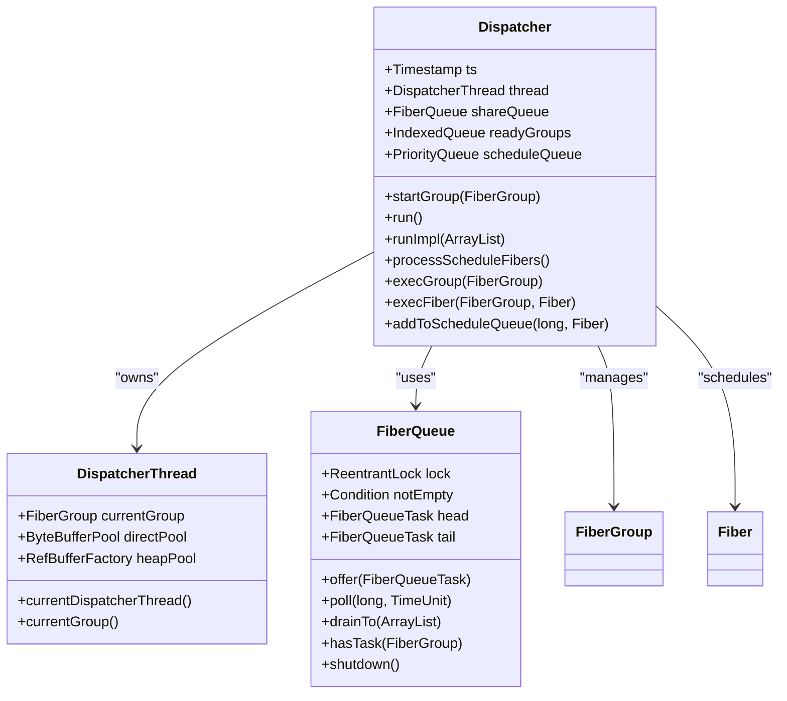
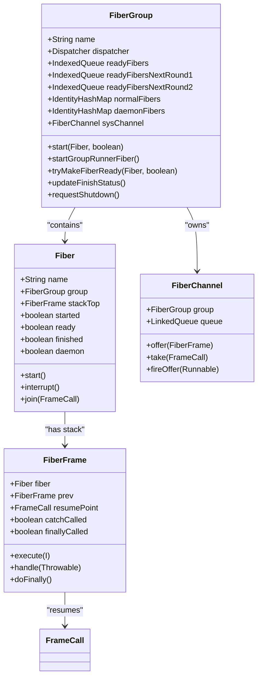
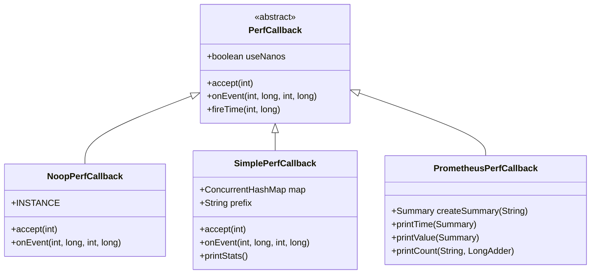

# Fiber Scheduler Configuration

<cite>
**Referenced Files in This Document**   
- [Dispatcher.java](file://server/src/main/java/com/github/dtprj/dongting/fiber/Dispatcher.java)
- [FiberGroup.java](file://server/src/main/java/com/github/dtprj/dongting/fiber/FiberGroup.java)
- [DispatcherThread.java](file://server/src/main/java/com/github/dtprj/dongting/fiber/DispatcherThread.java)
- [PerfCallback.java](file://client/src/main/java/com/github/dtprj/dongting/common/PerfCallback.java)
- [NoopPerfCallback.java](file://client/src/main/java/com/github/dtprj/dongting/common/NoopPerfCallback.java)
- [PerfConsts.java](file://client/src/main/java/com/github/dtprj/dongting/common/PerfConsts.java)
- [SimplePerfCallback.java](file://benchmark/src/main/java/com/github/dtprj/dongting/bench/common/SimplePerfCallback.java)
- [PrometheusPerfCallback.java](file://benchmark/src/main/java/com/github/dtprj/dongting/bench/common/PrometheusPerfCallback.java)
- [DefaultPoolFactory.java](file://client/src/main/java/com/github/dtprj/dongting/buf/DefaultPoolFactory.java)
- [FiberQueue.java](file://server/src/main/java/com/github/dtprj/dongting/fiber/FiberQueue.java)
- [GroupExecutor.java](file://server/src/main/java/com/github/dtprj/dongting/fiber/GroupExecutor.java)
</cite>

## Table of Contents
1. [Introduction](#introduction)
2. [Dispatcher Architecture](#dispatcher-architecture)
3. [FiberGroup Management](#fibergroup-management)
4. [Configuration Options](#configuration-options)
5. [Performance Monitoring](#performance-monitoring)
6. [Advanced Configuration](#advanced-configuration)
7. [Troubleshooting](#troubleshooting)
8. [Conclusion](#conclusion)

## Introduction

The Dongting fiber scheduler provides a cooperative multitasking framework that enables efficient execution of lightweight fibers across multiple FiberGroups. The Dispatcher class serves as the central scheduler that manages fiber execution, scheduling, and resource allocation. This document details the architecture, configuration options, and performance monitoring capabilities of the fiber scheduler, providing guidance for optimizing fiber execution patterns and diagnosing scheduler bottlenecks.

**Section sources**
- [Dispatcher.java](file://server/src/main/java/com/github/dtprj/dongting/fiber/Dispatcher.java#L1-L655)

## Dispatcher Architecture

The Dispatcher class implements a single-threaded event loop that coordinates the execution of fibers across multiple FiberGroups. Each Dispatcher instance runs on a dedicated DispatcherThread, ensuring that all fiber execution occurs within a single thread context.



**Diagram sources**
- [Dispatcher.java](file://server/src/main/java/com/github/dtprj/dongting/fiber/Dispatcher.java#L48-L654)
- [DispatcherThread.java](file://server/src/main/java/com/github/dtprj/dongting/fiber/DispatcherThread.java#L24-L49)
- [FiberQueue.java](file://server/src/main/java/com/github/dtprj/dongting/fiber/FiberQueue.java#L29-L138)

The Dispatcher maintains several key data structures:
- **shareQueue**: A thread-safe queue that receives tasks from external threads and fiber groups
- **readyGroups**: An indexed queue of FiberGroups that have ready fibers for execution
- **scheduleQueue**: A priority queue of fibers scheduled for future execution based on timeout
- **groups**: A list of active FiberGroups managed by the dispatcher

The dispatcher's main execution loop (runImpl method) follows this sequence:
1. Fill local task buffer from shareQueue
2. Process fibers that have reached their scheduled timeout
3. Execute ready fibers from readyGroups
4. Clean object pools periodically
5. Update timestamps and performance metrics

**Section sources**
- [Dispatcher.java](file://server/src/main/java/com/github/dtprj/dongting/fiber/Dispatcher.java#L148-L211)
- [DispatcherThread.java](file://server/src/main/java/com/github/dtprj/dongting/fiber/DispatcherThread.java#L24-L49)

## FiberGroup Management

FiberGroups provide logical isolation for fibers, allowing different workloads to be managed independently. Each FiberGroup belongs to a single Dispatcher and contains its own set of fibers that execute within the dispatcher's thread.



**Diagram sources**
- [FiberGroup.java](file://server/src/main/java/com/github/dtprj/dongting/fiber/FiberGroup.java#L34-L353)
- [Fiber.java](file://server/src/main/java/com/github/dtprj/dongting/fiber/Fiber.java#L27-L237)

FiberGroups support several key operations:
- **Fiber isolation**: Fibers in different groups are isolated and cannot directly interact
- **Lifecycle management**: Groups can be started and stopped independently
- **Resource sharing**: Groups share the dispatcher's thread and buffer pools
- **Execution ordering**: The dispatcher processes ready groups in a round-robin fashion

The FiberGroup maintains three ready queues to implement a multi-level feedback queue scheduling algorithm:
- **readyFibers**: Fibers ready in the current round
- **readyFibersNextRound1**: Fibers to be prioritized in the next round
- **readyFibersNextRound2**: Fibers to be scheduled later in the next round

This approach prevents starvation and ensures fair scheduling among fibers.

**Section sources**
- [FiberGroup.java](file://server/src/main/java/com/github/dtprj/dongting/fiber/FiberGroup.java#L34-L353)
- [Fiber.java](file://server/src/main/java/com/github/dtprj/dongting/fiber/Fiber.java#L27-L237)

## Configuration Options

### Thread Naming and Identification

When creating a Dispatcher instance, you can specify a custom name that will be used for the underlying DispatcherThread:

```java
Dispatcher dispatcher = new Dispatcher("my-dispatcher");
```

This naming convention helps identify dispatcher threads in thread dumps and monitoring tools. The thread name appears in stack traces and can be used for debugging and performance analysis.

**Section sources**
- [Dispatcher.java](file://server/src/main/java/com/github/dtprj/dongting/fiber/Dispatcher.java#L86-L95)

### Pool Factory Customization

The Dispatcher allows customization of buffer pool behavior through the PoolFactory interface. By default, it uses DefaultPoolFactory, but you can provide a custom implementation:

```java
Dispatcher dispatcher = new Dispatcher("custom-pool", myPoolFactory, perfCallback);
```

The DefaultPoolFactory creates a two-level pool hierarchy:
- **Small pool**: Thread-local pool with aggressive caching for high-frequency allocations
- **Global pool**: Shared pool across dispatchers for memory efficiency

You can customize pool parameters such as buffer sizes, minimum/maximum counts, and cleanup intervals by implementing your own PoolFactory.

**Section sources**
- [Dispatcher.java](file://server/src/main/java/com/github/dtprj/dongting/fiber/Dispatcher.java#L90-L95)
- [DefaultPoolFactory.java](file://client/src/main/java/com/github/dtprj/dongting/buf/DefaultPoolFactory.java#L28-L78)

### Multiple Dispatcher Configuration

For workloads requiring strict isolation, you can configure multiple dispatchers:

```java
// Create separate dispatchers for different workloads
Dispatcher ioDispatcher = new Dispatcher("io-dispatcher", ioPoolFactory, ioPerfCallback);
Dispatcher computeDispatcher = new Dispatcher("compute-dispatcher", computePoolFactory, computePerfCallback);

// Create fiber groups on different dispatchers
FiberGroup ioGroup = new FiberGroup("io-group", ioDispatcher);
FiberGroup computeGroup = new FiberGroup("compute-group", computeDispatcher);
```

This approach provides complete isolation between workloads, preventing one workload from affecting the performance of another. Each dispatcher runs on its own thread and manages its own resources.

**Section sources**
- [Dispatcher.java](file://server/src/main/java/com/github/dtprj/dongting/fiber/Dispatcher.java#L86-L95)
- [FiberGroup.java](file://server/src/main/java/com/github/dtprj/dongting/fiber/FiberGroup.java#L56-L67)

## Performance Monitoring

### PerfCallback Interface

The PerfCallback interface enables performance monitoring and metrics collection for the fiber scheduler. The dispatcher uses this interface to report key performance metrics:

```java
public abstract class PerfCallback implements PerfConsts {
    public abstract boolean accept(int perfType);
    public abstract void onEvent(int perfType, long costTime, int count, long sum);
}
```

The interface defines two primary methods:
- **accept(int perfType)**: Determines whether to collect metrics for a specific performance type
- **onEvent(int perfType, long costTime, int count, long sum)**: Called when a performance event occurs

**Section sources**
- [PerfCallback.java](file://client/src/main/java/com/github/dtprj/dongting/common/PerfCallback.java#L21-L110)
- [PerfConsts.java](file://client/src/main/java/com/github/dtprj/dongting/common/PerfConsts.java#L21-L54)

### Built-in Performance Metrics

The fiber scheduler collects several key performance metrics identified by constants in PerfConsts:

| Metric | Description | Typical Use Case |
|--------|-------------|------------------|
| FIBER_D_POLL | Time spent polling for tasks | Monitoring dispatcher idle time |
| FIBER_D_WORK | Time spent executing fibers | Measuring fiber processing overhead |
| RAFT_D_LEADER_RUNNER_FIBER_LATENCY | Leader fiber execution latency | Raft consensus performance |
| RAFT_D_ENCODE_AND_WRITE | Encoding and writing performance | Storage subsystem optimization |

These metrics can be used to identify bottlenecks and optimize scheduler performance.

**Section sources**
- [PerfConsts.java](file://client/src/main/java/com/github/dtprj/dongting/common/PerfConsts.java#L21-L54)
- [Dispatcher.java](file://server/src/main/java/com/github/dtprj/dongting/fiber/Dispatcher.java#L179-L211)

### Custom Performance Callbacks

You can implement custom performance callbacks by extending PerfCallback. The framework provides two example implementations:



**Diagram sources**
- [PerfCallback.java](file://client/src/main/java/com/github/dtprj/dongting/common/PerfCallback.java#L21-L110)
- [NoopPerfCallback.java](file://client/src/main/java/com/github/dtprj/dongting/common/NoopPerfCallback.java#L21-L66)
- [SimplePerfCallback.java](file://benchmark/src/main/java/com/github/dtprj/dongting/bench/common/SimplePerfCallback.java#L29-L152)
- [PrometheusPerfCallback.java](file://benchmark/src/main/java/com/github/dtprj/dongting/bench/common/PrometheusPerfCallback.java#L31-L103)

**Section sources**
- [PerfCallback.java](file://client/src/main/java/com/github/dtprj/dongting/common/PerfCallback.java#L21-L110)
- [NoopPerfCallback.java](file://client/src/main/java/com/github/dtprj/dongting/common/NoopPerfCallback.java#L21-L66)
- [SimplePerfCallback.java](file://benchmark/src/main/java/com/github/dtprj/dongting/bench/common/SimplePerfCallback.java#L29-L152)
- [PrometheusPerfCallback.java](file://benchmark/src/main/java/com/github/dtprj/dongting/bench/common/PrometheusPerfCallback.java#L31-L103)

## Advanced Configuration

### Poll Timeout Settings

The dispatcher's poll timeout determines how long it waits for new tasks when no fibers are ready for immediate execution:

```java
// Default poll timeout is 50ms
private long pollTimeout = TimeUnit.MILLISECONDS.toNanos(50);
```

This setting affects the dispatcher's responsiveness and CPU utilization:
- **Shorter timeouts**: More responsive but higher CPU usage
- **Longer timeouts**: Less CPU usage but potentially higher latency

The dispatcher dynamically adjusts polling behavior based on system load, switching between active polling and timed waiting based on recent activity.

**Section sources**
- [Dispatcher.java](file://server/src/main/java/com/github/dtprj/dongting/fiber/Dispatcher.java#L62-L63)
- [Dispatcher.java](file://server/src/main/java/com/github/dtprj/dongting/fiber/Dispatcher.java#L592-L627)

### Clean Interval Tuning

The dispatcher periodically cleans object pools to prevent memory leaks and maintain performance:

```java
// Clean pools every 60 seconds during normal operation
cleanPool(60_000_000_000L);

// Clean pools every 100ms during polling
cleanPool(100_000_000L);
```

These cleanup intervals can be adjusted based on workload characteristics:
- **High allocation rate workloads**: May benefit from more frequent cleaning
- **Memory-constrained environments**: May require more aggressive cleanup
- **Low-latency requirements**: May need to balance cleanup frequency with jitter

**Section sources**
- [Dispatcher.java](file://server/src/main/java/com/github/dtprj/dongting/fiber/Dispatcher.java#L203-L204)
- [Dispatcher.java](file://server/src/main/java/com/github/dtprj/dongting/fiber/Dispatcher.java#L605-L607)

## Troubleshooting

### Diagnosing Scheduler Bottlenecks

To diagnose scheduler performance issues, monitor the following metrics:

1. **FIBER_D_POLL**: High values indicate the dispatcher spends significant time waiting for work
2. **FIBER_D_WORK**: High values suggest fiber execution is taking longer than expected
3. **Ready fiber counts**: Monitor readyFibers size in FiberGroup to identify backlogs
4. **Schedule queue size**: Large schedule queues may indicate timing issues

Use the fireLogGroupInfo method to capture detailed diagnostics:

```java
fiberGroup.fireLogGroupInfo("diagnostic message");
```

This generates comprehensive logs about the fiber group's state, including ready fibers, waiting fibers, and execution statistics.

**Section sources**
- [Dispatcher.java](file://server/src/main/java/com/github/dtprj/dongting/fiber/Dispatcher.java#L179-L211)
- [FiberGroup.java](file://server/src/main/java/com/github/dtprj/dongting/fiber/FiberGroup.java#L243-L302)

### Optimizing Fiber Execution Patterns

To optimize fiber execution for specific use cases:

1. **IO-bound workloads**: Minimize blocking operations and use async patterns
2. **CPU-bound workloads**: Break long-running tasks into smaller fibers
3. **High-throughput scenarios**: Optimize buffer pool configuration
4. **Low-latency requirements**: Reduce poll timeout and optimize scheduling

Avoid long-running fiber frames that can block the dispatcher thread. Use yield() or sleep() to allow other fibers to execute:

```java
// Break long operations into smaller chunks
for (int i = 0; i < largeTaskSize; i++) {
    processChunk(i);
    if (i % 100 == 0) {
        // Allow other fibers to run
        Fiber.yield(this::resume);
    }
}
```

**Section sources**
- [Fiber.java](file://server/src/main/java/com/github/dtprj/dongting/fiber/Fiber.java#L101-L104)
- [Dispatcher.java](file://server/src/main/java/com/github/dtprj/dongting/fiber/Dispatcher.java#L493-L499)

## Conclusion

The Dongting fiber scheduler provides a robust foundation for building high-performance, concurrent applications. By understanding the Dispatcher architecture, configuring appropriate performance callbacks, and tuning advanced settings, you can optimize fiber execution for your specific use cases. The combination of FiberGroups for workload isolation, customizable pool factories for memory management, and comprehensive performance monitoring enables fine-grained control over scheduler behavior.

When configuring the fiber scheduler, consider your application's specific requirements for throughput, latency, and resource utilization. Use the provided monitoring tools to identify bottlenecks and validate performance improvements. With proper configuration and optimization, the Dongting fiber scheduler can efficiently handle demanding workloads while maintaining predictable performance characteristics.