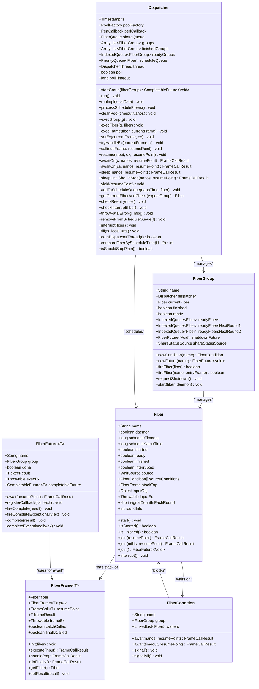
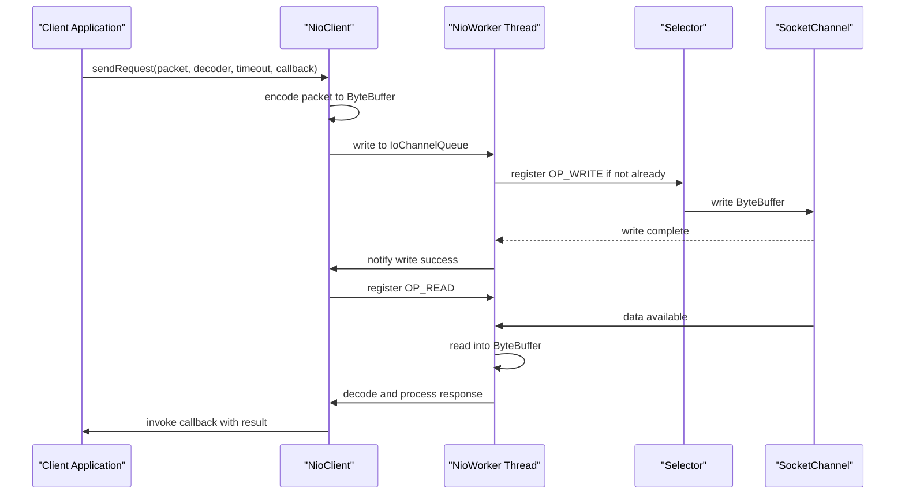
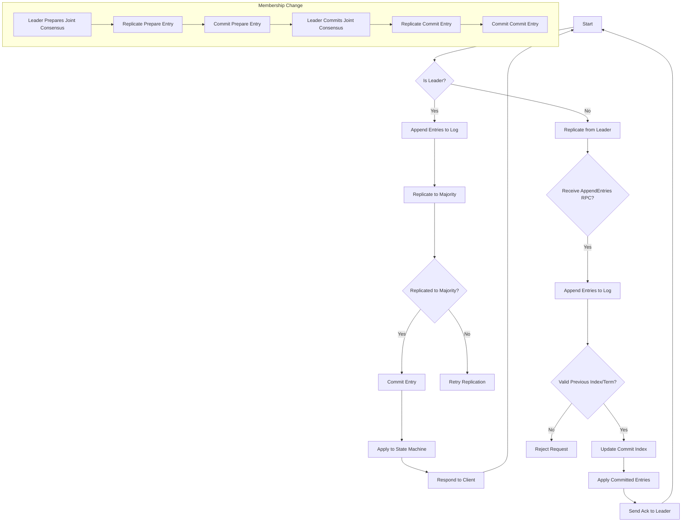
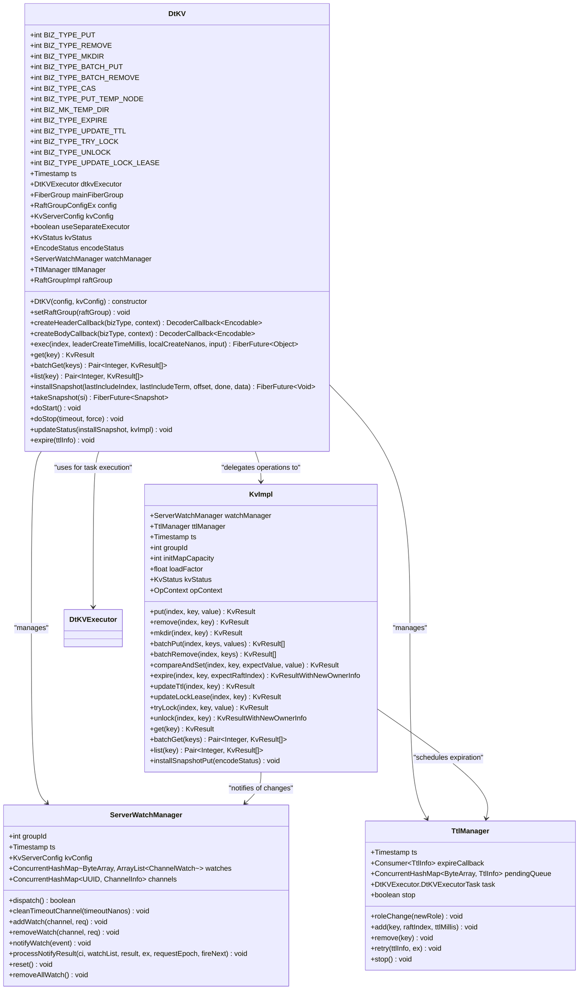
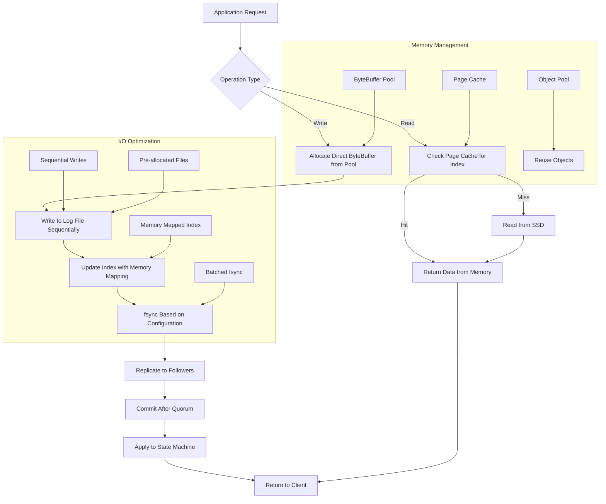

# Architecture and Design Principles

<cite>
**Referenced Files in This Document**   
- [Fiber.java](file://server/src/main/java/com/github/dtprj/dongting/fiber/Fiber.java)
- [Dispatcher.java](file://server/src/main/java/com/github/dtprj/dongting/fiber/Dispatcher.java)
- [RaftServer.java](file://server/src/main/java/com/github/dtprj/dongting/raft/server/RaftServer.java)
- [DtKV.java](file://server/src/main/java/com/github/dtprj/dongting/dtkv/server/DtKV.java)
- [DefaultRaftLog.java](file://server/src/main/java/com/github/dtprj/dongting/raft/store/DefaultRaftLog.java)
- [MemberManager.java](file://server/src/main/java/com/github/dtprj/dongting/raft/impl/MemberManager.java)
- [RaftNode.java](file://client/src/main/java/com/github/dtprj/dongting/raft/RaftNode.java)
- [NioServer.java](file://client/src/main/java/com/github/dtprj/dongting/net/NioServer.java)
- [KvClient.java](file://client/src/main/java/com/github/dtprj/dongting/dtkv/KvClient.java)
</cite>

## Table of Contents
1. [Introduction](#introduction)
2. [Core Design Principles](#core-design-principles)
3. [Fiber-Based Concurrency Model](#fiber-based-concurrency-model)
4. [Non-Blocking I/O and Network Architecture](#non-blocking-io-and-network-architecture)
5. [RAFT Consensus Implementation](#raft-consensus-implementation)
6. [DtKV State Machine](#dtkv-state-machine)
7. [Memory and I/O Optimizations](#memory-and-io-optimizations)
8. [System Context and Component Interactions](#system-context-and-component-interactions)
9. [Scalability and Deployment Topologies](#scalability-and-deployment-topologies)
10. [Trade-offs and Design Rationale](#trade-offs-and-design-rationale)

## Introduction
Dongting is a high-performance distributed system engine that integrates RAFT consensus, a tree-structured distributed configuration server (DtKV), low-level RPC, and planned message queue capabilities. The system is designed with performance-oriented programming principles, achieving exceptional throughput benchmarks on commodity hardware. With zero external dependencies and a minimal footprint (under 1MB for both client and server JARs), Dongting can be easily embedded into applications. The architecture supports multi-RAFT groups within a single process, enabling dynamic scaling and sharding capabilities. This documentation details the core architectural principles, including the fiber-based concurrency model, non-blocking I/O, RAFT implementation with joint consensus for safe membership changes, and the DtKV state machine that provides linearizable consistency guarantees.

## Core Design Principles

Dongting's architecture is founded on several key design principles that prioritize performance, reliability, and simplicity. The system achieves zero external dependencies by implementing all critical components internally, including custom queues, object pools, and unsafe operations. This eliminates dependency management issues and reduces the deployment footprint significantly. Performance-oriented programming is central to Dongting's design, with optimizations informed by modern hardware characteristics such as SSD storage, CPU caches, and NUMA architectures. The system provides linearizable consistency guarantees through the RAFT consensus algorithm, ensuring that all operations appear to occur instantaneously at some point between their invocation and completion. The architecture supports multi-RAFT groups running within a single process, allowing for dynamic addition, removal, and updating of RAFT groups to enable cluster scaling. The state machine in the RAFT framework is customizable, with DtKV serving as the default implementation for a tree-based distributed configuration server.

**Section sources**
- [README.md](file://README.md#L4-L141)
- [Fiber.java](file://server/src/main/java/com/github/dtprj/dongting/fiber/Fiber.java#L1-L237)
- [RaftServer.java](file://server/src/main/java/com/github/dtprj/dongting/raft/server/RaftServer.java#L1-L718)

## Fiber-Based Concurrency Model

Dongting implements a lightweight fiber-based concurrency model as an alternative to the traditional thread-per-request approach. Fibers are user-space threads managed by a dispatcher that runs on a single OS thread, enabling efficient context switching without kernel involvement. Each fiber maintains its own execution stack through a linked list of FiberFrame objects, allowing for suspension and resumption at specific points. The Dispatcher class manages multiple FiberGroups, each representing a logical group of fibers that can be started and stopped together. Fibers are scheduled using a priority queue based on their scheduled wake-up time, with immediate execution for ready fibers. The model uses cooperative multitasking, where fibers explicitly yield control using methods like `Fiber.yield()` or `Fiber.sleep()`, allowing the dispatcher to switch to other ready fibers. This approach minimizes context switching overhead and enables handling of tens of thousands of concurrent operations with minimal memory footprint.



**Diagram sources **
- [Fiber.java](file://server/src/main/java/com/github/dtprj/dongting/fiber/Fiber.java#L1-L237)
- [Dispatcher.java](file://server/src/main/java/com/github/dtprj/dongting/fiber/Dispatcher.java#L1-L655)
- [FiberFuture.java](file://server/src/main/java/com/github/dtprj/dongting/fiber/FiberFuture.java#L1-L353)

**Section sources**
- [Fiber.java](file://server/src/main/java/com/github/dtprj/dongting/fiber/Fiber.java#L1-L237)
- [Dispatcher.java](file://server/src/main/java/com/github/dtprj/dongting/fiber/Dispatcher.java#L1-L655)
- [devlogs/2024_07_16_3000行代码实现fiber.md](file://devlogs/2024_07_16_3000行代码实现fiber.md#L249-L264)

## Non-Blocking I/O and Network Architecture

Dongting's network architecture is built on non-blocking I/O using Java NIO, with a dedicated dispatcher thread managing multiple worker threads for I/O operations. The NioServer class implements a reactor pattern, where a single accept thread handles new connections and distributes them across multiple NioWorker threads based on a hash of the socket channel. Each NioWorker runs its own selector loop, processing read and write operations without blocking. The system uses a custom codec framework for message serialization and deserialization, supporting both synchronous and asynchronous operations. The network layer is designed to handle high-throughput scenarios with minimal latency, leveraging direct ByteBuffer allocation and efficient memory management through object pooling. The architecture separates the replication port (used for internal RAFT communication between nodes) from the service port (used for client connections), allowing independent scaling and security configurations.



**Diagram sources **
- [NioServer.java](file://client/src/main/java/com/github/dtprj/dongting/net/NioServer.java#L1-L293)
- [NioClient.java](file://client/src/main/java/com/github/dtprj/dongting/net/NioClient.java#L1-L500)
- [NioWorker.java](file://client/src/main/java/com/github/dtprj/dongting/net/NioWorker.java#L1-L300)

**Section sources**
- [NioServer.java](file://client/src/main/java/com/github/dtprj/dongting/net/NioServer.java#L1-L293)
- [NioClient.java](file://client/src/main/java/com/github/dtprj/dongting/net/NioClient.java#L1-L500)
- [NetException.java](file://client/src/main/java/com/github/dtprj/dongting/net/NetException.java#L1-L50)

## RAFT Consensus Implementation

Dongting implements the RAFT consensus algorithm with several enhancements for production readiness and operational safety. The implementation supports joint consensus for safe membership changes, allowing clusters to transition between configurations without downtime or risk of split-brain. The RAFT server manages multiple RAFT groups within a single process, each with its own state machine and configuration. The algorithm ensures linearizable consistency by requiring a majority quorum for both leader election and log replication. Leaders maintain a lease-based mechanism to detect failure and prevent stale leaders from serving requests. The implementation includes optimizations such as log compaction through snapshotting and efficient log replication using pipelining. The system handles joint consensus in three phases: first, the old and new configurations jointly agree on new log entries; second, the leader commits a configuration change entry; and third, the system operates under the new configuration alone.



**Diagram sources **
- [RaftServer.java](file://server/src/main/java/com/github/dtprj/dongting/raft/server/RaftServer.java#L1-L718)
- [MemberManager.java](file://server/src/main/java/com/github/dtprj/dongting/raft/impl/MemberManager.java#L1-L800)
- [RaftNode.java](file://client/src/main/java/com/github/dtprj/dongting/raft/RaftNode.java#L1-L182)

**Section sources**
- [RaftServer.java](file://server/src/main/java/com/github/dtprj/dongting/raft/server/RaftServer.java#L1-L718)
- [MemberManager.java](file://server/src/main/java/com/github/dtprj/dongting/raft/impl/MemberManager.java#L1-L800)
- [VoteManager.java](file://server/src/main/java/com/github/dtprj/dongting/raft/impl/VoteManager.java#L1-L200)

## DtKV State Machine

The DtKV component serves as the default state machine implementation for Dongting's RAFT framework, providing a tree-structured distributed key-value store with linearizable semantics. DtKV supports various operations including get/put/remove, batch operations, directory-like structures using dot notation, compare-and-set operations, TTL-based expiration, and distributed locking. The state machine processes RAFT log entries by applying the corresponding operations to an in-memory data structure, ensuring that all changes are replicated across the cluster through the RAFT consensus algorithm. For read operations, DtKV leverages RAFT's lease-read capability to serve linearizable reads from followers without contacting the leader, significantly improving read throughput. The implementation includes optimizations such as efficient data structures for the tree hierarchy and careful management of memory allocation to minimize garbage collection pressure. DtKV also supports watch operations that notify clients of changes to specific keys or directories.



**Diagram sources **
- [DtKV.java](file://server/src/main/java/com/github/dtprj/dongting/dtkv/server/DtKV.java#L1-L413)
- [KvImpl.java](file://server/src/main/java/com/github/dtprj/dongting/dtkv/server/KvImpl.java#L1-L500)
- [ServerWatchManager.java](file://server/src/main/java/com/github/dtprj/dongting/dtkv/server/ServerWatchManager.java#L1-L300)

**Section sources**
- [DtKV.java](file://server/src/main/java/com/github/dtprj/dongting/dtkv/server/DtKV.java#L1-L413)
- [KvImpl.java](file://server/src/main/java/com/github/dtprj/dongting/dtkv/server/KvImpl.java#L1-L500)
- [KvClient.java](file://client/src/main/java/com/github/dtprj/dongting/dtkv/KvClient.java#L1-L771)

## Memory and I/O Optimizations

Dongting incorporates numerous memory and I/O optimizations informed by modern hardware characteristics to achieve high performance. The system uses custom object pools for ByteBuffers and other frequently allocated objects, reducing garbage collection pressure and allocation overhead. Direct ByteBuffers are preferred for I/O operations to avoid unnecessary copying between Java heap and native memory. The RAFT log storage is optimized for SSDs with sequential writes and efficient file management, using separate files for log entries and indexes to enable fast recovery. Log files are pre-allocated to avoid fragmentation and ensure consistent write performance. The implementation uses memory-mapped files for index access, leveraging the operating system's page cache for frequently accessed data. For CPU cache optimization, data structures are padded to prevent false sharing, and critical paths are designed to minimize pointer chasing. The system also implements efficient serialization using a custom codec framework that avoids reflection and generates compact binary representations.



**Diagram sources **
- [DefaultRaftLog.java](file://server/src/main/java/com/github/dtprj/dongting/raft/store/DefaultRaftLog.java#L1-L416)
- [LogFileQueue.java](file://server/src/main/java/com/github/dtprj/dongting/raft/store/LogFileQueue.java#L1-L300)
- [IdxFileQueue.java](file://server/src/main/java/com/github/dtprj/dongting/raft/store/IdxFileQueue.java#L1-L200)
- [ByteBufferPool.java](file://client/src/main/java/com/github/dtprj/dongting/buf/ByteBufferPool.java#L1-L100)

**Section sources**
- [DefaultRaftLog.java](file://server/src/main/java/com/github/dtprj/dongting/raft/store/DefaultRaftLog.java#L1-L416)
- [LogFileQueue.java](file://server/src/main/java/com/github/dtprj/dongting/raft/store/LogFileQueue.java#L1-L300)
- [devlogs/2023_07_20_现代硬件下的IO程序开发.txt](file://devlogs/2023_07_20_现代硬件下的IO程序开发.txt#L1-L50)

## System Context and Component Interactions

Dongting's architecture consists of several interconnected components that work together to provide a distributed consensus system. The core components include the fiber-based concurrency model, non-blocking I/O network layer, RAFT consensus implementation, and DtKV state machine. These components interact through well-defined interfaces and message passing mechanisms. The system context shows how clients connect to the RAFT cluster through the service port, while RAFT nodes communicate with each other through the replication port. The dispatcher manages fibers for each RAFT group, coordinating the execution of consensus algorithms and state machine operations. The component interaction model illustrates the flow of operations from client requests through consensus agreement to state machine application and response.

```mermaid
graph TD
subgraph "Client Side"
ClientApp[Client Application]
KvClient[KvClient]
NioClient[NioClient]
end
subgraph "Server Side"
NioServer[NioServer]
RaftServer[RaftServer]
Dispatcher[Dispatcher]
FiberGroup[FiberGroup]
RaftGroup[RaftGroup]
DtKV[DtKV]
RaftLog[RaftLog]
end
ClientApp --> KvClient
KvClient --> NioClient
NioClient < --> |Service Port| NioServer
NioServer --> RaftServer
RaftServer --> Dispatcher
Dispatcher --> FiberGroup
FiberGroup --> RaftGroup
RaftGroup --> DtKV
RaftGroup --> RaftLog
DtKV --> RaftLog
RaftLog --> |Replication Port| NioClient
NioClient < --> |Replication Port| NioServer
RaftGroup < --> |Membership Changes| RaftNode
style ClientApp fill:#f9f,stroke:#333
style Server Side fill:#bbf,stroke:#333
```

**Diagram sources **
- [RaftServer.java](file://server/src/main/java/com/github/dtprj/dongting/raft/server/RaftServer.java#L1-L718)
- [KvClient.java](file://client/src/main/java/com/github/dtprj/dongting/dtkv/KvClient.java#L1-L771)
- [NioServer.java](file://client/src/main/java/com/github/dtprj/dongting/net/NioServer.java#L1-L293)
- [NioClient.java](file://client/src/main/java/com/github/dtprj/dongting/net/NioClient.java#L1-L500)

**Section sources**
- [RaftServer.java](file://server/src/main/java/com/github/dtprj/dongting/raft/server/RaftServer.java#L1-L718)
- [KvClient.java](file://client/src/main/java/com/github/dtprj/dongting/dtkv/KvClient.java#L1-L771)
- [docs/README.md](file://docs/README.md#L1-L108)

## Scalability and Deployment Topologies

Dongting supports various deployment topologies to accommodate different scalability requirements and operational constraints. The system can be deployed in standalone mode with a single-node RAFT group for development and testing, or in clustered mode with three or more nodes for production environments requiring high availability. The architecture supports multi-RAFT groups within a single process, enabling sharding and dynamic scaling of cluster capacity. Deployment topologies include embedded mode where servers and clients run in the same process, cluster mode with separate server processes, and hybrid configurations. The system's zero-dependency design allows for easy embedding into existing applications without complex dependency management. For large-scale deployments, Dongting can be configured with observers to handle read-heavy workloads, offloading read operations from the consensus group while maintaining linearizable consistency.

```mermaid
graph TD
subgraph "Standalone Deployment"
S1[Single Node]
S1 --> S1
end
subgraph "Cluster Deployment"
C1[Node 1]
C2[Node 2]
C3[Node 3]
C1 < --> C2
C2 < --> C3
C3 < --> C1
end
subgraph "Multi-RAFT Deployment"
M1[Node 1]
M2[Node 2]
M3[Node 3]
M1 < --> M2
M2 < --> M3
M3 < --> M1
M1 --> |Group 101| M1
M1 --> |Group 102| M1
M2 --> |Group 101| M2
M2 --> |Group 102| M2
M3 --> |Group 101| M3
M3 --> |Group 102| M3
end
subgraph "Observer Deployment"
O1[Leader]
O2[Follower]
O3[Follower]
O4[Observer]
O5[Observer]
O1 < --> O2
O2 < --> O3
O3 < --> O1
O1 --> O4
O1 --> O5
end
subgraph "Embedded Deployment"
E1[Application]
E2[RAFT Server]
E3[RAFT Client]
E1 --> E2
E1 --> E3
E2 < --> E3
end
```

**Diagram sources **
- [demos/standalone](file://demos/src/main/java/com/github/dtprj/dongting/demos/standalone#L1-L50)
- [demos/cluster](file://demos/src/main/java/com/github/dtprj/dongting/demos/cluster#L1-L50)
- [demos/multiraft](file://demos/src/main/java/com/github/dtprj/dongting/demos/multiraft#L1-L50)
- [demos/embedded](file://demos/src/main/java/com/github/dtprj/dongting/demos/embedded#L1-L50)

**Section sources**
- [demos/README.md](file://demos/README.md#L1-L50)
- [RaftServer.java](file://server/src/main/java/com/github/dtprj/dongting/raft/server/RaftServer.java#L1-L718)
- [KvClient.java](file://client/src/main/java/com/github/dtprj/dongting/dtkv/KvClient.java#L1-L771)

## Trade-offs and Design Rationale

Dongting's architecture involves several deliberate trade-offs between complexity, performance, and maintainability. The decision to implement a custom fiber-based concurrency model rather than using existing frameworks increases implementation complexity but provides fine-grained control over scheduling and eliminates external dependencies. The zero-dependency principle simplifies deployment and reduces the attack surface but requires implementing functionality that could otherwise be provided by mature third-party libraries. The focus on performance-oriented programming results in highly optimized code but may reduce readability and increase the learning curve for new developers. The use of unsafe operations and custom data structures improves performance but introduces potential stability risks that require thorough testing. The system prioritizes linearizable consistency over availability during network partitions, adhering to the CAP theorem. These trade-offs are justified by the target use cases requiring maximum throughput and minimal latency with predictable performance characteristics.

**Section sources**
- [README.md](file://README.md#L47-L69)
- [devlogs/2023_07_27_dongting的定位和原则.txt](file://devlogs/2023_07_27_dongting的定位和原则.txt#L1-L50)
- [devlogs/2023_07_28_dongting的对象池.txt](file://devlogs/2023_07_28_dongting的对象池.txt#L1-L50)
- [devlogs/2024_07_26_raft算法的工程实现秘笈.md](file://devlogs/2024_07_26_raft算法的工程实现秘笈.md#L1-L50)