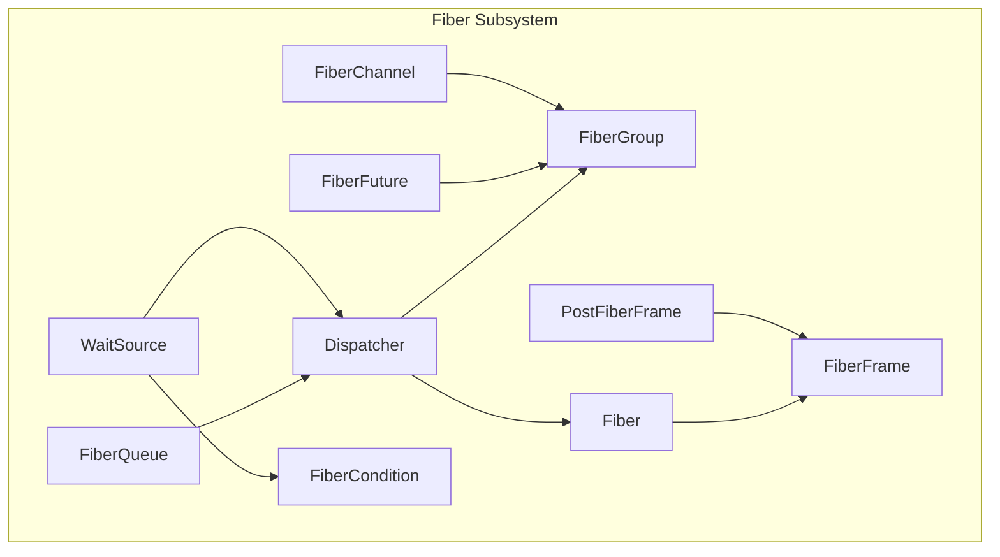
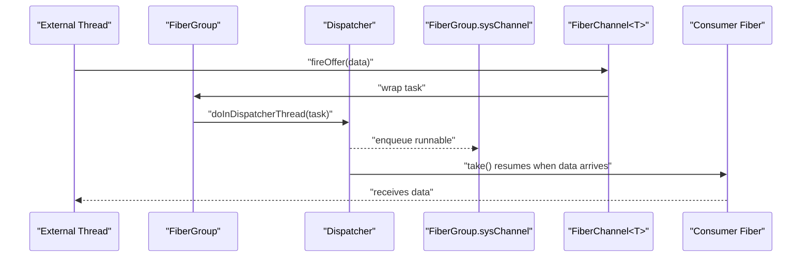
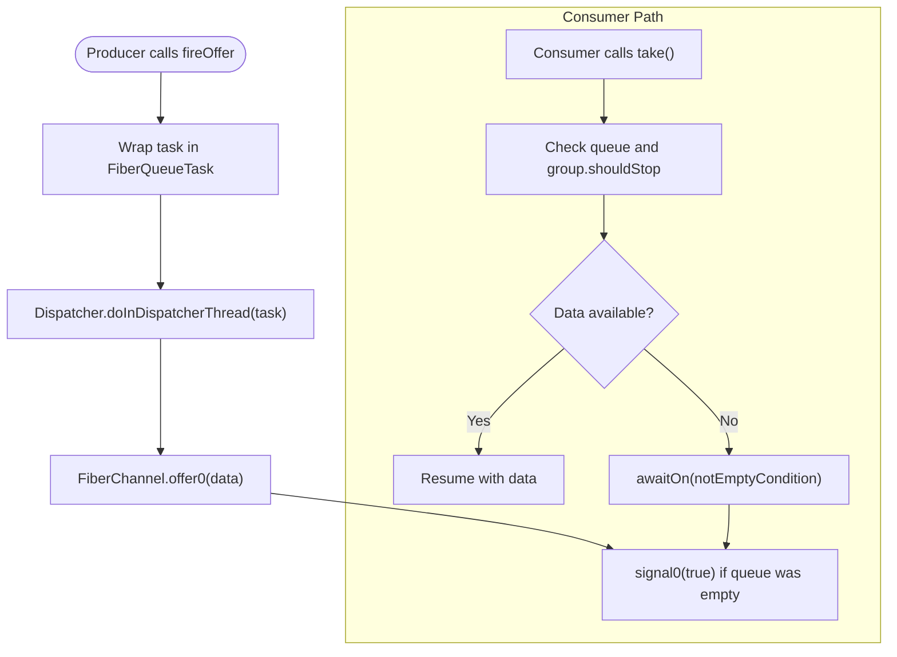
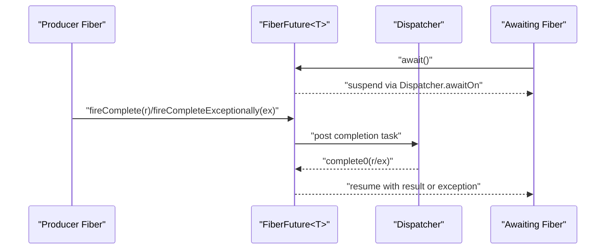
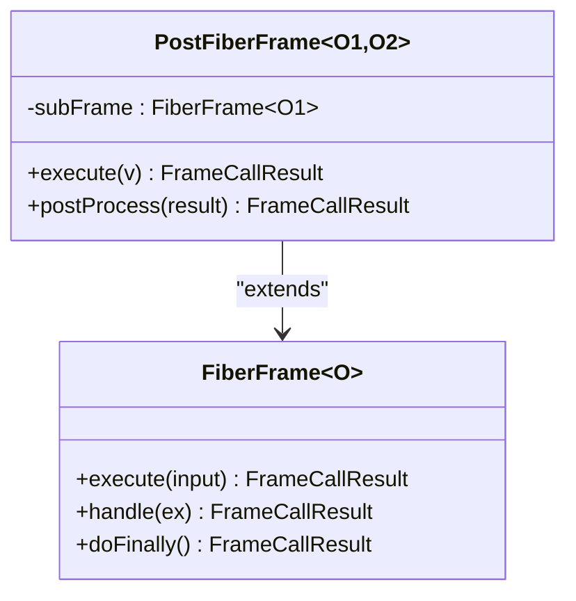
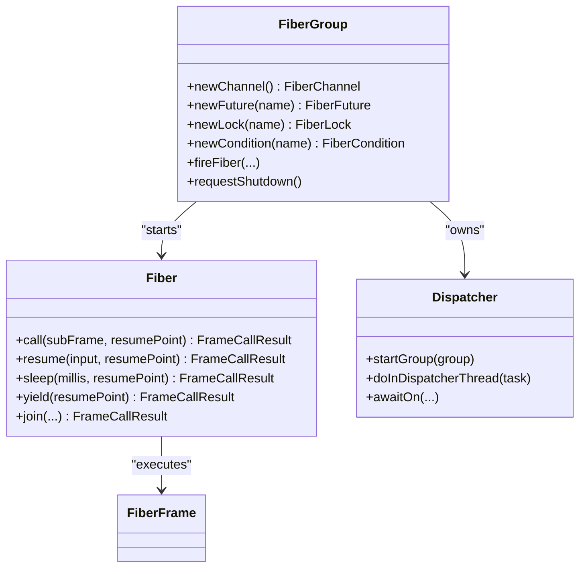
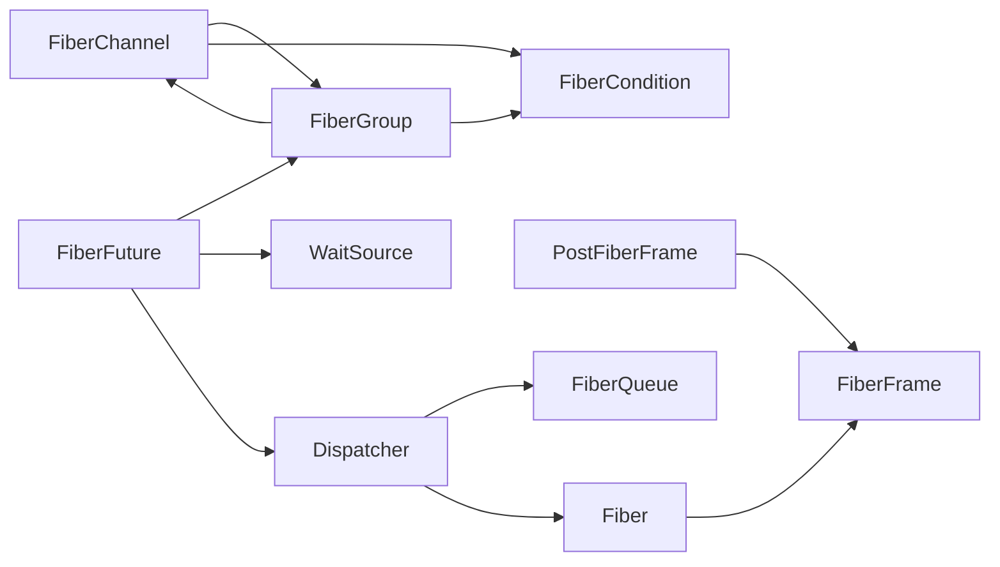

# Fiber Communication and Channels

<cite>
**Referenced Files in This Document**
- [FiberChannel.java](file://server/src/main/java/com/github/dtprj/dongting/fiber/FiberChannel.java)
- [FiberFuture.java](file://server/src/main/java/com/github/dtprj/dongting/fiber/FiberFuture.java)
- [PostFiberFrame.java](file://server/src/main/java/com/github/dtprj/dongting/fiber/PostFiberFrame.java)
- [FiberGroup.java](file://server/src/main/java/com/github/dtprj/dongting/fiber/FiberGroup.java)
- [Fiber.java](file://server/src/main/java/com/github/dtprj/dongting/fiber/Fiber.java)
- [FiberFrame.java](file://server/src/main/java/com/github/dtprj/dongting/fiber/FiberFrame.java)
- [Dispatcher.java](file://server/src/main/java/com/github/dtprj/dongting/fiber/Dispatcher.java)
- [WaitSource.java](file://server/src/main/java/com/github/dtprj/dongting/fiber/WaitSource.java)
- [FiberCondition.java](file://server/src/main/java/com/github/dtprj/dongting/fiber/FiberCondition.java)
- [FiberQueue.java](file://server/src/main/java/com/github/dtprj/dongting/fiber/FiberQueue.java)
- [ChannelTest.java](file://server/src/test/java/com/github/dtprj/dongting/fiber/ChannelTest.java)
- [FutureTest.java](file://server/src/test/java/com/github/dtprj/dongting/fiber/FutureTest.java)
- [FiberChannelTest.java](file://benchmark/src/main/java/com/github/dtprj/dongting/bench/fiber/FiberChannelTest.java)
</cite>

## Table of Contents
1. [Introduction](#introduction)
2. [Project Structure](#project-structure)
3. [Core Components](#core-components)
4. [Architecture Overview](#architecture-overview)
5. [Detailed Component Analysis](#detailed-component-analysis)
6. [Dependency Analysis](#dependency-analysis)
7. [Performance Considerations](#performance-considerations)
8. [Troubleshooting Guide](#troubleshooting-guide)
9. [Conclusion](#conclusion)
10. [Appendices](#appendices)

## Introduction
This document explains the fiber-to-fiber communication mechanisms in Dongting. It focuses on:
- FiberChannel as an unbounded, blocking queue for message passing between fibers within the same FiberGroup, with thread-safe production via fireOffer from external threads.
- FiberFuture as the primary mechanism for asynchronous result handling, supporting both callback registration and suspension via await, with integration points for external completion through fireComplete.
- PostFiberFrame as an abstraction for composing sequential operations and handling results from sub-fibers.
- Request-response workflows, pipeline processing, and error propagation across fiber boundaries.
- Performance considerations for channel contention and memory usage, plus best practices for resource cleanup and avoiding memory leaks in long-running fibers.

## Project Structure
Dongting’s fiber subsystem resides primarily under server/src/main/java/com/github/dtprj/dongting/fiber. The key files include:
- FiberChannel: unbounded, blocking queue for intra-group message passing.
- FiberFuture: asynchronous result container with callbacks and composition.
- PostFiberFrame: helper for chaining frames and post-processing results.
- FiberGroup: lifecycle and scheduling coordination for fibers.
- Fiber and FiberFrame: execution model and stack frames.
- Dispatcher: scheduler coordinating fiber execution and waits.
- WaitSource and FiberCondition: primitives for signaling and awaiting.
- FiberQueue: internal queue for cross-thread tasks.

**Diagram sources**
- [FiberChannel.java](file://server/src/main/java/com/github/dtprj/dongting/fiber/FiberChannel.java#L1-L197)
- [FiberFuture.java](file://server/src/main/java/com/github/dtprj/dongting/fiber/FiberFuture.java#L1-L354)
- [PostFiberFrame.java](file://server/src/main/java/com/github/dtprj/dongting/fiber/PostFiberFrame.java#L1-L18)
- [FiberGroup.java](file://server/src/main/java/com/github/dtprj/dongting/fiber/FiberGroup.java#L1-L353)
- [Fiber.java](file://server/src/main/java/com/github/dtprj/dongting/fiber/Fiber.java#L1-L237)
- [FiberFrame.java](file://server/src/main/java/com/github/dtprj/dongting/fiber/FiberFrame.java#L1-L115)
- [Dispatcher.java](file://server/src/main/java/com/github/dtprj/dongting/fiber/Dispatcher.java#L1-L655)
- [WaitSource.java](file://server/src/main/java/com/github/dtprj/dongting/fiber/WaitSource.java#L1-L78)
- [FiberCondition.java](file://server/src/main/java/com/github/dtprj/dongting/fiber/FiberCondition.java#L1-L99)
- [FiberQueue.java](file://server/src/main/java/com/github/dtprj/dongting/fiber/FiberQueue.java#L1-L138)

**Section sources**
- [FiberChannel.java](file://server/src/main/java/com/github/dtprj/dongting/fiber/FiberChannel.java#L1-L197)
- [FiberFuture.java](file://server/src/main/java/com/github/dtprj/dongting/fiber/FiberFuture.java#L1-L354)
- [PostFiberFrame.java](file://server/src/main/java/com/github/dtprj/dongting/fiber/PostFiberFrame.java#L1-L18)
- [FiberGroup.java](file://server/src/main/java/com/github/dtprj/dongting/fiber/FiberGroup.java#L1-L353)
- [Fiber.java](file://server/src/main/java/com/github/dtprj/dongting/fiber/Fiber.java#L1-L237)
- [FiberFrame.java](file://server/src/main/java/com/github/dtprj/dongting/fiber/FiberFrame.java#L1-L115)
- [Dispatcher.java](file://server/src/main/java/com/github/dtprj/dongting/fiber/Dispatcher.java#L1-L655)
- [WaitSource.java](file://server/src/main/java/com/github/dtprj/dongting/fiber/WaitSource.java#L1-L78)
- [FiberCondition.java](file://server/src/main/java/com/github/dtprj/dongting/fiber/FiberCondition.java#L1-L99)
- [FiberQueue.java](file://server/src/main/java/com/github/dtprj/dongting/fiber/FiberQueue.java#L1-L138)

## Core Components
- FiberChannel<T>: An unbounded queue that blocks only the consumer. Producers can safely enqueue from external threads via fireOffer, which posts a task to the owning FiberGroup’s dispatcher. Consumers await via take/takeAll and resume automatically when data arrives.
- FiberFuture<T>: Asynchronous result container with:
  - Completion from within the group via complete/completeExceptionally or externally via fireComplete/fireCompleteExceptionally.
  - Suspension-based await with timeout support.
  - Callback registration (simple BiConsumer or FiberFutureCallback) and composition helpers (convert, convertWithHandle, compose).
- PostFiberFrame<O1,O2>: A convenience frame that runs a subFrame and then applies a postProcess function to transform or handle the result.
- FiberGroup: Manages fiber lifecycles, readiness queues, and system channels; exposes creation of channels, futures, locks, and conditions.
- Fiber and FiberFrame: Execution model with stack frames, call/resume semantics, and suspension via Dispatcher.
- Dispatcher: Schedules fibers, manages wait queues, and coordinates cross-thread task submission.
- WaitSource and FiberCondition: Base signaling/waiting primitives used by FiberFuture and FiberChannel.

**Section sources**
- [FiberChannel.java](file://server/src/main/java/com/github/dtprj/dongting/fiber/FiberChannel.java#L1-L197)
- [FiberFuture.java](file://server/src/main/java/com/github/dtprj/dongting/fiber/FiberFuture.java#L1-L354)
- [PostFiberFrame.java](file://server/src/main/java/com/github/dtprj/dongting/fiber/PostFiberFrame.java#L1-L18)
- [FiberGroup.java](file://server/src/main/java/com/github/dtprj/dongting/fiber/FiberGroup.java#L1-L353)
- [Fiber.java](file://server/src/main/java/com/github/dtprj/dongting/fiber/Fiber.java#L1-L237)
- [FiberFrame.java](file://server/src/main/java/com/github/dtprj/dongting/fiber/FiberFrame.java#L1-L115)
- [Dispatcher.java](file://server/src/main/java/com/github/dtprj/dongting/fiber/Dispatcher.java#L1-L655)
- [WaitSource.java](file://server/src/main/java/com/github/dtprj/dongting/fiber/WaitSource.java#L1-L78)
- [FiberCondition.java](file://server/src/main/java/com/github/dtprj/dongting/fiber/FiberCondition.java#L1-L99)

## Architecture Overview
The fiber runtime centers around a single-threaded dispatcher per group. Fibers execute frames in a stack; suspension occurs through WaitSource and FiberCondition. Cross-thread producers enqueue via FiberChannel.fireOffer, which posts a task to the group’s dispatcher. Consumers await on FiberChannel conditions and resume when data arrives.

**Diagram sources**
- [FiberChannel.java](file://server/src/main/java/com/github/dtprj/dongting/fiber/FiberChannel.java#L52-L75)
- [FiberGroup.java](file://server/src/main/java/com/github/dtprj/dongting/fiber/FiberGroup.java#L48-L60)
- [Dispatcher.java](file://server/src/main/java/com/github/dtprj/dongting/fiber/Dispatcher.java#L629-L643)
- [Fiber.java](file://server/src/main/java/com/github/dtprj/dongting/fiber/Fiber.java#L71-L84)

## Detailed Component Analysis

### FiberChannel<T>
- Unbounded queue semantics: producer never blocks; consumer blocks until data arrives or group stops.
- Thread-safe production: fireOffer enqueues a task on the owning group’s dispatcher; if the group is stopping, a dispatchFailCallback can be invoked.
- Consumption:
  - take(): returns immediately if data is available; otherwise suspends until signaled or group stop.
  - takeAll(): drains all queued items into a collection and resumes.
- Internal signaling:
  - Uses FiberCondition.notEmptyCondition to wake consumers.
  - Supports awaitOn with group.shouldStopCondition when returnOnShouldStop is true.

**Diagram sources**
- [FiberChannel.java](file://server/src/main/java/com/github/dtprj/dongting/fiber/FiberChannel.java#L52-L133)
- [FiberChannel.java](file://server/src/main/java/com/github/dtprj/dongting/fiber/FiberChannel.java#L135-L191)
- [FiberCondition.java](file://server/src/main/java/com/github/dtprj/dongting/fiber/FiberCondition.java#L48-L73)
- [FiberGroup.java](file://server/src/main/java/com/github/dtprj/dongting/fiber/FiberGroup.java#L39-L62)

**Section sources**
- [FiberChannel.java](file://server/src/main/java/com/github/dtprj/dongting/fiber/FiberChannel.java#L1-L197)
- [FiberCondition.java](file://server/src/main/java/com/github/dtprj/dongting/fiber/FiberCondition.java#L1-L99)
- [FiberGroup.java](file://server/src/main/java/com/github/dtprj/dongting/fiber/FiberGroup.java#L1-L120)

### FiberFuture<T>
- Completion:
  - complete/completeExceptionally: complete synchronously inside the group.
  - fireComplete/fireCompleteExceptionally: complete from external threads; posts a task to the group’s dispatcher; if the group is finished or dispatcher shutdown, logs a warning and ignores completion.
- Awaiting:
  - await/millis await: suspend current fiber until completion or timeout; on timeout, sets a FiberTimeoutException on the waiting fiber.
- Callbacks:
  - registerCallback(FiberFutureCallback): starts a new fiber to run the callback when complete.
  - registerCallback(BiConsumer): executes inline callback when complete.
- Composition:
  - convert(name, Function): transforms result or propagates exception to a new FiberFuture.
  - convertWithHandle(name, BiFunction): passes both result and exception to a converter.
  - compose(name, Function): chains another FiberFuture computation.
- Utilities:
  - allOf(name, FiberFuture...): aggregates multiple futures and completes when all complete.
  - failedFuture/completedFuture: convenience factories.

**Diagram sources**
- [FiberFuture.java](file://server/src/main/java/com/github/dtprj/dongting/fiber/FiberFuture.java#L86-L121)
- [FiberFuture.java](file://server/src/main/java/com/github/dtprj/dongting/fiber/FiberFuture.java#L173-L186)
- [Dispatcher.java](file://server/src/main/java/com/github/dtprj/dongting/fiber/Dispatcher.java#L422-L463)

**Section sources**
- [FiberFuture.java](file://server/src/main/java/com/github/dtprj/dongting/fiber/FiberFuture.java#L1-L354)
- [Dispatcher.java](file://server/src/main/java/com/github/dtprj/dongting/fiber/Dispatcher.java#L422-L463)

### PostFiberFrame<O1,O2>
- Runs a subFrame and then applies postProcess to the result.
- Typical usage: wrap a subFrame and apply postProcess to handle or transform the outcome.

**Diagram sources**
- [PostFiberFrame.java](file://server/src/main/java/com/github/dtprj/dongting/fiber/PostFiberFrame.java#L1-L18)
- [FiberFrame.java](file://server/src/main/java/com/github/dtprj/dongting/fiber/FiberFrame.java#L1-L115)

**Section sources**
- [PostFiberFrame.java](file://server/src/main/java/com/github/dtprj/dongting/fiber/PostFiberFrame.java#L1-L18)
- [FiberFrame.java](file://server/src/main/java/com/github/dtprj/dongting/fiber/FiberFrame.java#L1-L115)

### FiberGroup, Fiber, and Dispatcher
- FiberGroup:
  - Creates channels, futures, locks, and conditions.
  - Manages ready queues and daemon/normal fibers.
  - Provides sysChannel for internal tasks and group runner fiber.
- Fiber:
  - Stack-based execution model; call/resume semantics.
  - join and sleep/yield utilities; fatal exceptions trigger group shutdown.
- Dispatcher:
  - Single-threaded scheduler per group.
  - Coordinates fiber execution, scheduling, and waiting.
  - doInDispatcherThread enables cross-thread task posting.

**Diagram sources**
- [FiberGroup.java](file://server/src/main/java/com/github/dtprj/dongting/fiber/FiberGroup.java#L65-L142)
- [Fiber.java](file://server/src/main/java/com/github/dtprj/dongting/fiber/Fiber.java#L71-L120)
- [Dispatcher.java](file://server/src/main/java/com/github/dtprj/dongting/fiber/Dispatcher.java#L115-L147)
- [Dispatcher.java](file://server/src/main/java/com/github/dtprj/dongting/fiber/Dispatcher.java#L629-L643)

**Section sources**
- [FiberGroup.java](file://server/src/main/java/com/github/dtprj/dongting/fiber/FiberGroup.java#L1-L353)
- [Fiber.java](file://server/src/main/java/com/github/dtprj/dongting/fiber/Fiber.java#L1-L237)
- [Dispatcher.java](file://server/src/main/java/com/github/dtprj/dongting/fiber/Dispatcher.java#L1-L655)

## Dependency Analysis
- FiberChannel depends on FiberGroup for ownership and condition signaling; uses IndexedQueue internally.
- FiberFuture depends on FiberGroup for scheduling and callback execution; uses WaitSource and Dispatcher for awaiting and signaling.
- PostFiberFrame depends on FiberFrame and Fiber.call for chaining.
- FiberGroup composes FiberChannel as sysChannel and orchestrates fiber lifecycle.
- Dispatcher coordinates all waits and scheduling; FiberQueue is the internal task queue.

**Diagram sources**
- [FiberChannel.java](file://server/src/main/java/com/github/dtprj/dongting/fiber/FiberChannel.java#L1-L197)
- [FiberFuture.java](file://server/src/main/java/com/github/dtprj/dongting/fiber/FiberFuture.java#L1-L354)
- [PostFiberFrame.java](file://server/src/main/java/com/github/dtprj/dongting/fiber/PostFiberFrame.java#L1-L18)
- [FiberGroup.java](file://server/src/main/java/com/github/dtprj/dongting/fiber/FiberGroup.java#L1-L353)
- [Fiber.java](file://server/src/main/java/com/github/dtprj/dongting/fiber/Fiber.java#L1-L237)
- [Dispatcher.java](file://server/src/main/java/com/github/dtprj/dongting/fiber/Dispatcher.java#L1-L655)
- [FiberQueue.java](file://server/src/main/java/com/github/dtprj/dongting/fiber/FiberQueue.java#L1-L138)

**Section sources**
- [FiberChannel.java](file://server/src/main/java/com/github/dtprj/dongting/fiber/FiberChannel.java#L1-L197)
- [FiberFuture.java](file://server/src/main/java/com/github/dtprj/dongting/fiber/FiberFuture.java#L1-L354)
- [PostFiberFrame.java](file://server/src/main/java/com/github/dtprj/dongting/fiber/PostFiberFrame.java#L1-L18)
- [FiberGroup.java](file://server/src/main/java/com/github/dtprj/dongting/fiber/FiberGroup.java#L1-L353)
- [Fiber.java](file://server/src/main/java/com/github/dtprj/dongting/fiber/Fiber.java#L1-L237)
- [Dispatcher.java](file://server/src/main/java/com/github/dtprj/dongting/fiber/Dispatcher.java#L1-L655)
- [FiberQueue.java](file://server/src/main/java/com/github/dtprj/dongting/fiber/FiberQueue.java#L1-L138)

## Performance Considerations
- Channel contention:
  - FiberChannel is unbounded and only blocks consumers. Producer throughput is not limited by the queue depth; however, excessive external thread submissions can increase dispatcher load. Prefer batching messages when possible to reduce context switches.
- Memory usage:
  - Unbounded queues can grow indefinitely under sustained load. Monitor queue sizes and consider backpressure or bounded alternatives if memory pressure is observed.
- Dispatcher overhead:
  - Dispatcher schedules fibers and polls tasks. Excessive small tasks can increase overhead. Use Fiber.yield judiciously and coalesce work where feasible.
- Callback execution:
  - Callbacks registered on FiberFuture may spawn new fibers. Limit heavy work in callbacks; offload to dedicated fibers or use composition to keep frames lightweight.
- Shutdown and cleanup:
  - On group shutdown, FiberFuture and FiberChannel operations may ignore completions or offers. Ensure producers and consumers coordinate shutdown to avoid leaks.

[No sources needed since this section provides general guidance]

## Troubleshooting Guide
- Channel wakeup latency:
  - Tests demonstrate that fireOffer wakes waiting consumers promptly. If delays occur, verify the consumer is actually waiting and not blocked elsewhere.
- Timeout and interruption:
  - FiberFuture.await supports timeouts and interrupts. Inspect FiberTimeoutException and FiberInterruptException to diagnose issues.
- External completion:
  - fireComplete/fireCompleteExceptionally logs warnings if the dispatcher or group is shutting down. Ensure completion happens before shutdown.
- Group logging:
  - FiberGroup.fireLogGroupInfo can help diagnose stuck fibers and pending tasks.

**Section sources**
- [ChannelTest.java](file://server/src/test/java/com/github/dtprj/dongting/fiber/ChannelTest.java#L121-L146)
- [FutureTest.java](file://server/src/test/java/com/github/dtprj/dongting/fiber/FutureTest.java#L36-L61)
- [FutureTest.java](file://server/src/test/java/com/github/dtprj/dongting/fiber/FutureTest.java#L63-L134)
- [FiberGroup.java](file://server/src/main/java/com/github/dtprj/dongting/fiber/FiberGroup.java#L243-L276)

## Conclusion
Dongting’s fiber communication primitives provide a robust foundation for high-throughput, low-latency inter-fiber messaging and asynchronous result handling:
- FiberChannel enables efficient, unbounded, thread-safe message passing within a FiberGroup.
- FiberFuture offers flexible completion and composition patterns, with both synchronous and external completion paths.
- PostFiberFrame simplifies sequential composition and post-processing.
- Proper use of await, signals, and group lifecycle ensures predictable error propagation and graceful shutdown.

[No sources needed since this section summarizes without analyzing specific files]

## Appendices

### Patterns and Examples

- Request-response workflow:
  - Producer fiber creates a FiberFuture, sends a request via FiberChannel, awaits the future, and resumes upon completion.
  - Consumer fiber receives the request via FiberChannel, performs work, and completes the future via fireComplete.

- Pipeline processing:
  - Chain multiple FiberFrames using PostFiberFrame to transform results incrementally, or use FiberFuture.compose for asynchronous chaining.

- Error propagation:
  - Use FiberFuture.completeExceptionally or fireCompleteExceptionally to propagate errors. Awaiting fibers will receive the exception and can handle it via FiberFrame.handle.

- Benchmark usage:
  - FiberChannelTest demonstrates producer/consumer fibers using FiberChannel within a group, yielding for fairness and testing throughput.

**Section sources**
- [FiberChannelTest.java](file://benchmark/src/main/java/com/github/dtprj/dongting/bench/fiber/FiberChannelTest.java#L32-L99)
- [PostFiberFrame.java](file://server/src/main/java/com/github/dtprj/dongting/fiber/PostFiberFrame.java#L1-L18)
- [FiberFuture.java](file://server/src/main/java/com/github/dtprj/dongting/fiber/FiberFuture.java#L285-L308)