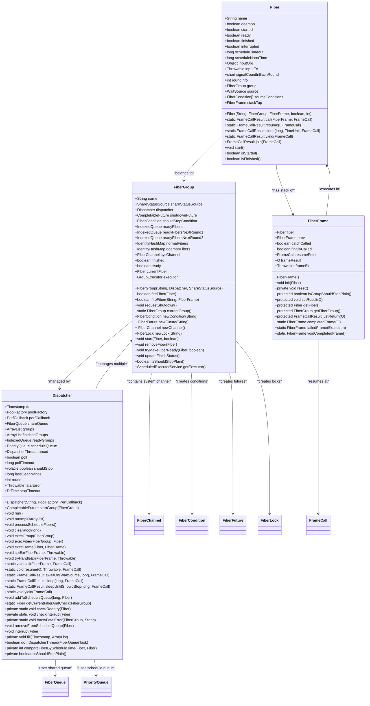
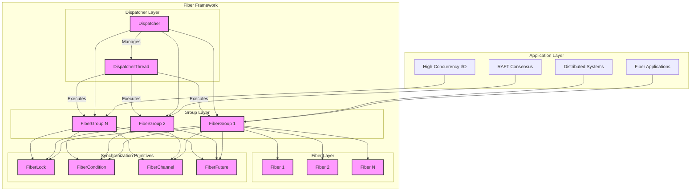
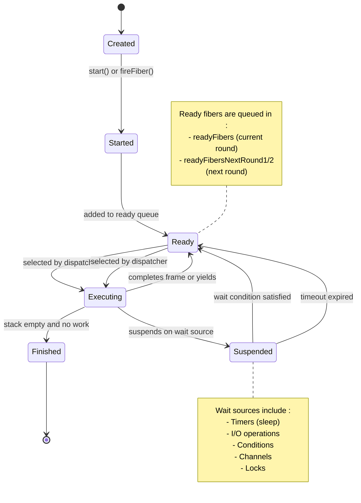
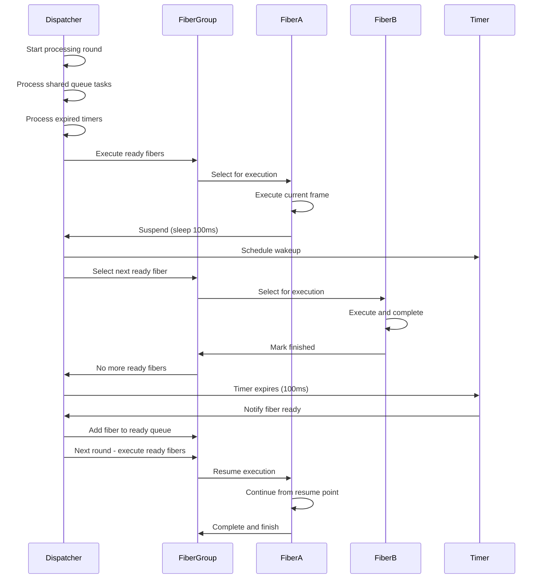
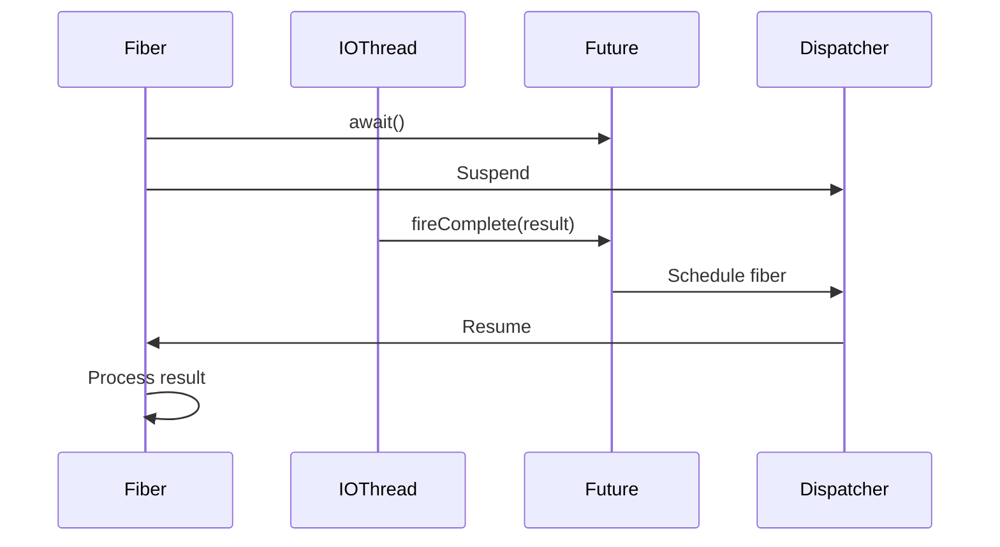

# Fiber Concurrency Framework

<cite>
**Referenced Files in This Document**   
- [Fiber.java](file://server/src/main/java/com/github/dtprj/dongting/fiber/Fiber.java)
- [FiberGroup.java](file://server/src/main/java/com/github/dtprj/dongting/fiber/FiberGroup.java)
- [Dispatcher.java](file://server/src/main/java/com/github/dtprj/dongting/fiber/Dispatcher.java)
- [FiberFrame.java](file://server/src/main/java/com/github/dtprj/dongting/fiber/FiberFrame.java)
- [FiberChannel.java](file://server/src/main/java/com/github/dtprj/dongting/fiber/FiberChannel.java)
- [FiberFuture.java](file://server/src/main/java/com/github/dtprj/dongting/fiber/FiberFuture.java)
- [README.md](file://README.md)
- [2024_07_16_3000行代码实现fiber.md](file://devlogs/2024_07_16_3000行代码实现fiber.md)
</cite>

## Table of Contents
1. [Introduction](#introduction)
2. [Core Components](#core-components)
3. [Architecture Overview](#architecture-overview)
4. [Fiber Lifecycle and Execution Model](#fiber-lifecycle-and-execution-model)
5. [Context Switching and Scheduling](#context-switching-and-scheduling)
6. [Inter-Fiber Communication](#inter-fiber-communication)
7. [Integration with I/O Operations](#integration-with-io-operations)
8. [Performance Characteristics](#performance-characteristics)
9. [Use Cases](#use-cases)
10. [Best Practices](#best-practices)
11. [Conclusion](#conclusion)

## Introduction

The Dongting fiber concurrency framework provides a lightweight alternative to the traditional thread-per-request model, enabling high-concurrency applications through cooperative scheduling and non-blocking operations. Unlike conventional threading models that create a new thread for each request, consuming significant memory and CPU resources, the fiber framework implements a user-space concurrency model where thousands of lightweight fibers can be efficiently managed by a small number of dispatcher threads.

This framework was developed to address the maintainability challenges of purely asynchronous programming while maintaining high performance characteristics. By allowing developers to write code in a synchronous style, the framework eliminates the callback hell and complex exception handling patterns common in CompletableFuture-based asynchronous code, while still achieving asynchronous performance through cooperative scheduling.

The fiber model is particularly well-suited for I/O-intensive applications such as distributed systems, RAFT consensus algorithms, and high-throughput network services. It enables developers to write straightforward, linear code that is easier to debug and maintain, while the underlying framework handles the complexities of non-blocking operations and efficient resource utilization.

**Section sources**
- [README.md](file://README.md#L4-L141)
- [2024_07_16_3000行代码实现fiber.md](file://devlogs/2024_07_16_3000行代码实现fiber.md#L1-L303)

## Core Components

The Dongting fiber framework consists of four primary components that work together to provide a comprehensive concurrency solution: Fiber, FiberGroup, Dispatcher, and FiberFrame. These components form a hierarchical structure where fibers are organized into groups, which are managed by dispatchers, with fiber frames providing the execution context.

The **Fiber** class represents an individual lightweight execution unit, analogous to a thread in traditional concurrency models. Each fiber maintains its own execution state, including a stack of fiber frames, lifecycle status, and scheduling information. Fibers can be suspended and resumed without blocking the underlying operating system thread, enabling efficient context switching.

The **FiberGroup** serves as a container and scheduler for related fibers, ensuring that all fibers within a group are executed by the same dispatcher thread. This design eliminates the need for thread synchronization within the group, as only one fiber executes at a time. Fiber groups also provide lifecycle management, automatically shutting down when all non-daemon fibers have completed.

The **Dispatcher** acts as the central scheduler, managing multiple fiber groups across one or more threads. It implements a cooperative scheduling algorithm that processes ready fibers in each group, handles timeouts, and manages the execution lifecycle. Dispatchers enable the framework to scale horizontally by allowing multiple groups to share a pool of threads.

The **FiberFrame** represents a unit of work within a fiber's execution stack, functioning as a virtual stack frame. Unlike traditional stack-based approaches, this implementation uses heap-allocated frames, eliminating the overhead of stack copying during context switches. Each frame can represent a method call or computational step that may suspend the fiber.



**Diagram sources **
- [Fiber.java](file://server/src/main/java/com/github/dtprj/dongting/fiber/Fiber.java#L1-L237)
- [FiberGroup.java](file://server/src/main/java/com/github/dtprj/dongting/fiber/FiberGroup.java#L1-L353)
- [Dispatcher.java](file://server/src/main/java/com/github/dtprj/dongting/fiber/Dispatcher.java#L1-L655)
- [FiberFrame.java](file://server/src/main/java/com/github/dtprj/dongting/fiber/FiberFrame.java#L1-L115)

**Section sources**
- [Fiber.java](file://server/src/main/java/com/github/dtprj/dongting/fiber/Fiber.java#L1-L237)
- [FiberGroup.java](file://server/src/main/java/com/github/dtprj/dongting/fiber/FiberGroup.java#L1-L353)
- [Dispatcher.java](file://server/src/main/java/com/github/dtprj/dongting/fiber/Dispatcher.java#L1-L655)
- [FiberFrame.java](file://server/src/main/java/com/github/dtprj/dongting/fiber/FiberFrame.java#L1-L115)

## Architecture Overview

The Dongting fiber framework implements a hierarchical architecture that separates concerns between execution units, scheduling, and resource management. At the highest level, the framework follows a dispatcher-group-fiber hierarchy where multiple fiber groups are managed by a single dispatcher thread, and each group contains multiple fibers that execute cooperatively.

The architecture is designed around the principle of "concurrency without parallelism" within a fiber group. This means that while multiple fibers can be active within a group, only one fiber executes at any given time on the dispatcher thread. This design eliminates the need for traditional thread synchronization mechanisms like locks and memory barriers within the group, significantly reducing overhead and complexity.

The dispatcher serves as the central coordinator, implementing a cooperative scheduling algorithm that processes ready fibers in each group. It maintains several key data structures: a shared queue for inter-thread communication, a priority queue for timed fibers, and indexed queues for ready fibers. The dispatcher operates in rounds, processing all ready fibers in each group before moving to the next, ensuring fair scheduling.

Fiber groups provide isolation and lifecycle management for related fibers. Each group has its own set of resources including ready queues, condition variables, and channels. The group abstraction enables clean shutdown semantics where a group only terminates when all non-daemon fibers have completed, similar to JVM shutdown behavior.

The framework's architecture supports both vertical and horizontal scaling. Vertically, thousands of fibers can be efficiently managed within a single group. Horizontally, multiple dispatcher threads can be created to utilize multiple CPU cores, with each dispatcher managing multiple fiber groups. This design allows the framework to handle workloads ranging from single-node applications to large-scale distributed systems.



**Diagram sources **
- [Dispatcher.java](file://server/src/main/java/com/github/dtprj/dongting/fiber/Dispatcher.java#L1-L655)
- [FiberGroup.java](file://server/src/main/java/com/github/dtprj/dongting/fiber/FiberGroup.java#L1-L353)
- [Fiber.java](file://server/src/main/java/com/github/dtprj/dongting/fiber/Fiber.java#L1-L237)

## Fiber Lifecycle and Execution Model

The fiber lifecycle in the Dongting framework follows a well-defined state transition pattern that enables cooperative multitasking. Each fiber progresses through several states: creation, ready, executing, suspended, and finished. This lifecycle is managed by the dispatcher and fiber group, ensuring proper resource management and execution ordering.

When a fiber is created, it is initialized with an entry fiber frame that represents the first unit of work to be executed. The fiber starts in the "not started" state until explicitly started via the `start()` method or implicitly through `fireFiber()`. Once started, the fiber transitions to the "ready" state and is added to the fiber group's ready queue.

During execution, the fiber processes its stack of fiber frames in a last-in-first-out order. Each frame represents a computational step that may either complete immediately or suspend the fiber. When a frame suspends the fiber (through operations like sleep, I/O wait, or channel operations), the fiber transitions to the "suspended" state and yields control back to the dispatcher.

The suspension mechanism is central to the framework's cooperative scheduling model. When a fiber suspends, it registers itself with a wait source (such as a timer, condition variable, or channel) and relinquishes the dispatcher thread. The dispatcher then selects the next ready fiber to execute, enabling efficient context switching without blocking the underlying OS thread.

Fibers can be suspended through several mechanisms:
- **Sleep operations**: Using `Fiber.sleep()` to pause execution for a specified duration
- **I/O operations**: Waiting for asynchronous I/O completion
- **Synchronization primitives**: Waiting on conditions, locks, or channels
- **Explicit yielding**: Using `Fiber.yield()` to voluntarily surrender the thread

When a suspended fiber becomes ready again (due to timeout expiration, I/O completion, or notification), it is moved back to the ready queue and will be scheduled for execution in the next round. This cooperative model ensures that no fiber can monopolize the dispatcher thread, providing fair scheduling across all fibers in the group.

The fiber lifecycle terminates when the fiber frame stack is empty and no further work is scheduled. At this point, the fiber transitions to the "finished" state, and any waiting fibers (via join operations) are notified. Daemon fibers do not prevent group shutdown, while non-daemon fibers must complete before their group can terminate.



**Diagram sources **
- [Fiber.java](file://server/src/main/java/com/github/dtprj/dongting/fiber/Fiber.java#L1-L237)
- [Dispatcher.java](file://server/src/main/java/com/github/dtprj/dongting/fiber/Dispatcher.java#L1-L655)
- [FiberGroup.java](file://server/src/main/java/com/github/dtprj/dongting/fiber/FiberGroup.java#L1-L353)

## Context Switching and Scheduling

The context switching mechanism in the Dongting fiber framework is implemented through a cooperative scheduling model that eliminates the overhead of traditional thread context switches. Unlike preemptive threading models that rely on OS-level time slicing, this framework uses explicit suspension points where fibers voluntarily yield control back to the dispatcher.

The scheduling algorithm operates in rounds, with each round consisting of several phases:
1. **Task processing**: Execute tasks from the shared queue (cross-thread submissions)
2. **Timeout processing**: Check and activate fibers whose timers have expired
3. **Group execution**: Process ready fibers in each fiber group
4. **Cleanup**: Perform periodic maintenance tasks

During the group execution phase, the dispatcher iterates through each ready fiber group, executing all ready fibers in that group before moving to the next group. This round-robin approach ensures fair scheduling across groups while maintaining locality within each group.

The context switch itself is implemented through the fiber frame stack. When a fiber suspends, its current execution state is captured in the fiber frame, including the resume point (callback) and any local state. The dispatcher then pops the current frame from the stack and selects the next ready fiber to execute. When the suspended fiber is resumed, a new frame is pushed onto its stack with the appropriate resume point.

Key aspects of the context switching mechanism include:
- **No stack copying**: Unlike traditional coroutines or virtual threads, this implementation does not copy thread stacks during context switches, eliminating a significant performance overhead
- **Explicit suspension points**: Fibers can only suspend at well-defined points (sleep, I/O, synchronization operations), making the execution flow predictable
- **Resume callbacks**: Each suspension registers a callback that the dispatcher uses to resume execution, maintaining the call stack virtually
- **Round-based scheduling**: Fibers are scheduled in rounds, with priority given to fibers that were ready at the start of the round

The dispatcher maintains several data structures to optimize scheduling performance:
- **Ready queues**: Indexed queues for ready fibers, allowing O(1) addition and removal
- **Schedule queue**: Priority queue for timed fibers, ordered by wakeup time
- **Shared queue**: Thread-safe queue for cross-thread fiber submissions
- **Round counters**: Track execution rounds to manage fiber priorities within rounds

This scheduling model provides several advantages:
- **Predictable performance**: No unexpected context switches due to OS scheduling
- **Reduced overhead**: Eliminates system call overhead and cache pollution from thread switches
- **Better cache locality**: Fibers within a group tend to access similar data, improving CPU cache utilization
- **Simpler debugging**: Execution flow is more predictable than with preemptive threading



**Diagram sources **
- [Dispatcher.java](file://server/src/main/java/com/github/dtprj/dongting/fiber/Dispatcher.java#L1-L655)
- [Fiber.java](file://server/src/main/java/com/github/dtprj/dongting/fiber/Fiber.java#L1-L237)
- [FiberGroup.java](file://server/src/main/java/com/github/dtprj/dongting/fiber/FiberGroup.java#L1-L353)

## Inter-Fiber Communication

The Dongting fiber framework provides several mechanisms for communication and synchronization between fibers, designed to work efficiently within the cooperative scheduling model. These primitives enable fibers to coordinate their execution, share data, and respond to events without blocking the dispatcher thread.

The primary communication mechanism is the **FiberChannel**, which provides queue-based communication similar to Java's BlockingQueue but adapted for the fiber model. Channels are unbounded and only block consumers, allowing producers to continue without interruption. Fibers can take from or offer to channels, suspending when the channel is empty (for take operations) or immediately proceeding (for offer operations).

```mermaid
flowchart TD
A[Fiber Producer] --> |channel.offer(data)| B[FiberChannel]
B --> C{Channel Empty?}
C --> |No| D[Fiber Consumer]
C --> |Yes| E[Fiber suspends]
D --> |channel.take()| B
E --> F[Wait for data]
G[New data] --> B
F --> |Resumes| D
```

**Diagram sources **
- [FiberChannel.java](file://server/src/main/java/com/github/dtprj/dongting/fiber/FiberChannel.java#L1-L197)

Channels support several operations:
- **fireOffer()**: Thread-safe offering from outside the fiber group
- **offer()**: Direct offering from within the fiber group
- **take()**: Suspend until data is available
- **take(timeout)**: Suspend with timeout
- **takeAll()**: Take all available data in bulk

The framework also provides **FiberFuture** for representing asynchronous computations. Futures can be awaited by fibers, which suspend until the future completes. This pattern is particularly useful for I/O operations where the completion callback runs in a different thread:



**Diagram sources **
- [FiberFuture.java](file://server/src/main/java/com/github/dtprj/dongting/fiber/FiberFuture.java#L1-L354)

Additional synchronization primitives include:
- **FiberCondition**: Allows fibers to wait for specific conditions, similar to java.util.concurrent.Condition
- **FiberLock**: Provides mutual exclusion with support for read-write locks
- **join()**: Allows one fiber to wait for another to complete

These primitives are designed to work seamlessly with the cooperative model:
- No thread synchronization overhead within a fiber group
- Automatic integration with the dispatcher's scheduling
- Support for timeouts and interruption
- Thread-safe variants for cross-thread operations (e.g., fireOffer, fireComplete)

The communication model emphasizes explicit suspension points, ensuring that fibers only block at well-defined locations. This makes the execution flow predictable and easier to reason about, while still providing the performance benefits of asynchronous execution.

**Section sources**
- [FiberChannel.java](file://server/src/main/java/com/github/dtprj/dongting/fiber/FiberChannel.java#L1-L197)
- [FiberFuture.java](file://server/src/main/java/com/github/dtprj/dongting/fiber/FiberFuture.java#L1-L354)
- [Fiber.java](file://server/src/main/java/com/github/dtprj/dongting/fiber/Fiber.java#L1-L237)

## Integration with I/O Operations

The Dongting fiber framework integrates with I/O operations through a hybrid model that combines asynchronous I/O with synchronous-style programming. This integration allows developers to write straightforward, linear code for I/O operations while maintaining the performance benefits of non-blocking operations.

The key to this integration is the use of **FiberFuture** objects to represent pending I/O operations. When an I/O operation is initiated, it returns a FiberFuture that can be awaited by the fiber. The actual I/O processing occurs asynchronously on appropriate threads (such as NIO selector threads), while the fiber suspends until completion.

For example, when reading from a file:
1. The fiber initiates an asynchronous read operation using Java NIO
2. A FiberFuture is created to represent the pending operation
3. The fiber calls `await()` on the future, suspending execution
4. When the I/O completes, the completion handler calls `fireComplete()` on the future
5. The dispatcher resumes the waiting fiber with the result

This pattern eliminates the callback hell typically associated with asynchronous I/O while avoiding the thread blocking of traditional synchronous I/O. The framework provides utilities to easily wrap standard Java asynchronous APIs:

```java
// Example of I/O integration
FiberFuture<byte[]> readFuture = group.newFuture("read");
AsynchronousFileChannel.open(path).read(buffer, 0, null, new CompletionHandler<>() {
    public void completed(Integer result, Object attachment) {
        readFuture.fireComplete(extractData(buffer, result));
    }
    public void failed(Throwable exc, Object attachment) {
        readFuture.fireCompleteExceptionally(exc);
    }
});
return readFuture.await(this::processResult);
```

The integration supports several key features:
- **Cross-thread completion**: I/O completion callbacks can safely notify fibers from different threads using `fireComplete()`
- **Timeout support**: I/O operations can be awaited with timeouts using `await(timeout)`
- **Cancellation**: Fibers can be interrupted during I/O waits
- **Resource management**: Automatic cleanup through fiber frame's doFinally() method

The framework also provides specialized I/O utilities:
- **Non-blocking network operations**: Integration with NIO for high-concurrency network services
- **File I/O**: Asynchronous file operations with memory mapping support
- **Buffer management**: Integrated byte buffer pooling to reduce GC pressure

This I/O integration model enables the framework to handle thousands of concurrent connections with minimal resources, making it ideal for high-performance network servers, database systems, and distributed applications.

**Section sources**
- [FiberFuture.java](file://server/src/main/java/com/github/dtprj/dongting/fiber/FiberFuture.java#L1-L354)
- [Fiber.java](file://server/src/main/java/com/github/dtprj/dongting/fiber/Fiber.java#L1-L237)
- [2024_07_16_3000行代码实现fiber.md](file://devlogs/2024_07_16_3000行代码实现fiber.md#L1-L303)

## Performance Characteristics

The Dongting fiber framework exhibits exceptional performance characteristics that stem from its lightweight, cooperative design and elimination of traditional threading overhead. The framework achieves high throughput and low latency by minimizing context switch costs, reducing memory footprint, and optimizing for cache locality.

Key performance advantages include:
- **Minimal context switch overhead**: Fiber switches are implemented as simple stack operations without OS intervention, resulting in microsecond-level switching times compared to millisecond-level thread switches
- **Reduced memory footprint**: Fibers consume significantly less memory than threads, with each fiber requiring only a few hundred bytes compared to the megabyte-sized stacks of traditional threads
- **Eliminated synchronization overhead**: Within a fiber group, there is no need for locks, volatile variables, or other synchronization primitives since only one fiber executes at a time
- **Improved cache locality**: Fibers within a group tend to access related data, improving CPU cache utilization and reducing memory bandwidth requirements

Benchmarks conducted on a 6-core AMD 5600X system demonstrate the framework's capabilities:
- **Fiber creation**: Millions of fibers can be created and scheduled per second
- **Context switching**: Tens of millions of fiber switches per second
- **I/O throughput**: High-concurrency I/O processing with minimal resource usage

The performance model follows several key principles:
- **Workload partitioning**: Different fiber groups can be assigned to different dispatcher threads to utilize multiple CPU cores
- **Batched processing**: The dispatcher processes ready fibers in batches, improving instruction cache utilization
- **Lazy evaluation**: Timers and scheduled operations are only checked when necessary
- **Object pooling**: Frequently used objects like fibers and frames are pooled to reduce GC pressure

The framework's performance scales linearly with the number of dispatcher threads, allowing it to effectively utilize multi-core systems. However, the "concurrency without parallelism" model within each group ensures that synchronization overhead remains minimal.

Compared to alternative models:
- **Traditional threads**: Much lower memory usage and context switch overhead
- **Java virtual threads**: Better performance within groups due to eliminated memory barriers
- **CompletableFuture-based async**: More predictable performance and simpler resource management

The framework is particularly well-suited for I/O-intensive workloads where the majority of time is spent waiting for external operations, as fibers can be suspended without consuming dispatcher thread time.

**Section sources**
- [README.md](file://README.md#L16-L46)
- [Dispatcher.java](file://server/src/main/java/com/github/dtprj/dongting/fiber/Dispatcher.java#L1-L655)
- [Fiber.java](file://server/src/main/java/com/github/dtprj/dongting/fiber/Fiber.java#L1-L237)

## Use Cases

The Dongting fiber framework is particularly well-suited for several high-concurrency use cases that benefit from its lightweight, cooperative model. These use cases leverage the framework's ability to handle thousands of concurrent operations with minimal resource overhead while maintaining straightforward, synchronous-style code.

**High-Concurrency I/O Processing** is a primary use case where the framework excels. Network servers, database systems, and file processing applications can handle tens of thousands of concurrent connections with minimal memory footprint. Each connection can be represented by a fiber that processes requests in a linear fashion, suspending during I/O operations without blocking the dispatcher thread. This model is ideal for:
- Web servers and API gateways
- Database connection pools
- File transfer services
- Message brokers

**RAFT Log Replication** demonstrates the framework's effectiveness in distributed systems. The RAFT consensus algorithm requires coordination between multiple nodes, with each node handling numerous concurrent operations including log replication, leader election, and client requests. The fiber model allows each RAFT group to process these operations efficiently:
- Log entries can be replicated through fibers that handle network communication
- Election timeouts can be managed with precise fiber scheduling
- Client requests can be processed concurrently while maintaining linearizability
- Snapshot operations can proceed without blocking other operations

The framework's support for structured concurrency makes it ideal for complex distributed protocols. Fibers can be organized hierarchically, with parent fibers managing the lifecycle of child fibers. This enables clean error handling and resource cleanup when operations fail or time out.

**Configuration Management Systems** benefit from the framework's ability to handle watch operations and distributed locks. Systems like DtKV (Dongting Key-Value store) use fibers to:
- Process client requests for configuration data
- Handle watch notifications for configuration changes
- Manage distributed locks for leader election
- Execute periodic maintenance tasks

**Microservices and Service Meshes** can leverage the fiber framework for efficient request processing. Each incoming request can spawn a fiber that handles the entire request lifecycle, including:
- Authentication and authorization
- Service discovery and routing
- Circuit breaking and retry logic
- Response aggregation

The framework's performance characteristics make it suitable for edge computing and IoT applications where resources are constrained. Raspberry Pi and similar devices can run fiber-based applications efficiently, handling numerous concurrent connections with minimal CPU and memory usage.

These use cases share common requirements that the fiber framework addresses effectively:
- High connection concurrency
- Low memory footprint
- Predictable performance
- Simple code maintenance
- Efficient resource utilization

**Section sources**
- [README.md](file://README.md#L5-L118)
- [2024_07_16_3000行代码实现fiber.md](file://devlogs/2024_07_16_3000行代码实现fiber.md#L1-L303)
- [Fiber.java](file://server/src/main/java/com/github/dtprj/dongting/fiber/Fiber.java#L1-L237)

## Best Practices

To effectively use the Dongting fiber framework, developers should follow several best practices that leverage the framework's strengths while avoiding common pitfalls. These practices ensure optimal performance, maintainability, and reliability of fiber-based applications.

**Avoid Blocking Calls** is the most critical practice. Since fibers execute on a shared dispatcher thread, any blocking operation will prevent other fibers from running. Developers must:
- Use framework-provided non-blocking alternatives (e.g., `Fiber.sleep()` instead of `Thread.sleep()`)
- Wrap external blocking operations in separate threads with proper fiber notification
- Never perform long-running computations without yielding
- Use `yield()` in loops that may run for extended periods

**Manage Fiber Resources** properly by following structured concurrency patterns:
- Always clean up resources in `doFinally()` methods of fiber frames
- Use daemon fibers for background tasks that shouldn't prevent group shutdown
- Limit fiber creation to prevent memory exhaustion
- Use object pooling for frequently created fiber frames

**Handle Exceptions Appropriately** using the framework's built-in mechanisms:
- Implement `handle()` methods in fiber frames to catch and process exceptions
- Use `try/catch` blocks within frames for specific error handling
- Propagate exceptions to parent frames when appropriate
- Avoid catching and ignoring exceptions that indicate serious problems

**Design for Cooperative Scheduling** by structuring code around natural suspension points:
- Break long operations into smaller fiber frames
- Use channels and futures for inter-fiber communication
- Minimize work between suspension points
- Design APIs to return `FrameCallResult` for suspendable operations

**Follow Naming Conventions** to aid debugging and monitoring:
- Give meaningful names to fibers, groups, and synchronization primitives
- Use consistent naming patterns for related components
- Include contextual information in names (e.g., "client-123-handler")

**Implement Proper Shutdown Sequences** for graceful termination:
- Use `requestShutdown()` to initiate group shutdown
- Allow non-daemon fibers to complete their work
- Clean up resources in `doFinally()` methods
- Wait for shutdown completion before terminating the dispatcher

**Monitor Fiber State** for debugging and performance analysis:
- Use `fireLogGroupInfo()` to capture group state
- Monitor fiber queue sizes and execution patterns
- Implement custom performance callbacks
- Use fiber names to identify problematic operations

**Structure Code for Maintainability** by following these patterns:
- Organize related fibers into logical groups
- Use fiber frames to represent discrete units of work
- Keep fiber frame implementations focused and small
- Use composition rather than deep inheritance hierarchies

By following these best practices, developers can create high-performance, maintainable applications that fully leverage the capabilities of the fiber concurrency framework.

**Section sources**
- [2024_07_16_3000行代码实现fiber.md](file://devlogs/2024_07_16_3000行代码实现fiber.md#L1-L303)
- [Fiber.java](file://server/src/main/java/com/github/dtprj/dongting/fiber/Fiber.java#L1-L237)
- [FiberFrame.java](file://server/src/main/java/com/github/dtprj/dongting/fiber/FiberFrame.java#L1-L115)

## Conclusion

The Dongting fiber concurrency framework provides a powerful alternative to traditional threading models, combining the simplicity of synchronous programming with the performance benefits of asynchronous execution. By implementing a lightweight, cooperative scheduling model, the framework enables developers to write straightforward, maintainable code while handling high-concurrency workloads efficiently.

The core innovation lies in its "concurrency without parallelism" approach within fiber groups, which eliminates the need for thread synchronization and memory barriers while still providing high throughput. This design choice results in exceptional performance characteristics, with minimal context switch overhead and reduced memory footprint compared to both traditional threads and other concurrency models.

The framework's architecture, built around the Fiber, FiberGroup, Dispatcher, and FiberFrame components, provides a comprehensive solution for managing concurrent operations. Its integration with I/O operations allows for efficient handling of network and file operations, making it particularly well-suited for distributed systems, RAFT consensus algorithms, and high-throughput network services.

Key advantages of the framework include:
- **Developer productivity**: Synchronous-style coding reduces complexity and improves maintainability
- **Performance**: Cooperative scheduling minimizes overhead and maximizes resource utilization
- **Scalability**: Support for thousands of concurrent fibers with minimal resource consumption
- **Reliability**: Structured concurrency and proper resource management reduce bugs

The framework represents a pragmatic approach to concurrency, acknowledging that while fully transparent virtual threads would be ideal, practical constraints often require explicit management of suspension points. By making these points explicit but easy to use, the framework strikes a balance between performance and developer experience.

As demonstrated in the RAFT implementation and other use cases, the fiber model enables the creation of high-performance distributed systems that are both efficient and maintainable. The framework's design principles—simplicity, performance, and clarity—make it a valuable tool for building scalable, reliable applications in the Java ecosystem.

**Section sources**
- [2024_07_16_3000行代码实现fiber.md](file://devlogs/2024_07_16_3000行代码实现fiber.md#L1-L303)
- [README.md](file://README.md#L1-L141)
- [Fiber.java](file://server/src/main/java/com/github/dtprj/dongting/fiber/Fiber.java#L1-L237)