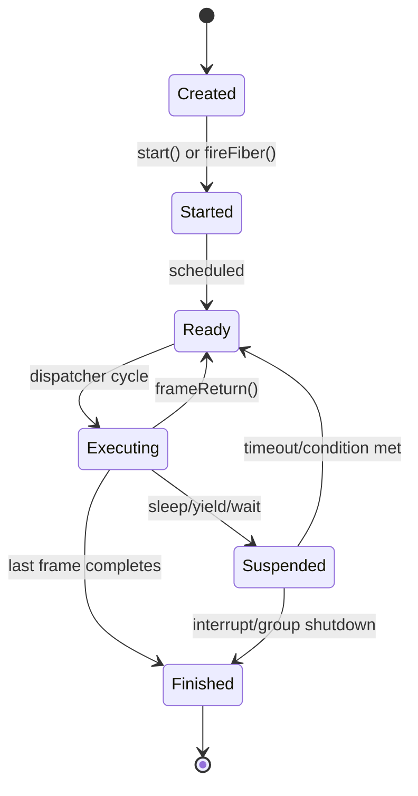
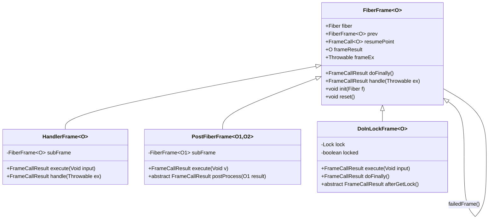
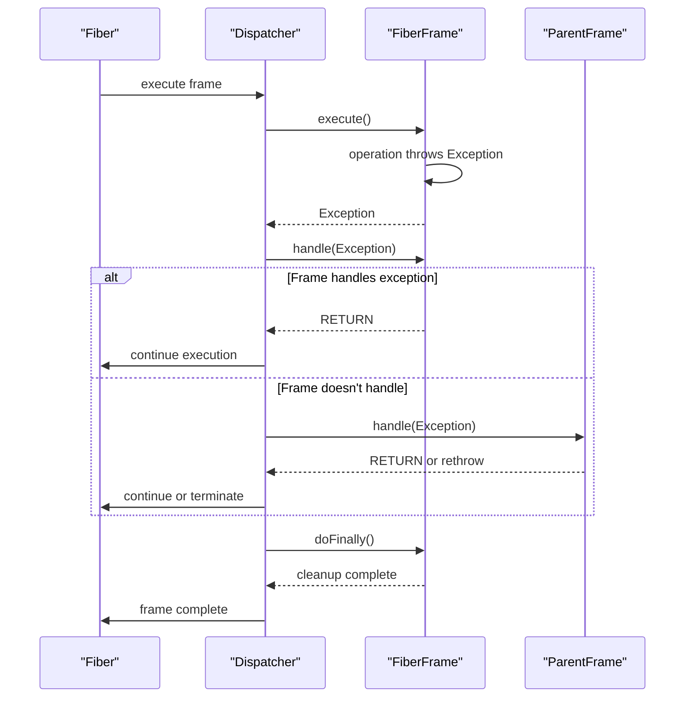
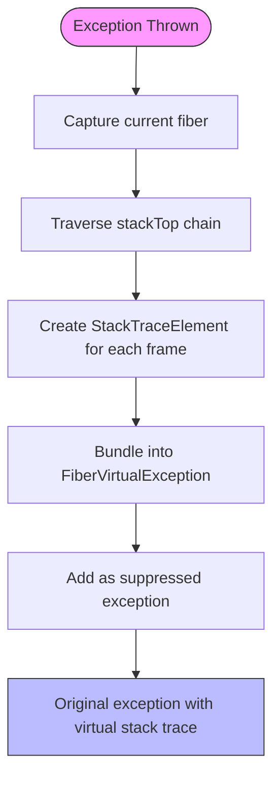
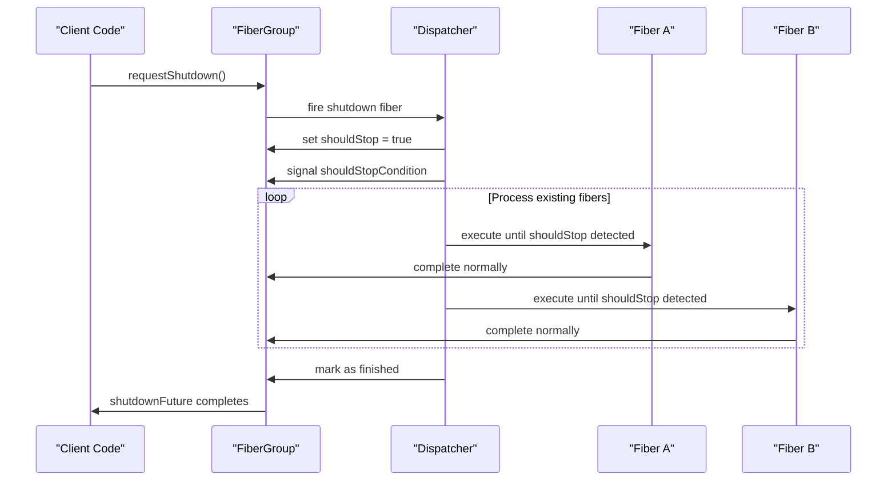

# Fiber Lifecycle and Error Handling

<cite>
**Referenced Files in This Document**   
- [Fiber.java](file://server/src/main/java/com/github/dtprj/dongting/fiber/Fiber.java)
- [FiberFrame.java](file://server/src/main/java/com/github/dtprj/dongting/fiber/FiberFrame.java)
- [FrameCallResult.java](file://server/src/main/java/com/github/dtprj/dongting/fiber/FrameCallResult.java)
- [FrameCall.java](file://server/src/main/java/com/github/dtprj/dongting/fiber/FrameCall.java)
- [FiberException.java](file://server/src/main/java/com/github/dtprj/dongting/fiber/FiberException.java)
- [Dispatcher.java](file://server/src/main/java/com/github/dtprj/dongting/fiber/Dispatcher.java)
- [FiberGroup.java](file://server/src/main/java/com/github/dtprj/dongting/fiber/FiberGroup.java)
- [HandlerFrame.java](file://server/src/main/java/com/github/dtprj/dongting/fiber/HandlerFrame.java)
- [PostFiberFrame.java](file://server/src/main/java/com/github/dtprj/dongting/fiber/PostFiberFrame.java)
- [DoInLockFrame.java](file://server/src/main/java/com/github/dtprj/dongting/fiber/DoInLockFrame.java)
- [FiberLifeCycleTest.java](file://server/src/test/java/com/github/dtprj/dongting/fiber/FiberLifeCycleTest.java)
- [VirtualExceptionTest.java](file://server/src/test/java/com/github/dtprj/dongting/fiber/VirtualExceptionTest.java)
- [FinallyTest.java](file://server/src/test/java/com/github/dtprj/dongting/fiber/FinallyTest.java)
- [CatchTest.java](file://server/src/test/java/com/github/dtprj/dongting/fiber/CatchTest.java)
- [JoinTest.java](file://server/src/test/java/com/github/dtprj/dongting/fiber/JoinTest.java)
</cite>

## Table of Contents
1. [Fiber Lifecycle Management](#fiber-lifecycle-management)
2. [FiberFrame Execution Context](#fiberframe-execution-context)
3. [Structured Concurrency and Exception Handling](#structured-concurrency-and-exception-handling)
4. [Virtual Stack Trace Mechanism](#virtual-stack-trace-mechanism)
5. [Resource Management and Shutdown Patterns](#resource-management-and-shutdown-patterns)

## Fiber Lifecycle Management

The fiber lifecycle in Dongting follows a well-defined state machine that manages the creation, startup, execution, suspension, and termination phases of fibers. The `Fiber` class represents the execution unit that operates within a `FiberGroup` and is managed by a `Dispatcher`. 

A fiber is created with an entry `FiberFrame` that defines its initial execution context. The fiber can be started by calling the `start()` method or by submitting it to the fiber group via `fireFiber()`. Once started, the fiber transitions through several states: `created` → `started` → `ready` → `executing` → `suspended` → `finished`. The `started` flag indicates the fiber has been registered with the system, while the `ready` flag determines whether the fiber is eligible for execution in the current dispatch cycle.

Fibers can be suspended through various operations such as `sleep()`, `yield()`, or waiting on synchronization primitives like `FiberChannel` or `FiberCondition`. During suspension, the fiber's execution state is preserved in the `FiberFrame` stack, and the fiber is removed from the ready queue until the suspension condition is met or the timeout expires. The `scheduleTimeout` and `scheduleNanoTime` fields track timing information for suspended fibers.

Termination occurs when a fiber completes its execution frame chain, at which point the `finished` flag is set to true, and the fiber is removed from its group. The lifecycle is tightly integrated with the `FiberGroup`'s shutdown mechanism, where calling `requestShutdown()` initiates graceful termination of all fibers in the group. Daemon fibers (created with the `daemon` flag) do not prevent group termination, while non-daemon fibers must complete before the group can finish.

**Diagram sources**
- [Fiber.java](file://server/src/main/java/com/github/dtprj/dongting/fiber/Fiber.java#L27-L236)
- [Dispatcher.java](file://server/src/main/java/com/github/dtprj/dongting/fiber/Dispatcher.java#L148-L328)
- [FiberGroup.java](file://server/src/main/java/com/github/dtprj/dongting/fiber/FiberGroup.java#L138-L237)

**Section sources**
- [Fiber.java](file://server/src/main/java/com/github/dtprj/dongting/fiber/Fiber.java#L53-L236)
- [FiberGroup.java](file://server/src/main/java/com/github/dtprj/dongting/fiber/FiberGroup.java#L72-L162)
- [FiberLifeCycleTest.java](file://server/src/test/java/com/github/dtprj/dongting/fiber/FiberLifeCycleTest.java#L27-L71)

## FiberFrame Execution Context

The `FiberFrame` abstraction serves as the execution context that maintains state across suspension points in the fiber's execution. It functions as a virtual stack frame that preserves the fiber's state when it is suspended and resumed. Each fiber maintains a stack of `FiberFrame` instances through the `stackTop` reference, with each frame representing a logical execution unit.

The execute/resume pattern is central to the fiber's operation. When a fiber executes, it calls the `execute()` method on the top frame of its stack. If the operation can complete immediately, the frame returns `FrameCallResult.RETURN`, which pops the frame from the stack and continues with the previous frame. If the operation needs to suspend (e.g., waiting for I/O or a timeout), the frame returns `FrameCallResult.SUSPEND`, preserving its state for later resumption.

The `FrameCallResult` enum defines the control flow outcomes: `CALL_NEXT_FRAME` for invoking a new frame, `SUSPEND` for temporary suspension, and `RETURN` for completing the current frame. The `resumePoint` field in `FiberFrame` stores the continuation point to which control should return after suspension. When a suspended operation completes, the dispatcher calls the appropriate `resume` method, passing the result or exception through the `inputObj` and `inputEx` fields of the `Fiber`.

Specialized frame types extend the base `FiberFrame` to implement common patterns. `HandlerFrame` wraps another frame to provide exception handling capabilities. `PostFiberFrame` allows post-processing of a sub-frame's result. `DoInLockFrame` ensures that a critical section is executed within a lock, with automatic release in the `doFinally` method regardless of how the frame completes.

**Diagram sources**
- [FiberFrame.java](file://server/src/main/java/com/github/dtprj/dongting/fiber/FiberFrame.java#L22-L115)
- [HandlerFrame.java](file://server/src/main/java/com/github/dtprj/dongting/fiber/HandlerFrame.java#L23-L47)
- [PostFiberFrame.java](file://server/src/main/java/com/github/dtprj/dongting/fiber/PostFiberFrame.java#L3-L18)
- [DoInLockFrame.java](file://server/src/main/java/com/github/dtprj/dongting/fiber/DoInLockFrame.java#L21-L54)

**Section sources**
- [FiberFrame.java](file://server/src/main/java/com/github/dtprj/dongting/fiber/FiberFrame.java#L22-L115)
- [FrameCall.java](file://server/src/main/java/com/github/dtprj/dongting/fiber/FrameCall.java#L22-L25)
- [FrameCallResult.java](file://server/src/main/java/com/github/dtprj/dongting/fiber/FrameCallResult.java#L21-L29)
- [HandlerFrame.java](file://server/src/main/java/com/github/dtprj/dongting/fiber/HandlerFrame.java#L23-L47)

## Structured Concurrency and Exception Handling

Dongting implements a structured concurrency model with hierarchical exception handling, where exceptions propagate up the fiber hierarchy and cleanup operations are guaranteed through the `doFinally` mechanism. When an exception occurs in a fiber frame, it propagates to parent frames following a well-defined handling chain.

The exception handling process begins when a frame throws an exception during execution. The dispatcher catches the exception and invokes the `handle()` method on the current frame. If the frame does not handle the exception (by overriding `handle()`), it propagates to the parent frame in the stack. This hierarchical propagation continues until an appropriate handler is found or the exception reaches the top of the stack, at which point it may terminate the fiber or be handled by the fiber group.

The `doFinally` method provides guaranteed cleanup operations that execute regardless of how a frame completes—whether normally, via exception, or through cancellation. This method is automatically called by the dispatcher during frame teardown, ensuring that resources are properly released. The `finallyCalled` flag prevents multiple executions of cleanup logic, while the `catchCalled` flag tracks whether exception handling has occurred.

Exception handling patterns are demonstrated through various frame types. `HandlerFrame` specifically wraps sub-frames to capture both successful results and exceptions in a `Pair` object, enabling non-exceptional control flow for error conditions. The `FinallyTest` and `CatchTest` classes validate that `doFinally` blocks execute correctly even when exceptions occur during normal execution, exception handling, or subsequent suspensions.

**Diagram sources**
- [Dispatcher.java](file://server/src/main/java/com/github/dtprj/dongting/fiber/Dispatcher.java#L331-L370)
- [FiberFrame.java](file://server/src/main/java/com/github/dtprj/dongting/fiber/FiberFrame.java#L34-L40)
- [FinallyTest.java](file://server/src/test/java/com/github/dtprj/dongting/fiber/FinallyTest.java#L31-L237)
- [CatchTest.java](file://server/src/test/java/com/github/dtprj/dongting/fiber/CatchTest.java#L29-L289)

**Section sources**
- [FiberFrame.java](file://server/src/main/java/com/github/dtprj/dongting/fiber/FiberFrame.java#L34-L40)
- [Dispatcher.java](file://server/src/main/java/com/github/dtprj/dongting/fiber/Dispatcher.java#L331-L370)
- [FinallyTest.java](file://server/src/test/java/com/github/dtprj/dongting/fiber/FinallyTest.java#L31-L237)
- [CatchTest.java](file://server/src/test/java/com/github/dtprj/dongting/fiber/CatchTest.java#L29-L289)

## Virtual Stack Trace Mechanism

The virtual stack trace mechanism enhances debugging by reconstructing the logical call stack through suppressed exceptions, compensating for the limitations of traditional stack traces in asynchronous, suspended execution contexts. When exceptions occur in fibers, the system captures the fiber's frame stack and embeds it as suppressed exceptions to provide context about the logical call flow.

The `FiberException` class automatically adds virtual stack trace information when instantiated. The `addVirtualStackTrace()` method traverses the fiber's `stackTop` chain, creating a `StackTraceElement` for each frame in the execution context. These elements are bundled into a `FiberVirtualException` instance, which is added as a suppressed exception to the original exception. This approach preserves the logical call hierarchy even when the physical call stack is shallow due to the event-driven nature of fiber execution.

The virtual stack trace includes the class names of the active `FiberFrame` instances, providing insight into the execution context at the time of failure. Since actual line numbers and file information are not available in the virtual frames, the system uses placeholder values (N/A for method, null for filename, 0 for line number). Despite these limitations, the virtual stack trace offers valuable debugging information by showing the sequence of frames that were active when the exception occurred.

This mechanism is particularly valuable for diagnosing issues in complex asynchronous workflows where traditional stack traces would only show the dispatcher's execution path rather than the logical application flow. The suppressed `FiberVirtualException` instances can be examined in debugging tools or logs to reconstruct the fiber's execution context at the point of failure.

**Diagram sources**
- [FiberException.java](file://server/src/main/java/com/github/dtprj/dongting/fiber/FiberException.java#L23-L77)
- [VirtualExceptionTest.java](file://server/src/test/java/com/github/dtprj/dongting/fiber/VirtualExceptionTest.java#L27-L138)
- [Dispatcher.java](file://server/src/main/java/com/github/dtprj/dongting/fiber/Dispatcher.java#L353-L354)

**Section sources**
- [FiberException.java](file://server/src/main/java/com/github/dtprj/dongting/fiber/FiberException.java#L23-L85)
- [VirtualExceptionTest.java](file://server/src/test/java/com/github/dtprj/dongting/fiber/VirtualExceptionTest.java#L27-L138)

## Resource Management and Shutdown Patterns

Proper fiber resource management involves careful handling of daemon fiber semantics and implementing graceful shutdown patterns using `requestShutdown` and `join` operations. The system distinguishes between daemon and non-daemon fibers, where daemon fibers (created with the `daemon` flag) do not prevent their fiber group from terminating, while non-daemon fibers must complete before the group can finish.

The `requestShutdown` method initiates a graceful shutdown sequence by setting the `shouldStop` flag in the `ShareStatusSource` and signaling the `shouldStopCondition`. This allows running fibers to detect the shutdown request and perform cleanup operations before terminating. The fiber group waits for all non-daemon fibers to complete and ensures that the system channel has no pending tasks before marking itself as finished.

The `join` operation enables fibers to wait for the completion of other fibers, supporting coordination patterns. Three variants are available: `join(FrameCall)` for indefinite waiting, `join(long, FrameCall)` for timeout-based waiting, and `join()` which returns a `FiberFuture` for integration with other concurrency constructs. The `JoinTest` class verifies that joining works correctly even when the target fiber is interrupted or times out.

Resource cleanup is automated through the fiber lifecycle management. When a fiber completes, it is automatically removed from its group's tracking structures, and its frame stack is unwound with proper `doFinally` execution. The `Dispatcher` periodically cleans object pools to prevent memory leaks, and the `FiberGroup` ensures that all resources are released during shutdown.

**Diagram sources**
- [FiberGroup.java](file://server/src/main/java/com/github/dtprj/dongting/fiber/FiberGroup.java#L94-L110)
- [Fiber.java](file://server/src/main/java/com/github/dtprj/dongting/fiber/Fiber.java#L154-L202)
- [JoinTest.java](file://server/src/test/java/com/github/dtprj/dongting/fiber/JoinTest.java#L27-L87)

**Section sources**
- [FiberGroup.java](file://server/src/main/java/com/github/dtprj/dongting/fiber/FiberGroup.java#L94-L110)
- [Fiber.java](file://server/src/main/java/com/github/dtprj/dongting/fiber/Fiber.java#L154-L202)
- [FiberLifeCycleTest.java](file://server/src/test/java/com/github/dtprj/dongting/fiber/FiberLifeCycleTest.java#L52-L69)