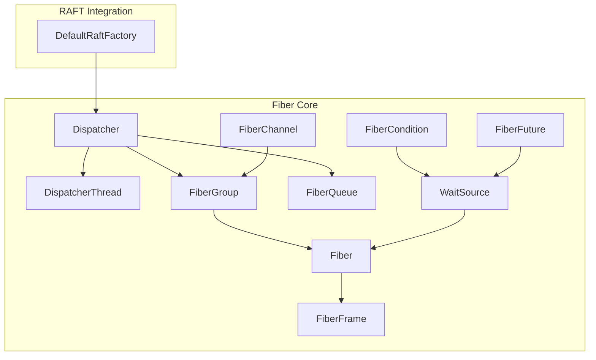
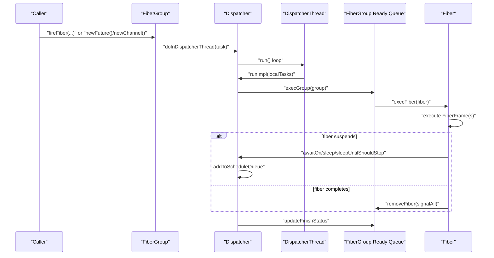
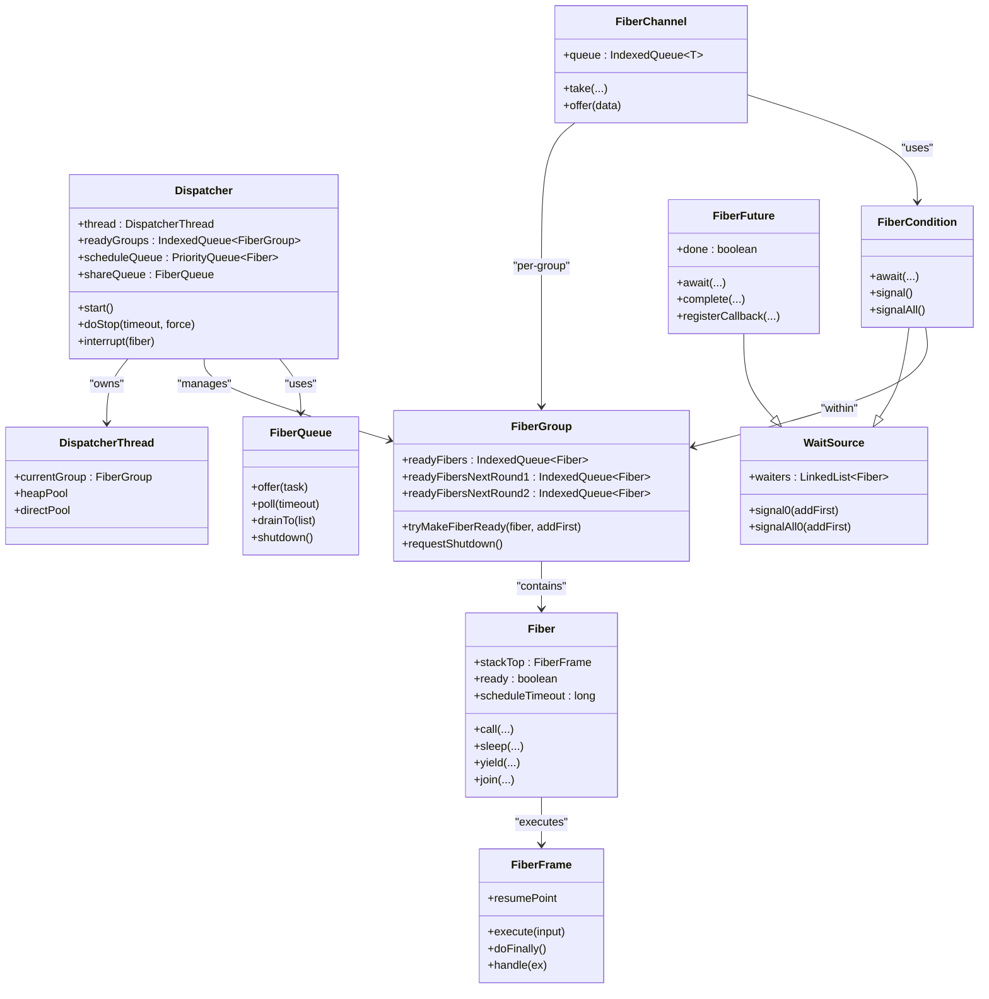
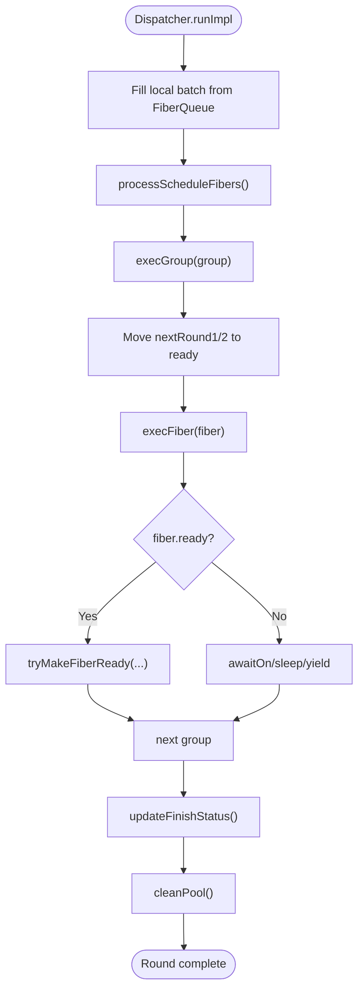
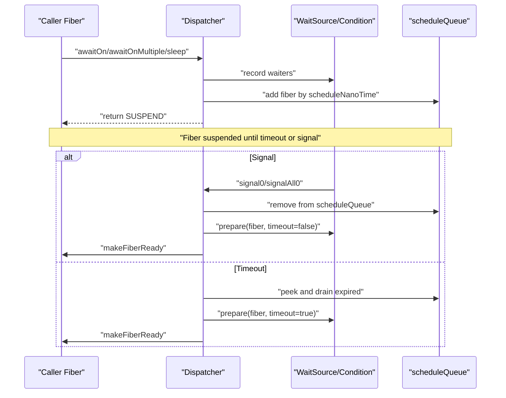

# Fiber Scheduling and Dispatcher

<cite>
**Referenced Files in This Document**
- [Dispatcher.java](file://server/src/main/java/com/github/dtprj/dongting/fiber/Dispatcher.java)
- [DispatcherThread.java](file://server/src/main/java/com/github/dtprj/dongting/fiber/DispatcherThread.java)
- [FiberGroup.java](file://server/src/main/java/com/github/dtprj/dongting/fiber/FiberGroup.java)
- [Fiber.java](file://server/src/main/java/com/github/dtprj/dongting/fiber/Fiber.java)
- [FiberQueue.java](file://server/src/main/java/com/github/dtprj/dongting/fiber/FiberQueue.java)
- [FiberFrame.java](file://server/src/main/java/com/github/dtprj/dongting/fiber/FiberFrame.java)
- [WaitSource.java](file://server/src/main/java/com/github/dtprj/dongting/fiber/WaitSource.java)
- [FiberCondition.java](file://server/src/main/java/com/github/dtprj/dongting/fiber/FiberCondition.java)
- [FiberChannel.java](file://server/src/main/java/com/github/dtprj/dongting/fiber/FiberChannel.java)
- [FiberFuture.java](file://server/src/main/java/com/github/dtprj/dongting/fiber/FiberFuture.java)
- [DefaultRaftFactory.java](file://server/src/main/java/com/github/dtprj/dongting/raft/server/DefaultRaftFactory.java)
</cite>

## Table of Contents
1. [Introduction](#introduction)
2. [Project Structure](#project-structure)
3. [Core Components](#core-components)
4. [Architecture Overview](#architecture-overview)
5. [Detailed Component Analysis](#detailed-component-analysis)
6. [Dependency Analysis](#dependency-analysis)
7. [Performance Considerations](#performance-considerations)
8. [Troubleshooting Guide](#troubleshooting-guide)
9. [Conclusion](#conclusion)
10. [Appendices](#appendices)

## Introduction
This document explains Dongting’s fiber scheduling mechanism centered around the Dispatcher, which acts as the single-threaded execution engine for multiple FiberGroup instances. The system achieves high concurrency without per-request threads by using cooperative scheduling with round-based execution, ready queues, and explicit suspension/resumption points. It also documents lifecycle management, timeout scheduling, thread affinity guarantees, and best practices for tuning in high-load scenarios.

## Project Structure
The fiber subsystem resides primarily under server/src/main/java/com/github/dtprj/dongting/fiber. The RAFT integration lives under server/src/main/java/com/github/dtprj/dongting/raft/server and uses the Dispatcher to manage per-group fiber execution.

**Diagram sources**
- [Dispatcher.java](file://server/src/main/java/com/github/dtprj/dongting/fiber/Dispatcher.java#L45-L174)
- [DispatcherThread.java](file://server/src/main/java/com/github/dtprj/dongting/fiber/DispatcherThread.java#L24-L49)
- [FiberGroup.java](file://server/src/main/java/com/github/dtprj/dongting/fiber/FiberGroup.java#L34-L120)
- [Fiber.java](file://server/src/main/java/com/github/dtprj/dongting/fiber/Fiber.java#L27-L120)
- [FiberFrame.java](file://server/src/main/java/com/github/dtprj/dongting/fiber/FiberFrame.java#L21-L115)
- [FiberQueue.java](file://server/src/main/java/com/github/dtprj/dongting/fiber/FiberQueue.java#L29-L138)
- [WaitSource.java](file://server/src/main/java/com/github/dtprj/dongting/fiber/WaitSource.java#L23-L78)
- [FiberCondition.java](file://server/src/main/java/com/github/dtprj/dongting/fiber/FiberCondition.java#L23-L99)
- [FiberChannel.java](file://server/src/main/java/com/github/dtprj/dongting/fiber/FiberChannel.java#L31-L197)
- [FiberFuture.java](file://server/src/main/java/com/github/dtprj/dongting/fiber/FiberFuture.java#L29-L140)
- [DefaultRaftFactory.java](file://server/src/main/java/com/github/dtprj/dongting/raft/server/DefaultRaftFactory.java#L101-L118)

**Section sources**
- [Dispatcher.java](file://server/src/main/java/com/github/dtprj/dongting/fiber/Dispatcher.java#L45-L174)
- [DefaultRaftFactory.java](file://server/src/main/java/com/github/dtprj/dongting/raft/server/DefaultRaftFactory.java#L101-L118)

## Core Components
- Dispatcher: Single-threaded engine managing multiple FiberGroup instances, round-based execution, ready queues, and timeout scheduling.
- FiberGroup: Per-group container holding fibers, ready queues, and synchronization primitives; integrates with Dispatcher via ready queues and scheduling.
- Fiber: Lightweight cooperative unit with a stack of FiberFrame frames, suspension/resumption, and join/wait semantics.
- FiberFrame: Stack frame abstraction with resume points, finally/catch handling, and execution hooks.
- WaitSource/FiberCondition: Synchronization primitive for fibers to wait on conditions; signals wake up waiting fibers.
- FiberChannel: Unbounded channel for cross-fiber communication within a group; integrates with conditions for blocking take.
- FiberFuture: Promise-like construct with callbacks and await semantics; signals completion to waiting fibers.
- FiberQueue: Internal queue for cross-thread tasks executed on the Dispatcher thread.
- DispatcherThread: Thread wrapper carrying per-thread pools and current group context.

**Section sources**
- [Dispatcher.java](file://server/src/main/java/com/github/dtprj/dongting/fiber/Dispatcher.java#L45-L174)
- [FiberGroup.java](file://server/src/main/java/com/github/dtprj/dongting/fiber/FiberGroup.java#L34-L120)
- [Fiber.java](file://server/src/main/java/com/github/dtprj/dongting/fiber/Fiber.java#L27-L120)
- [FiberFrame.java](file://server/src/main/java/com/github/dtprj/dongting/fiber/FiberFrame.java#L21-L115)
- [WaitSource.java](file://server/src/main/java/com/github/dtprj/dongting/fiber/WaitSource.java#L23-L78)
- [FiberCondition.java](file://server/src/main/java/com/github/dtprj/dongting/fiber/FiberCondition.java#L23-L99)
- [FiberChannel.java](file://server/src/main/java/com/github/dtprj/dongting/fiber/FiberChannel.java#L31-L197)
- [FiberFuture.java](file://server/src/main/java/com/github/dtprj/dongting/fiber/FiberFuture.java#L29-L140)
- [FiberQueue.java](file://server/src/main/java/com/github/dtprj/dongting/fiber/FiberQueue.java#L29-L138)
- [DispatcherThread.java](file://server/src/main/java/com/github/dtprj/dongting/fiber/DispatcherThread.java#L24-L49)

## Architecture Overview
The Dispatcher is the central execution engine bound to a single thread. Each FiberGroup runs cooperatively on that thread, with fibers scheduled in rounds. The Dispatcher maintains:
- A shared queue for cross-thread tasks
- A priority queue for scheduled fibers (timeouts)
- Ready queues for each FiberGroup
- A round counter to distribute CPU fairly among groups

**Diagram sources**
- [Dispatcher.java](file://server/src/main/java/com/github/dtprj/dongting/fiber/Dispatcher.java#L148-L211)
- [FiberGroup.java](file://server/src/main/java/com/github/dtprj/dongting/fiber/FiberGroup.java#L144-L204)
- [Fiber.java](file://server/src/main/java/com/github/dtprj/dongting/fiber/Fiber.java#L121-L170)

## Detailed Component Analysis

### Dispatcher: Central Execution Engine
- Single-threaded model: One DispatcherThread executes all FiberGroup work.
- Round-based scheduling: Each iteration processes ready fibers from groups, then moves next-round fibers into the current round.
- Ready queues: Each FiberGroup maintains two next-round queues and a current-ready queue to balance fairness and responsiveness.
- Timeout scheduling: A priority queue orders fibers by wakeup time; the Dispatcher drains expired entries into ready sets.
- Cross-thread tasking: FiberQueue accepts tasks from any thread; the Dispatcher drains them into local batches for execution.
- Lifecycle: start() starts the thread; doStop enqueues shutdown requests; run() loops until stopped and groups finish; finally destroys buffer pools.

Key behaviors:
- Cooperative yields: Fibers can yield to move themselves to next round queues.
- Suspension: awaitOn, sleep, sleepUntilShouldStop add fibers to schedule queue and waiters list; signals remove from schedule and wake.
- Interrupts: interrupt removes fibers from waiters and schedules immediate ready with an exception.
- Fatal errors: setEx and throwFatalError propagate errors to stop the group and request shutdown.

**Section sources**
- [Dispatcher.java](file://server/src/main/java/com/github/dtprj/dongting/fiber/Dispatcher.java#L45-L174)
- [Dispatcher.java](file://server/src/main/java/com/github/dtprj/dongting/fiber/Dispatcher.java#L176-L211)
- [Dispatcher.java](file://server/src/main/java/com/github/dtprj/dongting/fiber/Dispatcher.java#L213-L236)
- [Dispatcher.java](file://server/src/main/java/com/github/dtprj/dongting/fiber/Dispatcher.java#L331-L403)
- [Dispatcher.java](file://server/src/main/java/com/github/dtprj/dongting/fiber/Dispatcher.java#L404-L506)
- [Dispatcher.java](file://server/src/main/java/com/github/dtprj/dongting/fiber/Dispatcher.java#L508-L545)
- [Dispatcher.java](file://server/src/main/java/com/github/dtprj/dongting/fiber/Dispatcher.java#L547-L587)
- [Dispatcher.java](file://server/src/main/java/com/github/dtprj/dongting/fiber/Dispatcher.java#L588-L655)

### FiberGroup: Group-Level Container and Scheduling
- Maintains ready queues for current and next rounds, and sets for normal and daemon fibers.
- Starts a group runner fiber to process system tasks via a FiberChannel.
- Provides newCondition/newFuture/newChannel/newLock helpers.
- Makes fibers ready via tryMakeFiberReady, which updates round counters and marks group ready.
- Updates finished status when all normal fibers and pending tasks are gone and shouldStop is set.

Lifecycle integration:
- startGroup adds the group to Dispatcher and starts the group runner fiber.
- requestShutdown sets shareStatusSource.shouldStop and signals shouldStopCondition.

**Section sources**
- [FiberGroup.java](file://server/src/main/java/com/github/dtprj/dongting/fiber/FiberGroup.java#L34-L120)
- [FiberGroup.java](file://server/src/main/java/com/github/dtprj/dongting/fiber/FiberGroup.java#L138-L161)
- [FiberGroup.java](file://server/src/main/java/com/github/dtprj/dongting/fiber/FiberGroup.java#L174-L204)
- [FiberGroup.java](file://server/src/main/java/com/github/dtprj/dongting/fiber/FiberGroup.java#L214-L237)
- [FiberGroup.java](file://server/src/main/java/com/github/dtprj/dongting/fiber/FiberGroup.java#L239-L276)

### Fiber and FiberFrame: Cooperative Execution Model
- Fiber holds the current stack of FiberFrame frames, input objects/ex, and scheduling metadata (ready, scheduleTimeout, scheduleNanoTime).
- FiberFrame defines the execution contract with resume points, finally/catch handling, and helpers to return results.
- Cooperative calls: Fiber.call pushes a new frame; Fiber.resume resumes with input or exception; Fiber.sleep/yield suspend execution.
- Join semantics: Fiber.join waits on another fiber’s completion.

**Section sources**
- [Fiber.java](file://server/src/main/java/com/github/dtprj/dongting/fiber/Fiber.java#L27-L120)
- [Fiber.java](file://server/src/main/java/com/github/dtprj/dongting/fiber/Fiber.java#L121-L170)
- [Fiber.java](file://server/src/main/java/com/github/dtprj/dongting/fiber/Fiber.java#L171-L202)
- [FiberFrame.java](file://server/src/main/java/com/github/dtprj/dongting/fiber/FiberFrame.java#L21-L115)

### Synchronization Primitives: WaitSource, FiberCondition, FiberChannel, FiberFuture
- WaitSource: Base for waitable entities; tracks waiters and signals fibers to become ready.
- FiberCondition: Named condition within a group; await waits on condition(s); signal signals one/all waiters.
- FiberChannel: Unbounded channel with notEmpty condition; take awaits data or stop condition; fireOffer schedules enqueue on dispatcher thread.
- FiberFuture: Completion promise with await and callback registration; signals waiters upon completion.

**Section sources**
- [WaitSource.java](file://server/src/main/java/com/github/dtprj/dongting/fiber/WaitSource.java#L23-L78)
- [FiberCondition.java](file://server/src/main/java/com/github/dtprj/dongting/fiber/FiberCondition.java#L23-L99)
- [FiberChannel.java](file://server/src/main/java/com/github/dtprj/dongting/fiber/FiberChannel.java#L31-L197)
- [FiberFuture.java](file://server/src/main/java/com/github/dtprj/dongting/fiber/FiberFuture.java#L29-L140)

### DispatcherThread: Thread Affinity and Pools
- Extends Thread and carries per-thread heap and direct buffer factories.
- Stores current group context for fiber operations.
- Ensures thread-local access to current group and fiber.

**Section sources**
- [DispatcherThread.java](file://server/src/main/java/com/github/dtprj/dongting/fiber/DispatcherThread.java#L24-L49)

### RAFT Integration: Dispatcher Creation and Lifecycle
- DefaultRaftFactory creates a Dispatcher per RAFT group, names it by group ID, and wires performance callbacks.
- startDispatcher and stopDispatcher integrate with the Dispatcher lifecycle.

**Section sources**
- [DefaultRaftFactory.java](file://server/src/main/java/com/github/dtprj/dongting/raft/server/DefaultRaftFactory.java#L101-L118)

## Dependency Analysis
The Dispatcher orchestrates FiberGroup execution and cross-thread tasking. FiberGroup coordinates ready queues and signals. FiberFrame drives execution and exception handling. WaitSource and FiberCondition coordinate suspension and resumption. FiberChannel and FiberFuture provide structured communication and completion.

**Diagram sources**
- [Dispatcher.java](file://server/src/main/java/com/github/dtprj/dongting/fiber/Dispatcher.java#L45-L174)
- [DispatcherThread.java](file://server/src/main/java/com/github/dtprj/dongting/fiber/DispatcherThread.java#L24-L49)
- [FiberGroup.java](file://server/src/main/java/com/github/dtprj/dongting/fiber/FiberGroup.java#L34-L120)
- [Fiber.java](file://server/src/main/java/com/github/dtprj/dongting/fiber/Fiber.java#L27-L120)
- [FiberFrame.java](file://server/src/main/java/com/github/dtprj/dongting/fiber/FiberFrame.java#L21-L115)
- [WaitSource.java](file://server/src/main/java/com/github/dtprj/dongting/fiber/WaitSource.java#L23-L78)
- [FiberCondition.java](file://server/src/main/java/com/github/dtprj/dongting/fiber/FiberCondition.java#L23-L99)
- [FiberChannel.java](file://server/src/main/java/com/github/dtprj/dongting/fiber/FiberChannel.java#L31-L197)
- [FiberFuture.java](file://server/src/main/java/com/github/dtprj/dongting/fiber/FiberFuture.java#L29-L140)
- [FiberQueue.java](file://server/src/main/java/com/github/dtprj/dongting/fiber/FiberQueue.java#L29-L138)

## Performance Considerations
- Round-based scheduling: The Dispatcher iterates through ready groups each round, moving next-round fibers into the current round. This ensures fairness across thousands of RAFT groups sharing a single Dispatcher thread.
- Ready queues: Each group maintains separate queues for immediate and next-round fibers to balance responsiveness and fairness.
- Priority queue for timeouts: scheduleQueue keeps fibers ordered by wakeup time; processScheduleFibers drains expired entries efficiently.
- Cross-thread batching: FiberQueue drains tasks into local lists to minimize lock contention and reduce overhead.
- Buffer pooling: Heap/direct pools are created per thread and cleaned periodically to reduce allocation pressure.
- Polling strategy: The Dispatcher dynamically adjusts polling timeout based on activity and elapsed time to balance latency and CPU usage.

[No sources needed since this section provides general guidance]

## Troubleshooting Guide
Common issues and diagnostics:
- Dispatcher shutdown timeout: The Dispatcher logs warnings when groups do not finish within the configured stop timeout and attempts to log group status for debugging.
- Fatal errors: setEx and throwFatalError detect misuse or exceptions thrown after suspension; they mark the Dispatcher to stop and request group shutdown.
- Interrupted fibers: interrupt removes fibers from waiters, clears schedule, and injects an exception to resume promptly.
- Timeout handling: FiberFuture.prepare sets FiberTimeoutException when a wait times out; FiberCondition and FiberChannel await handle timeout signaling consistently.
- Thread affinity violations: getCurrentFiberAndCheck validates that fiber operations occur within the correct group and thread context.

**Section sources**
- [Dispatcher.java](file://server/src/main/java/com/github/dtprj/dongting/fiber/Dispatcher.java#L148-L174)
- [Dispatcher.java](file://server/src/main/java/com/github/dtprj/dongting/fiber/Dispatcher.java#L331-L403)
- [Dispatcher.java](file://server/src/main/java/com/github/dtprj/dongting/fiber/Dispatcher.java#L547-L587)
- [FiberFuture.java](file://server/src/main/java/com/github/dtprj/dongting/fiber/FiberFuture.java#L49-L65)
- [FiberCondition.java](file://server/src/main/java/com/github/dtprj/dongting/fiber/FiberCondition.java#L34-L47)
- [FiberChannel.java](file://server/src/main/java/com/github/dtprj/dongting/fiber/FiberChannel.java#L118-L133)

## Conclusion
Dongting’s fiber scheduling centers on a single-threaded Dispatcher that cooperatively schedules thousands of RAFT groups efficiently. The 1:1 relationship between Dispatcher and thread, combined with the 1:N relationship between Dispatcher and FiberGroup, enables high concurrency without per-request threads. Round-based execution, ready queues, and explicit suspension/resumption provide predictable performance and strong thread affinity guarantees. Timeout scheduling, interruption, and robust lifecycle management ensure reliability under load.

[No sources needed since this section summarizes without analyzing specific files]

## Appendices

### Cooperative Scheduling Algorithm: Round-Based Execution

**Diagram sources**
- [Dispatcher.java](file://server/src/main/java/com/github/dtprj/dongting/fiber/Dispatcher.java#L176-L211)
- [Dispatcher.java](file://server/src/main/java/com/github/dtprj/dongting/fiber/Dispatcher.java#L246-L281)
- [FiberGroup.java](file://server/src/main/java/com/github/dtprj/dongting/fiber/FiberGroup.java#L174-L204)

### Suspension, Resumption, and Timeout Scheduling

**Diagram sources**
- [Dispatcher.java](file://server/src/main/java/com/github/dtprj/dongting/fiber/Dispatcher.java#L422-L475)
- [Dispatcher.java](file://server/src/main/java/com/github/dtprj/dongting/fiber/Dispatcher.java#L477-L491)
- [Dispatcher.java](file://server/src/main/java/com/github/dtprj/dongting/fiber/Dispatcher.java#L213-L236)
- [WaitSource.java](file://server/src/main/java/com/github/dtprj/dongting/fiber/WaitSource.java#L34-L78)

### Dispatcher Lifecycle: Startup, Shutdown, and Integration
- Startup: Dispatcher constructor initializes thread and pools; doStart starts the thread.
- Group lifecycle: startGroup adds a group and starts the group runner fiber; requestShutdown sets shouldStop and signals conditions.
- Shutdown: doStop enqueues a task to set shouldStop and request shutdown for all groups; run() exits when groups finish and stop timeout elapses.

**Section sources**
- [Dispatcher.java](file://server/src/main/java/com/github/dtprj/dongting/fiber/Dispatcher.java#L86-L114)
- [Dispatcher.java](file://server/src/main/java/com/github/dtprj/dongting/fiber/Dispatcher.java#L131-L147)
- [FiberGroup.java](file://server/src/main/java/com/github/dtprj/dongting/fiber/FiberGroup.java#L94-L111)
- [DefaultRaftFactory.java](file://server/src/main/java/com/github/dtprj/dongting/raft/server/DefaultRaftFactory.java#L101-L118)

### Configuration Options and Best Practices
- Dispatcher construction: Provide a name, PoolFactory, and PerfCallback to tune memory and performance monitoring.
- Polling behavior: The Dispatcher adjusts poll timeout dynamically; keep reasonable timeouts for responsive scheduling.
- Buffer pools: Heap/direct pools are created per thread; ensure adequate sizing for workload.
- Group sizing: Distribute workload across many FiberGroup instances to leverage round-based fairness.
- Avoid preemption: The system is cooperative; ensure fibers call awaitOn/sleep/yield to prevent busy loops.
- Use FiberChannel and FiberFuture for structured async coordination; register callbacks for non-blocking completion handling.

[No sources needed since this section provides general guidance]