# Fiber Synchronization Primitives

<cite>
**Referenced Files in This Document**
- [FiberLock.java](file://server/src/main/java/com/github/dtprj/dongting/fiber/FiberLock.java)
- [FiberReadLock.java](file://server/src/main/java/com/github/dtprj/dongting/fiber/FiberReadLock.java)
- [Lock.java](file://server/src/main/java/com/github/dtprj/dongting/fiber/Lock.java)
- [FiberCondition.java](file://server/src/main/java/com/github/dtprj/dongting/fiber/FiberCondition.java)
- [WaitSource.java](file://server/src/main/java/com/github/dtprj/dongting/fiber/WaitSource.java)
- [Dispatcher.java](file://server/src/main/java/com/github/dtprj/dongting/fiber/Dispatcher.java)
- [FiberGroup.java](file://server/src/main/java/com/github/dtprj/dongting/fiber/FiberGroup.java)
- [DoInLockFrame.java](file://server/src/main/java/com/github/dtprj/dongting/fiber/DoInLockFrame.java)
- [LockTest.java](file://server/src/test/java/com/github/dtprj/dongting/fiber/LockTest.java)
- [ConditionTest.java](file://server/src/test/java/com/github/dtprj/dongting/fiber/ConditionTest.java)
</cite>

## Table of Contents
1. [Introduction](#introduction)
2. [Project Structure](#project-structure)
3. [Core Components](#core-components)
4. [Architecture Overview](#architecture-overview)
5. [Detailed Component Analysis](#detailed-component-analysis)
6. [Dependency Analysis](#dependency-analysis)
7. [Performance Considerations](#performance-considerations)
8. [Troubleshooting Guide](#troubleshooting-guide)
9. [Conclusion](#conclusion)
10. [Appendices](#appendices)

## Introduction
This document explains Dongting’s fiber synchronization primitives with a focus on FiberLock and FiberCondition. It covers:
- FiberLock as a reentrant lock supporting exclusive and shared (read) modes, with API parity to java.util.concurrent.locks.ReentrantReadWriteLock.
- Non-blocking lock acquisition within a FiberGroup and cooperative scheduling when contention occurs.
- FiberCondition as a monitor-like construct for fiber coordination, independent of locks due to the single-threaded execution model.
- Usage patterns for producer-consumer, barrier synchronization, and conditional waiting.
- Practical examples demonstrating tryLock with timeout, interruptible waiting, and proper exception handling.
- Common pitfalls such as deadlock avoidance and the importance of releasing locks in finally blocks or doFinally methods.

## Project Structure
Dongting’s fiber synchronization primitives live under the server module in the fiber package. The core files are:
- FiberLock and FiberReadLock: reentrant read-write lock implementation.
- Lock: abstract base for locks.
- FiberCondition: condition variable for fiber coordination.
- WaitSource: internal base for wait queues.
- Dispatcher and FiberGroup: runtime orchestration for cooperative scheduling.
- DoInLockFrame: helper frame to ensure lock release in finally.

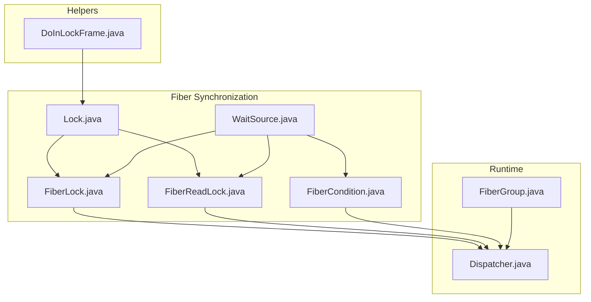

**Diagram sources**
- [Lock.java](file://server/src/main/java/com/github/dtprj/dongting/fiber/Lock.java#L1-L39)
- [FiberLock.java](file://server/src/main/java/com/github/dtprj/dongting/fiber/FiberLock.java#L1-L116)
- [FiberReadLock.java](file://server/src/main/java/com/github/dtprj/dongting/fiber/FiberReadLock.java#L1-L94)
- [FiberCondition.java](file://server/src/main/java/com/github/dtprj/dongting/fiber/FiberCondition.java#L1-L99)
- [WaitSource.java](file://server/src/main/java/com/github/dtprj/dongting/fiber/WaitSource.java#L1-L78)
- [FiberGroup.java](file://server/src/main/java/com/github/dtprj/dongting/fiber/FiberGroup.java#L1-L353)
- [Dispatcher.java](file://server/src/main/java/com/github/dtprj/dongting/fiber/Dispatcher.java#L1-L655)
- [DoInLockFrame.java](file://server/src/main/java/com/github/dtprj/dongting/fiber/DoInLockFrame.java#L1-L54)

**Section sources**
- [FiberLock.java](file://server/src/main/java/com/github/dtprj/dongting/fiber/FiberLock.java#L1-L116)
- [FiberReadLock.java](file://server/src/main/java/com/github/dtprj/dongting/fiber/FiberReadLock.java#L1-L94)
- [Lock.java](file://server/src/main/java/com/github/dtprj/dongting/fiber/Lock.java#L1-L39)
- [FiberCondition.java](file://server/src/main/java/com/github/dtprj/dongting/fiber/FiberCondition.java#L1-L99)
- [WaitSource.java](file://server/src/main/java/com/github/dtprj/dongting/fiber/WaitSource.java#L1-L78)
- [FiberGroup.java](file://server/src/main/java/com/github/dtprj/dongting/fiber/FiberGroup.java#L1-L353)
- [Dispatcher.java](file://server/src/main/java/com/github/dtprj/dongting/fiber/Dispatcher.java#L1-L655)
- [DoInLockFrame.java](file://server/src/main/java/com/github/dtprj/dongting/fiber/DoInLockFrame.java#L1-L54)

## Core Components
- FiberLock: Exclusive reentrant lock with read lock support. Provides lock(), tryLock(timeout), tryLock(), and unlock().
- FiberReadLock: Shared (read) lock bound to a FiberLock. Supports lock(), tryLock(timeout), tryLock(), and unlock().
- Lock: Abstract base exposing lock, tryLock, and unlock APIs.
- FiberCondition: Condition variable for fiber coordination with await variants and signaling.
- WaitSource: Internal base managing wait queues and signaling.
- Dispatcher and FiberGroup: Runtime that schedules fibers cooperatively and manages timeouts/interruption.

Key characteristics:
- Non-blocking acquisition within a FiberGroup: If a lock is available, acquisition returns immediately without blocking.
- Cooperative scheduling on contention: When unavailable, a fiber suspends and is resumed by the dispatcher upon signal or timeout.
- Independent of locks: FiberCondition can be used without holding a lock; it coordinates fibers within the same group.

**Section sources**
- [FiberLock.java](file://server/src/main/java/com/github/dtprj/dongting/fiber/FiberLock.java#L1-L116)
- [FiberReadLock.java](file://server/src/main/java/com/github/dtprj/dongting/fiber/FiberReadLock.java#L1-L94)
- [Lock.java](file://server/src/main/java/com/github/dtprj/dongting/fiber/Lock.java#L1-L39)
- [FiberCondition.java](file://server/src/main/java/com/github/dtprj/dongting/fiber/FiberCondition.java#L1-L99)
- [WaitSource.java](file://server/src/main/java/com/github/dtprj/dongting/fiber/WaitSource.java#L1-L78)
- [Dispatcher.java](file://server/src/main/java/com/github/dtprj/dongting/fiber/Dispatcher.java#L422-L463)
- [FiberGroup.java](file://server/src/main/java/com/github/dtprj/dongting/fiber/FiberGroup.java#L116-L131)

## Architecture Overview
The synchronization primitives integrate with the cooperative scheduler:

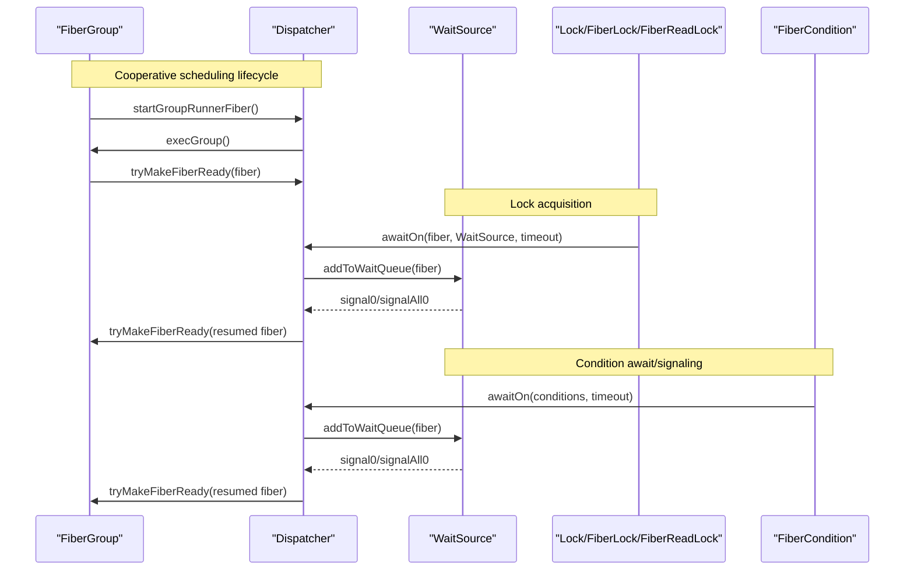

**Diagram sources**
- [FiberGroup.java](file://server/src/main/java/com/github/dtprj/dongting/fiber/FiberGroup.java#L138-L204)
- [Dispatcher.java](file://server/src/main/java/com/github/dtprj/dongting/fiber/Dispatcher.java#L422-L463)
- [WaitSource.java](file://server/src/main/java/com/github/dtprj/dongting/fiber/WaitSource.java#L36-L77)
- [FiberLock.java](file://server/src/main/java/com/github/dtprj/dongting/fiber/FiberLock.java#L63-L116)
- [FiberReadLock.java](file://server/src/main/java/com/github/dtprj/dongting/fiber/FiberReadLock.java#L50-L94)
- [FiberCondition.java](file://server/src/main/java/com/github/dtprj/dongting/fiber/FiberCondition.java#L63-L99)

## Detailed Component Analysis

### FiberLock and FiberReadLock
FiberLock implements a reentrant exclusive lock with a companion FiberReadLock for shared access. Both extend Lock and rely on WaitSource for queuing and signaling.

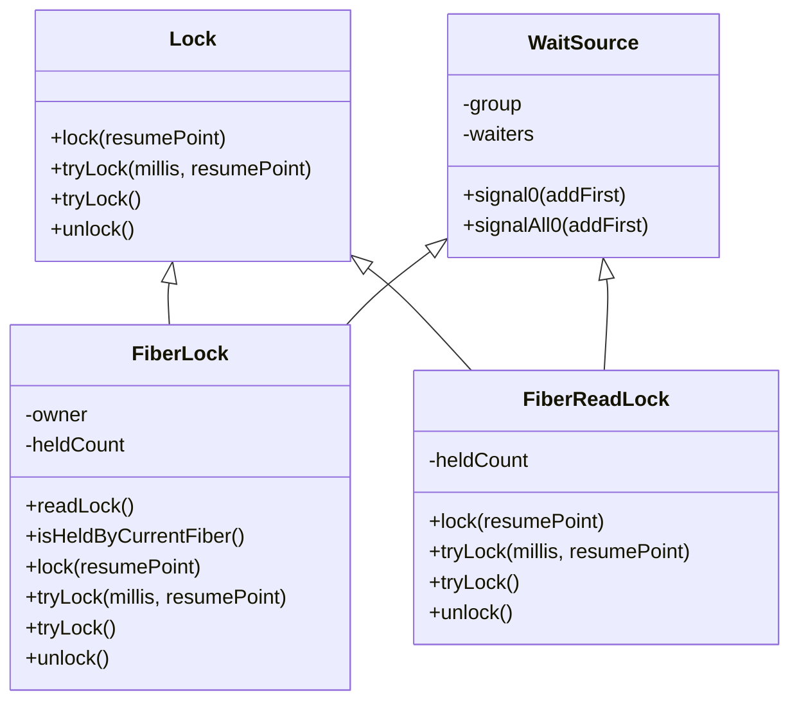

- Exclusive vs shared:
  - FiberLock grants exclusive access; FiberReadLock allows multiple readers when no writer holds the lock.
- Reentrancy:
  - Same fiber can acquire the same lock multiple times; heldCount tracks depth.
- Acquisition and suspension:
  - If shouldWait returns true, the fiber suspends via Dispatcher.awaitOn and resumes on signal or timeout.
- Unlock semantics:
  - FiberLock decrements heldCount; when zero, signals waiters or read lock holders.
  - FiberReadLock decrements heldCount; when zero, signals the write lock.

**Diagram sources**
- [Lock.java](file://server/src/main/java/com/github/dtprj/dongting/fiber/Lock.java#L1-L39)
- [FiberLock.java](file://server/src/main/java/com/github/dtprj/dongting/fiber/FiberLock.java#L1-L116)
- [FiberReadLock.java](file://server/src/main/java/com/github/dtprj/dongting/fiber/FiberReadLock.java#L1-L94)
- [WaitSource.java](file://server/src/main/java/com/github/dtprj/dongting/fiber/WaitSource.java#L1-L78)

**Section sources**
- [FiberLock.java](file://server/src/main/java/com/github/dtprj/dongting/fiber/FiberLock.java#L35-L116)
- [FiberReadLock.java](file://server/src/main/java/com/github/dtprj/dongting/fiber/FiberReadLock.java#L35-L94)
- [Lock.java](file://server/src/main/java/com/github/dtprj/dongting/fiber/Lock.java#L21-L39)
- [WaitSource.java](file://server/src/main/java/com/github/dtprj/dongting/fiber/WaitSource.java#L36-L77)

### FiberCondition
FiberCondition enables coordinated waiting and signaling among fibers within the same FiberGroup. It is independent of locks and relies on WaitSource for queueing.

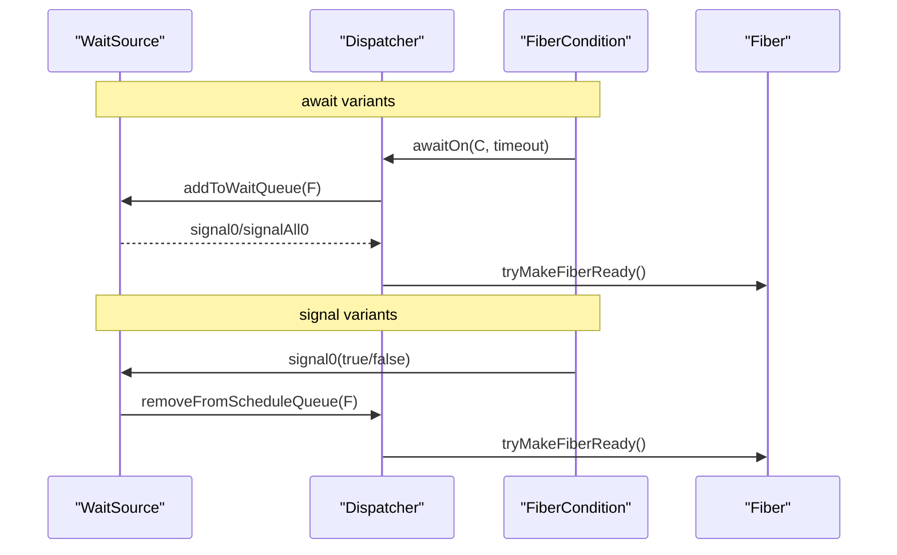

- await variants:
  - await(resumePoint): indefinite wait.
  - await(millis, resumePoint): timed wait.
  - await(time, unit, resumePoint): timed wait with unit.
  - await(another, resumePoint): multi-condition wait with two conditions.
  - await(millis, another, resumePoint): multi-condition timed wait.
- signal variants:
  - signal(): wake one waiter.
  - signalLater(): schedule wake-up after current frame completes.
  - signalAll(): wake all waiters.

**Diagram sources**
- [FiberCondition.java](file://server/src/main/java/com/github/dtprj/dongting/fiber/FiberCondition.java#L48-L99)
- [Dispatcher.java](file://server/src/main/java/com/github/dtprj/dongting/fiber/Dispatcher.java#L422-L463)
- [WaitSource.java](file://server/src/main/java/com/github/dtprj/dongting/fiber/WaitSource.java#L36-L77)

**Section sources**
- [FiberCondition.java](file://server/src/main/java/com/github/dtprj/dongting/fiber/FiberCondition.java#L23-L99)
- [Dispatcher.java](file://server/src/main/java/com/github/dtprj/dongting/fiber/Dispatcher.java#L422-L463)
- [WaitSource.java](file://server/src/main/java/com/github/dtprj/dongting/fiber/WaitSource.java#L36-L77)

### Cooperative Scheduling and Contention Handling
- Non-blocking acquisition:
  - If a lock is free, lock() and tryLock() return immediately without blocking.
- Suspension and resumption:
  - On contention, the fiber suspends via awaitOn and is resumed by the dispatcher when signaled or when timeout elapses.
- Interrupt handling:
  - If a waiting fiber is interrupted, the dispatcher sets an interrupt exception and resumes the fiber promptly.

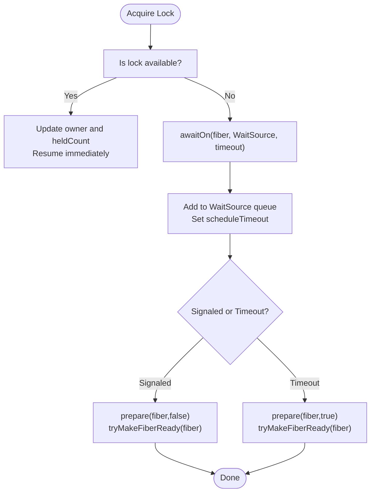

**Diagram sources**
- [FiberLock.java](file://server/src/main/java/com/github/dtprj/dongting/fiber/FiberLock.java#L63-L116)
- [FiberReadLock.java](file://server/src/main/java/com/github/dtprj/dongting/fiber/FiberReadLock.java#L50-L94)
- [Dispatcher.java](file://server/src/main/java/com/github/dtprj/dongting/fiber/Dispatcher.java#L422-L463)
- [WaitSource.java](file://server/src/main/java/com/github/dtprj/dongting/fiber/WaitSource.java#L36-L77)

**Section sources**
- [Dispatcher.java](file://server/src/main/java/com/github/dtprj/dongting/fiber/Dispatcher.java#L422-L463)
- [WaitSource.java](file://server/src/main/java/com/github/dtprj/dongting/fiber/WaitSource.java#L36-L77)

### Usage Patterns and Examples

#### Producer-Consumer with FiberCondition
- Use await to block consumers until producers signal.
- Use signal or signalAll to wake waiting consumers.

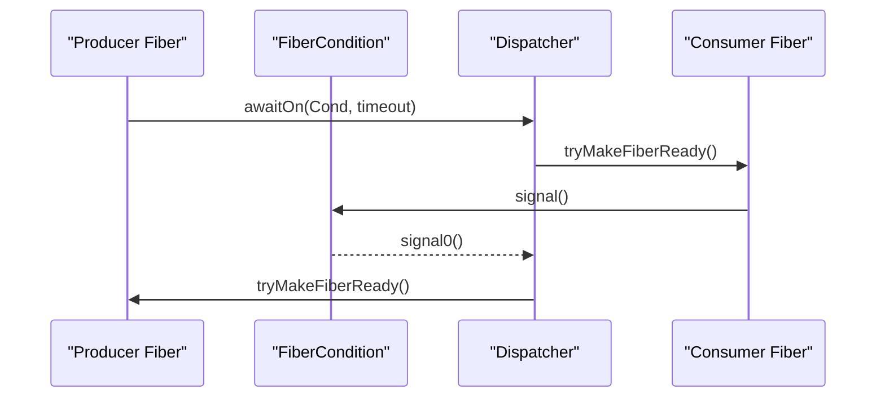

**Diagram sources**
- [FiberCondition.java](file://server/src/main/java/com/github/dtprj/dongting/fiber/FiberCondition.java#L63-L99)
- [Dispatcher.java](file://server/src/main/java/com/github/dtprj/dongting/fiber/Dispatcher.java#L422-L463)

**Section sources**
- [ConditionTest.java](file://server/src/test/java/com/github/dtprj/dongting/fiber/ConditionTest.java#L61-L98)

#### Barrier Synchronization
- Multiple fibers await the same condition; one fiber signals when all reach the barrier.

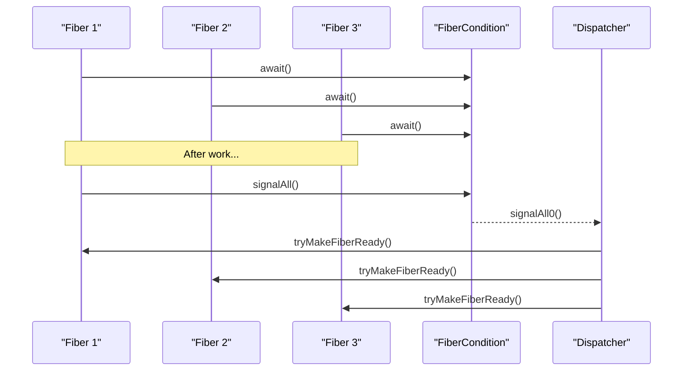

**Diagram sources**
- [FiberCondition.java](file://server/src/main/java/com/github/dtprj/dongting/fiber/FiberCondition.java#L58-L61)
- [Dispatcher.java](file://server/src/main/java/com/github/dtprj/dongting/fiber/Dispatcher.java#L422-L463)

**Section sources**
- [ConditionTest.java](file://server/src/test/java/com/github/dtprj/dongting/fiber/ConditionTest.java#L165-L185)

#### Conditional Waiting with Multi-Condition
- Await on multiple conditions and chain subsequent waits.

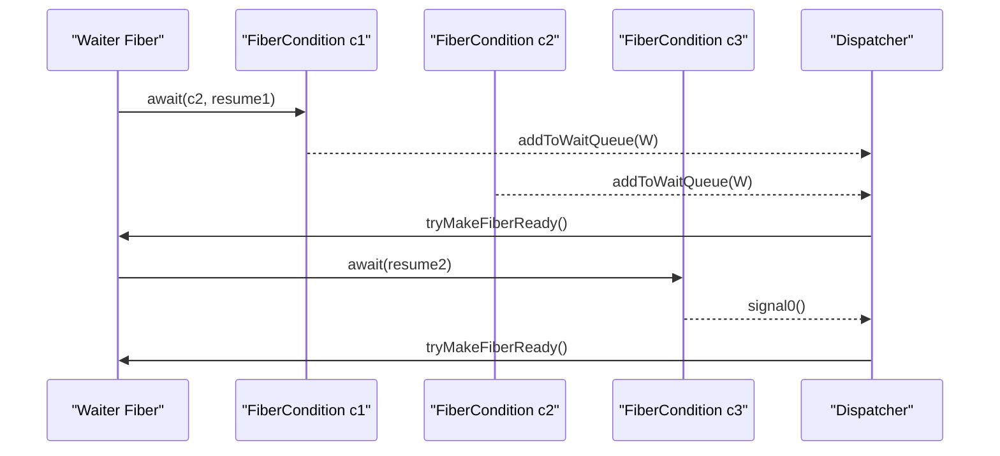

**Diagram sources**
- [FiberCondition.java](file://server/src/main/java/com/github/dtprj/dongting/fiber/FiberCondition.java#L75-L99)
- [Dispatcher.java](file://server/src/main/java/com/github/dtprj/dongting/fiber/Dispatcher.java#L446-L463)

**Section sources**
- [ConditionTest.java](file://server/src/test/java/com/github/dtprj/dongting/fiber/ConditionTest.java#L188-L232)

#### tryLock with Timeout
- Use tryLock(millis, resumePoint) to attempt acquisition with a timeout.

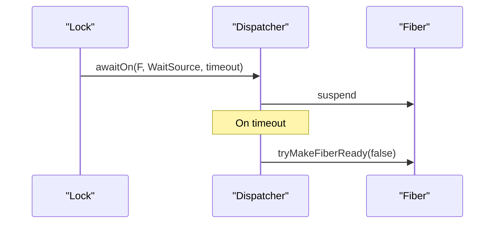

**Diagram sources**
- [FiberLock.java](file://server/src/main/java/com/github/dtprj/dongting/fiber/FiberLock.java#L74-L84)
- [FiberReadLock.java](file://server/src/main/java/com/github/dtprj/dongting/fiber/FiberReadLock.java#L61-L71)
- [Dispatcher.java](file://server/src/main/java/com/github/dtprj/dongting/fiber/Dispatcher.java#L422-L444)

**Section sources**
- [LockTest.java](file://server/src/test/java/com/github/dtprj/dongting/fiber/LockTest.java#L220-L241)

#### Interruptible Waiting
- Interrupt a waiting fiber to abort the wait.

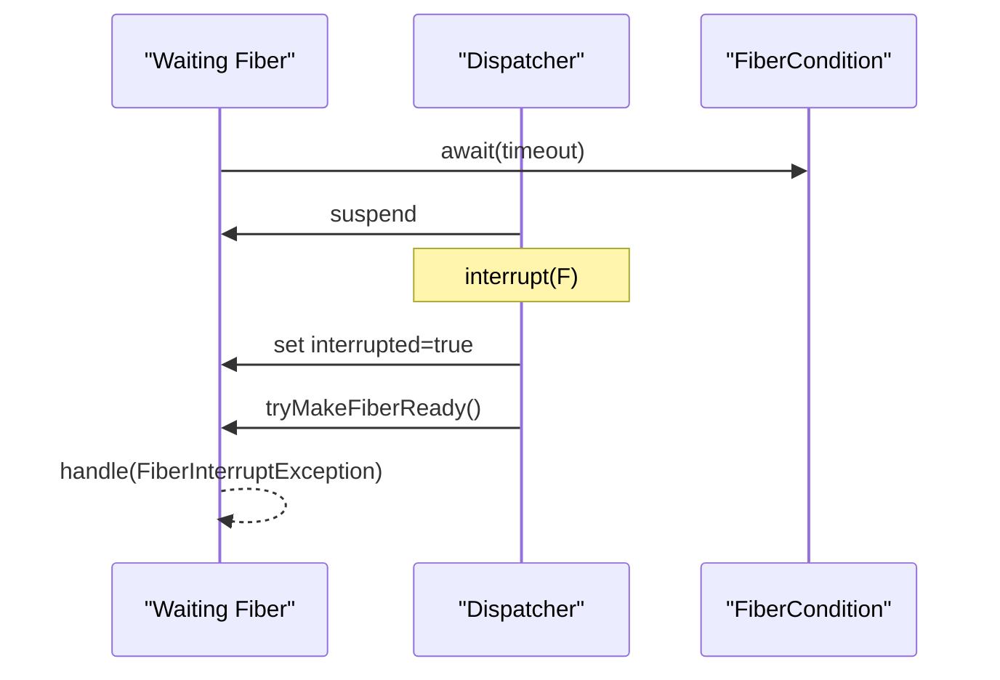

**Diagram sources**
- [Dispatcher.java](file://server/src/main/java/com/github/dtprj/dongting/fiber/Dispatcher.java#L551-L586)
- [ConditionTest.java](file://server/src/test/java/com/github/dtprj/dongting/fiber/ConditionTest.java#L101-L139)

**Section sources**
- [Dispatcher.java](file://server/src/main/java/com/github/dtprj/dongting/fiber/Dispatcher.java#L551-L586)
- [ConditionTest.java](file://server/src/test/java/com/github/dtprj/dongting/fiber/ConditionTest.java#L101-L139)

#### Proper Exception Handling and Finally Blocks
- Use DoInLockFrame to ensure locks are released in doFinally.

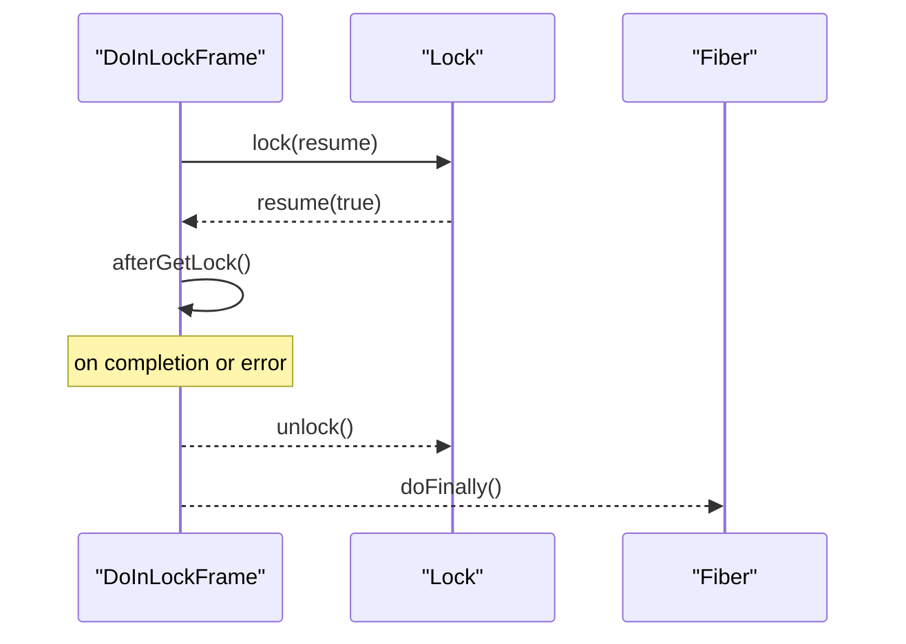

**Diagram sources**
- [DoInLockFrame.java](file://server/src/main/java/com/github/dtprj/dongting/fiber/DoInLockFrame.java#L21-L54)
- [Lock.java](file://server/src/main/java/com/github/dtprj/dongting/fiber/Lock.java#L31-L38)

**Section sources**
- [DoInLockFrame.java](file://server/src/main/java/com/github/dtprj/dongting/fiber/DoInLockFrame.java#L21-L54)
- [LockTest.java](file://server/src/test/java/com/github/dtprj/dongting/fiber/LockTest.java#L87-L146)

## Dependency Analysis
- FiberLock and FiberReadLock depend on WaitSource for queueing and signaling.
- Dispatcher orchestrates suspension/resumption and manages timeouts and interrupts.
- FiberGroup provides the execution context and creates synchronization primitives.

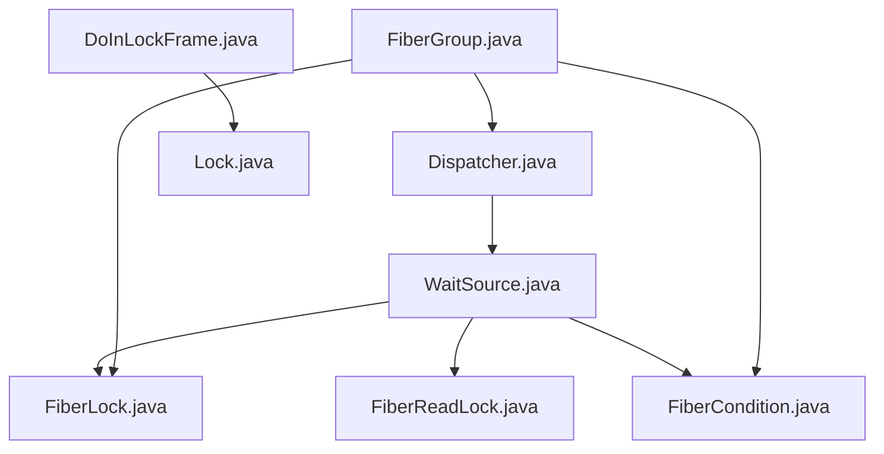

**Diagram sources**
- [Dispatcher.java](file://server/src/main/java/com/github/dtprj/dongting/fiber/Dispatcher.java#L422-L463)
- [WaitSource.java](file://server/src/main/java/com/github/dtprj/dongting/fiber/WaitSource.java#L36-L77)
- [FiberLock.java](file://server/src/main/java/com/github/dtprj/dongting/fiber/FiberLock.java#L1-L116)
- [FiberReadLock.java](file://server/src/main/java/com/github/dtprj/dongting/fiber/FiberReadLock.java#L1-L94)
- [FiberCondition.java](file://server/src/main/java/com/github/dtprj/dongting/fiber/FiberCondition.java#L1-L99)
- [FiberGroup.java](file://server/src/main/java/com/github/dtprj/dongting/fiber/FiberGroup.java#L116-L131)
- [DoInLockFrame.java](file://server/src/main/java/com/github/dtprj/dongting/fiber/DoInLockFrame.java#L21-L54)
- [Lock.java](file://server/src/main/java/com/github/dtprj/dongting/fiber/Lock.java#L21-L39)

**Section sources**
- [FiberLock.java](file://server/src/main/java/com/github/dtprj/dongting/fiber/FiberLock.java#L1-L116)
- [FiberReadLock.java](file://server/src/main/java/com/github/dtprj/dongting/fiber/FiberReadLock.java#L1-L94)
- [FiberCondition.java](file://server/src/main/java/com/github/dtprj/dongting/fiber/FiberCondition.java#L1-L99)
- [WaitSource.java](file://server/src/main/java/com/github/dtprj/dongting/fiber/WaitSource.java#L1-L78)
- [Dispatcher.java](file://server/src/main/java/com/github/dtprj/dongting/fiber/Dispatcher.java#L422-L463)
- [FiberGroup.java](file://server/src/main/java/com/github/dtprj/dongting/fiber/FiberGroup.java#L116-L131)
- [DoInLockFrame.java](file://server/src/main/java/com/github/dtprj/dongting/fiber/DoInLockFrame.java#L21-L54)
- [Lock.java](file://server/src/main/java/com/github/dtprj/dongting/fiber/Lock.java#L21-L39)

## Performance Considerations
- Non-blocking fast-path: tryLock and lock return immediately when the lock is available.
- Minimal overhead on contention: suspension uses WaitSource queues and Dispatcher scheduling without OS-level blocking.
- Timely cleanup: Dispatcher removes fibers from schedule queues on interruption or timeout.
- Cooperative fairness: fibers are scheduled cooperatively; ensure balanced workload to avoid starvation.

[No sources needed since this section provides general guidance]

## Troubleshooting Guide
Common pitfalls and remedies:
- Deadlock avoidance:
  - Avoid acquiring multiple locks in different orders across fibers.
  - Prefer consistent lock ordering or use tryLock with timeouts to break cycles.
- Always release locks:
  - Use DoInLockFrame to guarantee unlock in doFinally.
  - For manual frames, wrap critical sections with a finally/doFinally block to ensure unlock.
- Interrupt handling:
  - Waiting fibers can be interrupted; handle FiberInterruptException and ensure cleanup.
- Timeout misuse:
  - Ensure timeouts are reasonable; too small timeouts can cause busy-wait loops.
- Multi-condition correctness:
  - When awaiting multiple conditions, ensure signaling matches the intended condition chain.

**Section sources**
- [DoInLockFrame.java](file://server/src/main/java/com/github/dtprj/dongting/fiber/DoInLockFrame.java#L21-L54)
- [Dispatcher.java](file://server/src/main/java/com/github/dtprj/dongting/fiber/Dispatcher.java#L551-L586)
- [ConditionTest.java](file://server/src/test/java/com/github/dtprj/dongting/fiber/ConditionTest.java#L101-L139)
- [LockTest.java](file://server/src/test/java/com/github/dtprj/dongting/fiber/LockTest.java#L87-L146)

## Conclusion
Dongting’s fiber synchronization primitives provide a high-performance, cooperative alternative to traditional thread-based locks and conditions. FiberLock offers reentrant exclusive and shared locking with API parity to ReentrantReadWriteLock, while FiberCondition enables flexible coordination among fibers. By leveraging non-blocking acquisition, cooperative scheduling, and structured exception handling, developers can build scalable, deadlock-safe concurrent systems.

[No sources needed since this section summarizes without analyzing specific files]

## Appendices

### API Parity Notes
- FiberLock and FiberReadLock mirror ReentrantReadWriteLock semantics:
  - Reentrant acquisition and heldCount tracking.
  - Separate read/write modes with appropriate contention behavior.
- FiberCondition mirrors condition variable semantics:
  - await variants for indefinite/timed waits.
  - signal and signalAll for waking waiters.
  - Multi-condition chaining for advanced coordination.

**Section sources**
- [FiberLock.java](file://server/src/main/java/com/github/dtprj/dongting/fiber/FiberLock.java#L63-L116)
- [FiberReadLock.java](file://server/src/main/java/com/github/dtprj/dongting/fiber/FiberReadLock.java#L50-L94)
- [FiberCondition.java](file://server/src/main/java/com/github/dtprj/dongting/fiber/FiberCondition.java#L63-L99)