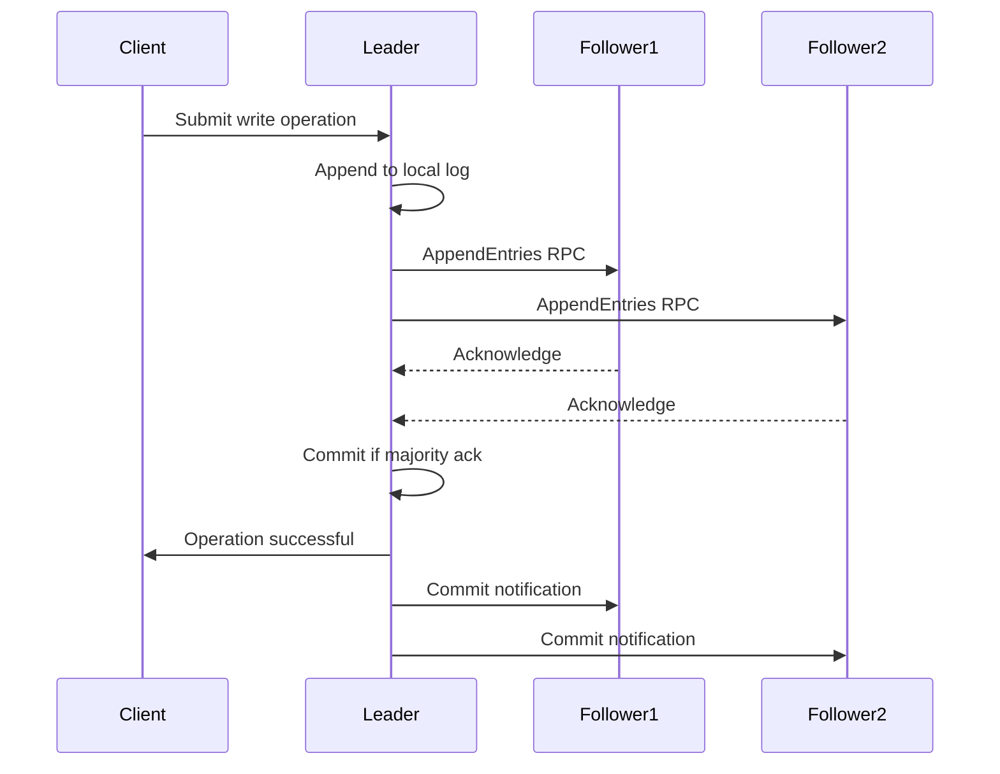
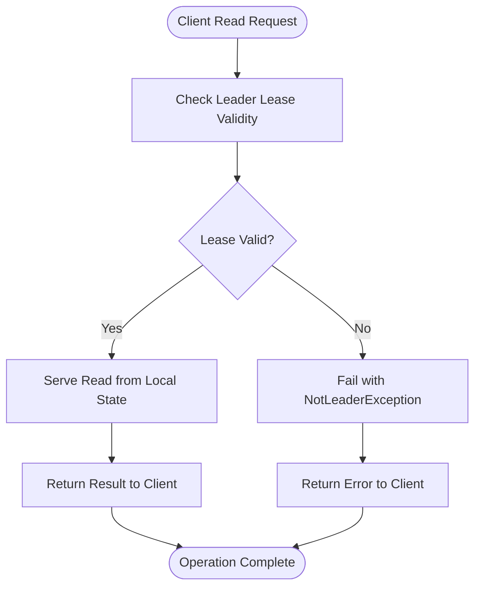
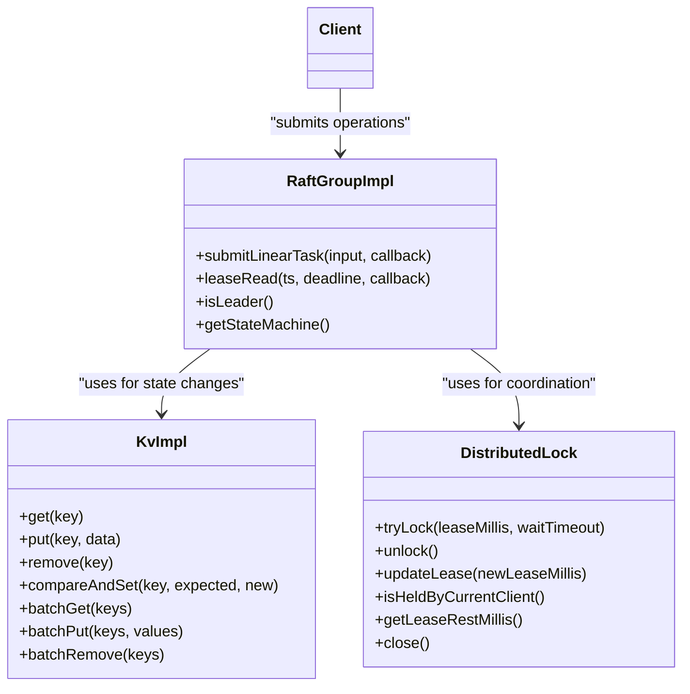
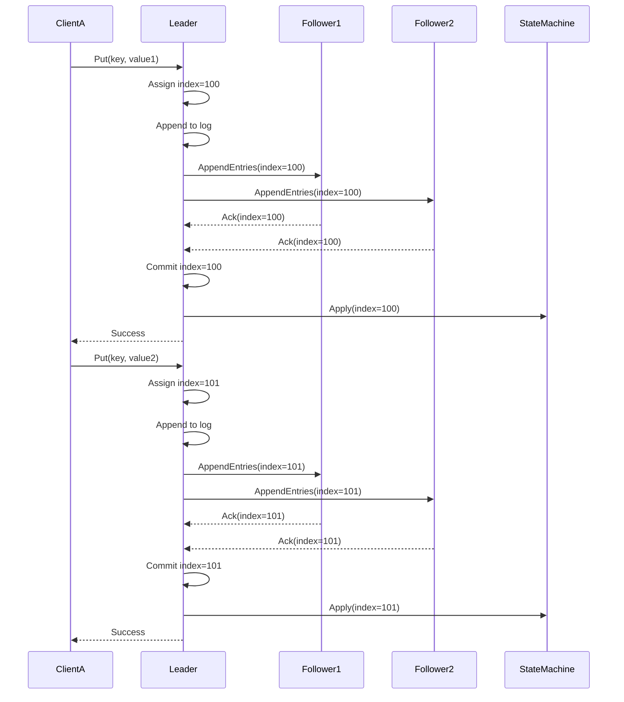
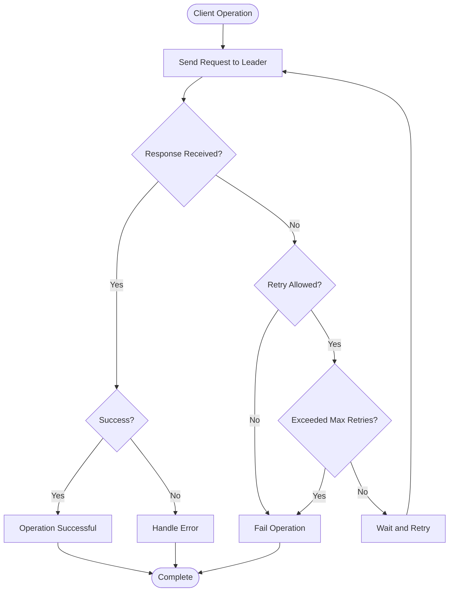

# Linearizability and Consistency Guarantees

<cite>
**Referenced Files in This Document**   
- [RaftUtil.java](file://server/src/main/java/com/github/dtprj/dongting/raft/impl/RaftUtil.java)
- [RaftGroupImpl.java](file://server/src/main/java/com/github/dtprj/dongting/raft/impl/RaftGroupImpl.java)
- [RaftStatusImpl.java](file://server/src/main/java/com/github/dtprj/dongting/raft/impl/RaftStatusImpl.java)
- [KvImpl.java](file://server/src/main/java/com/github/dtprj/dongting/dtkv/server/KvImpl.java)
- [DistributedLock.java](file://client/src/main/java/com/github/dtprj/dongting/dtkv/DistributedLock.java)
- [ApplyManager.java](file://server/src/main/java/com/github/dtprj/dongting/raft/impl/ApplyManager.java)
- [LinearTaskRunner.java](file://server/src/main/java/com/github/dtprj/dongting/raft/impl/LinearTaskRunner.java)
- [RaftLog.java](file://server/src/main/java/com/github/dtprj/dongting/raft/store/RaftLog.java)
- [RaftInput.java](file://server/src/main/java/com/github/dtprj/dongting/raft/server/RaftInput.java)
- [2023_07_25_再论线性一致性.md](file://devlogs/2023_07_25_再论线性一致性.md)
</cite>

## Table of Contents
1. [Introduction](#introduction)
2. [Theoretical Foundation of Linearizable Consistency](#theoretical-foundation-of-linearizable-consistency)
3. [RAFT Consensus and Strong Consistency](#raft-consensus-and-strong-consistency)
4. [Linearizable Reads and Leader Leases](#linearizable-reads-and-leader-leases)
5. [Consistency Model for DtKV Operations](#consistency-model-for-dtkv-operations)
6. [Raft Log and Total Order of Operations](#raft-log-and-total-order-of-operations)
7. [Network Partitions and Split-Brain Scenarios](#network-partitions-and-split-brain-scenarios)
8. [Client Retries and Consistency Guarantees](#client-retries-and-consistency-guarantees)
9. [Performance-Cost Trade-offs](#performance-cost-trade-offs)
10. [Applications and Anti-patterns](#applications-and-anti-patterns)
11. [Conclusion](#conclusion)

## Introduction
Dongting provides strong consistency guarantees through its implementation of the RAFT consensus algorithm, ensuring linearizable consistency for all state changes in the distributed system. This document explains the theoretical foundation of linearizable consistency and details how Dongting achieves these guarantees through its RAFT implementation, leader leases, and distributed locking mechanisms. The system ensures that all operations appear to occur instantaneously at some point between their invocation and response, providing the illusion of a single, atomic system to clients.

## Theoretical Foundation of Linearizable Consistency
Linearizable consistency is the strongest consistency model in distributed systems, providing the illusion that all operations on a data item occur atomically and instantaneously. In a linearizable system, each operation appears to take effect at a single point in time between its invocation and response, and the operations of all processes on the data item form a single total order that is consistent with real-time ordering.

As explained in the development log on linear consistency, linearizability goes beyond causal consistency (which requires that causally related events be observed in the same order by all processes) and sequential consistency (which requires that all processes see all operations in the same order). Linearizability adds the real-time constraint: if operation A completes before operation B begins, then A must appear before B in the total order.

This property is crucial for distributed systems because it allows developers to reason about the system as if it were a single, atomic entity, even though it may be composed of many distributed components. For example, in a distributed key-value store like Dongting's DtKV, linearizability ensures that once a write operation completes successfully, all subsequent read operations will observe that write or a later one, never reverting to an earlier state.

**Section sources**
- [2023_07_25_再论线性一致性.md](file://devlogs/2023_07_25_再论线性一致性.md#L1-L64)

## RAFT Consensus and Strong Consistency
Dongting implements the RAFT consensus algorithm to provide strong consistency for all state changes. The RAFT algorithm ensures that all state changes are replicated across a majority of nodes in the cluster before being considered committed, providing fault tolerance and consistency even in the presence of node failures.

The core of RAFT's consistency guarantee lies in its leader election and log replication mechanisms. At any given time, there is at most one leader in the cluster, and all state changes must go through the leader. The leader appends each operation to its log and then replicates it to a majority of followers before acknowledging the operation to the client. This ensures that any committed operation is stored on a majority of nodes, making it durable and consistent.

In Dongting's implementation, the `RaftGroupImpl` class manages the RAFT group state and provides the interface for submitting linearizable tasks. When a client submits a write operation, it is sent to the current leader, which coordinates the consensus process. The `submitLinearTask` method in `RaftGroupImpl` handles the submission of operations to the RAFT log, ensuring they are processed in a consistent order.

The RAFT algorithm also handles leader election, ensuring that only one node can be elected as leader at a time. When a leader fails, a new leader is elected through a voting process that requires a majority of nodes to agree. This prevents split-brain scenarios where multiple nodes believe they are the leader.

**Diagram sources**
- [RaftGroupImpl.java](file://server/src/main/java/com/github/dtprj/dongting/raft/impl/RaftGroupImpl.java#L79-L87)
- [RaftUtil.java](file://server/src/main/java/com/github/dtprj/dongting/raft/impl/RaftUtil.java#L279-L292)

**Section sources**
- [RaftGroupImpl.java](file://server/src/main/java/com/github/dtprj/dongting/raft/impl/RaftGroupImpl.java#L79-L87)
- [RaftUtil.java](file://server/src/main/java/com/github/dtprj/dongting/raft/impl/RaftUtil.java#L279-L292)

## Linearizable Reads and Leader Leases
Dongting implements linearizable reads using leader leases, which allow the leader to serve read requests directly without going through the full consensus process. This optimization significantly improves read performance while maintaining strong consistency guarantees.

The leader lease mechanism works by granting the leader a time-bounded lease during which it can serve read requests. The lease duration is set to be shorter than the maximum time it would take for the cluster to detect a failed leader and elect a new one. This ensures that at any point in time, at most one node believes it is the leader.

In Dongting's implementation, the lease start time is computed based on the last confirmation times from a quorum of nodes. The `updateLease` method in `RaftUtil` calculates the lease start time as the X-th largest last confirmation time from the members, where X is the read-write quorum size. This ensures that the lease reflects the most recent acknowledgments from a majority of nodes.

When a client performs a read operation, the leader first checks that its lease is still valid by comparing the current time with the lease end time. If the lease has expired, the read request fails with a NotLeaderException, forcing the client to find the current leader. This mechanism ensures that reads are linearizable because they can only succeed when the leader has recent confirmation from a majority of the cluster.

The `leaseRead` method in `RaftGroupImpl` implements this check, refreshing the timestamp and verifying that the lease end time is in the future. If the group is not yet ready (during initial startup or after a leader election), the read request waits until the group is ready before proceeding.

**Diagram sources**
- [RaftUtil.java](file://server/src/main/java/com/github/dtprj/dongting/raft/impl/RaftUtil.java#L203-L252)
- [RaftGroupImpl.java](file://server/src/main/java/com/github/dtprj/dongting/raft/impl/RaftGroupImpl.java#L92-L127)

**Section sources**
- [RaftUtil.java](file://server/src/main/java/com/github/dtprj/dongting/raft/impl/RaftUtil.java#L203-L252)
- [RaftGroupImpl.java](file://server/src/main/java/com/github/dtprj/dongting/raft/impl/RaftGroupImpl.java#L92-L127)

## Consistency Model for DtKV Operations
Dongting's DtKV operations provide strong consistency guarantees through the RAFT consensus algorithm, with special handling for conditional updates and distributed locks. All operations on the key-value store are linearizable, ensuring that clients observe a consistent view of the data.

Conditional updates, such as compare-and-set (CAS) operations, are implemented as linearizable operations in the RAFT log. When a client performs a CAS operation, it is submitted as a normal RAFT log entry and must go through the consensus process. The `compareAndSet` method in `KvImpl` checks the current value against the expected value and only updates it if they match. This operation is atomic and linearizable because it is processed through the RAFT log, ensuring that all nodes in the cluster agree on the outcome.

Distributed locks in Dongting are implemented with lease-based semantics, where each lock has a time-to-live (TTL) that prevents indefinite holding in case of client failure. The `DistributedLock` interface provides methods for acquiring, releasing, and updating the lease of a lock. When a client acquires a lock, it specifies a lease duration, and the lock is automatically released when the lease expires.

The implementation ensures that lock operations are linearizable by processing them through the RAFT log. When a client attempts to acquire a lock, the operation is submitted to the leader, which coordinates the consensus process to ensure that only one client can hold the lock at a time. The `tryLock` method returns immediately if the lock is held by another client, or blocks for the specified timeout period.

**Diagram sources**
- [KvImpl.java](file://server/src/main/java/com/github/dtprj/dongting/dtkv/server/KvImpl.java#L235-L800)
- [DistributedLock.java](file://client/src/main/java/com/github/dtprj/dongting/dtkv/DistributedLock.java#L31-L153)
- [RaftGroupImpl.java](file://server/src/main/java/com/github/dtprj/dongting/raft/impl/RaftGroupImpl.java#L62-L219)

**Section sources**
- [KvImpl.java](file://server/src/main/java/com/github/dtprj/dongting/dtkv/server/KvImpl.java#L235-L800)
- [DistributedLock.java](file://client/src/main/java/com/github/dtprj/dongting/dtkv/DistributedLock.java#L31-L153)

## Raft Log and Total Order of Operations
The RAFT log in Dongting ensures a total order of operations across all nodes in the cluster, which is fundamental to providing linearizable consistency. Every state change in the system is recorded as an entry in the RAFT log, and these entries are processed in a strict, agreed-upon order.

The `RaftLog` interface defines the operations for managing the log, including initialization, appending entries, and truncating the log. The log is append-only, and entries are only removed when they are no longer needed for consistency or when they are superseded by a snapshot. The total order is maintained by assigning each log entry a unique index, and all nodes in the cluster agree on the sequence of entries up to the commit index.

When the leader receives a write operation, it assigns the next available index to the operation and appends it to its local log. It then replicates the entry to followers through AppendEntries RPCs. Once a majority of nodes have acknowledged the entry, it is considered committed and can be applied to the state machine. The `LinearTaskRunner` class processes incoming operations and appends them to the log with monotonically increasing indices, ensuring the total order.

The total order property means that if operation A is assigned a lower index than operation B, then A must appear before B in the history of the system. This allows clients to reason about the system state with confidence, knowing that once an operation with a certain index is observed, all operations with lower indices have also been applied.

The RAFT log also includes metadata for each entry, such as the term in which it was created and the timestamp of when it was received by the leader. This metadata helps in maintaining consistency during leader elections and in providing linearizable reads.

**Diagram sources**
- [RaftLog.java](file://server/src/main/java/com/github/dtprj/dongting/raft/store/RaftLog.java#L31-L45)
- [LinearTaskRunner.java](file://server/src/main/java/com/github/dtprj/dongting/raft/impl/LinearTaskRunner.java#L162-L200)
- [RaftInput.java](file://server/src/main/java/com/github/dtprj/dongting/raft/server/RaftInput.java#L38-L99)

**Section sources**
- [RaftLog.java](file://server/src/main/java/com/github/dtprj/dongting/raft/store/RaftLog.java#L31-L45)
- [LinearTaskRunner.java](file://server/src/main/java/com/github/dtprj/dongting/raft/impl/LinearTaskRunner.java#L162-L200)

## Network Partitions and Split-Brain Scenarios
Dongting handles network partitions and split-brain scenarios through the RAFT consensus algorithm's quorum-based design, which ensures that at most one partition can make progress at a time. This prevents the system from diverging into inconsistent states when network connectivity is lost.

In a network partition, the cluster may be split into multiple isolated groups of nodes. RAFT's election mechanism ensures that only one group can contain a majority of nodes, and only that group can elect a leader and process write operations. The other groups, lacking a majority, cannot elect a leader and will reject write operations.

For example, in a 5-node cluster, if a network partition splits the nodes into groups of 3 and 2, only the group of 3 can elect a leader and process writes. The group of 2 cannot elect a leader because it lacks a majority (3 out of 5 nodes). This ensures that all write operations are processed by a single, consistent leader, preventing split-brain scenarios.

When the network partition heals, the nodes in the minority partition will detect that they are behind the current term and will update their state to match the majority partition. The `incrTerm` method in `RaftUtil` handles this scenario by updating the local term to match the higher term observed in AppendEntries RPCs from the current leader.

During a network partition, read operations may still succeed in the majority partition if the leader's lease is valid. In the minority partition, read operations will fail because no leader can be elected. This behavior ensures that clients either get consistent results from the majority partition or receive an error, but never get stale or inconsistent data.

The system also handles the case where a leader in a minority partition attempts to serve requests. When such a leader receives an AppendEntries RPC from a node in the majority partition with a higher term, it will step down and become a follower, preventing inconsistent state changes.

**Section sources**
- [RaftUtil.java](file://server/src/main/java/com/github/dtprj/dongting/raft/impl/RaftUtil.java#L102-L128)
- [RaftStatusImpl.java](file://server/src/main/java/com/github/dtprj/dongting/raft/impl/RaftStatusImpl.java#L65-L111)

## Client Retries and Consistency Guarantees
Client retries in Dongting are designed to work seamlessly with the consistency guarantees provided by the RAFT consensus algorithm. When a client operation fails due to network issues or leader changes, the client can safely retry the operation without violating consistency.

For idempotent operations like reads, retries are straightforward since they do not change the system state. The client can retry a read operation until it succeeds or times out, and each successful read will return a consistent view of the data.

For non-idempotent operations like writes, Dongting's design ensures that retries do not cause unintended side effects. When a client submits a write operation, it may not receive a response if the network fails after the operation was committed but before the response was sent. In this case, the client does not know whether the operation succeeded.

To handle this, clients should implement idempotent operations or use mechanisms like operation identifiers to detect duplicate submissions. The system itself ensures that each operation is processed exactly once through the RAFT log, so even if a client retries an operation, it will not be applied multiple times if it was already committed.

The `ApplyManager` class plays a crucial role in ensuring consistency during retries by managing the application of log entries to the state machine. It ensures that each log entry is applied exactly once, even if the system restarts or fails during the application process. The `exec` method in `ApplyManager` processes each RAFT task and ensures that callbacks are invoked appropriately, whether the operation succeeds or fails.

**Diagram sources**
- [ApplyManager.java](file://server/src/main/java/com/github/dtprj/dongting/raft/impl/ApplyManager.java#L159-L205)
- [RaftGroupImpl.java](file://server/src/main/java/com/github/dtprj/dongting/raft/impl/RaftGroupImpl.java#L79-L87)

**Section sources**
- [ApplyManager.java](file://server/src/main/java/com/github/dtprj/dongting/raft/impl/ApplyManager.java#L159-L205)

## Performance-Cost Trade-offs
Dongting's strong consistency model involves performance-cost trade-offs compared to eventual consistency models. The primary cost is increased latency for write operations, as they must be replicated to a majority of nodes before being acknowledged.

In a RAFT-based system, write latency is determined by the round-trip time to the slowest node in the majority quorum. For a 5-node cluster, this means the write must be acknowledged by 3 nodes, so the latency is determined by the second-slowest node. This is inherently higher than an eventually consistent system where writes can be acknowledged immediately upon local persistence.

However, Dongting optimizes read performance through the leader lease mechanism, allowing the leader to serve read requests without contacting other nodes. This makes linearizable reads much faster than writes, approaching the performance of local reads while maintaining strong consistency.

Compared to eventual consistency models, Dongting's approach provides stronger guarantees at the cost of higher write latency and reduced availability during network partitions. In an eventually consistent system, all nodes can accept writes during a partition, but this can lead to conflicts when the partition heals. Dongting prioritizes consistency over availability, ensuring that no conflicting writes can occur.

The system also provides tunable consistency levels. For applications that can tolerate slightly stale reads, clients can use read-only operations that don't require leader leases, trading some consistency for better performance. However, for linearizable reads, the leader lease mechanism ensures that clients always see a consistent view of the data.

These trade-offs make Dongting suitable for applications where data consistency is critical, such as financial systems, inventory management, and distributed locking, while less appropriate for use cases where high write throughput and availability are more important than strict consistency.

## Applications and Anti-patterns
Dongting's linearizable consistency guarantees make it suitable for a variety of applications that require strong data consistency. Key application areas include:

- **Distributed locking**: The distributed lock implementation with lease semantics is ideal for coordinating access to shared resources across a distributed system. Applications can use these locks for leader election, mutual exclusion, and coordination.

- **Configuration management**: Systems that require consistent configuration across all nodes can use Dongting to store and retrieve configuration data with strong consistency guarantees.

- **Service discovery**: The key-value store can maintain a consistent view of service instances and their locations, ensuring that all clients see the same service topology.

- **Leader election**: The combination of conditional updates and distributed locks enables reliable leader election algorithms.

- **Distributed queues and coordination**: Applications can implement distributed queues, barriers, and other coordination primitives using the atomic operations provided by the system.

Anti-patterns to avoid when using Dongting include:

- **High-frequency writes to the same key**: This creates a hotspot that can limit scalability, as all writes must go through the leader and be processed sequentially.

- **Long-running transactions**: The system is optimized for small, atomic operations rather than long-running transactions that hold locks for extended periods.

- **Using it as a high-throughput message queue**: While possible, the strong consistency guarantees come with latency costs that may be unnecessary for messaging use cases.

- **Storing large values**: The system is optimized for small to medium-sized values, as large values increase replication latency and memory usage.

- **Assuming immediate consistency across all operations**: While the system provides linearizable consistency, there are still latency considerations, especially during leader elections or network partitions.

## Conclusion
Dongting provides strong linearizable consistency guarantees through its implementation of the RAFT consensus algorithm, leader leases, and carefully designed distributed operations. The system ensures that all state changes are replicated across a majority of nodes before being considered committed, providing fault tolerance and consistency even in the presence of failures.

The leader lease mechanism enables efficient linearizable reads by allowing the leader to serve read requests directly while maintaining consistency. Conditional updates and distributed locks are implemented as linearizable operations in the RAFT log, ensuring atomic and consistent behavior.

While these strong consistency guarantees come with performance costs, particularly for write operations, they enable a wide range of applications that require reliable, consistent data. By understanding the trade-offs and anti-patterns, developers can effectively leverage Dongting's capabilities to build robust distributed systems.

The implementation demonstrates a deep understanding of distributed systems theory, translating concepts like linearizability and consensus into practical, production-ready code that balances consistency, performance, and reliability.