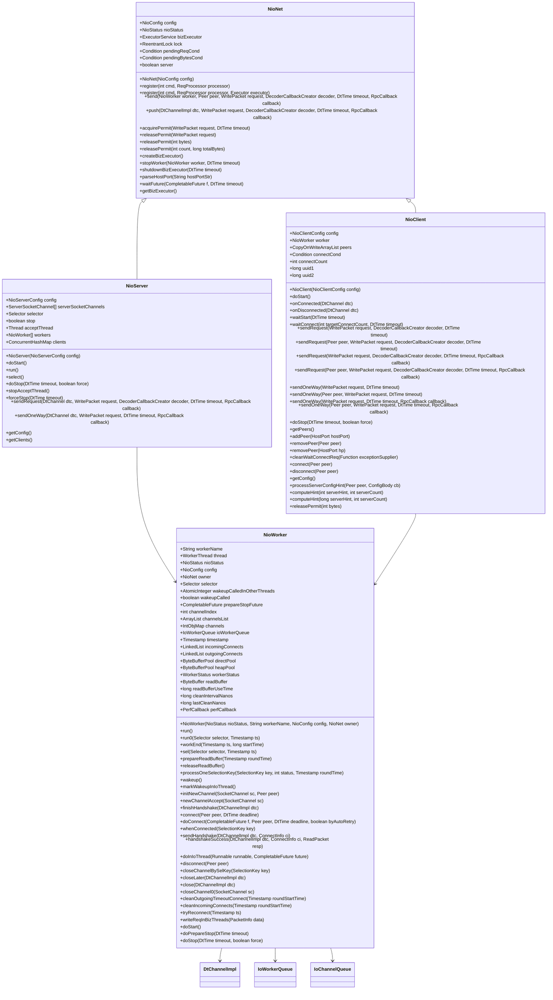
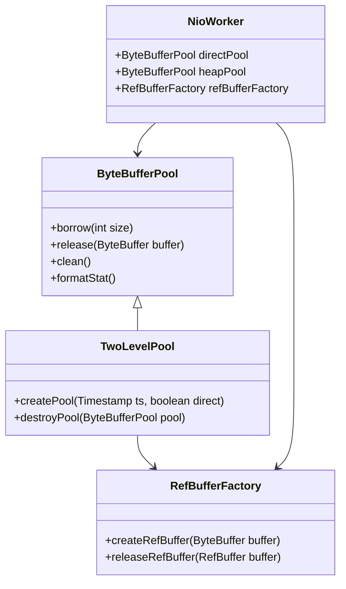
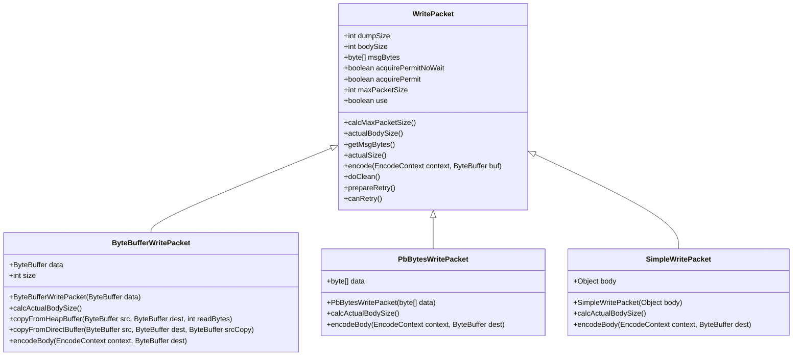
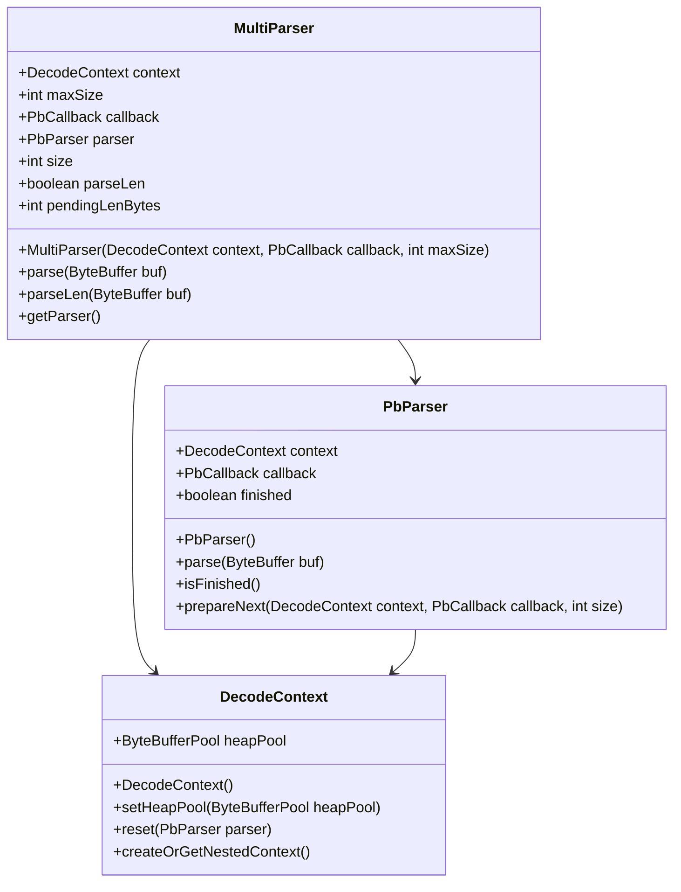
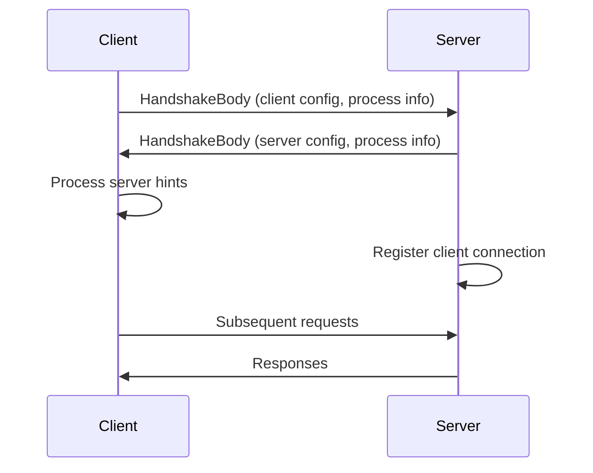
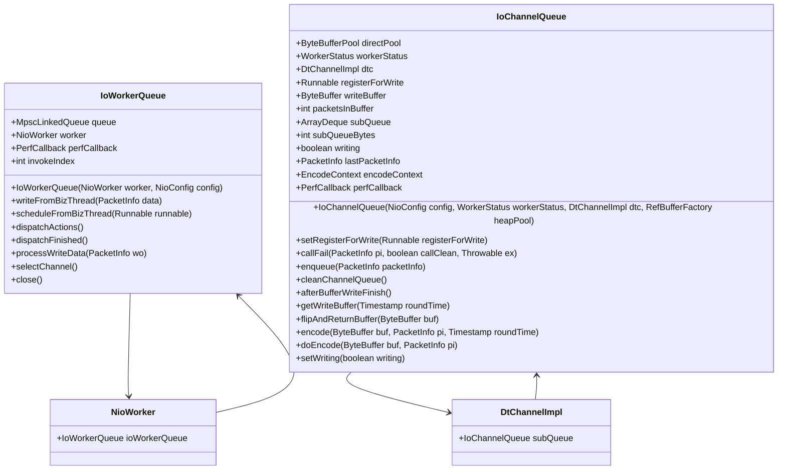
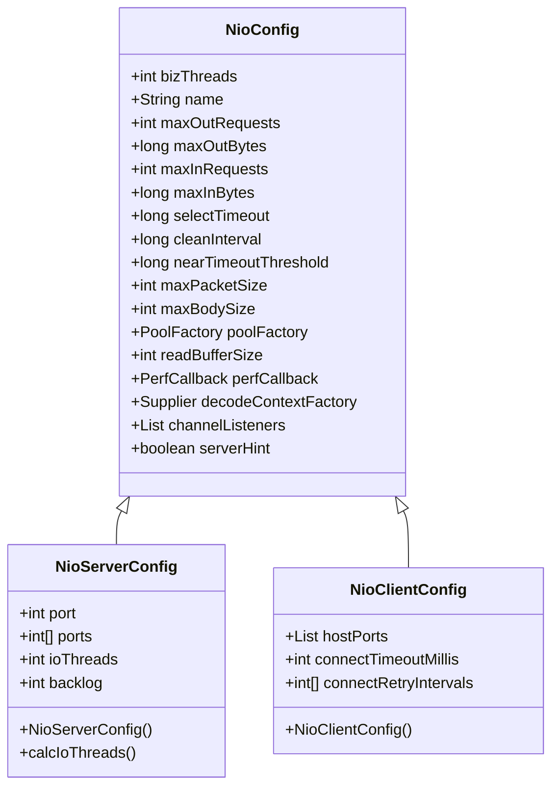

# I/O and Network Optimizations

<cite>
**Referenced Files in This Document**   
- [NioNet.java](file://client/src/main/java/com/github/dtprj/dongting/net/NioNet.java)
- [NioServer.java](file://client/src/main/java/com/github/dtprj/dongting/net/NioServer.java)
- [NioClient.java](file://client/src/main/java/com/github/dtprj/dongting/net/NioClient.java)
- [NioWorker.java](file://client/src/main/java/com/github/dtprj/dongting/net/NioWorker.java)
- [DtChannelImpl.java](file://client/src/main/java/com/github/dtprj/dongting/net/DtChannelImpl.java)
- [WritePacket.java](file://client/src/main/java/com/github/dtprj/dongting/net/WritePacket.java)
- [ByteBufferWritePacket.java](file://client/src/main/java/com/github/dtprj/dongting/net/ByteBufferWritePacket.java)
- [NioConfig.java](file://client/src/main/java/com/github/dtprj/dongting/net/NioConfig.java)
- [NioServerConfig.java](file://client/src/main/java/com/github/dtprj/dongting/net/NioServerConfig.java)
- [NioClientConfig.java](file://client/src/main/java/com/github/dtprj/dongting/net/NioClientConfig.java)
- [HandshakeBody.java](file://client/src/main/java/com/github/dtprj/dongting/net/HandshakeBody.java)
- [HandshakeProcessor.java](file://client/src/main/java/com/github/dtprj/dongting/net/HandshakeProcessor.java)
- [MultiParser.java](file://client/src/main/java/com/github/dtprj/dongting/net/MultiParser.java)
- [IoChannelQueue.java](file://client/src/main/java/com/github/dtprj/dongting/net/IoChannelQueue.java)
- [IoWorkerQueue.java](file://client/src/main/java/com/github/dtprj/dongting/net/IoWorkerQueue.java)
</cite>

## Table of Contents
1. [Introduction](#introduction)
2. [NIO-Based Network Stack Design](#nio-based-network-stack-design)
3. [Direct Buffers and Zero-Copy Techniques](#direct-buffers-and-zero-copy-techniques)
4. [Packet-Based Communication Model](#packet-based-communication-model)
5. [Protocol Parsing Mechanism](#protocol-parsing-mechanism)
6. [Handshake Process](#handshake-process)
7. [Network I/O Scheduling and Thread Model](#network-io-scheduling-and-thread-model)
8. [Configuration Options](#configuration-options)
9. [Performance Metrics and Tuning](#performance-metrics-and-tuning)
10. [Conclusion](#conclusion)

## Introduction
Dongting's I/O and network optimizations are designed to achieve high performance by leveraging modern hardware characteristics such as SSD performance, CPU cache hierarchies, and NUMA architectures. The framework employs a non-blocking I/O (NIO) based network stack that minimizes data copying between user space and kernel space through direct buffers and zero-copy techniques. This document details the architecture, implementation, and optimization strategies that enable Dongting to deliver exceptional performance in high-concurrency scenarios.

**Section sources**
- [NioNet.java](file://client/src/main/java/com/github/dtprj/dongting/net/NioNet.java#L1-L301)
- [NioServer.java](file://client/src/main/java/com/github/dtprj/dongting/net/NioServer.java#L1-L293)

## NIO-Based Network Stack Design
Dongting's network stack is built on Java NIO, utilizing a reactor pattern with multiple selector threads to handle I/O operations efficiently. The design is optimized for modern hardware by aligning with SSD performance characteristics, CPU cache hierarchies, and NUMA architectures. The NioWorker class represents a single thread that manages multiple channels, using a Selector to multiplex I/O events. This approach reduces the overhead of thread context switching and allows the system to scale efficiently with the number of CPU cores.

The network stack is designed to minimize latency and maximize throughput by batching I/O operations and leveraging direct memory access. The use of direct ByteBuffers ensures that data can be transferred between user space and kernel space without unnecessary copying, which is critical for achieving high performance on modern hardware.

**Diagram sources **
- [NioNet.java](file://client/src/main/java/com/github/dtprj/dongting/net/NioNet.java#L47-L301)
- [NioServer.java](file://client/src/main/java/com/github/dtprj/dongting/net/NioServer.java#L49-L293)
- [NioClient.java](file://client/src/main/java/com/github/dtprj/dongting/net/NioClient.java#L41-L363)
- [NioWorker.java](file://client/src/main/java/com/github/dtprj/dongting/net/NioWorker.java#L55-L809)

## Direct Buffers and Zero-Copy Techniques
Dongting employs direct ByteBuffers to minimize data copying between user space and kernel space, a critical optimization for achieving high performance on modern hardware. Direct buffers are allocated outside the Java heap, allowing the operating system to access them directly during I/O operations. This eliminates the need for data to be copied from the Java heap to native memory before being written to the network or disk.

The zero-copy technique is implemented through the use of direct buffers and efficient memory management. When data is received from the network, it is read directly into a direct ByteBuffer, which can then be processed without copying. Similarly, when data is sent to the network, it is written directly from a direct ByteBuffer, avoiding unnecessary data movement.

The NioWorker class manages direct and heap byte buffer pools, ensuring that memory is efficiently reused and minimizing garbage collection overhead. The direct buffer pool is used for I/O operations, while the heap buffer pool is used for temporary data processing. This separation allows the system to optimize memory usage for different types of operations.

**Diagram sources **
- [NioWorker.java](file://client/src/main/java/com/github/dtprj/dongting/net/NioWorker.java#L118-L125)
- [ByteBufferPool.java](file://client/src/main/java/com/github/dtprj/dongting/buf/ByteBufferPool.java#L1-L100)
- [TwoLevelPool.java](file://client/src/main/java/com/github/dtprj/dongting/buf/TwoLevelPool.java#L1-L100)
- [RefBufferFactory.java](file://client/src/main/java/com/github/dtprj/dongting/buf/RefBufferFactory.java#L1-L100)

## Packet-Based Communication Model
Dongting uses a packet-based communication model to reduce serialization overhead and improve performance. The model is designed to minimize the amount of data that needs to be serialized and deserialized during network communication. Specialized write packet implementations are provided for different data types, allowing the system to optimize the serialization process for each type.

The WritePacket class is the base class for all write packets, providing common functionality for encoding and sending data. Subclasses such as ByteBufferWritePacket, PbBytesWritePacket, and SimpleWritePacket are optimized for specific data types, reducing the overhead of generic serialization.

The packet-based model also supports zero-copy operations by allowing direct ByteBuffers to be used as packet payloads. This eliminates the need to copy data from application buffers to network buffers, further reducing overhead.

**Diagram sources **
- [WritePacket.java](file://client/src/main/java/com/github/dtprj/dongting/net/WritePacket.java#L30-L182)
- [ByteBufferWritePacket.java](file://client/src/main/java/com/github/dtprj/dongting/net/ByteBufferWritePacket.java#L25-L90)
- [PbBytesWritePacket.java](file://client/src/main/java/com/github/dtprj/dongting/net/PbBytesWritePacket.java#L1-L100)
- [SimpleWritePacket.java](file://client/src/main/java/com/github/dtprj/dongting/net/SimpleWritePacket.java#L1-L100)

## Protocol Parsing Mechanism
Dongting's protocol parsing mechanism is designed for efficiency, using position-based ByteBuffer operations to minimize overhead. The MultiParser class is responsible for parsing incoming data, using a state machine to handle the variable-length nature of the protocol.

The parser operates in two phases: first, it reads the length prefix from the incoming data, and then it parses the actual message content. This two-phase approach allows the parser to handle messages of varying sizes efficiently, without requiring additional buffering.

The use of position-based operations on ByteBuffers ensures that data is not copied unnecessarily during parsing. The parser maintains its state using the position and limit of the ByteBuffer, allowing it to resume parsing from where it left off when more data becomes available.

**Diagram sources **
- [MultiParser.java](file://client/src/main/java/com/github/dtprj/dongting/net/MultiParser.java#L28-L97)
- [PbParser.java](file://client/src/main/java/com/github/dtprj/dongting/codec/PbParser.java#L1-L100)
- [DecodeContext.java](file://client/src/main/java/com/github/dtprj/dongting/codec/DecodeContext.java#L1-L100)

## Handshake Process
The handshake process in Dongting is used to establish a connection between client and server, exchanging configuration information and verifying compatibility. The process begins with the client sending a HandshakeBody message containing its configuration and process information. The server responds with its own configuration, allowing both sides to adjust their settings based on the capabilities of the other.

The handshake process is implemented using the HandshakeProcessor class, which handles incoming handshake requests and generates appropriate responses. The HandshakeBody class contains the data exchanged during the handshake, including version information, process UUIDs, and configuration parameters.

The handshake process also includes a mechanism for server hints, where the server can provide guidance to the client on optimal configuration settings. This allows the system to adapt to different deployment environments and optimize performance based on the specific characteristics of the network and hardware.

**Diagram sources **
- [HandshakeBody.java](file://client/src/main/java/com/github/dtprj/dongting/net/HandshakeBody.java#L28-L151)
- [HandshakeProcessor.java](file://client/src/main/java/com/github/dtprj/dongting/net/HandshakeProcessor.java#L29-L88)
- [NioClient.java](file://client/src/main/java/com/github/dtprj/dongting/net/NioClient.java#L564-L624)
- [NioServer.java](file://client/src/main/java/com/github/dtprj/dongting/net/NioServer.java#L88-L89)

## Network I/O Scheduling and Thread Model
Dongting's network I/O scheduling strategy is designed to handle high-concurrency scenarios efficiently. The thread model uses a fixed number of NioWorker threads, each managing a subset of the total connections. This approach reduces contention and allows the system to scale with the number of CPU cores.

The IoWorkerQueue class is used to coordinate communication between business threads and I/O threads. Business threads submit write requests to the queue, which are then processed by the I/O thread associated with the target connection. This separation of concerns ensures that I/O operations do not block business logic execution.

The scheduling strategy also includes mechanisms for flow control and back pressure. The NioNet class tracks the number of pending requests and bytes in flight, allowing the system to apply back pressure when necessary to prevent resource exhaustion.

**Diagram sources **
- [IoWorkerQueue.java](file://client/src/main/java/com/github/dtprj/dongting/net/IoWorkerQueue.java#L32-L147)
- [IoChannelQueue.java](file://client/src/main/java/com/github/dtprj/dongting/net/IoChannelQueue.java#L37-L258)
- [NioWorker.java](file://client/src/main/java/com/github/dtprj/dongting/net/NioWorker.java#L76-L87)
- [DtChannelImpl.java](file://client/src/main/java/com/github/dtprj/dongting/net/DtChannelImpl.java#L71-L72)

## Configuration Options
Dongting provides a comprehensive set of configuration options for tuning network parameters to suit different deployment environments. These options are defined in the NioConfig class and its subclasses, NioServerConfig and NioClientConfig.

Key configuration options include:
- **Socket buffers**: Configurable read and write buffer sizes to optimize for different network conditions.
- **Connection timeouts**: Configurable timeouts for connection establishment and inactivity.
- **Write coalescing**: Parameters for controlling the batching of write operations to improve throughput.
- **Back pressure**: Limits on the number of pending requests and bytes in flight to prevent resource exhaustion.
- **Thread counts**: Configurable numbers of I/O and business threads to optimize for different hardware configurations.

The configuration system also supports dynamic adjustment of parameters based on server hints received during the handshake process. This allows clients to adapt their behavior to the capabilities of the server, optimizing performance in heterogeneous environments.

**Diagram sources **
- [NioConfig.java](file://client/src/main/java/com/github/dtprj/dongting/net/NioConfig.java#L31-L60)
- [NioServerConfig.java](file://client/src/main/java/com/github/dtprj/dongting/net/NioServerConfig.java#L21-L67)
- [NioClientConfig.java](file://client/src/main/java/com/github/dtprj/dongting/net/NioClientConfig.java#L23-L44)

## Performance Metrics and Tuning
Dongting's performance has been benchmarked on modern hardware, demonstrating exceptional throughput and low latency. The benchmarks were conducted on a system with an AMD 5600X 6-core CPU, 32GB DDR4 3600MHz RAM, and a 1TB PCI-E 3.0 SSD.

Key performance metrics include:
- **Single server**: 704,900 TPS with an average response time of 2.8 ms when using synchronous writes to storage.
- **Three-server RAFT group**: 272,540 TPS with an average response time of 7.3 ms when using synchronous writes to storage.
- **Single server with asynchronous writes**: 1,777,224 TPS with an average response time of 1.1 ms.
- **Three-server RAFT group with asynchronous writes**: 903,760 TPS with an average response time of 2.2 ms.

These results demonstrate Dongting's ability to achieve high throughput while maintaining low latency, even in distributed scenarios. The performance is attributed to the efficient use of modern hardware characteristics, including SSD performance, CPU cache hierarchies, and NUMA architectures.

For optimal performance tuning, consider the following guidelines:
- **Adjust thread counts**: Set the number of I/O and business threads based on the number of CPU cores available.
- **Tune buffer sizes**: Optimize socket buffer sizes based on network conditions and expected message sizes.
- **Configure back pressure**: Set appropriate limits on pending requests and bytes to prevent resource exhaustion.
- **Use server hints**: Enable server hints to allow clients to automatically adjust their configuration based on server capabilities.
- **Monitor performance**: Use the provided performance callback mechanism to monitor and analyze system performance in real-time.

**Section sources**
- [README.md](file://README.md#L19-L45)
- [NioConfig.java](file://client/src/main/java/com/github/dtprj/dongting/net/NioConfig.java#L36-L41)
- [NioServerConfig.java](file://client/src/main/java/com/github/dtprj/dongting/net/NioServerConfig.java#L38-L43)
- [NioClientConfig.java](file://client/src/main/java/com/github/dtprj/dongting/net/NioClientConfig.java#L38-L41)

## Conclusion
Dongting's I/O and network optimizations represent a comprehensive approach to achieving high performance in modern distributed systems. By leveraging NIO, direct buffers, zero-copy techniques, and a packet-based communication model, Dongting minimizes data copying and serialization overhead, allowing it to achieve exceptional throughput and low latency.

The framework's design is optimized for modern hardware characteristics, including SSD performance, CPU cache hierarchies, and NUMA architectures. The efficient protocol parsing mechanism, handshake process, and network I/O scheduling strategy further enhance performance in high-concurrency scenarios.

With comprehensive configuration options and real-world performance metrics demonstrating its capabilities, Dongting provides a robust foundation for building high-performance distributed applications. The combination of these optimizations makes Dongting well-suited for demanding use cases where performance and scalability are critical requirements.