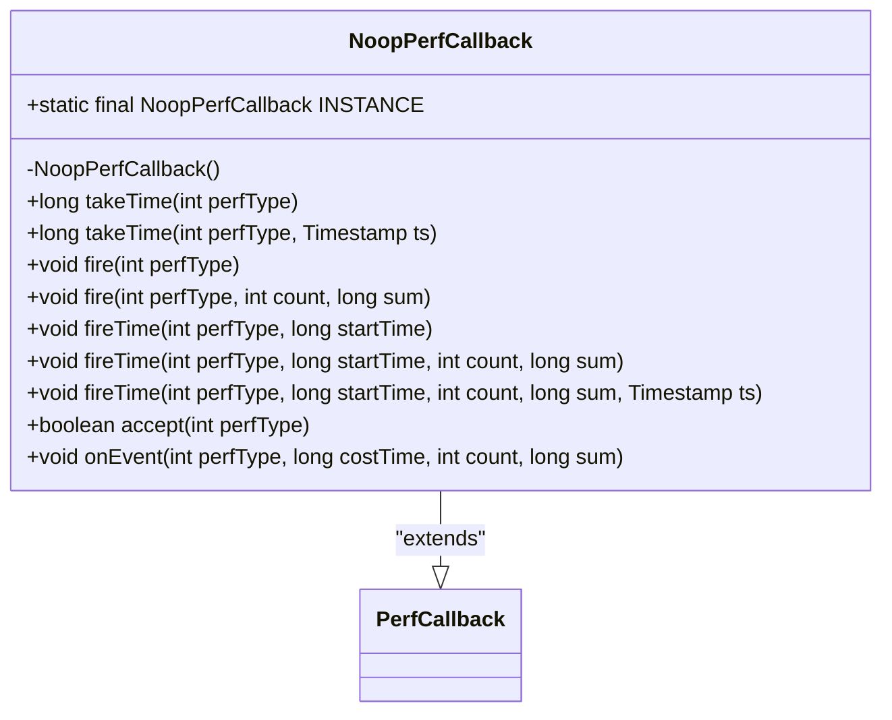
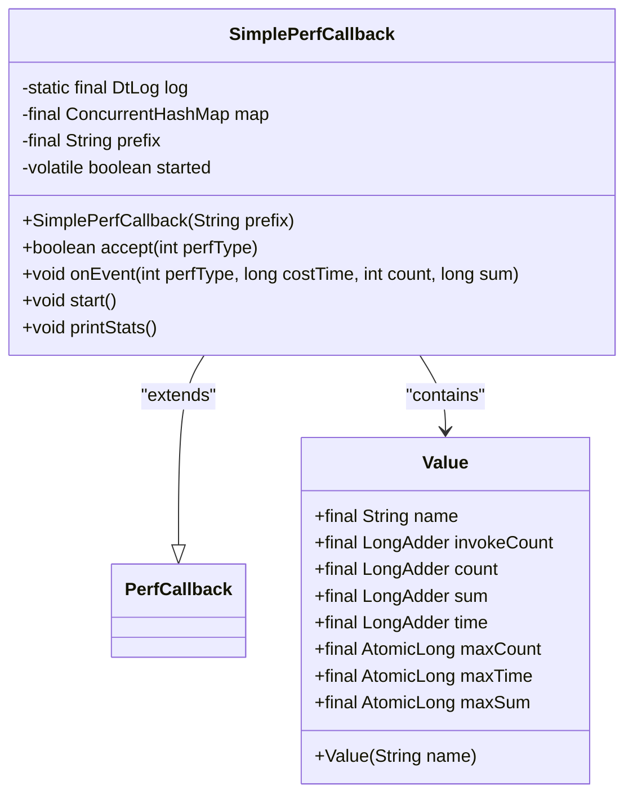
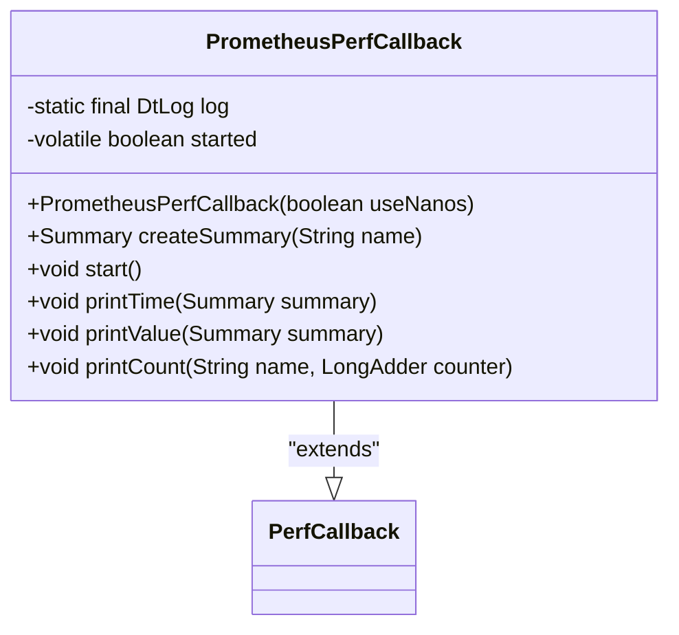
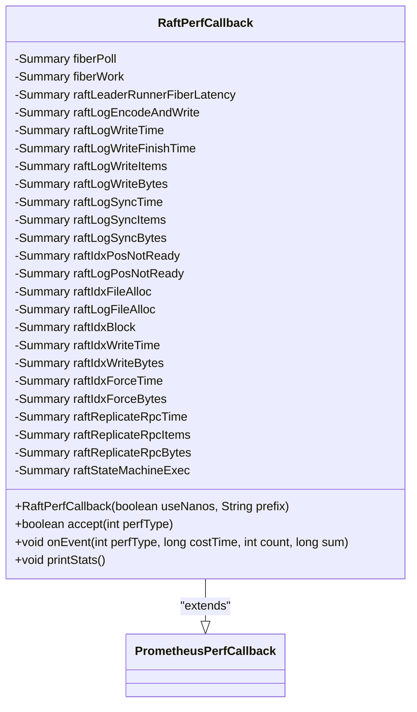
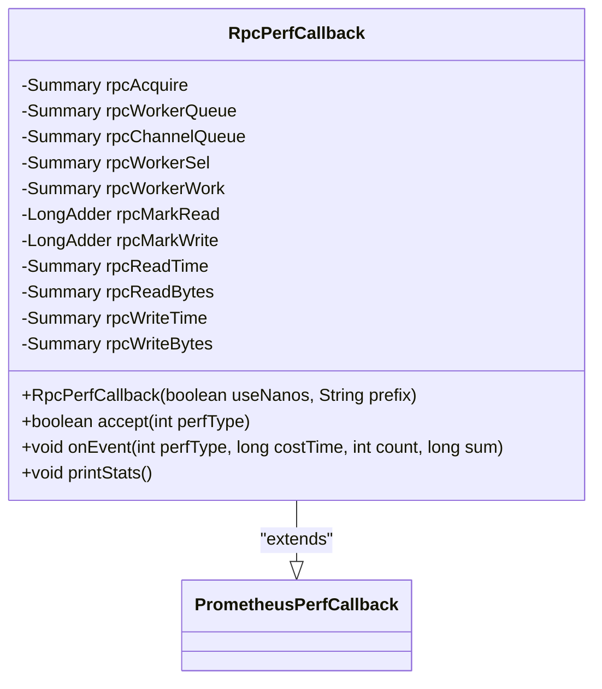
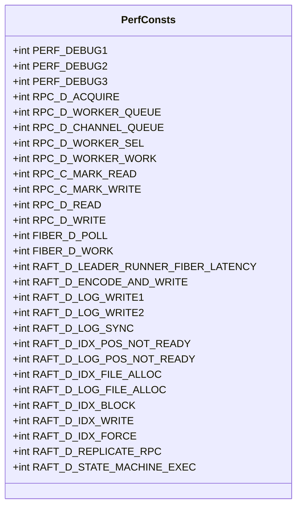
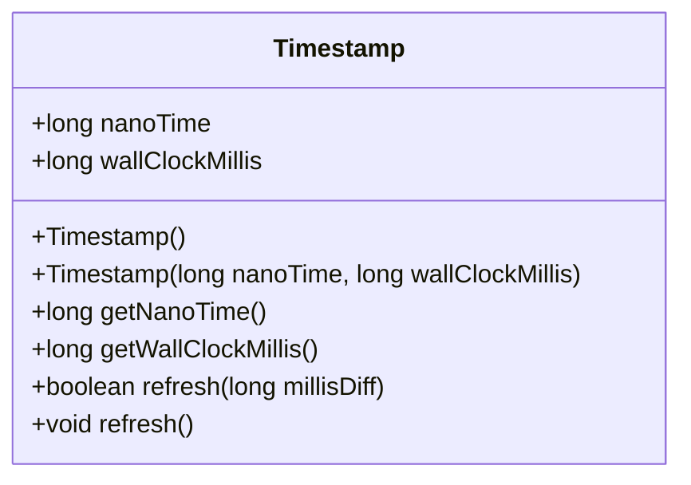
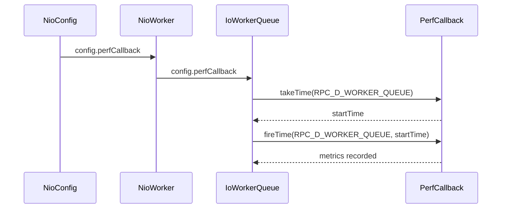
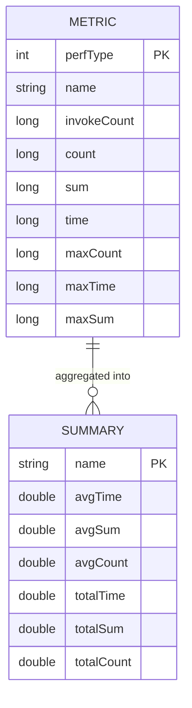

# Performance Monitoring Framework

<cite>
**Referenced Files in This Document**   
- [PerfCallback.java](file://client/src/main/java/com/github/dtprj/dongting/common/PerfCallback.java)
- [NoopPerfCallback.java](file://client/src/main/java/com/github/dtprj/dongting/common/NoopPerfCallback.java)
- [SimplePerfCallback.java](file://benchmark/src/main/java/com/github/dtprj/dongting/bench/common/SimplePerfCallback.java)
- [PrometheusPerfCallback.java](file://benchmark/src/main/java/com/github/dtprj/dongting/bench/common/PrometheusPerfCallback.java)
- [RaftPerfCallback.java](file://benchmark/src/main/java/com/github/dtprj/dongting/bench/raft/RaftPerfCallback.java)
- [RpcPerfCallback.java](file://benchmark/src/main/java/com/github/dtprj/dongting/bench/rpc/RpcPerfCallback.java)
- [PerfConsts.java](file://client/src/main/java/com/github/dtprj/dongting/common/PerfConsts.java)
- [Timestamp.java](file://client/src/main/java/com/github/dtprj/dongting/common/Timestamp.java)
- [NioConfig.java](file://client/src/main/java/com/github/dtprj/dongting/net/NioConfig.java)
- [NioWorker.java](file://client/src/main/java/com/github/dtprj/dongting/net/NioWorker.java)
- [IoWorkerQueue.java](file://client/src/main/java/com/github/dtprj/dongting/net/IoWorkerQueue.java)
</cite>

## Table of Contents
1. [Introduction](#introduction)
2. [Core Components](#core-components)
3. [Performance Callback Implementations](#performance-callback-implementations)
4. [Performance Constants and Semantics](#performance-constants-and-semantics)
5. [Timestamp Management System](#timestamp-management-system)
6. [Usage Patterns in Network Layer](#usage-patterns-in-network-layer)
7. [Performance Data Model](#performance-data-model)
8. [Configuration and Best Practices](#configuration-and-best-practices)
9. [Custom Implementation Guide](#custom-implementation-guide)
10. [Conclusion](#conclusion)

## Introduction
The Dongting performance monitoring framework provides a flexible and extensible interface for measuring system performance across various subsystems. The framework is built around the `PerfCallback` abstract class, which serves as the core interface for performance measurement, enabling timing of events, counting operations, and collecting metrics. The design supports multiple implementation strategies, from zero-overhead monitoring when disabled to integration with external monitoring systems like Prometheus. This documentation details the architecture, components, and usage patterns of the performance monitoring framework.

## Core Components

The performance monitoring framework is centered around the `PerfCallback` abstract class, which defines the contract for performance measurement. The class provides methods for timing events, counting operations, and collecting metrics, with implementations varying based on the specific use case. The framework supports nanosecond and millisecond precision through the `useNanos` flag, allowing for high-resolution timing when needed. The `accept` method determines whether a specific performance type should be monitored, enabling selective monitoring of events.

**Section sources**
- [PerfCallback.java](file://client/src/main/java/com/github/dtprj/dongting/common/PerfCallback.java#L21-L109)

## Performance Callback Implementations

### NoopPerfCallback
The `NoopPerfCallback` implementation provides zero-overhead performance monitoring by returning immediately from all method calls. It is used when monitoring is disabled, ensuring minimal impact on application performance. The implementation is a singleton, accessible via the `INSTANCE` field, and is designed to be used as the default performance callback when no monitoring is required.



**Diagram sources**
- [NoopPerfCallback.java](file://client/src/main/java/com/github/dtprj/dongting/common/NoopPerfCallback.java#L21-L65)

### SimplePerfCallback
The `SimplePerfCallback` implementation provides basic in-process metrics collection, storing invocation counts, latency distributions, and throughput metrics in memory. It uses a `ConcurrentHashMap` to store metrics for each performance type, with atomic operations to ensure thread safety. The implementation supports starting and stopping monitoring via the `start` method, and provides a `printStats` method to output collected metrics.



**Diagram sources**
- [SimplePerfCallback.java](file://benchmark/src/main/java/com/github/dtprj/dongting/bench/common/SimplePerfCallback.java#L29-L152)

### PrometheusPerfCallback
The `PrometheusPerfCallback` abstract class provides integration with Prometheus monitoring systems, using Prometheus client libraries to expose metrics. It serves as a base class for specific implementations like `RaftPerfCallback` and `RpcPerfCallback`, providing common functionality for creating and managing Prometheus summaries. The implementation supports both nanosecond and millisecond precision, with appropriate formatting for output.



**Diagram sources**
- [PrometheusPerfCallback.java](file://benchmark/src/main/java/com/github/dtprj/dongting/bench/common/PrometheusPerfCallback.java#L31-L103)

### RaftPerfCallback
The `RaftPerfCallback` implementation extends `PrometheusPerfCallback` to provide monitoring for Raft consensus algorithm operations. It creates Prometheus summaries for various Raft-related performance types, such as leader runner fiber latency, log encoding and writing, and state machine execution. The implementation provides a `printStats` method to output collected metrics.



**Diagram sources**
- [RaftPerfCallback.java](file://benchmark/src/main/java/com/github/dtprj/dongting/bench/raft/RaftPerfCallback.java#L24-L184)

### RpcPerfCallback
The `RpcPerfCallback` implementation extends `PrometheusPerfCallback` to provide monitoring for RPC operations. It creates Prometheus summaries for various RPC-related performance types, such as acquire time, worker queue time, and read/write operations. The implementation provides a `printStats` method to output collected metrics.



**Diagram sources**
- [RpcPerfCallback.java](file://benchmark/src/main/java/com/github/dtprj/dongting/bench/rpc/RpcPerfCallback.java#L26-L118)

## Performance Constants and Semantics

The `PerfConsts` interface defines constants for various performance types, organized by subsystem. The constants are used to identify specific performance events, enabling selective monitoring and analysis. The interface includes constants for RPC, fiber, and Raft subsystems, with each constant representing a specific performance event.



**Diagram sources**
- [PerfConsts.java](file://client/src/main/java/com/github/dtprj/dongting/common/PerfConsts.java#L21-L54)

## Timestamp Management System

The `Timestamp` class provides a mechanism for managing timestamps with both nanosecond and millisecond precision. It is used to ensure accurate latency measurement by synchronizing system time with the performance monitoring framework. The class provides methods for refreshing the timestamp and updating it with the current system time.



**Diagram sources**
- [Timestamp.java](file://client/src/main/java/com/github/dtprj/dongting/common/Timestamp.java#L23-L73)

## Usage Patterns in Network Layer

The performance monitoring framework is integrated into the network layer through the `NioConfig` class, which provides a `perfCallback` field for configuring the performance callback. The `NioWorker` class uses the configured performance callback to measure various network operations, such as worker selection, worker work, and read/write operations.



**Diagram sources**
- [NioConfig.java](file://client/src/main/java/com/github/dtprj/dongting/net/NioConfig.java#L53)
- [NioWorker.java](file://client/src/main/java/com/github/dtprj/dongting/net/NioWorker.java#L103)
- [IoWorkerQueue.java](file://client/src/main/java/com/github/dtprj/dongting/net/IoWorkerQueue.java#L41)

## Performance Data Model

The performance monitoring framework collects various metrics, including invocation counts, latency distributions, and throughput metrics. The data model is designed to support both in-process and external monitoring systems, with metrics stored in a format that can be easily exported or displayed.



**Diagram sources**
- [SimplePerfCallback.java](file://benchmark/src/main/java/com/github/dtprj/dongting/bench/common/SimplePerfCallback.java#L42-L55)
- [PrometheusPerfCallback.java](file://benchmark/src/main/java/com/github/dtprj/dongting/bench/common/PrometheusPerfCallback.java#L40-L49)

## Configuration and Best Practices

The performance monitoring framework can be configured through the `NioConfig` class, which provides a `perfCallback` field for setting the performance callback. In production environments, it is recommended to use the `NoopPerfCallback` when monitoring is not required to minimize overhead. When monitoring is enabled, the `SimplePerfCallback` or `PrometheusPerfCallback` can be used depending on the specific requirements.

Best practices for minimizing monitoring overhead include:
- Using the `NoopPerfCallback` when monitoring is not required
- Selectively enabling monitoring for specific performance types
- Using appropriate precision (nanosecond vs. millisecond) based on the specific use case
- Regularly reviewing and optimizing the performance monitoring configuration

**Section sources**
- [NioConfig.java](file://client/src/main/java/com/github/dtprj/dongting/net/NioConfig.java#L53)
- [PerfCallback.java](file://client/src/main/java/com/github/dtprj/dongting/common/PerfCallback.java#L25-L27)

## Custom Implementation Guide

To implement a custom `PerfCallback` handler for a specialized monitoring backend, extend the `PerfCallback` class and implement the `accept` and `onEvent` methods. The `accept` method should return `true` for performance types that should be monitored, and `false` otherwise. The `onEvent` method should handle the collected metrics, such as storing them in a database or sending them to an external monitoring system.

Example:
```java
public class CustomPerfCallback extends PerfCallback {
    public CustomPerfCallback(boolean useNanos) {
        super(useNanos);
    }
    
    @Override
    public boolean accept(int perfType) {
        // Implement logic to determine whether to monitor this performance type
        return true;
    }
    
    @Override
    public void onEvent(int perfType, long costTime, int count, long sum) {
        // Implement logic to handle the collected metrics
    }
}
```

**Section sources**
- [PerfCallback.java](file://client/src/main/java/com/github/dtprj/dongting/common/PerfCallback.java#L105-L108)

## Conclusion
The Dongting performance monitoring framework provides a flexible and extensible interface for measuring system performance across various subsystems. The framework is built around the `PerfCallback` abstract class, which serves as the core interface for performance measurement, enabling timing of events, counting operations, and collecting metrics. The design supports multiple implementation strategies, from zero-overhead monitoring when disabled to integration with external monitoring systems like Prometheus. By following best practices and carefully configuring the performance monitoring framework, developers can gain valuable insights into system performance while minimizing overhead.