# Performance Optimization Strategies

<cite>
**Referenced Files in This Document**   
- [PerfCallback.java](file://client/src/main/java/com/github/dtprj/dongting/common/PerfCallback.java)
- [MpscLinkedQueue.java](file://client/src/main/java/com/github/dtprj/dongting/queue/MpscLinkedQueue.java)
- [TwoLevelPool.java](file://client/src/main/java/com/github/dtprj/dongting/buf/TwoLevelPool.java)
- [SimpleByteBufferPool.java](file://client/src/main/java/com/github/dtprj/dongting/buf/SimpleByteBufferPool.java)
- [Padding0.java](file://client/src/main/java/com/github/dtprj/dongting/common/Padding0.java)
- [LinkedQueuePadding1.java](file://client/src/main/java/com/github/dtprj/dongting/queue/LinkedQueuePadding1.java)
- [PbNoCopyDecoderCallback.java](file://client/src/main/java/com/github/dtprj/dongting/codec/PbNoCopyDecoderCallback.java)
- [RefBuffer.java](file://client/src/main/java/com/github/dtprj/dongting/buf/RefBuffer.java)
- [RefBufWritePacket.java](file://client/src/main/java/com/github/dtprj/dongting/net/RefBufWritePacket.java)
- [NioClient.java](file://client/src/main/java/com/github/dtprj/dongting/net/NioClient.java)
- [NioServer.java](file://client/src/main/java/com/github/dtprj/dongting/net/NioServer.java)
- [PrometheusPerfCallback.java](file://benchmark/src/main/java/com/github/dtprj/dongting/bench/common/PrometheusPerfCallback.java)
</cite>

## Table of Contents
1. [Introduction](#introduction)
2. [Hardware-Aware Design Principles](#hardware-aware-design-principles)
3. [High-Performance Components](#high-performance-components)
4. [Memory Management](#memory-management)
5. [Network I/O Optimization](#network-io-optimization)
6. [Performance Monitoring Framework](#performance-monitoring-framework)
7. [Zero-Dependency Philosophy](#zero-dependency-philosophy)
8. [Benchmarking Methodologies](#benchmarking-methodologies)
9. [Performance Tuning Guidelines](#performance-tuning-guidelines)
10. [Conclusion](#conclusion)

## Introduction

Dongting is a high-performance engine designed for modern hardware architectures, integrating RAFT consensus, distributed configuration services, and low-level RPC capabilities. The system achieves exceptional throughput by leveraging performance-oriented programming techniques that are specifically optimized for contemporary hardware characteristics including SSD performance, CPU cache hierarchies, and NUMA architectures.

The performance optimization strategy in Dongting is comprehensive, addressing every layer of the system from memory management to network I/O. The framework demonstrates impressive performance metrics, achieving over 1.7 million TPS in async write mode on commodity hardware with a single server configuration. This documentation details the architectural decisions and custom components that enable these performance characteristics, providing insights into the design principles that drive the system's efficiency.

**Section sources**
- [README.md](file://README.md#L1-L141)

## Hardware-Aware Design Principles

Dongting's architecture is fundamentally designed around modern hardware characteristics, with specific optimizations for SSD performance, CPU cache hierarchies, and NUMA architectures. The system leverages these hardware features to minimize latency and maximize throughput across various workloads.

For SSD performance, Dongting implements both synchronous and asynchronous write strategies to accommodate different durability requirements. The synchronous mode ensures data persistence through fsync operations before acknowledgment, while the asynchronous mode optimizes for throughput by acknowledging writes as soon as they reach the operating system buffer, with immediate fsync calls to minimize data loss risk. This dual approach allows users to balance durability and performance based on their specific requirements.

The design incorporates extensive optimizations for CPU cache hierarchies, particularly through careful memory layout and access patterns. The system minimizes cache misses by ensuring that frequently accessed data structures are cache-line aligned and by reducing pointer chasing in critical paths. This is particularly evident in the custom MPSC queue implementation, which is designed to minimize cache invalidation across cores.

NUMA architecture considerations are integrated throughout the system, with thread-to-core affinity and memory allocation strategies that respect NUMA boundaries. The fiber-based concurrency model ensures that tasks are scheduled on the same NUMA node where their data resides, reducing cross-node memory access and associated latency. This NUMA-aware scheduling contributes significantly to the system's ability to scale efficiently across multiple cores.

**Section sources**
- [README.md](file://README.md#L16-L45)

## High-Performance Components

### MPSC Linked Queue Implementation

Dongting features a custom Multiple Producer Single Consumer (MPSC) linked queue implementation optimized for low contention and high throughput. The MpscLinkedQueue class provides non-blocking operations for multiple producers while ensuring thread safety for the single consumer, making it ideal for work-stealing scenarios and event processing pipelines.

The implementation uses a sophisticated shutdown mechanism that ensures graceful termination. When shutdown is initiated, a special SHUTDOWN_NODE is offered to the queue, allowing the consumer to process all remaining elements before termination. This guarantees that no elements are lost during shutdown, maintaining data integrity while providing a clean shutdown mechanism.

The queue employs a combination of spin-waiting, yielding, and parking strategies to balance CPU utilization and responsiveness. The spin method adapts its behavior based on the number of iterations, starting with CPU-intensive spin-waiting for quick operations, then yielding the processor, and finally using LockSupport.parkNanos for longer waits. This adaptive approach minimizes CPU consumption while maintaining low latency for queue operations.

**Diagram sources **
- [MpscLinkedQueue.java](file://client/src/main/java/com/github/dtprj/dongting/queue/MpscLinkedQueue.java#L27-L155)
- [LinkedQueuePadding1.java](file://client/src/main/java/com/github/dtprj/dongting/queue/LinkedQueuePadding1.java#L22-L39)

**Section sources**
- [MpscLinkedQueue.java](file://client/src/main/java/com/github/dtprj/dongting/queue/MpscLinkedQueue.java#L1-L155)

### Zero-Copy Serialization Techniques

Dongting implements zero-copy serialization through its RefBuffer mechanism and specialized codec components. The PbNoCopyDecoderCallback class enables direct parsing of protocol buffer data without intermediate copying, significantly reducing memory allocation and improving parsing performance.

The zero-copy approach is facilitated by the RefBuffer class, which maintains reference counting for ByteBuffer instances, allowing multiple components to share the same underlying buffer without copying data. This is particularly effective in network processing pipelines where data moves from network buffers through various processing stages to application logic.

The serialization framework supports both heap and direct ByteBuffers, with optimized paths for each. For direct buffers, the system employs memory mapping techniques when possible, further reducing data copying between kernel and user space. The codec components are designed to work with fragmented data, allowing partial reads and resumable parsing, which is essential for high-performance network protocols.

**Diagram sources **
- [PbNoCopyDecoderCallback.java](file://client/src/main/java/com/github/dtprj/dongting/codec/PbNoCopyDecoderCallback.java#L23-L72)
- [RefBuffer.java](file://client/src/main/java/com/github/dtprj/dongting/buf/RefBuffer.java#L28-L184)

**Section sources**
- [PbNoCopyDecoderCallback.java](file://client/src/main/java/com/github/dtprj/dongting/codec/PbNoCopyDecoderCallback.java#L1-L72)
- [RefBuffer.java](file://client/src/main/java/com/github/dtprj/dongting/buf/RefBuffer.java#L1-L184)

## Memory Management

### Two-Level Byte Buffer Pool

Dongting implements a sophisticated two-level byte buffer pool system designed to minimize garbage collection pressure and optimize memory allocation patterns. The TwoLevelPool class combines separate pools for small and large buffers, allowing for specialized optimization strategies for each size category.

The pool architecture consists of a small buffer pool for frequently allocated small objects and a large buffer pool for less frequent but larger allocations. This separation prevents fragmentation and allows for different eviction policies based on buffer size. The small pool is optimized for high-frequency allocation and release, while the large pool focuses on efficient reuse of substantial memory blocks.

The implementation includes configurable thresholds that determine which pool handles a given allocation request. Buffers below the largePoolMin threshold are served from the small pool, while larger requests go to the large pool. This intelligent routing ensures that memory allocation patterns align with the access characteristics of different buffer sizes, maximizing cache efficiency and minimizing allocation overhead.

**Diagram sources **
- [TwoLevelPool.java](file://client/src/main/java/com/github/dtprj/dongting/buf/TwoLevelPool.java#L26-L146)
- [SimpleByteBufferPool.java](file://client/src/main/java/com/github/dtprj/dongting/buf/SimpleByteBufferPool.java#L32-L347)

**Section sources**
- [TwoLevelPool.java](file://client/src/main/java/com/github/dtprj/dongting/buf/TwoLevelPool.java#L1-L146)
- [SimpleByteBufferPool.java](file://client/src/main/java/com/github/dtprj/dongting/buf/SimpleByteBufferPool.java#L1-L347)

### Object Pooling Strategy

Dongting employs an aggressive object pooling strategy for frequently allocated objects to eliminate allocation overhead and reduce garbage collection pressure. The system pools not only ByteBuffers but also higher-level objects that are created frequently in the processing pipeline.

The pooling strategy is implemented through a hierarchy of specialized pool classes, each optimized for specific allocation patterns. The SimpleByteBufferPool serves as the foundation, providing fixed-size buffer pools with configurable minimum and maximum counts. These pools automatically clean expired buffers based on a timeout policy, balancing memory usage with allocation performance.

The pooling system includes statistical tracking to monitor hit rates and allocation patterns, providing insights into pool efficiency. The formatStat method generates detailed reports on borrow and release operations, including hit rates for each buffer size category. This telemetry enables fine-tuning of pool configurations based on actual usage patterns.

```mermaid
flowchart TD
A["Request Buffer (requestSize)"] --> B{"requestSize ≤ threshold?"}
B --> |Yes| C["Allocate directly (no pooling)"]
B --> |No| D{"requestSize > largest pool size?"}
D --> |Yes| E["Allocate directly (no pooling)"]
D --> |No| F["Find appropriate FixSizeBufferPool"]
F --> G{"Buffer available in pool?"}
G --> |Yes| H["Return pooled buffer"]
G --> |No| I["Allocate new buffer"]
I --> J["Track allocation statistics"]
H --> J
J --> K["Return buffer to caller"]
```

**Diagram sources **
- [SimpleByteBufferPool.java](file://client/src/main/java/com/github/dtprj/dongting/buf/SimpleByteBufferPool.java#L32-L347)

**Section sources**
- [SimpleByteBufferPool.java](file://client/src/main/java/com/github/dtprj/dongting/buf/SimpleByteBufferPool.java#L1-L347)

### False Sharing Prevention

Dongting implements comprehensive padding techniques to prevent false sharing, a common performance bottleneck in multi-threaded applications. The system uses strategically placed padding fields to ensure that frequently accessed variables from different threads do not share the same cache line.

The Padding0 class provides a base implementation with 128 bytes of padding, covering two typical cache lines. This class is used as a foundation for other classes that require isolation from neighboring memory allocations. The padding strategy accounts for the object header size, effectively creating a 128-byte boundary that aligns with cache line boundaries.

The queue implementation extends this concept with the LinkedQueuePadding1 class, which provides additional padding between producer and consumer fields in the MPSC queue. This ensures that the tail pointer (frequently updated by producers) and head pointer (frequently accessed by the consumer) do not share cache lines, eliminating the cache coherency traffic that would otherwise occur.

**Diagram sources **
- [Padding0.java](file://client/src/main/java/com/github/dtprj/dongting/common/Padding0.java#L22-L40)
- [LinkedQueuePadding1.java](file://client/src/main/java/com/github/dtprj/dongting/queue/LinkedQueuePadding1.java#L22-L39)

**Section sources**
- [Padding0.java](file://client/src/main/java/com/github/dtprj/dongting/common/Padding0.java#L1-L40)
- [LinkedQueuePadding1.java](file://client/src/main/java/com/github/dtprj/dongting/queue/LinkedQueuePadding1.java#L1-L40)

## Network I/O Optimization

### Direct Buffer Usage

Dongting optimizes network I/O through extensive use of direct ByteBuffers, which enable zero-copy data transfer between user space and kernel space. The system's network components are designed to work seamlessly with direct buffers, minimizing data copying and reducing memory pressure.

The NioClient and NioServer classes use direct buffers for all network operations, allowing the JVM to leverage operating system optimizations for direct memory access. This approach eliminates the need for intermediate heap buffers, reducing both memory usage and CPU overhead associated with buffer copying.

The RefBuffer class serves as a wrapper around direct ByteBuffers, providing reference counting and lifecycle management. This enables safe sharing of direct buffers across multiple components without premature deallocation. The reference counting mechanism ensures that buffers are only released when no longer needed by any component, preventing use-after-free errors while maximizing buffer reuse.

**Diagram sources **
- [RefBuffer.java](file://client/src/main/java/com/github/dtprj/dongting/buf/RefBuffer.java#L28-L184)
- [NioClient.java](file://client/src/main/java/com/github/dtprj/dongting/net/NioClient.java#L41-L363)
- [NioServer.java](file://client/src/main/java/com/github/dtprj/dongting/net/NioServer.java#L49-L293)

**Section sources**
- [RefBuffer.java](file://client/src/main/java/com/github/dtprj/dongting/buf/RefBuffer.java#L1-L184)
- [NioClient.java](file://client/src/main/java/com/github/dtprj/dongting/net/NioClient.java#L1-L363)
- [NioServer.java](file://client/src/main/java/com/github/dtprj/dongting/net/NioServer.java#L1-L293)

### Efficient Protocol Parsing

The system implements efficient protocol parsing through a streaming approach that minimizes memory allocation and enables incremental processing. The codec framework is designed to handle fragmented messages and partial reads, allowing the system to process data as it arrives without waiting for complete messages.

The PbParser class implements a stateful parsing mechanism that can be suspended and resumed, making it ideal for non-blocking I/O operations. This allows the system to parse messages incrementally as data becomes available from the network, reducing latency and memory usage compared to batch processing approaches.

The parsing framework includes validation checks that are optimized for performance, using pre-computed lookup tables and bit manipulation techniques to validate protocol structures quickly. Error handling is designed to be fast path friendly, with exceptional conditions isolated to minimize impact on the common case performance.

**Diagram sources **
- [PbNoCopyDecoderCallback.java](file://client/src/main/java/com/github/dtprj/dongting/codec/PbNoCopyDecoderCallback.java#L23-L72)
- [RefBufWritePacket.java](file://client/src/main/java/com/github/dtprj/dongting/net/RefBufWritePacket.java#L27-L54)

**Section sources**
- [PbNoCopyDecoderCallback.java](file://client/src/main/java/com/github/dtprj/dongting/codec/PbNoCopyDecoderCallback.java#L1-L72)
- [RefBufWritePacket.java](file://client/src/main/java/com/github/dtprj/dongting/net/RefBufWritePacket.java#L1-L54)

## Performance Monitoring Framework

### PerfCallback for Latency Tracking

Dongting features a comprehensive performance monitoring framework centered around the PerfCallback abstraction, which enables detailed latency tracking across various system components. The framework provides both coarse-grained and fine-grained performance measurement capabilities, allowing developers to identify bottlenecks and optimize critical paths.

The PerfCallback class serves as the foundation for performance monitoring, providing methods to record event timings, counts, and aggregated values. The implementation supports both millisecond and nanosecond precision, allowing for accurate measurement of operations at different scales. The fireTime methods enable recording of elapsed time for specific operations, while the fire methods track event counts and aggregated values.

The framework is designed to be extensible, with the PrometheusPerfCallback providing integration with Prometheus monitoring systems. This implementation converts performance data into Prometheus Summary metrics, enabling visualization and alerting through standard monitoring infrastructure. The integration includes quantile calculations for latency distributions, providing insights into tail latencies that are critical for system performance.

**Diagram sources **
- [PerfCallback.java](file://client/src/main/java/com/github/dtprj/dongting/common/PerfCallback.java#L21-L110)
- [PrometheusPerfCallback.java](file://benchmark/src/main/java/com/github/dtprj/dongting/bench/common/PrometheusPerfCallback.java#L31-L103)

**Section sources**
- [PerfCallback.java](file://client/src/main/java/com/github/dtprj/dongting/common/PerfCallback.java#L1-L110)
- [PrometheusPerfCallback.java](file://benchmark/src/main/java/com/github/dtprj/dongting/bench/common/PrometheusPerfCallback.java#L1-L103)

## Zero-Dependency Philosophy

Dongting adheres to a strict zero-dependency philosophy, resulting in a minimal deployment footprint and fast startup times. The framework has no third-party library dependencies, with the exception of an optional SLF4J integration for logging. This design choice eliminates dependency conflicts and reduces the attack surface, making the system more reliable and secure.

The client and server components are packaged in two JAR files totaling less than 1MB, enabling easy embedding into applications without significantly increasing their size. The absence of transitive dependencies ensures predictable behavior and eliminates the "dependency hell" commonly encountered in complex Java applications.

The zero-dependency approach extends to the runtime requirements, with the client requiring only Java 8 and the server requiring Java 11. This minimal requirement allows the system to run on a wide range of hardware, from high-performance servers to resource-constrained devices like Raspberry Pis. The framework does not require specialized hardware like RDMA or Optane, making it accessible for a broad range of deployment scenarios.

**Section sources**
- [README.md](file://README.md#L47-L69)

## Benchmarking Methodologies

Dongting includes comprehensive benchmarking capabilities to measure and validate performance characteristics under various workloads. The benchmark module provides tools for measuring throughput, latency, and resource utilization, enabling both micro-benchmarks of individual components and macro-benchmarks of the complete system.

The benchmarking framework uses realistic workloads that simulate actual usage patterns, including mixed read/write operations, varying message sizes, and different consistency requirements. The benchmarks are designed to measure both peak throughput and sustained performance under load, providing insights into the system's behavior over time.

Performance metrics are collected using the PerfCallback framework, ensuring consistent measurement across different components and scenarios. The results include detailed latency distributions, throughput measurements, and resource utilization statistics, allowing for comprehensive analysis of system performance. The benchmarking methodology emphasizes reproducibility, with detailed documentation of test configurations and hardware specifications.

**Section sources**
- [README.md](file://README.md#L16-L45)

## Performance Tuning Guidelines

### Parameter Tuning for Workload Patterns

Dongting provides several tunable parameters to optimize performance for different workload patterns. The configuration options allow administrators to balance throughput, latency, and resource utilization based on their specific requirements.

For high-throughput workloads, increasing the buffer pool sizes and adjusting the two-level pool thresholds can improve performance by reducing allocation overhead. The MPSC queue capacity and spin-wait parameters can be tuned to balance CPU utilization and latency, with more aggressive spinning improving latency at the cost of higher CPU usage.

For latency-sensitive applications, enabling nanosecond precision timing and optimizing the fiber scheduling parameters can reduce response times. The network I/O buffers can be adjusted to minimize batching delays, while the protocol parsing timeouts can be reduced to detect and handle errors more quickly.

The system's performance monitoring capabilities provide guidance for tuning decisions, with metrics that indicate when resources are becoming bottlenecks. The buffer pool statistics can reveal allocation patterns that suggest suboptimal pool configurations, while the latency distributions can highlight specific operations that require optimization.

**Section sources**
- [README.md](file://README.md#L16-L45)
- [SimpleByteBufferPool.java](file://client/src/main/java/com/github/dtprj/dongting/buf/SimpleByteBufferPool.java#L32-L347)

## Conclusion

Dongting's performance optimization strategies demonstrate a comprehensive approach to building high-performance systems on modern hardware. By combining hardware-aware design principles with custom high-performance components, the framework achieves exceptional throughput and low latency across various workloads.

The system's architecture reflects deep understanding of contemporary hardware characteristics, with optimizations for SSD performance, CPU cache hierarchies, and NUMA architectures. The custom MPSC queue, two-level buffer pool, and zero-copy serialization techniques work together to minimize contention, reduce garbage collection pressure, and eliminate unnecessary data copying.

The zero-dependency philosophy contributes significantly to the system's performance by reducing deployment footprint and startup time, while the comprehensive performance monitoring framework enables continuous optimization. The benchmarking results demonstrate the effectiveness of these strategies, with throughput exceeding 1.7 million TPS in optimal configurations.

These performance characteristics make Dongting suitable for demanding applications requiring high throughput and low latency, while its design principles provide valuable insights for building high-performance systems in general.