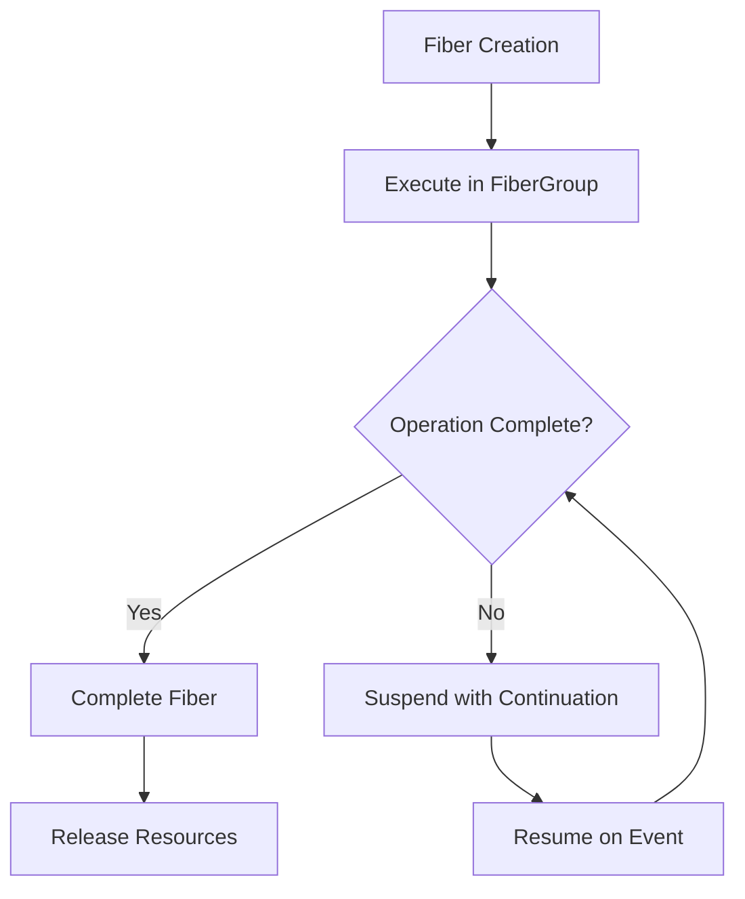

# Core RAFT Algorithm

<cite>
**Referenced Files in This Document**   
- [RaftServer.java](file://server/src/main/java/com/github/dtprj/dongting/raft/server/RaftServer.java)
- [RaftGroup.java](file://server/src/main/java/com/github/dtprj/dongting/raft/server/RaftGroup.java)
- [RaftGroupImpl.java](file://server/src/main/java/com/github/dtprj/dongting/raft/impl/RaftGroupImpl.java)
- [VoteManager.java](file://server/src/main/java/com/github/dtprj/dongting/raft/impl/VoteManager.java)
- [VoteProcessor.java](file://server/src/main/java/com/github/dtprj/dongting/raft/rpc/VoteProcessor.java)
- [AppendProcessor.java](file://server/src/main/java/com/github/dtprj/dongting/raft/rpc/AppendProcessor.java)
- [InstallSnapshotReq.java](file://server/src/main/java/com/github/dtprj/dongting/raft/rpc/InstallSnapshotReq.java)
- [MemberManager.java](file://server/src/main/java/com/github/dtprj/dongting/raft/impl/MemberManager.java)
- [RaftUtil.java](file://server/src/main/java/com/github/dtprj/dongting/raft/impl/RaftUtil.java)
- [LinearTaskRunner.java](file://server/src/main/java/com/github/dtprj/dongting/raft/impl/LinearTaskRunner.java)
- [CommitManager.java](file://server/src/main/java/com/github/dtprj/dongting/raft/impl/CommitManager.java)
- [ReplicateManager.java](file://server/src/main/java/com/github/dtprj/dongting/raft/impl/ReplicateManager.java)
</cite>

## Table of Contents
1. [Introduction](#introduction)
2. [Leader Election Process](#leader-election-process)
3. [Log Replication Mechanism](#log-replication-mechanism)
4. [Joint Consensus for Membership Changes](#joint-consensus-for-membership-changes)
5. [RPC Implementation Details](#rpc-implementation-details)
6. [Quorum Model](#quorum-model)
7. [Fiber-Based Execution Model](#fiber-based-execution-model)
8. [Network Integration](#network-integration)
9. [Cluster Stability and Failure Recovery](#cluster-stability-and-failure-recovery)
10. [Conclusion](#conclusion)

## Introduction
The Dongting RAFT algorithm implementation provides a robust distributed consensus mechanism designed for high performance and reliability. This document details the core components of the RAFT implementation, focusing on leader election, log replication, and safety guarantees. The system supports joint consensus for membership changes, ensuring cluster stability during configuration updates. The implementation leverages a fiber-based execution model to enable non-blocking operations and efficient resource utilization. Key features include separate read and write quorums for improved performance, comprehensive failure recovery mechanisms, and seamless integration with the underlying network layer.

## Leader Election Process

The leader election process in Dongting's RAFT implementation follows the standard RAFT protocol with several optimizations for performance and reliability. The process begins when a follower node's election timer expires, triggering a pre-vote phase to assess its eligibility for leadership. The `VoteManager` class orchestrates this process, managing vote requests and responses across the cluster.

When a node determines it should initiate an election, it first enters a pre-vote phase to verify its eligibility. This pre-vote step helps prevent unnecessary term increments and potential disruptions in stable clusters. The pre-vote request includes the candidate's last log term and index, allowing voting nodes to apply the election restriction rule: a node will only grant its vote if the candidate's log is at least as up-to-date as its own.

If the pre-vote succeeds, the candidate proceeds to the actual vote phase by incrementing its term and requesting votes from other cluster members. The voting process is managed by the `VoteManager`, which tracks votes received and determines when a quorum has been achieved. The quorum size is calculated using the formula `(groupSize >> 1) + 1`, ensuring majority agreement for leadership decisions.

During the election process, nodes maintain their current term and vote status in the `RaftStatusImpl` object, which is persisted asynchronously to ensure durability. If a node receives a request from a candidate with a higher term, it immediately updates its term and transitions to follower state, granting its vote to the higher-term candidate.

The leader election process incorporates several safety mechanisms:
- **Term Management**: Nodes always transition to the highest term observed in the cluster
- **Vote Restriction**: Nodes only vote for candidates with sufficiently up-to-date logs
- **Election Timeout**: Randomized election timeouts prevent split votes and ensure progress
- **Leadership Lease**: Leaders maintain a lease based on heartbeat responses from followers

**Section sources**
- [VoteManager.java](file://server/src/main/java/com/github/dtprj/dongting/raft/impl/VoteManager.java#L1-L492)
- [RaftUtil.java](file://server/src/main/java/com/github/dtprj/dongting/raft/impl/RaftUtil.java#L1-L366)

## Log Replication Mechanism

The log replication mechanism in Dongting's RAFT implementation ensures consistency across cluster members through the AppendEntries RPC. This process is managed by the `AppendProcessor` class, which handles both log entries and heartbeat messages. The implementation follows the RAFT protocol's safety guarantees while optimizing for performance through batching and pipelining.

When a leader receives a client request, it first appends the entry to its local log and then initiates replication by sending AppendEntries RPCs to all followers. The `LinearTaskRunner` class manages this process, queuing tasks and processing them in a linear fashion to maintain consistency. Each log entry includes the leader's term, index, previous log term, and the actual command to be executed.

The replication process involves several key steps:
1. The leader sends an AppendEntries request containing new log entries
2. Followers validate the request by checking term consistency and log matching
3. If the validation passes, followers append the entries to their logs
4. Followers respond to the leader, indicating success or failure
5. The leader updates its match and next indices based on successful responses
6. When a majority of followers have replicated an entry, the leader commits it

The `ReplicateManager` class handles the actual replication process, maintaining separate fibers for each follower to enable concurrent replication. This design allows the leader to pipeline multiple AppendEntries requests without waiting for individual responses, significantly improving throughput.

Several optimization techniques are employed:
- **Batching**: Multiple log entries are sent in a single RPC when possible
- **Pipelining**: New AppendEntries requests are sent without waiting for acknowledgments
- **Heartbeat Optimization**: Empty AppendEntries requests serve as heartbeats to maintain leadership
- **Flow Control**: Replication rate is adjusted based on network conditions and follower performance

The implementation also handles log inconsistencies through the log matching property. If a follower's log doesn't match the leader's at the specified previous log index, it rejects the AppendEntries request. The leader then probes with earlier log entries to find the point of divergence and overwrites the follower's log from that point forward.

**Section sources**
- [AppendProcessor.java](file://server/src/main/java/com/github/dtprj/dongting/raft/rpc/AppendProcessor.java#L1-L579)
- [ReplicateManager.java](file://server/src/main/java/com/github/dtprj/dongting/raft/impl/ReplicateManager.java#L1-L792)
- [LinearTaskRunner.java](file://server/src/main/java/com/github/dtprj/dongting/raft/impl/LinearTaskRunner.java#L1-L265)

## Joint Consensus for Membership Changes

Dongting's RAFT implementation supports safe membership changes through the joint consensus mechanism, allowing the cluster to transition between different configurations without compromising availability or consistency. This process is managed by the `MemberManager` class, which coordinates the three-phase membership change protocol.

The joint consensus process involves three distinct phases:
1. **Preparation Phase**: The leader proposes a new configuration by appending a special log entry of type `TYPE_PREPARE_CONFIG_CHANGE`. This entry contains both the current configuration and the proposed new configuration.
2. **Joint Operation Phase**: During this phase, log entries require agreement from a majority in both the old and new configurations. This ensures that any decision made during the transition is supported by nodes that will be present in both configurations.
3. **Commitment Phase**: Once the prepare entry is committed, the leader initiates the final phase by appending a `TYPE_COMMIT_CONFIG_CHANGE` entry. This completes the transition to the new configuration.

The implementation provides several administrative APIs for managing membership changes:
- `leaderPrepareJointConsensus`: Initiates the preparation phase
- `leaderCommitJointConsensus`: Completes the transition to the new configuration
- `leaderAbortJointConsensus`: Cancels an ongoing configuration change

Before committing a configuration change, the leader performs a thorough validation by querying the prepare status of all relevant nodes. This ensures that all nodes have applied the prepare entry before proceeding with the commit. The validation process checks that each node's last applied index is at least as large as the prepare index, preventing premature commitment of configuration changes.

The joint consensus mechanism provides several safety guarantees:
- **No Split Brain**: The requirement for agreement from both old and new configurations prevents the formation of two independent majorities
- **Continuous Availability**: The cluster remains available for both reads and writes throughout the transition
- **Consistent State**: All nodes apply configuration changes in the same order, maintaining consistency across the cluster
- **Rollback Capability**: Configuration changes can be safely aborted if issues are detected

The implementation also handles edge cases such as nodes joining or leaving during a configuration change, ensuring that the cluster can recover from partial failures and maintain consistency.

**Section sources**
- [MemberManager.java](file://server/src/main/java/com/github/dtprj/dongting/raft/impl/MemberManager.java#L1-L800)
- [RaftGroupImpl.java](file://server/src/main/java/com/github/dtprj/dongting/raft/impl/RaftGroupImpl.java#L1-L220)

## RPC Implementation Details

The Dongting RAFT implementation defines three primary RPCs for cluster coordination: AppendEntries, RequestVote, and InstallSnapshot. These RPCs are implemented as protocol buffer messages and processed through a fiber-based execution model to ensure non-blocking operation.

### AppendEntries RPC
The AppendEntries RPC serves dual purposes: replicating log entries and serving as heartbeats. The request message includes:
- `groupId`: Identifier of the RAFT group
- `term`: Leader's current term
- `leaderId`: ID of the leader
- `prevLogIndex`: Index of the log entry immediately preceding new entries
- `prevLogTerm`: Term of the log entry at `prevLogIndex`
- `leaderCommit`: Leader's commit index
- `logs`: List of new log entries to store

The response message contains:
- `term`: Current term for leader to update itself
- `success`: True if follower contained entry matching `prevLogIndex` and `prevLogTerm`

### RequestVote RPC
The RequestVote RPC is used during leader election. The request message includes:
- `groupId`: Identifier of the RAFT group
- `term`: Candidate's current term
- `candidateId`: ID of the candidate requesting vote
- `lastLogIndex`: Index of candidate's last log entry
- `lastLogTerm`: Term of candidate's last log entry
- `preVote`: Flag indicating if this is a pre-vote request

The response message contains:
- `term`: Current term for candidate to update itself
- `voteGranted`: True if candidate received vote

### InstallSnapshot RPC
The InstallSnapshot RPC is used to bring followers' state up to date when they are significantly behind. The request message includes:
- `groupId`: Identifier of the RAFT group
- `term`: Leader's current term
- `leaderId`: ID of the leader
- `lastIncludedIndex`: Last included index in the snapshot
- `lastIncludedTerm`: Term of the last included index
- `offset`: Byte offset where chunk is positioned in the snapshot file
- `data`: Raw bytes of the snapshot chunk
- `done`: True if this is the last chunk

The implementation uses a streaming approach for snapshot installation, allowing large snapshots to be transferred in multiple chunks without requiring excessive memory. The `InstallSnapshotReq` class handles the serialization and deserialization of snapshot data, ensuring efficient transmission over the network.

All RPCs are processed through the fiber-based execution model, allowing concurrent handling of multiple requests without blocking. The `RaftSequenceProcessor` base class ensures that requests for each RAFT group are processed sequentially, maintaining consistency while enabling parallel processing across different groups.

**Section sources**
- [AppendProcessor.java](file://server/src/main/java/com/github/dtprj/dongting/raft/rpc/AppendProcessor.java#L1-L579)
- [VoteProcessor.java](file://server/src/main/java/com/github/dtprj/dongting/raft/rpc/VoteProcessor.java#L1-L204)
- [InstallSnapshotReq.java](file://server/src/main/java/com/github/dtprj/dongting/raft/rpc/InstallSnapshotReq.java#L1-L253)

## Quorum Model

Dongting's RAFT implementation employs a sophisticated quorum model that supports separate read and write quorums for improved performance. This model is implemented in the `RaftUtil` class, which provides methods for calculating quorum sizes based on cluster configuration.

The write quorum is calculated using the standard RAFT majority formula: `(groupSize >> 1) + 1`. This ensures that any two majorities overlap, providing the safety guarantees required by the RAFT consensus algorithm. For example, in a 5-node cluster, the write quorum is 3 nodes.

The read quorum is optimized for performance while maintaining consistency. The implementation uses a lease-based approach where the leader maintains a lease based on heartbeat responses from followers. The lease duration is determined by the response time of the slowest follower in the quorum, ensuring that the leader can serve linearizable reads without contacting other nodes during the lease period.

The quorum calculation is adaptive based on cluster size:
- For odd-sized clusters: `(groupSize >> 1) + 1`
- For even-sized clusters ≥ 4: `groupSize >> 1`

This optimization for even-sized clusters reduces the quorum size by one node while still maintaining safety, as any two quorums of size `n/2` in a cluster of size `n` must overlap by at least one node.

The implementation also supports joint consensus quorums during configuration changes. When a cluster is in the joint configuration phase, operations require agreement from a majority in both the old and new configurations. This is implemented by calculating separate quorums for the old and new configurations and requiring agreement from both.

The quorum model is integrated with the leadership lease mechanism to enable high-performance linearizable reads. When a leader receives a read request, it first checks if its lease is still valid. If the lease is valid, it can immediately return the requested data without contacting other nodes, significantly reducing read latency.

**Section sources**
- [RaftUtil.java](file://server/src/main/java/com/github/dtprj/dongting/raft/impl/RaftUtil.java#L1-L366)
- [CommitManager.java](file://server/src/main/java/com/github/dtprj/dongting/raft/impl/CommitManager.java#L1-L196)

## Fiber-Based Execution Model

The Dongting RAFT implementation utilizes a fiber-based execution model to enable non-blocking, cooperative multitasking within the consensus algorithm. This model is implemented in the `fiber` package and integrated throughout the RAFT components to ensure efficient resource utilization and high throughput.

The fiber model provides several key benefits:
- **Non-blocking Operations**: Fibers can suspend and resume execution without blocking threads
- **Efficient Context Switching**: Lightweight fibers enable rapid context switching with minimal overhead
- **Structured Concurrency**: Fibers provide structured concurrency primitives for managing complex workflows
- **Resource Efficiency**: Thousands of fibers can run on a small number of threads, reducing memory footprint

The execution model is centered around the `Fiber` and `FiberFrame` classes, which implement a continuation-passing style of programming. Each fiber represents a lightweight execution context that can be suspended and resumed at specific points. The `FiberFrame` class defines the execution logic, with the `execute` method implementing the fiber's behavior.

Key components of the fiber-based execution model include:
- **Fiber Scheduler**: Manages the execution of fibers across a thread pool
- **Continuation Mechanism**: Enables fibers to suspend and resume execution
- **Synchronization Primitives**: Fiber-aware locks, conditions, and channels
- **Error Handling**: Structured exception handling across fiber boundaries

The RAFT implementation uses fibers extensively for various operations:
- **Leader Election**: The `VoteManager` uses fibers to handle vote requests and responses
- **Log Replication**: The `ReplicateManager` uses fibers for concurrent replication to followers
- **Snapshot Installation**: The `LeaderInstallFrame` uses fibers to stream snapshots efficiently
- **Heartbeat Management**: The `MemberManager` uses fibers to maintain cluster membership

The model enables complex workflows to be expressed in a linear, sequential style while maintaining non-blocking behavior. For example, the leader election process can be expressed as a sequence of steps (send vote requests, wait for responses, determine outcome) without blocking the underlying thread.

**Diagram sources**
- [RaftServer.java](file://server/src/main/java/com/github/dtprj/dongting/raft/server/RaftServer.java#L1-L718)
- [LinearTaskRunner.java](file://server/src/main/java/com/github/dtprj/dongting/raft/impl/LinearTaskRunner.java#L1-L265)

**Section sources**
- [RaftServer.java](file://server/src/main/java/com/github/dtprj/dongting/raft/server/RaftServer.java#L1-L718)
- [LinearTaskRunner.java](file://server/src/main/java/com/github/dtprj/dongting/raft/impl/LinearTaskRunner.java#L1-L265)

## Network Integration

The Dongting RAFT implementation integrates with the underlying network layer through the `net` package, providing reliable communication between cluster members. The integration is designed for high performance and low latency, using non-blocking I/O and efficient serialization.

The network layer is built on top of Java NIO, with the `NioServer` and `NioClient` classes handling incoming and outgoing connections respectively. Each RAFT group has its own network endpoints, allowing multiple RAFT groups to coexist on the same physical nodes.

Key aspects of the network integration include:
- **Connection Management**: Persistent connections between cluster members
- **Message Framing**: Efficient framing of RAFT messages for transmission
- **Serialization**: Protocol buffer-based serialization for compact message format
- **Flow Control**: Backpressure mechanisms to prevent overwhelming receivers
- **Error Handling**: Robust handling of network failures and timeouts

The implementation uses a command-based messaging system where each RAFT RPC is assigned a unique command code. The `Commands` class defines constants for all RAFT-related commands, including:
- `RAFT_APPEND_ENTRIES`: For log replication and heartbeats
- `RAFT_REQUEST_VOTE`: For leader election
- `RAFT_INSTALL_SNAPSHOT`: For state synchronization
- `RAFT_QUERY_STATUS`: For cluster monitoring

Message serialization is optimized for performance using protocol buffers with custom encoding. The `PbUtil` class provides efficient methods for encoding and decoding protocol buffer messages, minimizing allocation and garbage collection overhead.

The network layer also implements several reliability features:
- **Heartbeat Detection**: Regular ping messages to detect node failures
- **Connection Recovery**: Automatic reconnection when network partitions heal
- **Message Acknowledgment**: Confirmation of message delivery
- **Timeout Management**: Configurable timeouts for all RPCs

The integration is designed to be transparent to the RAFT algorithm implementation, with the `AppendProcessor`, `VoteProcessor`, and other components treating the network as a reliable message delivery system. This separation of concerns allows the consensus algorithm to focus on correctness while the network layer handles performance and reliability.

**Section sources**
- [RaftServer.java](file://server/src/main/java/com/github/dtprj/dongting/raft/server/RaftServer.java#L1-L718)
- [AppendProcessor.java](file://server/src/main/java/com/github/dtprj/dongting/raft/rpc/AppendProcessor.java#L1-L579)
- [VoteProcessor.java](file://server/src/main/java/com/github/dtprj/dongting/raft/rpc/VoteProcessor.java#L1-L204)

## Cluster Stability and Failure Recovery

The Dongting RAFT implementation includes comprehensive mechanisms for maintaining cluster stability and recovering from failures. These mechanisms address various failure scenarios including network partitions, node crashes, and configuration changes.

### Network Partition Handling
During network partitions, the implementation follows RAFT's safety principles to prevent split-brain scenarios. When a leader loses connectivity to a majority of followers, it eventually steps down due to lack of heartbeat responses. This ensures that at most one leader can be active in any partition that contains a majority of nodes.

The `MemberManager` continuously monitors node connectivity through periodic ping messages. When a node becomes unreachable, it is marked as not ready, and replication to that node is suspended. When connectivity is restored, the node is brought up to date through log replication or snapshot installation.

### Node Failure Recovery
When a failed node rejoins the cluster, it must synchronize its state with the current leader. The recovery process involves:
1. The node contacts the leader to determine the current cluster configuration
2. If the node's log is significantly behind, the leader installs a snapshot
3. The leader then replicates any missing log entries
4. Once caught up, the node resumes normal operation

The `InstallSnapshotReq` mechanism enables efficient state transfer for nodes that are far behind, avoiding the need to replay the entire log history.

### Leadership Transfer
The implementation supports graceful leadership transfer through the `transferLeadership` method. This allows the current leader to transfer leadership to a specified follower, minimizing disruption to client operations. The process involves:
1. The current leader identifies a suitable successor
2. It ensures the successor is up to date by replicating any pending entries
3. It transfers leadership by stepping down and allowing the successor to become leader

### Configuration Change Safety
During membership changes, the joint consensus mechanism ensures that the cluster remains available and consistent. The three-phase process prevents configuration-related split-brain scenarios by requiring agreement from both old and new configurations during the transition.

### Data Durability
The implementation ensures data durability through several mechanisms:
- **Synchronous Persistence**: Critical state changes are persisted before acknowledgment
- **Log Compaction**: Periodic snapshotting reduces log size while preserving state
- **Checksum Validation**: Data integrity checks prevent corruption

These mechanisms work together to ensure that the cluster can recover from various failure scenarios while maintaining data consistency and availability.

**Section sources**
- [RaftServer.java](file://server/src/main/java/com/github/dtprj/dongting/raft/server/RaftServer.java#L1-L718)
- [MemberManager.java](file://server/src/main/java/com/github/dtprj/dongting/raft/impl/MemberManager.java#L1-L800)
- [ReplicateManager.java](file://server/src/main/java/com/github/dtprj/dongting/raft/impl/ReplicateManager.java#L1-L792)

## Conclusion
The Dongting RAFT implementation provides a robust, high-performance consensus algorithm with comprehensive support for leader election, log replication, and membership changes. The fiber-based execution model enables non-blocking operations and efficient resource utilization, while the joint consensus mechanism ensures safe configuration changes. The separation of read and write quorums optimizes performance for linearizable reads, and the integration with the network layer provides reliable communication between cluster members. The implementation demonstrates careful attention to safety, liveness, and performance, making it suitable for demanding distributed systems applications.