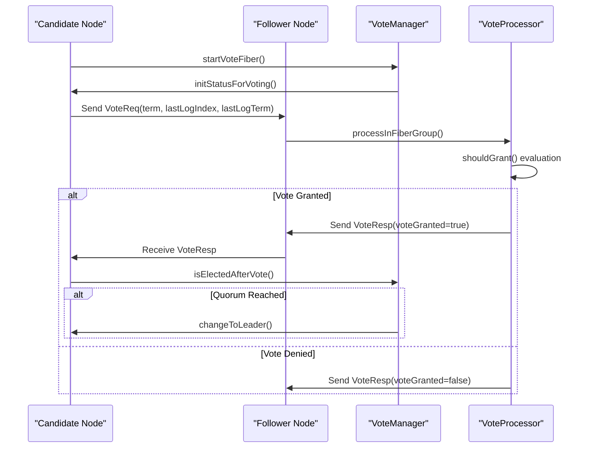
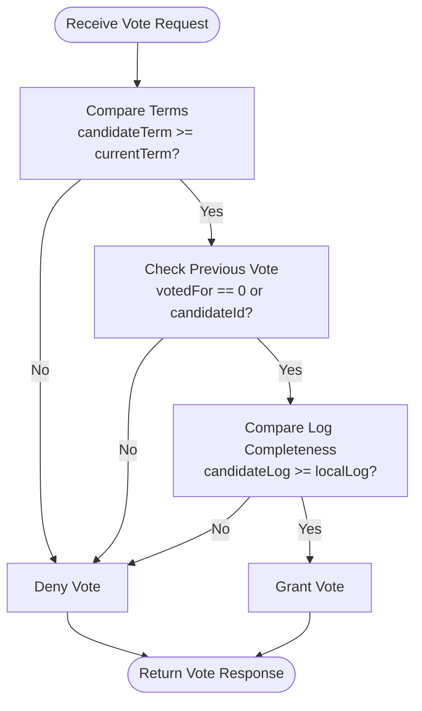
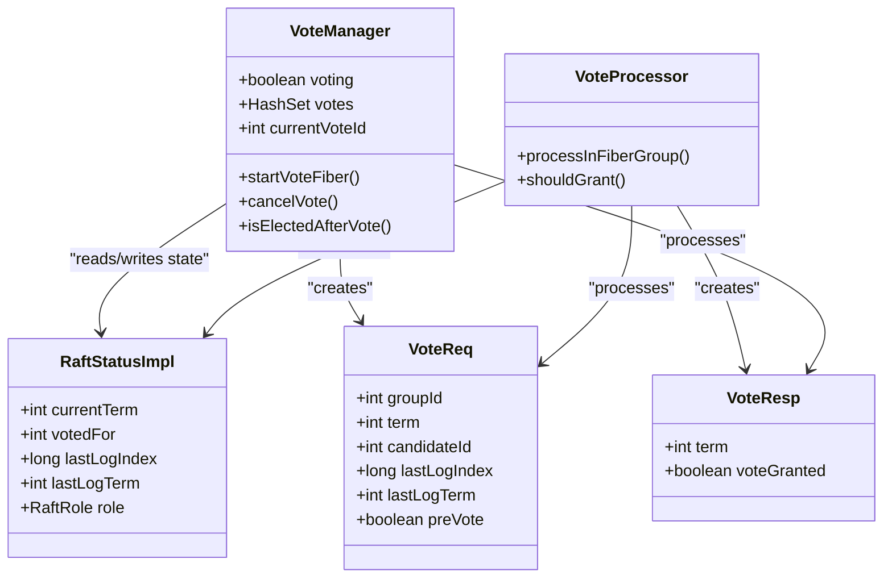

# Leader Election

<cite>
**Referenced Files in This Document**   
- [VoteReq.java](file://server/src/main/java/com/github/dtprj/dongting/raft/rpc/VoteReq.java)
- [VoteResp.java](file://server/src/main/java/com/github/dtprj/dongting/raft/rpc/VoteResp.java)
- [VoteProcessor.java](file://server/src/main/java/com/github/dtprj/dongting/raft/rpc/VoteProcessor.java)
- [VoteManager.java](file://server/src/main/java/com/github/dtprj/dongting/raft/impl/VoteManager.java)
- [RaftUtil.java](file://server/src/main/java/com/github/dtprj/dongting/raft/impl/RaftUtil.java)
- [RaftRole.java](file://server/src/main/java/com/github/dtprj/dongting/raft/impl/RaftRole.java)
</cite>

## Table of Contents
1. [Introduction](#introduction)
2. [RequestVote RPC Process](#requestvote-rpc-process)
3. [Term Management and Voting Rules](#term-management-and-voting-rules)
4. [Election Timeout and Randomized Intervals](#election-timeout-and-randomized-intervals)
5. [Vote Granting Logic](#vote-granting-logic)
6. [VoteManager and VoteProcessor Roles](#votemanager-and-voteprocessor-roles)
7. [Candidate to Leader Transition](#candidate-to-leader-transition)
8. [Split Vote Handling](#split-vote-handling)
9. [Leadership Stability During Network Partitions](#leadership-stability-during-network-partitions)
10. [Failure Scenarios and Recovery](#failure-scenarios-and-recovery)

## Introduction
The leader election mechanism in Dongting's RAFT implementation is a critical component for ensuring high availability and consistency in distributed systems. This document provides a comprehensive analysis of the leader election process, focusing on the RequestVote RPC, term management, voting rules, and the roles of key components such as VoteManager and VoteProcessor. The implementation includes sophisticated mechanisms for handling election timeouts, vote granting, and leadership transitions, ensuring robustness in the face of network partitions and other failure scenarios.

**Section sources**
- [VoteManager.java](file://server/src/main/java/com/github/dtprj/dongting/raft/impl/VoteManager.java#L43-L492)
- [VoteProcessor.java](file://server/src/main/java/com/github/dtprj/dongting/raft/rpc/VoteProcessor.java#L39-L204)

## RequestVote RPC Process

The RequestVote RPC is the primary mechanism for initiating leader elections in Dongting's RAFT implementation. The process begins when a follower node detects that it has not received a heartbeat from the current leader within the election timeout period. The node transitions to the candidate state and sends RequestVote RPCs to all other nodes in the cluster.

The `VoteReq` message structure includes the following fields:
- `groupId`: Identifies the RAFT group
- `term`: The candidate's current term
- `candidateId`: The ID of the requesting candidate
- `lastLogIndex`: The index of the candidate's last log entry
- `lastLogTerm`: The term of the candidate's last log entry
- `preVote`: A boolean flag indicating whether this is a pre-vote request

When a candidate sends a RequestVote RPC, it includes its current term and log information. The receiving nodes evaluate this information to determine whether to grant their vote. The RPC mechanism is implemented using the Dongting network layer, with timeouts and error handling to ensure reliability.



**Diagram sources **
- [VoteReq.java](file://server/src/main/java/com/github/dtprj/dongting/raft/rpc/VoteReq.java#L28-L34)
- [VoteManager.java](file://server/src/main/java/com/github/dtprj/dongting/raft/impl/VoteManager.java#L81-L85)
- [VoteProcessor.java](file://server/src/main/java/com/github/dtprj/dongting/raft/rpc/VoteProcessor.java#L52-L54)

**Section sources**
- [VoteReq.java](file://server/src/main/java/com/github/dtprj/dongting/raft/rpc/VoteReq.java#L28-L34)
- [VoteResp.java](file://server/src/main/java/com/github/dtprj/dongting/raft/rpc/VoteResp.java#L28-L30)
- [VoteProcessor.java](file://server/src/main/java/com/github/dtprj/dongting/raft/rpc/VoteProcessor.java#L52-L54)

## Term Management and Voting Rules

Term management is a crucial aspect of Dongting's RAFT implementation, ensuring that nodes maintain a consistent view of the cluster's state. Each term represents a logical time period during which a single leader is elected. The term number is incremented during leader elections and when nodes receive RPCs with higher term numbers.

The voting rules in Dongting's implementation are designed to prevent split-brain scenarios and ensure that only nodes with up-to-date logs can become leaders. When a node receives a RequestVote RPC, it grants its vote if the following conditions are met:
1. The candidate's term is greater than or equal to the recipient's current term
2. The candidate's log is at least as up-to-date as the recipient's log
3. The recipient has not already voted for another candidate in the current term (except for pre-vote requests)

The log completeness check compares both the last log term and index. A candidate's log is considered more up-to-date if its last log term is higher, or if the terms are equal but its last log index is greater or equal. This ensures that leaders have the most complete log history, maintaining the RAFT safety properties.



**Diagram sources **
- [VoteProcessor.java](file://server/src/main/java/com/github/dtprj/dongting/raft/rpc/VoteProcessor.java#L166-L195)
- [RaftUtil.java](file://server/src/main/java/com/github/dtprj/dongting/raft/impl/RaftUtil.java#L102-L128)

**Section sources**
- [VoteProcessor.java](file://server/src/main/java/com/github/dtprj/dongting/raft/rpc/VoteProcessor.java#L166-L195)
- [RaftUtil.java](file://server/src/main/java/com/github/dtprj/dongting/raft/impl/RaftUtil.java#L102-L128)

## Election Timeout and Randomized Intervals

Dongting's RAFT implementation uses randomized election timeouts to minimize the likelihood of split votes during leader elections. The election timeout is not a fixed value but is instead selected from a randomized interval, which helps prevent multiple followers from becoming candidates simultaneously.

The `VoteManager` class implements the election timeout mechanism using a fiber-based approach. When a node starts as a follower, it initializes a random election timeout within a specified range. The timeout values are configurable, with default minimum and maximum values defined in the `VoteManager` class:

- `firstDelayMin`: 1 millisecond (initial delay minimum)
- `firstDelayMax`: 30 milliseconds (initial delay maximum)
- `checkIntervalMin`: 10 milliseconds (subsequent check minimum)
- `checkIntervalMax`: 700 milliseconds (subsequent check maximum)

The election timeout process is implemented in the `VoteFiberFrame` class, which contains the main election loop. When the timeout expires, the node transitions to the candidate state and initiates a new election. The randomization of timeouts is crucial for preventing repeated split votes, as it ensures that candidates start their election campaigns at different times.

```mermaid
sequenceDiagram
participant Follower as "Follower Node"
participant Timer as "Election Timer"
participant Random as "Random Generator"
Follower->>Timer : Initialize with random timeout
Timer->>Random : Generate random value in range [min, max]
Random-->>Timer : Return random timeout value
Timer->>Follower : Start countdown
loop Check Timeout
Follower->>Follower : Check if timeout expired
alt Timeout Expired
Follower->>Follower : Transition to Candidate
break
else Heartbeat Received
Follower->>Timer : Reset timeout with new random value
end
end
```

**Diagram sources **
- [VoteManager.java](file://server/src/main/java/com/github/dtprj/dongting/raft/impl/VoteManager.java#L62-L65)
- [VoteManager.java](file://server/src/main/java/com/github/dtprj/dongting/raft/impl/VoteManager.java#L240-L332)

**Section sources**
- [VoteManager.java](file://server/src/main/java/com/github/dtprj/dongting/raft/impl/VoteManager.java#L62-L65)
- [VoteManager.java](file://server/src/main/java/com/github/dtprj/dongting/raft/impl/VoteManager.java#L240-L332)

## Vote Granting Logic

The vote granting logic in Dongting's RAFT implementation is implemented in the `shouldGrant` method of the `VoteProcessor` class. This method evaluates whether to grant a vote to a candidate based on several criteria, ensuring the safety and consistency of the leader election process.

The vote granting decision is based on the following conditions:
1. **Term comparison**: The candidate's term must be greater than or equal to the recipient's current term. If the candidate's term is lower, the vote is denied.
2. **Vote history**: For regular vote requests (not pre-votes), the recipient must not have already voted for another candidate in the current term. This prevents a node from voting for multiple candidates in the same term.
3. **Log completeness**: The candidate's log must be at least as up-to-date as the recipient's log. This is determined by comparing the last log term and index.

An important distinction is made between pre-vote and regular vote requests. Pre-vote requests do not update the recipient's votedFor field, allowing nodes to participate in pre-voting without committing to a candidate. This two-phase approach (pre-vote followed by vote) helps prevent disruptions in stable leader scenarios while still allowing new nodes to join the cluster.

The log completeness check uses a two-step comparison:
- First, compare the last log terms: if the candidate's last log term is higher, its log is more up-to-date
- If the terms are equal, compare the last log indices: if the candidate's last log index is greater or equal, its log is more up-to-date

This logic ensures that only candidates with sufficiently complete logs can be elected as leaders, maintaining the RAFT algorithm's safety properties.

**Section sources**
- [VoteProcessor.java](file://server/src/main/java/com/github/dtprj/dongting/raft/rpc/VoteProcessor.java#L166-L195)

## VoteManager and VoteProcessor Roles

The leader election process in Dongting's RAFT implementation is coordinated by two key components: `VoteManager` and `VoteProcessor`. These components have distinct but complementary roles in managing the election process.

The `VoteManager` is responsible for initiating and managing the voting process from the candidate's perspective. Its primary responsibilities include:
- Starting the election timer and handling timeout events
- Managing the candidate's state during the election process
- Sending RequestVote RPCs to other nodes in the cluster
- Collecting and counting votes from other nodes
- Determining when a quorum of votes has been reached
- Transitioning the node to leader state when elected

The `VoteProcessor` handles incoming RequestVote RPCs from the perspective of voting nodes (followers). Its responsibilities include:
- Receiving and processing RequestVote RPCs from candidates
- Evaluating whether to grant a vote based on term and log completeness
- Updating the node's state when granting a vote
- Sending VoteResponse messages back to candidates

The interaction between these components follows a clear pattern: when a node becomes a candidate, its `VoteManager` initiates the election by sending RequestVote RPCs. Other nodes receive these requests through their `VoteProcessor`, which evaluates the request and sends a response. The candidate's `VoteManager` collects these responses and determines the election outcome.

This separation of concerns allows for a clean implementation where the logic for initiating elections is separated from the logic for responding to election requests, improving code maintainability and testability.



**Diagram sources **
- [VoteManager.java](file://server/src/main/java/com/github/dtprj/dongting/raft/impl/VoteManager.java#L43-L492)
- [VoteProcessor.java](file://server/src/main/java/com/github/dtprj/dongting/raft/rpc/VoteProcessor.java#L39-L204)
- [RaftStatusImpl.java](file://server/src/main/java/com/github/dtprj/dongting/raft/impl/RaftStatusImpl.java)

**Section sources**
- [VoteManager.java](file://server/src/main/java/com/github/dtprj/dongting/raft/impl/VoteManager.java#L43-L492)
- [VoteProcessor.java](file://server/src/main/java/com/github/dtprj/dongting/raft/rpc/VoteProcessor.java#L39-L204)

## Candidate to Leader Transition

The transition from candidate to leader occurs when a candidate receives a quorum of votes from the cluster. This process is managed by the `VoteManager` and involves several critical steps to ensure a smooth and safe transition.

When a candidate receives a vote response, the `RespProcessFiberFrame` processes it and checks if the node has been elected. The `isElectedAfterVote` method determines whether the candidate has received a majority of votes by comparing the vote count to the election quorum. The quorum is calculated as a majority of the nodes in the current configuration.

For clusters with joint consensus (during configuration changes), the implementation requires votes from both the old and new configurations. This ensures that the new leader has support from both configurations, maintaining safety during membership changes.

Once a quorum is reached, the candidate transitions to leader state through the following steps:
1. Update its role to leader in the `RaftStatusImpl`
2. Set itself as the current leader
3. Initialize the replicate list for all followers
4. Update the lease start time
5. Start sending heartbeats to maintain leadership

The transition is implemented in the `changeToLeader` method of `RaftUtil`, which resets various state variables and updates the node's role. After becoming leader, the node immediately starts sending heartbeats through the `linearTaskRunner.issueHeartBeat()` method to establish its authority and prevent other nodes from starting new elections.

This transition is atomic and ensures that only one leader exists at any time, maintaining the RAFT algorithm's safety properties. The use of fiber-based execution ensures that the transition is handled asynchronously without blocking other operations.

**Section sources**
- [VoteManager.java](file://server/src/main/java/com/github/dtprj/dongting/raft/impl/VoteManager.java#L398-L409)
- [RaftUtil.java](file://server/src/main/java/com/github/dtprj/dongting/raft/impl/RaftUtil.java#L279-L292)

## Split Vote Handling

Split votes occur when no candidate receives a majority of votes in an election round, typically due to network partitions or simultaneous candidate promotions. Dongting's RAFT implementation handles split votes through a combination of randomized election timeouts and automatic retry mechanisms.

When a split vote occurs, the election eventually times out without any candidate achieving a quorum. The `VoteManager` detects this timeout in the `loop` method of `VoteFiberFrame` and cancels the current voting process. After a random delay, nodes that are still candidates or followers will start a new election round.

The randomized election timeout is crucial for resolving split votes. By selecting a random timeout value from a range, the implementation ensures that nodes start their next election at different times, reducing the likelihood of another split vote. The timeout range is configurable, allowing administrators to tune the election behavior based on their network conditions.

The implementation also includes a pre-vote phase to reduce disruptions in stable leader scenarios. Before starting a full election, candidates first send pre-vote requests to gauge support. This helps prevent unnecessary term increments when a stable leader exists, reducing the frequency of elections and potential split votes.

Additionally, the system handles split votes during configuration changes (joint consensus) by requiring votes from both the old and new configurations. This ensures that leadership transitions during membership changes are safe and consistent, even in the presence of network partitions.

**Section sources**
- [VoteManager.java](file://server/src/main/java/com/github/dtprj/dongting/raft/impl/VoteManager.java#L277-L279)
- [VoteManager.java](file://server/src/main/java/com/github/dtprj/dongting/raft/impl/VoteManager.java#L309-L321)

## Leadership Stability During Network Partitions

Dongting's RAFT implementation ensures leadership stability during network partitions through several mechanisms, including lease-based leadership and careful handling of term increments.

The lease mechanism provides a time window during which the leader can operate without fear of being deposed by a partitioned minority. The lease duration is calculated based on the round-trip time to a quorum of followers, ensuring that the leader can continue to serve requests even if some followers are temporarily unreachable.

When a network partition occurs, nodes in the minority partition will eventually time out and attempt to start new elections. However, they will be unable to achieve a quorum since they don't have a majority of nodes. When they send RequestVote RPCs to nodes in the majority partition, those nodes will reject the requests because the candidate's log is not as up-to-date as the current leader's log.

The implementation also handles the case where the leader is in the minority partition. In this scenario, the leader will stop receiving acknowledgments from a quorum of followers and will step down, allowing a new leader to be elected in the majority partition. This ensures that the system can continue to make progress as long as a majority of nodes are connected.

The use of pre-vote requests further enhances stability by preventing partitioned nodes from inappropriately increasing the term number. Before starting a full election, candidates first send pre-vote requests to check if they would receive votes. This prevents isolated nodes from disrupting a stable leader unnecessarily.

These mechanisms work together to ensure that Dongting's RAFT implementation maintains leadership stability during network partitions, providing consistent and available service even in challenging network conditions.

**Section sources**
- [RaftUtil.java](file://server/src/main/java/com/github/dtprj/dongting/raft/impl/RaftUtil.java#L203-L213)
- [VoteProcessor.java](file://server/src/main/java/com/github/dtprj/dongting/raft/rpc/VoteProcessor.java#L106-L110)

## Failure Scenarios and Recovery

Dongting's RAFT implementation includes robust mechanisms for handling various failure scenarios and ensuring recovery to a consistent state. These mechanisms are critical for maintaining the reliability and availability of the distributed system.

### Split-Brain Prevention
The implementation prevents split-brain scenarios through strict quorum requirements and log completeness checks. A node can only become leader if it receives votes from a majority of the cluster, ensuring that at most one leader exists at any time. The log completeness check ensures that only nodes with sufficiently up-to-date logs can be elected, preventing stale nodes from becoming leaders.

### Failed Election Recovery
When an election fails due to a split vote or network partition, the system automatically recovers by timing out the current election and starting a new one after a random delay. The `VoteManager` handles this process through the `cancelVote` method, which resets the voting state and allows for a new election to begin.

### Node Failure and Recovery
When a node fails and later recovers, it rejoins the cluster by synchronizing its state with the current leader. The implementation uses snapshotting and log replication to bring failed nodes up to date. The `installSnapshot` mechanism allows new or recovered nodes to quickly catch up to the current state without replaying the entire log.

### Network Partition Recovery
When a network partition heals, nodes from the minority partition rejoin the majority and synchronize their state with the current leader. The implementation ensures that any conflicting log entries are overwritten with the leader's log, maintaining consistency across the cluster.

### Configuration Change Failures
The system handles failures during configuration changes through the joint consensus approach. If a configuration change fails, the system can safely abort the change and revert to the previous configuration. The pre-vote mechanism helps prevent disruptive configuration changes when a stable leader exists.

These failure recovery mechanisms work together to ensure that Dongting's RAFT implementation can handle various failure scenarios gracefully, maintaining data consistency and system availability.

**Section sources**
- [VoteManager.java](file://server/src/main/java/com/github/dtprj/dongting/raft/impl/VoteManager.java#L87-L93)
- [RaftUtil.java](file://server/src/main/java/com/github/dtprj/dongting/raft/impl/RaftUtil.java#L102-L128)
- [MemberManager.java](file://server/src/main/java/com/github/dtprj/dongting/raft/impl/MemberManager.java#L864-L867)