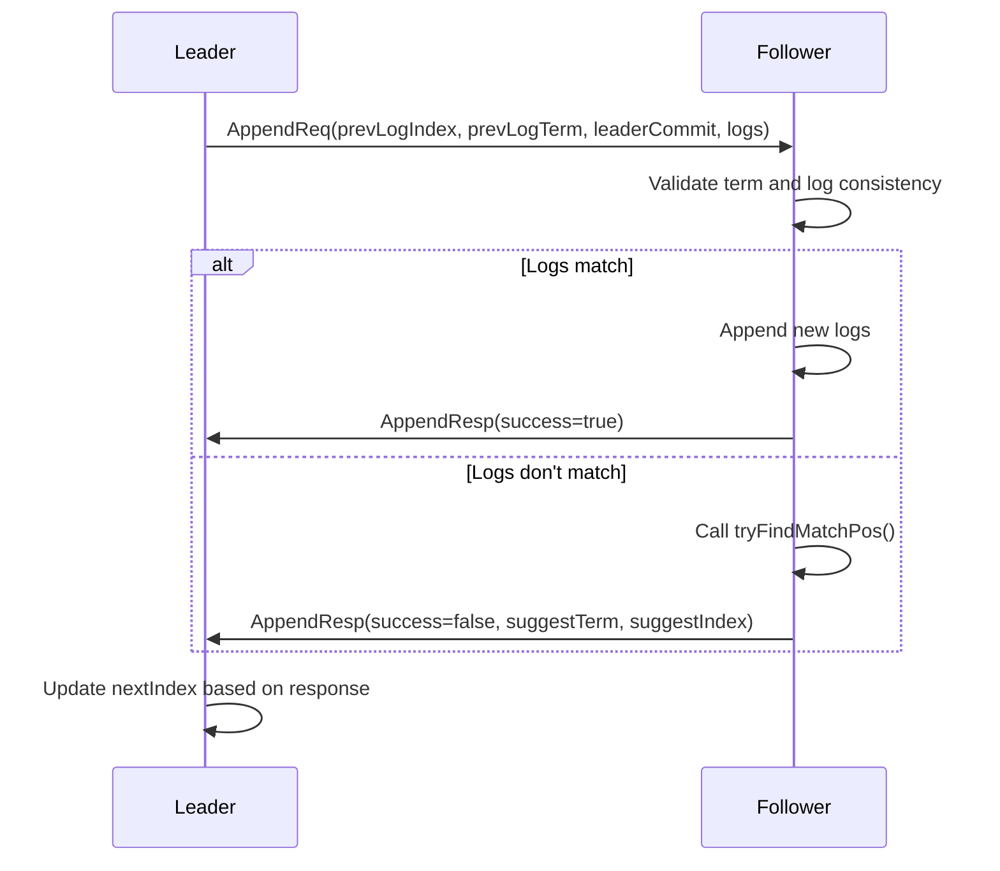
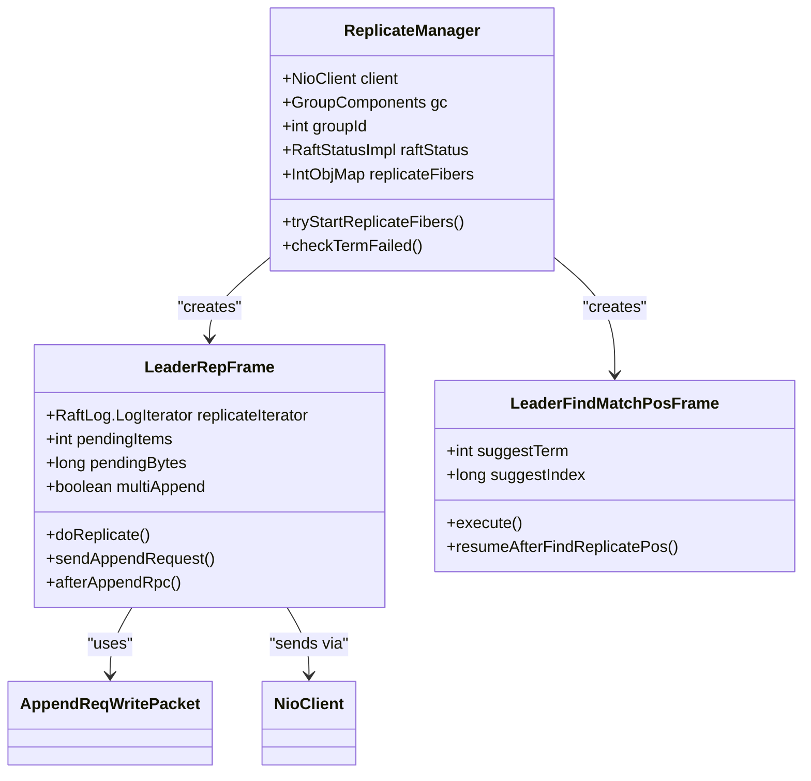
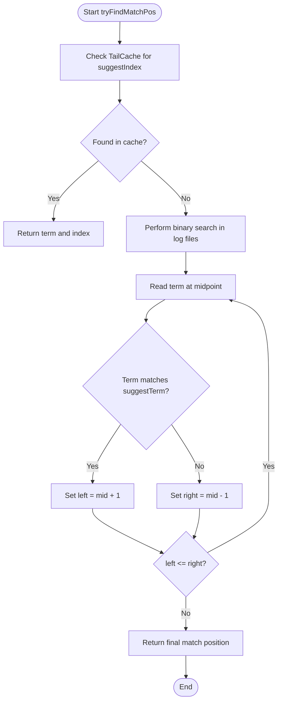
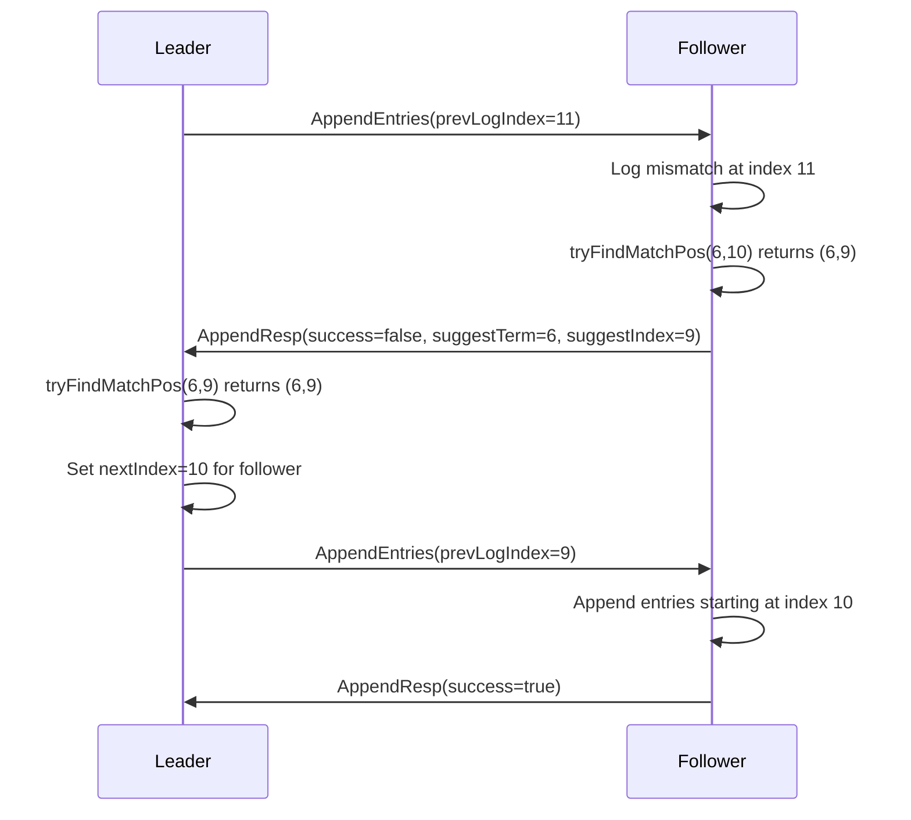
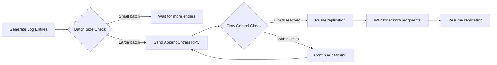

# Log Replication

<cite>
**Referenced Files in This Document**   
- [ReplicateManager.java](file://server/src/main/java/com/github/dtprj/dongting/raft/impl/ReplicateManager.java)
- [AppendReq.java](file://server/src/main/java/com/github/dtprj/dongting/raft/rpc/AppendReq.java)
- [AppendResp.java](file://server/src/main/java/com/github/dtprj/dongting/raft/rpc/AppendResp.java)
- [AppendProcessor.java](file://server/src/main/java/com/github/dtprj/dongting/raft/rpc/AppendProcessor.java)
- [RaftLog.java](file://server/src/main/java/com/github/dtprj/dongting/raft/store/RaftLog.java)
- [TailCache.java](file://server/src/main/java/com/github/dtprj/dongting/raft/impl/TailCache.java)
- [CommitManager.java](file://server/src/main/java/com/github/dtprj/dongting/raft/impl/CommitManager.java)
- [tryFindMatchPos.webp](file://devlogs/imgs/tryFindMatchPos.webp)
</cite>

## Table of Contents
1. [Introduction](#introduction)
2. [AppendEntries RPC Process](#appendentries-rpc-process)
3. [ReplicateManager and Concurrent Replication](#replicatemanager-and-concurrent-replication)
4. [Fast Index Matching Algorithm](#fast-index-matching-algorithm)
5. [Log Consistency and Conflict Resolution](#log-consistency-and-conflict-resolution)
6. [Performance Optimizations](#performance-optimizations)
7. [Conclusion](#conclusion)

## Introduction

The Dongting RAFT implementation provides a robust log replication mechanism that ensures consistency across distributed nodes. This document details the core components and processes involved in log replication, focusing on the AppendEntries RPC, the ReplicateManager's handling of concurrent replication, and the fast index matching algorithm used to resolve log inconsistencies. The system is designed to efficiently handle leader elections, follower outages, and network partitions while maintaining high performance through batching, pipelining, and flow control.

**Section sources**
- [ReplicateManager.java](file://server/src/main/java/com/github/dtprj/dongting/raft/impl/ReplicateManager.java#L1-L792)
- [AppendProcessor.java](file://server/src/main/java/com/github/dtprj/dongting/raft/rpc/AppendProcessor.java#L1-L579)

## AppendEntries RPC Process

The AppendEntries RPC is the primary mechanism for log replication in the Dongting RAFT implementation. It serves dual purposes: replicating log entries from the leader to followers and acting as a heartbeat to maintain leadership.

The process begins when the leader constructs an `AppendReq` message containing key metadata:
- `prevLogIndex` and `prevLogTerm`: The index and term of the log entry immediately preceding the new entries
- `leaderCommit`: The leader's current commit index
- `logs`: The batch of log entries to be replicated

**Diagram sources**
- [AppendReq.java](file://server/src/main/java/com/github/dtprj/dongting/raft/rpc/AppendReq.java#L34-L43)
- [AppendResp.java](file://server/src/main/java/com/github/dtprj/dongting/raft/rpc/AppendResp.java#L28-L34)
- [AppendProcessor.java](file://server/src/main/java/com/github/dtprj/dongting/raft/rpc/AppendProcessor.java#L247-L435)

When a follower receives an AppendEntries request, it first validates the leader's term. If the request's term is less than the follower's current term, the request is rejected. The follower then checks if its log contains an entry at `prevLogIndex` that matches the `prevLogTerm`. If they match, the follower appends any new entries from the request and updates its `leaderCommit` if the request's `leaderCommit` is greater than its current value.

If the log entries don't match, the follower rejects the request and provides suggestion parameters (`suggestTerm` and `suggestIndex`) to help the leader quickly find the correct replication point. This mechanism prevents the inefficient linear search that would occur if the leader had to decrement `nextIndex` by one for each failed attempt.

**Section sources**
- [AppendProcessor.java](file://server/src/main/java/com/github/dtprj/dongting/raft/rpc/AppendProcessor.java#L277-L399)
- [AppendReq.java](file://server/src/main/java/com/github/dtprj/dongting/raft/rpc/AppendReq.java#L56-L62)

## ReplicateManager and Concurrent Replication

The `ReplicateManager` class is responsible for managing log replication to multiple followers concurrently. It employs a fiber-based architecture to handle multiple replication streams efficiently without blocking threads.

**Diagram sources**
- [ReplicateManager.java](file://server/src/main/java/com/github/dtprj/dongting/raft/impl/ReplicateManager.java#L67-L792)
- [LeaderRepFrame](file://server/src/main/java/com/github/dtprj/dongting/raft/impl/ReplicateManager.java#L206-L554)

The `ReplicateManager` maintains a separate fiber for each follower, allowing concurrent replication streams. Each `LeaderRepFrame` fiber manages the replication state for a specific follower, including:
- `nextIndex`: The next log index to send to the follower
- `matchIndex`: The highest log index known to be replicated on the follower
- `pendingItems` and `pendingBytes`: Flow control counters

The manager implements sophisticated flow control to prevent overwhelming followers. It uses thresholds like `maxReplicateItems` and `maxReplicateBytes` to limit the amount of unacknowledged data in flight. When these limits are approached, the fiber pauses replication until acknowledgments are received, preventing buffer overflow and network congestion.

The `tryStartReplicateFibers()` method scans the list of followers and starts or restarts replication fibers as needed. If a follower requires snapshot installation (indicated by `installSnapshot` flag), a `LeaderInstallFrame` fiber is created instead of the standard `LeaderRepFrame`.

**Section sources**
- [ReplicateManager.java](file://server/src/main/java/com/github/dtprj/dongting/raft/impl/ReplicateManager.java#L99-L127)
- [ReplicateManager.java](file://server/src/main/java/com/github/dtprj/dongting/raft/impl/ReplicateManager.java#L277-L307)

## Fast Index Matching Algorithm

The fast index matching algorithm is a critical optimization in Dongting's RAFT implementation that efficiently resolves log inconsistencies, especially after prolonged follower outages. The algorithm centers around the `tryFindMatchPos()` method in the `RaftLog` interface.

When a follower detects a log mismatch, it calls `tryFindMatchPos(suggestTerm, suggestIndex)` to find the largest index where its log matches the leader's log. The algorithm works as follows:

1. First, it checks the in-memory `TailCache` for a matching entry
2. If not found in cache, it performs a binary search across log files on disk
3. The search uses the `suggestIndex` as the upper bound and the first index of the earliest log file as the lower bound
4. For each midpoint in the binary search, it reads the log entry's term and compares it with `suggestTerm`

**Diagram sources**
- [RaftLog.java](file://server/src/main/java/com/github/dtprj/dongting/raft/store/RaftLog.java#L50-L51)
- [MatchPosFinder.java](file://server/src/main/java/com/github/dtprj/dongting/raft/store/MatchPosFinder.java#L38-L96)
- [TailCache.java](file://server/src/main/java/com/github/dtprj/dongting/raft/impl/TailCache.java#L50-L55)

The algorithm is invoked twice in the conflict resolution process:
1. The follower calls `tryFindMatchPos()` with the `prevLogTerm` and `prevLogIndex` from the failed AppendEntries request
2. The leader receives the suggested position and calls `tryFindMatchPos()` locally to verify and potentially refine the match point

This two-phase approach ensures that both leader and follower agree on the correct replication point, even in cases of complex log divergence. The algorithm is particularly efficient for scenarios where a follower has been offline for an extended period, as it avoids the O(n) search time of naive implementations.

**Section sources**
- [AppendProcessor.java](file://server/src/main/java/com/github/dtprj/dongting/raft/rpc/AppendProcessor.java#L294-L296)
- [ReplicateManager.java](file://server/src/main/java/com/github/dtprj/dongting/raft/impl/ReplicateManager.java#L572-L573)
- [2024_07_26_raft算法的工程实现秘笈.md](file://devlogs/2024_07_26_raft算法的工程实现秘笈.md#L88-L110)

## Log Consistency and Conflict Resolution

Log consistency in Dongting's RAFT implementation is maintained through a combination of the AppendEntries RPC, the fast index matching algorithm, and careful state management. The system ensures that all logs are replicated in order and that conflicting entries are properly resolved.

When a log inconsistency is detected, the conflict resolution process follows these steps:

1. The follower rejects the AppendEntries request with `success=false` and provides `suggestTerm` and `suggestIndex`
2. The leader creates a `LeaderFindMatchPosFrame` fiber to find the correct replication point
3. The leader calls `tryFindMatchPos()` locally to determine the actual match position
4. The leader updates its `nextIndex` for the follower and resumes replication

**Diagram sources**
- [AppendProcessor.java](file://server/src/main/java/com/github/dtprj/dongting/raft/rpc/AppendProcessor.java#L288-L297)
- [ReplicateManager.java](file://server/src/main/java/com/github/dtprj/dongting/raft/impl/ReplicateManager.java#L524-L530)
- [tryFindMatchPos.webp](file://devlogs/imgs/tryFindMatchPos.webp)

The system maintains several key state variables to track replication progress:
- `lastWriteLogIndex`: The highest log index that has been written to disk
- `lastForceLogIndex`: The highest log index that has been fsync'd to persistent storage
- `commitIndex`: The highest log index known to be committed

These variables are updated in the `CommitManager` when log writes are confirmed. The `leaderTryCommit()` method checks if a log entry can be committed by verifying that a majority of nodes (including the leader) have replicated the entry. Once committed, the entry can be safely applied to the state machine.

The `TailCache` plays a crucial role in maintaining log consistency by keeping recently appended entries in memory. This allows for quick access during replication and conflict resolution. The cache is bounded by `maxCacheTasks` and `maxCacheTaskBytes` to prevent excessive memory usage, and entries are evicted based on age and application progress.

**Section sources**
- [AppendProcessor.java](file://server/src/main/java/com/github/dtprj/dongting/raft/rpc/AppendProcessor.java#L421-L432)
- [CommitManager.java](file://server/src/main/java/com/github/dtprj/dongting/raft/impl/CommitManager.java#L80-L107)
- [TailCache.java](file://server/src/main/java/com/github/dtprj/dongting/raft/impl/TailCache.java#L35-L43)

## Performance Optimizations

Dongting's RAFT implementation includes several performance optimizations to maximize throughput and minimize latency in the log replication process.

### Batching and Pipelining

The `ReplicateManager` batches multiple log entries into a single AppendEntries RPC to reduce network overhead. The batch size is controlled by `maxReplicateItems` and `maxReplicateBytes`, with the system dynamically adjusting the batch size based on flow control feedback. When `multiAppend` is enabled, the leader can pipeline multiple batches without waiting for acknowledgments, significantly improving throughput.

### Concurrent Writes

The system implements concurrent writes through the use of fibers, allowing multiple replication streams to proceed in parallel. Each follower has its own `LeaderRepFrame` fiber, enabling independent progress tracking and flow control. This design prevents slow followers from blocking faster ones, maintaining high overall throughput.

### Flow Control

Sophisticated flow control mechanisms prevent network congestion and buffer overflow:
- `pendingItems` and `pendingBytes` track unacknowledged data
- `restItemsToStartReplicate` prevents the "silly window syndrome" by requiring a minimum amount of data to be acknowledged before resuming replication
- The `await()` method uses conditions to pause replication when limits are reached

**Diagram sources**
- [ReplicateManager.java](file://server/src/main/java/com/github/dtprj/dongting/raft/impl/ReplicateManager.java#L219-L222)
- [ReplicateManager.java](file://server/src/main/java/com/github/dtprj/dongting/raft/impl/ReplicateManager.java#L311-L315)

### Relationship Between Key Index Variables

The performance and correctness of the system depend on the proper coordination of three key index variables:
- `lastWriteLogIndex`: Updated when log entries are written to the write buffer
- `lastForceLogIndex`: Updated after fsync completes, ensuring durability
- `commitIndex`: Updated when a log entry is committed and can be applied

The `CommitManager`'s fiber periodically checks these indices and triggers the appropriate actions. When `lastForceLogIndex` exceeds `commitIndex`, the system can commit new entries and apply them to the state machine. This separation allows for asynchronous I/O operations while maintaining strict ordering guarantees.

**Section sources**
- [CommitManager.java](file://server/src/main/java/com/github/dtprj/dongting/raft/impl/CommitManager.java#L70-L77)
- [ReplicateManager.java](file://server/src/main/java/com/github/dtprj/dongting/raft/impl/ReplicateManager.java#L380-L415)

## Conclusion

Dongting's RAFT implementation provides a comprehensive and efficient log replication mechanism that balances correctness, performance, and resilience. The system's use of the AppendEntries RPC for both log replication and heartbeats ensures leader stability while maintaining log consistency across the cluster.

The `ReplicateManager` effectively handles concurrent replication to multiple followers through a fiber-based architecture, with sophisticated flow control preventing network congestion. The fast index matching algorithm using `tryFindMatchPos()` dramatically improves recovery time after follower outages, avoiding the inefficiencies of linear search.

Key design elements like the separation of `lastWriteLogIndex`, `lastForceLogIndex`, and `commitIndex` enable high-performance asynchronous I/O while maintaining strict ordering guarantees. The integration of batching, pipelining, and the `TailCache` further optimizes throughput and latency.

Together, these components create a robust distributed consensus system capable of handling the challenges of real-world deployments, including network partitions, node failures, and varying performance characteristics across the cluster.

**Section sources**
- [ReplicateManager.java](file://server/src/main/java/com/github/dtprj/dongting/raft/impl/ReplicateManager.java#L1-L792)
- [AppendProcessor.java](file://server/src/main/java/com/github/dtprj/dongting/raft/rpc/AppendProcessor.java#L1-L579)
- [CommitManager.java](file://server/src/main/java/com/github/dtprj/dongting/raft/impl/CommitManager.java#L1-L196)