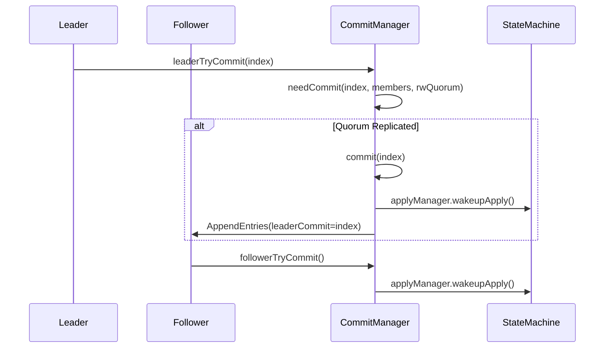
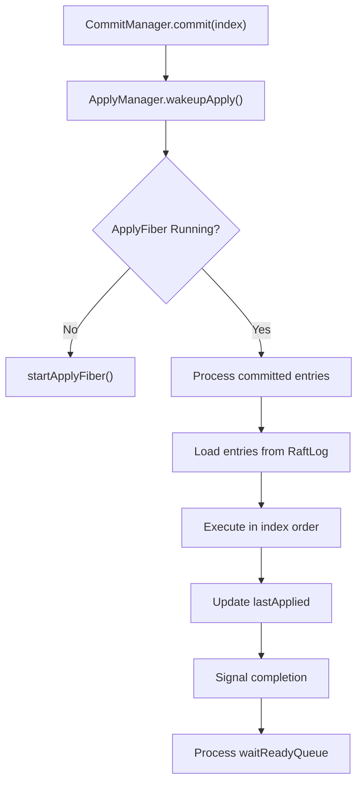
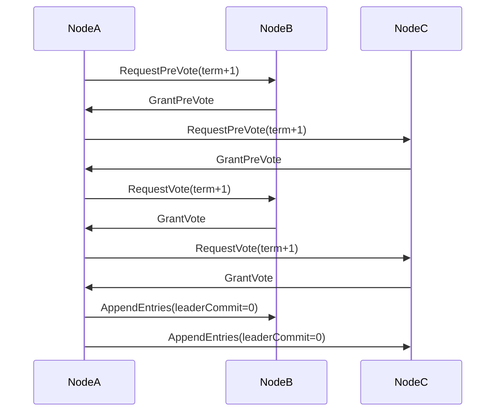
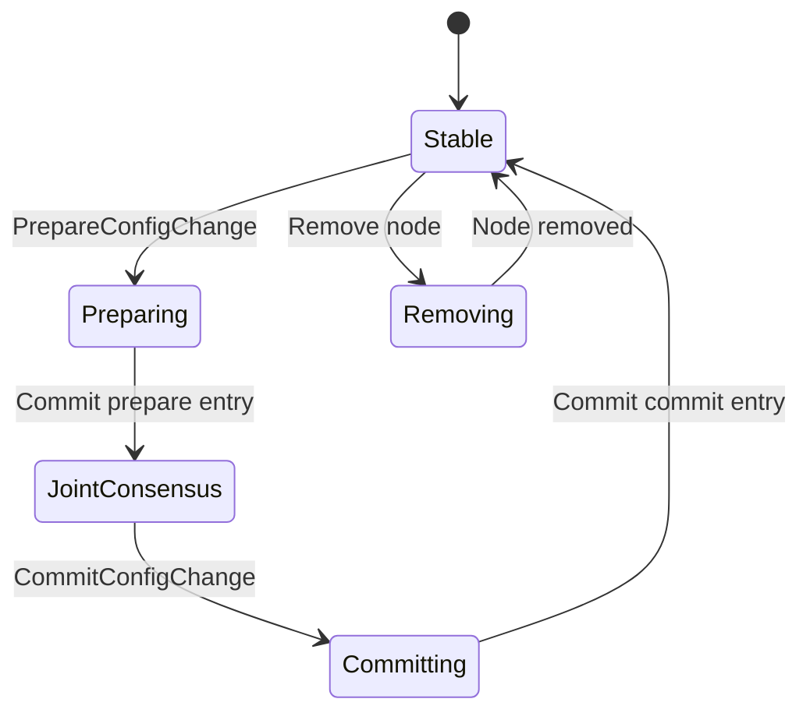
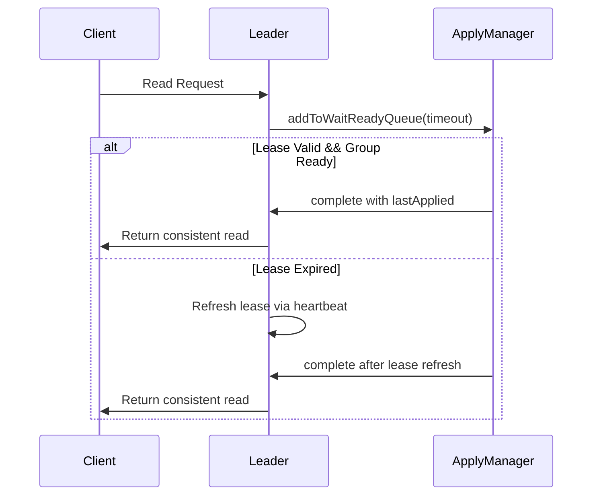

# Safety Mechanisms

<cite>
**Referenced Files in This Document**   
- [CommitManager.java](file://server/src/main/java/com/github/dtprj/dongting/raft/impl/CommitManager.java)
- [ApplyManager.java](file://server/src/main/java/com/github/dtprj/dongting/raft/impl/ApplyManager.java)
- [RaftStatusImpl.java](file://server/src/main/java/com/github/dtprj/dongting/raft/impl/RaftStatusImpl.java)
- [RaftRole.java](file://server/src/main/java/com/github/dtprj/dongting/raft/impl/RaftRole.java)
- [ReplicateManager.java](file://server/src/main/java/com/github/dtprj/dongting/raft/impl/ReplicateManager.java)
- [MemberManager.java](file://server/src/main/java/com/github/dtprj/dongting/raft/impl/MemberManager.java)
- [AppendReq.java](file://server/src/main/java/com/github/dtprj/dongting/raft/rpc/AppendReq.java)
- [VoteReq.java](file://server/src/main/java/com/github/dtprj/dongting/raft/rpc/VoteReq.java)
- [RaftStatus.java](file://server/src/main/java/com/github/dtprj/dongting/raft/server/RaftStatus.java)
</cite>

## Table of Contents
1. [Introduction](#introduction)
2. [CommitManager: Ensuring Quorum-Based Log Commitment](#commitmanager-ensuring-quorum-based-log-commitment)
3. [ApplyManager: Safe Application of Committed Logs](#applymanager-safe-application-of-committed-logs)
4. [Preservation of Previous Term Entries](#preservation-of-previous-term-entries)
5. [Leadership Change Safety](#leadership-change-safety)
6. [Joint Consensus for Configuration Changes](#joint-consensus-for-configuration-changes)
7. [Split-Brain Prevention](#split-brain-prevention)
8. [Linearizable Reads via Lease Mechanism](#linearizable-reads-via-lease-mechanism)
9. [Read Modes and Safety Guarantees](#read-modes-and-safety-guarantees)
10. [Conclusion](#conclusion)

## Introduction
Dongting's RAFT implementation incorporates comprehensive safety mechanisms to ensure data consistency, fault tolerance, and linearizability in distributed environments. This document details the core safety components, focusing on how the CommitManager and ApplyManager work together to maintain consistency, how leadership transitions are handled safely, and how various read modes provide different consistency guarantees. The system adheres to RAFT's safety principles while extending them with practical optimizations for real-world deployment.

## CommitManager: Ensuring Quorum-Based Log Commitment
The CommitManager is responsible for determining when log entries can be safely committed to the state machine, ensuring that only entries replicated to a quorum are committed. This mechanism is fundamental to maintaining consistency across the cluster.

The CommitManager operates through a dedicated fiber that periodically checks for new entries that can be committed. For leaders, the `leaderTryCommit` method evaluates whether a log entry has been replicated to a majority of the cluster members. This is determined by comparing the `matchIndex` of each member against the entry's index, ensuring that the entry exists on a quorum before commitment.

For followers, the `followerTryCommit` method uses the `leaderCommit` field from AppendEntries requests to determine which entries can be committed locally. The follower ensures that it only commits entries up to the minimum of its `lastPersistIndex` and the `leaderCommit`, preventing over-commitment.

The critical invariant that only logs from the current term can be committed by a leader (as specified in RAFT paper 5.4.2) is enforced in the `leaderTryCommit` method. Before committing, the method verifies that the entry's index is at or beyond the `groupReadyIndex`, which marks the first log of the current term.

**Diagram sources**
- [CommitManager.java](file://server/src/main/java/com/github/dtprj/dongting/raft/impl/CommitManager.java#L121-L137)
- [ApplyManager.java](file://server/src/main/java/com/github/dtprj/dongting/raft/impl/ApplyManager.java#L144-L146)

**Section sources**
- [CommitManager.java](file://server/src/main/java/com/github/dtprj/dongting/raft/impl/CommitManager.java#L50-L195)

## ApplyManager: Safe Application of Committed Logs
The ApplyManager ensures that committed logs are applied to the state machine in strict index order, even when processing is asynchronous and potentially out-of-order. This component is crucial for maintaining the deterministic state of the system.

The ApplyManager operates as a dedicated fiber that processes committed entries sequentially. It maintains the `lastApplying` index to track progress and uses a `TailCache` to manage pending entries. When new entries are committed, the ApplyManager is woken up via `wakeupApply()` and begins processing from the next unapplied index.

For normal entries, the ApplyManager invokes the state machine's `exec` method, which returns a `FiberFuture` to handle asynchronous execution. The `afterExec` callback ensures that the `lastApplied` index is updated only after successful execution, maintaining the sequential application invariant.

Special handling is provided for configuration change entries (prepare, drop, commit), which are processed in a dedicated `ConfigChangeFrame` to ensure atomicity. Heartbeat entries are processed immediately to maintain leadership lease.

The ApplyManager also manages a `waitReadyQueue` for lease-based reads, ensuring that read requests are completed only when the group is ready and the lease is valid.

**Diagram sources**
- [ApplyManager.java](file://server/src/main/java/com/github/dtprj/dongting/raft/impl/ApplyManager.java#L139-L142)
- [CommitManager.java](file://server/src/main/java/com/github/dtprj/dongting/raft/impl/CommitManager.java#L140-L143)

**Section sources**
- [ApplyManager.java](file://server/src/main/java/com/github/dtprj/dongting/raft/impl/ApplyManager.java#L58-L547)

## Preservation of Previous Term Entries
Dongting's RAFT implementation maintains the critical invariant that committed entries from previous terms are preserved in the leader's log. This is ensured through the log matching property and the leader election process.

During leader election, candidates include their `lastLogIndex` and `lastLogTerm` in RequestVote requests. Followers grant votes only if the candidate's log is at least as up-to-date as their own, using the election restriction algorithm from the RAFT paper.

When a new leader is elected, it does not immediately commit entries from previous terms. Instead, it commits a blank entry in its own term, which implicitly commits all preceding entries. This is enforced in the `leaderTryCommit` method, which checks that the entry index is at or beyond `groupReadyIndex` (the first log of the current term).

The `ReplicateManager` ensures that when sending AppendEntries requests, the `prevLogIndex` and `prevLogTerm` fields correctly reference the immediate predecessor of the first new entry, maintaining the log continuity invariant.

**Section sources**
- [CommitManager.java](file://server/src/main/java/com/github/dtprj/dongting/raft/impl/CommitManager.java#L132-L134)
- [VoteReq.java](file://server/src/main/java/com/github/dtprj/dongting/raft/rpc/VoteReq.java#L38-L39)
- [AppendReq.java](file://server/src/main/java/com/github/dtprj/dongting/raft/rpc/AppendReq.java#L59-L60)

## Leadership Change Safety
Leadership changes in Dongting are handled safely through a combination of pre-vote and regular vote phases, preventing disruptions caused by transient network issues.

The system uses a pre-vote mechanism where candidates first check if they can win an election before incrementing their term. This prevents unnecessary term increments and potential leadership disruptions. The `preVote` flag in the `VoteReq` message distinguishes between pre-vote and regular vote requests.

During leadership transition, the new leader establishes its authority by replicating a new log entry in its term. The `RaftStatusImpl` tracks the current role and updates it atomically during role changes. The `RaftRole` enum defines the possible states (follower, candidate, leader, none), ensuring that only one leader exists at any time.

The `MemberManager` coordinates membership changes during leadership transitions, ensuring that configuration changes are properly replicated and committed.

**Diagram sources**
- [VoteReq.java](file://server/src/main/java/com/github/dtprj/dongting/raft/rpc/VoteReq.java#L40)
- [RaftRole.java](file://server/src/main/java/com/github/dtprj/dongting/raft/impl/RaftRole.java)

**Section sources**
- [VoteReq.java](file://server/src/main/java/com/github/dtprj/dongting/raft/rpc/VoteReq.java#L1-L102)
- [RaftStatusImpl.java](file://server/src/main/java/com/github/dtprj/dongting/raft/impl/RaftStatusImpl.java)

## Joint Consensus for Configuration Changes
Configuration changes in Dongting are implemented using joint consensus, allowing safe transitions between different cluster configurations without downtime.

The process involves three stages:
1. **Prepare**: The leader proposes a configuration change by writing a `TYPE_PREPARE_CONFIG_CHANGE` entry to the log. This entry contains both the current and target configurations.
2. **Commit**: Once the prepare entry is committed, the system operates under joint consensus, requiring agreement from a majority in both the old and new configurations.
3. **Finalize**: After the joint configuration is committed, a `TYPE_COMMIT_CONFIG_CHANGE` entry finalizes the change, and the old configuration is discarded.

The `MemberManager` handles the state transitions for configuration changes, while the `ApplyManager` processes the configuration change entries in a dedicated `ConfigChangeFrame` to ensure atomic application.

This approach prevents split-brain scenarios during configuration changes, as both the old and new configurations must agree on leadership during the transition period.

**Diagram sources**
- [MemberManager.java](file://server/src/main/java/com/github/dtprj/dongting/raft/impl/MemberManager.java)
- [ApplyManager.java](file://server/src/main/java/com/github/dtprj/dongting/raft/impl/ApplyManager.java#L162-L170)

**Section sources**
- [ApplyManager.java](file://server/src/main/java/com/github/dtprj/dongting/raft/impl/ApplyManager.java#L480-L512)
- [MemberManager.java](file://server/src/main/java/com/github/dtprj/dongting/raft/impl/MemberManager.java)

## Split-Brain Prevention
Dongting prevents split-brain scenarios through several mechanisms:

1. **Election Safety**: The RAFT invariant that a term can have at most one leader is enforced through the voting process. The `RaftStatusImpl` ensures that a node grants votes only if the candidate's log is at least as up-to-date as its own.

2. **Leader Completeness**: The restriction that only logs from the current term can be committed ensures that leaders have all committed entries from previous terms. This is enforced in `CommitManager.leaderTryCommit`.

3. **Joint Consensus**: During configuration changes, the system requires agreement from both old and new configurations, preventing isolated groups from electing leaders.

4. **Term Monotonicity**: The term number increases monotonically across the cluster, ensuring that stale leaders cannot disrupt the system.

The `ReplicateManager` plays a key role in split-brain prevention by ensuring that AppendEntries requests are sent to all members, maintaining log consistency across the cluster.

**Section sources**
- [CommitManager.java](file://server/src/main/java/com/github/dtprj/dongting/raft/impl/CommitManager.java#L132-L134)
- [ReplicateManager.java](file://server/src/main/java/com/github/dtprj/dongting/raft/impl/ReplicateManager.java)
- [RaftStatus.java](file://server/src/main/java/com/github/dtprj/dongting/raft/server/RaftStatus.java)

## Linearizable Reads via Lease Mechanism
Dongting implements linearizable reads through a lease-based mechanism that allows leaders to serve read requests without contacting a quorum, while maintaining strong consistency.

When a leader is elected, it establishes a lease by replicating a log entry in its term. During the lease period, the leader can safely serve read requests, as the lease prevents other nodes from becoming leaders. The lease duration is managed through the `updateLease` method in `RaftUtil`.

The `ApplyManager` maintains a `waitReadyQueue` for lease-based reads. When a read request arrives, it is added to this queue with a timeout. The request is completed when the group is ready and the lease is valid, ensuring linearizability.

This approach provides high-performance reads while maintaining the same consistency guarantees as quorum-based reads, as long as the system clock synchronization assumption holds.

**Diagram sources**
- [ApplyManager.java](file://server/src/main/java/com/github/dtprj/dongting/raft/impl/ApplyManager.java#L250-L273)
- [CommitManager.java](file://server/src/main/java/com/github/dtprj/dongting/raft/impl/CommitManager.java#L129)

**Section sources**
- [ApplyManager.java](file://server/src/main/java/com/github/dtprj/dongting/raft/impl/ApplyManager.java#L209-L236)
- [CommitManager.java](file://server/src/main/java/com/github/dtprj/dongting/raft/impl/CommitManager.java#L127-L129)

## Read Modes and Safety Guarantees
Dongting supports multiple read modes with different consistency and performance characteristics:

1. **Log Read**: The default mode that ensures linearizability by waiting for the entry to be committed before responding. This provides the strongest consistency guarantee.

2. **Lease Read**: A high-performance mode that uses the leader lease to serve reads without contacting followers. This maintains linearizability under clock synchronization assumptions.

3. **Stale Read**: Allows reads from followers without consistency guarantees, suitable for use cases that can tolerate stale data.

The safety of each mode is enforced through the `ApplyManager` and `CommitManager` coordination. Log reads are implemented through the normal commit process, while lease reads use the `addToWaitReadyQueue` mechanism to ensure the read happens after the group is ready.

The system automatically selects the appropriate read mode based on client requirements, balancing consistency and performance needs.

**Section sources**
- [ApplyManager.java](file://server/src/main/java/com/github/dtprj/dongting/raft/impl/ApplyManager.java#L172-L176)
- [CommitManager.java](file://server/src/main/java/com/github/dtprj/dongting/raft/impl/CommitManager.java#L110-L118)

## Conclusion
Dongting's RAFT implementation provides comprehensive safety mechanisms that ensure data consistency, fault tolerance, and linearizability in distributed environments. The CommitManager and ApplyManager work in concert to ensure that only quorum-replicated logs are committed and applied in strict order. Leadership changes are handled safely through pre-vote mechanisms and term-based coordination. Configuration changes use joint consensus to prevent split-brain scenarios. Linearizable reads are supported through a lease-based mechanism that provides high performance without sacrificing consistency. These safety mechanisms make Dongting suitable for mission-critical applications requiring strong consistency guarantees.