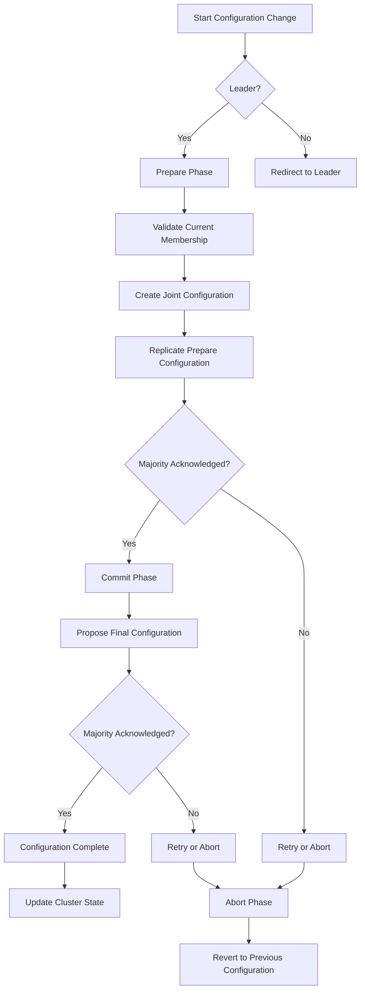
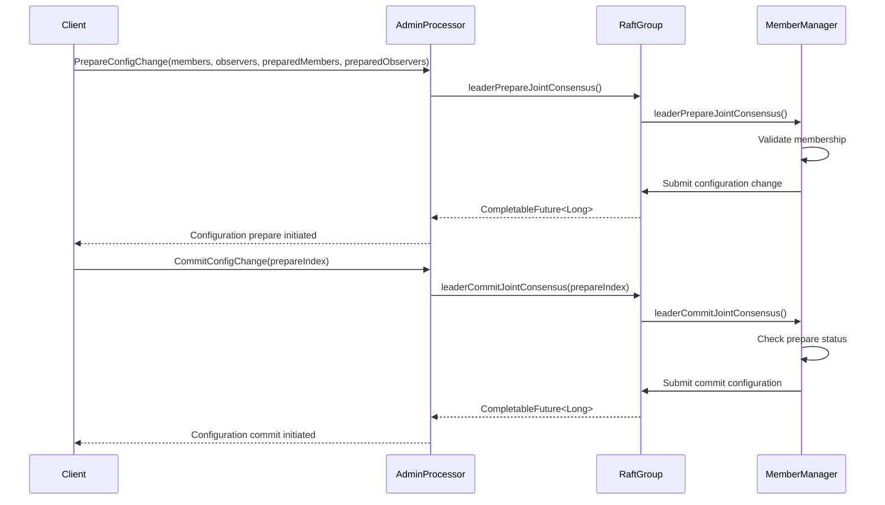
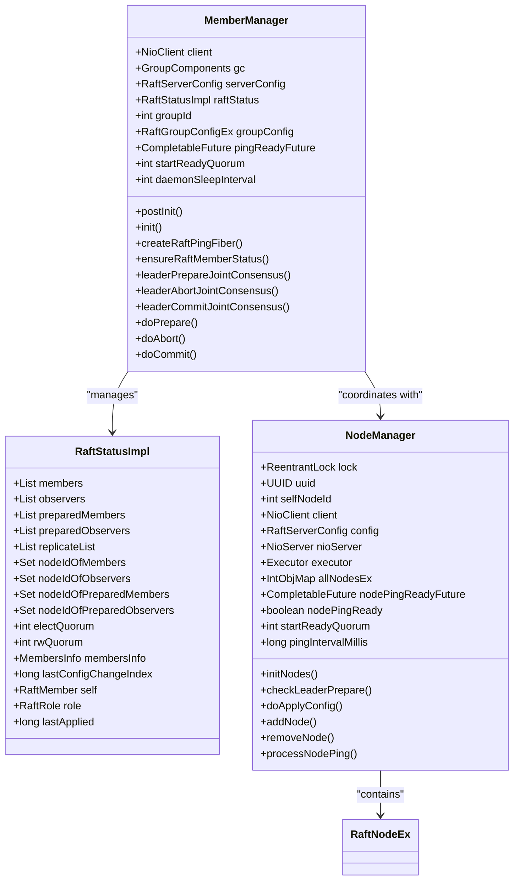
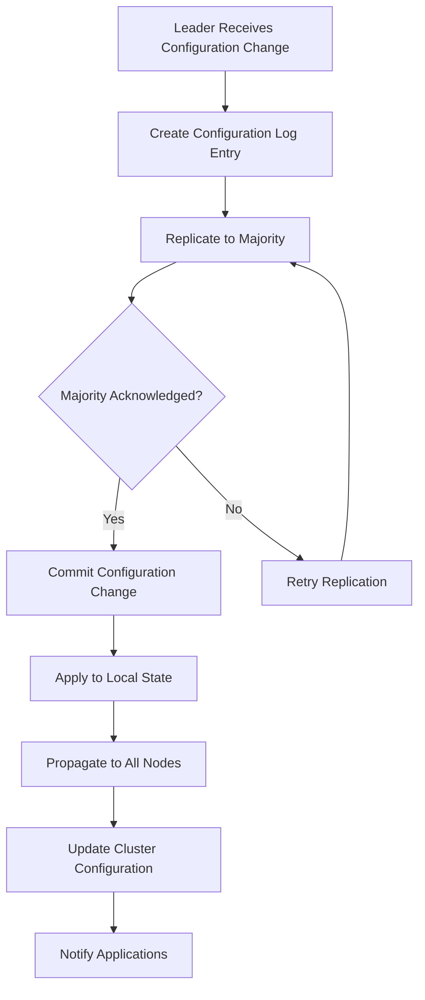
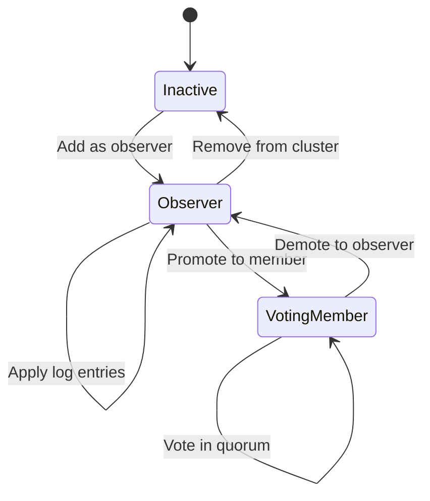
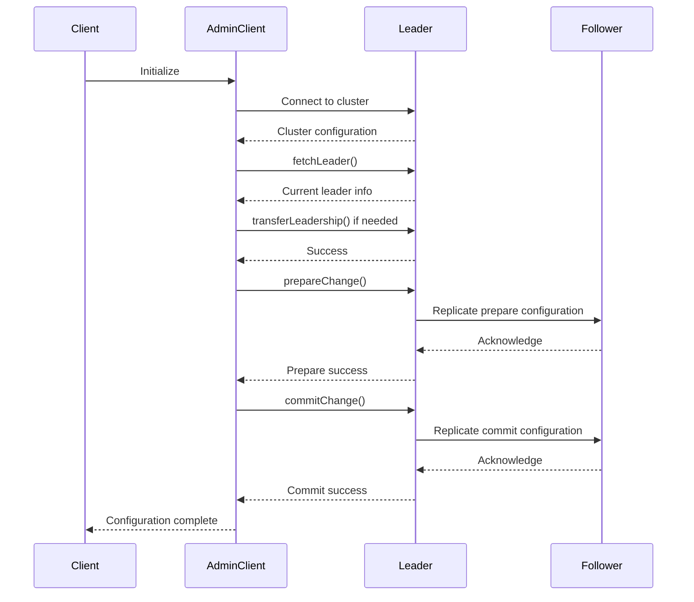
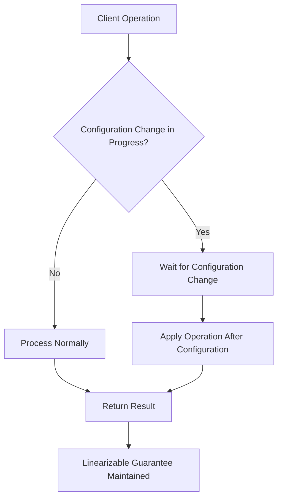
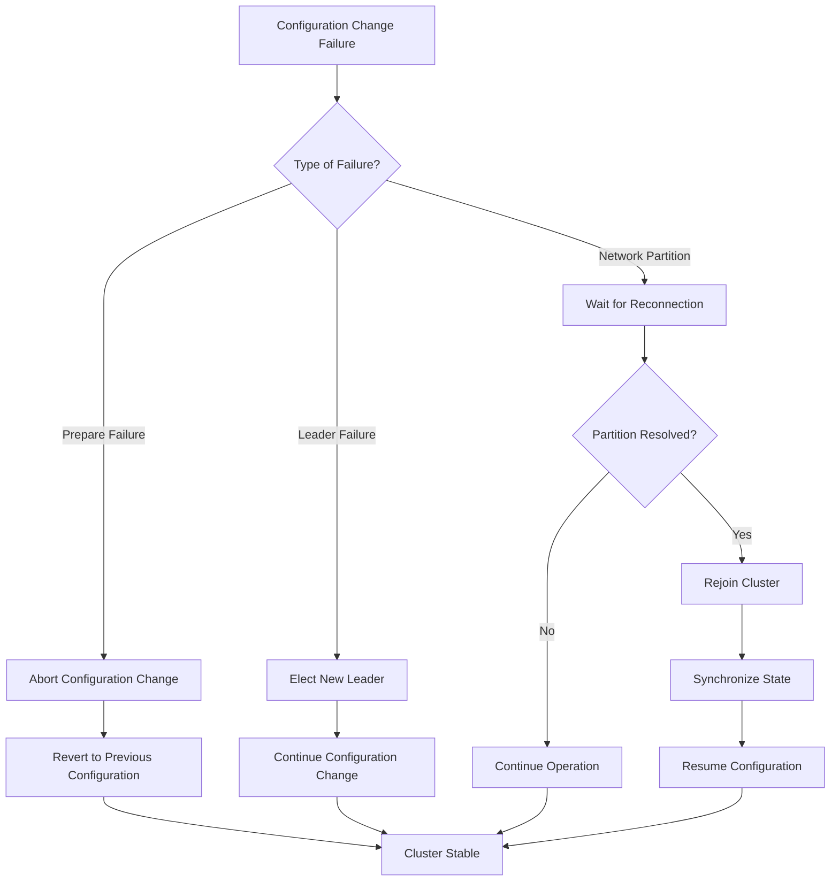

# Dynamic Membership Changes

<cite>
**Referenced Files in This Document**   
- [MemberManager.java](file://server/src/main/java/com/github/dtprj/dongting/raft/impl/MemberManager.java)
- [AdminRaftClient.java](file://server/src/main/java/com/github/dtprj/dongting/raft/admin/AdminRaftClient.java)
- [AdminConfigChangeProcessor.java](file://server/src/main/java/com/github/dtprj/dongting/raft/rpc/AdminConfigChangeProcessor.java)
- [AdminPrepareConfigChangeReq.java](file://server/src/main/java/com/github/dtprj/dongting/raft/rpc/AdminPrepareConfigChangeReq.java)
- [AdminCommitOrAbortReq.java](file://server/src/main/java/com/github/dtprj/dongting/raft/rpc/AdminCommitOrAbortReq.java)
- [NodeManager.java](file://server/src/main/java/com/github/dtprj/dongting/raft/impl/NodeManager.java)
- [RaftGroup.java](file://server/src/main/java/com/github/dtprj/dongting/raft/server/RaftGroup.java)
- [ChangeTo123Client.java](file://demos/src/main/java/com/github/dtprj/dongting/demos/configchange/ChangeTo123Client.java)
</cite>

## Table of Contents
1. [Introduction](#introduction)
2. [Joint Consensus Algorithm](#joint-consensus-algorithm)
3. [ADMIN API Endpoints](#admin-api-endpoints)
4. [MemberManager Coordination](#membermanager-coordination)
5. [Configuration Change Propagation](#configuration-change-propagation)
6. [Observer Pattern for New Nodes](#observer-pattern-for-new-nodes)
7. [Programmatic Membership Changes](#programmatic-membership-changes)
8. [Consistency Guarantees](#consistency-guarantees)
9. [Failure Recovery](#failure-recovery)
10. [Conclusion](#conclusion)

## Introduction
Dongting's RAFT implementation provides a robust mechanism for dynamic membership changes through the joint consensus algorithm. This document details the three-phase process of prepare, commit, and abort for safe configuration changes, ensuring cluster stability during reconfiguration. The system allows for adding and removing nodes and groups through ADMIN API endpoints while maintaining consistency guarantees. The MemberManager component coordinates membership changes across the cluster, and configuration changes are propagated through RAFT log entries rather than external tools. This approach ensures that all nodes in the cluster maintain a consistent view of the membership configuration.

## Joint Consensus Algorithm
The joint consensus algorithm in Dongting's RAFT implementation follows a three-phase process to ensure safe configuration changes. The prepare phase begins when the leader receives a configuration change request and validates the current membership against the expected state. During this phase, the leader creates a joint configuration that includes both the old and new members, allowing the cluster to operate with two configurations simultaneously. This ensures that a majority can be formed from either the old or new configuration, preventing split-brain scenarios.

The commit phase occurs after the prepare configuration has been replicated to a majority of the joint configuration. The leader then initiates the commit phase by proposing a configuration that contains only the new members. Once this change is committed, the cluster operates under the new configuration exclusively. The abort phase provides a safety mechanism that allows the leader to cancel a pending configuration change if issues arise during the prepare phase. This three-phase approach ensures that at no point during the reconfiguration process can two leaders be elected for the same term, maintaining the safety properties of the RAFT consensus algorithm.

**Diagram sources**
- [MemberManager.java](file://server/src/main/java/com/github/dtprj/dongting/raft/impl/MemberManager.java#L339-L385)
- [AdminConfigChangeProcessor.java](file://server/src/main/java/com/github/dtprj/dongting/raft/rpc/AdminConfigChangeProcessor.java#L76-L87)

**Section sources**
- [MemberManager.java](file://server/src/main/java/com/github/dtprj/dongting/raft/impl/MemberManager.java#L339-L607)
- [AdminConfigChangeProcessor.java](file://server/src/main/java/com/github/dtprj/dongting/raft/rpc/AdminConfigChangeProcessor.java#L76-L87)

## ADMIN API Endpoints
Dongting provides ADMIN API endpoints for managing cluster membership that are designed to be idempotent and handle various error conditions gracefully. The primary endpoints include `RAFT_ADMIN_PREPARE_CHANGE`, `RAFT_ADMIN_COMMIT_CHANGE`, and `RAFT_ADMIN_ABORT_CHANGE`, which correspond to the three phases of the joint consensus algorithm. These endpoints are implemented in the `AdminConfigChangeProcessor` class and handle the processing of configuration change requests.

The `AdminPrepareConfigChangeReq` endpoint accepts parameters for the current members, observers, and the proposed new members and observers. It validates that the current membership matches the expected state before proceeding with the configuration change. The `AdminCommitOrAbortReq` endpoint requires the prepare index to ensure that the correct configuration change is being committed or aborted. Error handling is comprehensive, with specific exceptions for cases such as not being the leader, invalid node IDs, or mismatched configurations. The API returns appropriate error codes and messages to help clients understand the reason for failure and take corrective action.

**Diagram sources**
- [AdminConfigChangeProcessor.java](file://server/src/main/java/com/github/dtprj/dongting/raft/rpc/AdminConfigChangeProcessor.java#L76-L98)
- [AdminPrepareConfigChangeReq.java](file://server/src/main/java/com/github/dtprj/dongting/raft/rpc/AdminPrepareConfigChangeReq.java#L31-L112)
- [AdminCommitOrAbortReq.java](file://server/src/main/java/com/github/dtprj/dongting/raft/rpc/AdminCommitOrAbortReq.java#L27-L67)

**Section sources**
- [AdminConfigChangeProcessor.java](file://server/src/main/java/com/github/dtprj/dongting/raft/rpc/AdminConfigChangeProcessor.java#L76-L98)
- [AdminPrepareConfigChangeReq.java](file://server/src/main/java/com/github/dtprj/dongting/raft/rpc/AdminPrepareConfigChangeReq.java#L31-L112)
- [AdminCommitOrAbortReq.java](file://server/src/main/java/com/github/dtprj/dongting/raft/rpc/AdminCommitOrAbortReq.java#L27-L67)

## MemberManager Coordination
The MemberManager component plays a crucial role in coordinating membership changes across the cluster. It maintains the current state of membership through the `RaftStatusImpl` object, which contains lists of current members, observers, and prepared members. The MemberManager is responsible for validating membership changes, ensuring that all nodes referenced in a configuration change exist in the cluster's node registry.

During a configuration change, the MemberManager performs several critical functions. It validates that the current membership matches the expected state before allowing a prepare operation to proceed. It also manages the transition between different membership configurations, updating the cluster's quorum calculations and leadership eligibility based on the new configuration. The MemberManager coordinates with the NodeManager to ensure that new nodes are properly registered and that removed nodes are cleaned up from the cluster's state.

**Diagram sources**
- [MemberManager.java](file://server/src/main/java/com/github/dtprj/dongting/raft/impl/MemberManager.java#L63-L800)
- [NodeManager.java](file://server/src/main/java/com/github/dtprj/dongting/raft/impl/NodeManager.java#L55-L453)
- [RaftStatusImpl.java](file://server/src/main/java/com/github/dtprj/dongting/raft/impl/RaftStatusImpl.java)

**Section sources**
- [MemberManager.java](file://server/src/main/java/com/github/dtprj/dongting/raft/impl/MemberManager.java#L63-L800)
- [NodeManager.java](file://server/src/main/java/com/github/dtprj/dongting/raft/impl/NodeManager.java#L55-L453)

## Configuration Change Propagation
Configuration changes in Dongting are propagated through RAFT log entries rather than external tools, ensuring consistency and reliability. When a configuration change is initiated, it is treated as a special type of log entry that contains the new membership configuration. This log entry is replicated to all nodes in the cluster using the standard RAFT replication mechanism, ensuring that all nodes apply the configuration change in the same order.

The propagation process begins with the leader creating a configuration change log entry and replicating it to a majority of the cluster. Once the entry is committed, each node applies the configuration change to its local state. This approach ensures that configuration changes are atomic and consistent across the cluster. The use of RAFT log entries for configuration changes also provides durability, as the changes are persisted to disk along with other log entries.

**Diagram sources**
- [MemberManager.java](file://server/src/main/java/com/github/dtprj/dongting/raft/impl/MemberManager.java#L561-L607)
- [RaftGroup.java](file://server/src/main/java/com/github/dtprj/dongting/raft/server/RaftGroup.java#L89-L101)

**Section sources**
- [MemberManager.java](file://server/src/main/java/com/github/dtprj/dongting/raft/impl/MemberManager.java#L561-L607)
- [RaftGroup.java](file://server/src/main/java/com/github/dtprj/dongting/raft/server/RaftGroup.java#L89-L101)

## Observer Pattern for New Nodes
The observer pattern in Dongting's RAFT implementation allows new nodes to catch up with the cluster's state before becoming voting members. When a new node is added to the cluster, it is initially configured as an observer, which means it receives log entries and updates its state but does not participate in leader elections or quorum calculations. This allows the new node to synchronize with the current state of the cluster without affecting its availability or consistency.

Once the new node has caught up to a sufficient point in the log, it can be promoted to a full voting member through a configuration change. This two-step process ensures that new nodes are fully synchronized before they can influence the cluster's decision-making process. The observer pattern also provides a mechanism for gracefully removing nodes from the cluster by first demoting them to observers before removing them entirely.

**Diagram sources**
- [MemberManager.java](file://server/src/main/java/com/github/dtprj/dongting/raft/impl/MemberManager.java#L842-L853)
- [NodeManager.java](file://server/src/main/java/com/github/dtprj/dongting/raft/impl/NodeManager.java#L303-L317)

**Section sources**
- [MemberManager.java](file://server/src/main/java/com/github/dtprj/dongting/raft/impl/MemberManager.java#L842-L853)
- [NodeManager.java](file://server/src/main/java/com/github/dtprj/dongting/raft/impl/NodeManager.java#L303-L317)

## Programmatic Membership Changes
Programmatic membership changes in Dongting can be performed using the AdminRaftClient, which provides a simple interface for managing cluster configuration. The client allows applications to prepare, commit, and abort configuration changes programmatically. The process typically involves connecting to the cluster, verifying the current leader, and then initiating the configuration change sequence.

The following example demonstrates how to change the cluster membership from nodes [2,3,4] to [1,2,3]:

**Diagram sources**
- [AdminRaftClient.java](file://server/src/main/java/com/github/dtprj/dongting/raft/admin/AdminRaftClient.java)
- [ChangeTo123Client.java](file://demos/src/main/java/com/github/dtprj/dongting/demos/configchange/ChangeTo123Client.java#L30-L72)

**Section sources**
- [ChangeTo123Client.java](file://demos/src/main/java/com/github/dtprj/dongting/demos/configchange/ChangeTo123Client.java#L30-L72)

## Consistency Guarantees
Dongting's RAFT implementation maintains strong consistency guarantees during membership changes through the joint consensus algorithm. The three-phase process ensures that at no point can two leaders be elected for the same term, preventing split-brain scenarios. During the prepare phase, a majority must be formed from either the old or new configuration, ensuring that only one leader can be elected.

The system also maintains linearizability during configuration changes, meaning that all operations appear to occur instantaneously at some point between their invocation and response. This is achieved by ensuring that configuration changes are processed as regular log entries in the RAFT log, maintaining the total order of operations. The use of prepare indices and commit indices ensures that configuration changes are applied in the correct order and that all nodes have a consistent view of the cluster's state.

**Diagram sources**
- [MemberManager.java](file://server/src/main/java/com/github/dtprj/dongting/raft/impl/MemberManager.java#L421-L459)
- [RaftGroup.java](file://server/src/main/java/com/github/dtprj/dongting/raft/server/RaftGroup.java#L89-L101)

**Section sources**
- [MemberManager.java](file://server/src/main/java/com/github/dtprj/dongting/raft/impl/MemberManager.java#L421-L459)
- [RaftGroup.java](file://server/src/main/java/com/github/dtprj/dongting/raft/server/RaftGroup.java#L89-L101)

## Failure Recovery
In the event of a failure during reconfiguration, Dongting's RAFT implementation provides robust recovery procedures. If a prepare operation fails, the configuration change can be safely aborted, reverting the cluster to its previous state. The system maintains the prepare index, which allows for idempotent retries of failed operations. If a leader fails during a configuration change, the new leader will continue the reconfiguration process from where it left off.

The recovery process leverages the durability of RAFT log entries, ensuring that configuration changes are not lost even in the event of node failures. When a node rejoins the cluster, it synchronizes with the current state through log replication, automatically adopting the latest configuration. The system also includes timeout mechanisms to detect and recover from stalled configuration changes, ensuring that the cluster remains available even in the face of network partitions or node failures.

**Diagram sources**
- [MemberManager.java](file://server/src/main/java/com/github/dtprj/dongting/raft/impl/MemberManager.java#L366-L381)
- [AdminConfigChangeProcessor.java](file://server/src/main/java/com/github/dtprj/dongting/raft/rpc/AdminConfigChangeProcessor.java#L84-L87)

**Section sources**
- [MemberManager.java](file://server/src/main/java/com/github/dtprj/dongting/raft/impl/MemberManager.java#L366-L381)
- [AdminConfigChangeProcessor.java](file://server/src/main/java/com/github/dtprj/dongting/raft/rpc/AdminConfigChangeProcessor.java#L84-L87)

## Conclusion
Dongting's implementation of dynamic membership changes through the joint consensus algorithm provides a safe and reliable mechanism for reconfiguring RAFT clusters. The three-phase process of prepare, commit, and abort ensures that configuration changes maintain the consistency and availability guarantees of the RAFT consensus algorithm. The ADMIN API endpoints provide a clean interface for managing membership changes, while the MemberManager component coordinates the process across the cluster. By propagating configuration changes through RAFT log entries rather than external tools, the system ensures that all nodes maintain a consistent view of the cluster's state. The observer pattern allows new nodes to catch up before becoming voting members, and comprehensive failure recovery procedures ensure that the cluster remains available even in the face of failures during reconfiguration.