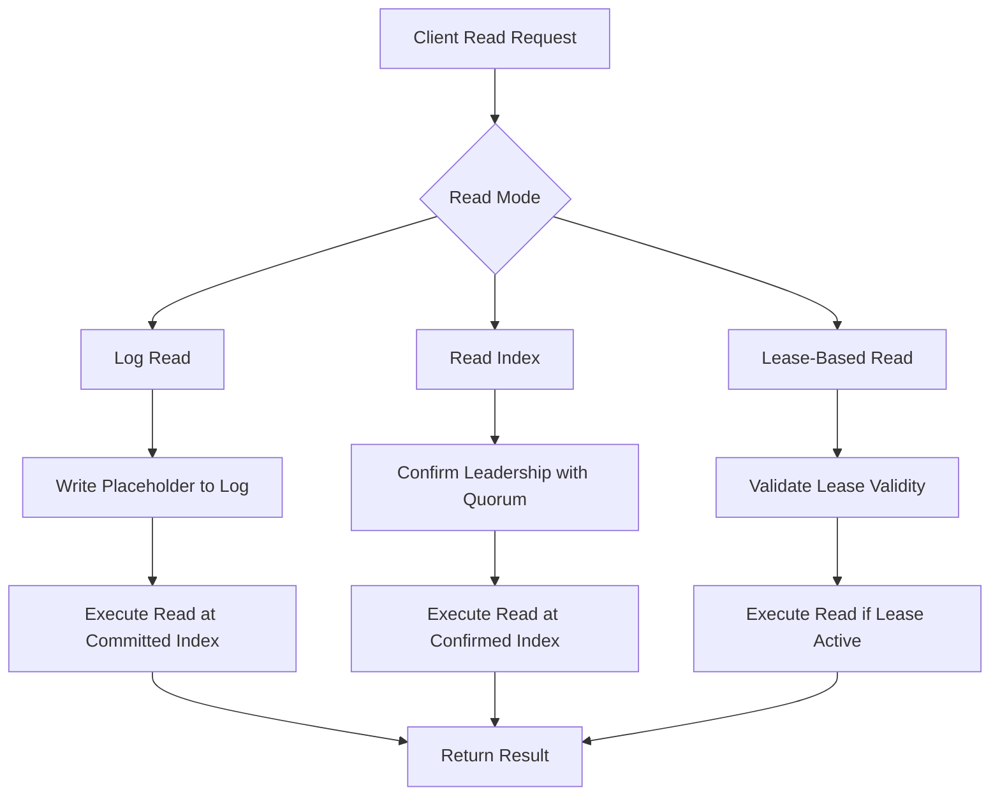
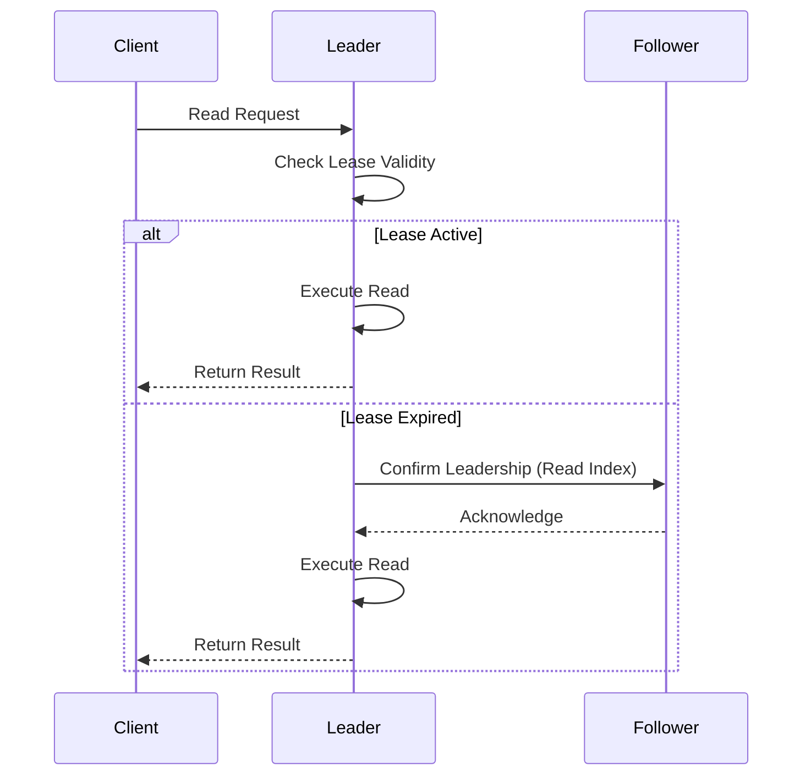
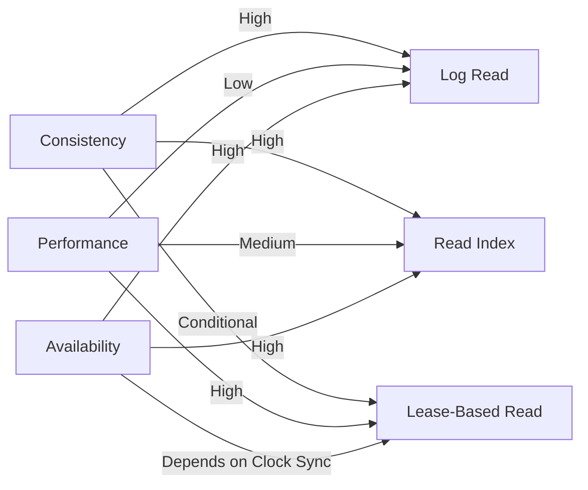

# Linearizable Read Operations

<cite>
**Referenced Files in This Document**   
- [RaftGroup.java](file://server/src/main/java/com/github/dtprj/dongting/raft/server/RaftGroup.java)
- [RaftGroupImpl.java](file://server/src/main/java/com/github/dtprj/dongting/raft/impl/RaftGroupImpl.java)
- [RaftServer.java](file://server/src/main/java/com/github/dtprj/dongting/raft/server/RaftServer.java)
- [KvProcessor.java](file://server/src/main/java/com/github/dtprj/dongting/dtkv/server/KvProcessor.java)
- [ApplyManager.java](file://server/src/main/java/com/github/dtprj/dongting/raft/impl/ApplyManager.java)
- [devlogs/2024_07_26_raft算法的工程实现秘笈.md](file://devlogs/2024_07_26_raft算法的工程实现秘笈.md)
</cite>

## Table of Contents
1. [Introduction](#introduction)
2. [Read Modes Overview](#read-modes-overview)
3. [Log Read](#log-read)
4. [Read Index](#read-index)
5. [Lease-Based Reads](#lease-based-reads)
6. [Lease Mechanism Implementation](#lease-mechanism-implementation)
7. [Wait-Free Read Optimization](#wait-free-read-optimization)
8. [Consistency, Availability, and Performance Trade-offs](#consistency-availability-and-performance-trade-offs)
9. [Time Synchronization and Fallback Strategies](#time-synchronization-and-fallback-strategies)
10. [API Usage Examples](#api-usage-examples)

## Introduction

Dongting's RAFT implementation provides three distinct read modes—log read, read index, and lease-based reads—each offering different trade-offs between consistency, performance, and availability. These mechanisms ensure linearizable read operations while allowing flexibility based on application requirements. The system supports wait-free reads, enabling reads to proceed without waiting for pending writes to commit, thereby improving throughput in read-heavy workloads. This document details the implementation of these read operations, focusing on the lease mechanism that allows leader-only reads without contacting followers, and explains how linearizability is maintained through careful coordination of lease timing across the cluster.

**Section sources**
- [devlogs/2024_07_26_raft算法的工程实现秘笈.md](file://devlogs/2024_07_26_raft算法的工程实现秘笈.md#L183-L241)

## Read Modes Overview

Dongting supports three read modes: log read, read index, and lease-based reads. Each mode provides linearizable consistency but differs in performance characteristics and system assumptions. Log read is the most conservative approach, writing a placeholder entry to the RAFT log before executing the read. Read index avoids writing to the log by confirming leadership with a quorum of followers. Lease-based reads are the most performant, relying on time-based leases to avoid communication with followers entirely. The choice of read mode depends on the application's requirements for consistency, latency, and tolerance to clock skew.

**Diagram sources**
- [RaftGroup.java](file://server/src/main/java/com/github/dtprj/dongting/raft/server/RaftGroup.java#L35-L52)
- [devlogs/2024_07_26_raft算法的工程实现秘笈.md](file://devlogs/2024_07_26_raft算法的工程实现秘笈.md#L232-L241)

## Log Read

Log read is the most straightforward and reliable read mode in Dongting's RAFT implementation. It ensures linearizability by writing a placeholder entry to the RAFT log, which occupies a log index. Once this index is committed, the leader can safely execute the read operation and return the result to the client. This approach guarantees that the read reflects all previous writes up to that point in the log. While log read provides strong consistency guarantees, it incurs the overhead of log replication and commit, making it less performant than other read modes. The implementation does not require special time synchronization and works correctly even in the presence of network partitions.

**Section sources**
- [devlogs/2024_07_26_raft算法的工程实现秘笈.md](file://devlogs/2024_07_26_raft算法的工程实现秘笈.md#L184-L190)

## Read Index

Read index provides a balance between performance and consistency by avoiding the need to write to the RAFT log. Instead of writing a placeholder, the leader first confirms its leadership by exchanging messages with a quorum of followers. Once leadership is confirmed, the leader obtains a read index, which represents the highest log index known to be committed. The read operation can then be executed against the state machine at this index. This approach eliminates the log write overhead of log read while maintaining linearizability. Read index is particularly useful when wait-free reads are disabled, making it equivalent to log read in terms of consistency but with better performance due to the absence of log writes.

**Section sources**
- [devlogs/2024_07_26_raft算法的工程实现秘笈.md](file://devlogs/2024_07_26_raft算法的工程实现秘笈.md#L236-L237)

## Lease-Based Reads

Lease-based reads offer the highest performance among the three read modes by eliminating communication with followers entirely. This approach relies on time-based leases to ensure that the current node remains the valid leader for a specified period. During this lease period, the leader can serve read requests without contacting other cluster members. The lease duration is calculated based on election timeouts and quorum requirements, ensuring that no other node can become leader while the lease is active. Lease-based reads are linearizable as long as the system's time assumptions hold. This mode is ideal for low-latency applications where clock synchronization can be maintained across cluster nodes.

**Section sources**
- [devlogs/2024_07_26_raft算法的工程实现秘笈.md](file://devlogs/2024_07_26_raft算法的工程实现秘笈.md#L238-L241)

## Lease Mechanism Implementation

The lease mechanism in Dongting's RAFT implementation is designed to allow leader-only reads without contacting followers while maintaining linearizability. The lease expiration is calculated based on election timeouts and quorum requirements, ensuring that the leader's lease period exceeds the minimum time required for a new leader election. The system aligns lease start times across followers by using a safe lease deadline that accounts for clock skew and network delays. When a leader receives a read request, it checks whether the current time falls within its valid lease period. If so, the read can proceed immediately; otherwise, the system falls back to read index or log read modes. The lease mechanism is implemented in the `RaftGroupImpl` class, where the `isLeader()` method checks both the role and lease expiration.

**Diagram sources**
- [RaftGroupImpl.java](file://server/src/main/java/com/github/dtprj/dongting/raft/impl/RaftGroupImpl.java#L68-L71)
- [RaftGroup.java](file://server/src/main/java/com/github/dtprj/dongting/raft/server/RaftGroup.java#L52-L53)

## Wait-Free Read Optimization

Dongting implements a wait-free read optimization that allows read operations to proceed without waiting for pending writes to commit. This optimization is particularly valuable in scenarios with high write contention, as it prevents reads from being blocked by ongoing write operations. The system can execute reads concurrently with writes, as long as the leader's role is confirmed through lease or read index mechanisms. This approach may result in reads being processed out of order from the client's perspective, but it maintains linearizability by ensuring that each operation is assigned a point in the linearizable timeline. The wait-free optimization can be disabled when strict ordering between consecutive operations from the same client is required, in which case log read mode should be used.

**Section sources**
- [devlogs/2024_07_26_raft算法的工程实现秘笈.md](file://devlogs/2024_07_26_raft算法的工程实现秘笈.md#L194-L209)

## Consistency, Availability, and Performance Trade-offs

Each read mode in Dongting's RAFT implementation offers different trade-offs between consistency, availability, and performance. Log read provides the strongest consistency guarantees but at the cost of higher latency due to log replication. Read index offers better performance by eliminating log writes while maintaining strong consistency through quorum-based leadership confirmation. Lease-based reads provide the best performance by avoiding follower communication entirely but depend on time synchronization assumptions. Applications with strict consistency requirements should use log read, while those prioritizing low latency can use lease-based reads when clock synchronization is reliable. The system allows applications to choose the appropriate read mode based on their specific requirements, providing flexibility in balancing these competing concerns.

**Diagram sources**
- [devlogs/2024_07_26_raft算法的工程实现秘笈.md](file://devlogs/2024_07_26_raft算法的工程实现秘笈.md#L234-L238)

## Time Synchronization and Fallback Strategies

Lease-based reads depend on the assumption that system clocks are reasonably synchronized across cluster nodes. Dongting's implementation accounts for clock skew by incorporating safety margins into lease calculations. When time synchronization cannot be guaranteed, the system provides fallback strategies to maintain availability and consistency. If a lease check fails, the system automatically falls back to read index mode, which confirms leadership through quorum communication rather than time-based leases. In cases where quorum communication is also unavailable, the system can fall back to log read mode as a last resort. These fallback mechanisms ensure that read operations can complete even when the ideal conditions for lease-based reads are not met, providing robustness in diverse deployment environments.

**Section sources**
- [devlogs/2024_07_26_raft算法的工程实现秘笈.md](file://devlogs/2024_07_26_raft算法的工程实现秘笈.md#L238-L239)

## API Usage Examples

The RaftGroup API provides methods for performing different types of reads. Lease-based reads are initiated through the `leaseRead` method, which takes a timestamp and deadline parameter. The system returns immediately if the lease is valid, or fails with a `NotLeaderException` if the lease has expired. Read index operations are performed implicitly when lease-based reads are not available, and log reads are initiated by submitting a read task through the `submitLinearTask` method. Applications can choose the appropriate read mode based on their consistency and performance requirements. The API is designed to be simple and intuitive, allowing developers to leverage the benefits of each read mode without complex configuration.

**Section sources**
- [RaftGroup.java](file://server/src/main/java/com/github/dtprj/dongting/raft/server/RaftGroup.java#L52-L53)
- [RaftGroupImpl.java](file://server/src/main/java/com/github/dtprj/dongting/raft/impl/RaftGroupImpl.java#L92-L127)
- [KvProcessor.java](file://server/src/main/java/com/github/dtprj/dongting/dtkv/server/KvProcessor.java#L177-L191)