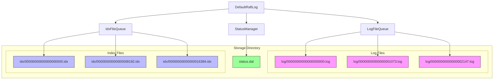
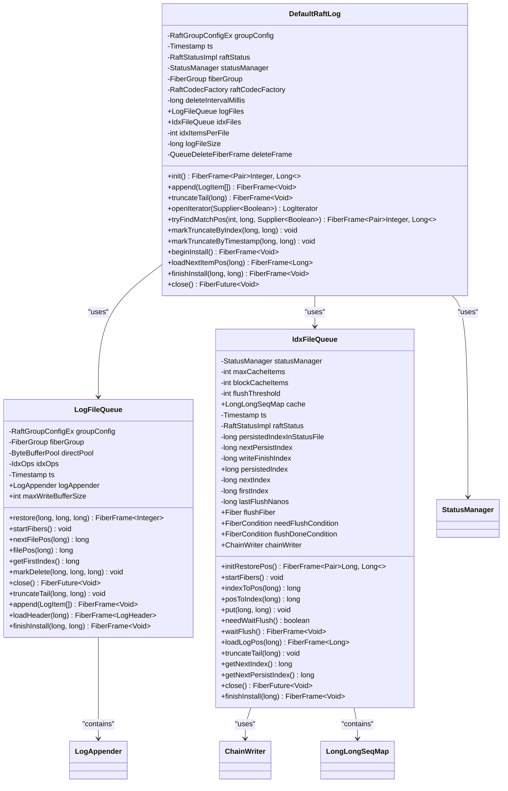
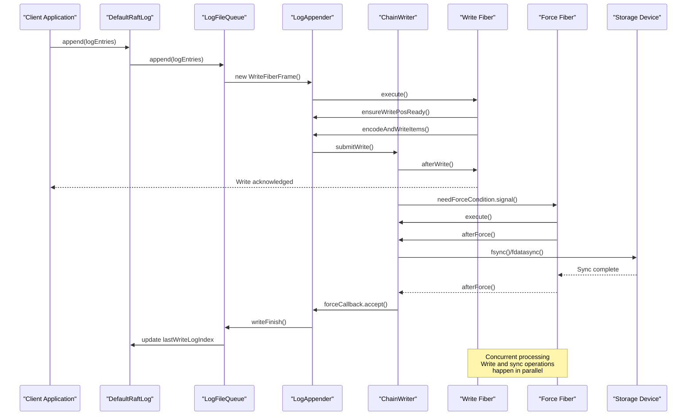
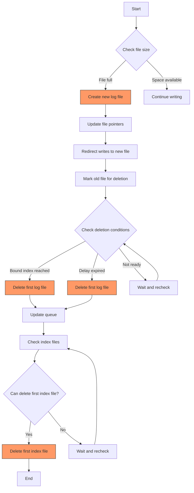
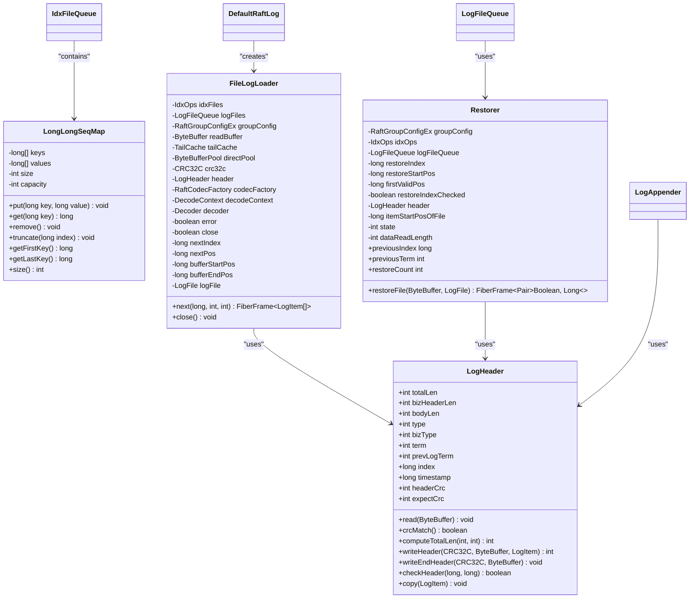
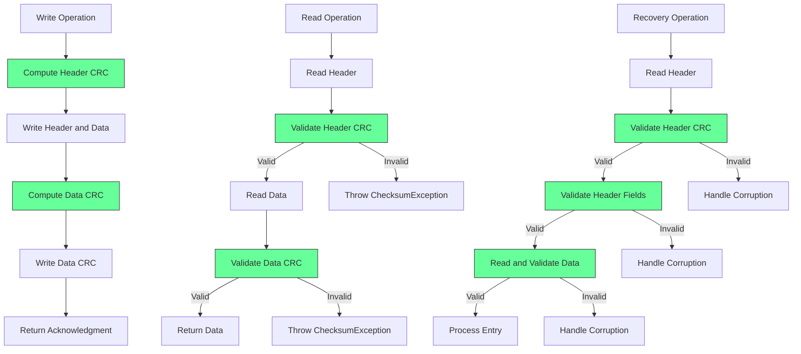
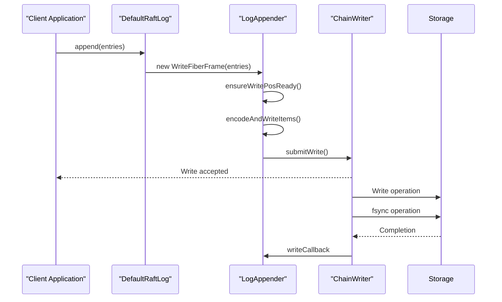
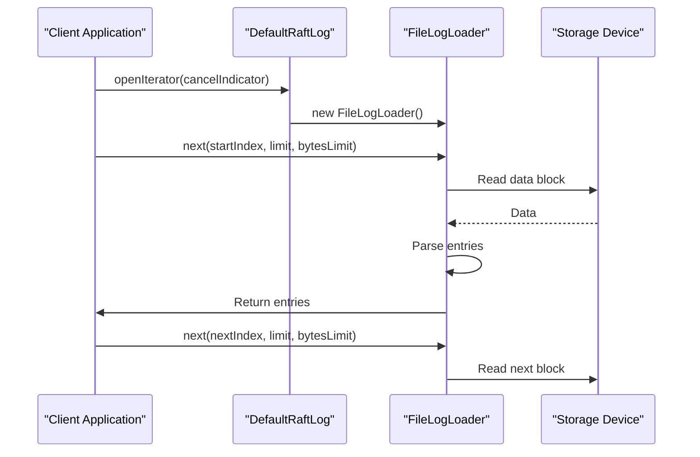

# Log Storage and Persistence

<cite>
**Referenced Files in This Document**   
- [DefaultRaftLog.java](file://server/src/main/java/com/github/dtprj/dongting/raft/store/DefaultRaftLog.java)
- [LogFile.java](file://server/src/main/java/com/github/dtprj/dongting/raft/store/LogFile.java)
- [LogFileQueue.java](file://server/src/main/java/com/github/dtprj/dongting/raft/store/LogFileQueue.java)
- [IdxFileQueue.java](file://server/src/main/java/com/github/dtprj/dongting/raft/store/IdxFileQueue.java)
- [LogAppender.java](file://server/src/main/java/com/github/dtprj/dongting/raft/store/LogAppender.java)
- [ChainWriter.java](file://server/src/main/java/com/github/dtprj/dongting/raft/store/ChainWriter.java)
- [LogHeader.java](file://server/src/main/java/com/github/dtprj/dongting/raft/store/LogHeader.java)
- [FileLogLoader.java](file://server/src/main/java/com/github/dtprj/dongting/raft/store/FileLogLoader.java)
- [Restorer.java](file://server/src/main/java/com/github/dtprj/dongting/raft/store/Restorer.java)
- [StatusManager.java](file://server/src/main/java/com/github/dtprj/dongting/raft/store/StatusManager.java)
- [StatusFile.java](file://server/src/main/java/com/github/dtprj/dongting/raft/store/StatusFile.java)
- [QueueDeleteFiberFrame.java](file://server/src/main/java/com/github/dtprj/dongting/raft/store/DefaultRaftLog.java#L312-L414)
- [AsyncIoTask.java](file://server/src/main/java/com/github/dtprj/dongting/raft/store/AsyncIoTask.java)
- [ForceFrame.java](file://server/src/main/java/com/github/dtprj/dongting/raft/store/ForceFrame.java)
- [RetryFrame.java](file://server/src/main/java/com/github/dtprj/dongting/raft/store/RetryFrame.java)
- [LongLongSeqMap.java](file://server/src/main/java/com/github/dtprj/dongting/raft/store/LongLongSeqMap.java)
</cite>

## Table of Contents
1. [Introduction](#introduction)
2. [File-Based Persistence Model](#file-based-persistence-model)
3. [DefaultRaftLog Implementation](#defaultraftlog-implementation)
4. [Asynchronous Write Strategy](#asynchronous-write-strategy)
5. [File Rotation and Deletion](#file-rotation-and-deletion)
6. [Data Structures for Efficient Access](#data-structures-for-efficient-access)
7. [Data Integrity and CRC Validation](#data-integrity-and-crc-validation)
8. [Performance Considerations](#performance-considerations)
9. [Configuration Options](#configuration-options)
10. [Initialization and Usage Examples](#initialization-and-usage-examples)
11. [Conclusion](#conclusion)

## Introduction

The Dongting RAFT implementation features a sophisticated log storage layer designed for high-performance, durability, and efficiency in distributed consensus systems. This documentation provides a comprehensive analysis of the storage architecture, focusing on its file-based persistence model, asynchronous write strategy, and data integrity mechanisms.

The storage layer employs a dual-file system with separate log and index files, leveraging pre-allocation and memory-mapped I/O techniques to optimize performance. The design emphasizes throughput maximization through separation of write operations from fsync/fdatasync calls, enabling concurrent processing while maintaining data consistency.

This document details the DefaultRaftLog implementation, which serves as the primary interface for log operations including append, truncate, and iteration. It also covers the file rotation and deletion mechanism managed by the QueueDeleteFiberFrame, ensuring storage efficiency while respecting applied index boundaries.

The architecture incorporates advanced data structures for efficient log access and implements comprehensive CRC validation to ensure data integrity. Performance considerations for different storage types and configuration options for tuning the storage layer are also discussed, along with examples from test code showing practical initialization and usage patterns.

**Section sources**
- [DefaultRaftLog.java](file://server/src/main/java/com/github/dtprj/dongting/raft/store/DefaultRaftLog.java#L47-L416)

## File-Based Persistence Model

The Dongting RAFT implementation employs a sophisticated file-based persistence model that separates log data and indexing information into distinct file structures. This architectural decision enables optimized I/O patterns and improved performance characteristics for both write and read operations.

The storage system organizes data into two primary file types: log files and index files, each managed by dedicated queue implementations. Log files, handled by the LogFileQueue class, store the actual log entries with a default size of 1GB per file. Index files, managed by IdxFileQueue, contain position mappings for log entries, with each index entry consuming 8 bytes and defaulting to 1 million entries per file.



**Diagram sources**
- [DefaultRaftLog.java](file://server/src/main/java/com/github/dtprj/dongting/raft/store/DefaultRaftLog.java#L81-L88)
- [LogFileQueue.java](file://server/src/main/java/com/github/dtprj/dongting/raft/store/LogFileQueue.java#L61-L75)
- [IdxFileQueue.java](file://server/src/main/java/com/github/dtprj/dongting/raft/store/IdxFileQueue.java#L79-L103)

The file-based model implements pre-allocation for performance optimization, where files are created with their full size upfront to avoid fragmentation and allocation overhead during write operations. This approach ensures consistent write performance and reduces the likelihood of I/O stalls due to file system operations.

Each log file contains a sequence of log entries prefixed with headers that include metadata such as total length, business header length, body length, type information, term, previous term, index, timestamp, and CRC checksum. The index files maintain mappings from log entry indices to their physical positions in the log files, enabling efficient random access to specific log entries.

The persistence model also incorporates a status file (status.dat) managed by StatusManager, which stores critical metadata including current term, voted-for information, commit index, and installation status. This file is updated asynchronously but persists important state information that survives restarts.

File rotation occurs when a log file reaches its maximum size (1GB by default), at which point a new file is created and subsequent writes are directed to the new file. This rotation mechanism enables efficient file management and facilitates the deletion of obsolete log segments while maintaining continuity in the log sequence.

**Section sources**
- [LogFileQueue.java](file://server/src/main/java/com/github/dtprj/dongting/raft/store/LogFileQueue.java#L45-L46)
- [IdxFileQueue.java](file://server/src/main/java/com/github/dtprj/dongting/raft/store/IdxFileQueue.java#L50-L51)
- [StatusManager.java](file://server/src/main/java/com/github/dtprj/dongting/raft/store/StatusManager.java#L42-L48)

## DefaultRaftLog Implementation

The DefaultRaftLog class serves as the primary implementation of the RAFT log storage interface, providing a comprehensive set of operations for managing the log lifecycle. This implementation orchestrates the interaction between log files, index files, and various supporting components to deliver a robust and efficient storage solution.

The DefaultRaftLog constructor initializes with essential dependencies including RaftGroupConfigEx for configuration, StatusManager for persistent state management, RaftCodecFactory for serialization, and an optional delete interval parameter. The class maintains references to LogFileQueue and IdxFileQueue instances, which handle the actual file operations for log data and index information respectively.



**Diagram sources**
- [DefaultRaftLog.java](file://server/src/main/java/com/github/dtprj/dongting/raft/store/DefaultRaftLog.java#L47-L416)
- [LogFileQueue.java](file://server/src/main/java/com/github/dtprj/dongting/raft/store/LogFileQueue.java#L42-L293)
- [IdxFileQueue.java](file://server/src/main/java/com/github/dtprj/dongting/raft/store/IdxFileQueue.java#L44-L475)

The append operation is implemented by delegating to the LogFileQueue's append method, which in turn utilizes the LogAppender component to manage the write process. This delegation pattern allows for separation of concerns, with DefaultRaftLog handling high-level coordination while specialized components manage specific aspects of the storage process.

Truncation operations are carefully orchestrated to maintain consistency between the log and index files. The truncateTail method first loads the position of the target index from the index file, then coordinates truncation of both the index and log files. Special handling is included for cases where the truncation point aligns with file boundaries.

Log iteration is provided through the openIterator method, which returns a FileLogLoader instance capable of efficiently reading log entries in sequence. This iterator supports cancellation through a supplier function, allowing for graceful termination of long-running read operations.

The implementation also provides methods for finding matching positions in the log (tryFindMatchPos), marking log segments for truncation (markTruncateByIndex and markTruncateByTimestamp), and handling installation of snapshots (beginInstall and finishInstall). These methods work in concert with the underlying file queues and status management components to ensure consistent state across the storage layer.

**Section sources**
- [DefaultRaftLog.java](file://server/src/main/java/com/github/dtprj/dongting/raft/store/DefaultRaftLog.java#L166-L250)

## Asynchronous Write Strategy

The Dongting RAFT implementation employs a sophisticated asynchronous write strategy that separates write operations from fsync/fdatasync calls to maximize throughput and optimize I/O performance. This approach leverages concurrent processing and careful coordination between multiple components to achieve high-performance log persistence.

The core of this strategy is implemented in the ChainWriter class, which manages a pipeline of write and force (fsync) operations. Write operations are submitted to the ChainWriter, which queues them and processes them asynchronously. The ChainWriter maintains separate queues for write tasks and force tasks, allowing it to batch multiple writes before issuing fsync operations.



**Diagram sources**
- [ChainWriter.java](file://server/src/main/java/com/github/dtprj/dongting/raft/store/ChainWriter.java#L41-L285)
- [LogAppender.java](file://server/src/main/java/com/github/dtprj/dongting/raft/store/LogAppender.java#L44-L318)
- [LogFileQueue.java](file://server/src/main/java/com/github/dtprj/dongting/raft/store/LogFileQueue.java#L70-L75)

The write process begins when a client application calls the append method on DefaultRaftLog. This call is delegated to LogFileQueue, which creates a WriteFiberFrame in LogAppender. The WriteFiberFrame executes in a fiber (lightweight thread), encoding the log entries and preparing them for writing.

During the encoding phase, the LogAppender checks if the index file requires flushing by calling idxOps.needWaitFlush(). If the index cache exceeds its threshold, the write operation waits for the index flush to complete before proceeding. This ensures that index updates are persisted before corresponding log data, maintaining consistency.

Once encoding is complete, the LogAppender submits the write task to ChainWriter via submitWrite. The ChainWriter adds the task to its write queue and immediately acknowledges the write operation to the client application. This early acknowledgment is possible because the data is already in the operating system's page cache, providing durability in most failure scenarios.

The actual fsync/fdatasync operations are handled by a dedicated ForceFiber that runs concurrently with the write operations. When write tasks complete successfully, they are moved to the force queue, and the ForceFiber is signaled to process them. The ForceFiber batches multiple force operations when possible, reducing the number of expensive fsync calls.

Performance metrics are collected throughout this process using the PerfCallback mechanism, with different performance types for write operations (RAFT_D_LOG_WRITE1, RAFT_D_LOG_WRITE2) and sync operations (RAFT_D_LOG_SYNC). These metrics enable monitoring and tuning of the storage layer's performance characteristics.

The asynchronous strategy also includes error handling and recovery mechanisms. If a write or force operation fails, the ChainWriter marks itself in an error state and initiates shutdown of the fiber group. Retry mechanisms are implemented through RetryFrame, allowing for recovery from transient I/O errors.

**Section sources**
- [ChainWriter.java](file://server/src/main/java/com/github/dtprj/dongting/raft/store/ChainWriter.java#L41-L285)
- [LogAppender.java](file://server/src/main/java/com/github/dtprj/dongting/raft/store/LogAppender.java#L44-L318)

## File Rotation and Deletion

The Dongting RAFT implementation incorporates a sophisticated file rotation and deletion mechanism managed by the QueueDeleteFiberFrame, ensuring storage efficiency while respecting applied index boundaries. This system balances the need for persistent log data with the requirement to manage disk space usage effectively.

File rotation occurs automatically when a log file reaches its maximum size, which defaults to 1GB. The LogFileQueue handles this process by creating new files as needed and directing subsequent writes to the appropriate file based on the current write position. The rotation mechanism ensures that log entries are always written to files of consistent size, simplifying file management and improving I/O performance.



**Diagram sources**
- [LogFileQueue.java](file://server/src/main/java/com/github/dtprj/dongting/raft/store/LogFileQueue.java#L190-L212)
- [DefaultRaftLog.java](file://server/src/main/java/com/github/dtprj/dongting/raft/store/DefaultRaftLog.java#L312-L414)

The deletion process is managed by the QueueDeleteFiberFrame, a dedicated fiber that runs periodically to check for files that can be safely deleted. This fiber operates as a daemon, ensuring that file cleanup occurs without blocking critical RAFT operations. The deletion interval is configurable, with a default of 10 seconds.

Before deleting a log file, the system verifies several conditions to ensure data safety:
1. The file is not the last remaining file in the queue
2. The first index of the next file is greater than zero
3. The applied index and last force log index are greater than or equal to the first index of the next file
4. The file is not currently in use

These checks ensure that no data required for consensus operations will be deleted prematurely. The applied index boundary is particularly important, as it represents the highest log entry known to be committed by a majority of the cluster.

For index files, similar but slightly different criteria are used. An index file can be deleted if:
1. It is not the last remaining file
2. The first index of the next file is greater than the first index of the current log files
3. The persisted index is greater than or equal to the first index of the next file
4. The file is not in use

The deletion process is implemented as a recursive fiber operation, allowing for efficient processing of multiple files without blocking. When a file is marked for deletion, it is first flagged with a delete timestamp, and the actual deletion occurs when all conditions are met.

Special handling is provided for the snapshot installation process. When beginInstall is called, the system requests deletion of all files and waits for the deletion fiber to complete before proceeding. This ensures a clean state when installing a new snapshot.

The markTruncateByIndex and markTruncateByTimestamp methods provide additional control over the deletion process, allowing the system to mark log segments for truncation based on index boundaries or timestamp thresholds. These methods respect the applied index boundary, ensuring that only obsolete data is marked for deletion.

**Section sources**
- [DefaultRaftLog.java](file://server/src/main/java/com/github/dtprj/dongting/raft/store/DefaultRaftLog.java#L209-L223)
- [LogFileQueue.java](file://server/src/main/java/com/github/dtprj/dongting/raft/store/LogFileQueue.java#L189-L212)

## Data Structures for Efficient Access

The Dongting RAFT implementation employs several specialized data structures to enable efficient log access and management. These structures are designed to optimize both memory usage and access patterns, supporting the high-performance requirements of a distributed consensus system.

At the core of the indexing system is the LongLongSeqMap, a custom data structure that maps log entry indices to their physical positions in the log files. This structure provides O(1) average-case lookup performance while maintaining memory efficiency through careful allocation strategies. The map is used by IdxFileQueue to cache recently accessed index entries, reducing the need for disk I/O during frequent access patterns.



**Diagram sources**
- [LongLongSeqMap.java](file://server/src/main/java/com/github/dtprj/dongting/raft/store/LongLongSeqMap.java)
- [FileLogLoader.java](file://server/src/main/java/com/github/dtprj/dongting/raft/store/FileLogLoader.java#L51-L418)
- [Restorer.java](file://server/src/main/java/com/github/dtprj/dongting/raft/store/Restorer.java#L34-L327)
- [LogHeader.java](file://server/src/main/java/com/github/dtprj/dongting/raft/store/LogHeader.java#L27-L150)

The FileLogLoader class implements an efficient iterator for reading log entries sequentially. It uses a read-ahead buffer to minimize disk I/O operations, reading data in chunks and parsing entries from the buffer. The loader maintains state across multiple read operations, allowing it to efficiently continue from where it left off. This design reduces the overhead of repeated file positioning operations.

For log entry headers, the LogHeader class provides a compact representation that includes all necessary metadata while minimizing memory footprint. The header structure is carefully designed to enable efficient parsing and validation, with fields arranged to support quick access to the most frequently used information.

The Restorer class uses a state machine approach to efficiently reconstruct the log state during recovery operations. It maintains minimal state between read operations, allowing it to process large volumes of data with low memory overhead. The restorer validates each log entry as it is read, ensuring data integrity while restoring the log to a consistent state.

Index access is optimized through the use of power-of-two sizing for index files, which enables efficient bit operations for calculating file positions. The indexToPos and posToIndex methods in IdxFileQueue use bit shifting instead of division, providing a significant performance improvement for these frequently called operations.

The system also employs object pooling through ByteBufferPool to reduce garbage collection overhead. Direct byte buffers are reused across operations, minimizing memory allocation and deallocation costs. This is particularly important for the high-throughput write operations characteristic of RAFT consensus.

These data structures work together to provide efficient access to log data while maintaining the consistency and durability guarantees required by the RAFT algorithm. The design emphasizes minimizing I/O operations, reducing memory allocation, and optimizing CPU usage to deliver high-performance log storage.

**Section sources**
- [LongLongSeqMap.java](file://server/src/main/java/com/github/dtprj/dongting/raft/store/LongLongSeqMap.java)
- [FileLogLoader.java](file://server/src/main/java/com/github/dtprj/dongting/raft/store/FileLogLoader.java#L51-L418)

## Data Integrity and CRC Validation

The Dongting RAFT implementation incorporates comprehensive data integrity mechanisms centered around CRC (Cyclic Redundancy Check) validation to ensure the reliability and correctness of stored log data. This multi-layered approach to data integrity protects against corruption during both write and read operations.

At the core of the integrity system is the LogHeader class, which includes a 32-bit CRC checksum for each log entry header. The CRC32C algorithm is used for its excellent error-detection properties and hardware acceleration support on modern processors. Each log header is validated against its CRC checksum upon reading, ensuring that metadata such as index, term, and length information has not been corrupted.



**Diagram sources**
- [LogHeader.java](file://server/src/main/java/com/github/dtprj/dongting/raft/store/LogHeader.java#L27-L150)
- [FileLogLoader.java](file://server/src/main/java/com/github/dtprj/dongting/raft/store/FileLogLoader.java#L288-L290)
- [Restorer.java](file://server/src/main/java/com/github/dtprj/dongting/raft/store/Restorer.java#L257-L258)

The CRC validation process is implemented at multiple levels within the storage layer. For log entry headers, the CRC covers all fields except the CRC field itself, following standard practice. The CRC is computed using the RaftUtil.updateCrc method, which efficiently updates the CRC32C checksum as bytes are processed.

Data integrity extends beyond headers to include the business header and body content of each log entry. When writing data, a separate CRC is computed for both the business header (if present) and the body content. These CRC values are written after their respective data segments, allowing for validation during read operations.

During read operations, the FileLogLoader performs comprehensive validation of each log entry. First, it validates the header CRC, throwing a ChecksumException if the validation fails. Then, as it reads the business header and body data, it computes the CRC in parallel and validates it against the stored CRC value. This end-to-end validation ensures that data has not been corrupted in storage.

The Restorer class, responsible for log recovery during startup, implements additional integrity checks beyond CRC validation. It verifies logical consistency between consecutive log entries, checking that the index sequence is correct and that terms follow the RAFT rules (e.g., a higher term can follow a lower term, but not vice versa). This multi-layered validation approach catches both random bit errors and more systematic corruption patterns.

The system also includes protection against partial writes. Each log file ends with a special end-of-file marker (END_LEN_MAGIC) that includes its own CRC. This marker allows the system to detect whether the last write operation completed successfully or was interrupted, preventing the use of partially written entries.

Error handling is carefully designed to maintain system stability while reporting integrity issues. When a CRC validation fails, the system throws a ChecksumException with detailed information about the location and nature of the problem. This allows higher-level components to handle the error appropriately, potentially initiating recovery procedures or alerting administrators to hardware issues.

The integrity system is integrated with the asynchronous write strategy, ensuring that data is validated both when written and when read. This comprehensive approach provides strong guarantees about data correctness while maintaining the high performance required by the RAFT consensus algorithm.

**Section sources**
- [LogHeader.java](file://server/src/main/java/com/github/dtprj/dongting/raft/store/LogHeader.java#L27-L150)
- [FileLogLoader.java](file://server/src/main/java/com/github/dtprj/dongting/raft/store/FileLogLoader.java#L288-L290)

## Performance Considerations

The Dongting RAFT storage layer incorporates several performance optimizations tailored to different storage types and operational patterns. These considerations address the trade-offs between throughput, latency, durability, and resource utilization in distributed consensus systems.

For high-performance storage systems such as NVMe SSDs, the implementation leverages large write buffers (up to 128KB) and aggressive batching to maximize throughput. The ChainWriter component batches multiple write operations before issuing fsync calls, reducing the number of expensive synchronous operations. This approach is particularly effective on fast storage where the bottleneck shifts from I/O latency to CPU overhead.

```mermaid
graph TD
A[Performance Factors] --> B[Storage Type]
A --> C[Write Pattern]
A --> D[Memory Configuration]
A --> E[CPU Architecture]
B --> F[Rotational HDD]
B --> G[SSD]
B --> H[NVMe SSD]
F --> I[Small write buffers]
F --> J[Frequent fsync]
F --> K[Sequential access]
G --> L[Medium write buffers]
G --> M[Batched fsync]
G --> N[Random access]
H --> O[Large write buffers]
H --> P[Aggressive batching]
H --> Q[Parallel I/O]
C --> R[Small, frequent writes]
C --> S[Large, infrequent writes]
R --> T[Higher buffer utilization]
R --> U[More frequent fsync]
S --> V[Lower buffer utilization]
S --> W[Less frequent fsync]
D --> X[Direct memory]
D --> Y[Heap memory]
X --> Z[Reduced GC]
X --> AA[Higher throughput]
Y --> AB[Increased GC]
Y --> AC[Lower throughput]
E --> AD[SSE4.2 support]
E --> AE[No SSE4.2]
AD --> AF[CRC32C hardware acceleration]
AD --> AG[Faster validation]
AE --> AH[Software CRC32C]
AE --> AI[Slower validation]
style O fill:#f96,stroke:#333
style P fill:#f96,stroke:#333
style Q fill:#f96,stroke:#333
style Z fill:#f96,stroke:#333
style AA fill:#f96,stroke:#333
style AF fill:#f96,stroke:#333
style AG fill:#f96,stroke:#333
```



**Diagram sources**
- [LogFileQueue.java](file://server/src/main/java/com/github/dtprj/dongting/raft/store/LogFileQueue.java#L59-L60)
- [ChainWriter.java](file://server/src/main/java/com/github/dtprj/dongting/raft/store/ChainWriter.java#L134-L164)
- [LogAppender.java](file://server/src/main/java/com/github/dtprj/dongting/raft/store/LogAppender.java#L302-L309)

For rotational hard drives, the system adapts by using smaller write buffers and more frequent fsync operations to minimize seek times. The file pre-allocation strategy helps reduce fragmentation, while the sequential write pattern of RAFT logs aligns well with the strengths of HDDs.

Memory configuration significantly impacts performance, particularly through the use of direct byte buffers from ByteBufferPool. These off-heap buffers reduce garbage collection pressure and improve throughput, especially under high load. The system allows configuration of buffer pool sizes to balance memory usage against performance requirements.

CPU architecture affects performance through the CRC32C implementation. On processors with SSE4.2 support, the CRC32C instruction provides hardware acceleration for checksum calculations, significantly improving validation performance. The system automatically detects and utilizes this capability when available.

The implementation includes several configurable parameters that allow tuning for specific performance requirements:
- logFileSize: Controls the size of individual log files (default 1GB)
- maxWriteBufferSize: Limits the size of write buffers (default 128KB)
- idxCacheSize: Configures the size of the index cache
- idxFlushThreshold: Determines when index flushes are triggered
- ioRetryInterval: Sets the retry interval for I/O operations

These parameters can be adjusted based on the specific characteristics of the deployment environment. For example, on systems with abundant memory, increasing the index cache size can reduce disk I/O for index lookups. On systems with fast storage, increasing the write buffer size can improve throughput.

The fiber-based concurrency model provides efficient utilization of CPU resources, allowing thousands of concurrent operations with minimal overhead. This is particularly beneficial for workloads with many small operations, where traditional thread-based concurrency would incur significant context switching costs.

Monitoring and performance analysis are supported through the PerfCallback mechanism, which collects detailed metrics on write operations, sync operations, and index operations. These metrics enable identification of bottlenecks and validation of performance improvements.

**Section sources**
- [LogFileQueue.java](file://server/src/main/java/com/github/dtprj/dongting/raft/store/LogFileQueue.java#L59-L60)
- [ChainWriter.java](file://server/src/main/java/com/github/dtprj/dongting/raft/store/ChainWriter.java#L134-L164)

## Configuration Options

The Dongting RAFT storage layer provides several configuration options that allow fine-tuning of performance, durability, and resource utilization characteristics. These options are exposed through the RaftGroupConfigEx class and can be adjusted to optimize the storage system for specific deployment scenarios and hardware configurations.

The primary configuration parameters include:

<cite>
**Core Configuration Options**
- **logFileSize**: Size of individual log files in bytes (default: 1GB). Larger values reduce file management overhead but increase recovery time.
- **idxItemsPerFile**: Number of index entries per index file (default: 1 million). Must be a power of two for optimal performance.
- **maxWriteBufferSize**: Maximum size of write buffers in bytes (default: 128KB). Larger values improve throughput on fast storage.
- **idxCacheSize**: Size of the index cache in number of entries. Controls memory usage for index lookups.
- **idxFlushThreshold**: Number of unflushed index entries that trigger a flush operation. Lower values increase durability but reduce performance.
- **deleteIntervalMillis**: Interval between file deletion checks in milliseconds (default: 10,000).
- **ioRetryInterval**: Array of retry intervals in milliseconds for I/O operations after failures.
- **blockIoExecutor**: Executor service for blocking I/O operations, allowing separation from the main fiber execution.
- **perfCallback**: Performance monitoring callback for collecting storage layer metrics.
- **fiberGroup**: Fiber execution group that manages the concurrency model for storage operations.
</cite>

These configuration options can be categorized by their primary impact:

**Performance-Oriented Options:**
- logFileSize: Increasing file size reduces the frequency of file rotation and associated metadata operations.
- maxWriteBufferSize: Larger buffers enable more efficient I/O operations on high-speed storage.
- idxCacheSize: A larger cache reduces disk I/O for index lookups at the cost of increased memory usage.

**Durability-Oriented Options:**
- idxFlushThreshold: Lower values ensure index updates are persisted more frequently, improving durability at the cost of performance.
- ioRetryInterval: Configures the retry strategy for transient I/O failures, balancing durability against responsiveness.

**Resource Management Options:**
- blockIoExecutor: Allows separation of blocking I/O operations from the main fiber execution, preventing I/O stalls.
- fiberGroup: Controls the concurrency model and resource allocation for storage operations.

The configuration system supports dynamic adjustment of some parameters at runtime, while others require restart. The design emphasizes sensible defaults that work well for most scenarios, with options available for optimization in specific environments.

For high-performance NVMe storage, recommended settings include:
- Increased logFileSize (2-4GB) to reduce file management overhead
- Larger maxWriteBufferSize (256KB-512KB) to leverage fast I/O
- Higher idxCacheSize to minimize index file access

For systems with limited memory, conservative settings include:
- Reduced idxCacheSize to minimize memory footprint
- Smaller maxWriteBufferSize to reduce memory pressure
- Conservative idxFlushThreshold to ensure timely persistence

The configuration options are designed to work together, with interdependencies managed by the storage layer. For example, the idxItemsPerFile parameter must be a power of two to enable efficient bit operations for file positioning calculations.

**Section sources**
- [LogFileQueue.java](file://server/src/main/java/com/github/dtprj/dongting/raft/store/LogFileQueue.java#L45-L47)
- [IdxFileQueue.java](file://server/src/main/java/com/github/dtprj/dongting/raft/store/IdxFileQueue.java#L89-L91)
- [ChainWriter.java](file://server/src/main/java/com/github/dtprj/dongting/raft/store/ChainWriter.java#L68-L81)

## Initialization and Usage Examples

The Dongting RAFT storage layer can be initialized and used through a well-defined API that supports both standalone operation and integration with larger RAFT group configurations. The following examples demonstrate common initialization patterns and usage scenarios based on the test code and implementation.

Basic initialization of the DefaultRaftLog component involves creating the necessary dependencies and configuring the storage parameters:

```mermaid
flowchart TD
A[Create RaftGroupConfigEx] --> B[Configure data directory]
B --> C[Set fiber group]
C --> D[Configure performance callback]
D --> E[Create StatusManager]
E --> F[Create RaftCodecFactory]
F --> G[Instantiate DefaultRaftLog]
G --> H[Call init() method]
H --> I[Wait for initialization completion]
I --> J[Storage ready for use]
style G fill:#6f9,stroke:#333
style H fill:#6f9,stroke:#333
style I fill:#6f9,stroke:#333
```

**Diagram sources**
- [DefaultRaftLog.java](file://server/src/main/java/com/github/dtprj/dongting/raft/store/DefaultRaftLog.java#L66-L80)
- [DefaultRaftLog.java](file://server/src/main/java/com/github/dtprj/dongting/raft/store/DefaultRaftLog.java#L91-L148)

For appending log entries, the process is straightforward and asynchronous:



**Diagram sources**
- [DefaultRaftLog.java](file://server/src/main/java/com/github/dtprj/dongting/raft/store/DefaultRaftLog.java#L166-L168)
- [LogAppender.java](file://server/src/main/java/com/github/dtprj/dongting/raft/store/LogAppender.java#L85-L318)

For reading log entries, the FileLogLoader provides an iterator interface:



**Diagram sources**
- [DefaultRaftLog.java](file://server/src/main/java/com/github/dtprj/dongting/raft/store/DefaultRaftLog.java#L197-L199)
- [FileLogLoader.java](file://server/src/main/java/com/github/dtprj/dongting/raft/store/FileLogLoader.java#L116-L125)

The storage layer also supports snapshot operations for state machine recovery:

```mermaid
flowchart TD
A[Begin Snapshot] --> B[Call beginInstall()]
B --> C[Close log and index files]
C --> D[Request file deletion]
D --> E[Wait for deletion completion]
E --> F[Create new files]
F --> G[Call finishInstall()]
G --> H[Update first valid position]
H --> I[Storage ready for new entries]
style B fill:#f96,stroke:#333
style G fill:#f96,stroke:#333
style H fill:#f96,stroke:#333
```

**Diagram sources**
- [DefaultRaftLog.java](file://server/src/main/java/com/github/dtprj/dongting/raft/store/DefaultRaftLog.java#L226-L249)
- [DefaultRaftLog.java](file://server/src/main/java/com/github/dtprj/dongting/raft/store/DefaultRaftLog.java#L281-L302)

These examples illustrate the typical usage patterns for the storage layer, demonstrating how the various components work together to provide a robust and efficient persistence mechanism for RAFT consensus.

**Section sources**
- [DefaultRaftLog.java](file://server/src/main/java/com/github/dtprj/dongting/raft/store/DefaultRaftLog.java#L91-L148)
- [DefaultRaftLog.java](file://server/src/main/java/com/github/dtprj/dongting/raft/store/DefaultRaftLog.java#L166-L168)
- [DefaultRaftLog.java](file://server/src/main/java/com/github/dtprj/dongting/raft/store/DefaultRaftLog.java#L197-L199)

## Conclusion

The Dongting RAFT implementation's log storage layer represents a sophisticated and high-performance solution for distributed consensus systems. Through its dual-file persistence model with separate log and index files, the system achieves optimal I/O patterns while maintaining data integrity and consistency.

The DefaultRaftLog implementation serves as a robust coordinator for storage operations, integrating log files, index files, and status management into a cohesive system. Its append, truncate, and iteration capabilities provide the essential functionality required by the RAFT consensus algorithm, with careful attention to edge cases and error handling.

The asynchronous write strategy, centered around the ChainWriter component, effectively separates write operations from fsync/fdatasync calls, maximizing throughput while ensuring durability. This concurrent processing model leverages the fiber-based concurrency system to handle high volumes of operations with minimal overhead.

The file rotation and deletion mechanism, managed by the QueueDeleteFiberFrame, ensures storage efficiency while respecting the applied index boundaries that are critical for RAFT correctness. This automated cleanup process maintains system performance over time without compromising data safety.

Advanced data structures like LongLongSeqMap and efficient access patterns in FileLogLoader enable rapid log entry retrieval, while comprehensive CRC validation throughout the system guarantees data integrity. These mechanisms work together to protect against both random bit errors and systematic corruption.

Performance considerations are addressed through configurable parameters that allow tuning for different storage types and workloads. The system adapts to various hardware configurations, from rotational hard drives to NVMe SSDs, providing optimal performance across deployment scenarios.

The initialization and usage patterns demonstrated in the test code show a clean and intuitive API that simplifies integration with larger RAFT group configurations. The storage layer's design emphasizes reliability, performance, and maintainability, making it a solid foundation for distributed consensus applications.

Overall, the Dongting RAFT storage layer exemplifies careful engineering that balances theoretical correctness with practical performance requirements, delivering a robust solution for modern distributed systems.

[No sources needed since this section summarizes without analyzing specific files]