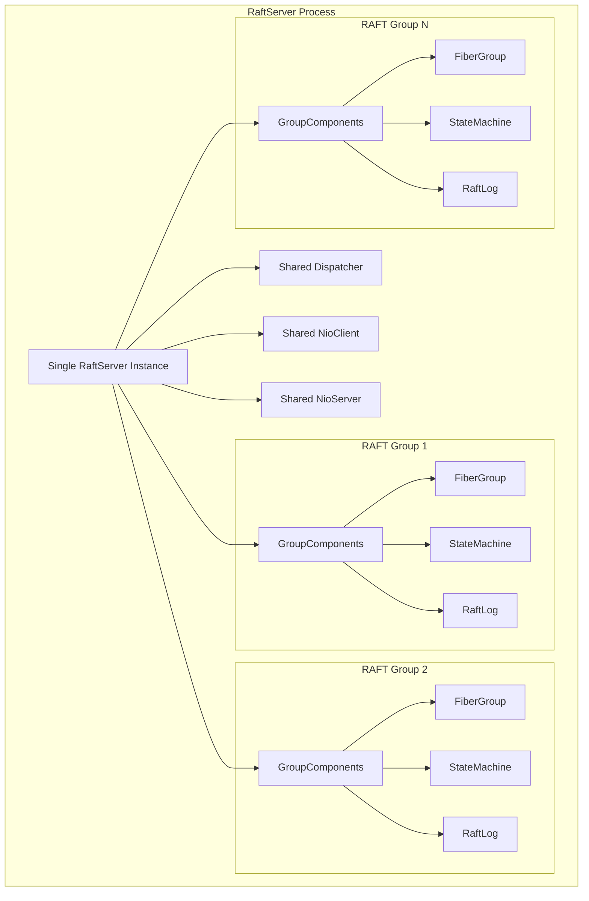
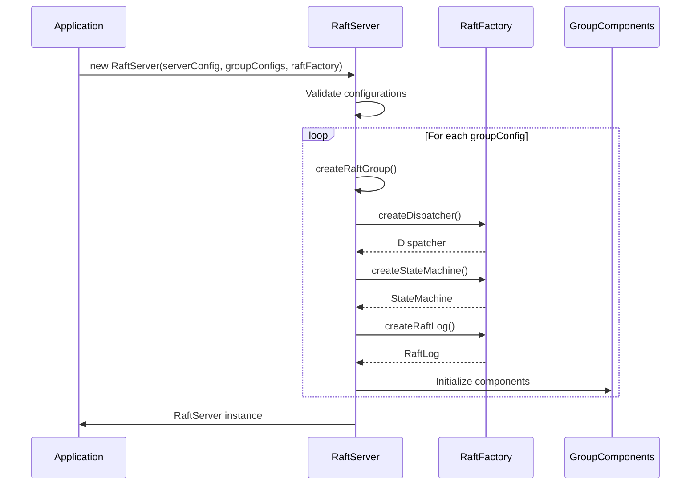
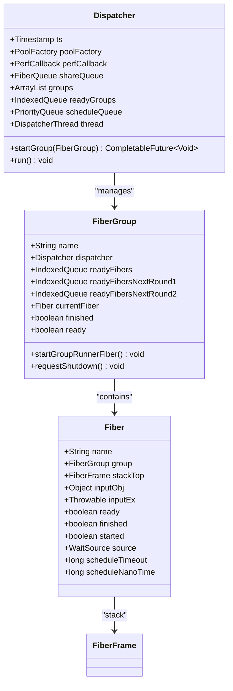
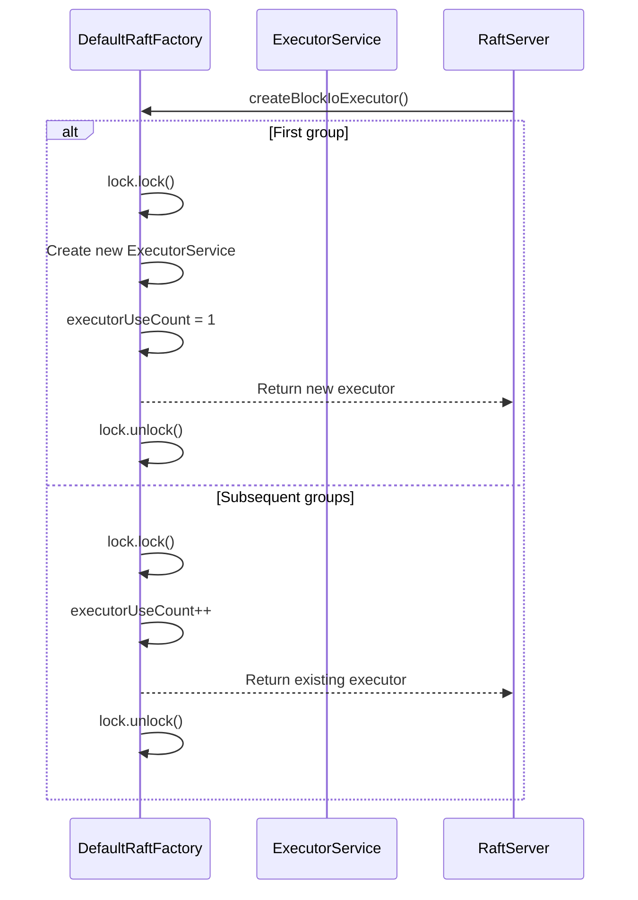
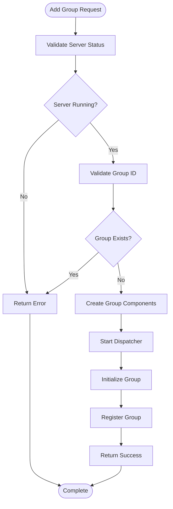

# Multi-RAFT Groups

<cite>
**Referenced Files in This Document**   
- [RaftServer.java](file://server/src/main/java/com/github/dtprj/dongting/raft/server/RaftServer.java)
- [RaftGroupConfig.java](file://server/src/main/java/com/github/dtprj/dongting/raft/server/RaftGroupConfig.java)
- [RaftServerConfig.java](file://server/src/main/java/com/github/dtprj/dongting/raft/server/RaftServerConfig.java)
- [DefaultRaftFactory.java](file://server/src/main/java/com/github/dtprj/dongting/raft/server/DefaultRaftFactory.java)
- [GroupComponents.java](file://server/src/main/java/com/github/dtprj/dongting/raft/impl/GroupComponents.java)
- [Dispatcher.java](file://server/src/main/java/com/github/dtprj/dongting/fiber/Dispatcher.java)
- [DemoKvServerBase.java](file://demos/src/main/java/com/github/dtprj/dongting/demos/base/DemoKvServerBase.java)
- [MultiRaftDemoServer1.java](file://demos/src/main/java/com/github/dtprj/dongting/demos/multiraft/MultiRaftDemoServer1.java)
- [MultiRaftDemoServer2.java](file://demos/src/main/java/com/github/dtprj/dongting/demos/multiraft/MultiRaftDemoServer2.java)
- [MultiRaftDemoServer3.java](file://demos/src/main/java/com/github/dtprj/dongting/demos/multiraft/MultiRaftDemoServer3.java)
- [AddGroup103Demo.java](file://demos/src/main/java/com/github/dtprj/dongting/demos/multiraft/AddGroup103Demo.java)
- [RemoveGroup103Demo.java](file://demos/src/main/java/com/github/dtprj/dongting/demos/multiraft/RemoveGroup103Demo.java)
- [GroupId.java](file://demos/src/main/java/com/github/dtprj/dongting/demos/multiraft/GroupId.java)
</cite>

## Table of Contents
1. [Introduction](#introduction)
2. [Architecture Overview](#architecture-overview)
3. [Configuration and Initialization](#configuration-and-initialization)
4. [Resource Sharing Model](#resource-sharing-model)
5. [Dynamic Group Management](#dynamic-group-management)
6. [Demo Applications](#demo-applications)
7. [Performance Considerations](#performance-considerations)
8. [Challenges and Monitoring](#challenges-and-monitoring)
9. [Conclusion](#conclusion)

## Introduction

The Multi-RAFT Groups feature in Dongting enables multiple independent RAFT consensus groups to coexist within a single process, sharing network resources while maintaining isolation. This architecture allows for building scalable distributed systems where different services or data partitions can maintain their own consensus state without interfering with each other, while efficiently utilizing system resources.

This document explains how multiple RAFT groups operate within a single Dongting process, their configuration and initialization process, resource sharing model, and provides guidance on capacity planning and performance considerations.

**Section sources**
- [RaftServer.java](file://server/src/main/java/com/github/dtprj/dongting/raft/server/RaftServer.java#L84-L717)
- [DemoKvServerBase.java](file://demos/src/main/java/com/github/dtprj/dongting/demos/base/DemoKvServerBase.java#L34-L83)

## Architecture Overview

Dongting's Multi-RAFT Groups architecture allows a single RaftServer instance to host multiple independent RAFT consensus groups. Each group maintains its own state machine, log, and membership configuration, while sharing common infrastructure resources such as network connections and thread dispatchers.

The architecture follows a component-based design where each RAFT group has its own set of components encapsulated in the GroupComponents class, including:
- MemberManager: Handles membership and heartbeat operations
- VoteManager: Manages leader election processes
- ReplicateManager: Handles log replication between nodes
- ApplyManager: Applies committed entries to the state machine
- CommitManager: Manages commit index advancement
- SnapshotManager: Handles snapshot creation and installation



**Diagram sources**
- [RaftServer.java](file://server/src/main/java/com/github/dtprj/dongting/raft/server/RaftServer.java#L84-L717)
- [GroupComponents.java](file://server/src/main/java/com/github/dtprj/dongting/raft/impl/GroupComponents.java#L31-L53)

## Configuration and Initialization

The Multi-RAFT Groups feature is configured through the RaftServer constructor, which accepts a list of RaftGroupConfig objects. Each RaftGroupConfig defines the parameters for an individual RAFT group, including its group ID, member nodes, observer nodes, and various operational parameters.

The initialization process begins when creating a RaftServer instance with multiple group configurations. The server creates separate GroupComponents for each group, establishing isolated execution contexts while sharing common infrastructure.



**Diagram sources**
- [RaftServer.java](file://server/src/main/java/com/github/dtprj/dongting/raft/server/RaftServer.java#L109-L185)
- [DefaultRaftFactory.java](file://server/src/main/java/com/github/dtprj/dongting/raft/server/DefaultRaftFactory.java#L40-L123)

### Configuration Parameters

The following table outlines the key configuration parameters for RAFT groups:

| Parameter | Description | Default Value |
|---------|------------|-------------|
| groupId | Unique identifier for the RAFT group | Required |
| nodeIdOfMembers | Comma-separated list of member node IDs | Required |
| nodeIdOfObservers | Comma-separated list of observer node IDs | Empty |
| dataDir | Directory for storing group data | "./data" |
| statusFile | Filename for status persistence | "raft.status" |
| maxReplicateItems | Maximum number of entries in a single replication batch | 50,000 |
| maxReplicateBytes | Maximum bytes in a single replication batch | 16MB |
| maxPendingTasks | Maximum number of pending tasks | 2,000 |
| maxPendingTaskBytes | Maximum bytes of pending tasks | 256MB |
| saveSnapshotSeconds | Interval for automatic snapshot creation | 3,600 seconds (1 hour) |
| maxKeepSnapshots | Maximum number of snapshots to retain | 2 |
| syncForce | Whether to force sync to disk after writes | true |

**Section sources**
- [RaftGroupConfig.java](file://server/src/main/java/com/github/dtprj/dongting/raft/server/RaftGroupConfig.java#L24-L75)
- [RaftServerConfig.java](file://server/src/main/java/com/github/dtprj/dongting/raft/server/RaftServerConfig.java#L21-L39)

## Resource Sharing Model

Dongting's Multi-RAFT Groups implementation employs a sophisticated resource sharing model that balances isolation with efficiency. While each RAFT group maintains its own state and execution context, several key resources are shared across groups to minimize overhead.

### Thread Dispatchers

The Dispatcher class serves as the execution engine for all RAFT groups within a process. Each group has its own FiberGroup that runs on a shared Dispatcher thread. This model allows for efficient context switching between groups while maintaining isolation.

The Dispatcher uses a work-stealing algorithm to distribute work among available threads, ensuring that no single group can monopolize resources. Each FiberGroup has its own ready queue, and the Dispatcher cycles through active groups to execute their ready fibers.



**Diagram sources**
- [Dispatcher.java](file://server/src/main/java/com/github/dtprj/dongting/fiber/Dispatcher.java#L45-L654)
- [RaftServer.java](file://server/src/main/java/com/github/dtprj/dongting/raft/server/RaftServer.java#L251-L253)

### Network Connections

Network resources are shared through a single NioClient and NioServer instance that serves all RAFT groups. The NioClient handles outbound connections to other nodes, while the NioServer handles inbound connections.

This shared network model reduces the number of TCP connections required in the system, as multiple RAFT groups can communicate over the same network channels. The network layer uses command codes to multiplex different RAFT group traffic over the same connections.

### I/O Executors

The DefaultRaftFactory implements a shared I/O executor model where multiple groups can share the same thread pool for blocking I/O operations. The factory maintains a reference count of executor usage and creates a shared ExecutorService when the first group is created.

When a new group is created, the factory checks if a shared executor already exists. If so, it increments the usage count and returns the existing executor. When groups are removed, the usage count is decremented, and the executor is shut down when the count reaches zero.



**Diagram sources**
- [DefaultRaftFactory.java](file://server/src/main/java/com/github/dtprj/dongting/raft/server/DefaultRaftFactory.java#L57-L87)
- [RaftServer.java](file://server/src/main/java/com/github/dtprj/dongting/raft/server/RaftServer.java#L310-L311)

**Section sources**
- [Dispatcher.java](file://server/src/main/java/com/github/dtprj/dongting/fiber/Dispatcher.java#L45-L654)
- [DefaultRaftFactory.java](file://server/src/main/java/com/github/dtprj/dongting/raft/server/DefaultRaftFactory.java#L40-L123)

## Dynamic Group Management

Dongting supports dynamic addition and removal of RAFT groups at runtime through administrative APIs. This capability enables flexible cluster management and resource allocation without requiring process restarts.

### Adding Groups

New RAFT groups can be added using the addGroup() method on the RaftServer. This method is not idempotent and will fail if a group with the same ID already exists.

The addition process involves:
1. Validating that the server is running and the group ID is unique
2. Creating the group components and fiber group
3. Starting the dispatcher for the new group
4. Initializing the RAFT group state



**Diagram sources**
- [RaftServer.java](file://server/src/main/java/com/github/dtprj/dongting/raft/server/RaftServer.java#L572-L622)

### Removing Groups

Existing RAFT groups can be removed using the removeGroup() method. This method is idempotent and will complete successfully even if the group does not exist.

The removal process involves:
1. Validating the server status and group existence
2. Initiating group shutdown with configurable timeout
3. Optionally saving a final snapshot
4. Closing the RAFT log and status manager
5. Removing the group from the server's group map
6. Updating node usage counts

**Section sources**
- [RaftServer.java](file://server/src/main/java/com/github/dtprj/dongting/raft/server/RaftServer.java#L572-L666)

## Demo Applications

Dongting provides demo applications that illustrate the configuration and management of multiple RAFT groups. These demos showcase both static configuration at startup and dynamic group management at runtime.

### Static Configuration Demo

The MultiRaftDemoServer classes demonstrate how to configure multiple RAFT groups at server startup. The demo creates three server instances (MultiRaftDemoServer1, MultiRaftDemoServer2, and MultiRaftDemoServer3) that form a cluster with two RAFT groups (GROUP_ID_101 and GROUP_ID_102).

```mermaid
graph TD
subgraph "Server 1"
MDS1[MultiRaftDemoServer1]
G101_1[Group 101]
G102_1[Group 102]
end
subgraph "Server 2"
MDS2[MultiRaftDemoServer2]
G101_2[Group 101]
G102_2[Group 102]
end
subgraph "Server 3"
MDS3[MultiRaftDemoServer3]
G101_3[Group 101]
G102_3[Group 102]
end
G101_1 < --> G101_2
G101_2 < --> G101_3
G101_3 < --> G101_1
G102_1 < --> G102_2
G102_2 < --> G102_3
G102_3 < --> G102_1
```

**Diagram sources**
- [MultiRaftDemoServer1.java](file://demos/src/main/java/com/github/dtprj/dongting/demos/multiraft/MultiRaftDemoServer1.java#L23-L31)
- [MultiRaftDemoServer2.java](file://demos/src/main/java/com/github/dtprj/dongting/demos/multiraft/MultiRaftDemoServer2.java#L23-L31)
- [MultiRaftDemoServer3.java](file://demos/src/main/java/com/github/dtprj/dongting/demos/multiraft/MultiRaftDemoServer3.java#L23-L31)

### Dynamic Management Demo

The AddGroup103Demo and RemoveGroup103Demo applications demonstrate dynamic group management. These demos use the AdminRaftClient to add and remove a third RAFT group (GROUP_ID_103) from the running cluster.

The process involves:
1. Creating an AdminRaftClient and connecting to the cluster
2. Issuing addGroup or removeGroup commands to each server
3. Waiting for completion on all servers
4. Verifying the operation result

This demonstrates how RAFT groups can be added or removed from a running cluster without service interruption to existing groups.

**Section sources**
- [AddGroup103Demo.java](file://demos/src/main/java/com/github/dtprj/dongting/demos/multiraft/AddGroup103Demo.java#L27-L49)
- [RemoveGroup103Demo.java](file://demos/src/main/java/com/github/dtprj/dongting/demos/multiraft/RemoveGroup103Demo.java#L27-L46)
- [DemoKvServerBase.java](file://demos/src/main/java/com/github/dtprj/dongting/demos/base/DemoKvServerBase.java#L36-L73)

## Performance Considerations

When running multiple RAFT groups in a single process, several performance considerations must be taken into account to ensure optimal system behavior.

### Capacity Planning

The number of RAFT groups that can be effectively hosted in a single process depends on several factors:

1. **CPU Resources**: Each group requires CPU cycles for consensus operations, log replication, and state machine execution. The Dispatcher's work distribution ensures fair sharing, but CPU-intensive state machines may impact other groups.

2. **Memory Usage**: Each group maintains its own log cache, state machine state, and fiber execution context. The idxCacheSize and maxCacheTaskBytes parameters control memory usage per group.

3. **I/O Throughput**: Shared I/O executors mean that disk-intensive operations (snapshot creation, log persistence) by one group can impact the performance of others. The blockIoThreads parameter in RaftServerConfig controls the size of the shared I/O thread pool.

4. **Network Bandwidth**: All groups share the same network connections, so high replication traffic from one group can affect the latency of others.

### Optimization Recommendations

To optimize performance when running multiple RAFT groups:

1. **Balance Group Load**: Distribute groups with similar workload characteristics across different server processes to avoid resource contention.

2. **Tune Cache Sizes**: Adjust idxCacheSize and related cache parameters based on the access patterns of your state machines to minimize disk I/O.

3. **Configure Snapshot Intervals**: Set appropriate saveSnapshotSeconds values based on data change rates to balance recovery time and I/O overhead.

4. **Monitor Resource Usage**: Track CPU, memory, and I/O usage per group to identify potential bottlenecks.

5. **Use Observers Strategically**: For read-heavy workloads, consider using observer nodes to offload read traffic from the consensus group.

**Section sources**
- [RaftGroupConfig.java](file://server/src/main/java/com/github/dtprj/dongting/raft/server/RaftGroupConfig.java#L24-L75)
- [RaftServerConfig.java](file://server/src/main/java/com/github/dtprj/dongting/raft/server/RaftServerConfig.java#L21-L39)

## Challenges and Monitoring

While the Multi-RAFT Groups architecture provides significant benefits, it also introduces several challenges that require careful consideration.

### Resource Contention

The primary challenge is resource contention between groups. Since groups share thread dispatchers, network connections, and I/O executors, a misbehaving or overloaded group can impact the performance of others.

Mitigation strategies include:
- Implementing resource quotas for CPU and I/O usage
- Using separate processes for groups with vastly different workload characteristics
- Monitoring group-specific metrics to detect imbalances

### Monitoring Complexity

Monitoring multiple RAFT groups increases operational complexity. Each group has its own health indicators, performance metrics, and failure modes that need to be tracked.

Key monitoring metrics include:
- Group-specific leader status and term information
- Log replication lag and throughput
- Election frequency and stability
- Snapshot creation and installation times
- Fiber queue sizes and processing latency

The queryRaftGroupStatus() API provides detailed status information for individual groups, which should be incorporated into monitoring systems.

### Failure Isolation

While the architecture provides logical isolation between groups, physical failures (process crashes, node failures) affect all groups on that node. This requires careful consideration in disaster recovery planning.

Best practices include:
- Distributing group members across different physical nodes
- Implementing automated failover procedures
- Maintaining adequate snapshot retention for rapid recovery
- Regularly testing backup and restore procedures

**Section sources**
- [RaftServer.java](file://server/src/main/java/com/github/dtprj/dongting/raft/server/RaftServer.java#L696-L713)

## Conclusion

The Multi-RAFT Groups feature in Dongting provides a powerful architecture for building scalable distributed systems by allowing multiple independent consensus groups to coexist within a single process. This design offers significant resource efficiency benefits while maintaining the isolation guarantees required for reliable distributed consensus.

Key advantages of this architecture include:
- **Resource Efficiency**: Shared network connections, thread dispatchers, and I/O executors reduce overall system overhead
- **Operational Simplicity**: Managing multiple services through a single process interface
- **Dynamic Scalability**: Ability to add and remove groups at runtime without service interruption
- **Flexible Deployment**: Support for various deployment topologies from single-node development to multi-datacenter production

When implementing systems using Multi-RAFT Groups, careful attention should be paid to capacity planning, resource allocation, and monitoring to ensure optimal performance and reliability. By following the configuration and management patterns demonstrated in the provided examples, developers can effectively leverage this architecture to build robust, scalable distributed applications.