# RAFT Consensus Implementation

<cite>
**Referenced Files in This Document**   
- [RaftGroupImpl.java](file://server/src/main/java/com/github/dtprj/dongting/raft/impl/RaftGroupImpl.java)
- [VoteManager.java](file://server/src/main/java/com/github/dtprj/dongting/raft/impl/VoteManager.java)
- [ReplicateManager.java](file://server/src/main/java/com/github/dtprj/dongting/raft/impl/ReplicateManager.java)
- [ApplyManager.java](file://server/src/main/java/com/github/dtprj/dongting/raft/impl/ApplyManager.java)
- [CommitManager.java](file://server/src/main/java/com/github/dtprj/dongting/raft/impl/CommitManager.java)
- [RaftServer.java](file://server/src/main/java/com/github/dtprj/dongting/raft/server/RaftServer.java)
- [RaftLog.java](file://server/src/main/java/com/github/dtprj/dongting/raft/store/RaftLog.java)
- [SnapshotManager.java](file://server/src/main/java/com/github/dtprj/dongting/raft/sm/SnapshotManager.java)
- [RaftNodeEx.java](file://server/src/main/java/com/github/dtprj/dongting/raft/impl/RaftNodeEx.java)
- [AppendReq.java](file://server/src/main/java/com/github/dtprj/dongting/raft/rpc/AppendReq.java)
- [VoteReq.java](file://server/src/main/java/com/github/dtprj/dongting/raft/rpc/VoteReq.java)
- [TailCache.java](file://server/src/main/java/com/github/dtprj/dongting/raft/impl/TailCache.java)
- [GroupComponents.java](file://server/src/main/java/com/github/dtprj/dongting/raft/impl/GroupComponents.java)
- [RaftStatus.java](file://server/src/main/java/com/github/dtprj/dongting/raft/server/RaftStatus.java)
</cite>

## Table of Contents
1. [Introduction](#introduction)
2. [Core Algorithm Components](#core-algorithm-components)
3. [Joint Consensus and Configuration Management](#joint-consensus-and-configuration-management)
4. [Multi-RAFT Group Architecture](#multi-raft-group-architecture)
5. [Log Storage Layer](#log-storage-layer)
6. [Linearizable Read Implementation](#linearizable-read-implementation)
7. [Fiber Integration and Non-blocking Operations](#fiber-integration-and-non-blocking-operations)
8. [DtKV State Machine Integration](#dtkv-state-machine-integration)
9. [Performance Considerations](#performance-considerations)
10. [Message Flow and Network Handling](#message-flow-and-network-handling)
11. [Fault Tolerance and Recovery](#fault-tolerance-and-recovery)

## Introduction
The Dongting RAFT consensus implementation provides a robust distributed consensus algorithm designed for high availability and fault tolerance. This documentation details the core components of the RAFT implementation, including leader election, log replication, safety mechanisms, and advanced features like joint consensus for safe membership changes. The architecture supports multiple independent RAFT groups within a single process, enabling efficient resource utilization while maintaining isolation between different consensus groups. The implementation leverages fibers for non-blocking operations and integrates with the DtKV state machine for distributed key-value storage operations.

## Core Algorithm Components

### Leader Election
The leader election process in Dongting's RAFT implementation follows the standard RAFT algorithm with optimizations for performance and reliability. The `VoteManager` class orchestrates the election process, managing both regular votes and pre-votes to prevent unnecessary term increments. When a follower's election timer expires, it transitions to candidate state and initiates a pre-vote phase to assess its eligibility before starting a formal election. This two-phase approach reduces disruptions in stable leader scenarios.

The election process begins with a candidate sending `RequestVote` RPCs to all other nodes in the cluster. The `VoteReq` message contains essential information including the candidate's term, last log index and term, and whether it's a pre-vote. Each node evaluates the request based on RAFT's safety rules, granting votes only to candidates with sufficiently up-to-date logs. The system uses randomized election timeouts to minimize split votes and ensure quick leader election.

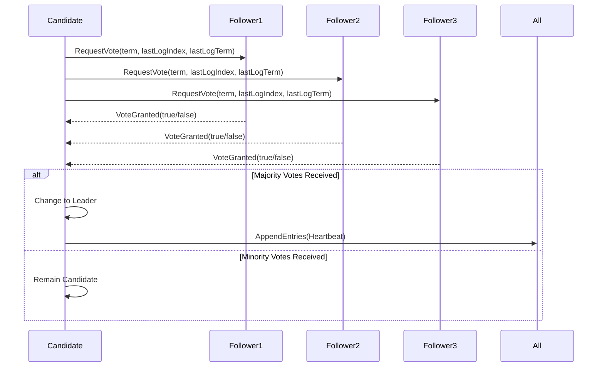

**Diagram sources**
- [VoteManager.java](file://server/src/main/java/com/github/dtprj/dongting/raft/impl/VoteManager.java#L43-L492)
- [VoteReq.java](file://server/src/main/java/com/github/dtprj/dongting/raft/rpc/VoteReq.java#L1-L102)

**Section sources**
- [VoteManager.java](file://server/src/main/java/com/github/dtprj/dongting/raft/impl/VoteManager.java#L43-L492)
- [RaftNodeEx.java](file://server/src/main/java/com/github/dtprj/dongting/raft/impl/RaftNodeEx.java#L1-L38)

### Log Replication
Log replication in Dongting's RAFT implementation is managed by the `ReplicateManager` class, which handles the `AppendEntries` RPCs from leaders to followers. The leader maintains a separate replication fiber for each follower, allowing parallel log replication across the cluster. When the leader receives a new entry from a client, it appends the entry to its log and immediately sends `AppendEntries` RPCs to all followers.

The `AppendReq` message contains the leader's term, previous log index and term, leader commit index, and the new log entries to be replicated. Followers validate the consistency of the log by checking that the previous log entry matches the one in their log. If the logs are inconsistent, the follower rejects the request, prompting the leader to find the correct point of divergence and retry.

The implementation optimizes network utilization by batching multiple log entries in a single `AppendEntries` RPC and using flow control to prevent overwhelming followers. The system also handles heartbeat messages (empty `AppendEntries` RPCs) to maintain leadership and inform followers of the current term.

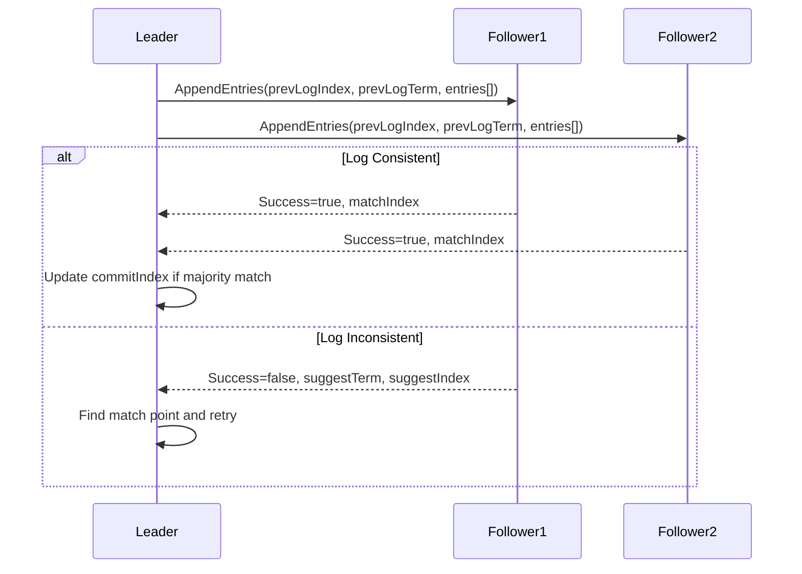

**Diagram sources**
- [ReplicateManager.java](file://server/src/main/java/com/github/dtprj/dongting/raft/impl/ReplicateManager.java#L67-L792)
- [AppendReq.java](file://server/src/main/java/com/github/dtprj/dongting/raft/rpc/AppendReq.java#L1-L164)

**Section sources**
- [ReplicateManager.java](file://server/src/main/java/com/github/dtprj/dongting/raft/impl/ReplicateManager.java#L67-L792)
- [AppendReq.java](file://server/src/main/java/com/github/dtprj/dongting/raft/rpc/AppendReq.java#L1-L164)

### Safety Mechanisms
The safety mechanisms in Dongting's RAFT implementation ensure consistency and prevent split-brain scenarios. The core safety properties are enforced through term management, log matching, and leader completeness. The `RaftUtil` class provides utility methods for term incrementation and role transitions, ensuring atomic updates to the raft status.

The implementation enforces the election restriction that a candidate must have a log at least as up-to-date as the majority of the cluster to receive votes. This prevents candidates with stale logs from becoming leaders and potentially overwriting committed entries. The leader completeness property is maintained by only committing entries from the current term, ensuring that any leader has all previously committed entries.

The system also implements a lease-based mechanism for linearizable reads, where the leader maintains a lease period during which it can safely serve read requests without contacting other nodes. If the lease expires due to network delays or high load, the leader must re-establish leadership by exchanging heartbeat messages with a majority of the cluster.

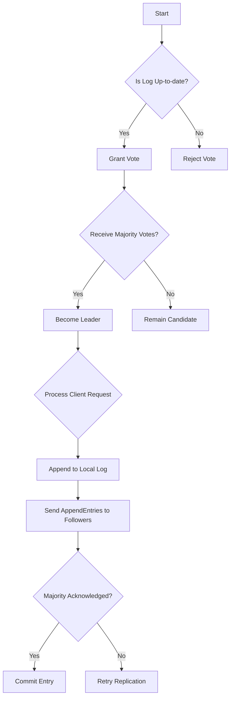

**Section sources**
- [RaftUtil.java](file://server/src/main/java/com/github/dtprj/dongting/raft/impl/RaftUtil.java)
- [RaftStatusImpl.java](file://server/src/main/java/com/github/dtprj/dongting/raft/impl/RaftStatusImpl.java)

## Joint Consensus and Configuration Management

### Joint Consensus Implementation
Dongting's RAFT implementation supports safe membership changes through joint consensus, allowing the cluster to transition between different configurations without compromising availability or consistency. The `MemberManager` class handles the configuration change process, which follows the three-phase approach described in the RAFT paper.

The joint consensus process begins with the `leaderPrepareJointConsensus` operation, where the leader proposes a new configuration that includes both the old and new members. During this phase, log entries require approval from a majority of both the old and new configurations. This ensures that any decision made during the transition is supported by nodes that will be present in both configurations.

The second phase is initiated by `leaderCommitJointConsensus`, which commits the new configuration as the sole active configuration. From this point forward, only the new configuration is required for quorum decisions. The final phase, `leaderAbortJointConsensus`, allows the leader to cancel an ongoing configuration change if necessary.

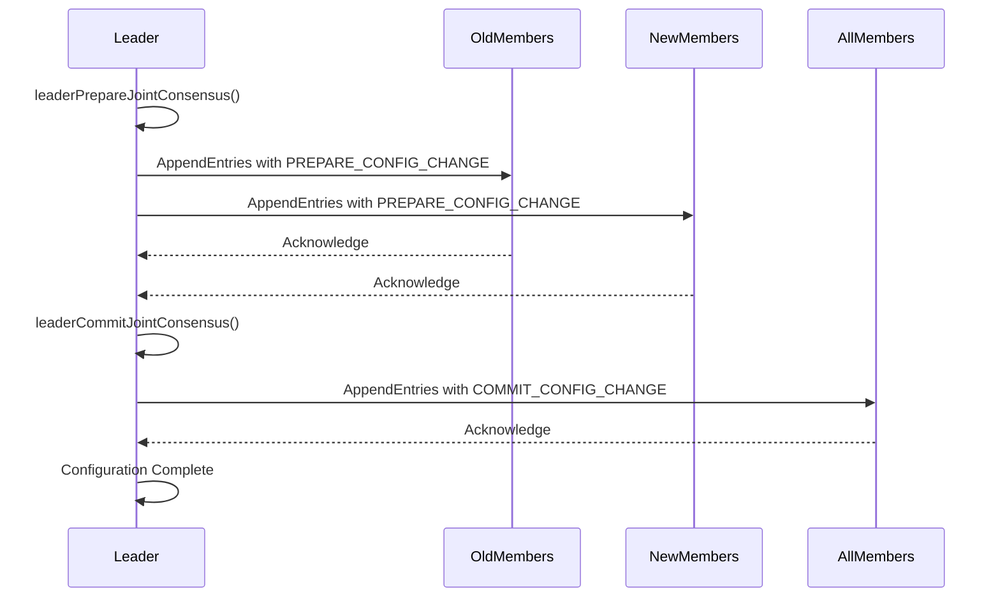

**Section sources**
- [MemberManager.java](file://server/src/main/java/com/github/dtprj/dongting/raft/impl/MemberManager.java)
- [RaftGroupImpl.java](file://server/src/main/java/com/github/dtprj/dongting/raft/impl/RaftGroupImpl.java#L182-L217)

### Dynamic Configuration Updates
Dynamic configuration updates in Dongting's RAFT implementation allow for flexible cluster management, including adding and removing nodes, promoting observers to full members, and changing cluster topology. The system maintains separate sets of members and observers, with different quorum requirements for each.

The configuration change process is initiated through the `RaftGroup` interface methods, which validate the proposed configuration before submission. The implementation ensures that configuration changes follow RAFT's safety constraints, preventing invalid configurations such as empty member sets or nodes appearing in both member and observer lists.

The system also supports administrative operations for configuration management, including `adminPrepareChange`, `adminCommitChange`, and `adminAbortChange` RPCs that coordinate configuration changes across the cluster. These operations are designed to be idempotent and can be safely retried in case of network failures.

**Section sources**
- [RaftGroup.java](file://server/src/main/java/com/github/dtprj/dongting/raft/server/RaftGroup.java#L89-L101)
- [AdminConfigChangeProcessor.java](file://server/src/main/java/com/github/dtprj/dongting/raft/rpc/AdminConfigChangeProcessor.java)

## Multi-RAFT Group Architecture

### Architecture Overview
Dongting's multi-RAFT group architecture allows multiple independent RAFT consensus groups to operate within a single process, sharing network and fiber resources while maintaining isolation between groups. The `RaftServer` class manages the lifecycle of all RAFT groups, handling their creation, initialization, and shutdown.

Each RAFT group operates with its own `RaftGroupImpl` instance, which encapsulates the group's state, configuration, and components. The architecture uses a `GroupComponents` structure to organize the various managers and utilities required by each group, including the `ApplyManager`, `CommitManager`, `ReplicateManager`, and `VoteManager`.

The system supports dynamic group management through administrative APIs, allowing groups to be added or removed at runtime. This enables flexible deployment scenarios where different services or data partitions can have their own dedicated consensus groups.

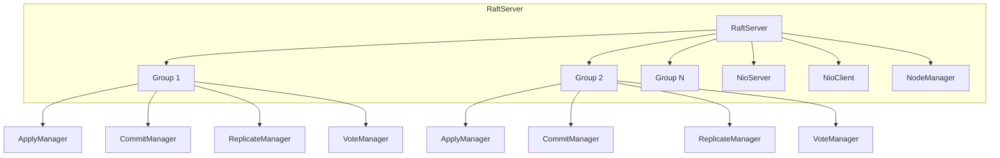

**Diagram sources**
- [RaftServer.java](file://server/src/main/java/com/github/dtprj/dongting/raft/server/RaftServer.java#L84-L718)
- [RaftGroupImpl.java](file://server/src/main/java/com/github/dtprj/dongting/raft/impl/RaftGroupImpl.java#L43-L220)

**Section sources**
- [RaftServer.java](file://server/src/main/java/com/github/dtprj/dongting/raft/server/RaftServer.java#L84-L718)
- [GroupComponents.java](file://server/src/main/java/com/github/dtprj/dongting/raft/impl/GroupComponents.java#L1-L54)

### Group Isolation and Resource Management
The multi-RAFT group architecture ensures isolation between groups through separate fiber groups, log storage, and state machines. Each group has its own `FiberGroup` for executing RAFT operations, preventing one group's workload from affecting others. The `Dispatcher` mechanism allows for efficient scheduling of fiber operations across multiple groups.

Resource management is handled through configuration parameters that limit the memory and processing resources consumed by each group. The system uses `TailCache` to manage recent log entries in memory, with configurable limits on the number of tasks and bytes cached. This prevents any single group from consuming excessive memory resources.

The architecture also supports independent configuration of each group, allowing different consensus parameters such as election timeouts, heartbeat intervals, and replication settings to be tuned for specific workloads.

**Section sources**
- [FiberGroup.java](file://server/src/main/java/com/github/dtprj/dongting/fiber/FiberGroup.java)
- [TailCache.java](file://server/src/main/java/com/github/dtprj/dongting/raft/impl/TailCache.java#L1-L207)

## Log Storage Layer

### File-based Persistence
The log storage layer in Dongting's RAFT implementation provides durable persistence of log entries using a file-based approach. The `RaftLog` interface defines the contract for log operations, with implementations responsible for writing log entries to disk and reading them back during recovery.

The system uses a segmented log approach, where log entries are written to sequential files that are rotated based on size or time criteria. Each log entry is serialized with its term, index, and data payload, along with checksums for data integrity verification. The implementation supports both synchronous and asynchronous write modes, allowing trade-offs between durability and performance.

The log storage layer integrates with the `StatusManager` to persist critical state such as the current term, voted-for candidate, and commit index. This ensures that the RAFT state can be recovered correctly after a crash or restart.

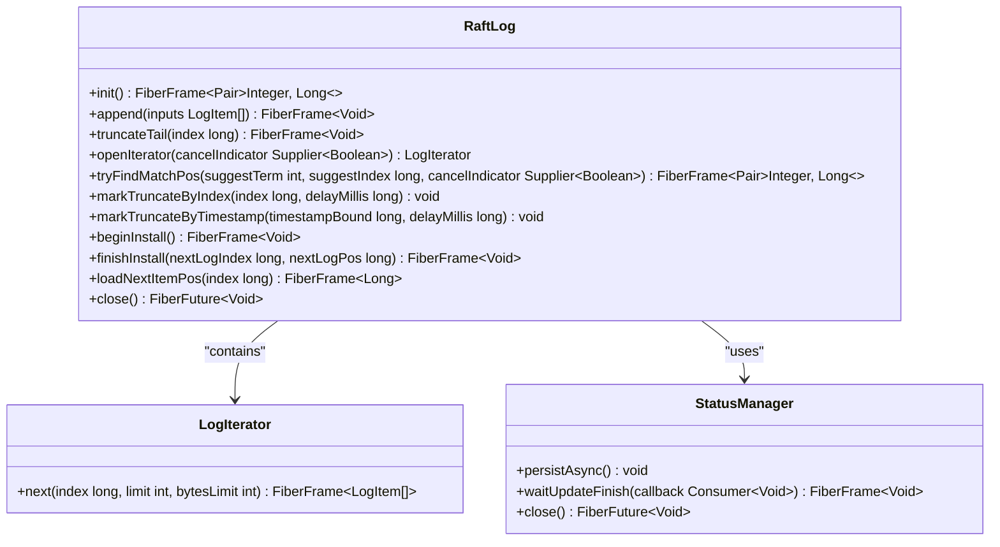

**Diagram sources**
- [RaftLog.java](file://server/src/main/java/com/github/dtprj/dongting/raft/store/RaftLog.java#L31-L89)
- [StatusManager.java](file://server/src/main/java/com/github/dtprj/dongting/raft/store/StatusManager.java)

**Section sources**
- [RaftLog.java](file://server/src/main/java/com/github/dtprj/dongting/raft/store/RaftLog.java#L31-L89)
- [StatusManager.java](file://server/src/main/java/com/github/dtprj/dongting/raft/store/StatusManager.java)

### Snapshot Management and Recovery
Snapshot management in Dongting's RAFT implementation allows for efficient recovery and log compaction. The `SnapshotManager` interface provides methods for creating, saving, and recovering from snapshots. When the log grows beyond a certain size, the system can create a snapshot of the current state machine state, allowing old log entries to be truncated.

The snapshot process is coordinated by the `ApplyManager`, which ensures that all entries up to a specific index have been applied before creating a snapshot. The `StateMachine` implementation is responsible for generating the snapshot data, which typically includes the current state and the index and term of the last included log entry.

During recovery, if a node finds a snapshot file, it loads the snapshot state and then applies any log entries that occurred after the snapshot. This significantly reduces recovery time compared to replaying the entire log from the beginning.

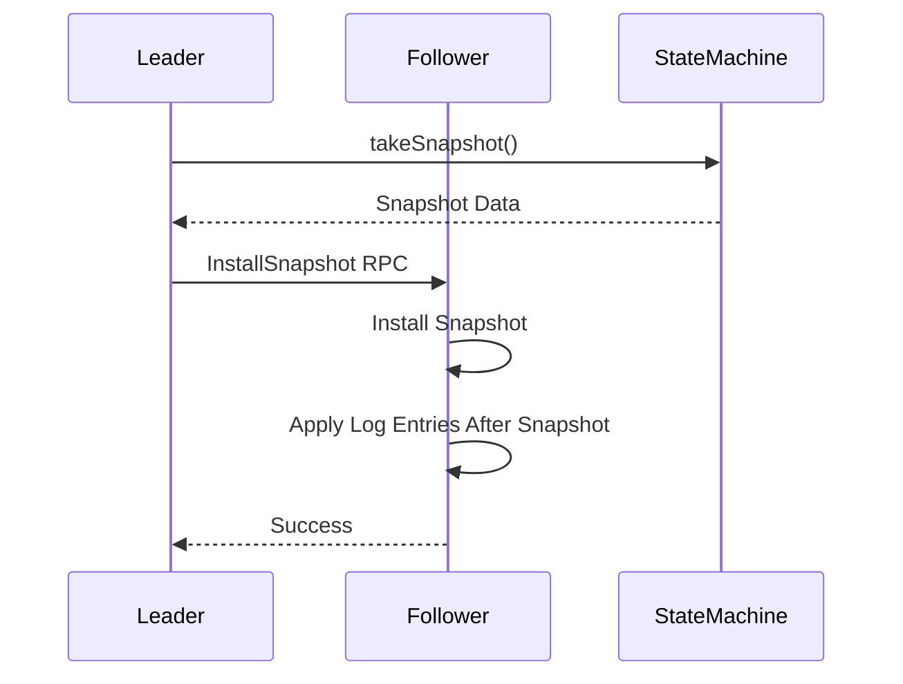

**Diagram sources**
- [SnapshotManager.java](file://server/src/main/java/com/github/dtprj/dongting/raft/sm/SnapshotManager.java#L24-L37)
- [ApplyManager.java](file://server/src/main/java/com/github/dtprj/dongting/raft/impl/ApplyManager.java#L58-L548)

**Section sources**
- [SnapshotManager.java](file://server/src/main/java/com/github/dtprj/dongting/raft/sm/SnapshotManager.java#L24-L37)
- [ApplyManager.java](file://server/src/main/java/com/github/dtprj/dongting/raft/impl/ApplyManager.java#L58-L548)

## Linearizable Read Implementation

### Lease Mechanisms
The linearizable read implementation in Dongting's RAFT uses lease mechanisms to provide strong consistency guarantees while minimizing latency. When a node becomes leader, it establishes a lease period during which it can safely serve read requests without contacting other nodes.

The lease duration is calculated based on the election timeout and network round-trip time estimates. During the lease period, the leader can immediately respond to read requests by querying its local state machine, knowing that no other node can be elected as leader and modify the state.

If the lease expires due to network delays or high load, the leader must re-establish leadership by exchanging heartbeat messages with a majority of the cluster before serving additional read requests. This ensures that the leader has the most up-to-date information and maintains linearizability.

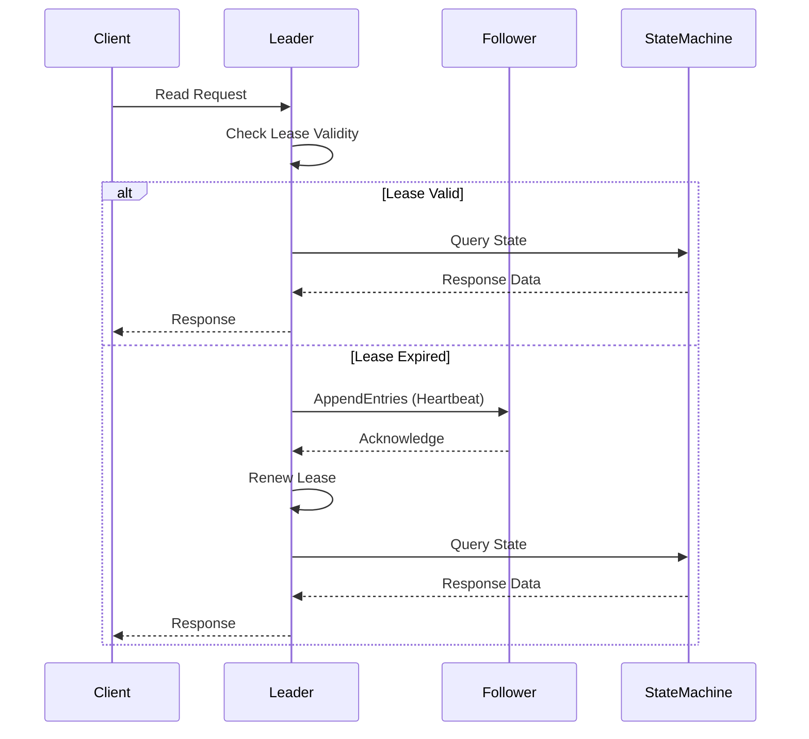

**Section sources**
- [RaftGroupImpl.java](file://server/src/main/java/com/github/dtprj/dongting/raft/impl/RaftGroupImpl.java#L91-L127)
- [RaftStatusImpl.java](file://server/src/main/java/com/github/dtprj/dongting/raft/impl/RaftStatusImpl.java)

### Handling Network Partitions
The implementation handles network partitions by detecting lease expiration and falling back to the standard RAFT read procedure. When a leader detects that its lease has expired, it must exchange heartbeat messages with a majority of the cluster to re-establish leadership before serving read requests.

In the case of a network partition where the leader is isolated from the majority of the cluster, it will be unable to renew its lease and will eventually step down when it receives a message from a node with a higher term. This prevents split-brain scenarios and ensures that only one leader can serve linearizable reads at any given time.

The system also handles client-side timeouts and retries, allowing clients to fail over to other nodes when the current leader is unreachable due to network partitions.

**Section sources**
- [RaftStatusImpl.java](file://server/src/main/java/com/github/dtprj/dongting/raft/impl/RaftStatusImpl.java)
- [NotLeaderException.java](file://server/src/main/java/com/github/dtprj/dongting/raft/server/NotLeaderException.java)

## Fiber Integration and Non-blocking Operations

### Role of Fibers
Fibers play a crucial role in Dongting's RAFT implementation by enabling non-blocking operations and efficient concurrency. The system uses fibers instead of traditional threads to handle RAFT operations, providing lightweight, cooperative multitasking that reduces context switching overhead.

Each RAFT group has its own fiber group, with dedicated fibers for different responsibilities such as leader election, log replication, and commit processing. The `Fiber` class provides a coroutine-like interface that allows complex asynchronous operations to be expressed in a sequential style, improving code readability and maintainability.

The fiber system integrates with the network layer, allowing I/O operations to suspend and resume fibers automatically without blocking threads. This enables high throughput even with a small number of underlying threads, making efficient use of system resources.

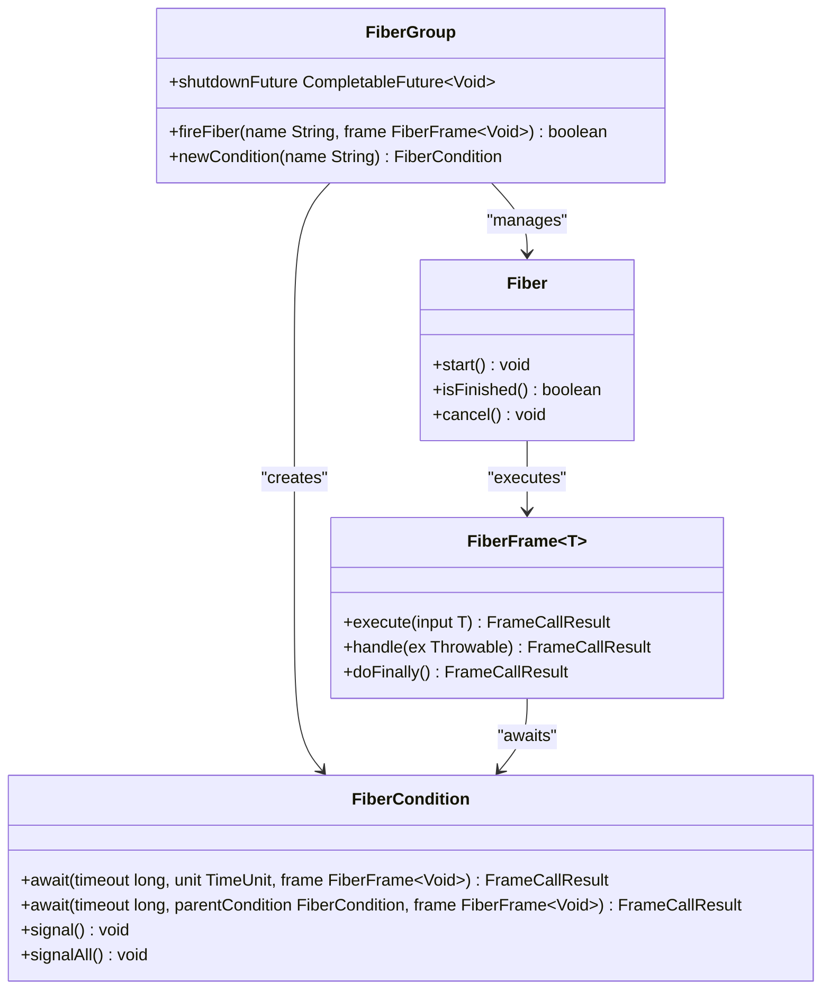

**Diagram sources**
- [Fiber.java](file://server/src/main/java/com/github/dtprj/dongting/fiber/Fiber.java)
- [FiberFrame.java](file://server/src/main/java/com/github/dtprj/dongting/fiber/FiberFrame.java)
- [FiberGroup.java](file://server/src/main/java/com/github/dtprj/dongting/fiber/FiberGroup.java)

**Section sources**
- [Fiber.java](file://server/src/main/java/com/github/dtprj/dongting/fiber/Fiber.java)
- [FiberFrame.java](file://server/src/main/java/com/github/dtprj/dongting/fiber/FiberFrame.java)

### Non-blocking RAFT Operations
The non-blocking nature of fibers enables efficient implementation of RAFT operations that would otherwise block threads. For example, the `ApplyManager` uses a fiber to continuously apply committed log entries to the state machine, suspending when no entries are available and resuming when new entries are committed.

Similarly, the `ReplicateManager` uses fibers to handle log replication to followers, allowing multiple replication operations to proceed concurrently without blocking. The fiber system automatically handles suspension and resumption when waiting for network I/O or other asynchronous operations.

This approach allows the system to handle thousands of concurrent operations with minimal resource overhead, making it suitable for high-throughput distributed systems.

**Section sources**
- [ApplyManager.java](file://server/src/main/java/com/github/dtprj/dongting/raft/impl/ApplyManager.java#L58-L548)
- [ReplicateManager.java](file://server/src/main/java/com/github/dtprj/dongting/raft/impl/ReplicateManager.java#L67-L792)

## DtKV State Machine Integration

### State Machine Interface
The integration with the DtKV state machine is facilitated through the `StateMachine` interface, which defines the contract between the RAFT consensus layer and the application state. The state machine is responsible for applying log entries to update its internal state and handling read and write operations from clients.

The `exec` method of the state machine is called by the `ApplyManager` when a log entry is ready to be applied. The method returns a `FiberFuture` to support asynchronous operations, allowing the state machine to perform I/O or other time-consuming operations without blocking the RAFT thread.

The state machine also provides methods for snapshot creation and recovery, enabling efficient log compaction and fast recovery after restarts.

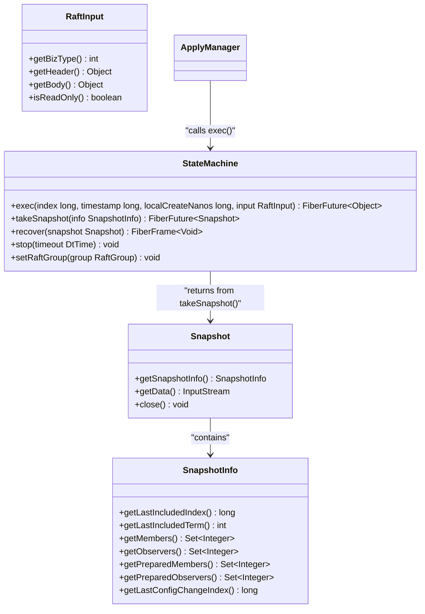

**Diagram sources**
- [StateMachine.java](file://server/src/main/java/com/github/dtprj/dongting/raft/sm/StateMachine.java)
- [ApplyManager.java](file://server/src/main/java/com/github/dtprj/dongting/raft/impl/ApplyManager.java#L58-L548)

**Section sources**
- [StateMachine.java](file://server/src/main/java/com/github/dtprj/dongting/raft/sm/StateMachine.java)
- [ApplyManager.java](file://server/src/main/java/com/github/dtprj/dongting/raft/impl/ApplyManager.java#L58-L548)

### DtKV Operations
The DtKV state machine implements distributed key-value storage operations on top of the RAFT consensus layer. Write operations are submitted as log entries through the `submitLinearTask` method of the `RaftGroup`, ensuring that all nodes in the cluster apply the same operations in the same order.

Read operations can be served from the leader's local state during the lease period, providing low-latency access to the most recent data. The system also supports watch operations that notify clients of changes to specific keys or key prefixes.

The integration ensures that all DtKV operations maintain the consistency and durability guarantees provided by the underlying RAFT consensus algorithm.

**Section sources**
- [DtKV.java](file://server/src/main/java/com/github/dtprj/dongting/dtkv/server/DtKV.java)
- [KvImpl.java](file://server/src/main/java/com/github/dtprj/dongting/dtkv/server/KvImpl.java)

## Performance Considerations

### Synchronous vs Asynchronous Storage Writes
Dongting's RAFT implementation provides configurable options for storage write performance, allowing trade-offs between durability and throughput. The system supports both synchronous and asynchronous write modes through the `syncForce` configuration parameter.

In synchronous mode, the system ensures that log entries are durably written to disk before acknowledging them to the client, providing strong durability guarantees at the cost of higher latency. This mode is suitable for applications where data loss cannot be tolerated.

In asynchronous mode, the system acknowledges log entries as soon as they are written to the operating system's buffer cache, providing lower latency but with a small window of potential data loss in case of a crash. This mode is suitable for high-throughput applications where some data loss can be tolerated.

The implementation also supports batching of multiple log entries in a single write operation, further improving throughput at the cost of increased latency for individual operations.

**Section sources**
- [RaftGroupConfig.java](file://server/src/main/java/com/github/dtprj/dongting/raft/server/RaftGroupConfig.java)
- [CommitManager.java](file://server/src/main/java/com/github/dtprj/dongting/raft/impl/CommitManager.java#L32-L196)

### Optimization Techniques
The implementation includes several optimization techniques to improve performance:

1. **Log entry batching**: Multiple log entries are batched together in `AppendEntries` RPCs to reduce network overhead.
2. **Flow control**: The system implements flow control to prevent overwhelming followers with too many uncommitted entries.
3. **Tail caching**: Recent log entries are kept in memory using the `TailCache` to avoid disk I/O for recent operations.
4. **Parallel replication**: The leader replicates to multiple followers in parallel, improving throughput.
5. **Lease-based reads**: Linearizable reads are served from the leader's local state during the lease period, reducing latency.

These optimizations allow the system to achieve high throughput and low latency while maintaining the safety and consistency guarantees of the RAFT algorithm.

**Section sources**
- [TailCache.java](file://server/src/main/java/com/github/dtprj/dongting/raft/impl/TailCache.java#L1-L207)
- [ReplicateManager.java](file://server/src/main/java/com/github/dtprj/dongting/raft/impl/ReplicateManager.java#L67-L792)

## Message Flow and Network Handling

### Key Operation Message Flows
The message flow for key RAFT operations follows the standard RAFT protocol with optimizations for performance and reliability. The `AppendEntries` and `RequestVote` RPCs are the primary messages used for log replication and leader election.

For `AppendEntries` RPCs, the leader sends a message containing the previous log entry information, the new entries to be replicated, and the current leader commit index. Followers validate the consistency of the log and respond with success or failure, along with their current state.

For `RequestVote` RPCs, candidates send their current term, last log index and term, and whether it's a pre-vote. Followers evaluate the request based on RAFT's safety rules and respond with their vote decision.

The system uses the `NioClient` and `NioServer` classes for network communication, providing non-blocking I/O operations that integrate with the fiber system.

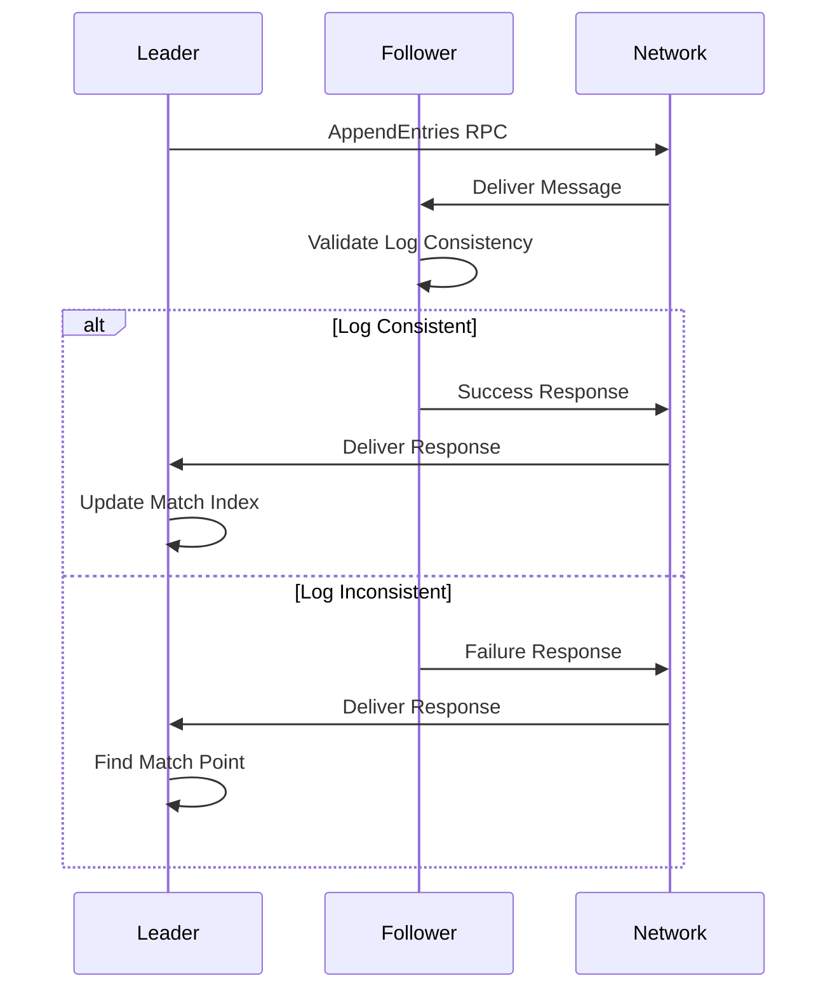

**Section sources**
- [AppendProcessor.java](file://server/src/main/java/com/github/dtprj/dongting/raft/rpc/AppendProcessor.java)
- [VoteProcessor.java](file://server/src/main/java/com/github/dtprj/dongting/raft/rpc/VoteProcessor.java)

### Network Layer Integration
The network layer integration in Dongting's RAFT implementation uses a custom NIO-based networking stack that provides high-performance, non-blocking I/O operations. The `NioClient` and `NioServer` classes handle all network communication, with support for multiple concurrent connections and efficient buffer management.

The system uses protocol buffers for message serialization, providing compact binary encoding of RAFT messages. The `Codec` framework handles the encoding and decoding of messages, with specialized callbacks for different message types to optimize performance.

The network layer integrates with the fiber system, allowing I/O operations to suspend and resume fibers automatically. This enables high concurrency with minimal resource overhead, as fibers are only active when processing messages rather than blocking on I/O operations.

**Section sources**
- [NioClient.java](file://client/src/main/java/com/github/dtprj/dongting/net/NioClient.java)
- [NioServer.java](file://client/src/main/java/com/github/dtprj/dongting/net/NioServer.java)
- [Codec.java](file://client/src/main/java/com/github/dtprj/dongting/codec/Decoder.java)

## Fault Tolerance and Recovery

### Quorum Requirements
Dongting's RAFT implementation follows the standard RAFT quorum requirements for fault tolerance. A majority quorum is required for leader election and log entry commitment, allowing the system to tolerate up to (n-1)/2 failures in a cluster of n nodes.

The implementation calculates the quorum size using the `getElectQuorum` method, which returns the minimum number of nodes required for a majority. This ensures that only one leader can be elected at a time, preventing split-brain scenarios.

For joint consensus operations, the system requires a majority from both the old and new configurations, ensuring that the transition is safe and consistent.

**Section sources**
- [RaftUtil.java](file://server/src/main/java/com/github/dtprj/dongting/raft/impl/RaftUtil.java)
- [RaftGroupConfig.java](file://server/src/main/java/com/github/dtprj/dongting/raft/server/RaftGroupConfig.java)

### Failure Recovery Procedures
The failure recovery procedures in Dongting's RAFT implementation ensure that nodes can recover their state correctly after crashes or restarts. When a node starts, it reads its persistent state from the `StatusManager` and the log entries from the `RaftLog`.

The recovery process begins by reading the current term, voted-for candidate, and commit index from persistent storage. The node then loads the log entries, validating their integrity using checksums. If a snapshot is present, the node recovers the state machine state from the snapshot and then applies any log entries that occurred after the snapshot.

The system also handles recovery from network partitions, where a node may have been isolated from the majority of the cluster. When the partition heals, the node will learn about the current term from other nodes and step down if necessary.

**Section sources**
- [RaftServer.java](file://server/src/main/java/com/github/dtprj/dongting/raft/server/RaftServer.java#L331-L547)
- [InitFiberFrame.java](file://server/src/main/java/com/github/dtprj/dongting/raft/impl/InitFiberFrame.java)