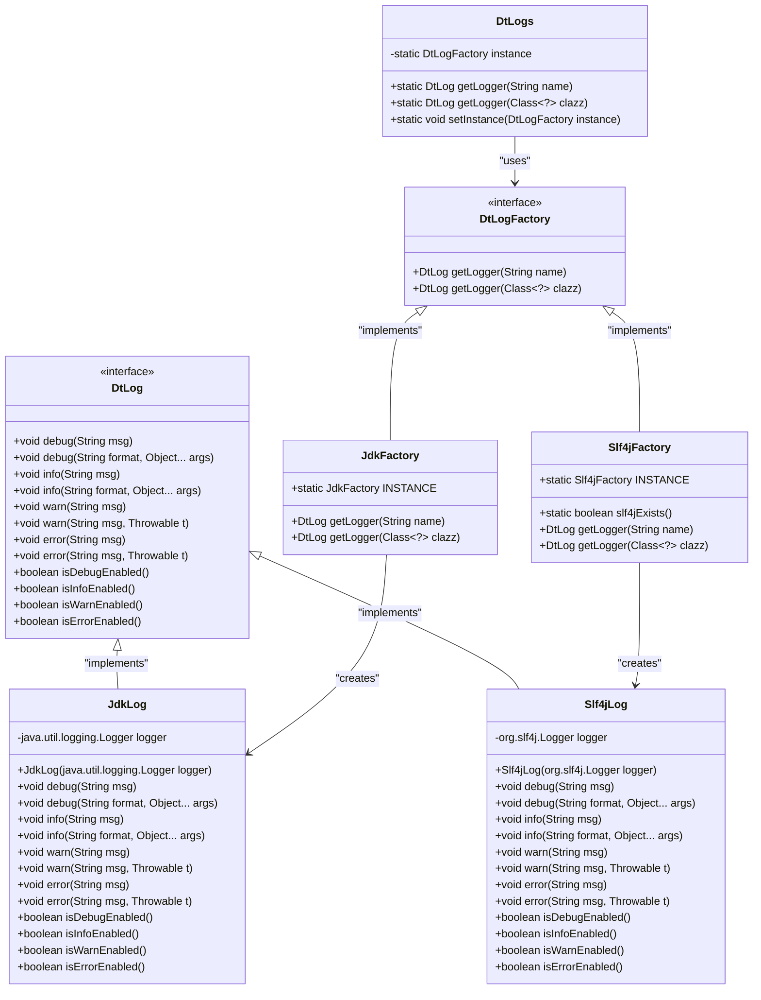
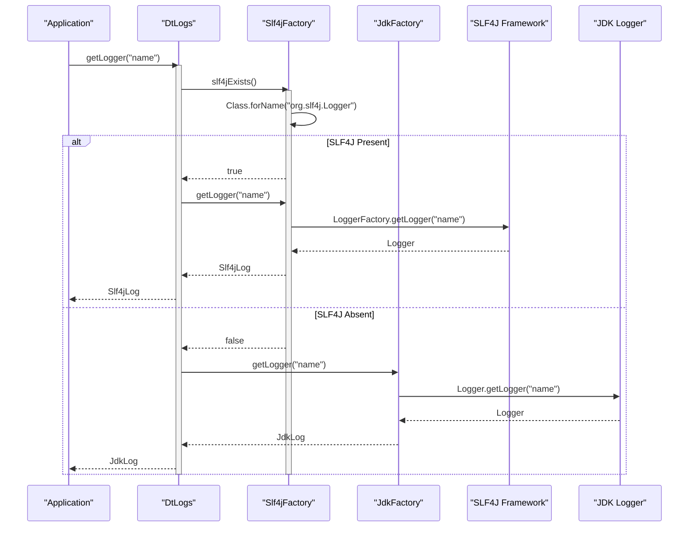
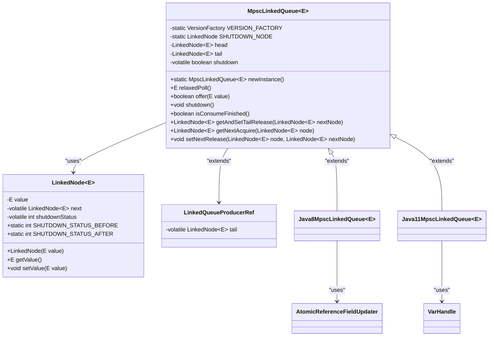
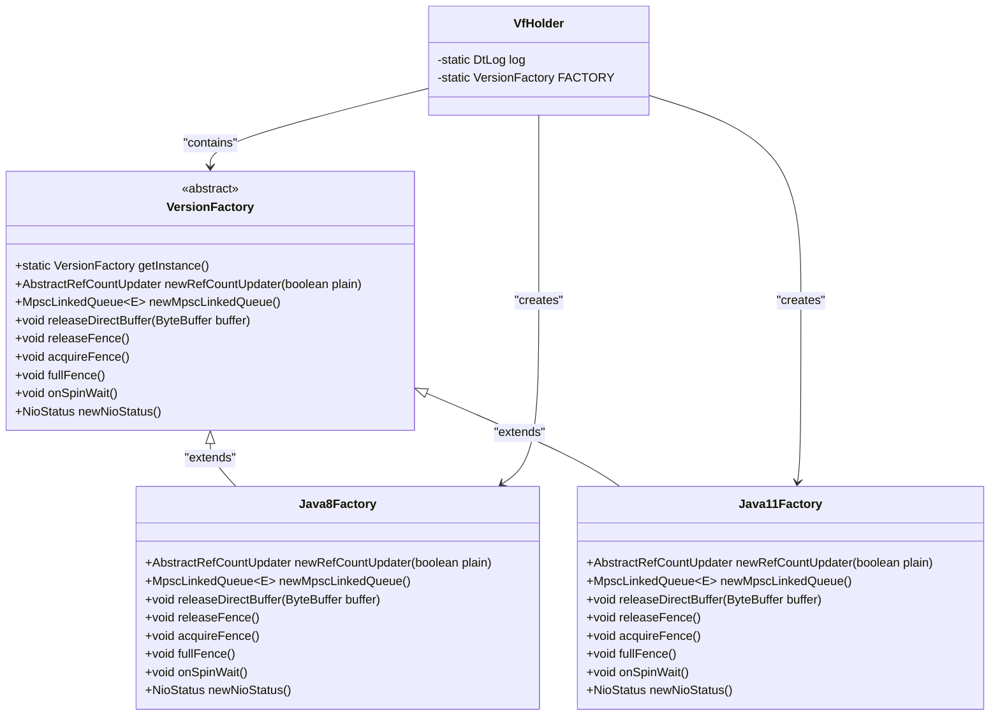

# Zero-Dependency Architecture

<cite>
**Referenced Files in This Document**   
- [README.md](file://README.md)
- [DtLogs.java](file://client/src/main/java/com/github/dtprj/dongting/log/DtLogs.java)
- [Slf4jFactory.java](file://client/src/main/java/com/github/dtprj/dongting/log/Slf4jFactory.java)
- [JdkFactory.java](file://client/src/main/java/com/github/dtprj/dongting/log/JdkFactory.java)
- [IntObjMap.java](file://client/src/main/java/com/github/dtprj/dongting/common/IntObjMap.java)
- [MpscLinkedQueue.java](file://client/src/main/java/com/github/dtprj/dongting/queue/MpscLinkedQueue.java)
- [VersionFactory.java](file://client/src/main/java/com/github/dtprj/dongting/common/VersionFactory.java)
- [Java8MpscLinkedQueue.java](file://client/src/main/java/com/github/dtprj/dongting/java8/Java8MpscLinkedQueue.java)
- [Java11MpscLinkedQueue.java](file://client/src/main/java/com/github/dtprj/dongting/java11/Java11MpscLinkedQueue.java)
- [PerfCallback.java](file://client/src/main/java/com/github/dtprj/dongting/common/PerfCallback.java)
- [DtUnsafe.java](file://client/src/main/java/com/github/dtprj/dongting/unsafe/DtUnsafe.java)
- [pom.xml](file://pom.xml)
</cite>

## Table of Contents
1. [Introduction](#introduction)
2. [Zero-Dependency Design Philosophy](#zero-dependency-design-philosophy)
3. [Core Internal Implementations](#core-internal-implementations)
4. [Conditional SLF4J Integration](#conditional-slf4j-integration)
5. [Performance-Oriented Data Structures](#performance-oriented-data-structures)
6. [Version-Specific Optimizations](#version-specific-optimizations)
7. [Trade-offs and Design Considerations](#trade-offs-and-design-considerations)
8. [Impact on Deployment and Maintenance](#impact-on-deployment-and-maintenance)
9. [Testing and Performance Validation](#testing-and-performance-validation)
10. [Integration Guidelines](#integration-guidelines)
11. [Conclusion](#conclusion)

## Introduction
Dongting is a high-performance engine that integrates RAFT consensus, distributed configuration, messaging queues, and low-level RPC functionality in a zero-dependency architecture. The project's core philosophy centers on minimizing deployment footprint, eliminating version conflicts, and improving startup performance by avoiding external dependencies. This documentation explores the architectural decisions behind Dongting's zero-dependency design, detailing how core functionality is implemented internally and the benefits this approach provides for embedding in resource-constrained environments and simplifying dependency management in complex applications.

**Section sources**
- [README.md](file://README.md)

## Zero-Dependency Design Philosophy
Dongting's zero-dependency architecture is a deliberate design choice aimed at addressing common challenges in Java application deployment and maintenance. By eliminating external dependencies, Dongting achieves a minimal deployment footprint of less than 1MB for both client and server components combined. This approach eliminates transitive dependency conflicts that often plague complex applications, ensuring predictable behavior across different deployment environments.

The design philosophy prioritizes self-containment and reliability, allowing Dongting to be easily embedded into existing applications without introducing dependency conflicts. This is particularly valuable in microservices architectures where different services may rely on conflicting versions of the same libraries. Dongting's approach ensures compatibility with Java 8 for the client and Java 11 for the server, without requiring specialized hardware or kernel parameter adjustments.

The zero-dependency model also contributes to faster startup times, as there are no additional JAR files to load or initialize. This makes Dongting suitable for serverless environments and other scenarios where cold start performance is critical. The architecture demonstrates that high-performance distributed systems can be built without relying on extensive third-party libraries, challenging the common assumption that complex functionality requires complex dependency graphs.

**Section sources**
- [README.md](file://README.md)

## Core Internal Implementations
Dongting implements essential functionality internally rather than relying on external libraries. This includes custom collections, logging abstraction, and embedded data structures that are optimized for the specific use cases within the system.

### Custom Collections Framework
The project includes internally developed collection classes such as `IntObjMap` and `LongObjMap` that provide specialized performance characteristics for the application's needs. The `IntObjMap` implementation provides a hash map specifically optimized for integer keys, using open addressing with linked chaining to handle collisions. This custom implementation allows for fine-tuned performance optimizations that might not be available in general-purpose collection libraries.

```mermaid
classDiagram
class IntObjMap~V~ {
+float loadFactor
+IntMapNode[] values
+int size
+int resizeThreshold
+IntObjMap()
+IntObjMap(int initSize, float loadFactor)
+V get(int key)
+V put(int key, V value)
+V remove(int key)
+int size()
+void forEach(Visitor~V~ visitor)
+void forEach(ReadOnlyVisitor~V~ visitor)
}
class IntMapNode~V~ {
+int key
+V value
+IntMapNode~V~ next
+IntMapNode(int key, V value)
+int getKey()
+V getValue()
+void setValue(V value)
+IntMapNode~V~ getNext()
+void setNext(IntMapNode~V~ next)
}
class IntObjMap : : Visitor~V~ {
<<interface>>
+boolean visit(int key, V value)
}
class IntObjMap : : ReadOnlyVisitor~V~ {
<<interface>>
+void visit(int key, V value)
}
IntObjMap~V~ --> IntMapNode~V~ : "contains"
IntObjMap~V~ --> IntObjMap : : Visitor~V~ : "uses"
IntObjMap~V~ --> IntObjMap : : ReadOnlyVisitor~V~ : "uses"
```

**Diagram sources**
- [IntObjMap.java](file://client/src/main/java/com/github/dtprj/dongting/common/IntObjMap.java)
- [IntMapNode.java](file://client/src/main/java/com/github/dtprj/dongting/common/IntMapNode.java)

### Logging Abstraction Layer
Dongting implements a logging abstraction layer that provides flexibility while maintaining the zero-dependency principle. The system uses JDK logging as the default implementation but can seamlessly integrate with SLF4J when available in the classpath. This approach ensures that applications can use their preferred logging framework without requiring Dongting to include SLF4J as a mandatory dependency.

The logging system is built around the `DtLog` interface and `DtLogFactory` abstraction, with concrete implementations for both JDK logging (`JdkLog`, `JdkFactory`) and SLF4J (`Slf4jLog`, `Slf4jFactory`). The factory pattern allows for runtime determination of the appropriate logging implementation based on classpath availability.



**Diagram sources**
- [DtLogs.java](file://client/src/main/java/com/github/dtprj/dongting/log/DtLogs.java)
- [DtLogFactory.java](file://client/src/main/java/com/github/dtprj/dongting/log/DtLogFactory.java)
- [JdkFactory.java](file://client/src/main/java/com/github/dtprj/dongting/log/JdkFactory.java)
- [Slf4jFactory.java](file://client/src/main/java/com/github/dtprj/dongting/log/Slf4jFactory.java)
- [JdkLog.java](file://client/src/main/java/com/github/dtprj/dongting/log/JdkLog.java)
- [Slf4jLog.java](file://client/src/main/java/com/github/dtprj/dongting/log/Slf4jLog.java)

**Section sources**
- [DtLogs.java](file://client/src/main/java/com/github/dtprj/dongting/log/DtLogs.java)
- [IntObjMap.java](file://client/src/main/java/com/github/dtprj/dongting/common/IntObjMap.java)

## Conditional SLF4J Integration
Dongting implements a conditional dependency mechanism for SLF4J integration that exemplifies its zero-dependency philosophy. Rather than including SLF4J as a required dependency, the system detects the presence of SLF4J classes at runtime and uses them if available, falling back to JDK logging otherwise.

The integration is implemented through the `Slf4jFactory` class, which includes a static method `slf4jExists()` that attempts to load the SLF4J Logger class using `Class.forName()`. If the class is found, the factory returns SLF4J-based loggers; otherwise, it defaults to the JDK logging implementation. This approach allows applications that already use SLF4J to integrate Dongting seamlessly while maintaining complete independence from SLF4J for applications that don't use it.

This conditional integration strategy provides the best of both worlds: applications can leverage their existing logging infrastructure and configuration when desired, while Dongting remains completely self-contained and free from mandatory external dependencies. The implementation is transparent to users, requiring no configuration to enable or disable SLF4J integration.



**Diagram sources**
- [DtLogs.java](file://client/src/main/java/com/github/dtprj/dongting/log/DtLogs.java)
- [Slf4jFactory.java](file://client/src/main/java/com/github/dtprj/dongting/log/Slf4jFactory.java)
- [JdkFactory.java](file://client/src/main/java/com/github/dtprj/dongting/log/JdkFactory.java)

**Section sources**
- [DtLogs.java](file://client/src/main/java/com/github/dtprj/dongting/log/DtLogs.java)
- [Slf4jFactory.java](file://client/src/main/java/com/github/dtprj/dongting/log/Slf4jFactory.java)

## Performance-Oriented Data Structures
Dongting includes several high-performance data structures specifically designed for its use cases, with a focus on minimizing allocation and maximizing throughput in concurrent scenarios.

### Multi-Producer Single-Consumer Queue
The `MpscLinkedQueue` implementation provides a high-performance queue optimized for scenarios with multiple producers and a single consumer. This data structure is critical for Dongting's performance, as it enables efficient message passing between components with minimal contention.

The implementation uses a linked node structure with atomic operations for thread safety. It includes sophisticated shutdown logic that ensures all elements offered before the shutdown signal are processed, while preventing new elements from being added after shutdown. The queue uses different atomic operation strategies based on the Java version, leveraging VarHandles in Java 11+ for improved performance.



**Diagram sources**
- [MpscLinkedQueue.java](file://client/src/main/java/com/github/dtprj/dongting/queue/MpscLinkedQueue.java)
- [LinkedNode.java](file://client/src/main/java/com/github/dtprj/dongting/queue/LinkedNode.java)
- [Java8MpscLinkedQueue.java](file://client/src/main/java/com/github/dtprj/dongting/java8/Java8MpscLinkedQueue.java)
- [Java11MpscLinkedQueue.java](file://client/src/main/java/com/github/dtprj/dongting/java11/Java11MpscLinkedQueue.java)

### Performance Callback System
Dongting includes a performance monitoring system implemented in the `PerfCallback` class, which allows for detailed performance measurement without introducing external dependencies. The system supports both millisecond and nanosecond precision timing, with configurable performance event types.

The implementation uses a callback pattern that allows different performance monitoring strategies to be plugged in, from simple logging to integration with external monitoring systems. This approach provides flexibility while maintaining the zero-dependency principle, as the core performance measurement functionality is self-contained.

**Section sources**
- [MpscLinkedQueue.java](file://client/src/main/java/com/github/dtprj/dongting/queue/MpscLinkedQueue.java)
- [PerfCallback.java](file://client/src/main/java/com/github/dtprj/dongting/common/PerfCallback.java)

## Version-Specific Optimizations
Dongting employs a sophisticated version-specific optimization strategy that allows it to leverage the best available features on different Java versions while maintaining compatibility across versions.

### Version Factory Pattern
The `VersionFactory` class serves as a central point for creating version-specific implementations of various components. At startup, the factory determines the Java version and selects the appropriate implementation class. This allows Dongting to use Java 8-compatible atomic operations on older JVMs while taking advantage of VarHandles and other modern features on Java 11+.

The factory pattern is implemented through a static holder class (`VfHolder`) that initializes the appropriate factory instance based on the Java version. This approach ensures that only the necessary classes are loaded and that the optimal implementation is used for the current environment.



**Diagram sources**
- [VersionFactory.java](file://client/src/main/java/com/github/dtprj/dongting/common/VersionFactory.java)
- [Java8Factory.java](file://client/src/main/java/com/github/dtprj/dongting/java8/Java8Factory.java)
- [Java11Factory.java](file://client/src/main/java/com/github/dtprj/dongting/java11/Java11Factory.java)

### Memory Management and Unsafe Operations
For low-level memory operations, Dongting uses the `DtUnsafe` class to provide access to JVM-level operations while maintaining compatibility across Java versions. The implementation uses reflection to access the `sun.misc.Unsafe` class, providing methods for memory barriers and direct buffer management.

On Java 11+, the implementation can use `invokeCleaner` to properly release direct buffers, while on Java 8 it relies on alternative approaches. This version-specific handling ensures optimal performance and proper resource management across different JVM versions.

**Section sources**
- [VersionFactory.java](file://client/src/main/java/com/github/dtprj/dongting/common/VersionFactory.java)
- [DtUnsafe.java](file://client/src/main/java/com/github/dtprj/dongting/unsafe/DtUnsafe.java)

## Trade-offs and Design Considerations
The zero-dependency design of Dongting involves several important trade-offs that balance the benefits of self-containment against the costs of maintaining internal implementations.

### Benefits of Zero Dependencies
The primary benefits of Dongting's zero-dependency approach include:
- **Minimal deployment footprint**: The entire library is less than 1MB, making it ideal for containerized environments and serverless architectures
- **Elimination of version conflicts**: By avoiding external dependencies, Dongting cannot conflict with other libraries in the application classpath
- **Predictable behavior**: The system behaves consistently across different environments without being affected by dependency resolution differences
- **Simplified embedding**: The library can be easily embedded in existing applications without requiring dependency management changes
- **Faster startup times**: With fewer JAR files to load, applications using Dongting start more quickly

### Costs and Maintenance Considerations
The zero-dependency approach also introduces several costs and maintenance considerations:
- **Increased maintenance burden**: The project must maintain its own implementations of functionality that could otherwise be provided by established libraries
- **Limited feature scope**: Internal implementations may not have the same breadth of features as mature third-party libraries
- **Testing responsibility**: The project must thoroughly test all internal implementations, rather than relying on the testing performed by library maintainers
- **Knowledge requirements**: Developers must understand both the application logic and the internal implementations of core utilities

Despite these costs, the design decisions appear justified by the project's performance goals and target use cases. The internal implementations are focused on specific, performance-critical functionality rather than attempting to recreate comprehensive utility libraries.

**Section sources**
- [README.md](file://README.md)
- [pom.xml](file://pom.xml)

## Impact on Deployment and Maintenance
Dongting's zero-dependency architecture has significant implications for deployment and maintenance in production environments.

### Deployment Advantages
The minimal footprint and lack of transitive dependencies make Dongting particularly well-suited for modern deployment scenarios:
- **Container optimization**: The small size reduces container image sizes and improves pull times
- **Serverless compatibility**: Fast startup times and small memory footprint are ideal for function-as-a-service platforms
- **Embedded scenarios**: The library can be easily embedded in applications without affecting their dependency graph
- **Multi-tenancy**: Different applications can use different versions of Dongting without conflict

### Maintenance Considerations
While the zero-dependency approach simplifies some aspects of maintenance, it introduces others:
- **Version upgrades**: Applications can upgrade Dongting independently of other dependencies
- **Security patching**: Security vulnerabilities must be addressed within Dongting rather than relying on external library updates
- **Compatibility testing**: The project must ensure compatibility with various JVM versions and configurations
- **Documentation requirements**: Users need clear documentation of the internal implementations and their behavior

The architecture shifts some maintenance responsibilities from the application developer to the Dongting maintainers, which can be beneficial for organizations that prefer to minimize the number of external dependencies they must manage.

**Section sources**
- [README.md](file://README.md)

## Testing and Performance Validation
Dongting includes comprehensive testing and performance validation to ensure the reliability and performance of its internal implementations.

### Benchmarking Infrastructure
The project includes a dedicated benchmark module that provides performance testing for key components. This infrastructure allows for continuous performance monitoring and optimization, ensuring that the internal implementations meet the project's performance goals.

The benchmarks cover critical functionality such as:
- Queue performance under various load conditions
- RPC throughput and latency
- RAFT consensus performance with different storage configurations
- Memory usage patterns under sustained load

### Testing Strategy
The testing strategy for Dongting's internal implementations includes:
- Unit tests for individual components
- Integration tests for component interactions
- Performance regression tests
- Concurrency stress tests
- Cross-version compatibility tests

This comprehensive testing approach helps ensure that the internal implementations are reliable and performant, compensating for the lack of external library testing.

**Section sources**
- [README.md](file://README.md)

## Integration Guidelines
When integrating Dongting into applications with existing dependency ecosystems, several guidelines should be followed to maximize the benefits of its zero-dependency design.

### Dependency Management
- **Avoid unnecessary exclusions**: Since Dongting has no mandatory dependencies, there is no need to exclude transitive dependencies
- **Leverage conditional SLF4J integration**: If the application already uses SLF4J, ensure it is available in the classpath to enable integration
- **Consider version compatibility**: Ensure the Dongting version is compatible with the target JVM version

### Configuration and Tuning
- **Logging configuration**: Configure the chosen logging framework (JDK or SLF4J) appropriately for the environment
- **Performance tuning**: Adjust configuration parameters based on the specific use case and performance requirements
- **Resource management**: Monitor and tune memory usage, particularly for direct buffers and object pools

### Best Practices
- **Embedding strategy**: Consider whether to embed Dongting components directly or use them as standalone services
- **Monitoring integration**: Integrate Dongting's performance metrics with existing monitoring systems
- **Upgrade planning**: Plan upgrades to take advantage of performance improvements in newer versions

**Section sources**
- [README.md](file://README.md)

## Conclusion
Dongting's zero-dependency architecture represents a thoughtful approach to building high-performance distributed systems. By implementing core functionality internally and avoiding external dependencies, the project achieves a minimal footprint, eliminates version conflicts, and improves startup performance. The conditional integration with SLF4J demonstrates a balanced approach that provides flexibility without compromising the zero-dependency principle.

The internal implementations of collections, logging, and data structures are carefully optimized for the specific use cases within the system, demonstrating that reinventing components can be justified when it serves clear performance and reliability goals. The version-specific optimizations show how a library can leverage modern JVM features while maintaining compatibility with older versions.

This architectural approach makes Dongting particularly well-suited for embedding in resource-constrained environments and simplifies dependency management in complex applications. While it introduces maintenance responsibilities for the project maintainers, it reduces dependency management complexity for users. The design serves as an example of how careful architectural decisions can create systems that are both high-performing and easy to deploy and maintain.