# Client API Reference

<cite>
**Referenced Files in This Document**   
- [KvClient.java](file://client/src/main/java/com/github/dtprj/dongting/dtkv/KvClient.java)
- [NioClient.java](file://client/src/main/java/com/github/dtprj/dongting/net/NioClient.java)
- [AutoRenewalLock.java](file://client/src/main/java/com/github/dtprj/dongting/dtkv/AutoRenewalLock.java)
- [DistributedLock.java](file://client/src/main/java/com/github/dtprj/dongting/dtkv/DistributedLock.java)
- [KvClientConfig.java](file://client/src/main/java/com/github/dtprj/dongting/dtkv/KvClientConfig.java)
- [NioClientConfig.java](file://client/src/main/java/com/github/dtprj/dongting/net/NioClientConfig.java)
- [WatchManager.java](file://client/src/main/java/com/github/dtprj/dongting/dtkv/WatchManager.java)
- [LockManager.java](file://client/src/main/java/com/github/dtprj/dongting/dtkv/LockManager.java)
- [KvReq.java](file://client/src/main/java/com/github/dtprj/dongting/dtkv/KvReq.java)
- [KvResp.java](file://client/src/main/java/com/github/dtprj/dongting/dtkv/KvResp.java)
- [AutoRenewalLockImpl.java](file://client/src/main/java/com/github/dtprj/dongting/dtkv/AutoRenewalLockImpl.java)
- [DistributedLockImpl.java](file://client/src/main/java/com/github/dtprj/dongting/dtkv/DistributedLockImpl.java)
- [KvListener.java](file://client/src/main/java/com/github/dtprj/dongting/dtkv/KvListener.java)
- [WatchEvent.java](file://client/src/main/java/com/github/dtprj/dongting/dtkv/WatchEvent.java)
- [KvNode.java](file://client/src/main/java/com/github/dtprj/dongting/dtkv/KvNode.java)
</cite>

## Table of Contents
1. [Introduction](#introduction)
2. [KvClient API](#kvclient-api)
3. [NioClient Configuration](#nioclient-configuration)
4. [Distributed Locks](#distributed-locks)
5. [Watch Management](#watch-management)
6. [Configuration Options](#configuration-options)
7. [Thread Safety and Connection Management](#thread-safety-and-connection-management)
8. [Error Handling](#error-handling)
9. [Code Examples](#code-examples)
10. [Performance and Tuning](#performance-and-tuning)

## Introduction
The Dongting client provides a comprehensive API for distributed key-value operations, offering linearizable read operations and robust coordination primitives. The client interface is designed for high performance and reliability in distributed systems, with support for connection pooling, failover mechanisms, and efficient resource management.

The core component is the KvClient class, which serves as the primary entry point for all distributed operations. It manages connections to the Dongting cluster through an underlying NioClient, handles lifecycle management, and provides access to distributed coordination features including locks and watches.

This documentation covers the complete client-side interface, detailing the API for key-value operations, distributed locks, watch registration, and configuration options. The client supports both synchronous and asynchronous operations, allowing developers to choose the appropriate pattern for their use case.

**Section sources**
- [KvClient.java](file://client/src/main/java/com/github/dtprj/dongting/dtkv/KvClient.java#L1-L771)

## KvClient API

The KvClient class provides a comprehensive interface for distributed key-value operations, supporting both synchronous and asynchronous patterns. It extends AbstractLifeCircle, inheriting start() and stop() lifecycle methods for connection management.

### Connection Lifecycle
The KvClient manages its connection lifecycle through the inherited start() and stop() methods from AbstractLifeCircle. When starting, it initializes the underlying RaftClient and establishes connections to the cluster. The client automatically handles reconnection and failover to available servers.

```mermaid
graph TD
A[Create KvClient] --> B[Call start()]
B --> C[Establish Connections]
C --> D[Ready for Operations]
D --> E[Perform KV Operations]
E --> F[Call stop() to Close]
```

**Diagram sources**
- [KvClient.java](file://client/src/main/java/com/github/dtprj/dongting/dtkv/KvClient.java#L742-L761)

### Key-Value Operations
The KvClient provides a rich set of operations for managing key-value pairs in the distributed store. All operations use a groupId parameter to specify the Raft group in which the operation should be performed.

#### Put Operations
The put operations allow storing key-value pairs in the distributed store. There are both permanent and temporary variants, with the latter supporting time-to-live (TTL) semantics.

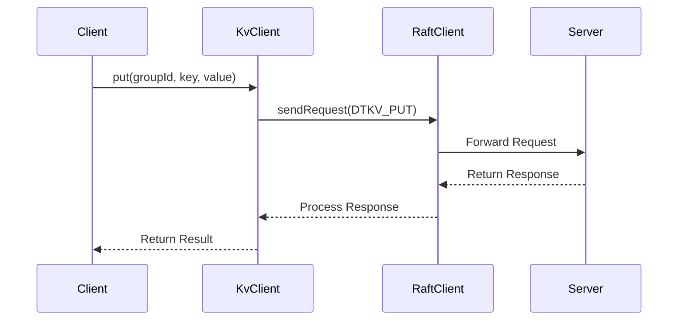

**Diagram sources**
- [KvClient.java](file://client/src/main/java/com/github/dtprj/dongting/dtkv/KvClient.java#L237-L258)

#### Get and List Operations
The get operation retrieves a key-value pair from the store, returning a KvNode containing the value and metadata. The list operation returns all children of a directory node.

```mermaid
flowchart TD
A[Client calls get()] --> B{Key exists?}
B --> |Yes| C[Return KvNode with data]
B --> |No| D[Return null]
E[Client calls list()] --> F{Directory exists?}
F --> |Yes| G[Return list of KvResult]
F --> |No| H[Throw PARENT_NOT_DIR exception]
```

**Diagram sources**
- [KvClient.java](file://client/src/main/java/com/github/dtprj/dongting/dtkv/KvClient.java#L312-L329)

#### Remove Operations
The remove operation deletes a key from the store. For temporary nodes, only the client that created the node can remove it. For permanent nodes, any client can remove them.

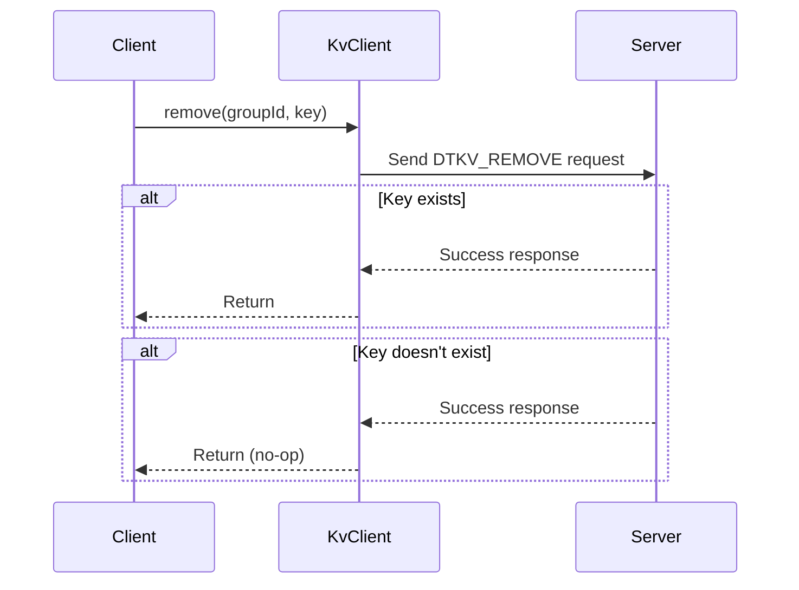

**Diagram sources**
- [KvClient.java](file://client/src/main/java/com/github/dtprj/dongting/dtkv/KvClient.java#L390-L411)

#### Batch Operations
The client supports batch operations for improved performance when multiple keys need to be processed. These include batchPut, batchGet, and batchRemove operations.

```mermaid
flowchart TD
A[Client calls batchPut()] --> B[Validate all keys]
B --> C[Create KvReq with multiple keys]
C --> D[Send single request to server]
D --> E[Server processes all operations]
E --> F[Return list of KvResult]
```

**Diagram sources**
- [KvClient.java](file://client/src/main/java/com/github/dtprj/dongting/dtkv/KvClient.java#L498-L517)

#### Compare-and-Set Operations
The compareAndSet operation provides atomic conditional updates, allowing operations to be performed only if the current value matches an expected value.

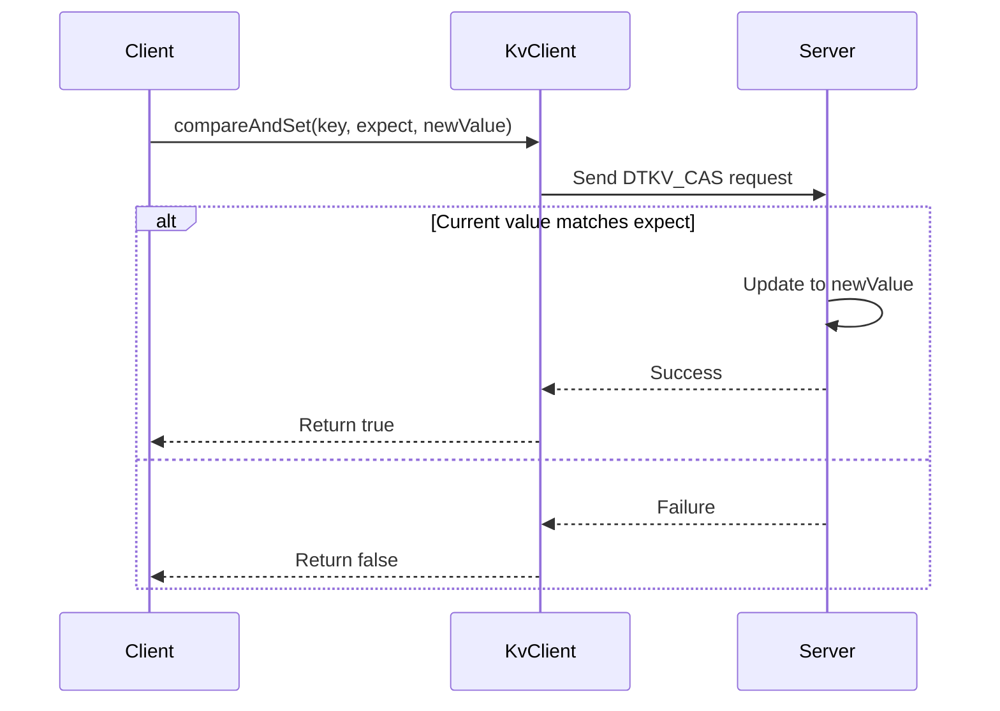

**Diagram sources**
- [KvClient.java](file://client/src/main/java/com/github/dtprj/dongting/dtkv/KvClient.java#L622-L650)

**Section sources**
- [KvClient.java](file://client/src/main/java/com/github/dtprj/dongting/dtkv/KvClient.java#L1-L771)
- [KvReq.java](file://client/src/main/java/com/github/dtprj/dongting/dtkv/KvReq.java#L1-L267)
- [KvResp.java](file://client/src/main/java/com/github/dtprj/dongting/dtkv/KvResp.java#L1-L122)

## NioClient Configuration

The NioClient class manages network connections for the Dongting client, providing configuration options for connection management, timeouts, and performance tuning.

### Configuration Options
The NioClientConfig class provides several configuration parameters for tuning client behavior:

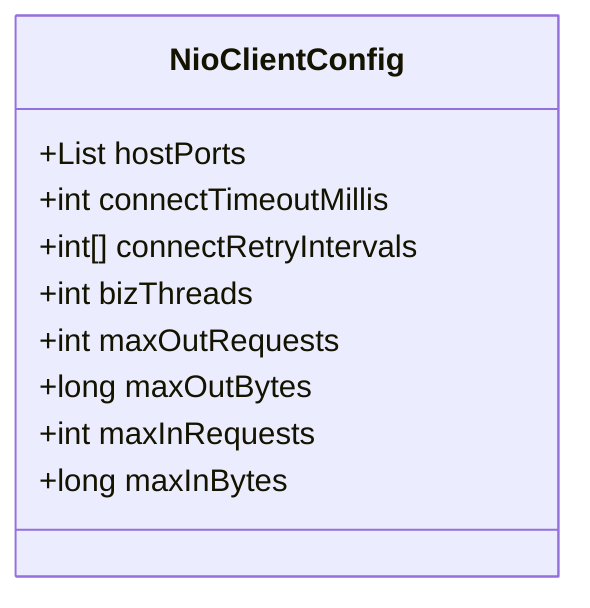

**Diagram sources**
- [NioClientConfig.java](file://client/src/main/java/com/github/dtprj/dongting/net/NioClientConfig.java#L1-L44)

### Connection Management
The NioClient handles connection establishment, monitoring, and failover. It maintains connections to multiple servers and automatically reconnects when connections are lost.

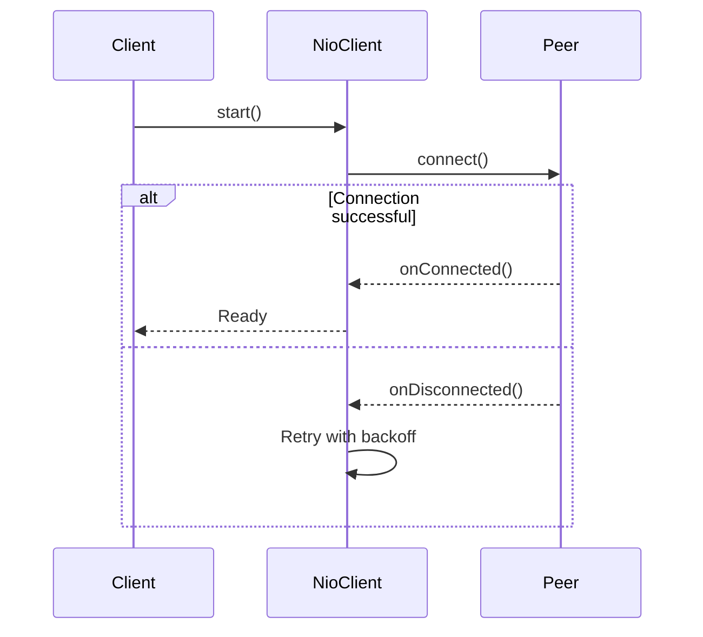

**Diagram sources**
- [NioClient.java](file://client/src/main/java/com/github/dtprj/dongting/net/NioClient.java#L1-L363)

### Dynamic Peer Management
The client supports dynamic addition and removal of peers at runtime, allowing for flexible cluster management.

```mermaid
flowchart TD
A[Client calls addPeer()] --> B[NioClient validates peer]
B --> C[Add to peers list]
C --> D[Initiate connection]
D --> E[Monitor connection status]
F[Client calls removePeer()] --> G[Close connection]
G --> H[Remove from peers list]
H --> I[Clean up resources]
```

**Diagram sources**
- [NioClient.java](file://client/src/main/java/com/github/dtprj/dongting/net/NioClient.java#L216-L274)

**Section sources**
- [NioClient.java](file://client/src/main/java/com/github/dtprj/dongting/net/NioClient.java#L1-L363)
- [NioClientConfig.java](file://client/src/main/java/com/github/dtprj/dongting/net/NioClientConfig.java#L1-L44)

## Distributed Locks

The Dongting client provides two types of distributed locks: DistributedLock and AutoRenewalLock, both managed through the LockManager.

### DistributedLock Interface
The DistributedLock interface provides basic distributed locking capabilities with lease-based ownership.

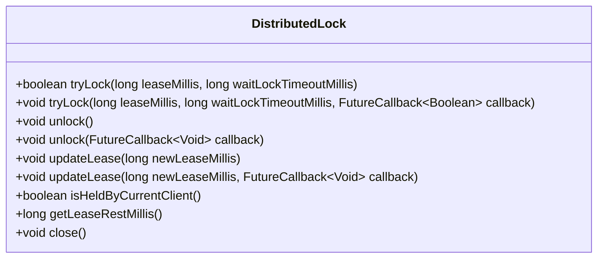

**Diagram sources**
- [DistributedLock.java](file://client/src/main/java/com/github/dtprj/dongting/dtkv/DistributedLock.java#L1-L153)

### AutoRenewalLock Interface
The AutoRenewalLock provides automatic lease renewal, making it suitable for leader election scenarios.

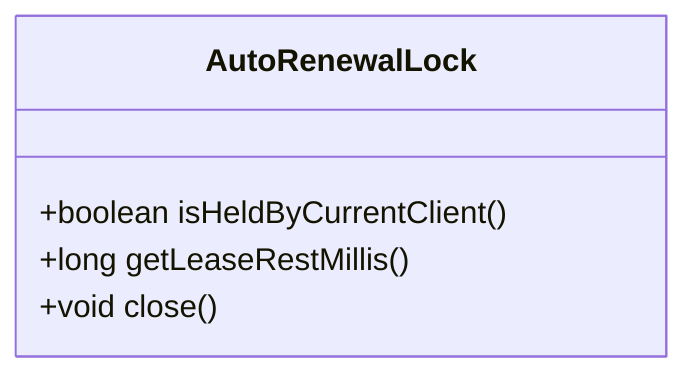

**Diagram sources**
- [AutoRenewalLock.java](file://client/src/main/java/com/github/dtprj/dongting/dtkv/AutoRenewalLock.java#L1-L68)

### Lock Lifecycle
The lock lifecycle involves creation, acquisition, maintenance, and release.

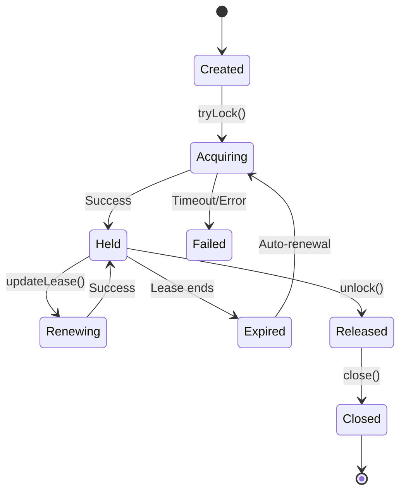

**Diagram sources**
- [DistributedLockImpl.java](file://client/src/main/java/com/github/dtprj/dongting/dtkv/DistributedLockImpl.java#L1-L652)
- [AutoRenewalLockImpl.java](file://client/src/main/java/com/github/dtprj/dongting/dtkv/AutoRenewalLockImpl.java#L1-L228)

### Lock States
The distributed lock implementation maintains several states to track its current condition.

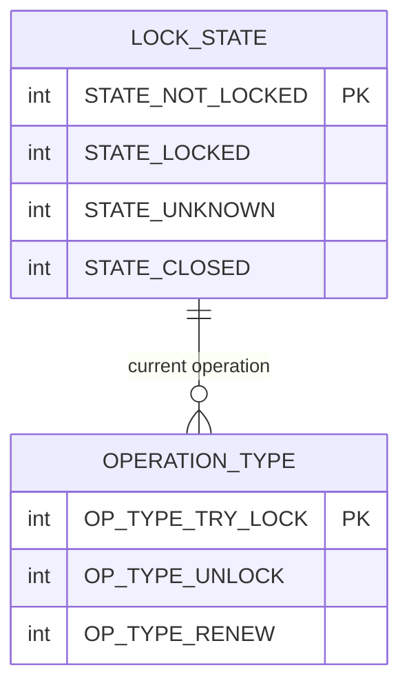

**Diagram sources**
- [DistributedLockImpl.java](file://client/src/main/java/com/github/dtprj/dongting/dtkv/DistributedLockImpl.java#L48-L52)

**Section sources**
- [DistributedLock.java](file://client/src/main/java/com/github/dtprj/dongting/dtkv/DistributedLock.java#L1-L153)
- [AutoRenewalLock.java](file://client/src/main/java/com/github/dtprj/dongting/dtkv/AutoRenewalLock.java#L1-L68)
- [LockManager.java](file://client/src/main/java/com/github/dtprj/dongting/dtkv/LockManager.java#L1-L216)
- [DistributedLockImpl.java](file://client/src/main/java/com/github/dtprj/dongting/dtkv/DistributedLockImpl.java#L1-L652)
- [AutoRenewalLockImpl.java](file://client/src/main/java/com/github/dtprj/dongting/dtkv/AutoRenewalLockImpl.java#L1-L228)

## Watch Management

The watch system allows clients to receive notifications when keys change in the distributed store.

### Watch Lifecycle
The watch lifecycle involves registration, event delivery, and cleanup.

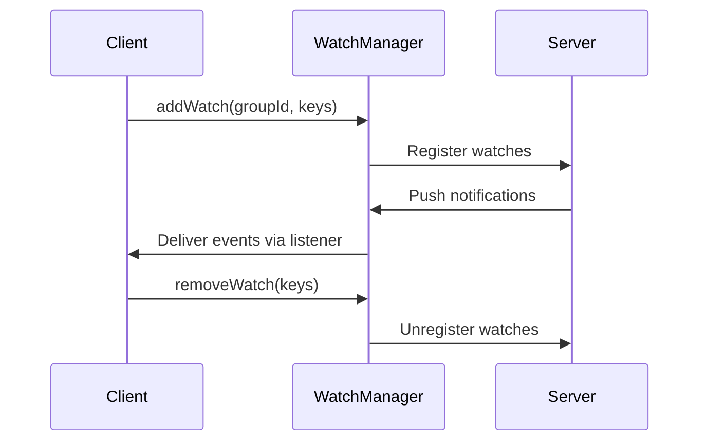

**Diagram sources**
- [WatchManager.java](file://client/src/main/java/com/github/dtprj/dongting/dtkv/WatchManager.java#L1-L717)

### Watch Event Processing
The WatchManager processes incoming notifications and delivers them to registered listeners.

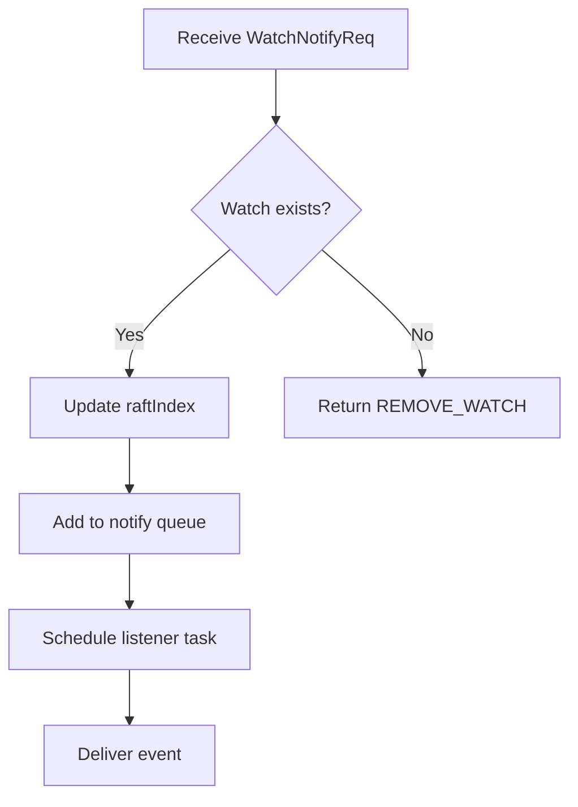

**Diagram sources**
- [WatchManager.java](file://client/src/main/java/com/github/dtprj/dongting/dtkv/WatchManager.java#L521-L562)

### Watch States
The watch system maintains state for each watched key.

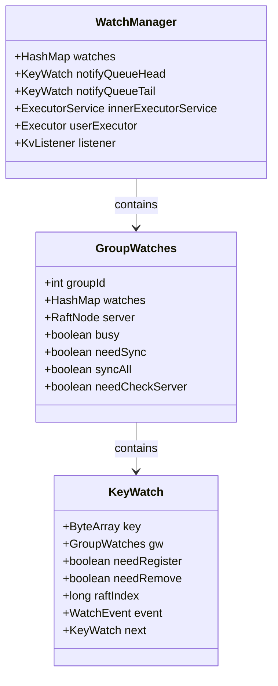

**Diagram sources**
- [WatchManager.java](file://client/src/main/java/com/github/dtprj/dongting/dtkv/WatchManager.java#L57-L109)

**Section sources**
- [WatchManager.java](file://client/src/main/java/com/github/dtprj/dongting/dtkv/WatchManager.java#L1-L717)
- [KvListener.java](file://client/src/main/java/com/github/dtprj/dongting/dtkv/KvListener.java#L1-L25)
- [WatchEvent.java](file://client/src/main/java/com/github/dtprj/dongting/dtkv/WatchEvent.java#L1-L41)

## Configuration Options

The client provides several configuration classes for tuning behavior.

### KvClientConfig
The KvClientConfig class contains settings specific to the key-value client.

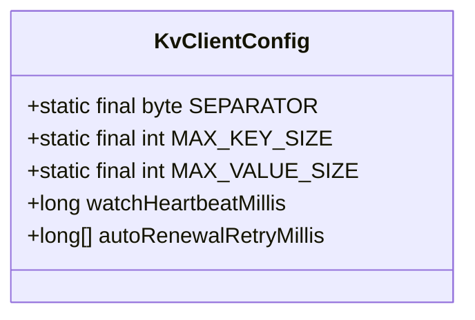

**Diagram sources**
- [KvClientConfig.java](file://client/src/main/java/com/github/dtprj/dongting/dtkv/KvClientConfig.java#L1-L32)

### NioClientConfig
The NioClientConfig class extends NioConfig with client-specific settings.

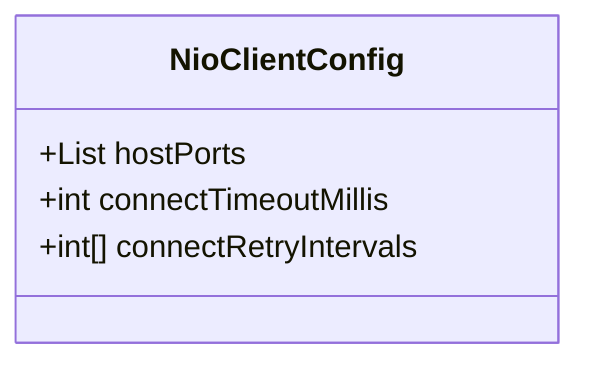

**Diagram sources**
- [NioClientConfig.java](file://client/src/main/java/com/github/dtprj/dongting/net/NioClientConfig.java#L1-L44)

**Section sources**
- [KvClientConfig.java](file://client/src/main/java/com/github/dtprj/dongting/dtkv/KvClientConfig.java#L1-L32)
- [NioClientConfig.java](file://client/src/main/java/com/github/dtprj/dongting/net/NioClientConfig.java#L1-L44)

## Thread Safety and Connection Management

The client is designed to be thread-safe and efficiently manage connections.

### Thread Safety
All public methods of KvClient and its components are thread-safe, allowing concurrent access from multiple threads.

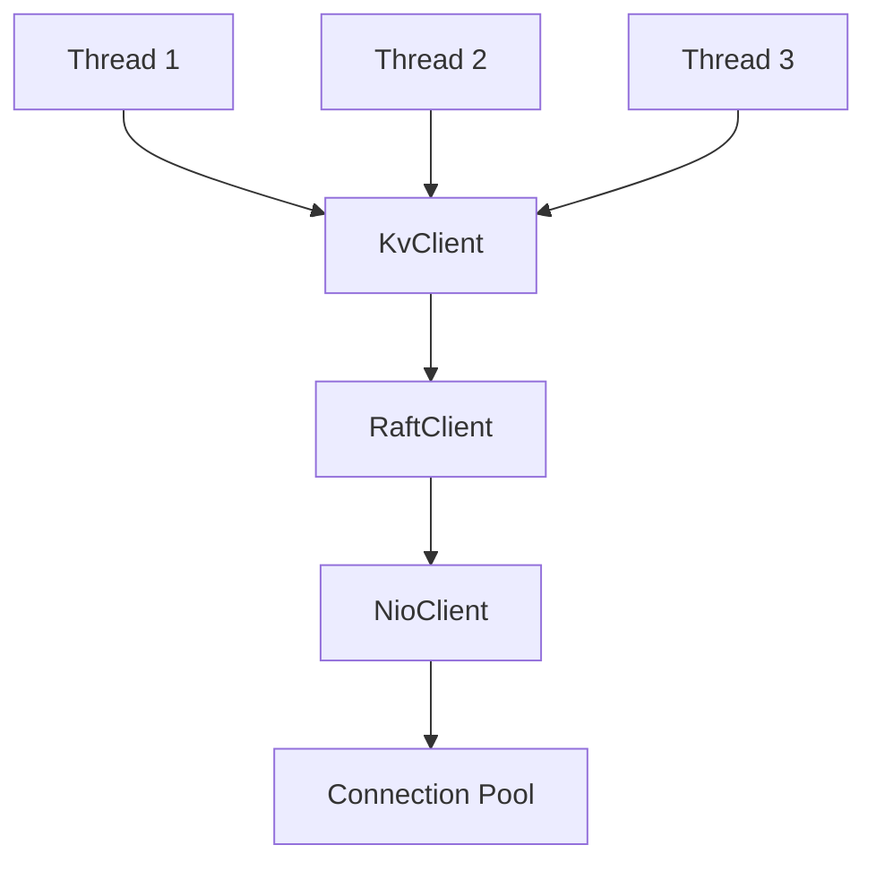

**Diagram sources**
- [KvClient.java](file://client/src/main/java/com/github/dtprj/dongting/dtkv/KvClient.java#L1-L771)

### Connection Pooling
The client maintains a pool of connections to multiple servers for high availability and load distribution.

```mermaid
erDiagram
CLIENT ||--o{ CONNECTION : "has"
CONNECTION }|--|| SERVER : "connects to"
CLIENT ||--o{ RAFT_GROUP : "accesses"
RAFT_GROUP ||--o{ SERVER : "contains"
class CLIENT {
KvClient
NioClient
}
class CONNECTION {
DtChannel
Peer
}
class SERVER {
HostPort
nodeId
}
```

**Diagram sources**
- [NioClient.java](file://client/src/main/java/com/github/dtprj/dongting/net/NioClient.java#L1-L363)

**Section sources**
- [KvClient.java](file://client/src/main/java/com/github/dtprj/dongting/dtkv/KvClient.java#L1-L771)
- [NioClient.java](file://client/src/main/java/com/github/dtprj/dongting/net/NioClient.java#L1-L363)

## Error Handling

The client provides comprehensive error handling for various failure scenarios.

### Exception Hierarchy
The client uses a hierarchy of exceptions to distinguish between different error types.

```mermaid
classDiagram
class Exception
class DtException
class NetException
class NetTimeoutException
class KvException
class RaftException
Exception <|-- DtException
DtException <|-- NetException
NetException <|-- NetTimeoutException
DtException <|-- KvException
DtException <|-- RaftException
```

**Diagram sources**
- [KvClient.java](file://client/src/main/java/com/github/dtprj/dongting/dtkv/KvClient.java#L1-L771)

### Error Recovery
The client implements automatic recovery mechanisms for transient failures.

```mermaid
flowchart TD
A[Operation fails] --> B{Error type?}
B --> |Network| C[Retry with backoff]
B --> |Timeout| D[Fail fast]
B --> |Business logic| E[Return specific error]
C --> F[Reconnect if needed]
F --> G[Retry operation]
G --> H{Success?}
H --> |Yes| I[Return result]
H --> |No| J[Return error]
```

**Diagram sources**
- [KvClient.java](file://client/src/main/java/com/github/dtprj/dongting/dtkv/KvClient.java#L155-L165)

**Section sources**
- [KvClient.java](file://client/src/main/java/com/github/dtprj/dongting/dtkv/KvClient.java#L1-L771)

## Code Examples

### Basic Usage
```mermaid
sequenceDiagram
participant App
participant KvClient
participant Server
App->>KvClient : Create KvClient()
App->>KvClient : start()
KvClient->>Server : Connect
Server-->>KvClient : Connected
KvClient-->>App : Ready
App->>KvClient : put(groupId, key, value)
KvClient->>Server : Store key-value
Server-->>KvClient : Success
KvClient-->>App : Return
App->>KvClient : stop()
KvClient->>Server : Close connections
KvClient-->>App : Closed
```

**Diagram sources**
- [KvClient.java](file://client/src/main/java/com/github/dtprj/dongting/dtkv/KvClient.java#L1-L771)

### Distributed Lock Usage
```mermaid
sequenceDiagram
participant Client1
participant Client2
participant LockManager
Client1->>LockManager : createLock(groupId, key)
LockManager->>Client1 : Return DistributedLock
Client1->>Client1 : tryLock(lease, timeout)
Client1->>Server : Request lock
Server-->>Client1 : Granted
Client2->>LockManager : createLock(groupId, key)
Client2->>Client2 : tryLock(lease, timeout)
Client2->>Server : Request lock
Server-->>Client2 : Rejected
Client1->>Client1 : unlock()
Client1->>Server : Release lock
```

**Diagram sources**
- [DistributedLock.java](file://client/src/main/java/com/github/dtprj/dongting/dtkv/DistributedLock.java#L1-L153)

### Watch Usage
```mermaid
sequenceDiagram
participant Client
participant WatchManager
participant Server
Client->>WatchManager : setListener(listener, executor)
Client->>WatchManager : addWatch(groupId, key)
WatchManager->>Server : Register watch
Server->>Server : Key changes
Server->>WatchManager : Push notification
WatchManager->>Client : Deliver event
Client->>Client : Process event
Client->>WatchManager : removeWatch(key)
```

**Diagram sources**
- [WatchManager.java](file://client/src/main/java/com/github/dtprj/dongting/dtkv/WatchManager.java#L1-L717)

**Section sources**
- [KvClient.java](file://client/src/main/java/com/github/dtprj/dongting/dtkv/KvClient.java#L1-L771)
- [DistributedLock.java](file://client/src/main/java/com/github/dtprj/dongting/dtkv/DistributedLock.java#L1-L153)
- [WatchManager.java](file://client/src/main/java/com/github/dtprj/dongting/dtkv/WatchManager.java#L1-L717)

## Performance and Tuning

### Connection Settings
Optimize connection settings based on your network environment and performance requirements.

```mermaid
flowchart TD
A[High latency network] --> B[Increase connectTimeoutMillis]
C[High throughput requirement] --> D[Increase maxOutRequests]
D --> E[Increase maxOutBytes]
F[Memory constrained environment] --> G[Reduce bizThreads]
G --> H[Adjust maxInRequests]
```

**Diagram sources**
- [NioClientConfig.java](file://client/src/main/java/com/github/dtprj/dongting/net/NioClientConfig.java#L1-L44)

### Lock Performance
Tune lock parameters for optimal performance in your use case.

```mermaid
flowchart TD
A[High contention scenario] --> B[Increase leaseMillis]
B --> C[Set appropriate waitLockTimeoutMillis]
D[Low latency requirement] --> E[Reduce autoRenewalRetryMillis]
E --> F[Monitor lock acquisition time]
```

**Diagram sources**
- [KvClientConfig.java](file://client/src/main/java/com/github/dtprj/dongting/dtkv/KvClientConfig.java#L1-L32)

**Section sources**
- [NioClientConfig.java](file://client/src/main/java/com/github/dtprj/dongting/net/NioClientConfig.java#L1-L44)
- [KvClientConfig.java](file://client/src/main/java/com/github/dtprj/dongting/dtkv/KvClientConfig.java#L1-L32)