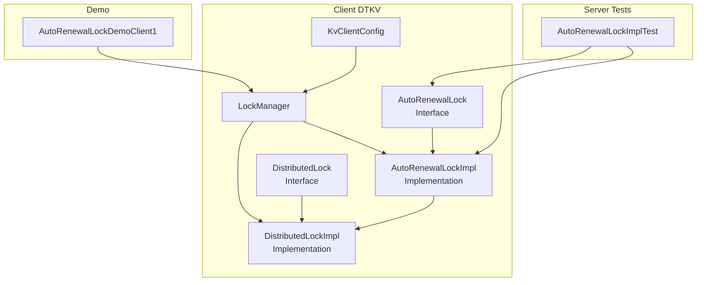
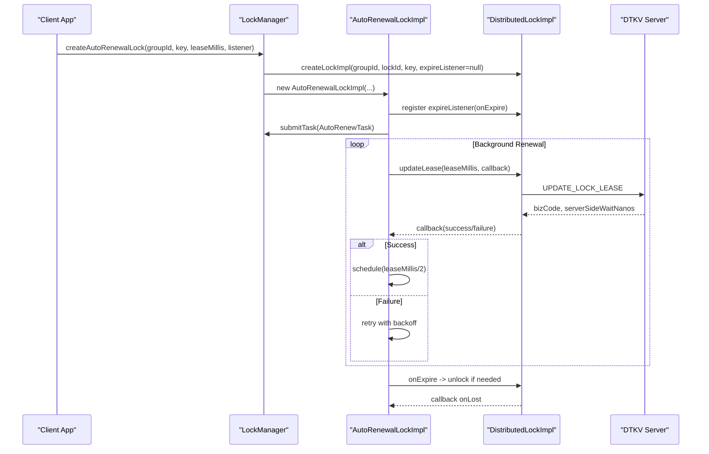
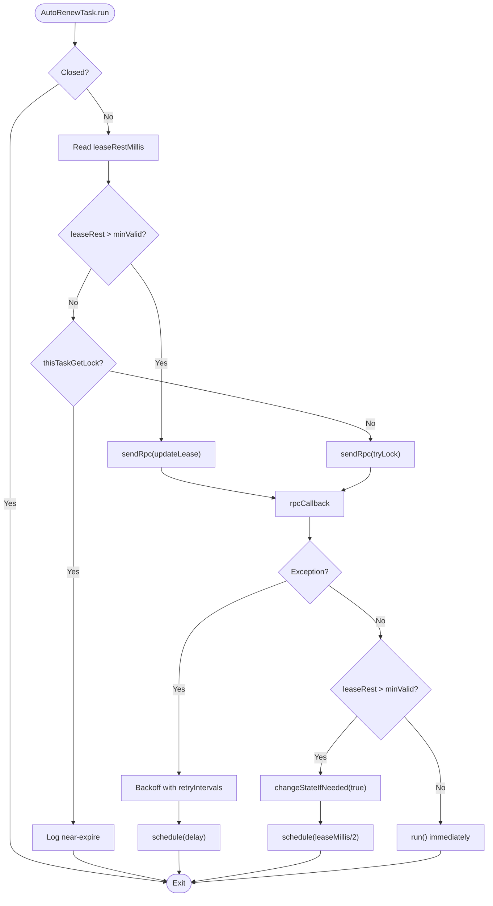
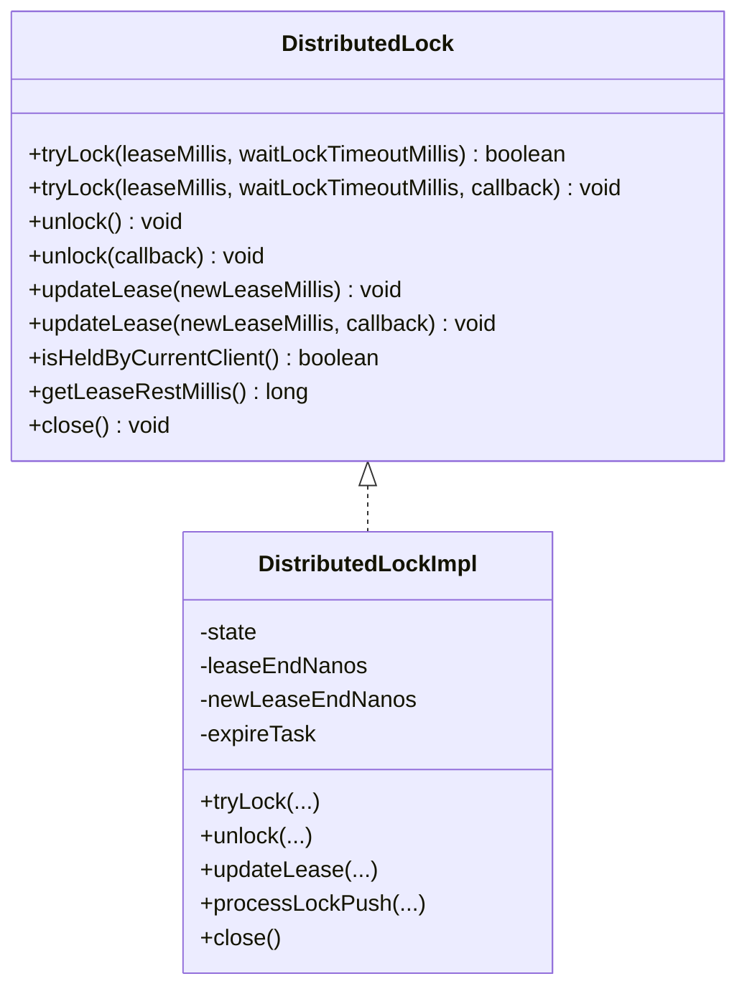
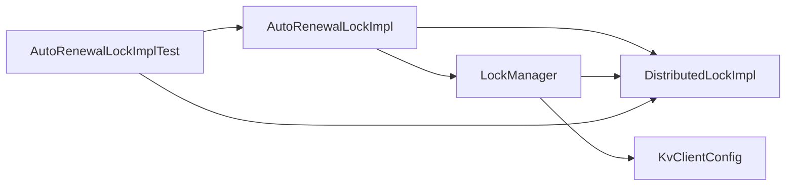

# Auto-Renewal Locks

<cite>
**Referenced Files in This Document**
- [AutoRenewalLock.java](file://client/src/main/java/com/github/dtprj/dongting/dtkv/AutoRenewalLock.java)
- [AutoRenewalLockImpl.java](file://client/src/main/java/com/github/dtprj/dongting/dtkv/AutoRenewalLockImpl.java)
- [AutoRenewalLockListener.java](file://client/src/main/java/com/github/dtprj/dongting/dtkv/AutoRenewalLockListener.java)
- [DistributedLock.java](file://client/src/main/java/com/github/dtprj/dongting/dtkv/DistributedLock.java)
- [DistributedLockImpl.java](file://client/src/main/java/com/github/dtprj/dongting/dtkv/DistributedLockImpl.java)
- [LockManager.java](file://client/src/main/java/com/github/dtprj/dongting/dtkv/LockManager.java)
- [KvClientConfig.java](file://client/src/main/java/com/github/dtprj/dongting/dtkv/KvClientConfig.java)
- [AutoRenewalLockDemoClient1.java](file://demos/src/main/java/com/github/dtprj/dongting/demos/lock/AutoRenewalLockDemoClient1.java)
- [AutoRenewalLockImplTest.java](file://server/src/test/java/com/github/dtprj/dongting/dtkv/server/AutoRenewalLockImplTest.java)
</cite>

## Table of Contents
1. [Introduction](#introduction)
2. [Project Structure](#project-structure)
3. [Core Components](#core-components)
4. [Architecture Overview](#architecture-overview)
5. [Detailed Component Analysis](#detailed-component-analysis)
6. [Dependency Analysis](#dependency-analysis)
7. [Performance Considerations](#performance-considerations)
8. [Troubleshooting Guide](#troubleshooting-guide)
9. [Conclusion](#conclusion)
10. [Appendices](#appendices)

## Introduction
This document provides comprehensive API documentation for Dongting’s auto-renewal distributed locks. It explains the AutoRenewalLock interface and its implementation, focusing on non-blocking and asynchronous behavior, automatic lease renewal to prevent lock expiration during network delays or GC pauses, configuration options, and practical usage patterns. It also covers the heartbeat-like mechanism that maintains lock ownership, handling of client crashes or prolonged pauses, and tuning guidance for renewal parameters.

## Project Structure
The auto-renewal lock feature spans the client-side DTKV package:
- Interfaces and implementations for auto-renewal and distributed locks
- Lock manager coordinating lifecycle and scheduling
- Client configuration controlling retry behavior
- Demos and server-side tests demonstrating behavior

**Diagram sources**
- [AutoRenewalLock.java](file://client/src/main/java/com/github/dtprj/dongting/dtkv/AutoRenewalLock.java#L1-L68)
- [AutoRenewalLockImpl.java](file://client/src/main/java/com/github/dtprj/dongting/dtkv/AutoRenewalLockImpl.java#L1-L228)
- [DistributedLock.java](file://client/src/main/java/com/github/dtprj/dongting/dtkv/DistributedLock.java#L1-L153)
- [DistributedLockImpl.java](file://client/src/main/java/com/github/dtprj/dongting/dtkv/DistributedLockImpl.java#L1-L652)
- [LockManager.java](file://client/src/main/java/com/github/dtprj/dongting/dtkv/LockManager.java#L1-L216)
- [KvClientConfig.java](file://client/src/main/java/com/github/dtprj/dongting/dtkv/KvClientConfig.java#L1-L32)
- [AutoRenewalLockDemoClient1.java](file://demos/src/main/java/com/github/dtprj/dongting/demos/lock/AutoRenewalLockDemoClient1.java#L1-L58)
- [AutoRenewalLockImplTest.java](file://server/src/test/java/com/github/dtprj/dongting/dtkv/server/AutoRenewalLockImplTest.java#L1-L200)

**Section sources**
- [AutoRenewalLock.java](file://client/src/main/java/com/github/dtprj/dongting/dtkv/AutoRenewalLock.java#L1-L68)
- [AutoRenewalLockImpl.java](file://client/src/main/java/com/github/dtprj/dongting/dtkv/AutoRenewalLockImpl.java#L1-L228)
- [DistributedLock.java](file://client/src/main/java/com/github/dtprj/dongting/dtkv/DistributedLock.java#L1-L153)
- [DistributedLockImpl.java](file://client/src/main/java/com/github/dtprj/dongting/dtkv/DistributedLockImpl.java#L1-L652)
- [LockManager.java](file://client/src/main/java/com/github/dtprj/dongting/dtkv/LockManager.java#L1-L216)
- [KvClientConfig.java](file://client/src/main/java/com/github/dtprj/dongting/dtkv/KvClientConfig.java#L1-L32)
- [AutoRenewalLockDemoClient1.java](file://demos/src/main/java/com/github/dtprj/dongting/demos/lock/AutoRenewalLockDemoClient1.java#L1-L58)
- [AutoRenewalLockImplTest.java](file://server/src/test/java/com/github/dtprj/dongting/dtkv/server/AutoRenewalLockImplTest.java#L1-L200)

## Core Components
- AutoRenewalLock: Public interface exposing non-blocking state checks and safe close semantics. It encapsulates background acquisition and renewal of a distributed lock with automatic lease maintenance.
- AutoRenewalLockImpl: Internal implementation that schedules periodic renewal tasks, manages retries, and invokes user callbacks upon state changes.
- DistributedLock and DistributedLockImpl: Lower-level primitives for synchronous/asynchronous tryLock, unlock, and updateLease operations, plus state inspection and lifecycle management.
- LockManager: Central coordinator that creates and removes locks, schedules tasks, and routes server push notifications to the appropriate lock instance.
- KvClientConfig: Provides configuration for auto-renewal retry intervals.

Key behaviors:
- Non-blocking and asynchronous: Methods return immediately; operations occur in background executors.
- Automatic renewal: A scheduled task periodically renews the lease before it expires.
- Robustness: Retries with exponential-like backoff; graceful handling of network errors and server pushes.
- Ownership tracking: isHeldByCurrentClient() and getLeaseRestMillis() reflect current ownership and remaining time.

**Section sources**
- [AutoRenewalLock.java](file://client/src/main/java/com/github/dtprj/dongting/dtkv/AutoRenewalLock.java#L1-L68)
- [AutoRenewalLockImpl.java](file://client/src/main/java/com/github/dtprj/dongting/dtkv/AutoRenewalLockImpl.java#L1-L228)
- [DistributedLock.java](file://client/src/main/java/com/github/dtprj/dongting/dtkv/DistributedLock.java#L1-L153)
- [DistributedLockImpl.java](file://client/src/main/java/com/github/dtprj/dongting/dtkv/DistributedLockImpl.java#L1-L652)
- [LockManager.java](file://client/src/main/java/com/github/dtprj/dongting/dtkv/LockManager.java#L1-L216)
- [KvClientConfig.java](file://client/src/main/java/com/github/dtprj/dongting/dtkv/KvClientConfig.java#L1-L32)

## Architecture Overview
The auto-renewal lock architecture consists of:
- Client-side lock manager that creates and manages lock instances
- An internal implementation that schedules periodic renewal tasks
- Distributed lock primitives that perform RPCs and manage state transitions
- A listener interface for state change notifications

**Diagram sources**
- [LockManager.java](file://client/src/main/java/com/github/dtprj/dongting/dtkv/LockManager.java#L89-L112)
- [AutoRenewalLockImpl.java](file://client/src/main/java/com/github/dtprj/dongting/dtkv/AutoRenewalLockImpl.java#L72-L151)
- [DistributedLockImpl.java](file://client/src/main/java/com/github/dtprj/dongting/dtkv/DistributedLockImpl.java#L514-L559)
- [AutoRenewalLockImplTest.java](file://server/src/test/java/com/github/dtprj/dongting/dtkv/server/AutoRenewalLockImplTest.java#L87-L116)

**Section sources**
- [LockManager.java](file://client/src/main/java/com/github/dtprj/dongting/dtkv/LockManager.java#L89-L112)
- [AutoRenewalLockImpl.java](file://client/src/main/java/com/github/dtprj/dongting/dtkv/AutoRenewalLockImpl.java#L72-L151)
- [DistributedLockImpl.java](file://client/src/main/java/com/github/dtprj/dongting/dtkv/DistributedLockImpl.java#L514-L559)
- [AutoRenewalLockImplTest.java](file://server/src/test/java/com/github/dtprj/dongting/dtkv/server/AutoRenewalLockImplTest.java#L87-L116)

## Detailed Component Analysis

### AutoRenewalLock Interface
- isHeldByCurrentClient(): Non-blocking; returns true only if ownership is guaranteed and lease has not expired. False may indicate not owned or unknown due to network issues.
- getLeaseRestMillis(): Non-blocking; returns remaining lease in milliseconds; 0 if expired or ownership unknown.
- close(): Non-blocking; safely closes and removes the lock from the client. If currently owned or ownership unknown, attempts asynchronous release.

Behavior guarantees:
- No exceptions thrown by close()
- Non-blocking and asynchronous operations
- Ownership semantics distinguish between known-owned and unknown due to network issues

**Section sources**
- [AutoRenewalLock.java](file://client/src/main/java/com/github/dtprj/dongting/dtkv/AutoRenewalLock.java#L34-L68)

### AutoRenewalLockImpl Implementation
Responsibilities:
- Schedules periodic renewal tasks
- Manages retry intervals and backoff
- Transitions between acquired and lost states via listener callbacks
- Handles expiration events and reschedules renewal

Key internals:
- AutoRenewTask: Runs periodically, decides between tryLock and updateLease based on remaining lease and a minimum valid threshold
- rpcInProgress flag prevents concurrent conflicting operations
- changeStateIfNeeded: Ensures sequential, non-duplicated state transitions
- onExpire: Cancels current task, triggers onLost, and restarts renewal cycle

**Diagram sources**
- [AutoRenewalLockImpl.java](file://client/src/main/java/com/github/dtprj/dongting/dtkv/AutoRenewalLockImpl.java#L72-L151)

**Section sources**
- [AutoRenewalLockImpl.java](file://client/src/main/java/com/github/dtprj/dongting/dtkv/AutoRenewalLockImpl.java#L1-L228)

### DistributedLock and DistributedLockImpl
- tryLock/updateLease/unlock: Both synchronous and asynchronous variants; asynchronous calls do not block the caller thread.
- State machine: Tracks not-held, held, unknown, and closed states; manages lease end timestamps and expiration tasks.
- Expiration handling: Schedules an expiration task; when triggered, resets state and fires expire listener.
- Sequential callback execution: Ensures callbacks are executed in order and avoids race conditions.

**Diagram sources**
- [DistributedLock.java](file://client/src/main/java/com/github/dtprj/dongting/dtkv/DistributedLock.java#L1-L153)
- [DistributedLockImpl.java](file://client/src/main/java/com/github/dtprj/dongting/dtkv/DistributedLockImpl.java#L1-L652)

**Section sources**
- [DistributedLock.java](file://client/src/main/java/com/github/dtprj/dongting/dtkv/DistributedLock.java#L1-L153)
- [DistributedLockImpl.java](file://client/src/main/java/com/github/dtprj/dongting/dtkv/DistributedLockImpl.java#L1-L652)

### LockManager
- Creates distributed locks and auto-renewal wrappers
- Schedules tasks on an executor service; falls back if submission is rejected
- Routes server push notifications to the correct lock instance
- Removes locks and closes them safely

**Section sources**
- [LockManager.java](file://client/src/main/java/com/github/dtprj/dongting/dtkv/LockManager.java#L1-L216)

### AutoRenewalLockListener
- onAcquired(): Invoked when the lock is successfully acquired; executes in the client’s business executor by default.
- onLost(): Invoked when the lock is lost (including expiration or closure while holding the lock).
- Sequential execution guarantees and no duplicates across the same state.

**Section sources**
- [AutoRenewalLockListener.java](file://client/src/main/java/com/github/dtprj/dongting/dtkv/AutoRenewalLockListener.java#L1-L45)

### Configuration Options
- Initial lease duration: Provided when creating the auto-renewal lock; validated by the distributed lock implementation.
- Renewal interval: Derived from the initial lease duration; the implementation schedules renewal at half the lease period when healthy.
- Maximum retry attempts: Controlled by the configured retry intervals array; the implementation uses the configured values and applies backoff.

**Section sources**
- [KvClientConfig.java](file://client/src/main/java/com/github/dtprj/dongting/dtkv/KvClientConfig.java#L1-L32)
- [AutoRenewalLockImpl.java](file://client/src/main/java/com/github/dtprj/dongting/dtkv/AutoRenewalLockImpl.java#L54-L70)
- [DistributedLockImpl.java](file://client/src/main/java/com/github/dtprj/dongting/dtkv/DistributedLockImpl.java#L645-L651)

## Dependency Analysis
- AutoRenewalLockImpl depends on DistributedLockImpl for RPC operations and state transitions.
- LockManager coordinates creation/removal and task scheduling.
- KvClientConfig supplies retry intervals used by the auto-renewal implementation.
- Server tests validate behavior such as auto-renewal, expiration, and retry logic.

**Diagram sources**
- [AutoRenewalLockImpl.java](file://client/src/main/java/com/github/dtprj/dongting/dtkv/AutoRenewalLockImpl.java#L1-L228)
- [DistributedLockImpl.java](file://client/src/main/java/com/github/dtprj/dongting/dtkv/DistributedLockImpl.java#L1-L652)
- [LockManager.java](file://client/src/main/java/com/github/dtprj/dongting/dtkv/LockManager.java#L1-L216)
- [KvClientConfig.java](file://client/src/main/java/com/github/dtprj/dongting/dtkv/KvClientConfig.java#L1-L32)
- [AutoRenewalLockImplTest.java](file://server/src/test/java/com/github/dtprj/dongting/dtkv/server/AutoRenewalLockImplTest.java#L1-L200)

**Section sources**
- [AutoRenewalLockImpl.java](file://client/src/main/java/com/github/dtprj/dongting/dtkv/AutoRenewalLockImpl.java#L1-L228)
- [DistributedLockImpl.java](file://client/src/main/java/com/github/dtprj/dongting/dtkv/DistributedLockImpl.java#L1-L652)
- [LockManager.java](file://client/src/main/java/com/github/dtprj/dongting/dtkv/LockManager.java#L1-L216)
- [KvClientConfig.java](file://client/src/main/java/com/github/dtprj/dongting/dtkv/KvClientConfig.java#L1-L32)
- [AutoRenewalLockImplTest.java](file://server/src/test/java/com/github/dtprj/dongting/dtkv/server/AutoRenewalLockImplTest.java#L1-L200)

## Performance Considerations
- Lease duration tuning: Larger leases reduce renewal frequency but increase risk of false revocation if the client becomes unresponsive. Smaller leases increase renewal overhead but improve safety.
- Renewal interval: The implementation schedules renewal at half the lease duration when healthy, balancing safety and load.
- Retry backoff: Configurable retry intervals reduce network load after failures; tune based on expected network latency and failure rates.
- Concurrency: Asynchronous operations avoid blocking the caller thread; ensure listeners perform non-blocking work to prevent callback queuing.

[No sources needed since this section provides general guidance]

## Troubleshooting Guide
Common scenarios and behaviors:
- Lock lost unexpectedly: Verify network stability and retry intervals; the implementation logs warnings and retries.
- Expiration during RPC: The distributed lock cancels in-flight operations and triggers expiration; the auto-renewal implementation restarts renewal.
- Duplicate lock creation: Creating multiple auto-renewal locks for the same key/group is disallowed; ensure single instance per key.
- Closing while holding: The implementation triggers onLost and releases the lock asynchronously.

Practical checks:
- Use isHeldByCurrentClient() and getLeaseRestMillis() to diagnose ownership and remaining time.
- Inspect logs for warnings about near-expiration and retry delays.
- Ensure listeners are non-blocking to avoid callback queue buildup.

**Section sources**
- [AutoRenewalLockImpl.java](file://client/src/main/java/com/github/dtprj/dongting/dtkv/AutoRenewalLockImpl.java#L170-L189)
- [DistributedLockImpl.java](file://client/src/main/java/com/github/dtprj/dongting/dtkv/DistributedLockImpl.java#L425-L452)
- [AutoRenewalLockImplTest.java](file://server/src/test/java/com/github/dtprj/dongting/dtkv/server/AutoRenewalLockImplTest.java#L118-L167)

## Conclusion
Dongting’s auto-renewal distributed locks provide a robust, non-blocking, and asynchronous mechanism for leader election and resource coordination. The implementation automatically renews leases, handles network delays and GC pauses gracefully, and offers clear state change notifications. Proper configuration of lease duration and retry intervals enables tuning for various network conditions and application requirements.

[No sources needed since this section summarizes without analyzing specific files]

## Appendices

### API Reference Summary
- AutoRenewalLock
  - isHeldByCurrentClient(): Non-blocking ownership check
  - getLeaseRestMillis(): Non-blocking remaining lease time
  - close(): Non-blocking safe close
- AutoRenewalLockListener
  - onAcquired(): Invoked on successful acquisition
  - onLost(): Invoked on loss/expiry/closure
- DistributedLock
  - tryLock(...): Synchronous/asynchronous lock acquisition
  - unlock(...): Synchronous/asynchronous unlock
  - updateLease(...): Synchronous/asynchronous lease extension
  - isHeldByCurrentClient(), getLeaseRestMillis(), close()

**Section sources**
- [AutoRenewalLock.java](file://client/src/main/java/com/github/dtprj/dongting/dtkv/AutoRenewalLock.java#L34-L68)
- [AutoRenewalLockListener.java](file://client/src/main/java/com/github/dtprj/dongting/dtkv/AutoRenewalLockListener.java#L1-L45)
- [DistributedLock.java](file://client/src/main/java/com/github/dtprj/dongting/dtkv/DistributedLock.java#L1-L153)

### Usage Patterns and Examples
- Basic usage: Create an auto-renewal lock with a listener and close it on shutdown.
- Leader election: Use onAcquired/onLost to coordinate leadership among clients.
- Long-running operations: Rely on automatic renewal; monitor isHeldByCurrentClient() and getLeaseRestMillis() to detect anomalies.

**Section sources**
- [AutoRenewalLockDemoClient1.java](file://demos/src/main/java/com/github/dtprj/dongting/demos/lock/AutoRenewalLockDemoClient1.java#L1-L58)
- [AutoRenewalLockImplTest.java](file://server/src/test/java/com/github/dtprj/dongting/dtkv/server/AutoRenewalLockImplTest.java#L72-L116)

### Heartbeat and Crash Handling
- Heartbeat-like mechanism: Periodic renewal at half the lease duration keeps the lock alive.
- Network delays/GC pauses: The implementation retries with configured intervals; near-expiration warnings help detect issues.
- Client crashes/prolonged pauses: Expiration triggers onLost and restarts renewal; ensure listeners handle loss to reinitialize work.

**Section sources**
- [AutoRenewalLockImpl.java](file://client/src/main/java/com/github/dtprj/dongting/dtkv/AutoRenewalLockImpl.java#L86-L106)
- [DistributedLockImpl.java](file://client/src/main/java/com/github/dtprj/dongting/dtkv/DistributedLockImpl.java#L425-L452)
- [AutoRenewalLockImplTest.java](file://server/src/test/java/com/github/dtprj/dongting/dtkv/server/AutoRenewalLockImplTest.java#L118-L167)

### Tuning Guidance
- Aggressive renewal (shorter intervals):
  - Pros: Lower risk of false revocation
  - Cons: Higher network load and more frequent RPCs
- Conservative renewal (longer intervals):
  - Pros: Lower network load
  - Cons: Increased risk of false revocation during transient issues
- Recommendation: Start with default retry intervals and adjust lease duration based on observed network latency and failure rates; monitor logs for near-expiration warnings.

**Section sources**
- [KvClientConfig.java](file://client/src/main/java/com/github/dtprj/dongting/dtkv/KvClientConfig.java#L1-L32)
- [AutoRenewalLockImpl.java](file://client/src/main/java/com/github/dtprj/dongting/dtkv/AutoRenewalLockImpl.java#L126-L145)
- [DistributedLockImpl.java](file://client/src/main/java/com/github/dtprj/dongting/dtkv/DistributedLockImpl.java#L645-L651)