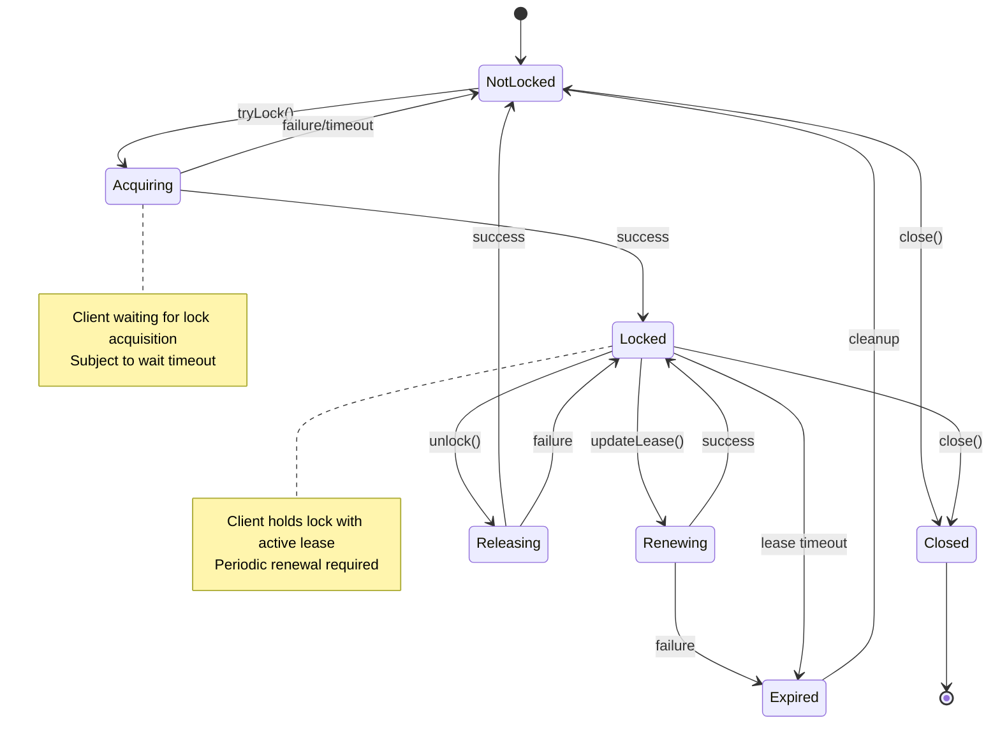
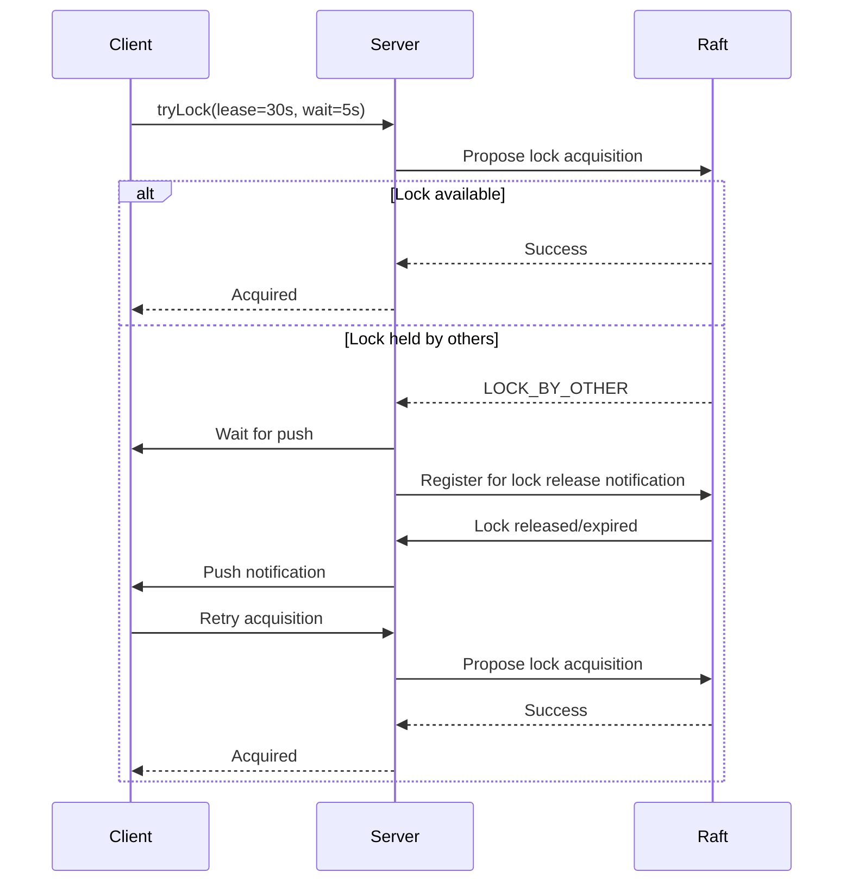
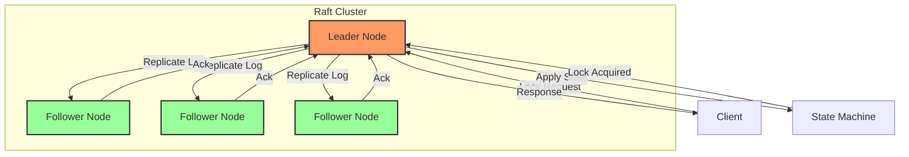
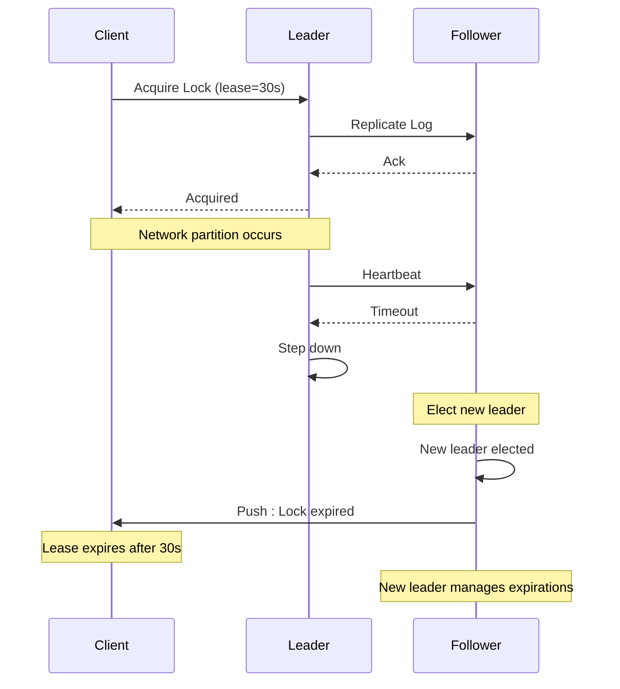
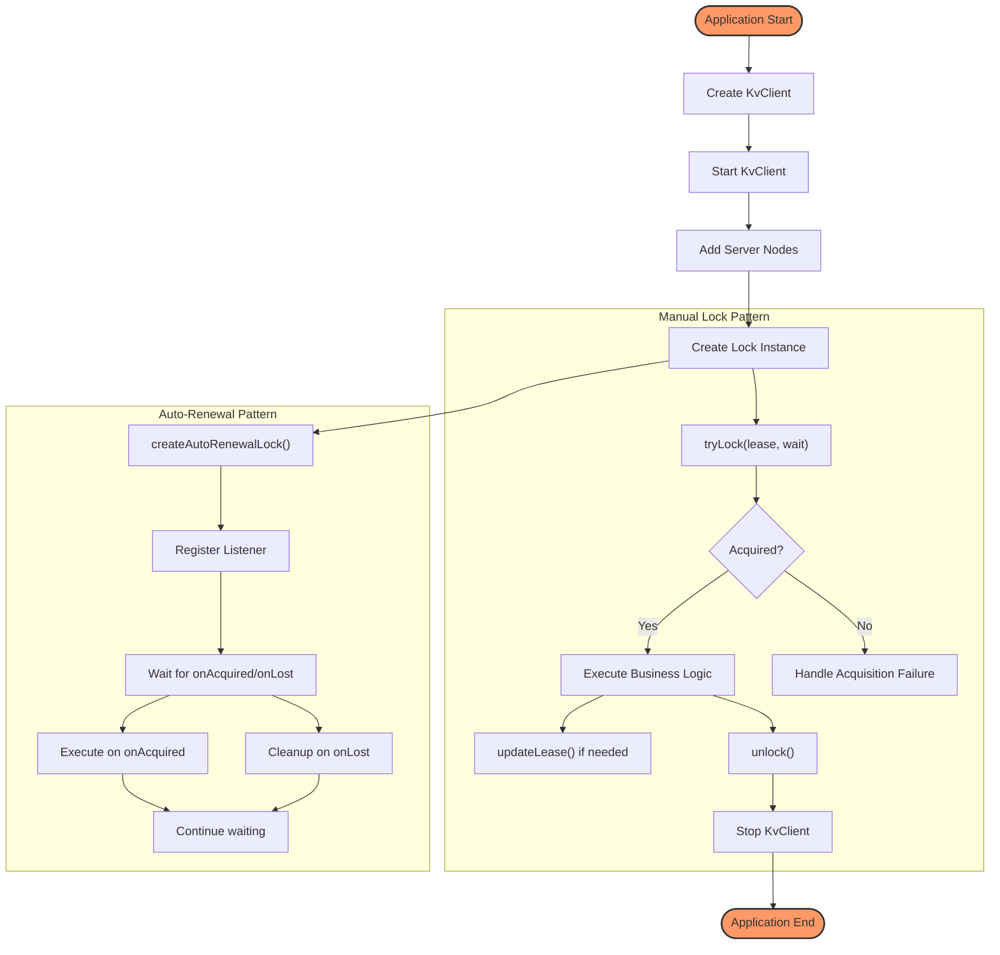

# Distributed Locks API

<cite>
**Referenced Files in This Document**   
- [DistributedLock.java](file://client/src/main/java/com/github/dtprj/dongting/dtkv/DistributedLock.java)
- [AutoRenewalLock.java](file://client/src/main/java/com/github/dtprj/dongting/dtkv/AutoRenewalLock.java)
- [DistributedLockImpl.java](file://client/src/main/java/com/github/dtprj/dongting/dtkv/DistributedLockImpl.java)
- [AutoRenewalLockImpl.java](file://client/src/main/java/com/github/dtprj/dongting/dtkv/AutoRenewalLockImpl.java)
- [LockManager.java](file://client/src/main/java/com/github/dtprj/dongting/dtkv/LockManager.java)
- [KvClientConfig.java](file://client/src/main/java/com/github/dtprj/dongting/dtkv/KvClientConfig.java)
- [KvImpl.java](file://server/src/main/java/com/github/dtprj/dongting/dtkv/server/KvImpl.java)
- [TtlManager.java](file://server/src/main/java/com/github/dtprj/dongting/dtkv/server/TtlManager.java)
- [RaftGroupImpl.java](file://server/src/main/java/com/github/dtprj/dongting/raft/impl/RaftGroupImpl.java)
- [LockDemoClient.java](file://demos/src/main/java/com/github/dtprj/dongting/demos/lock/LockDemoClient.java)
- [AutoRenewalLockDemoClient1.java](file://demos/src/main/java/com/github/dtprj/dongting/demos/lock/AutoRenewalLockDemoClient1.java)
</cite>

## Table of Contents
1. [Introduction](#introduction)
2. [Core Interfaces](#core-interfaces)
3. [Manual Locks: DistributedLock](#manual-locks-distributedlock)
4. [Auto-Renewing Locks: AutoRenewalLock](#auto-renewing-locks-autorenewallock)
5. [Lock Lifecycle and State Management](#lock-lifecycle-and-state-management)
6. [Acquisition Semantics and Conflict Resolution](#acquisition-semantics-and-conflict-resolution)
7. [Configuration Options](#configuration-options)
8. [Underlying Raft Implementation](#underlying-raft-implementation)
9. [Failure Recovery and Network Partition Handling](#failure-recovery-and-network-partition-handling)
10. [Usage Patterns and Best Practices](#usage-patterns-and-best-practices)

## Introduction
Dongting's distributed locking system provides a robust mechanism for coordinating access to shared resources across distributed systems. Built on the Raft consensus algorithm, the system ensures linearizable lock state, preventing split-brain scenarios and guaranteeing consistency even during network partitions. The API offers two primary interfaces: `DistributedLock` for manual lease management and `AutoRenewalLock` for automatic lease renewal, catering to different use cases from simple mutual exclusion to leader election patterns. This documentation details the interfaces, their lifecycle methods, configuration options, and the underlying implementation that ensures reliability and consistency.

## Core Interfaces
The distributed locking system in Dongting is centered around two key interfaces: `DistributedLock` and `AutoRenewalLock`. These interfaces provide different levels of abstraction for managing distributed locks, from fine-grained manual control to automated lease renewal. Both interfaces share common methods for checking lock ownership and remaining lease time, while differing in their acquisition and release semantics. The system is designed to be used through a `KvClient` instance, which manages the connection to the Raft cluster and provides methods to create lock instances. The implementation ensures that all operations are linearizable through the underlying Raft consensus protocol, providing strong consistency guarantees.

**Section sources**
- [DistributedLock.java](file://client/src/main/java/com/github/dtprj/dongting/dtkv/DistributedLock.java#L31-L153)
- [AutoRenewalLock.java](file://client/src/main/java/com/github/dtprj/dongting/dtkv/AutoRenewalLock.java#L34-L68)

## Manual Locks: DistributedLock
The `DistributedLock` interface provides explicit control over lock acquisition, release, and lease management. It is designed for scenarios where applications need fine-grained control over the locking process. The interface offers both synchronous and asynchronous methods for acquiring locks, allowing developers to choose the appropriate pattern based on their application's architecture. When acquiring a lock, clients must specify both the lease duration and a maximum wait time, enabling flexible timeout handling. The lease time is measured from the client side when the method is invoked, ensuring predictable behavior even with network latency.

The interface includes methods to update an existing lock's lease, which is useful for extending ownership without releasing and reacquiring the lock. This is particularly important for long-running operations that need to maintain exclusive access. The `isHeldByCurrentClient()` method provides a quick way to check lock ownership without making a network call, though it may return false in cases of network uncertainty. The `close()` method safely releases the lock and cleans up resources, ensuring that locks are not left dangling when no longer needed.

```mermaid
classDiagram
class DistributedLock {
+tryLock(leaseMillis, waitLockTimeoutMillis) boolean
+tryLock(leaseMillis, waitLockTimeoutMillis, callback) void
+unlock() void
+unlock(callback) void
+updateLease(newLeaseMillis) void
+updateLease(newLeaseMillis, callback) void
+isHeldByCurrentClient() boolean
+getLeaseRestMillis() long
+close() void
}
note right of DistributedLock
Manual lock with explicit lease management
Synchronous and asynchronous operations
Fine-grained control over lock lifecycle
end note
```

**Diagram sources**
- [DistributedLock.java](file://client/src/main/java/com/github/dtprj/dongting/dtkv/DistributedLock.java#L31-L153)

**Section sources**
- [DistributedLock.java](file://client/src/main/java/com/github/dtprj/dongting/dtkv/DistributedLock.java#L31-L153)
- [DistributedLockImpl.java](file://client/src/main/java/com/github/dtprj/dongting/dtkv/DistributedLockImpl.java#L45-L652)
- [LockDemoClient.java](file://demos/src/main/java/com/github/dtprj/dongting/demos/lock/LockDemoClient.java#L30-L50)

## Auto-Renewing Locks: AutoRenewalLock
The `AutoRenewalLock` interface provides a higher-level abstraction for distributed locks, automatically managing lease renewal in the background. This interface is particularly suited for leader election scenarios where a client needs to maintain continuous ownership of a resource. Unlike the manual `DistributedLock`, the auto-renewing lock will continuously attempt to acquire the lock if it is not held and periodically renew the lease while it is held, eliminating the need for explicit lease management in application code.

The interface simplifies error handling by processing exceptions internally and notifying the application through a listener pattern. The `AutoRenewalLockListener` receives callbacks when the lock is acquired or lost, allowing the application to react to state changes without managing the underlying retry logic. The implementation uses configurable retry intervals to handle transient failures, gradually increasing the delay between attempts to avoid overwhelming the system during prolonged outages. This makes the auto-renewing lock resilient to temporary network issues and server restarts.

```mermaid
classDiagram
class AutoRenewalLock {
+isHeldByCurrentClient() boolean
+getLeaseRestMillis() long
+close() void
}
class AutoRenewalLockListener {
+onAcquired() void
+onLost() void
}
AutoRenewalLock --> AutoRenewalLockListener : "notifies"
note right of AutoRenewalLock
Automatic lease renewal in background
Continuous acquisition attempts
Listener-based state notifications
end note
```

**Diagram sources**
- [AutoRenewalLock.java](file://client/src/main/java/com/github/dtprj/dongting/dtkv/AutoRenewalLock.java#L34-L68)
- [AutoRenewalLockImpl.java](file://client/src/main/java/com/github/dtprj/dongting/dtkv/AutoRenewalLockImpl.java#L30-L228)

**Section sources**
- [AutoRenewalLock.java](file://client/src/main/java/com/github/dtprj/dongting/dtkv/AutoRenewalLock.java#L34-L68)
- [AutoRenewalLockImpl.java](file://client/src/main/java/com/github/dtprj/dongting/dtkv/AutoRenewalLockImpl.java#L30-L228)
- [AutoRenewalLockDemoClient1.java](file://demos/src/main/java/com/github/dtprj/dongting/demos/lock/AutoRenewalLockDemoClient1.java#L31-L58)

## Lock Lifecycle and State Management
The distributed locking system maintains a sophisticated state machine to manage the lifecycle of locks, ensuring consistency and preventing race conditions. For `DistributedLock`, the implementation tracks several states: not locked, locked, unknown (due to network issues), and closed. The state transitions are carefully managed using a reentrant lock to ensure thread safety and prevent concurrent operations. Each lock operation (acquire, release, update lease) is serialized, and attempting concurrent operations results in an `IllegalStateException`.

The lease management is handled through a combination of client-side timers and server-side TTL (Time-To-Live) mechanisms. When a lock is acquired, a timer is scheduled on the client side to trigger expiration if the lease is not renewed. This timer is canceled upon successful lease renewal or explicit release. The server maintains the authoritative state of the lock and will automatically expire it if the lease duration elapses without renewal. The client's `isHeldByCurrentClient()` method checks the local lease timer, providing a fast way to determine ownership without network communication.



**Diagram sources**
- [DistributedLockImpl.java](file://client/src/main/java/com/github/dtprj/dongting/dtkv/DistributedLockImpl.java#L48-L53)
- [AutoRenewalLockImpl.java](file://client/src/main/java/com/github/dtprj/dongting/dtkv/AutoRenewalLockImpl.java#L45-L47)

**Section sources**
- [DistributedLockImpl.java](file://client/src/main/java/com/github/dtprj/dongting/dtkv/DistributedLockImpl.java#L45-L652)
- [AutoRenewalLockImpl.java](file://client/src/main/java/com/github/dtprj/dongting/dtkv/AutoRenewalLockImpl.java#L30-L228)

## Acquisition Semantics and Conflict Resolution
The lock acquisition process in Dongting follows a two-phase approach that combines client-side waiting with server-side conflict resolution. When a client calls `tryLock()`, it immediately sends a request to the Raft leader with the specified lease duration. If the lock is currently held by another client, the server responds with a `LOCK_BY_OTHER` code. At this point, the client can either return immediately (if `waitLockTimeoutMillis` is 0) or enter a waiting state for the specified duration.

During the wait period, the client does not continuously poll the server. Instead, it relies on a push mechanism where the server notifies the waiting client when the lock becomes available. This push notification is implemented through the Raft consensus protocol, ensuring that all state changes are linearizable. When the current lock holder releases the lock or its lease expires, the server pushes a notification to waiting clients, who then retry the acquisition process. This design minimizes network traffic and server load while providing timely lock acquisition.



**Diagram sources**
- [DistributedLockImpl.java](file://client/src/main/java/com/github/dtprj/dongting/dtkv/DistributedLockImpl.java#L364-L416)
- [KvImpl.java](file://server/src/main/java/com/github/dtprj/dongting/dtkv/server/KvImpl.java#L455-L463)

**Section sources**
- [DistributedLock.java](file://client/src/main/java/com/github/dtprj/dongting/dtkv/DistributedLock.java#L31-L153)
- [DistributedLockImpl.java](file://client/src/main/java/com/github/dtprj/dongting/dtkv/DistributedLockImpl.java#L45-L652)
- [KvImpl.java](file://server/src/main/java/com/github/dtprj/dongting/dtkv/server/KvImpl.java#L455-L463)

## Configuration Options
The distributed locking system provides several configuration options to tune its behavior for different use cases and environments. The most important configuration is the lease duration, which determines how long a client can hold a lock before it automatically expires. A default value of 60 seconds is recommended, but applications can adjust this based on their specific requirements. Shorter lease durations provide faster failover but require more frequent renewal, while longer durations reduce network traffic but increase recovery time after failures.

For auto-renewing locks, the retry strategy is configurable through the `autoRenewalRetryMillis` array in `KvClientConfig`. This array defines the intervals between retry attempts when acquisition or renewal fails. The default values `[1000, 10000, 30000, 60000]` implement an exponential backoff strategy, starting with a 1-second delay and increasing to a maximum of 60 seconds. This prevents overwhelming the system during prolonged outages while ensuring timely recovery when the system becomes available.

```mermaid
flowchart TD
A[Configuration Options] --> B[Lease Duration]
A --> C[Retry Intervals]
A --> D[Watch Heartbeat]
B --> B1[Default: 60 seconds]
B --> B2[Minimum: 1 second]
B --> B3[Client-side measurement]
C --> C1[Exponential backoff]
C --> C2[Default: [1s, 10s, 30s, 60s]]
C --> C3[Configurable array]
D --> D1[Default: 60 seconds]
D --> D2[Must be less than server timeout]
style A fill:#f9f,stroke:#333,stroke-width:2px
style B fill:#bbf,stroke:#333,stroke-width:2px
style C fill:#bbf,stroke:#333,stroke-width:2px
style D fill:#bbf,stroke:#333,stroke-width:2px
```

**Diagram sources**
- [KvClientConfig.java](file://client/src/main/java/com/github/dtprj/dongting/dtkv/KvClientConfig.java#L28-L31)

**Section sources**
- [KvClientConfig.java](file://client/src/main/java/com/github/dtprj/dongting/dtkv/KvClientConfig.java#L22-L32)
- [AutoRenewalLockImpl.java](file://client/src/main/java/com/github/dtprj/dongting/dtkv/AutoRenewalLockImpl.java#L66-L67)

## Underlying Raft Implementation
The distributed locking system is built on Dongting's Raft consensus algorithm implementation, which provides linearizable state guarantees across the cluster. The Raft protocol ensures that all lock operations are processed in a consistent order across all nodes, preventing split-brain scenarios and guaranteeing that at most one client can hold a lock at any given time. The leader node is responsible for processing all write operations, including lock acquisition and release, while follower nodes replicate the state and can serve read requests.

The implementation uses a lease-based approach to maintain leadership stability. The leader maintains a lease that must be periodically renewed by receiving heartbeats from a majority of the cluster. This lease prevents stale leaders from making decisions during network partitions. When a client acquires a lock, the operation is first committed to the Raft log and then applied to the state machine on all nodes. This two-phase process ensures that the lock state is consistent across the cluster before the client receives confirmation.



**Diagram sources**
- [RaftGroupImpl.java](file://server/src/main/java/com/github/dtprj/dongting/raft/impl/RaftGroupImpl.java#L107-L116)
- [KvImpl.java](file://server/src/main/java/com/github/dtprj/dongting/dtkv/server/KvImpl.java#L388-L499)

**Section sources**
- [RaftGroupImpl.java](file://server/src/main/java/com/github/dtprj/dongting/raft/impl/RaftGroupImpl.java#L100-L220)
- [KvImpl.java](file://server/src/main/java/com/github/dtprj/dongting/dtkv/server/KvImpl.java#L388-L999)

## Failure Recovery and Network Partition Handling
The distributed locking system is designed to handle various failure scenarios, including network partitions, node failures, and client crashes. When a network partition occurs, the Raft algorithm ensures that only one partition can contain a majority of nodes and thus continue to process requests. Clients connected to the minority partition will experience timeouts and eventually lose their locks when the lease expires. When the partition heals, the minority partition's state is reconciled with the majority, ensuring consistency.

For client failures, the lease-based design ensures that locks are automatically released after the lease duration, preventing permanent resource blocking. The server-side TTL manager is responsible for expiring locks when their lease time elapses. This manager runs on the Raft leader and schedules expiration events based on the lease duration specified during lock acquisition. If the leader fails, the new leader takes over the expiration scheduling, ensuring continuity of lock management.



**Diagram sources**
- [TtlManager.java](file://server/src/main/java/com/github/dtprj/dongting/dtkv/server/TtlManager.java#L150-L242)
- [RaftGroupImpl.java](file://server/src/main/java/com/github/dtprj/dongting/raft/impl/RaftGroupImpl.java#L107-L116)

**Section sources**
- [TtlManager.java](file://server/src/main/java/com/github/dtprj/dongting/dtkv/server/TtlManager.java#L1-L242)
- [RaftGroupImpl.java](file://server/src/main/java/com/github/dtprj/dongting/raft/impl/RaftGroupImpl.java#L100-L220)

## Usage Patterns and Best Practices
When using Dongting's distributed locking system, several best practices should be followed to ensure reliability and performance. For short-lived operations, the manual `DistributedLock` interface is recommended, as it provides explicit control over the lock lifecycle. Applications should always check the return value of `tryLock()` and handle the case where acquisition fails. For long-running operations, the `AutoRenewalLock` interface is preferred, as it automatically manages lease renewal and handles transient failures.

Exception handling is critical when working with distributed locks. Applications should be prepared to handle `KvException` for business logic errors and `NetException` for network-related issues. The `isHeldByCurrentClient()` method should be used to verify lock ownership before performing critical operations, but applications should be aware that it may return false during network disruptions even if the client still holds the lock.



**Diagram sources**
- [LockDemoClient.java](file://demos/src/main/java/com/github/dtprj/dongting/demos/lock/LockDemoClient.java#L30-L50)
- [AutoRenewalLockDemoClient1.java](file://demos/src/main/java/com/github/dtprj/dongting/demos/lock/AutoRenewalLockDemoClient1.java#L31-L58)

**Section sources**
- [LockDemoClient.java](file://demos/src/main/java/com/github/dtprj/dongting/demos/lock/LockDemoClient.java#L30-L50)
- [AutoRenewalLockDemoClient1.java](file://demos/src/main/java/com/github/dtprj/dongting/demos/lock/AutoRenewalLockDemoClient1.java#L31-L58)
- [DistributedLock.java](file://client/src/main/java/com/github/dtprj/dongting/dtkv/DistributedLock.java#L31-L153)
- [AutoRenewalLock.java](file://client/src/main/java/com/github/dtprj/dongting/dtkv/AutoRenewalLock.java#L34-L68)