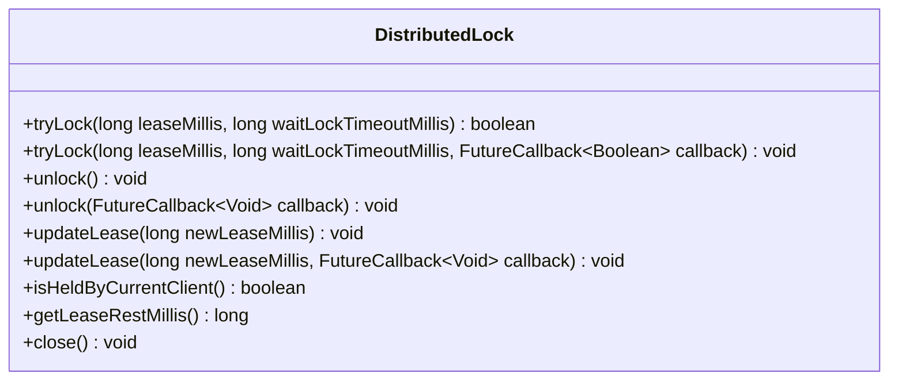
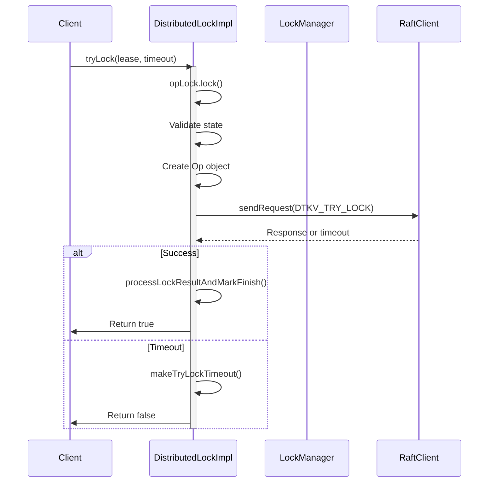
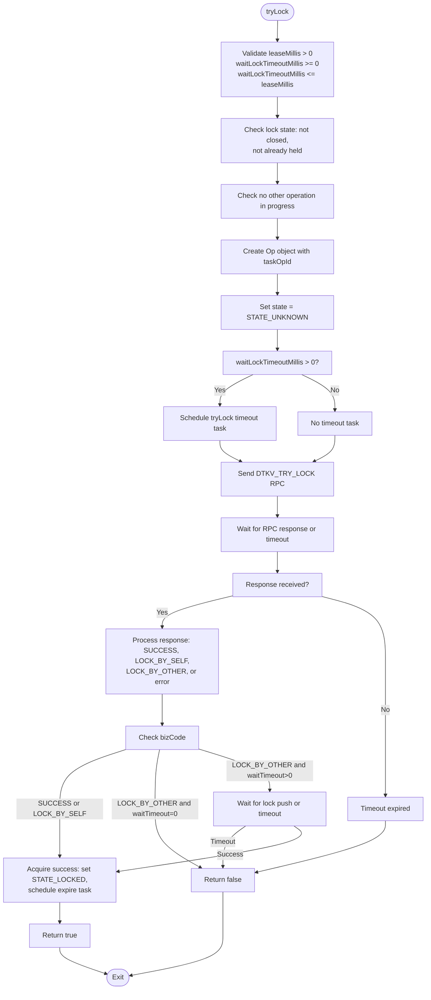
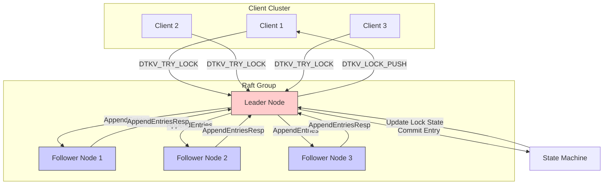
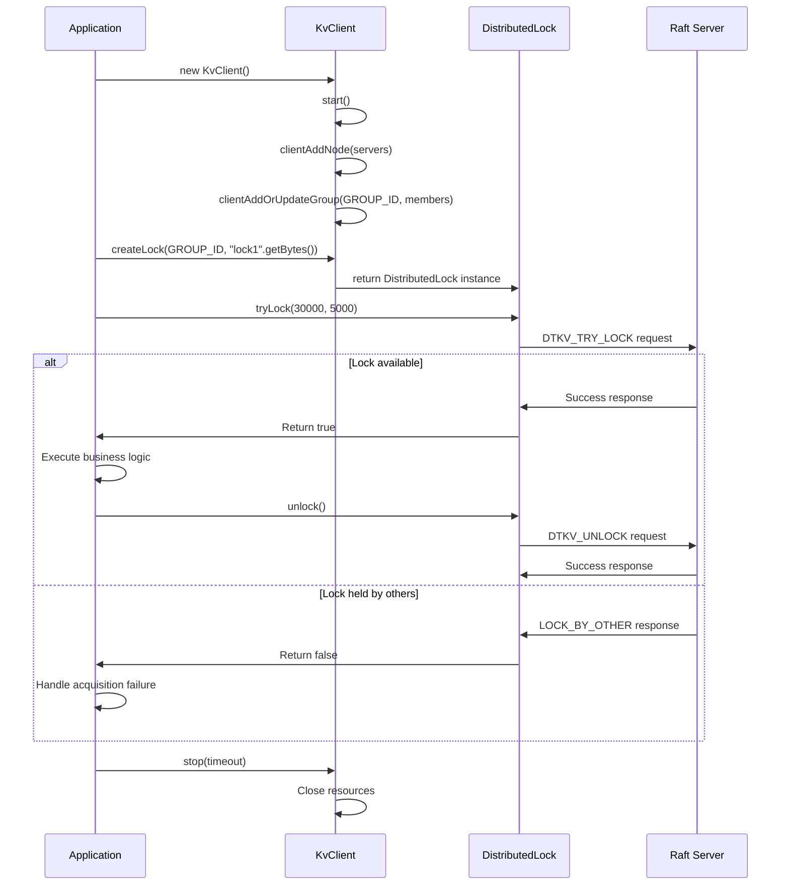
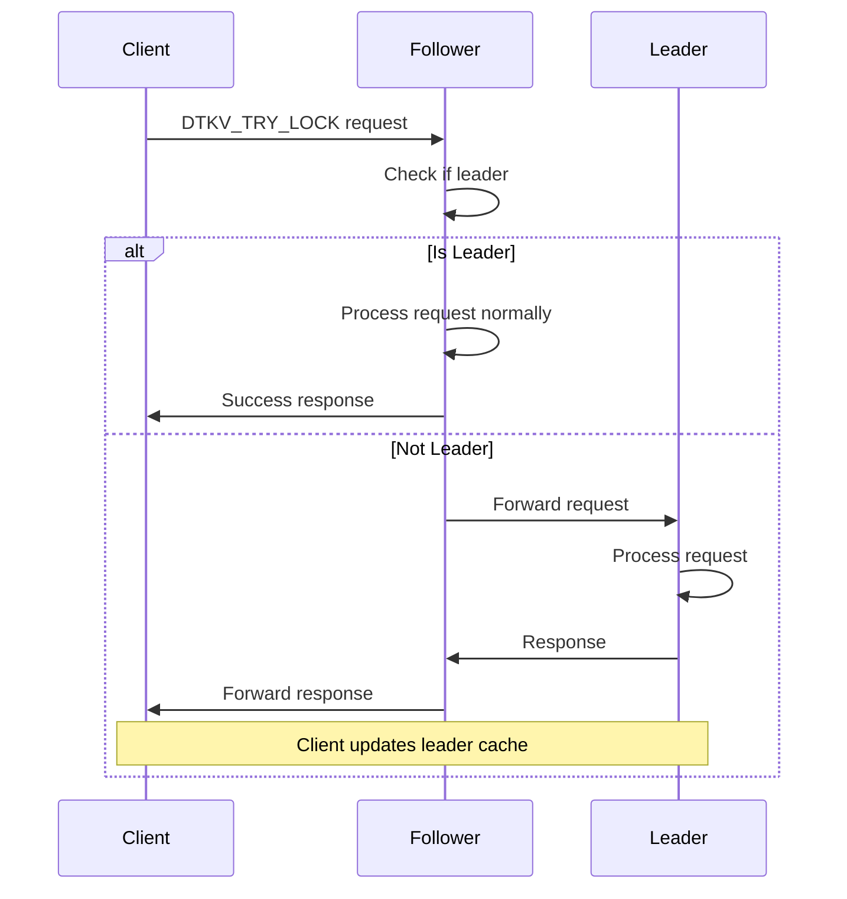

# Manual Distributed Locks

<cite>
**Referenced Files in This Document**   
- [DistributedLock.java](file://client/src/main/java/com/github/dtprj/dongting/dtkv/DistributedLock.java)
- [DistributedLockImpl.java](file://client/src/main/java/com/github/dtprj/dongting/dtkv/DistributedLockImpl.java)
- [KvClient.java](file://client/src/main/java/com/github/dtprj/dongting/dtkv/KvClient.java)
- [KvImpl.java](file://server/src/main/java/com/github/dtprj/dongting/dtkv/server/KvImpl.java)
- [KvServerUtil.java](file://server/src/main/java/com/github/dtprj/dongting/dtkv/server/KvServerUtil.java)
- [NioClientConfig.java](file://client/src/main/java/com/github/dtprj/dongting/net/NioClientConfig.java)
- [LockManager.java](file://client/src/main/java/com/github/dtprj/dongting/dtkv/LockManager.java)
- [LockDemoClient.java](file://demos/src/main/java/com/github/dtprj/dongting/demos/lock/LockDemoClient.java)
</cite>

## Table of Contents
1. [Introduction](#introduction)
2. [DistributedLock Interface Methods](#distributedlock-interface-methods)
3. [Thread-Safety and Blocking Behavior](#thread-safety-and-blocking-behavior)
4. [Lock Acquisition Timeout Semantics](#lock-acquisition-timeout-semantics)
5. [Raft-Based Consensus Mechanism](#raft-based-consensus-mechanism)
6. [Code Examples](#code-examples)
7. [Exception Handling](#exception-handling)
8. [Connection and Operation Timeouts](#connection-and-operation-timeouts)
9. [Failure Scenarios and Session Expiration](#failure-scenarios-and-session-expiration)
10. [Lock Keys and Raft Group Membership](#lock-keys-and-raft-group-membership)
11. [Lock Request Routing](#lock-request-routing)

## Introduction
Dongting's manual distributed locks provide a robust mechanism for coordinating access to shared resources across a distributed system. Built on a Raft-based consensus algorithm, these locks ensure linearizable state across the cluster, providing strong consistency guarantees. The distributed lock implementation supports lease-based ownership with automatic expiration, preventing deadlocks in case of client failures. This documentation details the API for the DistributedLock interface, including acquisition, release, and lease management operations, along with the underlying consensus mechanisms that ensure reliability and consistency.

**Section sources**
- [DistributedLock.java](file://client/src/main/java/com/github/dtprj/dongting/dtkv/DistributedLock.java#L21-L153)

## DistributedLock Interface Methods
The DistributedLock interface provides methods for acquiring, releasing, and managing distributed locks in a cluster environment. The primary methods include acquire (tryLock), release (unlock), and close, each with both synchronous and asynchronous variants. The tryLock method attempts to acquire a lock with a specified lease duration and wait timeout, returning immediately if the wait timeout is zero or blocking until the lock is acquired or the timeout expires. The unlock method releases the lock if held by the current client, while the updateLease method extends the lock's lease period. The close method safely closes the lock instance and removes it from the KvClient registry. Each method includes comprehensive exception handling for various failure scenarios, including network errors, business logic exceptions, and illegal state conditions.

**Diagram sources **
- [DistributedLock.java](file://client/src/main/java/com/github/dtprj/dongting/dtkv/DistributedLock.java#L31-L153)

**Section sources**
- [DistributedLock.java](file://client/src/main/java/com/github/dtprj/dongting/dtkv/DistributedLock.java#L31-L153)

## Thread-Safety and Blocking Behavior
The DistributedLock implementation ensures thread-safety through internal synchronization mechanisms, allowing concurrent access from multiple threads within the same client process. The tryLock method exhibits blocking behavior when the waitLockTimeoutMillis parameter is positive, causing the calling thread to block until the lock is acquired, the timeout expires, or an exception occurs. When waitLockTimeoutMillis is zero, the method returns immediately with a boolean indicating success or failure. The implementation uses a ReentrantLock (opLock) to serialize operations on the lock state, preventing race conditions during state transitions. All callback executions are serialized through a linear task queue, ensuring that callbacks are processed in the order they are received and that no two callbacks execute concurrently for the same lock instance.

**Diagram sources **
- [DistributedLockImpl.java](file://client/src/main/java/com/github/dtprj/dongting/dtkv/DistributedLockImpl.java#L48-L83)
- [DistributedLockImpl.java](file://client/src/main/java/com/github/dtprj/dongting/dtkv/DistributedLockImpl.java#L149-L307)

**Section sources**
- [DistributedLockImpl.java](file://client/src/main/java/com/github/dtprj/dongting/dtkv/DistributedLockImpl.java#L48-L83)
- [DistributedLockImpl.java](file://client/src/main/java/com/github/dtprj/dongting/dtkv/DistributedLockImpl.java#L149-L307)

## Lock Acquisition Timeout Semantics
The lock acquisition timeout semantics in Dongting's distributed locks distinguish between immediate failure and timeout-based failure based on the waitLockTimeoutMillis parameter. When waitLockTimeoutMillis is zero, the client performs a non-blocking check and returns immediately with a failure if the lock is held by another client, representing an immediate failure scenario. When waitLockTimeoutMillis is positive, the client enters a blocking wait state for up to the specified duration, during which it waits for either a successful acquisition or a timeout expiration. The timeout-based failure occurs when the specified wait period elapses without acquiring the lock. The waitLockTimeoutMillis must be less than or equal to the leaseMillis to prevent logical inconsistencies. If the wait timeout expires, the client receives a failure response, but any pending server-side operations are canceled to prevent resource leaks.

**Diagram sources **
- [DistributedLock.java](file://client/src/main/java/com/github/dtprj/dongting/dtkv/DistributedLock.java#L33-L46)
- [DistributedLockImpl.java](file://client/src/main/java/com/github/dtprj/dongting/dtkv/DistributedLockImpl.java#L383-L416)

**Section sources**
- [DistributedLock.java](file://client/src/main/java/com/github/dtprj/dongting/dtkv/DistributedLock.java#L33-L46)
- [DistributedLockImpl.java](file://client/src/main/java/com/github/dtprj/dongting/dtkv/DistributedLockImpl.java#L383-L416)

## Raft-Based Consensus Mechanism
Dongting's distributed locks leverage a Raft-based consensus mechanism to ensure linearizable lock state across the cluster. The Raft algorithm provides strong consistency by requiring a majority quorum for all state changes, ensuring that only one client can successfully acquire a lock at any given time. When a client requests a lock, the request is forwarded to the current Raft leader for the corresponding group, which then replicates the operation to a majority of followers before committing it to the state machine. The lock state is maintained in the Raft log, with each lock operation (acquire, release, lease update) recorded as a log entry. The leader ensures linearizability by processing requests in a strict total order and by using lease timestamps measured from the client side to coordinate expiration. Lock ownership information is stored with a UUID that uniquely identifies the client, and the Raft leader pushes lock acquisition notifications to the owning client through the established connection.

**Diagram sources **
- [KvImpl.java](file://server/src/main/java/com/github/dtprj/dongting/dtkv/server/KvImpl.java#L45-L200)
- [KvServerUtil.java](file://server/src/main/java/com/github/dtprj/dongting/dtkv/server/KvServerUtil.java#L162-L201)

**Section sources**
- [KvImpl.java](file://server/src/main/java/com/github/dtprj/dongting/dtkv/server/KvImpl.java#L45-L200)
- [KvServerUtil.java](file://server/src/main/java/com/github/dtprj/dongting/dtkv/server/KvServerUtil.java#L162-L201)

## Code Examples
The following code example demonstrates proper usage of Dongting's distributed locks with try-with-resources pattern, exception handling, and integration with business logic. The example shows how to create a KvClient, acquire a distributed lock with appropriate timeouts, execute business logic within the critical section, and properly release the lock. The try-with-resources pattern ensures that the KvClient is properly closed, which in turn closes all associated locks. The example includes handling for DtException and NetTimeoutException, demonstrating how to respond to different failure scenarios. The lock is acquired with a 30-second lease and a 5-second wait timeout, providing a balance between availability and consistency.

**Diagram sources **
- [LockDemoClient.java](file://demos/src/main/java/com/github/dtprj/dongting/demos/lock/LockDemoClient.java#L30-L48)
- [KvClient.java](file://client/src/main/java/com/github/dtprj/dongting/dtkv/KvClient.java#L52-L200)

**Section sources**
- [LockDemoClient.java](file://demos/src/main/java/com/github/dtprj/dongting/demos/lock/LockDemoClient.java#L30-L48)

## Exception Handling
Dongting's distributed locks provide comprehensive exception handling through the DtException and NetTimeoutException classes. The DtException is thrown for business logic exceptions such as invalid lock states or business rule violations, while NetTimeoutException is thrown specifically for operation timeouts. The tryLock, unlock, and updateLease methods can throw IllegalStateException when the lock is closed, already held, or when another operation is in progress. Network-related exceptions such as connection failures or packet timeouts are wrapped in NetException. The API distinguishes between synchronous and asynchronous exception handling, with synchronous methods throwing exceptions directly and asynchronous methods delivering exceptions through the FutureCallback. Proper exception handling should include retry logic with exponential backoff for transient failures, and appropriate fallback behavior for permanent failures.

**Section sources**
- [DistributedLock.java](file://client/src/main/java/com/github/dtprj/dongting/dtkv/DistributedLock.java#L48-L51)
- [DistributedLockImpl.java](file://client/src/main/java/com/github/dtprj/dongting/dtkv/DistributedLockImpl.java#L346-L362)
- [DtException.java](file://client/src/main/java/com/github/dtprj/dongting/common/DtException.java#L21-L40)

## Connection and Operation Timeouts
Connection and operation timeouts in Dongting's distributed locks are configured through the NioClientConfig class. The connectTimeoutMillis parameter controls the timeout for establishing new connections to server nodes, defaulting to 3000 milliseconds. Operation timeouts are managed through the RaftClient's default timeout configuration, which determines how long the client waits for responses to RPC requests. The waitLockTimeoutMillis parameter in the tryLock method specifically controls the maximum time to wait for lock acquisition, while the leaseMillis parameter determines how long the lock ownership lasts before automatic expiration. These timeouts work together to provide resilience against network partitions and server failures. The client automatically retries failed operations according to the connectRetryIntervals configuration, with progressive backoff to avoid overwhelming the system during transient failures.

**Section sources**
- [NioClientConfig.java](file://client/src/main/java/com/github/dtprj/dongting/net/NioClientConfig.java#L23-L44)
- [DistributedLock.java](file://client/src/main/java/com/github/dtprj/dongting/dtkv/DistributedLock.java#L43-L46)

## Failure Scenarios and Session Expiration
In failure scenarios such as network partitions, Dongting's distributed locks ensure consistency through the Raft consensus algorithm and automatic session expiration. When a client becomes disconnected from the cluster, its locks will automatically expire after the lease period, allowing other clients to acquire the lock. This prevents indefinite blocking of resources when clients fail unexpectedly. The client-side implementation includes an expireTask that monitors the lease duration and triggers the expireListener when the lease expires. If a network partition isolates the current lock holder, the Raft leader will continue to accept lock requests from other clients once the lease expires. The close method of DistributedLock attempts to asynchronously release the lock if it is still held, but relies on lease expiration as a safety mechanism if the release operation fails due to network issues.

**Section sources**
- [DistributedLockImpl.java](file://client/src/main/java/com/github/dtprj/dongting/dtkv/DistributedLockImpl.java#L425-L452)
- [DistributedLockImpl.java](file://client/src/main/java/com/github/dtprj/dongting/dtkv/DistributedLockImpl.java#L575-L609)

## Lock Keys and Raft Group Membership
Lock keys in Dongting are associated with specific Raft groups, establishing a relationship between the lock namespace and the consensus group that manages it. Each Raft group maintains its own independent lock state, allowing for partitioning of lock resources across multiple consensus groups for scalability. When creating a lock, the client specifies the groupId parameter, which determines which Raft group will manage the lock's state. The Raft group membership is configured independently of the lock system, with each group having its own set of nodes that participate in the consensus process. This separation allows for flexible deployment topologies where different lock types or applications can use different Raft groups with potentially different performance characteristics or availability requirements.

**Section sources**
- [LockManager.java](file://client/src/main/java/com/github/dtprj/dongting/dtkv/LockManager.java#L35-L92)
- [KvClient.java](file://client/src/main/java/com/github/dtprj/dongting/dtkv/KvClient.java#L52-L200)

## Lock Request Routing
Lock requests in Dongting are routed to the current Raft leader for the specified group through a client-side routing mechanism. The KvClient maintains connections to multiple server nodes and uses the RaftClient to determine the current leader for each group. When a lock operation is initiated, the request is sent to the known leader, with automatic redirection if the client's leader information is stale. The Raft leader processes lock requests in the order they are received, ensuring linearizable semantics. If the current node is not the leader, it forwards the request to the leader or returns a redirect response to the client. This routing mechanism provides high availability, as clients can automatically discover and connect to the current leader even after leadership changes due to failures or elections.

**Diagram sources **
- [RaftServer.java](file://server/src/main/java/com/github/dtprj/dongting/raft/server/RaftServer.java#L84-L200)
- [KvImpl.java](file://server/src/main/java/com/github/dtprj/dongting/dtkv/server/KvImpl.java#L45-L200)

**Section sources**
- [RaftServer.java](file://server/src/main/java/com/github/dtprj/dongting/raft/server/RaftServer.java#L84-L200)
- [KvImpl.java](file://server/src/main/java/com/github/dtprj/dongting/dtkv/server/KvImpl.java#L45-L200)