# KvClient API

<cite>
**Referenced Files in This Document**   
- [KvClient.java](file://client/src/main/java/com/github/dtprj/dongting/dtkv/KvClient.java)
- [KvClientConfig.java](file://client/src/main/java/com/github/dtprj/dongting/dtkv/KvClientConfig.java)
- [KvReq.java](file://client/src/main/java/com/github/dtprj/dongting/dtkv/KvReq.java)
- [KvResp.java](file://client/src/main/java/com/github/dtprj/dongting/dtkv/KvResp.java)
- [KvResult.java](file://client/src/main/java/com/github/dtprj/dongting/dtkv/KvResult.java)
- [KvNode.java](file://client/src/main/java/com/github/dtprj/dongting/dtkv/KvNode.java)
- [KvCodes.java](file://client/src/main/java/com/github/dtprj/dongting/dtkv/KvCodes.java)
- [KvException.java](file://client/src/main/java/com/github/dtprj/dongting/dtkv/KvException.java)
- [LockManager.java](file://client/src/main/java/com/github/dtprj/dongting/dtkv/LockManager.java)
- [WatchManager.java](file://client/src/main/java/com/github/dtprj/dongting/dtkv/WatchManager.java)
- [RaftClient.java](file://client/src/main/java/com/github/dtprj/dongting/raft/RaftClient.java)
- [TtlDemoClient.java](file://demos/src/main/java/com/github/dtprj/dongting/demos/ttl/TtlDemoClient.java)
- [StandaloneDemoClient.java](file://demos/src/main/java/com/github/dtprj/dongting/demos/standalone/StandaloneDemoClient.java)
</cite>

## Table of Contents
1. [Introduction](#introduction)
2. [Core Operations](#core-operations)
   - [Put Operations](#put-operations)
   - [Get Operations](#get-operations)
   - [Remove Operations](#remove-operations)
   - [Directory Operations](#directory-operations)
3. [Batch Operations](#batch-operations)
4. [Conditional Updates](#conditional-updates)
5. [TTL Management](#ttl-management)
6. [Consistency Model](#consistency-model)
7. [Connection Lifecycle](#connection-lifecycle)
8. [Error Handling](#error-handling)
9. [Distributed Locks](#distributed-locks)
10. [Configuration](#configuration)
11. [Thread Safety](#thread-safety)
12. [Key Validation](#key-validation)

## Introduction

The `KvClient` interface provides a comprehensive API for interacting with the Dongting distributed key-value store. It supports both synchronous and asynchronous operations for key-value manipulation, batch operations, conditional updates, and TTL management. The client integrates with the Raft consensus algorithm to ensure strong consistency guarantees.

The API is designed to be thread-safe and supports connection pooling through the underlying `RaftClient`. All read operations provide lease-based linearizable consistency, ensuring that clients see a consistent view of the data across the distributed system.

**Section sources**
- [KvClient.java](file://client/src/main/java/com/github/dtprj/dongting/dtkv/KvClient.java#L47-L52)
- [KvClient.java](file://client/src/main/java/com/github/dtprj/dongting/dtkv/KvClient.java#L79-L85)

## Core Operations

### Put Operations

The `put` operations allow storing key-value pairs in the distributed store. There are both synchronous and asynchronous variants available.

**Synchronous Put**
```java
void put(int groupId, byte[] key, byte[] value) throws KvException, NetException
```

**Asynchronous Put**
```java
void put(int groupId, byte[] key, byte[] value, FutureCallback<Void> callback)
```

For temporary nodes with TTL, use the `putTemp` methods:

**Synchronous Put with TTL**
```java
void putTemp(int groupId, byte[] key, byte[] value, long ttlMillis) throws KvException, NetException
```

**Asynchronous Put with TTL**
```java
void putTemp(int groupId, byte[] key, byte[] value, long ttlMillis, FutureCallback<Void> callback)
```

**Exception Conditions:**
- `KvException` with code `IS_TEMP_NODE` if a node with TTL already exists
- `NetException` for network-related issues (timeout, interruption, etc.)

**Section sources**
- [KvClient.java](file://client/src/main/java/com/github/dtprj/dongting/dtkv/KvClient.java#L237-L301)

### Get Operations

The `get` operations retrieve values from the key-value store.

**Synchronous Get**
```java
KvNode get(int groupId, byte[] key) throws KvException, NetException
```

**Asynchronous Get**
```java
void get(int groupId, byte[] key, FutureCallback<KvNode> callback)
```

The `get` method returns a `KvNode` object containing the value and metadata, or `null` if the key is not found.

**Section sources**
- [KvClient.java](file://client/src/main/java/com/github/dtprj/dongting/dtkv/KvClient.java#L312-L329)

### Remove Operations

The `remove` operations delete keys from the store.

**Synchronous Remove**
```java
void remove(int groupId, byte[] key) throws KvException, NetException
```

**Asynchronous Remove**
```java
void remove(int groupId, byte[] key, FutureCallback<Void> callback)
```

When removing temporary nodes, only the client that created the node can remove it. Attempting to remove a temporary node created by another client will result in a `NOT_OWNER` exception.

**Section sources**
- [KvClient.java](file://client/src/main/java/com/github/dtprj/dongting/dtkv/KvClient.java#L390-L411)

### Directory Operations

The API provides methods for creating and managing directories in the key hierarchy.

**Synchronous Mkdir**
```java
void mkdir(int groupId, byte[] key) throws KvException, NetException
```

**Asynchronous Mkdir**
```java
void mkdir(int groupId, byte[] key, FutureCallback<Void> callback)
```

**Synchronous Make Temporary Directory**
```java
void makeTempDir(int groupId, byte[] key, long ttlMillis) throws KvException, NetException
```

**Asynchronous Make Temporary Directory**
```java
void makeTempDir(int groupId, byte[] key, long ttlMillis, FutureCallback<Void> callback)
```

If a directory already exists, `mkdir` operations will succeed without error. Temporary directories with TTL will automatically expire and be removed.

**Section sources**
- [KvClient.java](file://client/src/main/java/com/github/dtprj/dongting/dtkv/KvClient.java#L421-L485)

## Batch Operations

The `KvClient` supports batch operations for improved performance when performing multiple operations.

### Batch Put

**Synchronous Batch Put**
```java
List<KvResult> batchPut(int groupId, List<byte[]> keys, List<byte[]> values) throws KvException, NetException
```

**Asynchronous Batch Put**
```java
void batchPut(int groupId, List<byte[]> keys, List<byte[]> values, FutureCallback<List<KvResult>> callback)
```

### Batch Get

**Synchronous Batch Get**
```java
List<KvNode> batchGet(int groupId, List<byte[]> keys) throws KvException, NetException
```

**Asynchronous Batch Get**
```java
void batchGet(int groupId, List<byte[]> keys, FutureCallback<List<KvNode>> callback)
```

### Batch Remove

**Synchronous Batch Remove**
```java
List<KvResult> batchRemove(int groupId, List<byte[]> keys) throws KvException, NetException
```

**Asynchronous Batch Remove**
```java
void batchRemove(int groupId, List<byte[]> keys, FutureCallback<List<KvResult>> callback)
```

Batch operations return a list of `KvResult` objects, each containing the result of the individual operation, allowing inspection of individual success/failure codes.

**Section sources**
- [KvClient.java](file://client/src/main/java/com/github/dtprj/dongting/dtkv/KvClient.java#L498-L610)

## Conditional Updates

The `compareAndSet` (CAS) operation provides atomic conditional updates.

**Synchronous Compare and Set**
```java
boolean compareAndSet(int groupId, byte[] key, byte[] expectValue, byte[] newValue) throws NetException
```

**Asynchronous Compare and Set**
```java
void compareAndSet(int groupId, byte[] key, byte[] expectValue, byte[] newValue, FutureCallback<Boolean> callback)
```

The CAS operation returns `true` if the update was successful, `false` otherwise. It cannot be used to create directories or operate on temporary nodes.

**Exception Conditions:**
- Returns `false` if the current value does not match `expectValue`
- `NetException` for network-related issues

**Section sources**
- [KvClient.java](file://client/src/main/java/com/github/dtprj/dongting/dtkv/KvClient.java#L622-L650)

## TTL Management

The API provides explicit TTL management for temporary nodes.

**Synchronous Update TTL**
```java
void updateTtl(int groupId, byte[] key, long ttlMillis) throws KvException, NetException
```

**Asynchronous Update TTL**
```java
void updateTtl(int groupId, byte[] key, long ttlMillis, FutureCallback<Void> callback)
```

Only the client that created a temporary node can update its TTL. Attempting to update the TTL of a node created by another client will result in a `NOT_OWNER` exception.

**Exception Conditions:**
- `KvException` with code `NOT_TEMP_NODE` if the key is not a temporary node
- `KvException` with code `NOT_OWNER` if trying to update a node created by another client

**Section sources**
- [KvClient.java](file://client/src/main/java/com/github/dtprj/dongting/dtkv/KvClient.java#L666-L686)

## Consistency Model

The `KvClient` provides linearizable read guarantees through lease-based consistency. All read operations are lease-reads that maintain linearizability while providing good performance.

The consistency model ensures that:
- All operations within a Raft group are linearizable
- Read operations do not require consensus rounds, improving performance
- Lease-based mechanism prevents stale reads
- Clients see a consistent view of the data across the distributed system

This model balances strong consistency with high performance, making it suitable for applications that require both correctness and low latency.

**Section sources**
- [KvClient.java](file://client/src/main/java/com/github/dtprj/dongting/dtkv/KvClient.java#L48-L49)

## Connection Lifecycle

The `KvClient` manages its connection lifecycle through the `start()` and `stop()` methods.

**Initialization**
```java
KvClient client = new KvClient();
client.start();
```

**Shutdown**
```java
client.stop(new DtTime(3, TimeUnit.SECONDS));
```

The client automatically manages connections to the Raft cluster and handles failover to available nodes. When stopping the client, it's important to provide a timeout for graceful shutdown.

The client integrates with `RaftClient` for consensus operations and automatically registers for watch and lock notifications.


**Diagram sources**
- [KvClient.java](file://client/src/main/java/com/github/dtprj/dongting/dtkv/KvClient.java#L743-L761)
- [RaftClient.java](file://client/src/main/java/com/github/dtprj/dongting/raft/RaftClient.java#L743-L761)

## Error Handling

The API uses a comprehensive exception hierarchy for error handling.

### Exception Types

**KvException**
- Thrown for business logic exceptions
- Contains a `code` field with specific error codes from `KvCodes`
- Extends `RaftException`

**NetException**
- Thrown for network-related issues
- Includes `NetTimeoutException` for timeout conditions

### Common Error Codes


**Diagram sources**
- [KvCodes.java](file://client/src/main/java/com/github/dtprj/dongting/dtkv/KvCodes.java#L23-L54)
- [KvException.java](file://client/src/main/java/com/github/dtprj/dongting/dtkv/KvException.java#L23-L41)

## Distributed Locks

The `KvClient` provides distributed locking capabilities through the `createLock` and `createAutoRenewalLock` methods.

### Basic Distributed Lock

```java
DistributedLock createLock(int groupId, byte[] key) throws IllegalStateException
```

### Distributed Lock with Expiration Listener

```java
DistributedLock createLock(int groupId, byte[] key, Runnable expireListener) throws IllegalStateException
```

### Auto-Renewing Lock

```java
AutoRenewalLock createAutoRenewalLock(int groupId, byte[] key, long leaseMillis, AutoRenewalLockListener listener) throws IllegalStateException
```

Auto-renewing locks automatically renew their lease before expiration, ensuring the lock remains held until explicitly closed.

**Section sources**
- [KvClient.java](file://client/src/main/java/com/github/dtprj/dongting/dtkv/KvClient.java#L697-L740)
- [LockManager.java](file://client/src/main/java/com/github/dtprj/dongting/dtkv/LockManager.java#L35-L215)

## Configuration

The `KvClient` can be configured through `KvClientConfig`.

### Configuration Options

```java
public class KvClientConfig {
    public static final byte SEPARATOR = '.';
    public static final int MAX_KEY_SIZE = 8 * 1024;
    public static final int MAX_VALUE_SIZE = 1024 * 1024;
    
    public long watchHeartbeatMillis = 60_000;
    public long[] autoRenewalRetryMillis = {1000, 10_000, 30_000, 60_000};
}
```

**Key Configuration Parameters:**
- `SEPARATOR`: Path separator character (default: '.')
- `MAX_KEY_SIZE`: Maximum key size in bytes (default: 8KB)
- `MAX_VALUE_SIZE`: Maximum value size in bytes (default: 1MB)
- `watchHeartbeatMillis`: Watch heartbeat interval in milliseconds
- `autoRenewalRetryMillis`: Retry intervals for auto-renewal operations


**Diagram sources**
- [KvClientConfig.java](file://client/src/main/java/com/github/dtprj/dongting/dtkv/KvClientConfig.java#L22-L31)
- [KvClient.java](file://client/src/main/java/com/github/dtprj/dongting/dtkv/KvClient.java#L54-L58)

## Thread Safety

The `KvClient` is designed to be thread-safe and can be shared across multiple threads.

**Thread Safety Characteristics:**
- All public methods are thread-safe
- Internally uses connection pooling through `RaftClient`
- Uses `ReentrantLock` for internal synchronization in `LockManager` and `WatchManager`
- Callbacks are executed in the `bizExecutor` of `NioClient` by default

The client can be safely used from multiple threads without external synchronization.

**Section sources**
- [KvClient.java](file://client/src/main/java/com/github/dtprj/dongting/dtkv/KvClient.java#L59-L65)
- [LockManager.java](file://client/src/main/java/com/github/dtprj/dongting/dtkv/LockManager.java#L39-L43)

## Key Validation

The API enforces strict key validation rules to ensure data integrity.

### Key Validation Rules

- Keys cannot be null or empty
- Maximum key size is 8KB
- Keys use '.' as path separator
- Keys cannot start or end with the separator
- No consecutive separators allowed
- No spaces allowed in keys

### Path Separator Convention

The API uses '.' as the default path separator, allowing hierarchical key organization:

```
config.database.host
config.database.port
users.john.profile
users.jane.profile
```

This convention enables logical grouping of related keys while maintaining a flat key-value store.

```mermaid
flowchart TD
A["Key Validation"] --> B["Check null/empty"]
B --> C["Check length ≤ 8KB"]
C --> D["Check no leading/trailing '.'"]
D --> E["Check no consecutive '.'"]
E --> F["Check no spaces"]
F --> G["Valid Key"]
```



**Diagram sources**
- [KvClient.java](file://client/src/main/java/com/github/dtprj/dongting/dtkv/KvClient.java#L190-L218)
- [KvClientConfig.java](file://client/src/main/java/com/github/dtprj/dongting/dtkv/KvClientConfig.java#L24-L25)