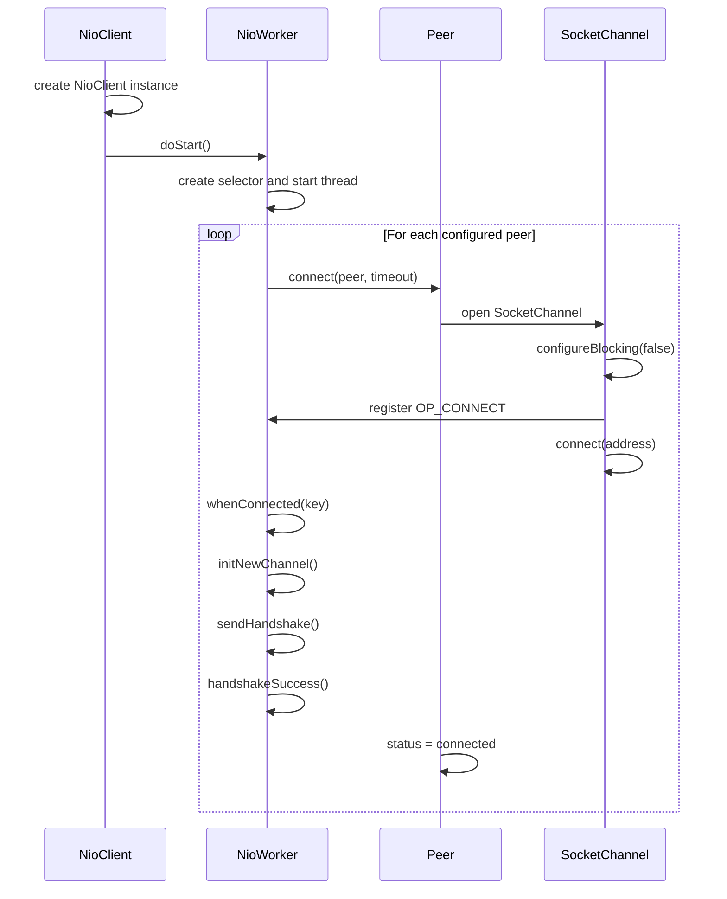
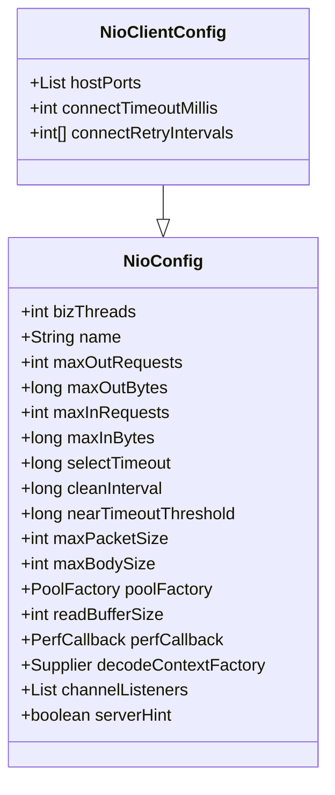
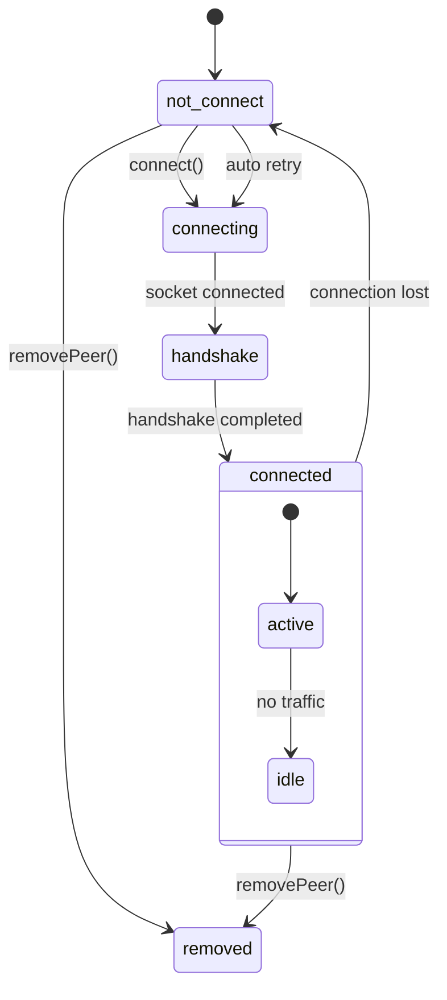
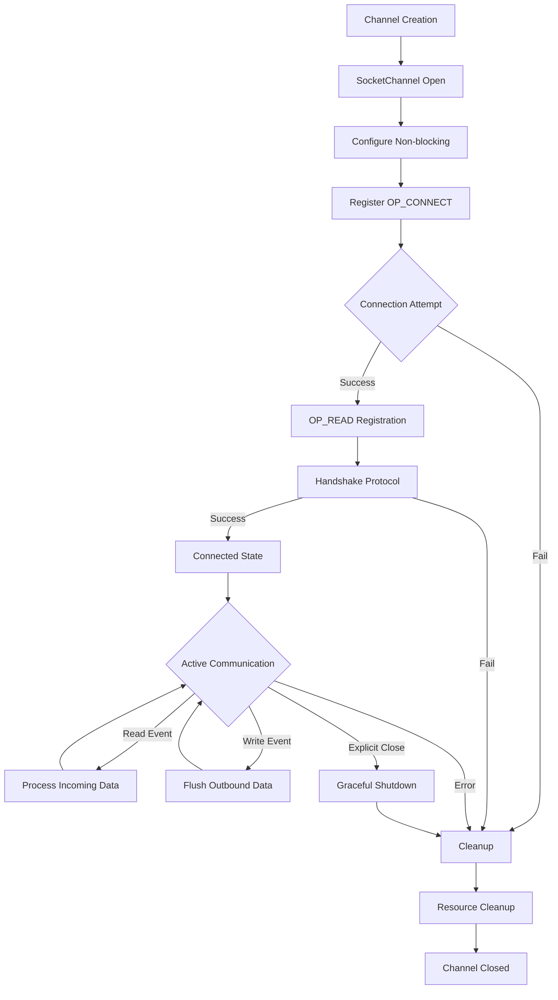
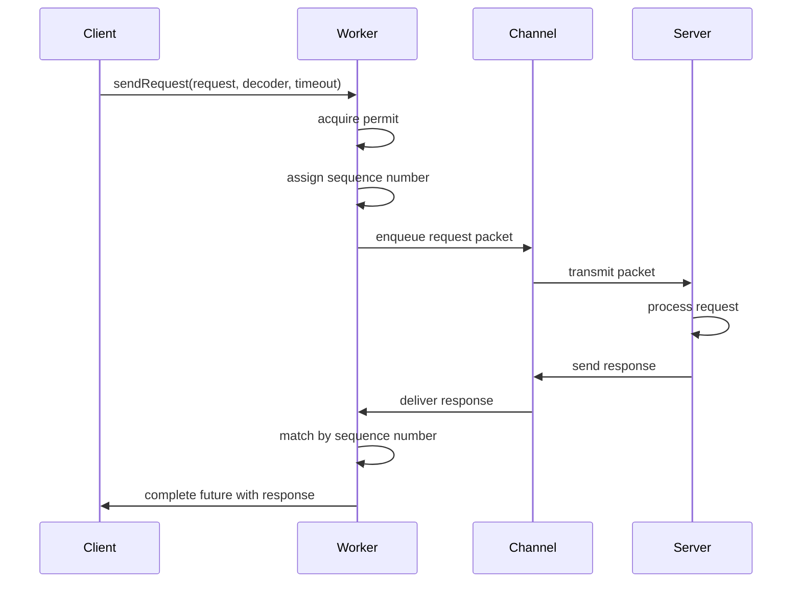
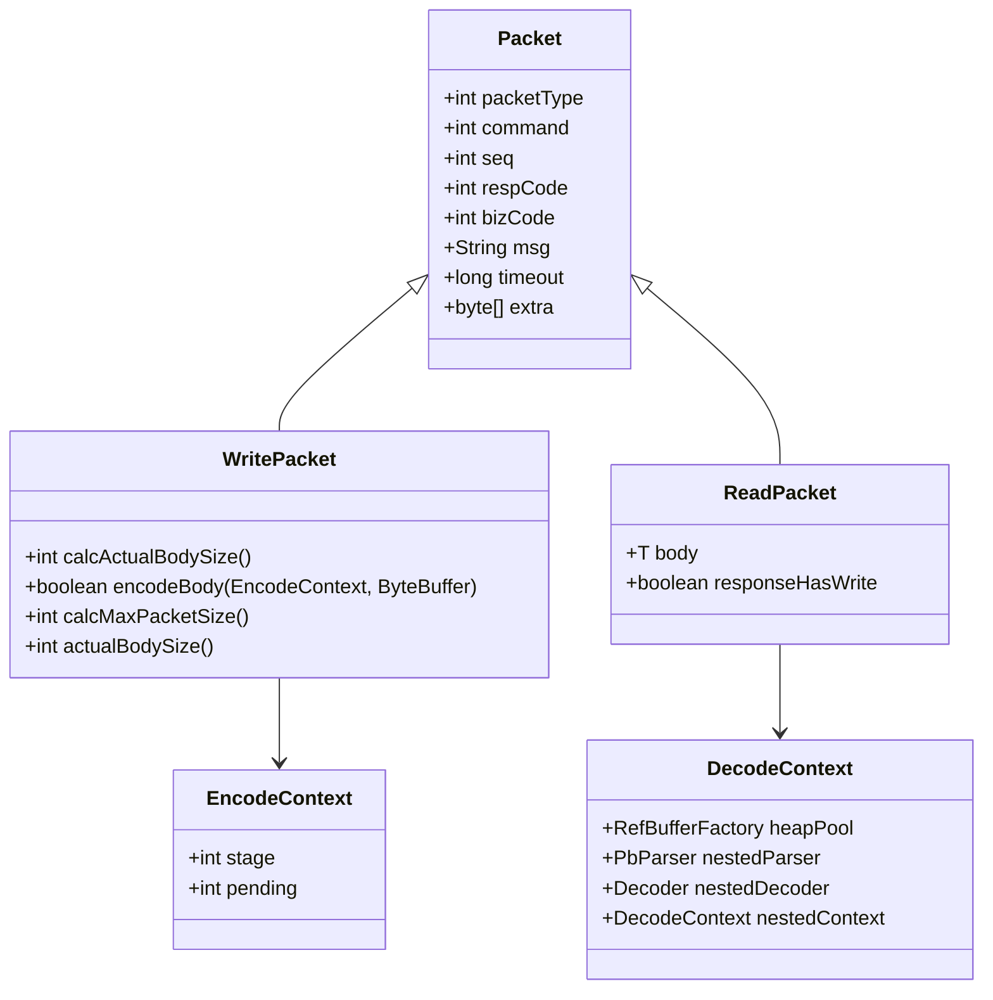
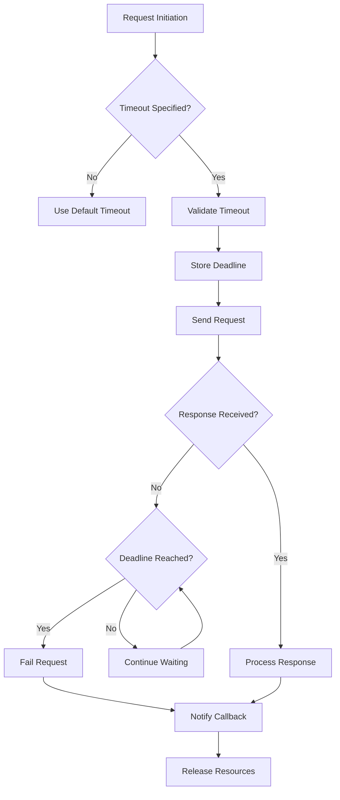
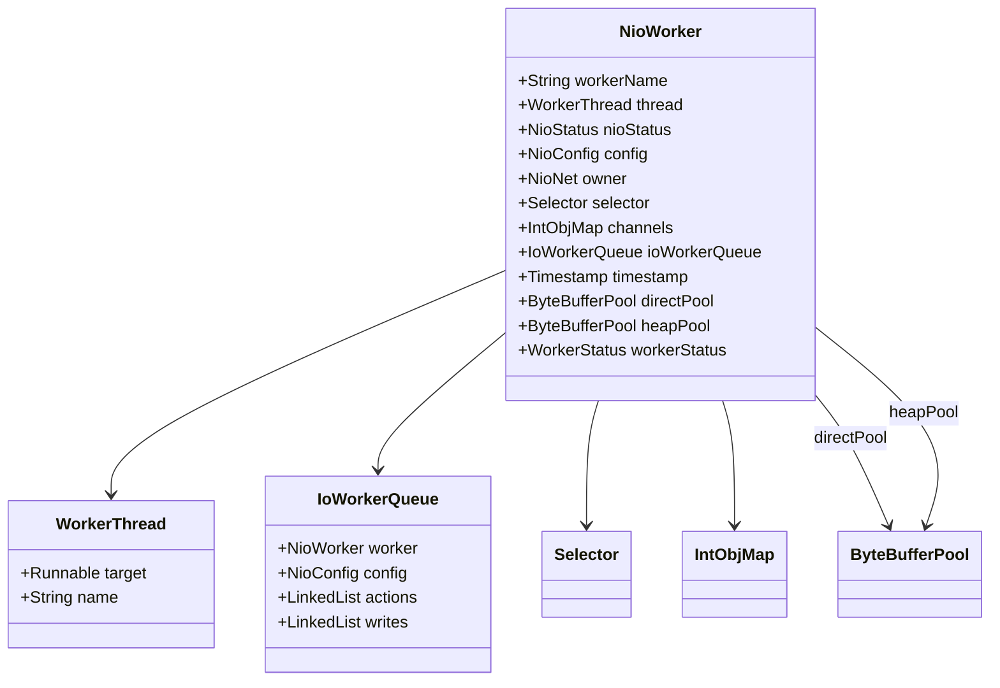
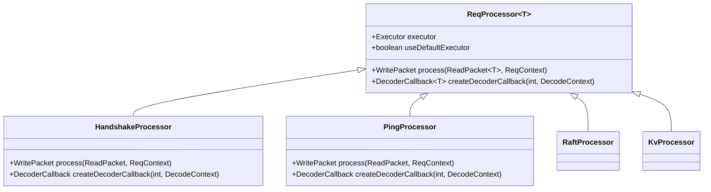

# Network Client API

<cite>
**Referenced Files in This Document**   
- [NioClient.java](file://client/src/main/java/com/github/dtprj/dongting/net/NioClient.java)
- [NioClientConfig.java](file://client/src/main/java/com/github/dtprj/dongting/net/NioClientConfig.java)
- [Peer.java](file://client/src/main/java/com/github/dtprj/dongting/net/Peer.java)
- [NioWorker.java](file://client/src/main/java/com/github/dtprj/dongting/net/NioWorker.java)
- [WritePacket.java](file://client/src/main/java/com/github/dtprj/dongting/net/WritePacket.java)
- [ReadPacket.java](file://client/src/main/java/com/github/dtprj/dongting/net/ReadPacket.java)
- [HostPort.java](file://client/src/main/java/com/github/dtprj/dongting/net/HostPort.java)
- [NioConfig.java](file://client/src/main/java/com/github/dtprj/dongting/net/NioConfig.java)
- [DecodeContext.java](file://client/src/main/java/com/github/dtprj/dongting/codec/DecodeContext.java)
- [Commands.java](file://client/src/main/java/com/github/dtprj/dongting/net/Commands.java)
- [ReqProcessor.java](file://client/src/main/java/com/github/dtprj/dongting/net/ReqProcessor.java)
- [RaftClient.java](file://client/src/main/java/com/github/dtprj/dongting/raft/RaftClient.java)
- [KvClient.java](file://client/src/main/java/com/github/dtprj/dongting/dtkv/KvClient.java)
</cite>

## Table of Contents
1. [Introduction](#introduction)
2. [Connection Establishment](#connection-establishment)
3. [Configuration Options](#configuration-options)
4. [Peer Management](#peer-management)
5. [Channel Lifecycle](#channel-lifecycle)
6. [Request-Response Pattern](#request-response-pattern)
7. [Packet Encoding/Decoding](#packet-encodingdecoding)
8. [Timeout Handling](#timeout-handling)
9. [Worker Thread Model](#worker-thread-model)
10. [Request Processors](#request-processors)
11. [Raft Group Connections](#raft-group-connections)
12. [Performance Tuning](#performance-tuning)
13. [Security and Resilience](#security-and-resilience)

## Introduction

The Dongting NioClient network API provides a high-performance, non-blocking I/O client implementation for distributed systems communication. This API is designed to support various distributed computing patterns including Raft consensus, distributed key-value storage, and other RPC-based services. The architecture is built around a worker thread model with efficient buffer management and flow control mechanisms.

The NioClient implements a sophisticated network stack that handles connection establishment, packet encoding/decoding, timeout management, and automatic reconnection. It provides both synchronous and asynchronous communication patterns with comprehensive error handling and network resilience features. The API is designed to be extensible, allowing for custom request processors and command types while maintaining high performance under heavy load.

**Section sources**
- [NioClient.java](file://client/src/main/java/com/github/dtprj/dongting/net/NioClient.java#L1-L50)

## Connection Establishment

The NioClient establishes connections through a multi-step process that begins with configuration and initialization. When creating an NioClient instance, the client configuration specifies the target endpoints through the `hostPorts` field in NioClientConfig. During the `doStart()` method execution, the client initiates connections to all configured peers asynchronously.

The connection process follows a specific sequence: socket connection establishment, followed by a handshake protocol that exchanges configuration parameters and client identifiers. The handshake includes version negotiation, UUID exchange, and configuration hinting to optimize network parameters based on server capabilities. This handshake mechanism ensures compatibility between client and server versions while allowing for dynamic adjustment of packet sizes and flow control limits.

Connection attempts are managed by the NioWorker thread, which handles the non-blocking I/O operations. The client supports both synchronous waiting for connection establishment through `waitStart()` and `waitConnect()` methods, as well as asynchronous notification via the ChannelListener interface. This dual approach allows applications to choose between blocking initialization and event-driven connection management based on their architectural requirements.

**Diagram sources**
- [NioClient.java](file://client/src/main/java/com/github/dtprj/dongting/net/NioClient.java#L77-L84)
- [NioWorker.java](file://client/src/main/java/com/github/dtprj/dongting/net/NioWorker.java#L453-L624)

**Section sources**
- [NioClient.java](file://client/src/main/java/com/github/dtprj/dongting/net/NioClient.java#L77-L84)
- [NioWorker.java](file://client/src/main/java/com/github/dtprj/dongting/net/NioWorker.java#L453-L624)

## Configuration Options

The NioClientConfig class provides comprehensive configuration options for tuning client behavior. The base NioConfig class defines fundamental parameters that control the network stack's operation, while NioClientConfig extends these with client-specific settings.

Key configuration parameters include:
- **Connection parameters**: `connectTimeoutMillis` controls the maximum time to wait for connection establishment, while `connectRetryIntervals` defines the backoff strategy for automatic reconnection attempts.
- **Thread configuration**: `bizThreads` determines the number of business threads for processing responses, defaulting to 2x CPU cores (capped at 8).
- **Flow control limits**: `maxOutRequests` and `maxOutBytes` set upper bounds on outbound requests to prevent overwhelming the client, while `maxInRequests` and `maxInBytes` control inbound request limits.
- **Buffer management**: `readBufferSize` configures the size of direct memory buffers used for reading data, defaulting to 128KB.
- **Performance monitoring**: `perfCallback` allows integration with performance monitoring systems to track key metrics.

The configuration system supports dynamic adjustment through server hints during the handshake process. When `serverHint` is enabled, the client can adjust its flow control parameters based on server recommendations, scaling limits proportionally to the number of connected servers. This feature enables automatic optimization in multi-server deployments without manual configuration tuning.

**Diagram sources**
- [NioClientConfig.java](file://client/src/main/java/com/github/dtprj/dongting/net/NioClientConfig.java#L23-L43)
- [NioConfig.java](file://client/src/main/java/com/github/dtprj/dongting/net/NioConfig.java#L31-L59)

**Section sources**
- [NioClientConfig.java](file://client/src/main/java/com/github/dtprj/dongting/net/NioClientConfig.java#L23-L43)
- [NioConfig.java](file://client/src/main/java/com/github/dtprj/dongting/net/NioConfig.java#L31-L59)

## Peer Management

The NioClient implements a dynamic peer management system that tracks the state of connections to remote endpoints. Each peer is represented by a Peer object that maintains connection status, retry counters, and associated metadata. The peer lifecycle includes states such as `not_connect`, `connecting`, `handshake`, `connected`, and `removed`.

Peer management operations include:
- **Automatic reconnection**: Failed connections are automatically retried according to the exponential backoff schedule defined in `connectRetryIntervals`
- **Dynamic peer addition**: Peers can be added at runtime using `addPeer()` which returns a CompletableFuture for asynchronous notification
- **Peer removal**: Peers can be removed gracefully using `removePeer()` which closes the associated channel and cleans up pending requests
- **Connection control**: Individual peers can be explicitly connected or disconnected using `connect()` and `disconnect()` methods

The peer management system integrates with the worker thread's cleanup cycle, which periodically checks for peers that should be retried based on their retry schedule. When a connection fails, the peer's status is updated, retry counters are incremented, and pending requests are failed with appropriate exceptions. This ensures that applications are promptly notified of connectivity issues while the system automatically attempts recovery.

**Diagram sources**
- [Peer.java](file://client/src/main/java/com/github/dtprj/dongting/net/Peer.java#L31-L131)
- [NioClient.java](file://client/src/main/java/com/github/dtprj/dongting/net/NioClient.java#L216-L274)

**Section sources**
- [Peer.java](file://client/src/main/java/com/github/dtprj/dongting/net/Peer.java#L31-L131)
- [NioClient.java](file://client/src/main/java/com/github/dtprj/dongting/net/NioClient.java#L216-L274)

## Channel Lifecycle

The channel lifecycle in NioClient follows a well-defined sequence from creation to destruction, managed by the NioWorker thread. Each active connection is represented by a DtChannelImpl object that encapsulates the SocketChannel and associated state. The lifecycle is tightly integrated with the worker's event loop and selection mechanism.

Channel creation begins with the registration of a SocketChannel with the Selector, initially interested in OP_CONNECT events. Upon successful connection, the channel is reconfigured for OP_READ operations and a handshake protocol is initiated. Once the handshake completes successfully, the channel is considered fully established and added to the active channels list.

The channel maintains several key components:
- **Sub-queue (IoChannelQueue)**: Manages outbound packets and write operations
- **Worker status tracking**: Monitors pending requests and flow control
- **Timestamp tracking**: Records last activity time for idle detection
- **Cleanup mechanisms**: Ensures proper resource release on closure

Channel destruction occurs through several pathways: explicit client disconnection, connection errors detected during I/O operations, or worker shutdown. During cleanup, all pending requests are failed, buffers are released back to pools, and the channel is unregistered from the Selector. The system ensures that cleanup operations are performed in the correct thread context to maintain thread safety.

**Diagram sources**
- [NioWorker.java](file://client/src/main/java/com/github/dtprj/dongting/net/NioWorker.java#L373-L720)
- [DtChannel.java](file://client/src/main/java/com/github/dtprj/dongting/net/DtChannel.java#L25-L48)

**Section sources**
- [NioWorker.java](file://client/src/main/java/com/github/dtprj/dongting/net/NioWorker.java#L373-L720)
- [DtChannel.java](file://client/src/main/java/com/github/dtprj/dongting/net/DtChannel.java#L25-L48)

## Request-Response Pattern

The NioClient implements a robust request-response pattern that supports both synchronous and asynchronous communication styles. The API provides multiple methods for sending requests, allowing developers to choose the appropriate pattern for their use case.

The core request methods include:
- **Synchronous requests**: `sendRequest()` methods that block until a response is received or a timeout occurs
- **Asynchronous requests**: Methods that accept RpcCallback parameters for non-blocking completion notification
- **One-way messaging**: `sendOneWay()` methods for fire-and-forget operations without response handling

Each request is assigned a unique sequence number and tracked through its lifecycle. The system maintains a mapping between sequence numbers and callback handlers, ensuring that responses are delivered to the correct completion handler. Timeouts are enforced at multiple levels: connection establishment, request transmission, and response waiting.

The request-response system integrates with the flow control mechanisms, acquiring permits before sending requests to prevent overwhelming the network or remote endpoints. For requests that can be retried (such as idempotent operations), the system can automatically handle retry logic when configured appropriately.

**Diagram sources**
- [NioClient.java](file://client/src/main/java/com/github/dtprj/dongting/net/NioClient.java#L132-L174)
- [NioNet.java](file://client/src/main/java/com/github/dtprj/dongting/net/NioNet.java#L100-L150)

**Section sources**
- [NioClient.java](file://client/src/main/java/com/github/dtprj/dongting/net/NioClient.java#L132-L174)

## Packet Encoding/Decoding

The NioClient uses a Protocol Buffers-based encoding/decoding system for efficient serialization of network messages. The packet format follows a length-prefixed design with a 4-byte header indicating the total message length, followed by a protobuf-encoded structure containing the message content.

The encoding process is implemented in the WritePacket class hierarchy, which provides:
- **Header encoding**: Fixed fields including packet type, command code, sequence number, and timeout
- **Body encoding**: Command-specific payload data encoded using protobuf wire format
- **Streaming encoding**: Support for partial encoding when buffer space is limited
- **Size pre-calculation**: Determination of required buffer space before encoding begins

The decoding system uses a stateful parser that can handle fragmented messages arriving over multiple network packets. The DecodeContext class manages parsing state and provides thread-local caching of decoder instances for performance optimization. The system supports nested message structures through recursive parsing contexts.

Key encoding features include:
- **Efficient varint encoding**: Small integers use 1-byte encoding, optimizing common command codes
- **Length-prefixed fields**: All variable-length fields include their length for efficient parsing
- **Zero-copy options**: Support for direct buffer operations to minimize memory copying
- **Error resilience**: Comprehensive validation and error handling during parsing

**Diagram sources**
- [WritePacket.java](file://client/src/main/java/com/github/dtprj/dongting/net/WritePacket.java#L30-L181)
- [ReadPacket.java](file://client/src/main/java/com/github/dtprj/dongting/net/ReadPacket.java#L23-L44)
- [DecodeContext.java](file://client/src/main/java/com/github/dtprj/dongting/codec/DecodeContext.java#L26-L167)

**Section sources**
- [WritePacket.java](file://client/src/main/java/com/github/dtprj/dongting/net/WritePacket.java#L30-L181)
- [ReadPacket.java](file://client/src/main/java/com/github/dtprj/dongting/net/ReadPacket.java#L23-L44)
- [DecodeContext.java](file://client/src/main/java/com/github/dtprj/dongting/codec/DecodeContext.java#L26-L167)

## Timeout Handling

The NioClient implements comprehensive timeout handling at multiple levels of the network stack. Timeouts are specified using DtTime objects that encapsulate both the timeout duration and reference timestamp for accurate deadline calculation.

The timeout system includes:
- **Connection timeouts**: Govern the maximum time to wait for TCP connection establishment
- **Request timeouts**: Control how long to wait for a response to a specific request
- **Idle timeouts**: Detect and close inactive connections (server-side feature)
- **Handshake timeouts**: Limit the duration of the initial handshake protocol

Timeout checking occurs at several points in the processing pipeline:
1. During connection attempts in the NioWorker's event loop
2. Before sending requests to validate they haven't already expired
3. During periodic cleanup cycles that scan for expired pending requests
4. When processing responses to ensure they arrive within the expected window

The system uses a hierarchical approach to timeout management, with the nearTimeoutThreshold parameter triggering early warnings when requests are approaching their deadline. This allows for proactive error handling and potential retry decisions before complete timeout occurs.

**Diagram sources**
- [NioClient.java](file://client/src/main/java/com/github/dtprj/dongting/net/NioClient.java#L132-L174)
- [NioWorker.java](file://client/src/main/java/com/github/dtprj/dongting/net/NioWorker.java#L211-L225)
- [NioConfig.java](file://client/src/main/java/com/github/dtprj/dongting/net/NioConfig.java#L44-L44)

**Section sources**
- [NioClient.java](file://client/src/main/java/com/github/dtprj/dongting/net/NioClient.java#L132-L174)
- [NioWorker.java](file://client/src/main/java/com/github/dtprj/dongting/net/NioWorker.java#L211-L225)

## Worker Thread Model

The NioClient employs a dedicated worker thread model where each NioWorker instance runs on a single thread responsible for all I/O operations. This design follows the Reactor pattern, with the worker thread managing a Selector that monitors multiple channels for readiness events.

Key aspects of the worker thread model:
- **Single-threaded I/O**: All network operations for a worker occur on its dedicated thread, eliminating the need for synchronization in the I/O path
- **Event-driven processing**: The worker thread processes events in a loop, handling connect, read, and write operations as they become ready
- **Task delegation**: Business logic processing is delegated to a separate executor pool to prevent blocking I/O operations
- **Thread affinity**: Channel operations are pinned to specific workers, ensuring consistent state management

The worker maintains several data structures for efficient operation:
- **Channels map**: Fast lookup of channels by index
- **Pending request tracking**: Monitoring of in-flight requests for timeout detection
- **Connection queues**: Separate queues for incoming (server) and outgoing (client) connections
- **Buffer pools**: Direct and heap memory pools for efficient buffer management

The model provides excellent scalability by minimizing thread contention while maintaining predictable performance characteristics. The separation between I/O threads and business threads allows for optimal resource utilization across different workload patterns.

**Diagram sources**
- [NioWorker.java](file://client/src/main/java/com/github/dtprj/dongting/net/NioWorker.java#L55-L809)
- [WorkerThread.java](file://client/src/main/java/com/github/dtprj/dongting/net/WorkerThread.java#L1-L20)
- [IoWorkerQueue.java](file://client/src/main/java/com/github/dtprj/dongting/net/IoWorkerQueue.java#L1-L50)

**Section sources**
- [NioWorker.java](file://client/src/main/java/com/github/dtprj/dongting/net/NioWorker.java#L55-L809)

## Request Processors

Request processors in the NioClient system handle incoming requests on the server side, but the client API provides the infrastructure for processing responses and system-level commands. The ReqProcessor abstract class defines the interface for handling specific command types, with methods for processing requests and creating appropriate decoders.

For client-side operations, the system includes built-in processors for standard commands:
- **PingProcessor**: Handles heartbeat and ping commands for connection health checking
- **HandshakeProcessor**: Manages the initial handshake protocol
- **Command-specific processors**: For Raft, KV, and other domain-specific operations

The processor registration system allows for extensibility, enabling applications to define custom command types and their handling logic. Processors can be registered with specific executors to control which thread pool handles their execution, providing fine-grained control over resource allocation.

The processing pipeline includes:
1. Command dispatch based on the command code
2. Decoder creation for parsing the request body
3. Execution of the processor's business logic
4. Response construction and transmission
5. Error handling and cleanup

**Diagram sources**
- [ReqProcessor.java](file://client/src/main/java/com/github/dtprj/dongting/net/ReqProcessor.java#L26-L35)
- [NioServer.java](file://client/src/main/java/com/github/dtprj/dongting/net/NioServer.java#L100-L150)
- [Commands.java](file://client/src/main/java/com/github/dtprj/dongting/net/Commands.java#L21-L69)

**Section sources**
- [ReqProcessor.java](file://client/src/main/java/com/github/dtprj/dongting/net/ReqProcessor.java#L26-L35)

## Raft Group Connections

The NioClient provides specialized support for connecting to Raft consensus groups through the RaftClient class. This higher-level API builds on the basic NioClient functionality to provide Raft-specific features such as leader discovery, automatic redirection, and cluster topology management.

Key features for Raft group connections:
- **Multiple endpoint configuration**: Support for connecting to all nodes in a Raft group
- **Leader detection**: Automatic identification of the current leader through Raft protocol messages
- **Request redirection**: Automatic forwarding of requests to the current leader
- **Cluster topology awareness**: Tracking of group membership changes

The RaftClient integrates with the underlying NioClient's peer management system, maintaining connections to all group members while optimizing traffic to the leader. It handles the complexities of Raft's consensus algorithm, including handling of leadership changes and network partitions.

Configuration for Raft connections includes Raft-specific parameters such as election timeouts, heartbeat intervals, and log replication settings, while leveraging the underlying NioClientConfig for network-level settings.

**Section sources**
- [RaftClient.java](file://client/src/main/java/com/github/dtprj/dongting/raft/RaftClient.java#L1-L100)
- [RaftClientConfig.java](file://client/src/main/java/com/github/dtprj/dongting/raft/RaftClientConfig.java#L1-L50)

## Performance Tuning

The NioClient provides several parameters for performance tuning to optimize throughput, latency, and resource utilization. These parameters can be adjusted based on the specific workload characteristics and deployment environment.

Key performance tuning parameters include:
- **Worker thread count**: Controlled by the number of NioWorker instances (typically one per client)
- **Business thread pool size**: Configured via the `bizThreads` parameter, defaulting to 2x CPU cores
- **Buffer sizes**: `readBufferSize` controls the size of direct memory buffers for network I/O
- **Connection pooling**: Implicitly managed through the peer connection model
- **Flow control limits**: `maxOutRequests` and `maxOutBytes` prevent overwhelming the client

Additional tuning options:
- **Select timeout**: `selectTimeout` parameter controls the blocking duration of the Selector, affecting latency vs. CPU usage trade-offs
- **Cleanup interval**: `cleanInterval` determines how frequently cleanup operations are performed
- **Near timeout threshold**: `nearTimeoutThreshold` triggers early warnings for requests approaching their deadline
- **Memory pools**: `poolFactory` allows customization of buffer allocation strategies

For high-throughput scenarios, increasing the business thread count and flow control limits can improve performance. For low-latency requirements, reducing the select timeout and optimizing buffer sizes may be beneficial. The system's performance callback mechanism enables monitoring of key metrics to guide tuning decisions.

**Section sources**
- [NioConfig.java](file://client/src/main/java/com/github/dtprj/dongting/net/NioConfig.java#L31-L59)
- [NioClientConfig.java](file://client/src/main/java/com/github/dtprj/dongting/net/NioClientConfig.java#L23-L43)

## Security and Resilience

The NioClient incorporates several features to enhance network resilience and security in distributed environments. While the core API focuses on performance and reliability, it provides mechanisms that support secure and robust communication.

Resilience features include:
- **Automatic reconnection**: Failed connections are automatically retried with exponential backoff
- **Circuit breaker patterns**: Built-in timeout and failure detection prevent cascading failures
- **Flow control**: Prevents overwhelming clients or servers with excessive request rates
- **Graceful shutdown**: Proper cleanup of resources during client termination

Security considerations:
- **Authentication**: Client identity through UUID exchange during handshake
- **Version validation**: Protocol version checking to prevent incompatible communication
- **Input validation**: Comprehensive validation of incoming messages to prevent malformed packet attacks
- **Resource limits**: Bounds on packet sizes and connection counts to prevent resource exhaustion

The system also provides hooks for integrating additional security measures, such as SSL/TLS encryption through custom channel implementations, and authentication tokens in the packet headers. The extensible processor model allows for implementing custom security policies and auditing.

**Section sources**
- [NioClient.java](file://client/src/main/java/com/github/dtprj/dongting/net/NioClient.java#L309-L362)
- [NioWorker.java](file://client/src/main/java/com/github/dtprj/dongting/net/NioWorker.java#L676-L744)
- [Packet.java](file://client/src/main/java/com/github/dtprj/dongting/net/Packet.java#L26-L75)