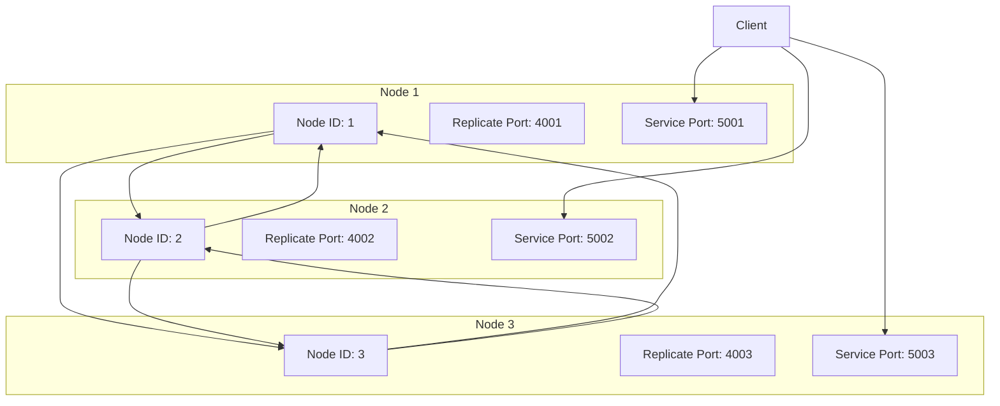
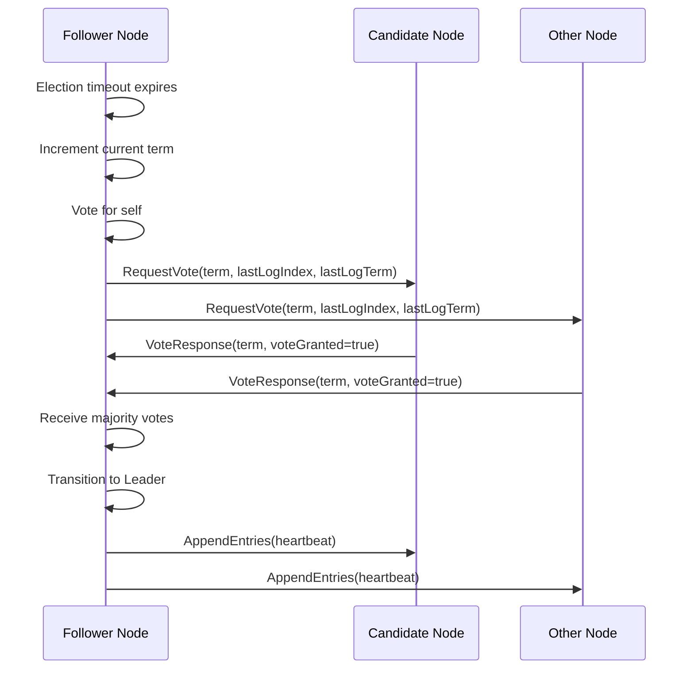
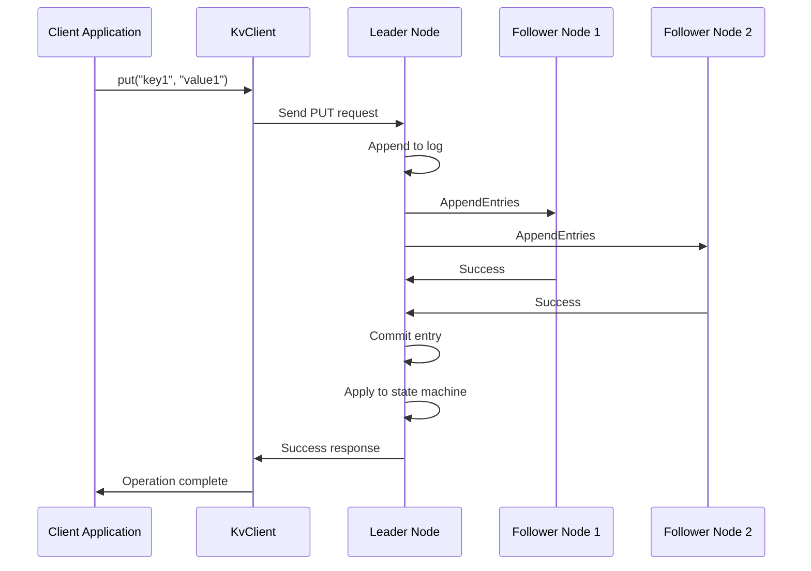
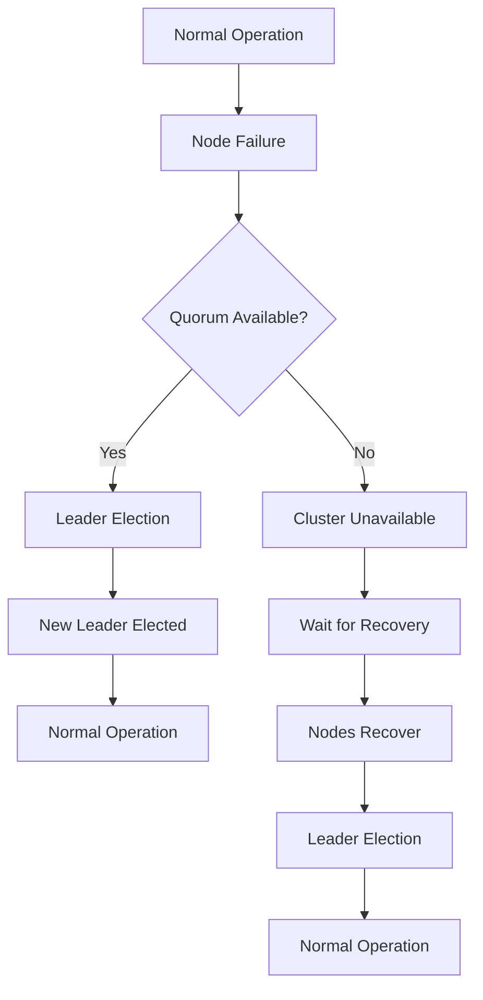

# Cluster Demo

<cite>
**Referenced Files in This Document**   
- [DemoServer1.java](file://demos/src/main/java/com/github/dtprj/dongting/demos/cluster/DemoServer1.java)
- [DemoServer2.java](file://demos/src/main/java/com/github/dtprj/dongting/demos/cluster/DemoServer2.java)
- [DemoServer3.java](file://demos/src/main/java/com/github/dtprj/dongting/demos/cluster/DemoServer3.java)
- [DemoClient.java](file://demos/src/main/java/com/github/dtprj/dongting/demos/cluster/DemoClient.java)
- [DemoKvServerBase.java](file://demos/src/main/java/com/github/dtprj/dongting/demos/base/DemoKvServerBase.java)
- [DemoClientBase.java](file://demos/src/main/java/com/github/dtprj/dongting/demos/base/DemoClientBase.java)
- [RaftServer.java](file://server/src/main/java/com/github/dtprj/dongting/raft/server/RaftServer.java)
- [RaftServerConfig.java](file://server/src/main/java/com/github/dtprj/dongting/raft/server/RaftServerConfig.java)
- [RaftGroupConfig.java](file://server/src/main/java/com/github/dtprj/dongting/raft/server/RaftGroupConfig.java)
- [RaftGroupImpl.java](file://server/src/main/java/com/github/dtprj/dongting/raft/impl/RaftGroupImpl.java)
- [VoteProcessor.java](file://server/src/main/java/com/github/dtprj/dongting/raft/rpc/VoteProcessor.java)
- [RaftClient.java](file://client/src/main/java/com/github/dtprj/dongting/raft/RaftClient.java)
- [KvClient.java](file://client/src/main/java/com/github/dtprj/dongting/dtkv/KvClient.java)
</cite>

## Table of Contents
1. [Introduction](#introduction)
2. [Architecture Overview](#architecture-overview)
3. [Setup and Configuration](#setup-and-configuration)
4. [Leader Election and Log Replication](#leader-election-and-log-replication)
5. [Client Interaction and K/V Operations](#client-interaction-and-kv-operations)
6. [Fault Tolerance and Failure Scenarios](#fault-tolerance-and-failure-scenarios)
7. [Performance Considerations](#performance-considerations)
8. [Troubleshooting and Common Issues](#troubleshooting-and-common-issues)
9. [Conclusion](#conclusion)

## Introduction

This document provides a comprehensive guide to the 3-node RAFT cluster demo in the Dongting project. The demo showcases a distributed key-value store built on the RAFT consensus algorithm, demonstrating core distributed systems concepts including leader election, log replication, fault tolerance, and linearizable operations. The architecture consists of three server nodes forming a RAFT cluster and a client application that interacts with the cluster to perform key-value operations.

The implementation follows the RAFT consensus algorithm to ensure strong consistency across the cluster. Each server node maintains a replicated log, and the cluster elects a leader to coordinate all write operations. The client can perform both read and write operations through any node in the cluster, with automatic redirection to the current leader when necessary. The system is designed to tolerate node failures and network partitions while maintaining data consistency.

This documentation will walk through the setup process, explain the architecture and implementation details, demonstrate client operations, and explore failure scenarios and recovery procedures.

**Section sources**
- [DemoServer1.java](file://demos/src/main/java/com/github/dtprj/dongting/demos/cluster/DemoServer1.java#L1-L33)
- [DemoServer2.java](file://demos/src/main/java/com/github/dtprj/dongting/demos/cluster/DemoServer2.java#L1-L33)
- [DemoServer3.java](file://demos/src/main/java/com/github/dtprj/dongting/demos/cluster/DemoServer3.java#L1-L33)
- [DemoClient.java](file://demos/src/main/java/com/github/dtprj/dongting/demos/cluster/DemoClient.java#L1-L39)

## Architecture Overview

The 3-node RAFT cluster demo implements a distributed key-value store with strong consistency guarantees. The architecture consists of three server nodes that form a RAFT consensus group and a client application that interacts with the cluster. Each server node runs as a separate Java process and participates in the RAFT consensus algorithm to maintain a consistent replicated state.

The system uses a multi-layered architecture with clear separation of concerns. At the core is the RAFT consensus algorithm implementation, which ensures that all nodes agree on the order of operations. Above the consensus layer is the state machine, which in this demo is a simple key-value store (DtKV). The network layer handles communication between nodes and between clients and servers using a custom NIO-based networking framework.

```mermaid
graph TB
subgraph "Client Layer"
Client[Client Application]
end
subgraph "Server Layer"
Server1[Server Node 1]
Server2[Server Node 2]
Server3[Server Node 3]
end
subgraph "RAFT Consensus"
Raft[Raft Algorithm]
Log[Replicated Log]
end
subgraph "State Machine"
KV[Key-Value Store]
end
subgraph "Network Layer"
NIO[NIO Networking]
end
Client --> Server1
Client --> Server2
Client --> Server3
Server1 --> Raft
Server2 --> Raft
Server3 --> Raft
Raft --> Log
Raft --> KV
Server1 --> NIO
Server2 --> NIO
Server3 --> NIO
NIO < --> NIO
```

**Diagram sources **
- [RaftServer.java](file://server/src/main/java/com/github/dtprj/dongting/raft/server/RaftServer.java#L84-L718)
- [RaftGroupImpl.java](file://server/src/main/java/com/github/dtprj/dongting/raft/impl/RaftGroupImpl.java#L43-L220)
- [KvClient.java](file://client/src/main/java/com/github/dtprj/dongting/dtkv/KvClient.java#L52-L771)

The RAFT algorithm implementation includes all the core components: leader election, log replication, and safety mechanisms. Each server node can be in one of three roles: leader, follower, or candidate. The leader is responsible for accepting client requests, replicating log entries to followers, and managing the commit process. Followers accept log entries from the leader and respond to heartbeat messages. Candidates initiate leader election when they detect that the current leader has failed.

The system uses two different network ports for different types of communication. The replicate port (4001, 4002, 4003) is used for internal RAFT communication between server nodes, including vote requests, append entries, and heartbeats. The service port (5001, 5002, 5003) is used for client-server communication, allowing clients to perform key-value operations.

**Section sources**
- [RaftServer.java](file://server/src/main/java/com/github/dtprj/dongting/raft/server/RaftServer.java#L84-L718)
- [RaftServerConfig.java](file://server/src/main/java/com/github/dtprj/dongting/raft/server/RaftServerConfig.java#L21-L40)
- [RaftGroupConfig.java](file://server/src/main/java/com/github/dtprj/dongting/raft/server/RaftGroupConfig.java#L24-L76)

## Setup and Configuration

Setting up the 3-node RAFT cluster involves starting three server instances and a client application. Each server node is configured with specific parameters that define its role in the cluster and its network endpoints. The configuration is handled through the `RaftServerConfig` and `RaftGroupConfig` classes, which specify the server's node ID, network ports, cluster membership, and various timeout values.

The three server nodes are implemented in separate classes: `DemoServer1`, `DemoServer2`, and `DemoServer3`. Each server has a unique node ID (1, 2, or 3) and binds to specific ports for replication and client service. The servers are configured to communicate with each other using the replication port (4001, 4002, 4003) and accept client connections on the service port (5001, 5002, 5003). The cluster membership is defined by the `members` string, which lists all node IDs participating in the RAFT group.



**Diagram sources **
- [DemoServer1.java](file://demos/src/main/java/com/github/dtprj/dongting/demos/cluster/DemoServer1.java#L26-L30)
- [DemoServer2.java](file://demos/src/main/java/com/github/dtprj/dongting/demos/cluster/DemoServer2.java#L26-L30)
- [DemoServer3.java](file://demos/src/main/java/com/github/dtprj/dongting/demos/cluster/DemoServer3.java#L26-L30)
- [DemoKvServerBase.java](file://demos/src/main/java/com/github/dtprj/dongting/demos/base/DemoKvServerBase.java#L38-L47)

The server configuration includes several important parameters that affect the cluster's behavior:

- `servers`: Defines the cluster topology with node IDs and their replication endpoints
- `nodeId`: Unique identifier for the current server node
- `replicatePort`: Port used for RAFT inter-node communication (vote requests, append entries)
- `servicePort`: Port used for client-server communication (key-value operations)
- `electTimeout`: Timeout for leader election (3000ms in the demo for faster elections)
- `heartbeatInterval`: Interval between leader heartbeats (1000ms in the demo)

The client is configured to connect to all three server nodes, allowing it to automatically discover the current leader and redirect requests as needed. The client uses the `RaftClient` class to manage connections to the server nodes and handle leader redirection transparently.

To start the cluster, the three server nodes should be started in any order. The RAFT algorithm will automatically handle leader election once a quorum of nodes is available. After the servers are running, the client can be started to begin performing key-value operations.

**Section sources**
- [DemoServer1.java](file://demos/src/main/java/com/github/dtprj/dongting/demos/cluster/DemoServer1.java#L26-L30)
- [DemoServer2.java](file://demos/src/main/java/com/github/dtprj/dongting/demos/cluster/DemoServer2.java#L26-L30)
- [DemoServer3.java](file://demos/src/main/java/com/github/dtprj/dongting/demos/cluster/DemoServer3.java#L26-L30)
- [DemoClient.java](file://demos/src/main/java/com/github/dtprj/dongting/demos/cluster/DemoClient.java#L32-L33)
- [DemoKvServerBase.java](file://demos/src/main/java/com/github/dtprj/dongting/demos/base/DemoKvServerBase.java#L38-L47)

## Leader Election and Log Replication

The RAFT cluster demo implements the complete RAFT consensus algorithm, including leader election and log replication. Leader election is triggered when a follower node does not receive a heartbeat from the current leader within the election timeout period. In this demo, the election timeout is set to 3000ms, which is relatively short to allow for quick leader detection and election during demonstrations.

When a follower's election timer expires, it transitions to the candidate state, increments its current term, and votes for itself. The candidate then sends RequestVote RPCs to all other nodes in the cluster. The `VoteProcessor` class handles incoming vote requests and implements the voting logic according to the RAFT algorithm. A node will grant its vote if the candidate's log is at least as up-to-date as its own and it hasn't already voted for another candidate in the current term.



**Diagram sources **
- [VoteProcessor.java](file://server/src/main/java/com/github/dtprj/dongting/raft/rpc/VoteProcessor.java#L39-L204)
- [RaftServer.java](file://server/src/main/java/com/github/dtprj/dongting/raft/server/RaftServer.java#L84-L718)
- [RaftGroupImpl.java](file://server/src/main/java/com/github/dtprj/dongting/raft/impl/RaftGroupImpl.java#L43-L220)

Once a candidate receives votes from a majority of the cluster (2 out of 3 nodes in this case), it becomes the leader. The new leader immediately begins sending AppendEntries heartbeats to all followers to establish its authority and prevent new elections. The leader also maintains a nextIndex for each follower, which indicates the next log entry to send to that follower.

Log replication is handled through the AppendEntries RPC, which the leader sends to all followers to replicate log entries and serve as heartbeats. When a client submits a write request, the leader appends the operation to its log and sends AppendEntries RPCs to all followers. When a follower receives an AppendEntries request, it checks if the new entries are consistent with its log (based on the previous log entry's index and term). If consistent, the follower appends the new entries and returns success.

The leader tracks the replication progress of each follower and maintains a matchIndex for each follower, which records the highest log entry known to be replicated on that follower. When a log entry has been replicated on a majority of the cluster, the leader considers it committed and applies it to its state machine. The leader then updates its commitIndex and includes this in subsequent AppendEntries messages, allowing followers to identify and apply committed entries.

The demo uses a relatively short election timeout (3000ms) and heartbeat interval (1000ms) to make leader election and failure detection more apparent during demonstrations. This allows observers to quickly see leader election in action when nodes are stopped or network partitions occur.

**Section sources**
- [VoteProcessor.java](file://server/src/main/java/com/github/dtprj/dongting/raft/rpc/VoteProcessor.java#L39-L204)
- [RaftServer.java](file://server/src/main/java/com/github/dtprj/dongting/raft/server/RaftServer.java#L84-L718)
- [RaftGroupImpl.java](file://server/src/main/java/com/github/dtprj/dongting/raft/impl/RaftGroupImpl.java#L43-L220)

## Client Interaction and K/V Operations

The client application in the RAFT cluster demo interacts with the distributed key-value store through the `KvClient` class. The client is configured to connect to all three server nodes, allowing it to automatically discover the current leader and handle leader redirection transparently. This provides a seamless experience for the application using the client, as it doesn't need to be aware of the cluster's internal leadership structure.

Client operations are performed through a simple API that supports various key-value operations including put, get, remove, and batch operations. The client can operate in both synchronous and asynchronous modes, allowing for flexible integration with different application patterns. In synchronous mode, operations block until completion or timeout, while in asynchronous mode, operations return immediately and invoke a callback when complete.



**Diagram sources **
- [KvClient.java](file://client/src/main/java/com/github/dtprj/dongting/dtkv/KvClient.java#L52-L771)
- [RaftClient.java](file://client/src/main/java/com/github/dtprj/dongting/raft/RaftClient.java#L52-L590)
- [RaftServer.java](file://server/src/main/java/com/github/dtprj/dongting/raft/server/RaftServer.java#L84-L718)

When a client sends a write request (such as put or remove), the request is forwarded to the current leader. If the client contacts a follower node, the follower redirects the request to the leader. The leader then appends the operation to its log and replicates it to all followers. Once the operation is replicated to a majority of the cluster, it is committed and applied to the state machine, and the result is returned to the client.

Read operations are optimized through lease-based linearizable reads. When the leader receives a read request, it first checks that its leadership lease is still valid (based on the heartbeat interval). If the lease is valid, the leader can safely serve the read directly from its state machine without contacting the followers, providing low-latency reads while maintaining linearizability.

The client implementation includes several important features:

- **Leader redirection**: Automatic detection of the current leader and redirection of requests
- **Retry logic**: Automatic retry of failed operations due to network issues or leader changes
- **Connection management**: Efficient management of connections to all cluster nodes
- **Timeout handling**: Configurable timeouts for operations to prevent indefinite blocking

The demo client performs a series of put and get operations in a loop, demonstrating the throughput capabilities of the system. The results are displayed with performance metrics including the number of operations per second for both puts and gets.

**Section sources**
- [DemoClient.java](file://demos/src/main/java/com/github/dtprj/dongting/demos/cluster/DemoClient.java#L31-L37)
- [KvClient.java](file://client/src/main/java/com/github/dtprj/dongting/dtkv/KvClient.java#L52-L771)
- [DemoClientBase.java](file://demos/src/main/java/com/github/dtprj/dongting/demos/base/DemoClientBase.java#L29-L84)

## Fault Tolerance and Failure Scenarios

The 3-node RAFT cluster demo demonstrates robust fault tolerance capabilities, allowing the system to continue operating normally even when one node fails. With three nodes, the cluster can tolerate the failure of one node while maintaining a majority quorum (2 out of 3 nodes) for leader election and log replication.

When a node fails or becomes unreachable, the remaining nodes detect the failure through the absence of heartbeat messages. After the election timeout period (3000ms in the demo), one of the followers will initiate a leader election by transitioning to candidate state and requesting votes from the other nodes. Since a majority of nodes (2 out of 3) are still available, the election will succeed, and a new leader will be elected.



**Diagram sources **
- [RaftServer.java](file://server/src/main/java/com/github/dtprj/dongting/raft/server/RaftServer.java#L84-L718)
- [VoteProcessor.java](file://server/src/main/java/com/github/dtprj/dongting/raft/rpc/VoteProcessor.java#L39-L204)
- [RaftGroupImpl.java](file://server/src/main/java/com/github/dtprj/dongting/raft/impl/RaftGroupImpl.java#L43-L220)

To simulate node failures in the demo, you can simply stop one of the server processes. The remaining nodes will detect the failure and elect a new leader if necessary. Client operations will continue to work, with slightly higher latency due to the leader election process. When the failed node is restarted, it will rejoin the cluster, catch up on any missed log entries, and resume normal operation.

The system handles several failure scenarios:

- **Node crash**: A server process terminates unexpectedly
- **Network partition**: A node becomes unreachable due to network issues
- **Leader failure**: The current leader fails, requiring election of a new leader
- **Follower failure**: A follower node fails, but the leader can continue with the remaining follower

During recovery, a restarted node synchronizes with the current leader by receiving any missing log entries through the AppendEntries RPC. This ensures that the recovered node has an up-to-date copy of the replicated log before participating fully in the cluster.

The demo's configuration with short election timeouts (3000ms) and heartbeat intervals (1000ms) makes failure detection and recovery particularly fast, which is ideal for demonstration purposes. In production systems, these values might be adjusted based on network conditions and availability requirements.

**Section sources**
- [RaftServer.java](file://server/src/main/java/com/github/dtprj/dongting/raft/server/RaftServer.java#L84-L718)
- [VoteProcessor.java](file://server/src/main/java/com/github/dtprj/dongting/raft/rpc/VoteProcessor.java#L39-L204)
- [RaftGroupImpl.java](file://server/src/main/java/com/github/dtprj/dongting/raft/impl/RaftGroupImpl.java#L43-L220)

## Performance Considerations

The 3-node RAFT cluster demo is configured with performance parameters that prioritize responsiveness for demonstration purposes. The election timeout is set to 3000ms and the heartbeat interval to 1000ms, which allows for quick leader election and failure detection. While these values are suitable for demonstrations, they represent a trade-off between responsiveness and network overhead.

In a production environment, these parameters would typically be adjusted based on the specific requirements and network characteristics. Longer election timeouts reduce the risk of unnecessary leader elections due to transient network issues, while shorter timeouts provide faster failover. The optimal values depend on factors such as network latency, expected failure rates, and application availability requirements.

The system's performance is also affected by several other configuration parameters:

- `syncForce`: When enabled (default), forces data to be written to persistent storage before acknowledging operations, ensuring durability at the cost of performance
- `maxReplicateItems` and `maxReplicateBytes`: Control the batching of log entries for replication, affecting throughput and latency
- `blockIoThreads`: Number of threads dedicated to blocking I/O operations, which should be tuned based on the underlying storage performance

The demo client measures and reports performance metrics including throughput (operations per second) for both put and get operations. These metrics demonstrate the system's ability to handle a high volume of linearizable operations while maintaining strong consistency.

Network topology and latency between nodes significantly impact performance. In the demo, all nodes typically run on the same machine with localhost communication, resulting in very low network latency. In a distributed deployment across multiple machines or data centers, network latency would be a major factor in overall performance, particularly for write operations that require consensus.

For optimal performance in production scenarios, considerations include:
- Deploying nodes in close network proximity to minimize latency
- Using high-performance storage for the replicated log
- Tuning batch sizes for log replication based on network bandwidth
- Adjusting election timeouts based on observed network stability
- Monitoring and optimizing the balance between durability and performance

**Section sources**
- [RaftServerConfig.java](file://server/src/main/java/com/github/dtprj/dongting/raft/server/RaftServerConfig.java#L21-L40)
- [RaftGroupConfig.java](file://server/src/main/java/com/github/dtprj/dongting/raft/server/RaftGroupConfig.java#L24-L76)
- [DemoKvServerBase.java](file://demos/src/main/java/com/github/dtprj/dongting/demos/base/DemoKvServerBase.java#L44-L47)
- [DemoClient.java](file://demos/src/main/java/com/github/dtprj/dongting/demos/cluster/DemoClient.java#L78-L81)

## Troubleshooting and Common Issues

When working with the 3-node RAFT cluster demo, several common issues may arise. Understanding these issues and their solutions is essential for effective troubleshooting and demonstration.

**Network Configuration Issues**: Ensure that the replication and service ports (4001-4003 and 5001-5003) are not blocked by firewalls and are available on the host machine. Port conflicts can prevent nodes from starting or communicating with each other.

**Leader Election Problems**: If the cluster fails to elect a leader, check that at least two nodes are running and able to communicate. With three nodes, the cluster requires a majority (2 nodes) to elect a leader. Network partitions that isolate nodes can prevent leader election.

**Client Connection Issues**: If the client cannot connect to the cluster, verify that all server nodes are running and that the client is configured with the correct server addresses and ports. The client must be able to reach at least one node to discover the current leader.

**Split-Brain Prevention**: The RAFT algorithm inherently prevents split-brain scenarios by requiring a majority quorum for leader election. With three nodes, this means at least two nodes must agree on leadership. This ensures that at most one leader can exist at any time, maintaining consistency.

**Recovery Procedures**: When a failed node is restarted, it automatically rejoins the cluster and synchronizes with the current leader. Monitor the node's logs to ensure it successfully catches up on any missed log entries. The recovery process is transparent to clients, which may experience temporary redirection during the recovery period.

**Log Analysis**: The system generates detailed logs that can help diagnose issues. Key log messages to monitor include:
- Leader election events
- Vote requests and responses
- AppendEntries operations
- Node connectivity status
- Error messages related to network or storage operations

By understanding these common issues and monitoring the system logs, operators can effectively troubleshoot problems and ensure the cluster operates reliably.

**Section sources**
- [RaftServer.java](file://server/src/main/java/com/github/dtprj/dongting/raft/server/RaftServer.java#L84-L718)
- [VoteProcessor.java](file://server/src/main/java/com/github/dtprj/dongting/raft/rpc/VoteProcessor.java#L39-L204)
- [RaftClient.java](file://client/src/main/java/com/github/dtprj/dongting/raft/RaftClient.java#L52-L590)
- [KvClient.java](file://client/src/main/java/com/github/dtprj/dongting/dtkv/KvClient.java#L52-L771)

## Conclusion

The 3-node RAFT cluster demo provides a comprehensive demonstration of distributed systems principles using the RAFT consensus algorithm. The implementation showcases leader election, log replication, fault tolerance, and linearizable operations in a practical key-value store application.

The architecture effectively separates concerns between the consensus layer, state machine, and network communication, providing a clear and maintainable design. The system demonstrates robust fault tolerance, able to continue operating normally even when one node fails, and automatically recovers when failed nodes are restarted.

Key takeaways from the demo include:
- The importance of majority quorums in ensuring consistency and preventing split-brain scenarios
- The trade-offs between responsiveness and network overhead in configuring election timeouts
- The effectiveness of lease-based linearizable reads for optimizing read performance
- The transparent handling of leader redirection and failure recovery for clients

The demo serves as an excellent educational tool for understanding distributed consensus algorithms and their practical implementation. It also provides a solid foundation for building more complex distributed systems with strong consistency guarantees.