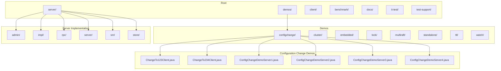
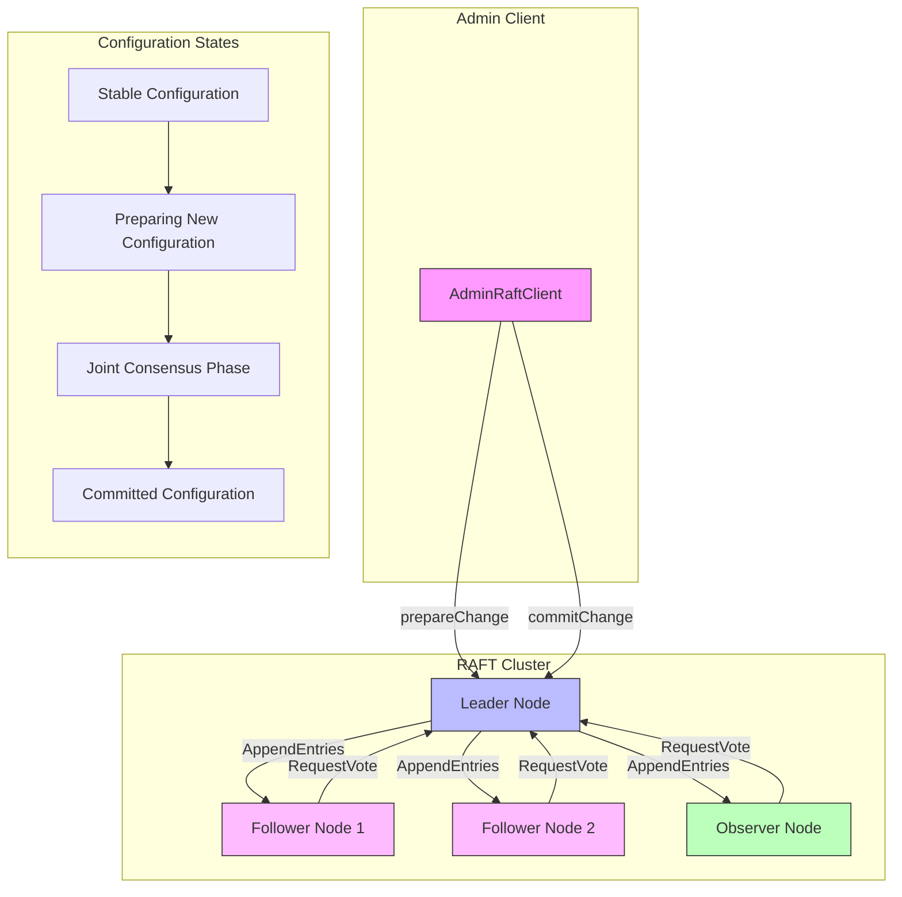
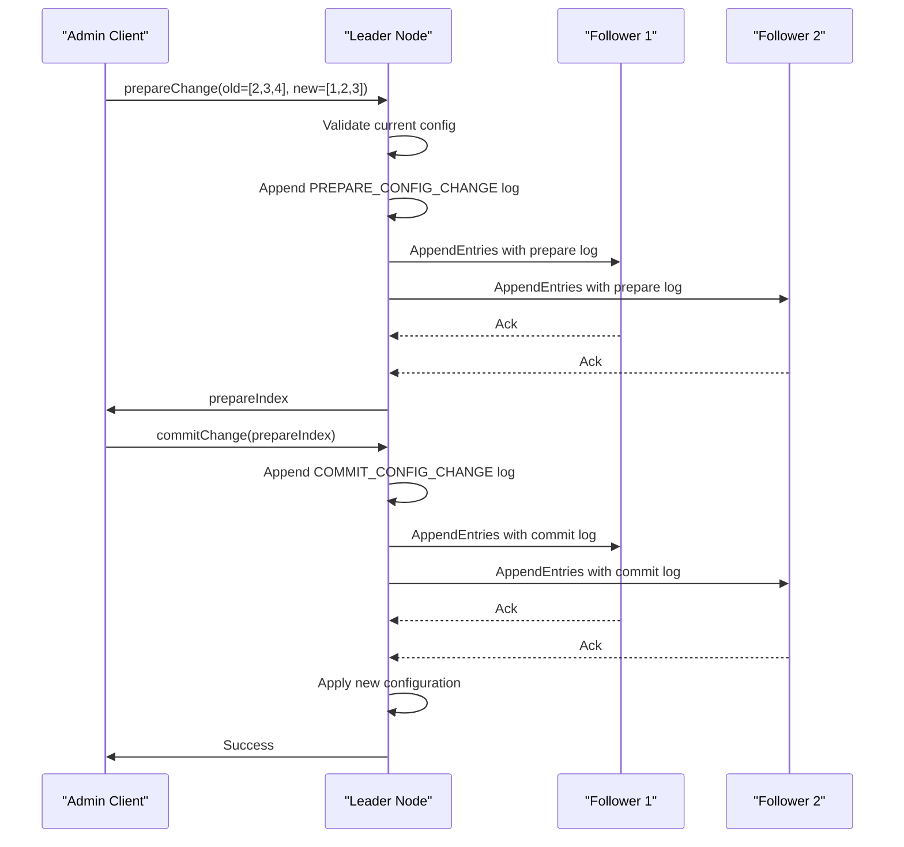
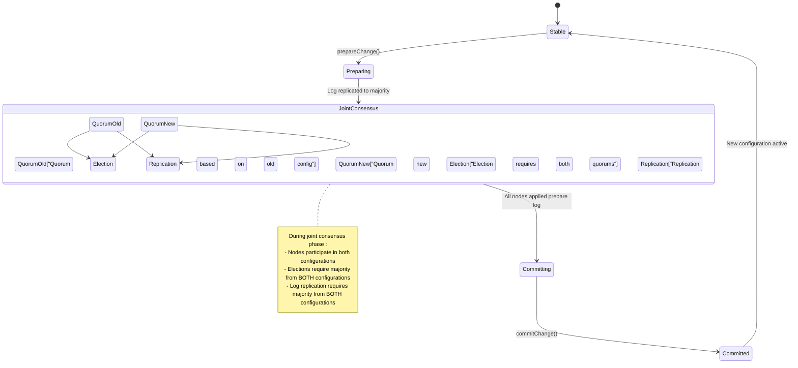
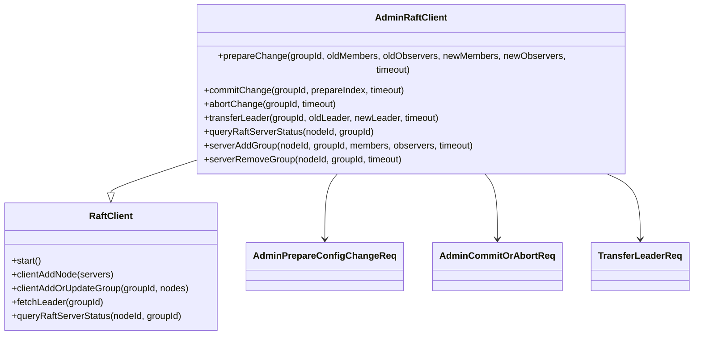
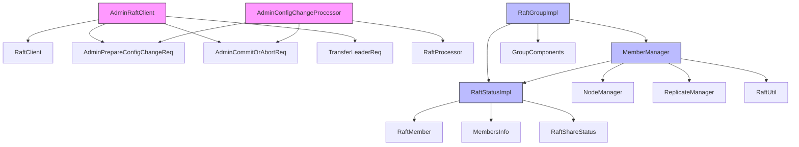

# Configuration Change Demo

<cite>
**Referenced Files in This Document**   
- [ChangeTo123Client.java](file://demos/src/main/java/com/github/dtprj/dongting/demos/configchange/ChangeTo123Client.java)
- [ChangeTo234Client.java](file://demos/src/main/java/com/github/dtprj/dongting/demos/configchange/ChangeTo234Client.java)
- [ConfigChangeDemoServer1.java](file://demos/src/main/java/com/github/dtprj/dongting/demos/configchange/ConfigChangeDemoServer1.java)
- [ConfigChangeDemoServer2.java](file://demos/src/main/java/com/github/dtprj/dongting/demos/configchange/ConfigChangeDemoServer2.java)
- [ConfigChangeDemoServer3.java](file://demos/src/main/java/com/github/dtprj/dongting/demos/configchange/ConfigChangeDemoServer3.java)
- [ConfigChangeDemoServer4.java](file://demos/src/main/java/com/github/dtprj/dongting/demos/configchange/ConfigChangeDemoServer4.java)
- [AdminRaftClient.java](file://server/src/main/java/com/github/dtprj/dongting/raft/admin/AdminRaftClient.java)
- [AdminConfigChangeProcessor.java](file://server/src/main/java/com/github/dtprj/dongting/raft/rpc/AdminConfigChangeProcessor.java)
- [RaftGroupImpl.java](file://server/src/main/java/com/github/dtprj/dongting/raft/impl/RaftGroupImpl.java)
- [MemberManager.java](file://server/src/main/java/com/github/dtprj/dongting/raft/impl/MemberManager.java)
- [RaftStatusImpl.java](file://server/src/main/java/com/github/dtprj/dongting/raft/impl/RaftStatusImpl.java)
- [AdminPrepareConfigChangeReq.java](file://server/src/main/java/com/github/dtprj/dongting/raft/rpc/AdminPrepareConfigChangeReq.java)
- [AdminCommitOrAbortReq.java](file://server/src/main/java/com/github/dtprj/dongting/raft/rpc/AdminCommitOrAbortReq.java)
</cite>

## Table of Contents
1. [Introduction](#introduction)
2. [Project Structure](#project-structure)
3. [Core Components](#core-components)
4. [Architecture Overview](#architecture-overview)
5. [Detailed Component Analysis](#detailed-component-analysis)
6. [Dependency Analysis](#dependency-analysis)
7. [Performance Considerations](#performance-considerations)
8. [Troubleshooting Guide](#troubleshooting-guide)
9. [Conclusion](#conclusion)

## Introduction
This document provides a comprehensive demonstration of dynamic membership changes in the Dongting RAFT implementation. It explains the RAFT joint consensus algorithm for safe configuration changes, detailing step-by-step procedures for adding and removing nodes from a running cluster. The documentation covers code examples for initiating configuration changes via admin clients, monitoring progress, and verifying completion. It demonstrates the transition between different cluster configurations (e.g., 1→2→3 nodes) with proper quorum management, leadership transfer during reconfiguration, and safety guarantees that prevent split-brain scenarios. The document also addresses common pitfalls such as incomplete changes, network failures during reconfiguration, and rollback procedures.

## Project Structure
The Dongting project structure is organized into several key directories that support the RAFT consensus algorithm implementation and its demonstration. The core functionality is distributed across client, server, and demo modules, with specific emphasis on configuration change operations in the demos directory.



**Diagram sources**
- [ChangeTo123Client.java](file://demos/src/main/java/com/github/dtprj/dongting/demos/configchange/ChangeTo123Client.java)
- [ChangeTo234Client.java](file://demos/src/main/java/com/github/dtprj/dongting/demos/configchange/ChangeTo234Client.java)
- [ConfigChangeDemoServer1.java](file://demos/src/main/java/com/github/dtprj/dongting/demos/configchange/ConfigChangeDemoServer1.java)
- [ConfigChangeDemoServer2.java](file://demos/src/main/java/com/github/dtprj/dongting/demos/configchange/ConfigChangeDemoServer2.java)
- [ConfigChangeDemoServer3.java](file://demos/src/main/java/com/github/dtprj/dongting/demos/configchange/ConfigChangeDemoServer3.java)
- [ConfigChangeDemoServer4.java](file://demos/src/main/java/com/github/dtprj/dongting/demos/configchange/ConfigChangeDemoServer4.java)

**Section sources**
- [ChangeTo123Client.java](file://demos/src/main/java/com/github/dtprj/dongting/demos/configchange/ChangeTo123Client.java)
- [ChangeTo234Client.java](file://demos/src/main/java/com/github/dtprj/dongting/demos/configchange/ChangeTo234Client.java)
- [ConfigChangeDemoServer1.java](file://demos/src/main/java/com/github/dtprj/dongting/demos/configchange/ConfigChangeDemoServer1.java)
- [ConfigChangeDemoServer2.java](file://demos/src/main/java/com/github/dtprj/dongting/demos/configchange/ConfigChangeDemoServer2.java)
- [ConfigChangeDemoServer3.java](file://demos/src/main/java/com/github/dtprj/dongting/demos/configchange/ConfigChangeDemoServer3.java)
- [ConfigChangeDemoServer4.java](file://demos/src/main/java/com/github/dtprj/dongting/demos/configchange/ConfigChangeDemoServer4.java)

## Core Components
The dynamic membership change functionality in Dongting is built around several core components that implement the RAFT joint consensus algorithm. The system provides a robust mechanism for safely changing cluster membership while maintaining consistency and availability. The AdminRaftClient serves as the primary interface for initiating configuration changes, allowing administrators to prepare and commit membership transitions. The MemberManager component on each server node handles the complex state transitions during configuration changes, ensuring that quorum requirements are met throughout the process.

The implementation follows the RAFT joint consensus approach where configuration changes occur in two phases: first preparing the new configuration and then committing it. This ensures that any overlapping majorities between the old and new configurations prevent split-brain scenarios. The system maintains both current and pending (prepared) configurations in its RaftStatus, allowing nodes to participate in elections and log replication according to both configurations during the transition period.

**Section sources**
- [AdminRaftClient.java](file://server/src/main/java/com/github/dtprj/dongting/raft/admin/AdminRaftClient.java)
- [MemberManager.java](file://server/src/main/java/com/github/dtprj/dongting/raft/impl/MemberManager.java)
- [RaftStatusImpl.java](file://server/src/main/java/com/github/dtprj/dongting/raft/impl/RaftStatusImpl.java)

## Architecture Overview
The Dongting RAFT implementation for dynamic membership changes follows a client-server architecture where admin clients communicate with server nodes to initiate and monitor configuration changes. The architecture is designed to ensure safety during membership transitions by implementing the joint consensus algorithm, which requires agreement on both the old and new configurations.



**Diagram sources**
- [AdminRaftClient.java](file://server/src/main/java/com/github/dtprj/dongting/raft/admin/AdminRaftClient.java)
- [RaftGroupImpl.java](file://server/src/main/java/com/github/dtprj/dongting/raft/impl/RaftGroupImpl.java)
- [MemberManager.java](file://server/src/main/java/com/github/dtprj/dongting/raft/impl/MemberManager.java)

## Detailed Component Analysis

### Configuration Change Process Analysis
The dynamic membership change process in Dongting follows the RAFT joint consensus algorithm, which ensures safety during configuration transitions by requiring agreement on both the old and new configurations. This approach prevents split-brain scenarios by guaranteeing that any majority in the old configuration overlaps with any majority in the new configuration.

#### Configuration Change Workflow


**Diagram sources**
- [AdminRaftClient.java](file://server/src/main/java/com/github/dtprj/dongting/raft/admin/AdminRaftClient.java)
- [AdminConfigChangeProcessor.java](file://server/src/main/java/com/github/dtprj/dongting/raft/rpc/AdminConfigChangeProcessor.java)
- [MemberManager.java](file://server/src/main/java/com/github/dtprj/dongting/raft/impl/MemberManager.java)

#### Joint Consensus State Machine


**Diagram sources**
- [RaftStatusImpl.java](file://server/src/main/java/com/github/dtprj/dongting/raft/impl/RaftStatusImpl.java)
- [MemberManager.java](file://server/src/main/java/com/github/dtprj/dongting/raft/impl/MemberManager.java)

### Admin Client Implementation
The AdminRaftClient provides the interface for initiating and managing configuration changes in the RAFT cluster. It offers methods for preparing and committing configuration changes, transferring leadership, and querying cluster status.

#### Admin Client Class Structure


**Diagram sources**
- [AdminRaftClient.java](file://server/src/main/java/com/github/dtprj/dongting/raft/admin/AdminRaftClient.java)
- [AdminPrepareConfigChangeReq.java](file://server/src/main/java/com/github/dtprj/dongting/raft/rpc/AdminPrepareConfigChangeReq.java)
- [AdminCommitOrAbortReq.java](file://server/src/main/java/com/github/dtprj/dongting/raft/rpc/AdminCommitOrAbortReq.java)

**Section sources**
- [AdminRaftClient.java](file://server/src/main/java/com/github/dtprj/dongting/raft/admin/AdminRaftClient.java)
- [AdminPrepareConfigChangeReq.java](file://server/src/main/java/com/github/dtprj/dongting/raft/rpc/AdminPrepareConfigChangeReq.java)
- [AdminCommitOrAbortReq.java](file://server/src/main/java/com/github/dtprj/dongting/raft/rpc/AdminCommitOrAbortReq.java)

### Server-Side Configuration Management
The server-side implementation handles the complex state management required for safe configuration changes. The MemberManager component coordinates the transition between configurations, while the RaftStatus maintains the current and pending configuration states.

#### Member Manager State Transitions
```mermaid
flowchart TD
A[Start Configuration Change] --> B{Validate Current Config}
B --> |Match| C[Append Prepare Log]
B --> |Mismatch| D[Reject Change]
C --> E[Replicate to Majority]
E --> F[Apply Prepare Log]
F --> G[Enter Joint Consensus Phase]
G --> H{All Nodes Applied?}
H --> |Yes| I[Commit Change]
H --> |No| J[Monitor Progress]
I --> K[Append Commit Log]
K --> L[Replicate to Majority]
L --> M[Apply New Configuration]
M --> N[Configuration Complete]
style G fill:#f96,stroke:#333
style H fill:#f96,stroke:#333
note right of G
Joint Consensus Phase:
- Both old and new configurations active
- Quorum calculated from both
- Prevents split-brain
end note
```

**Diagram sources**
- [MemberManager.java](file://server/src/main/java/com/github/dtprj/dongting/raft/impl/MemberManager.java)
- [RaftStatusImpl.java](file://server/src/main/java/com/github/dtprj/dongting/raft/impl/RaftStatusImpl.java)

**Section sources**
- [MemberManager.java](file://server/src/main/java/com/github/dtprj/dongting/raft/impl/MemberManager.java)
- [RaftStatusImpl.java](file://server/src/main/java/com/github/dtprj/dongting/raft/impl/RaftStatusImpl.java)

## Dependency Analysis
The configuration change functionality in Dongting has a well-defined dependency structure that ensures proper separation of concerns while maintaining the necessary coordination between components.



**Diagram sources**
- [AdminRaftClient.java](file://server/src/main/java/com/github/dtprj/dongting/raft/admin/AdminRaftClient.java)
- [AdminConfigChangeProcessor.java](file://server/src/main/java/com/github/dtprj/dongting/raft/rpc/AdminConfigChangeProcessor.java)
- [RaftGroupImpl.java](file://server/src/main/java/com/github/dtprj/dongting/raft/impl/RaftGroupImpl.java)
- [MemberManager.java](file://server/src/main/java/com/github/dtprj/dongting/raft/impl/MemberManager.java)
- [RaftStatusImpl.java](file://server/src/main/java/com/github/dtprj/dongting/raft/impl/RaftStatusImpl.java)

## Performance Considerations
The dynamic membership change implementation in Dongting is designed with performance considerations in mind, particularly regarding the impact of configuration changes on cluster availability and throughput. The joint consensus approach ensures safety but introduces a transitional phase where quorum requirements are more stringent, potentially affecting performance.

During the joint consensus phase, the system requires agreement from majorities in both the old and new configurations, which can increase the latency of operations. However, this is a necessary trade-off for ensuring safety during membership changes. The implementation minimizes the duration of this phase by optimizing the replication and application of configuration change logs.

The system also includes mechanisms to prevent unnecessary configuration changes and to handle failures gracefully, reducing the performance impact of aborted or failed operations. Leadership transfer is optimized to minimize disruption, with checks to ensure the target leader has up-to-date logs before initiating the transfer.

## Troubleshooting Guide
When working with dynamic membership changes in Dongting, several common issues may arise. This section provides guidance on identifying and resolving these issues.

**Section sources**
- [MemberManager.java](file://server/src/main/java/com/github/dtprj/dongting/raft/impl/MemberManager.java)
- [AdminRaftClient.java](file://server/src/main/java/com/github/dtprj/dongting/raft/admin/AdminRaftClient.java)

## Conclusion
The Dongting RAFT implementation provides a robust and safe mechanism for dynamic membership changes through its joint consensus algorithm. By requiring agreement on both old and new configurations during transitions, the system prevents split-brain scenarios and ensures consistency. The two-phase approach of preparing and committing configuration changes allows for safe, incremental updates to cluster membership.

The implementation demonstrates careful attention to detail in handling edge cases, failure scenarios, and performance considerations. The clear separation of concerns between client and server components, along with well-defined interfaces, makes the system both reliable and maintainable. The comprehensive logging and monitoring capabilities enable effective troubleshooting and operational visibility.

This configuration change mechanism is suitable for production environments where high availability and data safety are paramount, providing administrators with the tools needed to safely scale and maintain RAFT clusters.