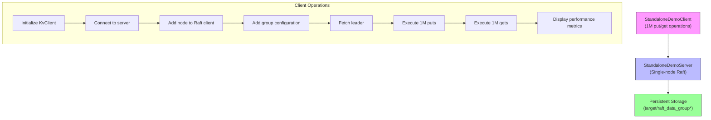
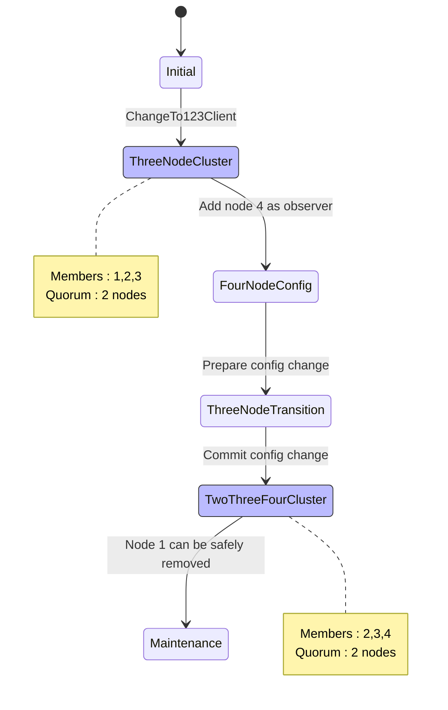
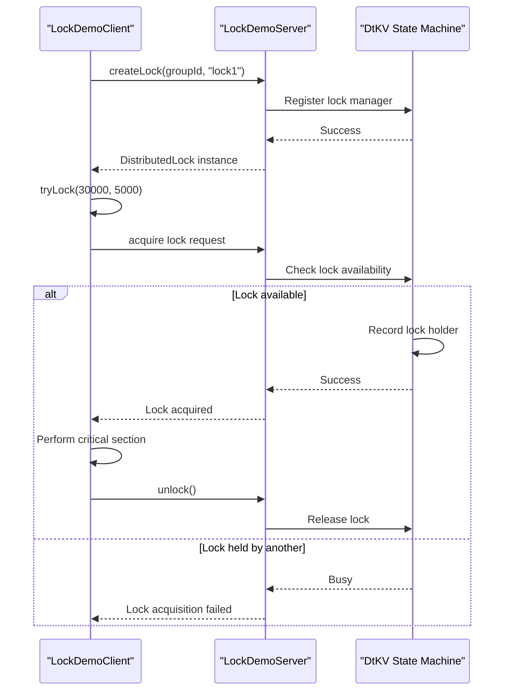
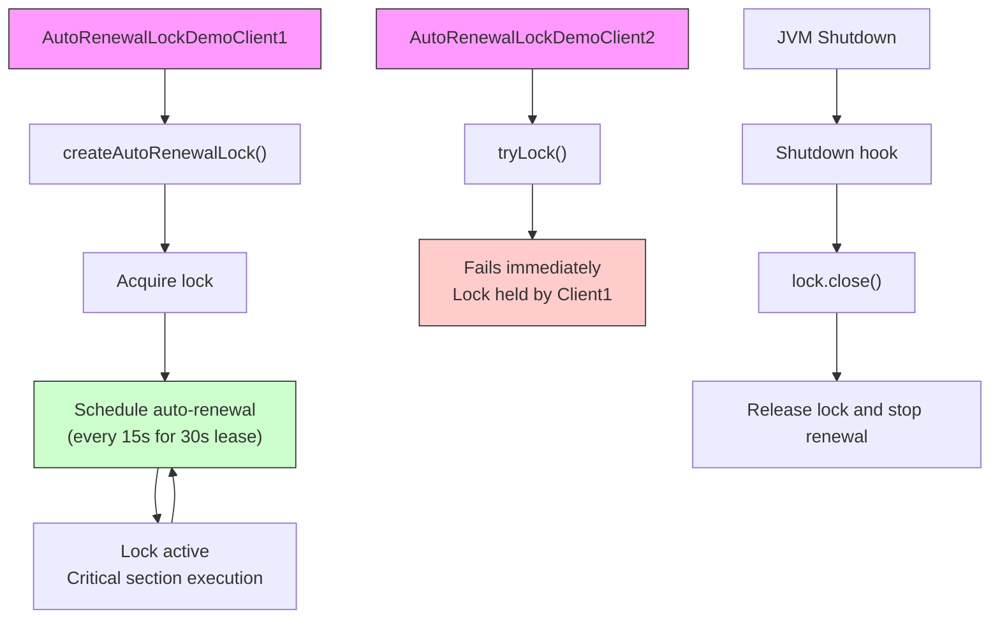
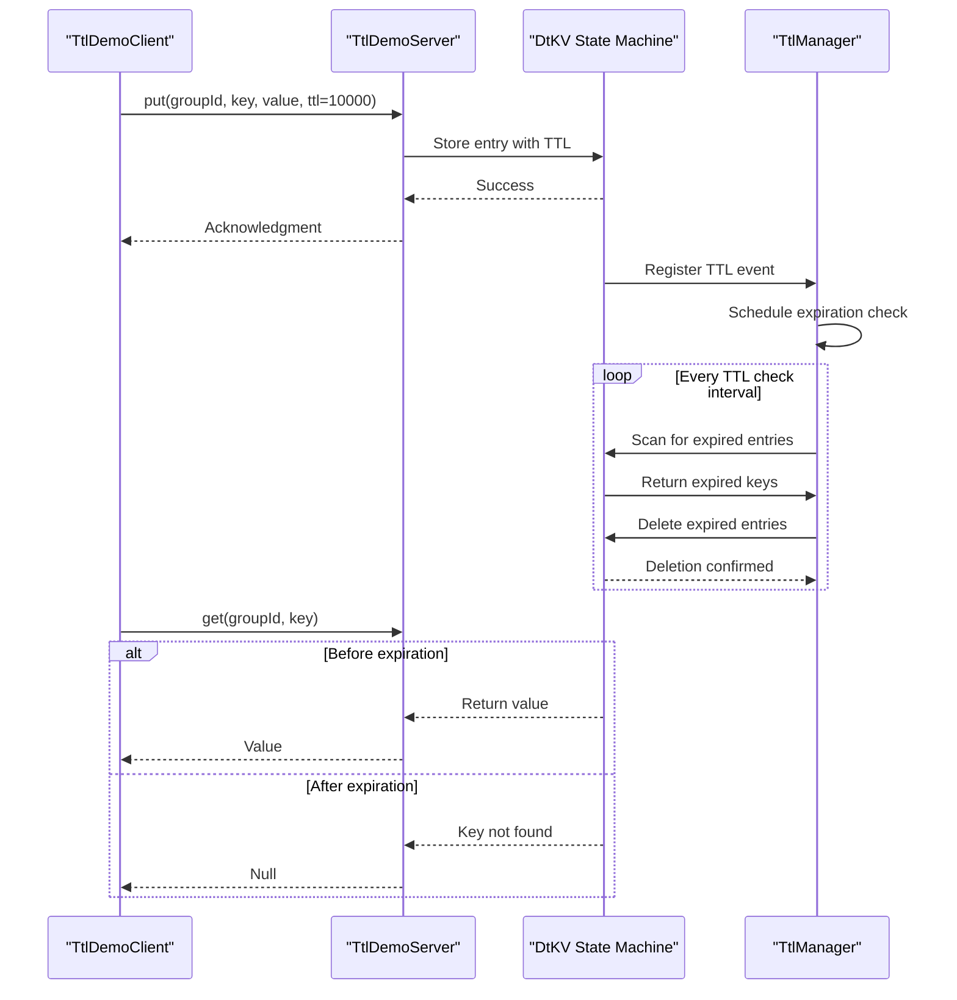
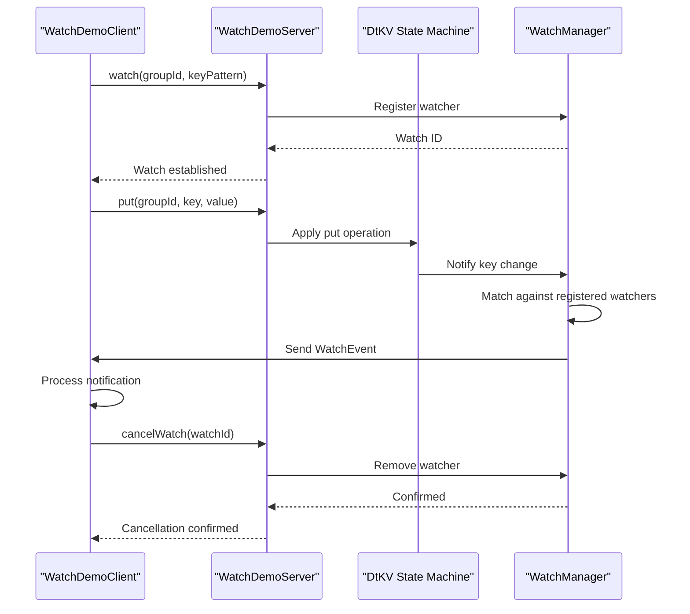

# Demos and Examples

<cite>
**Referenced Files in This Document**   
- [DemoClientBase.java](file://demos/src/main/java/com/github/dtprj/dongting/demos/base/DemoClientBase.java)
- [DemoKvServerBase.java](file://demos/src/main/java/com/github/dtprj/dongting/demos/base/DemoKvServerBase.java)
- [StandaloneDemoClient.java](file://demos/src/main/java/com/github/dtprj/dongting/demos/standalone/StandaloneDemoClient.java)
- [StandaloneDemoServer.java](file://demos/src/main/java/com/github/dtprj/dongting/demos/standalone/StandaloneDemoServer.java)
- [DemoServer1.java](file://demos/src/main/java/com/github/dtprj/dongting/demos/cluster/DemoServer1.java)
- [DemoServer2.java](file://demos/src/main/java/com/github/dtprj/dongting/demos/cluster/DemoServer2.java)
- [DemoServer3.java](file://demos/src/main/java/com/github/dtprj/dongting/demos/cluster/DemoServer3.java)
- [DemoClient.java](file://demos/src/main/java/com/github/dtprj/dongting/demos/cluster/DemoClient.java)
- [PeriodPutClient.java](file://demos/src/main/java/com/github/dtprj/dongting/demos/cluster/PeriodPutClient.java)
- [EmbeddedDemo.java](file://demos/src/main/java/com/github/dtprj/dongting/demos/embedded/EmbeddedDemo.java)
- [LockDemoClient.java](file://demos/src/main/java/com/github/dtprj/dongting/demos/lock/LockDemoClient.java)
- [LockDemoServer.java](file://demos/src/main/java/com/github/dtprj/dongting/demos/lock/LockDemoServer.java)
- [AutoRenewalLockDemoClient1.java](file://demos/src/main/java/com/github/dtprj/dongting/demos/lock/AutoRenewalLockDemoClient1.java)
- [AutoRenewalLockDemoClient2.java](file://demos/src/main/java/com/github/dtprj/dongting/demos/lock/AutoRenewalLockDemoClient2.java)
- [ChangeTo123Client.java](file://demos/src/main/java/com/github/dtprj/dongting/demos/configchange/ChangeTo123Client.java)
- [ConfigChangeDemoServer1.java](file://demos/src/main/java/com/github/dtprj/dongting/demos/configchange/ConfigChangeDemoServer1.java)
- [AddGroup103Demo.java](file://demos/src/main/java/com/github/dtprj/dongting/demos/multiraft/AddGroup103Demo.java)
- [MultiRaftDemoServer1.java](file://demos/src/main/java/com/github/dtprj/dongting/demos/multiraft/MultiRaftDemoServer1.java)
- [TtlDemoClient.java](file://demos/src/main/java/com/github/dtprj/dongting/demos/ttl/TtlDemoClient.java)
- [TtlDemoServer.java](file://demos/src/main/java/com/github/dtprj/dongting/demos/ttl/TtlDemoServer.java)
- [WatchDemoClient.java](file://demos/src/main/java/com/github/dtprj/dongting/demos/watch/WatchDemoClient.java)
- [WatchDemoServer.java](file://demos/src/main/java/com/github/dtprj/dongting/demos/watch/WatchDemoServer.java)
</cite>

## Table of Contents
1. [Introduction](#introduction)
2. [Standalone Demo](#standalone-demo)
3. [Cluster Demo](#cluster-demo)
4. [Embedded Demo](#embedded-demo)
5. [ConfigChange Demo](#configchange-demo)
6. [MultiRaft Demo](#multiraft-demo)
7. [Lock Demo](#lock-demo)
8. [Auto-Renewal Locks](#auto-renewal-locks)
9. [TTL Demo](#ttl-demo)
10. [Watch Demo](#watch-demo)
11. [Troubleshooting Guide](#troubleshooting-guide)

## Introduction
This document provides comprehensive documentation for the Dongting demos, focusing on practical application of distributed coordination features. The demos progressively introduce complexity from basic operations to advanced distributed coordination patterns. Each demo demonstrates specific architectural patterns and API usage patterns for different deployment scenarios and coordination primitives.

**Section sources**
- [DemoClientBase.java](file://demos/src/main/java/com/github/dtprj/dongting/demos/base/DemoClientBase.java#L1-L86)
- [DemoKvServerBase.java](file://demos/src/main/java/com/github/dtprj/dongting/demos/base/DemoKvServerBase.java#L1-L84)

## Standalone Demo

The standalone demo demonstrates a single-node Raft group configuration, ideal for development and testing. It shows the minimal setup required to run a Dongting-based key-value store.

The demo consists of two components:
- StandaloneDemoServer: A single-node Raft server with service port 5001
- StandaloneDemoClient: A client that performs 1 million put/get operations with linearizable consistency

The client uses the `putAndGetFixCount` method from DemoClientBase to measure throughput and latency. The server configuration sets up a single-node Raft group with fast election timeouts (3000ms) for quick startup.



**Diagram sources**
- [StandaloneDemoClient.java](file://demos/src/main/java/com/github/dtprj/dongting/demos/standalone/StandaloneDemoClient.java#L1-L39)
- [StandaloneDemoServer.java](file://demos/src/main/java/com/github/dtprj/dongting/demos/standalone/StandaloneDemoServer.java#L1-L33)

**Section sources**
- [StandaloneDemoClient.java](file://demos/src/main/java/com/github/dtprj/dongting/demos/standalone/StandaloneDemoClient.java#L1-L39)
- [StandaloneDemoServer.java](file://demos/src/main/java/com/github/dtprj/dongting/demos/standalone/StandaloneDemoServer.java#L1-L33)

## Cluster Demo

The cluster demo demonstrates a 3-node RAFT consensus algorithm implementation with high availability and fault tolerance. This configuration provides linearizable consistency and can tolerate one node failure.

The demo includes:
- Three server instances (DemoServer1, DemoServer2, DemoServer3) running on ports 4001-4003 (replication) and 5001-5003 (service)
- A client application that performs 1 million put/get operations across the cluster
- A periodical client that continuously puts data every second

The servers form a Raft group with members 1,2,3 and use the DtKV state machine for key-value storage. The client automatically discovers the leader and routes requests accordingly.

```mermaid
graph TB
subgraph "Raft Cluster"
S1["DemoServer1\nNode 1\nReplicate:4001\nService:5001"]
S2["DemoServer2\nNode 2\nReplicate:4002\nService:5002"]
S3["DemoServer3\nNode 3\nReplicate:4003\nService:5003"]
S1 < --> S2
S2 < --> S3
S1 < --> S3
end
Client["DemoClient\n(1M operations)"] --> S1
Client --> S2
Client --> S3
PeriodClient["PeriodPutClient\n(Puts every 1s)"] --> S1
PeriodClient --> S2
PeriodClient --> S3
S1 --> Data1["Data: raft_data_group*_node1"]
S2 --> Data2["Data: raft_data_group*_node2"]
S3 --> Data3["Data: raft_data_group*_node3"]
style S1 fill:#bbf,stroke:#333
style S2 fill:#bbf,stroke:#333
style S3 fill:#bbf,stroke:#333
style Client fill:#f9f,stroke:#333
style PeriodClient fill:#f9f,stroke:#333
```

**Diagram sources**
- [DemoServer1.java](file://demos/src/main/java/com/github/dtprj/dongting/demos/cluster/DemoServer1.java#L1-L33)
- [DemoServer2.java](file://demos/src/main/java/com/github/dtprj/dongting/demos/cluster/DemoServer2.java#L1-L33)
- [DemoServer3.java](file://demos/src/main/java/com/github/dtprj/dongting/demos/cluster/DemoServer3.java#L1-L33)
- [DemoClient.java](file://demos/src/main/java/com/github/dtprj/dongting/demos/cluster/DemoClient.java#L1-L39)
- [PeriodPutClient.java](file://demos/src/main/java/com/github/dtprj/dongting/demos/cluster/PeriodPutClient.java#L1-L51)

**Section sources**
- [DemoServer1.java](file://demos/src/main/java/com/github/dtprj/dongting/demos/cluster/DemoServer1.java#L1-L33)
- [DemoServer2.java](file://demos/src/main/java/com/github/dtprj/dongting/demos/cluster/DemoServer2.java#L1-L33)
- [DemoServer3.java](file://demos/src/main/java/com/github/dtprj/dongting/demos/cluster/DemoServer3.java#L1-L33)
- [DemoClient.java](file://demos/src/main/java/com/github/dtprj/dongting/demos/cluster/DemoClient.java#L1-L39)
- [PeriodPutClient.java](file://demos/src/main/java/com/github/dtprj/dongting/demos/cluster/PeriodPutClient.java#L1-L51)

## Embedded Demo

The embedded demo demonstrates how to run multiple Raft servers within a single JVM process, useful for testing and integration scenarios. This pattern allows complete control over the cluster lifecycle from a single application.

The demo starts three Raft servers (nodes 1, 2, 3) programmatically, waits for all groups to become ready, then runs the same performance test as other demos. This approach eliminates external process dependencies and provides deterministic startup.

```mermaid
flowchart TD
Main["EmbeddedDemo\nMain Application"] --> S1["RaftServer\nNode 1"]
Main --> S2["RaftServer\nNode 2"]
Main --> S3["RaftServer\nNode 3"]
S1 < --> S2
S2 < --> S3
S1 < --> S3
Main --> Client["KvClient\n(1M operations)"]
Client --> S1
Client --> S2
Client --> S3
S1 --> Data1["Data: raft_data_group*_node1"]
S2 --> Data2["Data: raft_data_group*_node2"]
S3 --> Data3["Data: raft_data_group*_node3"]
subgraph "Execution Flow"
A["Start all servers"] --> B["Wait for group readiness"]
B --> C["Run performance test"]
C --> D["Shutdown all components"]
end
style Main fill:#f96,stroke:#333
style S1 fill:#bbf,stroke:#333
style S2 fill:#bbf,stroke:#333
style S3 fill:#bbf,stroke:#333
style Client fill:#f9f,stroke:#333
```

**Diagram sources**
- [EmbeddedDemo.java](file://demos/src/main/java/com/github/dtprj/dongting/demos/embedded/EmbeddedDemo.java#L1-L61)

**Section sources**
- [EmbeddedDemo.java](file://demos/src/main/java/com/github/dtprj/dongting/demos/embedded/EmbeddedDemo.java#L1-L61)

## ConfigChange Demo

The configchange demo demonstrates dynamic membership updates in a Raft cluster, allowing runtime addition and removal of nodes without service interruption. This feature enables cluster scaling and maintenance.

The demo includes four servers (nodes 1-4) and two client applications:
- ChangeTo123Client: Configures the cluster to use nodes 1,2,3 as members
- ChangeTo234Client: Reconfigures the cluster to use nodes 2,3,4 as members

This demonstrates the atomic configuration change process where the Raft cluster transitions from one quorum to another while maintaining consistency.



**Diagram sources**
- [ChangeTo123Client.java](file://demos/src/main/java/com/github/dtprj/dongting/demos/configchange/ChangeTo123Client.java)
- [ConfigChangeDemoServer1.java](file://demos/src/main/java/com/github/dtprj/dongting/demos/configchange/ConfigChangeDemoServer1.java)

**Section sources**
- [ChangeTo123Client.java](file://demos/src/main/java/com/github/dtprj/dongting/demos/configchange/ChangeTo123Client.java)
- [ChangeTo234Client.java](file://demos/src/main/java/com/github/dtprj/dongting/demos/configchange/ChangeTo234Client.java)
- [ConfigChangeDemoServer1.java](file://demos/src/main/java/com/github/dtprj/dongting/demos/configchange/ConfigChangeDemoServer1.java)

## MultiRaft Demo

The multiraft demo demonstrates support for multiple independent Raft groups within the same cluster, enabling resource isolation and independent failure domains. This architecture allows different applications or tenants to have their own consensus groups.

The demo shows:
- Three servers running multiple Raft groups
- Dynamic addition and removal of Raft groups at runtime
- Independent configuration and operation of each group

This pattern is useful for multi-tenant systems where different services need independent consensus without affecting each other.

```mermaid
graph TB
subgraph "Server 1"
S1G1["Raft Group 101"]
S1G2["Raft Group 102"]
S1G3["Raft Group 103"]
end
subgraph "Server 2"
S2G1["Raft Group 101"]
S2G2["Raft Group 102"]
S2G3["Raft Group 103"]
end
subgraph "Server 3"
S3G1["Raft Group 101"]
S3G2["Raft Group 102"]
S3G3["Raft Group 103"]
end
S1G1 < --> S2G1
S2G1 < --> S3G1
S1G1 < --> S3G1
S1G2 < --> S2G2
S2G2 < --> S3G2
S1G2 < --> S3G2
S1G3 < --> S2G3
S2G3 < --> S3G3
S1G3 < --> S3G3
Client1["Client Group 101"] --> S1G1
Client2["Client Group 102"] --> S1G2
Client3["Client Group 103"] --> S1G3
AddDemo["AddGroup103Demo"] --> S1G3
RemoveDemo["RemoveGroup103Demo"] --> S1G3
style S1G1 fill:#bbf,stroke:#333
style S2G1 fill:#bbf,stroke:#333
style S3G1 fill:#bbf,stroke:#333
style S1G2 fill:#bbf,stroke:#333
style S2G2 fill:#bbf,stroke:#333
style S3G2 fill:#bbf,stroke:#333
style S1G3 fill:#bbf,stroke:#333
style S2G3 fill:#bbf,stroke:#333
style S3G3 fill:#bbf,stroke:#333
```

**Diagram sources**
- [AddGroup103Demo.java](file://demos/src/main/java/com/github/dtprj/dongting/demos/multiraft/AddGroup103Demo.java)
- [MultiRaftDemoServer1.java](file://demos/src/main/java/com/github/dtprj/dongting/demos/multiraft/MultiRaftDemoServer1.java)

**Section sources**
- [AddGroup103Demo.java](file://demos/src/main/java/com/github/dtprj/dongting/demos/multiraft/AddGroup103Demo.java)
- [RemoveGroup103Demo.java](file://demos/src/main/java/com/github/dtprj/dongting/demos/multiraft/RemoveGroup103Demo.java)
- [MultiRaftDemoServer1.java](file://demos/src/main/java/com/github/dtprj/dongting/demos/multiraft/MultiRaftDemoServer1.java)

## Lock Demo

The lock demo demonstrates distributed locking capabilities using the Raft consensus algorithm. This provides strongly consistent distributed mutexes that can be used for coordination across distributed systems.

The demo shows:
- Creation of a distributed lock using KvClient.createLock()
- Blocking acquisition with timeout (tryLock with 30s wait, 5s lease)
- Proper cleanup with unlock() operation

The lock implementation ensures linearizable semantics and automatic release on session expiration.



**Diagram sources**
- [LockDemoClient.java](file://demos/src/main/java/com/github/dtprj/dongting/demos/lock/LockDemoClient.java#L1-L50)
- [LockDemoServer.java](file://demos/src/main/java/com/github/dtprj/dongting/demos/lock/LockDemoServer.java#L1-L33)

**Section sources**
- [LockDemoClient.java](file://demos/src/main/java/com/github/dtprj/dongting/demos/lock/LockDemoClient.java#L1-L50)
- [LockDemoServer.java](file://demos/src/main/java/com/github/dtprj/dongting/demos/lock/LockDemoServer.java#L1-L33)

## Auto-Renewal Locks

The auto-renewal locks demo demonstrates a higher-level locking pattern where the client library automatically renews the lock lease to prevent expiration during long-running operations. This is essential for operations that exceed the typical lease duration.

The demo includes two client applications:
- AutoRenewalLockDemoClient1: Creates an auto-renewing lock with 30s lease time
- AutoRenewalLockDemoClient2: Attempts to acquire the same lock (will fail if first client holds it)

The implementation includes event listeners for lock acquisition and loss, and proper shutdown hooks for cleanup.



**Diagram sources**
- [AutoRenewalLockDemoClient1.java](file://demos/src/main/java/com/github/dtprj/dongting/demos/lock/AutoRenewalLockDemoClient1.java#L1-L58)
- [AutoRenewalLockDemoClient2.java](file://demos/src/main/java/com/github/dtprj/dongting/demos/lock/AutoRenewalLockDemoClient2.java#L1-L29)

**Section sources**
- [AutoRenewalLockDemoClient1.java](file://demos/src/main/java/com/github/dtprj/dongting/demos/lock/AutoRenewalLockDemoClient1.java#L1-L58)
- [AutoRenewalLockDemoClient2.java](file://demos/src/main/java/com/github/dtprj/dongting/demos/lock/AutoRenewalLockDemoClient2.java#L1-L29)

## TTL Demo

The TTL demo demonstrates time-to-live functionality for key-value entries, allowing automatic expiration of data after a specified period. This is useful for caching, session management, and temporary data storage.

The implementation uses the Raft consensus algorithm to ensure consistent expiration across all replicas, with a dedicated TtlManager component that scans for expired entries.



**Diagram sources**
- [TtlDemoClient.java](file://demos/src/main/java/com/github/dtprj/dongting/demos/ttl/TtlDemoClient.java)
- [TtlDemoServer.java](file://demos/src/main/java/com/github/dtprj/dongting/demos/ttl/TtlDemoServer.java)

**Section sources**
- [TtlDemoClient.java](file://demos/src/main/java/com/github/dtprj/dongting/demos/ttl/TtlDemoClient.java)
- [TtlDemoServer.java](file://demos/src/main/java/com/github/dtprj/dongting/demos/ttl/TtlDemoServer.java)

## Watch Demo

The watch demo demonstrates change notification functionality, allowing clients to receive real-time updates when specific keys or key prefixes are modified. This enables reactive programming patterns and efficient data synchronization.

The implementation uses a WatchManager to maintain client subscriptions and a notification system to deliver changes with minimal latency.



**Diagram sources**
- [WatchDemoClient.java](file://demos/src/main/java/com/github/dtprj/dongting/demos/watch/WatchDemoClient.java)
- [WatchDemoServer.java](file://demos/src/main/java/com/github/dtprj/dongting/demos/watch/WatchDemoServer.java)

**Section sources**
- [WatchDemoClient.java](file://demos/src/main/java/com/github/dtprj/dongting/demos/watch/WatchDemoClient.java)
- [WatchDemoServer.java](file://demos/src/main/java/com/github/dtprj/dongting/demos/watch/WatchDemoServer.java)

## Troubleshooting Guide

This section provides guidance for common issues encountered when running the Dongting demos.

### Connection Issues
- **Symptom**: Client cannot connect to server
- **Solution**: Verify server ports (4000+nodeId for replication, 5000+nodeId for service) and IP addresses in configuration
- **Check**: Ensure servers are started before clients and firewalls allow the required ports

### Leader Election Failures
- **Symptom**: No leader elected, cluster not operational
- **Solution**: Ensure majority of nodes are running (2 out of 3 for 3-node cluster)
- **Check**: Verify network connectivity between nodes and correct server lists in configuration

### Performance Issues
- **Symptom**: Low throughput or high latency
- **Solution**: Enable syncForce=false in RaftGroupConfig for better performance (at cost of durability)
- **Check**: Monitor system resources (CPU, disk I/O) and adjust electTimeout/heartbeatInterval settings

### Lock Contention
- **Symptom**: Lock acquisition timeouts
- **Solution**: Adjust lease duration and retry intervals based on application needs
- **Check**: Ensure proper lock cleanup in finally blocks or shutdown hooks

### Configuration Change Failures
- **Symptom**: Config change operations not completing
- **Solution**: Ensure cluster has stable leader and sufficient nodes available
- **Check**: Verify that the new configuration maintains quorum requirements

### TTL Expiration Issues
- **Symptom**: Keys not expiring as expected
- **Solution**: Verify TTL values are set correctly in put operations
- **Check**: Confirm TtlManager is properly initialized in the server configuration

### Watch Notification Delays
- **Symptom**: Delayed or missing watch events
- **Solution**: Check network connectivity and client processing speed
- **Check**: Verify watch patterns match the modified keys

**Section sources**
- [DemoClientBase.java](file://demos/src/main/java/com/github/dtprj/dongting/demos/base/DemoClientBase.java)
- [DemoKvServerBase.java](file://demos/src/main/java/com/github/dtprj/dongting/demos/base/DemoKvServerBase.java)
- [StandaloneDemoClient.java](file://demos/src/main/java/com/github/dtprj/dongting/demos/standalone/StandaloneDemoClient.java)
- [StandaloneDemoServer.java](file://demos/src/main/java/com/github/dtprj/dongting/demos/standalone/StandaloneDemoServer.java)
- [DemoServer1.java](file://demos/src/main/java/com/github/dtprj/dongting/demos/cluster/DemoServer1.java)
- [DemoClient.java](file://demos/src/main/java/com/github/dtprj/dongting/demos/cluster/DemoClient.java)
- [EmbeddedDemo.java](file://demos/src/main/java/com/github/dtprj/dongting/demos/embedded/EmbeddedDemo.java)
- [LockDemoClient.java](file://demos/src/main/java/com/github/dtprj/dongting/demos/lock/LockDemoClient.java)
- [AutoRenewalLockDemoClient1.java](file://demos/src/main/java/com/github/dtprj/dongting/demos/lock/AutoRenewalLockDemoClient1.java)
- [TtlDemoClient.java](file://demos/src/main/java/com/github/dtprj/dongting/demos/ttl/TtlDemoClient.java)
- [WatchDemoClient.java](file://demos/src/main/java/com/github/dtprj/dongting/demos/watch/WatchDemoClient.java)