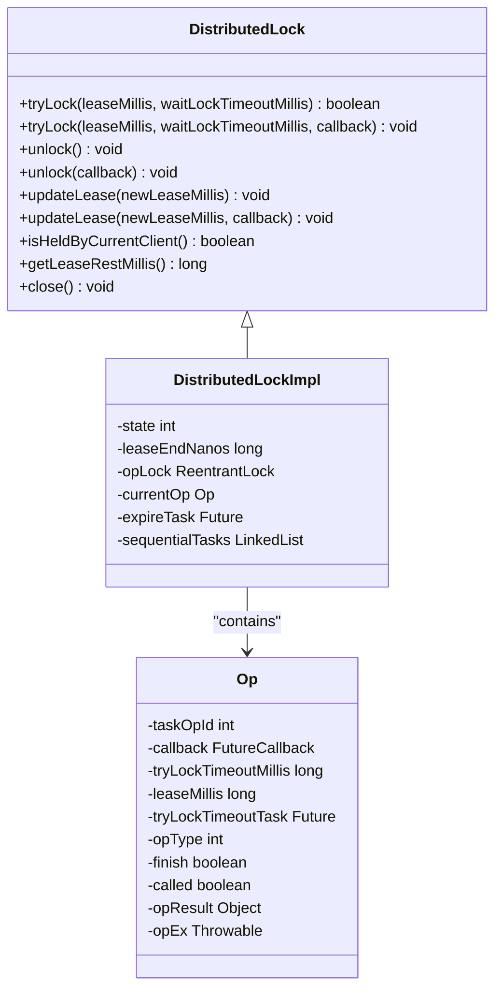
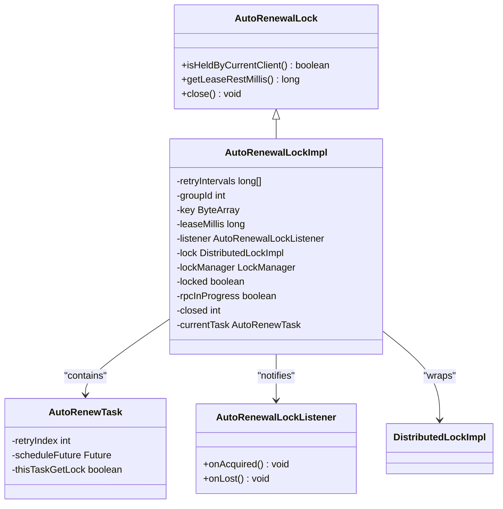
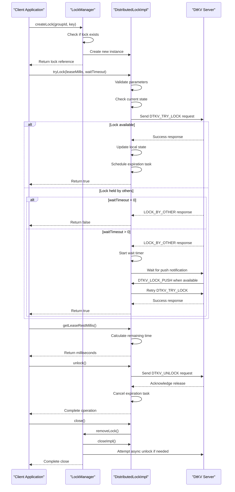
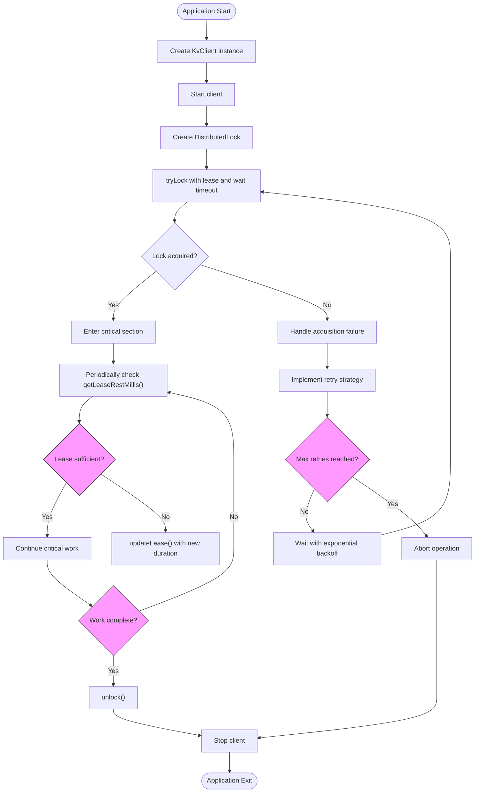
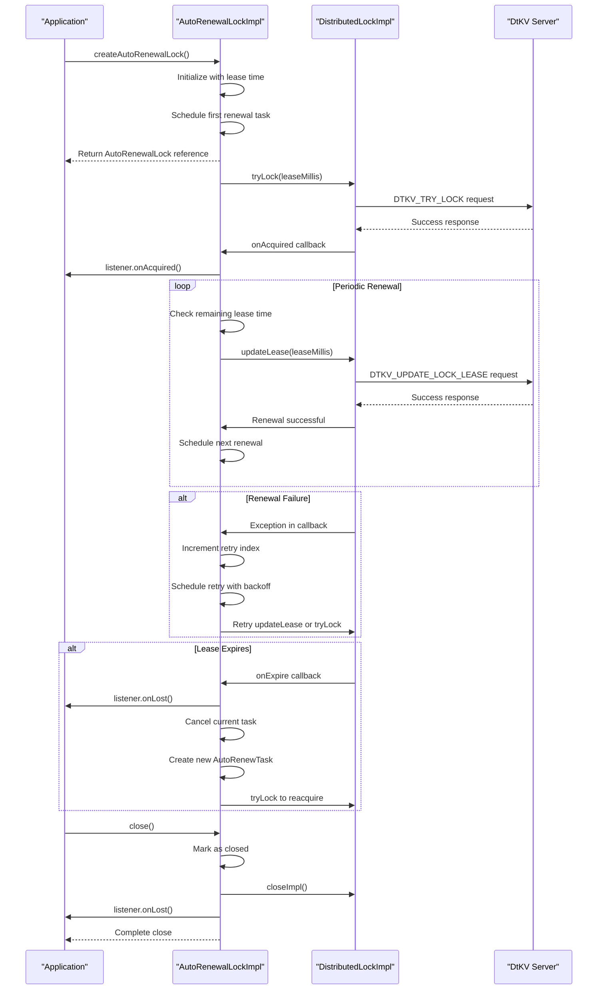
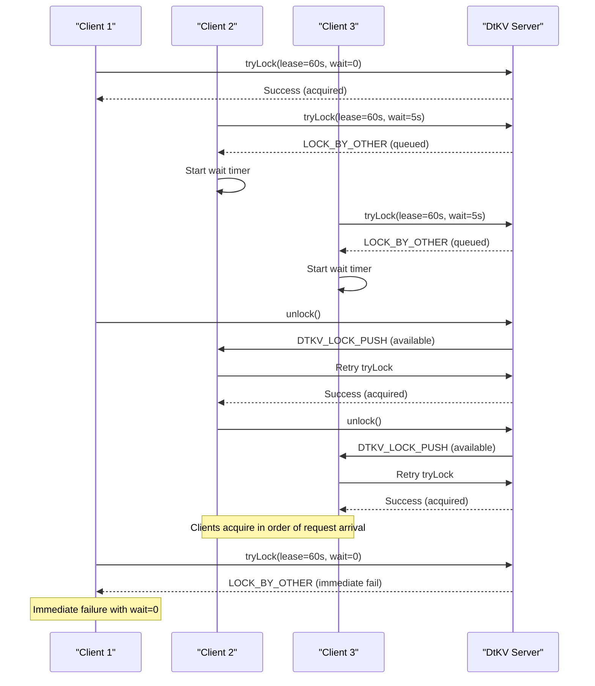
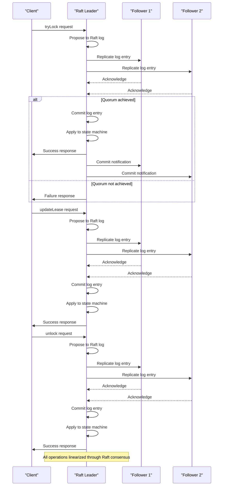
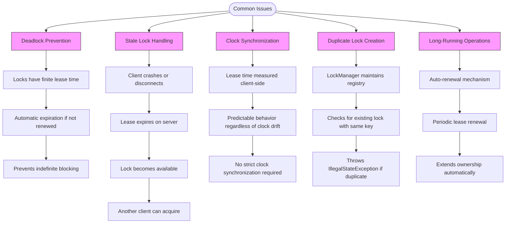

# Distributed Lock Demo

<cite>
**Referenced Files in This Document**   
- [DistributedLock.java](file://client/src/main/java/com/github/dtprj/dongting/dtkv/DistributedLock.java)
- [DistributedLockImpl.java](file://client/src/main/java/com/github/dtprj/dongting/dtkv/DistributedLockImpl.java)
- [AutoRenewalLock.java](file://client/src/main/java/com/github/dtprj/dongting/dtkv/AutoRenewalLock.java)
- [AutoRenewalLockImpl.java](file://client/src/main/java/com/github/dtprj/dongting/dtkv/AutoRenewalLockImpl.java)
- [LockManager.java](file://client/src/main/java/com/github/dtprj/dongting/dtkv/LockManager.java)
- [KvClient.java](file://client/src/main/java/com/github/dtprj/dongting/dtkv/KvClient.java)
- [KvClientConfig.java](file://client/src/main/java/com/github/dtprj/dongting/dtkv/KvClientConfig.java)
- [AutoRenewalLockListener.java](file://client/src/main/java/com/github/dtprj/dongting/dtkv/AutoRenewalLockListener.java)
- [LockDemoClient.java](file://demos/src/main/java/com/github/dtprj/dongting/demos/lock/LockDemoClient.java)
- [AutoRenewalLockDemoClient1.java](file://demos/src/main/java/com/github/dtprj/dongting/demos/lock/AutoRenewalLockDemoClient1.java)
- [AutoRenewalLockDemoClient2.java](file://demos/src/main/java/com/github/dtprj/dongting/demos/lock/AutoRenewalLockDemoClient2.java)
- [LockDemoServer.java](file://demos/src/main/java/com/github/dtprj/dongting/demos/lock/LockDemoServer.java)
- [AutoRenewalLockImplTest.java](file://server/src/test/java/com/github/dtprj/dongting/dtkv/server/AutoRenewalLockImplTest.java)
- [DistributedLockImplTest.java](file://server/src/test/java/com/github/dtprj/dongting/dtkv/server/DistributedLockImplTest.java)
</cite>

## Table of Contents
1. [Introduction](#introduction)
2. [Manual Lock Mechanism](#manual-lock-mechanism)
3. [Auto-Renewal Lock Mechanism](#auto-renewal-lock-mechanism)
4. [Step-by-Step Lock Operations](#step-by-step-lock-operations)
5. [Critical Section Implementation](#critical-section-implementation)
6. [Auto-Renewal Feature](#auto-renewal-feature)
7. [Network Interruption and Client Crash Handling](#network-interruption-and-client-crash-handling)
8. [Lock Contention and Fairness](#lock-contention-and-fairness)
9. [Linearizability Guarantees](#linearizability-guarantees)
10. [Common Issues and Solutions](#common-issues-and-solutions)

## Introduction
This document provides a comprehensive guide to the distributed locking mechanisms in DtKV, focusing on both manual and auto-renewal lock implementations. The distributed locking system enables multiple clients to coordinate access to shared resources in a distributed environment, ensuring data consistency and preventing race conditions. The implementation provides two primary mechanisms: manual locks that require explicit lease management and auto-renewal locks that automatically maintain ownership through periodic renewal. The system is designed to handle various failure scenarios including network interruptions, client crashes, and clock synchronization issues while maintaining linearizability guarantees.

**Section sources**
- [DistributedLock.java](file://client/src/main/java/com/github/dtprj/dongting/dtkv/DistributedLock.java#L21-L30)
- [AutoRenewalLock.java](file://client/src/main/java/com/github/dtprj/dongting/dtkv/AutoRenewalLock.java#L18-L26)

## Manual Lock Mechanism
The manual lock mechanism in DtKV provides explicit control over distributed lock acquisition, release, and lease management. The `DistributedLock` interface offers both synchronous and asynchronous methods for these operations, allowing clients to choose the appropriate approach based on their application requirements. The lock operates with a lease time that starts when the client invokes the `tryLock` method, measured from the client side rather than the server side. This client-side measurement ensures predictable behavior even in the presence of network latency. The lock implementation includes comprehensive error handling for various scenarios including network errors, timeouts, and concurrent operations. Each lock operation is serialized to prevent race conditions within the client, ensuring that only one operation can be in progress at a time.



**Diagram sources **
- [DistributedLock.java](file://client/src/main/java/com/github/dtprj/dongting/dtkv/DistributedLock.java#L31-L152)
- [DistributedLockImpl.java](file://client/src/main/java/com/github/dtprj/dongting/dtkv/DistributedLockImpl.java#L45-L652)

**Section sources**
- [DistributedLock.java](file://client/src/main/java/com/github/dtprj/dongting/dtkv/DistributedLock.java#L21-L152)
- [DistributedLockImpl.java](file://client/src/main/java/com/github/dtprj/dongting/dtkv/DistributedLockImpl.java#L45-L652)

## Auto-Renewal Lock Mechanism
The auto-renewal lock mechanism in DtKV provides a higher-level abstraction for distributed locking that automatically handles lease renewal and reacquisition. This mechanism is particularly useful for leader election scenarios where a client needs to maintain continuous ownership of a resource. The `AutoRenewalLock` interface extends the basic lock functionality with automatic background operations that periodically renew the lease before it expires. If the lock is lost due to network issues or server failures, the mechanism automatically attempts to reacquire it according to a configurable retry strategy. The implementation uses an exponential backoff pattern with configurable retry intervals defined in `KvClientConfig.autoRenewalRetryMillis`. The auto-renewal process is designed to be resilient to transient failures and network partitions, ensuring that clients can maintain leadership even in unstable network conditions.



**Diagram sources **
- [AutoRenewalLock.java](file://client/src/main/java/com/github/dtprj/dongting/dtkv/AutoRenewalLock.java#L34-L67)
- [AutoRenewalLockImpl.java](file://client/src/main/java/com/github/dtprj/dongting/dtkv/AutoRenewalLockImpl.java#L30-L228)
- [AutoRenewalLockListener.java](file://client/src/main/java/com/github/dtprj/dongting/dtkv/AutoRenewalLockListener.java#L29-L44)

**Section sources**
- [AutoRenewalLock.java](file://client/src/main/java/com/github/dtprj/dongting/dtkv/AutoRenewalLock.java#L18-L67)
- [AutoRenewalLockImpl.java](file://client/src/main/java/com/github/dtprj/dongting/dtkv/AutoRenewalLockImpl.java#L30-L228)
- [AutoRenewalLockListener.java](file://client/src/main/java/com/github/dtprj/dongting/dtkv/AutoRenewalLockListener.java#L18-L44)

## Step-by-Step Lock Operations
The distributed locking system in DtKV follows a well-defined sequence for acquiring, monitoring, and releasing locks across multiple clients. The process begins with a client creating a lock instance through the `KvClient.createLock` method, which registers the lock with the `LockManager` and associates it with a specific Raft group and key. When acquiring a lock, the client sends a `DTKV_TRY_LOCK` request containing the desired lease time and operation metadata. The server processes this request and responds with the acquisition result. If another client holds the lock, the requesting client can either return immediately (with wait timeout of 0) or wait for a specified duration. During the wait period, the client receives push notifications when the lock becomes available. Once acquired, the client can monitor its ownership status using `isHeldByCurrentClient()` and check the remaining lease time with `getLeaseRestMillis()`. To release the lock, the client calls the `unlock` method, which sends a `DTKV_UNLOCK` request to the server. The lock can also be explicitly closed using the `close` method, which attempts to release the lock asynchronously and removes the lock instance from the client's registry.



**Diagram sources **
- [DistributedLockImpl.java](file://client/src/main/java/com/github/dtprj/dongting/dtkv/DistributedLockImpl.java#L339-L578)
- [LockManager.java](file://client/src/main/java/com/github/dtprj/dongting/dtkv/LockManager.java#L66-L156)
- [KvClient.java](file://client/src/main/java/com/github/dtprj/dongting/dtkv/KvClient.java#L697-L717)

**Section sources**
- [DistributedLockImpl.java](file://client/src/main/java/com/github/dtprj/dongting/dtkv/DistributedLockImpl.java#L339-L578)
- [LockManager.java](file://client/src/main/java/com/github/dtprj/dongting/dtkv/LockManager.java#L66-L156)
- [KvClient.java](file://client/src/main/java/com/github/dtprj/dongting/dtkv/KvClient.java#L697-L717)

## Critical Section Implementation
Implementing critical sections with proper timeout handling and exception recovery in DtKV requires careful consideration of various failure scenarios. The recommended approach involves wrapping lock operations in try-catch blocks to handle `KvException` for business logic errors and `NetException` for network-related issues such as timeouts and interruptions. For synchronous operations, clients should use appropriate timeout values that balance responsiveness with the likelihood of successful acquisition. The `waitLockTimeoutMillis` parameter should be set to a value less than or equal to the `leaseMillis` to ensure that the client has sufficient time to complete its work after acquiring the lock. For long-running operations, clients should implement periodic lease renewal using the `updateLease` method to prevent premature expiration. Exception recovery strategies should include exponential backoff for retry attempts and circuit breaker patterns for prolonged outages. The implementation should also handle the case where a lock operation is canceled by a subsequent operation, such as calling `unlock` while a `tryLock` operation is still pending.



**Diagram sources **
- [DistributedLock.java](file://client/src/main/java/com/github/dtprj/dongting/dtkv/DistributedLock.java#L53-L152)
- [DistributedLockImpl.java](file://client/src/main/java/com/github/dtprj/dongting/dtkv/DistributedLockImpl.java#L339-L578)

**Section sources**
- [DistributedLock.java](file://client/src/main/java/com/github/dtprj/dongting/dtkv/DistributedLock.java#L53-L152)
- [DistributedLockImpl.java](file://client/src/main/java/com/github/dtprj/dongting/dtkv/DistributedLockImpl.java#L339-L578)

## Auto-Renewal Feature
The auto-renewal feature in DtKV prevents lock expiration during long operations by automatically renewing the lease before it expires. This mechanism is implemented in the `AutoRenewalLockImpl` class, which wraps a `DistributedLockImpl` instance and manages periodic renewal operations in the background. The renewal process begins by scheduling a task to run after half of the lease duration has elapsed. When the task executes, it checks the remaining lease time and initiates a renewal if necessary. The implementation uses a state machine to track whether the client currently holds the lock and whether a renewal operation is in progress. If a renewal attempt fails due to network issues or server errors, the mechanism follows a configurable retry strategy with increasing intervals defined in `KvClientConfig.autoRenewalRetryMillis`. When the lease expires, the `onExpire` callback is triggered, which cancels the current renewal task and starts a new acquisition attempt. This design ensures that clients can maintain continuous ownership of resources even during transient network disruptions or server maintenance windows.



**Diagram sources **
- [AutoRenewalLockImpl.java](file://client/src/main/java/com/github/dtprj/dongting/dtkv/AutoRenewalLockImpl.java#L72-L228)
- [DistributedLockImpl.java](file://client/src/main/java/com/github/dtprj/dongting/dtkv/DistributedLockImpl.java#L454-L511)
- [KvClientConfig.java](file://client/src/main/java/com/github/dtprj/dongting/dtkv/KvClientConfig.java#L30-L31)

**Section sources**
- [AutoRenewalLockImpl.java](file://client/src/main/java/com/github/dtprj/dongting/dtkv/AutoRenewalLockImpl.java#L30-L228)
- [KvClientConfig.java](file://client/src/main/java/com/github/dtprj/dongting/dtkv/KvClientConfig.java#L28-L31)

## Network Interruption and Client Crash Handling
The distributed locking system in DtKV is designed to handle network interruptions and client crashes gracefully through several mechanisms. When a network interruption occurs, the client detects the failure through timeout mechanisms and marks the lock state as unknown. The `isHeldByCurrentClient()` method will return false in this state, indicating that the client cannot guarantee ownership. For auto-renewal locks, the system automatically attempts to reacquire the lock after a configurable retry interval. When a client crashes, the lock's lease will eventually expire on the server side, allowing other clients to acquire it. The server uses a heartbeat mechanism to detect client liveness, with the `watchHeartbeatMillis` parameter in `KvClientConfig` controlling the frequency of these checks. The implementation also handles the case where a client attempts to release a lock after a network interruption by making the `unlock` operation idempotent. The `close` method safely cleans up resources and attempts asynchronous release of the lock, even if the network connection is unavailable.

```mermaid
flowchart TD
ClientState([Client State]) --> Normal["Normal Operation"]
Normal --> NetworkIssue{"Network interruption?"}
NetworkIssue --> |Yes| DetectFailure["Detect timeout/failure"]
DetectFailure --> MarkUnknown["Mark state as STATE_UNKNOWN"]
MarkUnknown --> CheckHeld["isHeldByCurrentClient() returns false"]
CheckHeld --> AutoRenewal{"Auto-renewal lock?"}
AutoRenewal --> |Yes| ScheduleRetry["Schedule retry with backoff"]
ScheduleRetry --> AttemptReacquire["Attempt to reacquire lock"]
AttemptReacquire --> Success{"Acquisition successful?"}
Success --> |Yes| ReturnToNormal["Return to normal operation"]
Success --> |No| ContinueRetry["Continue retry schedule"]
AutoRenewal --> |No| WaitApplication["Wait for application handling"]
NetworkIssue --> |No| ContinueNormal["Continue normal operation"]
ClientCrash([Client Crash]) --> LeaseExpiration["Lease expires on server"]
LeaseExpiration --> ServerCleanup["Server cleans up lock"]
ServerCleanup --> Available["Lock becomes available"]
Available --> OtherClients["Other clients can acquire"]
CloseCalled([close() called]) --> CheckNetwork{"Network available?"}
CheckNetwork --> |Yes| SendUnlock["Send DTKV_UNLOCK request"]
SendUnlock --> ConfirmRelease["Confirm release"]
ConfirmRelease --> Cleanup["Clean up local resources"]
CheckNetwork --> |No| ScheduleAsync["Schedule async unlock attempt"]
ScheduleAsync --> RetryUnlock["Retry when network recovers"]
RetryUnlock --> Cleanup
style NetworkIssue fill:#f9f,stroke:#333
style ClientCrash fill:#f9f,stroke:#333
style CloseCalled fill:#f9f,stroke:#333
```

**Diagram sources **
- [DistributedLockImpl.java](file://client/src/main/java/com/github/dtprj/dongting/dtkv/DistributedLockImpl.java#L49-L52)
- [AutoRenewalLockImpl.java](file://client/src/main/java/com/github/dtprj/dongting/dtkv/AutoRenewalLockImpl.java#L72-L151)
- [KvClientConfig.java](file://client/src/main/java/com/github/dtprj/dongting/dtkv/KvClientConfig.java#L28-L29)

**Section sources**
- [DistributedLockImpl.java](file://client/src/main/java/com/github/dtprj/dongting/dtkv/DistributedLockImpl.java#L49-L52)
- [AutoRenewalLockImpl.java](file://client/src/main/java/com/github/dtprj/dongting/dtkv/AutoRenewalLockImpl.java#L34-L67)
- [KvClientConfig.java](file://client/src/main/java/com/github/dtprj/dongting/dtkv/KvClientConfig.java#L28-L31)

## Lock Contention and Fairness
The distributed locking system in DtKV handles lock contention scenarios through a combination of queuing mechanisms and fair acquisition policies. When multiple clients compete for the same lock, the system uses a first-come-first-served approach based on the order of request arrival at the server. Clients that cannot immediately acquire the lock can specify a `waitLockTimeoutMillis` value to wait for a specified duration before giving up. During this wait period, the server maintains a queue of waiting clients and notifies them when the lock becomes available through push notifications. The implementation ensures fairness by processing waiting clients in the order they requested the lock, preventing starvation of any particular client. For auto-renewal locks, the system handles contention by allowing only one client to successfully acquire the lock at a time, with competing clients automatically retrying according to their configured retry intervals. The test cases in `AutoRenewalLockImplTest` demonstrate this behavior, showing how multiple clients compete for the same lock and how leadership transitions occur when one client fails.



**Diagram sources **
- [DistributedLockImpl.java](file://client/src/main/java/com/github/dtprj/dongting/dtkv/DistributedLockImpl.java#L400-L401)
- [LockManager.java](file://client/src/main/java/com/github/dtprj/dongting/dtkv/LockManager.java#L176-L195)
- [AutoRenewalLockImplTest.java](file://server/src/test/java/com/github/dtprj/dongting/dtkv/server/AutoRenewalLockImplTest.java#L139-L167)

**Section sources**
- [DistributedLockImpl.java](file://client/src/main/java/com/github/dtprj/dongting/dtkv/DistributedLockImpl.java#L400-L401)
- [LockManager.java](file://client/src/main/java/com/github/dtprj/dongting/dtkv/LockManager.java#L176-L195)
- [AutoRenewalLockImplTest.java](file://server/src/test/java/com/github/dtprj/dongting/dtkv/server/AutoRenewalLockImplTest.java#L139-L167)

## Linearizability Guarantees
The distributed locking system in DtKV provides strong linearizability guarantees to ensure correctness in distributed environments. Linearizability is achieved through the underlying Raft consensus algorithm, which ensures that all operations are processed in a total order across all replicas. Each lock operation (acquire, release, renewal) is committed to the Raft log before being acknowledged to the client, ensuring that once a client receives confirmation of a successful operation, that operation is durably recorded and visible to all subsequent operations. The implementation ensures that at most one client can hold a lock at any given time, even in the presence of network partitions or server failures. The client-side lease tracking is synchronized with server-side state through periodic heartbeats and push notifications, maintaining consistency between the client's view of its lock ownership and the actual state in the distributed system. The `isHeldByCurrentClient()` method provides a conservative check that only returns true when the client can guarantee ownership, preventing false positives that could lead to concurrent access.



**Diagram sources **
- [DistributedLockImpl.java](file://client/src/main/java/com/github/dtprj/dongting/dtkv/DistributedLockImpl.java#L410-L415)
- [LockManager.java](file://client/src/main/java/com/github/dtprj/dongting/dtkv/LockManager.java#L419-L423)
- [DistributedLockImplTest.java](file://server/src/test/java/com/github/dtprj/dongting/dtkv/server/DistributedLockImplTest.java#L101-L115)

**Section sources**
- [DistributedLockImpl.java](file://client/src/main/java/com/github/dtprj/dongting/dtkv/DistributedLockImpl.java#L410-L415)
- [LockManager.java](file://client/src/main/java/com/github/dtprj/dongting/dtkv/LockManager.java#L419-L423)

## Common Issues and Solutions
The distributed locking system in DtKV addresses several common issues that arise in distributed environments, including deadlocks, stale locks, and clock synchronization requirements. Deadlocks are prevented by the timeout-based nature of the locks, where each lock has a finite lease time that automatically expires if not renewed. Stale locks are handled through the lease expiration mechanism, ensuring that locks do not remain held indefinitely if a client crashes or becomes unresponsive. The system minimizes the impact of clock synchronization issues by measuring lease time from the client side rather than relying on synchronized clocks across the distributed system. This client-side measurement ensures predictable behavior even when there are clock drifts between nodes. The implementation also handles the case of duplicate lock creation by maintaining a registry of active locks in the `LockManager`, preventing multiple instances for the same key. For long-running operations, the auto-renewal mechanism prevents premature expiration, while the ability to update lease time allows clients to extend their ownership as needed.



**Diagram sources **
- [DistributedLockImpl.java](file://client/src/main/java/com/github/dtprj/dongting/dtkv/DistributedLockImpl.java#L143-L147)
- [LockManager.java](file://client/src/main/java/com/github/dtprj/dongting/dtkv/LockManager.java#L74-L83)
- [AutoRenewalLockImpl.java](file://client/src/main/java/com/github/dtprj/dongting/dtkv/AutoRenewalLockImpl.java#L87-L96)
- [DistributedLockImplTest.java](file://server/src/test/java/com/github/dtprj/dongting/dtkv/server/DistributedLockImplTest.java#L277-L289)

**Section sources**
- [DistributedLockImpl.java](file://client/src/main/java/com/github/dtprj/dongting/dtkv/DistributedLockImpl.java#L143-L147)
- [LockManager.java](file://client/src/main/java/com/github/dtprj/dongting/dtkv/LockManager.java#L74-L83)
- [AutoRenewalLockImpl.java](file://client/src/main/java/com/github/dtprj/dongting/dtkv/AutoRenewalLockImpl.java#L34-L67)
- [DistributedLockImplTest.java](file://server/src/test/java/com/github/dtprj/dongting/dtkv/server/DistributedLockImplTest.java#L277-L289)