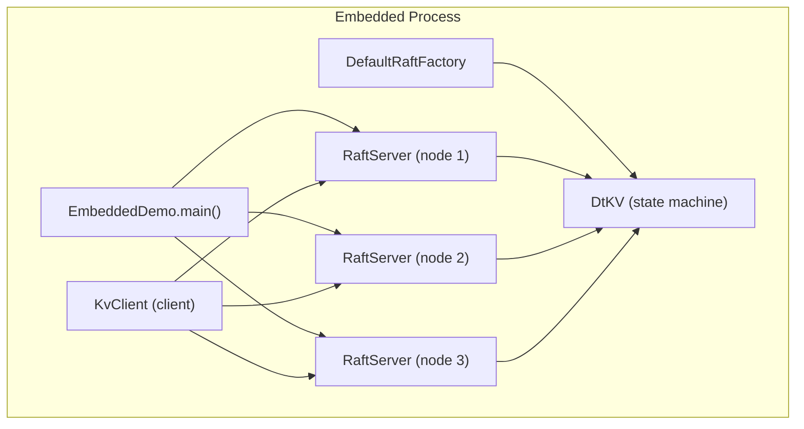
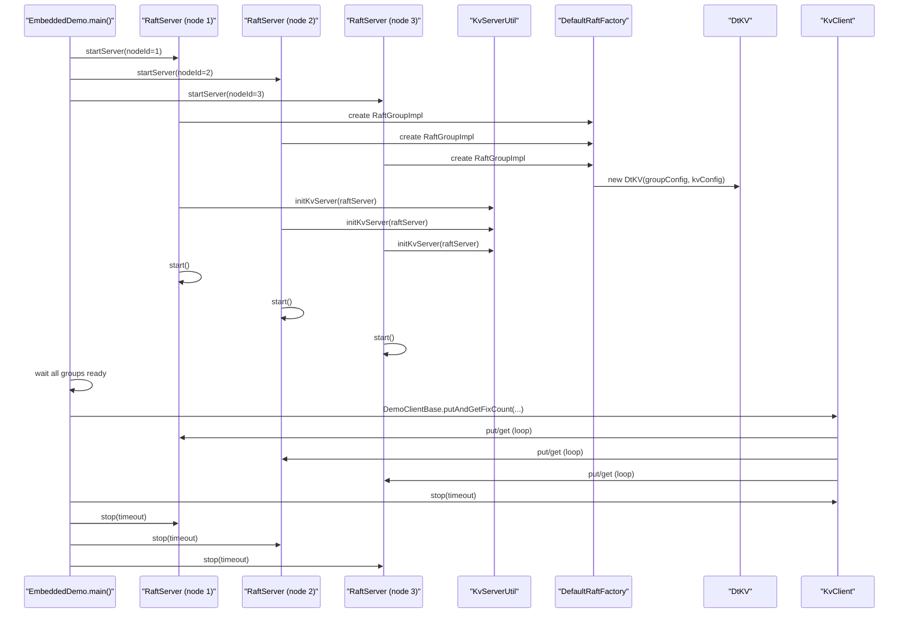
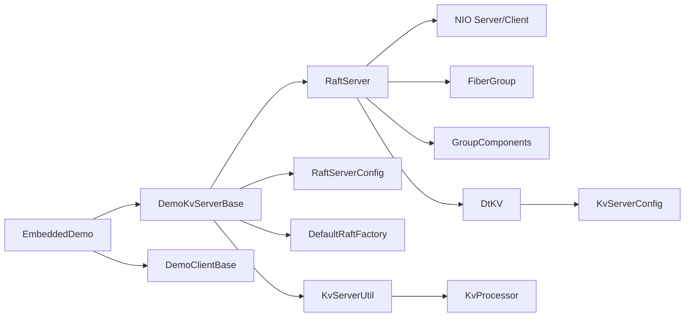

# Embedded Demo

<cite>
**Referenced Files in This Document**
- [EmbeddedDemo.java](file://demos/src/main/java/com/github/dtprj/dongting/demos/embedded/EmbeddedDemo.java)
- [GroupId.java](file://demos/src/main/java/com/github/dtprj/dongting/demos/embedded/GroupId.java)
- [DemoClientBase.java](file://demos/src/main/java/com/github/dtprj/dongting/demos/base/DemoClientBase.java)
- [DemoKvServerBase.java](file://demos/src/main/java/com/github/dtprj/dongting/demos/base/DemoKvServerBase.java)
- [RaftServer.java](file://server/src/main/java/com/github/dtprj/dongting/raft/server/RaftServer.java)
- [RaftServerConfig.java](file://server/src/main/java/com/github/dtprj/dongting/raft/server/RaftServerConfig.java)
- [DtKV.java](file://server/src/main/java/com/github/dtprj/dongting/dtkv/server/DtKV.java)
- [KvServerConfig.java](file://server/src/main/java/com/github/dtprj/dongting/dtkv/server/KvServerConfig.java)
- [KvProcessor.java](file://server/src/main/java/com/github/dtprj/dongting/dtkv/server/KvProcessor.java)
- [KvServerUtil.java](file://server/src/main/java/com/github/dtprj/dongting/dtkv/server/KvServerUtil.java)
- [README.md](file://README.md)
- [docs/README.md](file://docs/README.md)
</cite>

## Table of Contents
1. [Introduction](#introduction)
2. [Project Structure](#project-structure)
3. [Core Components](#core-components)
4. [Architecture Overview](#architecture-overview)
5. [Detailed Component Analysis](#detailed-component-analysis)
6. [Dependency Analysis](#dependency-analysis)
7. [Performance Considerations](#performance-considerations)
8. [Troubleshooting Guide](#troubleshooting-guide)
9. [Conclusion](#conclusion)
10. [Appendices](#appendices)

## Introduction
This document explains the embedded demo that runs the RAFT server and DtKV state machine entirely within a single JVM process, without external dependencies. It provides a complete walkthrough of initialization, lifecycle management, and direct API usage, highlighting benefits such as reduced latency, simplified deployment, and tight integration with application logic. It also demonstrates how to perform distributed coordination operations without network overhead, and outlines proper shutdown and resource cleanup procedures. Use cases include microservices with embedded coordination, testing frameworks, and IoT devices.

## Project Structure
The embedded demo lives in the demos module and builds upon the server and client modules. The key files are:
- EmbeddedDemo: orchestrates three RAFT nodes and a client within one process.
- DemoKvServerBase: constructs RaftServer instances with a custom DefaultRaftFactory that installs DtKV as the state machine.
- DemoClientBase: initializes a client, registers nodes and groups, and performs bulk operations.
- RaftServer and RaftServerConfig: manage the RAFT server lifecycle and configuration.
- DtKV and KvServerConfig: define the in-memory key-value state machine and its server-side behavior.
- KvProcessor and KvServerUtil: register DtKV RPC handlers and wire them into the server.

**Diagram sources**
- [EmbeddedDemo.java](file://demos/src/main/java/com/github/dtprj/dongting/demos/embedded/EmbeddedDemo.java#L33-L60)
- [DemoKvServerBase.java](file://demos/src/main/java/com/github/dtprj/dongting/demos/base/DemoKvServerBase.java#L36-L84)
- [RaftServer.java](file://server/src/main/java/com/github/dtprj/dongting/raft/server/RaftServer.java#L112-L188)
- [DtKV.java](file://server/src/main/java/com/github/dtprj/dongting/dtkv/server/DtKV.java#L101-L133)
- [KvServerUtil.java](file://server/src/main/java/com/github/dtprj/dongting/dtkv/server/KvServerUtil.java)

**Section sources**
- [EmbeddedDemo.java](file://demos/src/main/java/com/github/dtprj/dongting/demos/embedded/EmbeddedDemo.java#L33-L60)
- [DemoKvServerBase.java](file://demos/src/main/java/com/github/dtprj/dongting/demos/base/DemoKvServerBase.java#L36-L84)
- [RaftServer.java](file://server/src/main/java/com/github/dtprj/dongting/raft/server/RaftServer.java#L112-L188)
- [DtKV.java](file://server/src/main/java/com/github/dtprj/dongting/dtkv/server/DtKV.java#L101-L133)
- [docs/README.md](file://docs/README.md#L1-L108)

## Core Components
- EmbeddedDemo: starts three RaftServer instances and a client, waits for readiness, runs a fixed-count workload, then shuts everything down gracefully.
- DemoKvServerBase: configures RaftServerConfig, creates RaftGroupConfig entries, and wires DefaultRaftFactory to instantiate DtKV as the state machine. It also calls KvServerUtil.initKvServer to register DtKV RPC processors.
- DemoClientBase: constructs a KvClient, adds nodes and groups, fetches a leader, and executes bulk put/get operations.
- RaftServer: manages NIO servers/clients, group creation, startup/shutdown, and readiness futures.
- RaftServerConfig: holds node identity, ports, timeouts, and threading configuration.
- DtKV: the in-memory state machine implementing the DtKV protocol, lease-read capabilities, and snapshot/install logic.
- KvServerConfig: controls DtKV runtime behavior such as map capacity, load factor, and watch-related parameters.
- KvProcessor: the server-side RPC handler for DtKV commands (get/put/remove/list/etc.), delegating to DtKV.
- KvServerUtil: registers DtKV RPC processors into the server’s NIO pipeline.

**Section sources**
- [EmbeddedDemo.java](file://demos/src/main/java/com/github/dtprj/dongting/demos/embedded/EmbeddedDemo.java#L33-L60)
- [DemoKvServerBase.java](file://demos/src/main/java/com/github/dtprj/dongting/demos/base/DemoKvServerBase.java#L36-L84)
- [DemoClientBase.java](file://demos/src/main/java/com/github/dtprj/dongting/demos/base/DemoClientBase.java#L35-L86)
- [RaftServer.java](file://server/src/main/java/com/github/dtprj/dongting/raft/server/RaftServer.java#L330-L474)
- [RaftServerConfig.java](file://server/src/main/java/com/github/dtprj/dongting/raft/server/RaftServerConfig.java#L21-L40)
- [DtKV.java](file://server/src/main/java/com/github/dtprj/dongting/dtkv/server/DtKV.java#L101-L133)
- [KvServerConfig.java](file://server/src/main/java/com/github/dtprj/dongting/dtkv/server/KvServerConfig.java#L21-L30)
- [KvProcessor.java](file://server/src/main/java/com/github/dtprj/dongting/dtkv/server/KvProcessor.java#L82-L108)
- [KvServerUtil.java](file://server/src/main/java/com/github/dtprj/dongting/dtkv/server/KvServerUtil.java)

## Architecture Overview
The embedded demo runs three RAFT nodes and a client within the same JVM. Each RaftServer hosts a fiber-based RAFT engine and a DtKV state machine. The client communicates with the nodes over loopback TCP (same process), enabling near-zero network overhead for intra-process coordination.

**Diagram sources**
- [EmbeddedDemo.java](file://demos/src/main/java/com/github/dtprj/dongting/demos/embedded/EmbeddedDemo.java#L33-L60)
- [DemoKvServerBase.java](file://demos/src/main/java/com/github/dtprj/dongting/demos/base/DemoKvServerBase.java#L36-L84)
- [RaftServer.java](file://server/src/main/java/com/github/dtprj/dongting/raft/server/RaftServer.java#L330-L474)
- [KvServerUtil.java](file://server/src/main/java/com/github/dtprj/dongting/dtkv/server/KvServerUtil.java)

## Detailed Component Analysis

### EmbeddedDemo: In-Process Initialization and Lifecycle
- Initializes three RaftServer instances with distinct node IDs and ports.
- Waits for all groups to become ready using futures exposed by RaftServer.
- Starts a client workload via DemoClientBase and prints throughput metrics.
- Shuts down the client and all servers in order using stop with timeouts.

Key behaviors:
- Uses DemoKvServerBase.startServer to configure RaftServerConfig and create groups.
- Uses DemoClientBase.putAndGetFixCount to drive load and measure performance.
- Calls stop on client and servers with a DtTime timeout.

**Section sources**
- [EmbeddedDemo.java](file://demos/src/main/java/com/github/dtprj/dongting/demos/embedded/EmbeddedDemo.java#L33-L60)
- [DemoKvServerBase.java](file://demos/src/main/java/com/github/dtprj/dongting/demos/base/DemoKvServerBase.java#L36-L84)
- [DemoClientBase.java](file://demos/src/main/java/com/github/dtprj/dongting/demos/base/DemoClientBase.java#L35-L86)

### DemoKvServerBase: Server Construction and State Machine Wiring
- Builds RaftServerConfig with node ID, replicatePort, servicePort, and timeouts.
- Creates multiple RaftGroupConfig entries for the given group IDs.
- Provides a DefaultRaftFactory that instantiates DtKV as the state machine.
- Calls KvServerUtil.initKvServer to register DtKV RPC processors into the server’s NIO pipeline.
- Starts the RaftServer.

Benefits:
- Single-process deployment with minimal configuration.
- Tight integration between RAFT and DtKV via factory wiring.

**Section sources**
- [DemoKvServerBase.java](file://demos/src/main/java/com/github/dtprj/dongting/demos/base/DemoKvServerBase.java#L36-L84)
- [RaftServerConfig.java](file://server/src/main/java/com/github/dtprj/dongting/raft/server/RaftServerConfig.java#L21-L40)
- [KvServerUtil.java](file://server/src/main/java/com/github/dtprj/dongting/dtkv/server/KvServerUtil.java)

### RaftServer: Lifecycle Management and Readiness
- Starts NIO server and client, initializes groups, and fires fibers to initialize RAFT components.
- Exposes futures to signal when all members are ready and when all groups are ready.
- Implements graceful shutdown by saving snapshots (optional), closing logs, and stopping dispatchers.

Lifecycle highlights:
- doStart: starts NIO, initializes groups, waits for futures, then starts node/member pings.
- getAllGroupReadyFuture: used by EmbeddedDemo to synchronize before running workload.
- doStop: shuts down groups, closes NIO, and cleans up resources.

**Section sources**
- [RaftServer.java](file://server/src/main/java/com/github/dtprj/dongting/raft/server/RaftServer.java#L330-L474)
- [RaftServer.java](file://server/src/main/java/com/github/dtprj/dongting/raft/server/RaftServer.java#L475-L547)

### DtKV: In-Memory State Machine and Lease Reads
- Implements the DtKV protocol and state machine interface.
- Supports lease-read operations (get, batchGet, list) that can run in any thread.
- Executes write operations by submitting tasks to the RAFT group’s linear task runner.
- Manages snapshots and TTL-based expiration by submitting RAFT tasks.

Key points:
- Lease-reads bypass the RAFT log for reads, reducing latency.
- Write operations are replicated and committed through RAFT, ensuring linearizability.
- Snapshot installation and taking are fiber-managed.

**Section sources**
- [DtKV.java](file://server/src/main/java/com/github/dtprj/dongting/dtkv/server/DtKV.java#L101-L133)
- [DtKV.java](file://server/src/main/java/com/github/dtprj/dongting/dtkv/server/DtKV.java#L151-L215)
- [DtKV.java](file://server/src/main/java/com/github/dtprj/dongting/dtkv/server/DtKV.java#L225-L264)
- [DtKV.java](file://server/src/main/java/com/github/dtprj/dongting/dtkv/server/DtKV.java#L307-L374)

### KvProcessor: Direct API Calls Without Network Overhead
- Handles DtKV RPC commands (get, put, remove, list, batchGet, etc.) on the server side.
- Delegates to DtKV for lease-reads and write tasks.
- Uses the server’s NIO pipeline to send responses.

Operational impact:
- Since the server and client run in the same process, RPC calls traverse the in-memory NIO stack, minimizing overhead compared to external network calls.

**Section sources**
- [KvProcessor.java](file://server/src/main/java/com/github/dtprj/dongting/dtkv/server/KvProcessor.java#L82-L108)

### Client Workload and Metrics
- DemoClientBase constructs a KvClient, adds nodes and groups, fetches a leader, and performs bulk put/get operations.
- Prints throughput metrics for puts and gets, demonstrating linearizability and performance characteristics.

**Section sources**
- [DemoClientBase.java](file://demos/src/main/java/com/github/dtprj/dongting/demos/base/DemoClientBase.java#L35-L86)

## Dependency Analysis
The embedded demo composes several modules and classes with clear boundaries:
- EmbeddedDemo depends on DemoKvServerBase and DemoClientBase.
- DemoKvServerBase depends on RaftServer, RaftServerConfig, DefaultRaftFactory, and KvServerUtil.
- RaftServer depends on NIO server/client, group components, and fiber infrastructure.
- DtKV depends on KvServerConfig, fiber groups, and RAFT group integration.

**Diagram sources**
- [EmbeddedDemo.java](file://demos/src/main/java/com/github/dtprj/dongting/demos/embedded/EmbeddedDemo.java#L33-L60)
- [DemoKvServerBase.java](file://demos/src/main/java/com/github/dtprj/dongting/demos/base/DemoKvServerBase.java#L36-L84)
- [RaftServer.java](file://server/src/main/java/com/github/dtprj/dongting/raft/server/RaftServer.java#L112-L188)
- [DtKV.java](file://server/src/main/java/com/github/dtprj/dongting/dtkv/server/DtKV.java#L101-L133)
- [KvServerConfig.java](file://server/src/main/java/com/github/dtprj/dongting/dtkv/server/KvServerConfig.java#L21-L30)
- [KvProcessor.java](file://server/src/main/java/com/github/dtprj/dongting/dtkv/server/KvProcessor.java#L82-L108)

**Section sources**
- [EmbeddedDemo.java](file://demos/src/main/java/com/github/dtprj/dongting/demos/embedded/EmbeddedDemo.java#L33-L60)
- [DemoKvServerBase.java](file://demos/src/main/java/com/github/dtprj/dongting/demos/base/DemoKvServerBase.java#L36-L84)
- [RaftServer.java](file://server/src/main/java/com/github/dtprj/dongting/raft/server/RaftServer.java#L112-L188)
- [DtKV.java](file://server/src/main/java/com/github/dtprj/dongting/dtkv/server/DtKV.java#L101-L133)
- [KvServerConfig.java](file://server/src/main/java/com/github/dtprj/dongting/dtkv/server/KvServerConfig.java#L21-L30)
- [KvProcessor.java](file://server/src/main/java/com/github/dtprj/dongting/dtkv/server/KvProcessor.java#L82-L108)

## Performance Considerations
- Reduced latency: In-process operation avoids network overhead. The embedded demo uses loopback TCP within the same process, minimizing latency compared to external network calls.
- Simplified deployment: Embedding eliminates the need for separate processes or containers, reducing operational complexity.
- Tight integration: Direct API calls (e.g., lease-reads) and in-process RPC reduce context switches and serialization costs.
- Throughput demonstration: The demo prints throughput for puts and gets, showcasing linearizability and performance characteristics.

[No sources needed since this section provides general guidance]

## Troubleshooting Guide
Common issues and remedies:
- Servers not ready: Ensure EmbeddedDemo waits for allGroupReadyFuture from each RaftServer before starting the client workload.
- Shutdown hangs: Use stop with a reasonable DtTime timeout on both the client and servers. RaftServer.doStop coordinates group shutdown and NIO cleanup.
- Snapshot and log closure: During shutdown, RaftServer saves snapshots (if configured), closes logs, and stops dispatchers. Verify that the saveSnapshotWhenClose flag aligns with your durability requirements.

**Section sources**
- [EmbeddedDemo.java](file://demos/src/main/java/com/github/dtprj/dongting/demos/embedded/EmbeddedDemo.java#L53-L59)
- [RaftServer.java](file://server/src/main/java/com/github/dtprj/dongting/raft/server/RaftServer.java#L475-L547)

## Conclusion
The embedded demo showcases how to run RAFT and DtKV entirely within a single JVM process. It demonstrates in-process initialization, lifecycle management, and direct API usage with minimal latency and simplified deployment. The approach is ideal for microservices requiring embedded coordination, testing frameworks needing deterministic environments, and IoT devices with constrained resources.

[No sources needed since this section summarizes without analyzing specific files]

## Appendices

### In-Process Configuration Checklist
- Define RaftServerConfig with node ID, replicatePort, servicePort, and timeouts.
- Create RaftGroupConfig entries for desired group IDs.
- Provide DefaultRaftFactory to instantiate DtKV as the state machine.
- Register DtKV RPC processors via KvServerUtil.initKvServer.
- Start RaftServer and wait for allGroupReadyFuture.
- Initialize KvClient, add nodes/groups, fetch leader, and run workload.
- Stop client and servers with timeouts.

**Section sources**
- [DemoKvServerBase.java](file://demos/src/main/java/com/github/dtprj/dongting/demos/base/DemoKvServerBase.java#L36-L84)
- [RaftServerConfig.java](file://server/src/main/java/com/github/dtprj/dongting/raft/server/RaftServerConfig.java#L21-L40)
- [KvServerUtil.java](file://server/src/main/java/com/github/dtprj/dongting/dtkv/server/KvServerUtil.java)
- [EmbeddedDemo.java](file://demos/src/main/java/com/github/dtprj/dongting/demos/embedded/EmbeddedDemo.java#L33-L60)
- [DemoClientBase.java](file://demos/src/main/java/com/github/dtprj/dongting/demos/base/DemoClientBase.java#L35-L86)

### Direct API Calls Without Network Overhead
- Lease-reads: DtKV.get and batchGet operate without RAFT replication, reducing latency.
- Write operations: KvProcessor delegates to DtKV, which submits tasks to the RAFT group, ensuring linearizability.
- RPC path: In-process NIO server/client pipeline minimizes overhead compared to external networks.

**Section sources**
- [DtKV.java](file://server/src/main/java/com/github/dtprj/dongting/dtkv/server/DtKV.java#L225-L264)
- [KvProcessor.java](file://server/src/main/java/com/github/dtprj/dongting/dtkv/server/KvProcessor.java#L82-L108)

### Shutdown Procedures and Resource Cleanup
- Client shutdown: Call stop on KvClient with a DtTime timeout.
- Server shutdown: Call stop on each RaftServer with a DtTime timeout. RaftServer.doStop:
  - Requests group shutdowns.
  - Saves snapshots (optional).
  - Closes logs and status managers.
  - Stops NIO server and client.

**Section sources**
- [EmbeddedDemo.java](file://demos/src/main/java/com/github/dtprj/dongting/demos/embedded/EmbeddedDemo.java#L53-L59)
- [RaftServer.java](file://server/src/main/java/com/github/dtprj/dongting/raft/server/RaftServer.java#L475-L547)

### Use Cases
- Microservices with embedded coordination: Run RAFT and DtKV in the same process to simplify deployment and reduce latency.
- Testing frameworks: Use embedded mode for deterministic tests without external dependencies.
- IoT devices: Embedding reduces footprint and improves responsiveness on constrained hardware.

[No sources needed since this section provides general guidance]