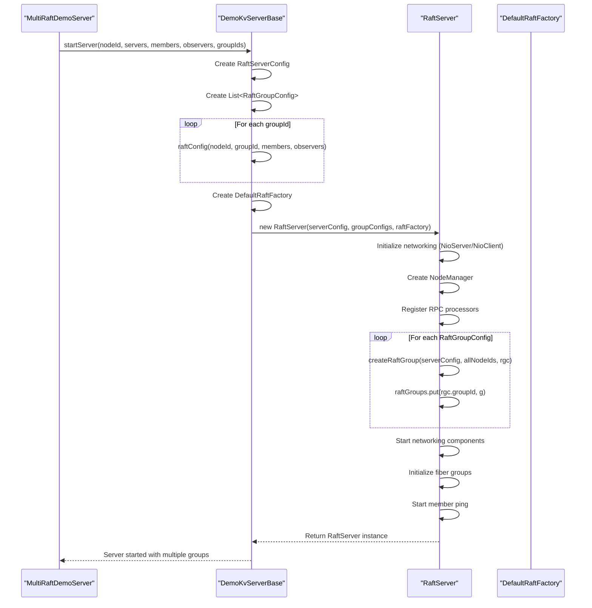
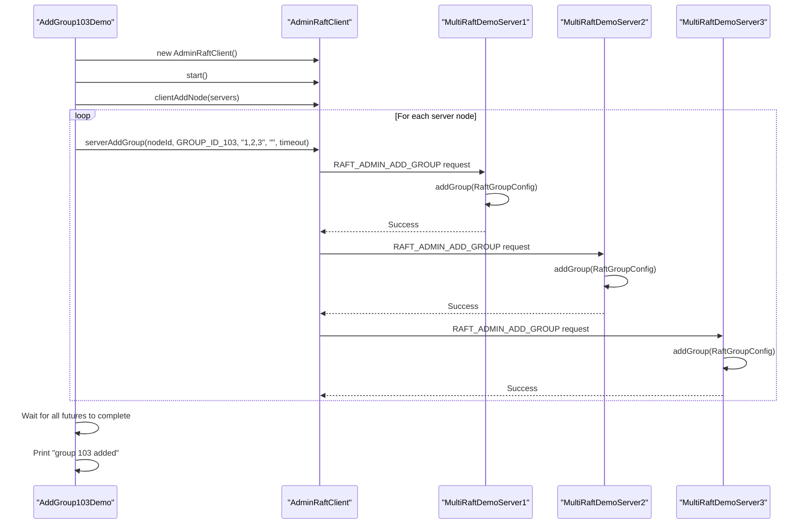
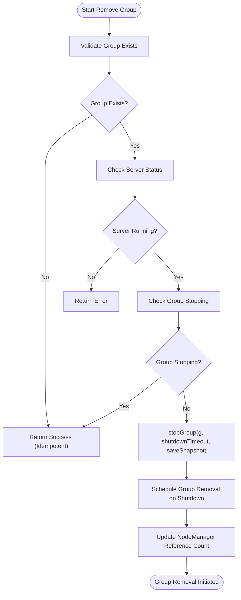
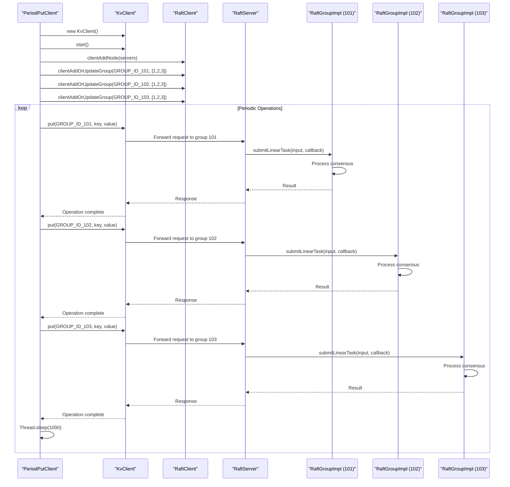
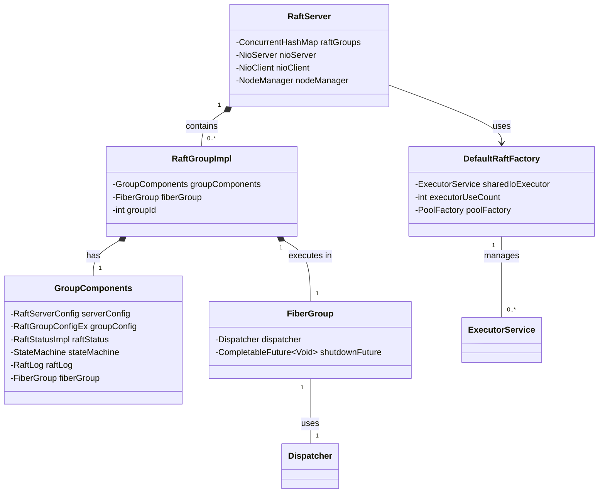
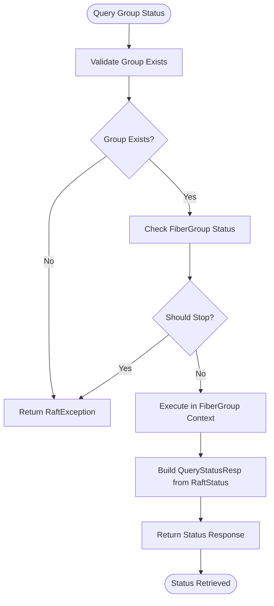

# Multi-RAFT Groups Demo

<cite>
**Referenced Files in This Document**   
- [MultiRaftDemoServer1.java](file://demos/src/main/java/com/github/dtprj/dongting/demos/multiraft/MultiRaftDemoServer1.java)
- [MultiRaftDemoServer2.java](file://demos/src/main/java/com/github/dtprj/dongting/demos/multiraft/MultiRaftDemoServer2.java)
- [MultiRaftDemoServer3.java](file://demos/src/main/java/com/github/dtprj/dongting/demos/multiraft/MultiRaftDemoServer3.java)
- [AddGroup103Demo.java](file://demos/src/main/java/com/github/dtprj/dongting/demos/multiraft/AddGroup103Demo.java)
- [RemoveGroup103Demo.java](file://demos/src/main/java/com/github/dtprj/dongting/demos/multiraft/RemoveGroup103Demo.java)
- [PeriodPutClient.java](file://demos/src/main/java/com/github/dtprj/dongting/demos/multiraft/PeriodPutClient.java)
- [DemoKvServerBase.java](file://demos/src/main/java/com/github/dtprj/dongting/demos/base/DemoKvServerBase.java)
- [GroupId.java](file://demos/src/main/java/com/github/dtprj/dongting/demos/multiraft/GroupId.java)
- [RaftServer.java](file://server/src/main/java/com/github/dtprj/dongting/raft/server/RaftServer.java)
- [RaftGroupImpl.java](file://server/src/main/java/com/github/dtprj/dongting/raft/impl/RaftGroupImpl.java)
- [RaftGroupConfig.java](file://server/src/main/java/com/github/dtprj/dongting/raft/server/RaftGroupConfig.java)
- [RaftServerConfig.java](file://server/src/main/java/com/github/dtprj/dongting/raft/server/RaftServerConfig.java)
- [DefaultRaftFactory.java](file://server/src/main/java/com/github/dtprj/dongting/raft/server/DefaultRaftFactory.java)
- [GroupComponents.java](file://server/src/main/java/com/github/dtprj/dongting/raft/impl/GroupComponents.java)
</cite>

## Table of Contents
1. [Introduction](#introduction)
2. [Architecture Overview](#architecture-overview)
3. [Multi-RAFT Group Initialization](#multi-raft-group-initialization)
4. [Runtime Group Management](#runtime-group-management)
5. [Client Interaction and Request Routing](#client-interaction-and-request-routing)
6. [Resource Sharing and Isolation](#resource-sharing-and-isolation)
7. [State Monitoring and Querying](#state-monitoring-and-querying)
8. [Use Cases and Applications](#use-cases-and-applications)
9. [Performance Considerations](#performance-considerations)
10. [Conclusion](#conclusion)

## Introduction

The Multi-RAFT Groups Demo demonstrates a sophisticated architecture that enables multiple independent RAFT consensus groups to coexist within a single process. This design allows for logical partitioning of data and processing while sharing underlying system resources efficiently. The implementation supports dynamic creation, management, and interaction with multiple consensus groups, providing isolation between groups while enabling resource efficiency through shared infrastructure.

The architecture is particularly valuable for multi-tenancy scenarios, logical data partitioning, and resource-constrained environments where running separate processes for each consensus group would be inefficient. This document provides a comprehensive walkthrough of the multi-RAFT groups implementation, covering initialization, management, client interaction, resource sharing, monitoring, and practical use cases.

**Section sources**
- [MultiRaftDemoServer1.java](file://demos/src/main/java/com/github/dtprj/dongting/demos/multiraft/MultiRaftDemoServer1.java#L1-L32)
- [DemoKvServerBase.java](file://demos/src/main/java/com/github/dtprj/dongting/demos/base/DemoKvServerBase.java#L1-L84)

## Architecture Overview

The multi-RAFT groups architecture is built around a central `RaftServer` that manages multiple independent `RaftGroup` instances, each representing a separate consensus group. The server acts as a container that provides shared networking, threading, and storage infrastructure while maintaining strict isolation between consensus groups.

```mermaid
graph TD
subgraph "RaftServer"
direction TB
RaftServer["RaftServer\n(Main Container)"]
NioServer["NioServer\n(Shared Networking)"]
NioClient["NioClient\n(Shared Networking)"]
NodeManager["NodeManager\n(Node Coordination)"]
RaftGroups["ConcurrentHashMap<Integer, RaftGroupImpl>\n(Multiple Consensus Groups)"]
RaftServer --> NioServer
RaftServer --> NioClient
RaftServer --> NodeManager
RaftServer --> RaftGroups
subgraph "RaftGroupImpl"
direction TB
Group1["RaftGroupImpl\n(Group 101)"]
Group2["RaftGroupImpl\n(Group 102)"]
Group3["RaftGroupImpl\n(Group 103)"]
Group1 --> GroupComponents1["GroupComponents"]
Group2 --> GroupComponents2["GroupComponents"]
Group3 --> GroupComponents3["GroupComponents"]
end
RaftGroups --> Group1
RaftGroups --> Group2
RaftGroups --> Group3
end
subgraph "GroupComponents"
direction TB
GC1["GroupComponents\n(Per-Group State)"]
GC2["GroupComponents\n(Per-Group State)"]
GC3["GroupComponents\n(Per-Group State)"]
GC1 --> FiberGroup1["FiberGroup\n(Isolated Execution)"]
GC1 --> RaftStatus1["RaftStatusImpl\n(Consensus State)"]
GC1 --> StateMachine1["StateMachine\n(Application State)"]
GC1 --> RaftLog1["RaftLog\n(Log Storage)"]
GC2 --> FiberGroup2["FiberGroup\n(Isolated Execution)"]
GC2 --> RaftStatus2["RaftStatusImpl\n(Consensus State)"]
GC2 --> StateMachine2["StateMachine\n(Application State)"]
GC2 --> RaftLog2["RaftLog\n(Log Storage)"]
GC3 --> FiberGroup3["FiberGroup\n(Isolated Execution)"]
GC3 --> RaftStatus3["RaftStatusImpl\n(Consensus State)"]
GC3 --> StateMachine3["StateMachine\n(Application State)"]
GC3 --> RaftLog3["RaftLog\n(Log Storage)"]
end
RaftServer --> GC1
RaftServer --> GC2
RaftServer --> GC3
style RaftServer fill:#f9f,stroke:#333
style NioServer fill:#bbf,stroke:#333
style NioClient fill:#bbf,stroke:#333
style NodeManager fill:#bbf,stroke:#333
style RaftGroups fill:#f96,stroke:#333
style Group1 fill:#9f9,stroke:#333
style Group2 fill:#9f9,stroke:#333
style Group3 fill:#9f9,stroke:#333
style GC1 fill:#ff9,stroke:#333
style GC2 fill:#ff9,stroke:#333
style GC3 fill:#ff9,stroke:#333
```

**Diagram sources**
- [RaftServer.java](file://server/src/main/java/com/github/dtprj/dongting/raft/server/RaftServer.java#L83-L716)
- [RaftGroupImpl.java](file://server/src/main/java/com/github/dtprj/dongting/raft/impl/RaftGroupImpl.java#L43-L220)
- [GroupComponents.java](file://server/src/main/java/com/github/dtprj/dongting/raft/impl/GroupComponents.java#L31-L53)

## Multi-RAFT Group Initialization

The initialization of multiple RAFT groups occurs during the server startup process, where a single `RaftServer` instance is configured with multiple `RaftGroupConfig` objects. Each configuration specifies a unique group ID, member nodes, and observer nodes, allowing for independent consensus quorums within the same process.

The `DemoKvServerBase` class provides a foundation for initializing servers with multiple groups. During startup, the server creates a `RaftGroupConfig` for each specified group ID and passes them to the `RaftServer` constructor. The server then creates isolated `RaftGroupImpl` instances for each configuration, ensuring that each group has its own execution context, state machine, and storage.



**Diagram sources**
- [DemoKvServerBase.java](file://demos/src/main/java/com/github/dtprj/dongting/demos/base/DemoKvServerBase.java#L36-L84)
- [RaftServer.java](file://server/src/main/java/com/github/dtprj/dongting/raft/server/RaftServer.java#L108-L220)

**Section sources**
- [MultiRaftDemoServer1.java](file://demos/src/main/java/com/github/dtprj/dongting/demos/multiraft/MultiRaftDemoServer1.java#L24-L30)
- [MultiRaftDemoServer2.java](file://demos/src/main/java/com/github/dtprj/dongting/demos/multiraft/MultiRaftDemoServer2.java#L24-L30)
- [MultiRaftDemoServer3.java](file://demos/src/main/java/com/github/dtprj/dongting/demos/multiraft/MultiRaftDemoServer3.java#L24-L30)
- [DemoKvServerBase.java](file://demos/src/main/java/com/github/dtprj/dongting/demos/base/DemoKvServerBase.java#L36-L84)

## Runtime Group Management

The architecture supports dynamic management of RAFT groups at runtime through administrative APIs. New groups can be added and existing groups can be removed without restarting the server process, enabling flexible reconfiguration of the consensus topology.

The `AddGroup103Demo` and `RemoveGroup103Demo` classes demonstrate how to programmatically add and remove groups using the `AdminRaftClient`. The `AdminRaftClient` connects to the server's replicate port and sends administrative commands to create or destroy consensus groups. When adding a group, the client must coordinate with all nodes in the cluster to ensure consistent configuration across the entire system.





**Diagram sources**
- [AddGroup103Demo.java](file://demos/src/main/java/com/github/dtprj/dongting/demos/multiraft/AddGroup103Demo.java#L28-L48)
- [RemoveGroup103Demo.java](file://demos/src/main/java/com/github/dtprj/dongting/demos/multiraft/RemoveGroup103Demo.java#L28-L46)
- [RaftServer.java](file://server/src/main/java/com/github/dtprj/dongting/raft/server/RaftServer.java#L571-L664)
- [AdminGroupAndNodeProcessor.java](file://server/src/main/java/com/github/dtprj/dongting/raft/rpc/AdminGroupAndNodeProcessor.java#L117-L150)

**Section sources**
- [AddGroup103Demo.java](file://demos/src/main/java/com/github/dtprj/dongting/demos/multiraft/AddGroup103Demo.java#L28-L48)
- [RemoveGroup103Demo.java](file://demos/src/main/java/com/github/dtprj/dongting/demos/multiraft/RemoveGroup103Demo.java#L28-L46)
- [RaftServer.java](file://server/src/main/java/com/github/dtprj/dongting/raft/server/RaftServer.java#L571-L664)

## Client Interaction and Request Routing

Clients interact with specific RAFT groups by specifying the group ID in their requests. The `PeriodPutClient` demonstrates how a single client can perform operations on multiple groups simultaneously, interleaving requests to different groups in a periodic pattern.

The client uses the `KvClient` to connect to the cluster and must register each group it intends to access using `clientAddOrUpdateGroup`. Once registered, the client can route requests to specific groups by including the group ID in operations like `put`. The server's RPC layer routes these requests to the appropriate `RaftGroupImpl` instance based on the group ID, ensuring that operations are processed within the correct consensus context.



**Diagram sources**
- [PeriodPutClient.java](file://demos/src/main/java/com/github/dtprj/dongting/demos/multiraft/PeriodPutClient.java#L31-L58)
- [RaftGroupImpl.java](file://server/src/main/java/com/github/dtprj/dongting/raft/impl/RaftGroupImpl.java#L79-L87)
- [RaftServer.java](file://server/src/main/java/com/github/dtprj/dongting/raft/server/RaftServer.java#L667-L716)

**Section sources**
- [PeriodPutClient.java](file://demos/src/main/java/com/github/dtprj/dongting/demos/multiraft/PeriodPutClient.java#L31-L58)

## Resource Sharing and Isolation

The multi-RAFT groups architecture achieves an optimal balance between resource sharing and isolation. Multiple consensus groups share common infrastructure resources such as networking threads, I/O executors, and object pools, while maintaining strict isolation in their consensus state, execution contexts, and storage.

The `DefaultRaftFactory` implements resource sharing through a shared I/O executor that is reused across all groups. The factory maintains a reference count of group usage and only creates the executor when the first group is created. Subsequent groups reuse the same executor, and it is only shut down when the last group is removed. This approach minimizes thread overhead while ensuring proper resource cleanup.



Each `RaftGroupImpl` maintains its own `FiberGroup` for isolated execution, preventing one group's processing from blocking others. The `FiberGroup` provides a dedicated execution context with its own dispatcher and thread pool configuration, ensuring that consensus operations for one group do not interfere with those of another group.

**Diagram sources**
- [RaftServer.java](file://server/src/main/java/com/github/dtprj/dongting/raft/server/RaftServer.java#L92-L95)
- [DefaultRaftFactory.java](file://server/src/main/java/com/github/dtprj/dongting/raft/server/DefaultRaftFactory.java#L41-L86)
- [GroupComponents.java](file://server/src/main/java/com/github/dtprj/dongting/raft/impl/GroupComponents.java#L31-L53)
- [FiberGroup.java](file://server/src/main/java/com/github/dtprj/dongting/fiber/FiberGroup.java)

**Section sources**
- [RaftServer.java](file://server/src/main/java/com/github/dtprj/dongting/raft/server/RaftServer.java#L92-L95)
- [DefaultRaftFactory.java](file://server/src/main/java/com/github/dtprj/dongting/raft/server/DefaultRaftFactory.java#L41-L86)

## State Monitoring and Querying

The architecture provides comprehensive monitoring capabilities for multi-RAFT group states. The `RaftServer` exposes a `queryRaftGroupStatus` method that allows clients to retrieve the current status of any group, including leadership information, role, and readiness.

Monitoring is essential for operational visibility and troubleshooting in multi-group environments. Clients and administrators can query the status of individual groups to verify their health, check leadership elections, and monitor consensus progress. The server maintains separate status information for each group, ensuring that monitoring operations do not interfere with the consensus process.



The status query operation is designed to be lightweight and non-disruptive. It executes within the target group's fiber group context to ensure consistency with the group's current state, but does not block normal consensus operations. This allows for frequent monitoring without impacting performance.

**Diagram sources**
- [RaftServer.java](file://server/src/main/java/com/github/dtprj/dongting/raft/server/RaftServer.java#L695-L716)
- [QueryStatusProcessor.java](file://server/src/main/java/com/github/dtprj/dongting/raft/rpc/QueryStatusProcessor.java)

**Section sources**
- [RaftServer.java](file://server/src/main/java/com/github/dtprj/dongting/raft/server/RaftServer.java#L695-L716)

## Use Cases and Applications

The multi-RAFT groups architecture enables several important use cases that benefit from logical partitioning with resource efficiency:

### Multi-tenancy
Multiple tenants can be isolated into separate RAFT groups, each with their own consensus quorum and state machine. This provides strong isolation between tenants while allowing them to share the same physical infrastructure. Each tenant's data and operations are completely independent, preventing cross-tenant interference.

### Logical Partitioning
Large datasets can be partitioned across multiple RAFT groups based on business domains, geographic regions, or other logical boundaries. This allows for parallel processing and reduced contention compared to a single large consensus group. For example, user data could be partitioned by region (e.g., GROUP_ID_101 for North America, GROUP_ID_102 for Europe).

### Resource Efficiency
By sharing networking, threading, and storage infrastructure across multiple groups, the architecture reduces the overhead associated with running multiple separate consensus processes. This is particularly valuable in containerized environments where resource constraints are common.

### Gradual Migration
New features or data models can be introduced in separate RAFT groups while maintaining compatibility with existing systems. This allows for gradual migration and testing without disrupting the main system.

### Testing and Development
Multiple isolated consensus groups can be run within a single process for testing and development purposes, reducing the complexity of setting up multi-node test environments.

**Section sources**
- [GroupId.java](file://demos/src/main/java/com/github/dtprj/dongting/demos/multiraft/GroupId.java#L21-L27)

## Performance Considerations

The multi-RAFT groups architecture introduces several performance considerations that must be balanced to achieve optimal results:

### Resource Contention
While resource sharing improves efficiency, it can also introduce contention between groups. The shared I/O executor and networking threads must be carefully configured to prevent one group's heavy load from impacting others. The `blockIoThreads` configuration in `RaftServerConfig` should be tuned based on the expected workload.

### Storage I/O
Multiple groups sharing the same storage subsystem can create I/O bottlenecks. Each group maintains its own log files and snapshots in separate directories (specified by `dataDir` in `RaftGroupConfig`), but they share the same underlying storage device. For high-performance scenarios, groups with heavy I/O requirements should be distributed across different storage devices.

### Memory Usage
Each group maintains its own in-memory data structures, including log caches, state machine state, and network buffers. The memory footprint grows linearly with the number of groups, so the total memory usage must be considered when planning capacity.

### Network Bandwidth
All groups share the same network interfaces and ports. The aggregate network traffic from all groups must be within the capacity of the network infrastructure to avoid congestion.

### Configuration Tuning
Each group can be independently configured with different parameters such as `electTimeout`, `heartbeatInterval`, and `maxReplicateItems` to optimize for its specific workload characteristics. Groups with high-throughput requirements may need different tuning than those with low-latency requirements.

**Section sources**
- [RaftServerConfig.java](file://server/src/main/java/com/github/dtprj/dongting/raft/server/RaftServerConfig.java#L21-L40)
- [RaftGroupConfig.java](file://server/src/main/java/com/github/dtprj/dongting/raft/server/RaftGroupConfig.java#L24-L76)

## Conclusion

The Multi-RAFT Groups Demo demonstrates a powerful architecture for running multiple independent consensus groups within a single process. This design provides the isolation benefits of separate consensus systems while achieving significant resource efficiency through shared infrastructure.

The implementation allows for flexible initialization of multiple groups at startup, dynamic management of groups at runtime, and efficient client interaction with specific groups. Resource sharing is carefully balanced with isolation to ensure that groups do not interfere with each other while minimizing overhead.

Key advantages of this architecture include support for multi-tenancy, logical data partitioning, and resource efficiency in constrained environments. The comprehensive monitoring capabilities provide operational visibility, and the performance characteristics can be tuned for specific use cases.

This multi-RAFT groups approach represents a sophisticated solution for distributed systems that require multiple consensus domains with efficient resource utilization, making it suitable for a wide range of applications from multi-tenant services to large-scale data partitioning scenarios.