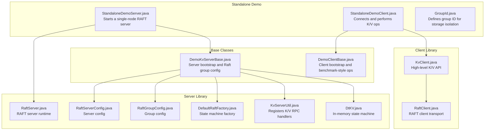
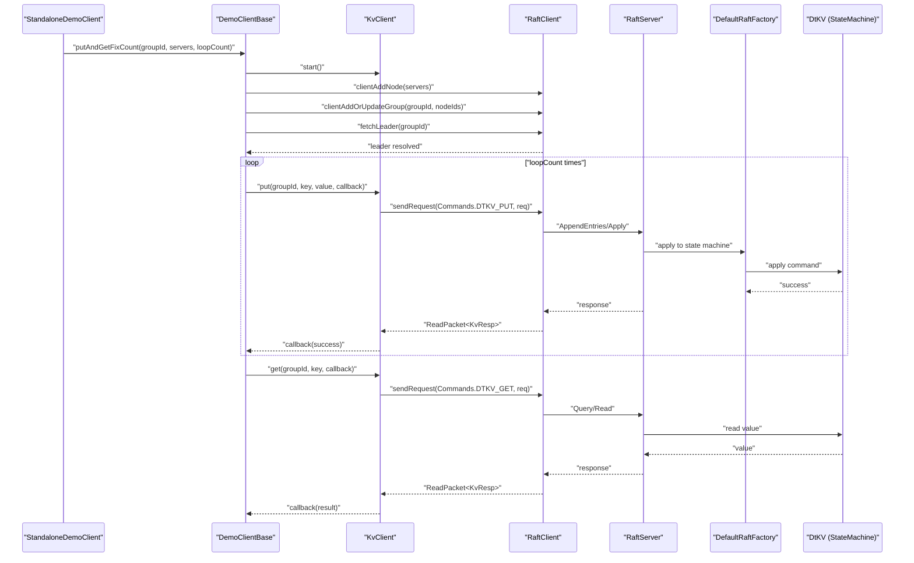
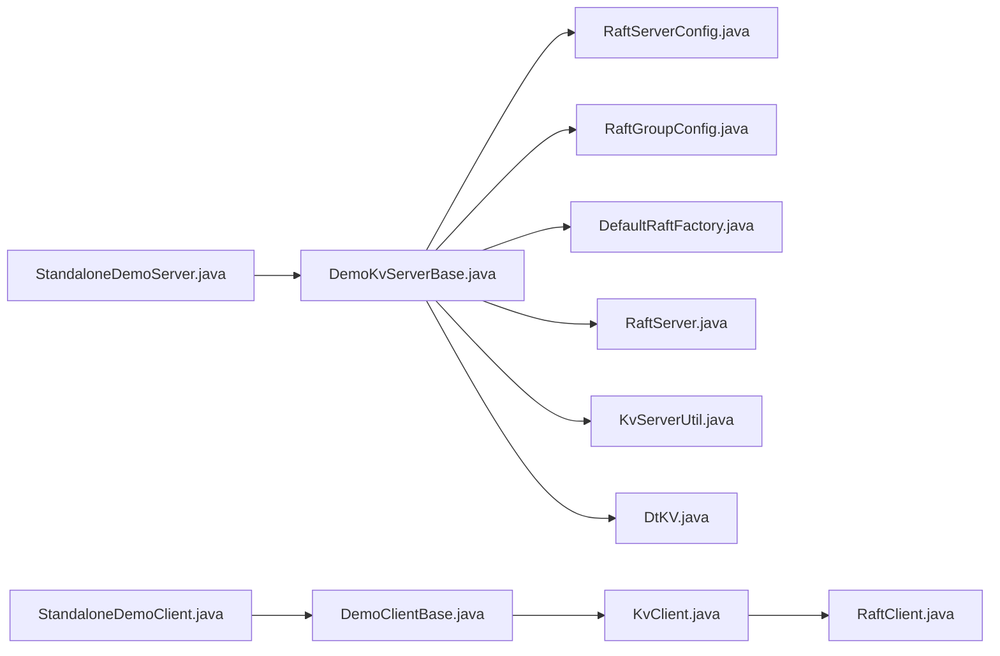

# Standalone Demo

<cite>
**Referenced Files in This Document**
- [StandaloneDemoServer.java](file://demos/src/main/java/com/github/dtprj/dongting/demos/standalone/StandaloneDemoServer.java)
- [StandaloneDemoClient.java](file://demos/src/main/java/com/github/dtprj/dongting/demos/standalone/StandaloneDemoClient.java)
- [GroupId.java](file://demos/src/main/java/com/github/dtprj/dongting/demos/standalone/GroupId.java)
- [DemoKvServerBase.java](file://demos/src/main/java/com/github/dtprj/dongting/demos/base/DemoKvServerBase.java)
- [DemoClientBase.java](file://demos/src/main/java/com/github/dtprj/dongting/demos/base/DemoClientBase.java)
- [KvClient.java](file://client/src/main/java/com/github/dtprj/dongting/dtkv/KvClient.java)
- [RaftClient.java](file://client/src/main/java/com/github/dtprj/dongting/raft/RaftClient.java)
- [RaftServer.java](file://server/src/main/java/com/github/dtprj/dongting/raft/server/RaftServer.java)
- [RaftServerConfig.java](file://server/src/main/java/com/github/dtprj/dongting/raft/server/RaftServerConfig.java)
- [RaftGroupConfig.java](file://server/src/main/java/com/github/dtprj/dongting/raft/server/RaftGroupConfig.java)
- [DefaultRaftFactory.java](file://server/src/main/java/com/github/dtprj/dongting/raft/server/DefaultRaftFactory.java)
- [KvServerUtil.java](file://server/src/main/java/com/github/dtprj/dongting/dtkv/server/KvServerUtil.java)
- [DtKV.java](file://server/src/main/java/com/github/dtprj/dongting/dtkv/server/DtKV.java)
- [README.md](file://README.md)
</cite>

## Table of Contents
1. [Introduction](#introduction)
2. [Project Structure](#project-structure)
3. [Core Components](#core-components)
4. [Architecture Overview](#architecture-overview)
5. [Detailed Component Analysis](#detailed-component-analysis)
6. [Dependency Analysis](#dependency-analysis)
7. [Performance Considerations](#performance-considerations)
8. [Troubleshooting Guide](#troubleshooting-guide)
9. [Conclusion](#conclusion)
10. [Appendices](#appendices)

## Introduction
This document provides a complete walkthrough of the standalone (single-node) demo for the Dongting RAFT stack. It explains when a single-node RAFT instance is appropriate (development, testing, embedded systems), how to initialize a single-node server and connect a client, and how to perform basic key/value operations. It also highlights differences from multi-node clusters in terms of consistency guarantees and failure handling, demonstrates error handling patterns, and outlines limitations of standalone mode along with guidance on when to upgrade to a full cluster.

## Project Structure
The standalone demo is composed of:
- A server-side demo that starts a single-node RAFT group backed by a simple in-memory key-value state machine.
- A client-side demo that connects to the server and performs repeated put/get operations.
- Shared base classes that encapsulate server and client bootstrapping logic.

**Diagram sources**
- [StandaloneDemoServer.java](file://demos/src/main/java/com/github/dtprj/dongting/demos/standalone/StandaloneDemoServer.java#L23-L31)
- [StandaloneDemoClient.java](file://demos/src/main/java/com/github/dtprj/dongting/demos/standalone/StandaloneDemoClient.java#L27-L37)
- [GroupId.java](file://demos/src/main/java/com/github/dtprj/dongting/demos/standalone/GroupId.java#L21-L25)
- [DemoKvServerBase.java](file://demos/src/main/java/com/github/dtprj/dongting/demos/base/DemoKvServerBase.java#L36-L83)
- [DemoClientBase.java](file://demos/src/main/java/com/github/dtprj/dongting/demos/base/DemoClientBase.java#L35-L85)
- [KvClient.java](file://client/src/main/java/com/github/dtprj/dongting/dtkv/KvClient.java#L46-L769)
- [RaftClient.java](file://client/src/main/java/com/github/dtprj/dongting/raft/RaftClient.java#L48-L588)
- [RaftServer.java](file://server/src/main/java/com/github/dtprj/dongting/raft/server/RaftServer.java#L103-L124)
- [RaftServerConfig.java](file://server/src/main/java/com/github/dtprj/dongting/raft/server/RaftServerConfig.java)
- [RaftGroupConfig.java](file://server/src/main/java/com/github/dtprj/dongting/raft/server/RaftGroupConfig.java)
- [DefaultRaftFactory.java](file://server/src/main/java/com/github/dtprj/dongting/raft/server/DefaultRaftFactory.java)
- [KvServerUtil.java](file://server/src/main/java/com/github/dtprj/dongting/dtkv/server/KvServerUtil.java)
- [DtKV.java](file://server/src/main/java/com/github/dtprj/dongting/dtkv/server/DtKV.java#L57-L411)

**Section sources**
- [README.md](file://README.md#L89-L91)
- [StandaloneDemoServer.java](file://demos/src/main/java/com/github/dtprj/dongting/demos/standalone/StandaloneDemoServer.java#L23-L31)
- [StandaloneDemoClient.java](file://demos/src/main/java/com/github/dtprj/dongting/demos/standalone/StandaloneDemoClient.java#L27-L37)
- [GroupId.java](file://demos/src/main/java/com/github/dtprj/dongting/demos/standalone/GroupId.java#L21-L25)

## Core Components
- Standalone server entrypoint: initializes a single-node RAFT group and registers the K/V server RPC handlers.
- Standalone client entrypoint: creates a client, adds the server to the client’s routing, fetches the leader, and performs repeated put/get operations.
- Base server class: constructs RaftServerConfig, RaftGroupConfig, and a DefaultRaftFactory that binds the in-memory state machine (DtKV) to the group.
- Base client class: provides a benchmark-style helper that performs a fixed number of puts and gets and prints throughput statistics.

Key responsibilities:
- Server: configure ports, timeouts, and group membership; start RaftServer; register K/V processors.
- Client: parse server list, add nodes/groups, fetch leader, issue async operations, handle errors, and print metrics.

**Section sources**
- [DemoKvServerBase.java](file://demos/src/main/java/com/github/dtprj/dongting/demos/base/DemoKvServerBase.java#L36-L83)
- [DemoClientBase.java](file://demos/src/main/java/com/github/dtprj/dongting/demos/base/DemoClientBase.java#L35-L85)
- [KvClient.java](file://client/src/main/java/com/github/dtprj/dongting/dtkv/KvClient.java#L46-L769)

## Architecture Overview
The standalone demo runs a single-node RAFT group with a local in-memory state machine. The client communicates over RPC to the single server node.

**Diagram sources**
- [StandaloneDemoClient.java](file://demos/src/main/java/com/github/dtprj/dongting/demos/standalone/StandaloneDemoClient.java#L27-L37)
- [DemoClientBase.java](file://demos/src/main/java/com/github/dtprj/dongting/demos/base/DemoClientBase.java#L35-L85)
- [KvClient.java](file://client/src/main/java/com/github/dtprj/dongting/dtkv/KvClient.java#L46-L769)
- [RaftClient.java](file://client/src/main/java/com/github/dtprj/dongting/raft/RaftClient.java#L48-L588)
- [RaftServer.java](file://server/src/main/java/com/github/dtprj/dongting/raft/server/RaftServer.java#L103-L124)
- [DefaultRaftFactory.java](file://server/src/main/java/com/github/dtprj/dongting/raft/server/DefaultRaftFactory.java)
- [DtKV.java](file://server/src/main/java/com/github/dtprj/dongting/dtkv/server/DtKV.java#L57-L411)

## Detailed Component Analysis

### Standalone Server Initialization
- The server sets up RaftServerConfig with node ID and ports for replication and service.
- It builds a single-group configuration with a single member and starts the RaftServer.
- A DefaultRaftFactory is used to bind the in-memory state machine (DtKV) to the group.
- KvServerUtil registers K/V RPC processors on the server.

Operational notes:
- The server uses short election and heartbeat intervals suitable for demos.
- The group data directory is derived from the group ID and node ID for isolation.

**Section sources**
- [StandaloneDemoServer.java](file://demos/src/main/java/com/github/dtprj/dongting/demos/standalone/StandaloneDemoServer.java#L23-L31)
- [DemoKvServerBase.java](file://demos/src/main/java/com/github/dtprj/dongting/demos/base/DemoKvServerBase.java#L36-L83)
- [RaftServerConfig.java](file://server/src/main/java/com/github/dtprj/dongting/raft/server/RaftServerConfig.java)
- [RaftGroupConfig.java](file://server/src/main/java/com/github/dtprj/dongting/raft/server/RaftGroupConfig.java)
- [DefaultRaftFactory.java](file://server/src/main/java/com/github/dtprj/dongting/raft/server/DefaultRaftFactory.java)
- [KvServerUtil.java](file://server/src/main/java/com/github/dtprj/dongting/dtkv/server/KvServerUtil.java)
- [DtKV.java](file://server/src/main/java/com/github/dtprj/dongting/dtkv/server/DtKV.java#L57-L411)

### Standalone Client Setup and Operations
- The client starts a KvClient, parses the server list, and adds the server to the client’s routing.
- It registers the group and fetches the leader to ensure connectivity.
- The client performs a configurable number of put and get operations, printing throughput statistics.
- Error handling is demonstrated by logging exceptions and exiting on failures during the benchmark loop.

Supported operations:
- Put: synchronous and asynchronous variants.
- Get: synchronous and asynchronous variants.
- Delete: synchronous and asynchronous variants.
- Additional operations include batch operations, directory creation, TTL updates, and CAS.

Error handling patterns:
- Async callbacks receive either a result or an exception; the demo logs and exits on error.
- Synchronous methods throw domain-specific exceptions on business errors and network-related exceptions on transport issues.

**Section sources**
- [StandaloneDemoClient.java](file://demos/src/main/java/com/github/dtprj/dongting/demos/standalone/StandaloneDemoClient.java#L27-L37)
- [DemoClientBase.java](file://demos/src/main/java/com/github/dtprj/dongting/demos/base/DemoClientBase.java#L35-L85)
- [KvClient.java](file://client/src/main/java/com/github/dtprj/dongting/dtkv/KvClient.java#L46-L769)

### Differences from Multi-Node Clusters
- Leader election overhead: In a single-node setup, there is no leader election because there is only one node. The node is always the leader.
- Consistency guarantees: The system maintains linearizability for reads and writes through the RAFT consensus mechanism, even in single-node mode.
- Failure handling: There is no quorum-based failure detection or recovery in single-node mode. Failures are handled by restarting the node.
- Availability: Single-node mode offers no redundancy; downtime equals node downtime.

Practical implications:
- Simpler startup and lower overhead.
- No cross-node replication or snapshotting overhead.
- No need for dynamic membership changes or leader transfer.

**Section sources**
- [README.md](file://README.md#L89-L91)
- [DemoKvServerBase.java](file://demos/src/main/java/com/github/dtprj/dongting/demos/base/DemoKvServerBase.java#L36-L83)

### Use Cases for Single-Node RAFT
- Development and testing: Quick iteration without cluster setup.
- Embedded systems: Lightweight, single-process deployments where external dependencies are undesirable.
- Prototyping: Rapidly validate application logic on top of a consistent storage layer.

Limitations:
- No fault tolerance.
- No horizontal scalability.
- No automatic failover or leader transfer.

Upgrade path:
- Move to a multi-node cluster when you need redundancy, higher availability, and horizontal scaling.

**Section sources**
- [README.md](file://README.md#L89-L91)

## Dependency Analysis
The standalone demo depends on the client and server libraries. The server composes RaftServer with a DefaultRaftFactory that binds the in-memory state machine. The client uses KvClient and RaftClient to communicate with the server.

**Diagram sources**
- [StandaloneDemoServer.java](file://demos/src/main/java/com/github/dtprj/dongting/demos/standalone/StandaloneDemoServer.java#L23-L31)
- [DemoKvServerBase.java](file://demos/src/main/java/com/github/dtprj/dongting/demos/base/DemoKvServerBase.java#L36-L83)
- [RaftServer.java](file://server/src/main/java/com/github/dtprj/dongting/raft/server/RaftServer.java#L103-L124)
- [DefaultRaftFactory.java](file://server/src/main/java/com/github/dtprj/dongting/raft/server/DefaultRaftFactory.java)
- [KvServerUtil.java](file://server/src/main/java/com/github/dtprj/dongting/dtkv/server/KvServerUtil.java)
- [DtKV.java](file://server/src/main/java/com/github/dtprj/dongting/dtkv/server/DtKV.java#L57-L411)
- [StandaloneDemoClient.java](file://demos/src/main/java/com/github/dtprj/dongting/demos/standalone/StandaloneDemoClient.java#L27-L37)
- [DemoClientBase.java](file://demos/src/main/java/com/github/dtprj/dongting/demos/base/DemoClientBase.java#L35-L85)
- [KvClient.java](file://client/src/main/java/com/github/dtprj/dongting/dtkv/KvClient.java#L46-L769)
- [RaftClient.java](file://client/src/main/java/com/github/dtprj/dongting/raft/RaftClient.java#L48-L588)

**Section sources**
- [StandaloneDemoServer.java](file://demos/src/main/java/com/github/dtprj/dongting/demos/standalone/StandaloneDemoServer.java#L23-L31)
- [StandaloneDemoClient.java](file://demos/src/main/java/com/github/dtprj/dongting/demos/standalone/StandaloneDemoClient.java#L27-L37)
- [DemoKvServerBase.java](file://demos/src/main/java/com/github/dtprj/dongting/demos/base/DemoKvServerBase.java#L36-L83)
- [DemoClientBase.java](file://demos/src/main/java/com/github/dtprj/dongting/demos/base/DemoClientBase.java#L35-L85)

## Performance Considerations
- The demo intentionally uses short election and heartbeat intervals to speed up demo readiness.
- The base server class shows how to tune durability vs performance by adjusting synchronization settings in group configuration.
- The README documents performance characteristics for single-node and multi-node setups, including throughput and latency under different configurations.

Guidance:
- For development, keep defaults for simplicity.
- For performance-sensitive scenarios, consider tuning Raft durability and client concurrency settings.

**Section sources**
- [DemoKvServerBase.java](file://demos/src/main/java/com/github/dtprj/dongting/demos/base/DemoKvServerBase.java#L36-L83)
- [README.md](file://README.md#L19-L46)

## Troubleshooting Guide
Common issues and resolutions:
- Client cannot connect to server:
  - Verify the server address and port are correct.
  - Ensure the server is started before the client attempts to connect.
- Leader not found:
  - The client fetches the leader before issuing requests; ensure the server is ready and the group is initialized.
- Exceptions during operations:
  - Async callbacks receive exceptions; log and inspect the cause.
  - Synchronous methods throw domain-specific exceptions for business errors and network exceptions for transport issues.
- Stopping gracefully:
  - Stop the client and server with a timeout to ensure clean shutdown.

**Section sources**
- [DemoClientBase.java](file://demos/src/main/java/com/github/dtprj/dongting/demos/base/DemoClientBase.java#L35-L85)
- [KvClient.java](file://client/src/main/java/com/github/dtprj/dongting/dtkv/KvClient.java#L46-L769)

## Conclusion
The standalone demo provides a minimal, single-node RAFT setup suitable for development, testing, and embedded environments. It demonstrates how to initialize a server, connect a client, and perform basic K/V operations with proper error handling. While it lacks multi-node redundancy and leader election overhead, it preserves linearizability and offers a straightforward path to upgrade to a full cluster when higher availability and scalability are required.

## Appendices

### Walkthrough: Initialize a Single-Node RAFT Server and Connect a Client
- Start the server:
  - Run the main method in the standalone server class.
  - The server constructs RaftServerConfig, RaftGroupConfig, and starts the server with a state machine bound to the group.
- Start the client:
  - Run the main method in the standalone client class.
  - The client initializes KvClient, adds the server node, registers the group, fetches the leader, and performs repeated put/get operations.
- Observe throughput:
  - The client prints throughput statistics for puts and gets.

**Section sources**
- [StandaloneDemoServer.java](file://demos/src/main/java/com/github/dtprj/dongting/demos/standalone/StandaloneDemoServer.java#L23-L31)
- [StandaloneDemoClient.java](file://demos/src/main/java/com/github/dtprj/dongting/demos/standalone/StandaloneDemoClient.java#L27-L37)
- [DemoClientBase.java](file://demos/src/main/java/com/github/dtprj/dongting/demos/base/DemoClientBase.java#L35-L85)

### Supported K/V Operations and Error Handling
- Put:
  - Synchronous and asynchronous variants.
  - Throws domain exceptions on business errors and network exceptions on transport issues.
- Get:
  - Synchronous and asynchronous variants.
  - Returns null if not found; otherwise returns a node with value and metadata.
- Delete:
  - Synchronous and asynchronous variants.
  - Idempotent for non-existent keys.
- Additional operations:
  - Batch put/get/remove, directory creation, TTL updates, compare-and-set, and distributed locks.

Error handling:
- Async callbacks: check for exception and handle accordingly.
- Synchronous methods: catch and inspect exceptions.

**Section sources**
- [KvClient.java](file://client/src/main/java/com/github/dtprj/dongting/dtkv/KvClient.java#L46-L769)

### Differences from Multi-Node Clusters
- Single-node:
  - Always a leader; no leader election; no quorum-based failure detection.
  - Simpler configuration and lower overhead.
- Multi-node:
  - Leader election and quorum required; dynamic membership changes; leader transfer supported.
  - Higher availability and scalability.

**Section sources**
- [README.md](file://README.md#L89-L91)
- [DemoKvServerBase.java](file://demos/src/main/java/com/github/dtprj/dongting/demos/base/DemoKvServerBase.java#L36-L83)