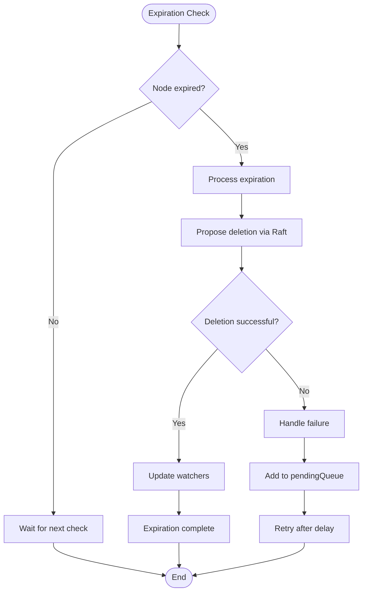

# TTL Management Demo

<cite>
**Referenced Files in This Document**   
- [TtlDemoClient.java](file://demos/src/main/java/com/github/dtprj/dongting/demos/ttl/TtlDemoClient.java)
- [TtlDemoServer.java](file://demos/src/main/java/com/github/dtprj/dongting/demos/ttl/TtlDemoServer.java)
- [GroupId.java](file://demos/src/main/java/com/github/dtprj/dongting/demos/ttl/GroupId.java)
- [TtlManager.java](file://server/src/main/java/com/github/dtprj/dongting/dtkv/server/TtlManager.java)
- [KvClient.java](file://client/src/main/java/com/github/dtprj/dongting/dtkv/KvClient.java)
- [KvImpl.java](file://server/src/main/java/com/github/dtprj/dongting/dtkv/server/KvImpl.java)
- [ServerWatchManager.java](file://server/src/main/java/com/github/dtprj/dongting/dtkv/server/ServerWatchManager.java)
- [WatchManager.java](file://client/src/main/java/com/github/dtprj/dongting/dtkv/WatchManager.java)
- [TtlManagerTest.java](file://server/src/test/java/com/github/dtprj/dongting/dtkv/server/TtlManagerTest.java)
</cite>

## Table of Contents
1. [Introduction](#introduction)
2. [TTL Architecture Overview](#ttl-architecture-overview)
3. [Creating Nodes with TTL](#creating-nodes-with-ttl)
4. [Monitoring Node Lifecycle](#monitoring-node-lifecycle)
5. [Handling Expiration Events](#handling-expiration-events)
6. [TTL and Watch Mechanisms](#ttl-and-watch-mechanisms)
7. [Use Cases](#use-cases)
8. [Expiration Timing and Clock Synchronization](#expiration-timing-and-clock-synchronization)
9. [Conclusion](#conclusion)

## Introduction

The TTL (Time-to-Live) management system in DtKV provides automatic expiration mechanisms for temporary nodes, enabling various distributed coordination patterns such as session management, cached data, and temporary locks. This document provides a comprehensive walkthrough of the TTL functionality, demonstrating how temporary nodes are created, monitored, and automatically removed when they expire.

The TTL system is designed with high reliability and consistency in mind, leveraging the underlying Raft consensus algorithm to ensure that expiration operations are properly replicated across the cluster. The implementation handles various edge cases including leader failover, network partitions, and clock synchronization issues.

This documentation will cover the complete lifecycle of temporary nodes, from creation to expiration, including how clients can refresh TTL values, receive notifications about deletions, and integrate TTL functionality with watch mechanisms for real-time monitoring.

**Section sources**
- [TtlDemoClient.java](file://demos/src/main/java/com/github/dtprj/dongting/demos/ttl/TtlDemoClient.java#L1-L58)
- [TtlDemoServer.java](file://demos/src/main/java/com/github/dtprj/dongting/demos/ttl/TtlDemoServer.java#L1-L33)

## TTL Architecture Overview

The TTL management system in DtKV consists of several key components that work together to provide reliable expiration functionality. The architecture is designed to be efficient, scalable, and resilient to failures.


**Diagram sources**
- [TtlManager.java](file://server/src/main/java/com/github/dtprj/dongting/dtkv/server/TtlManager.java#L33-L241)
- [KvImpl.java](file://server/src/main/java/com/github/dtprj/dongting/dtkv/server/KvImpl.java#L45-L90)
- [ServerWatchManager.java](file://server/src/main/java/com/github/dtprj/dongting/dtkv/server/ServerWatchManager.java#L50-L735)

The core component of the TTL system is the `TtlManager`, which runs on the Raft leader node and is responsible for tracking expiration times and triggering deletion operations. It maintains two priority queues: `ttlQueue` for nodes that are due for expiration checks, and `pendingQueue` for nodes whose expiration processing has failed and needs to be retried.

The `TtlManager` executes periodically, checking for nodes that have reached their expiration time. When a node expires, it triggers a callback that initiates the deletion process through the Raft consensus algorithm, ensuring that the deletion is properly replicated across all cluster nodes.


**Diagram sources**
- [TtlManager.java](file://server/src/main/java/com/github/dtprj/dongting/dtkv/server/TtlManager.java#L33-L241)

## Creating Nodes with TTL

Creating temporary nodes with TTL in DtKV is straightforward and can be done using the `KvClient` API. The system supports both synchronous and asynchronous operations for creating temporary nodes and directories.


**Diagram sources**
- [KvClient.java](file://client/src/main/java/com/github/dtprj/dongting/dtkv/KvClient.java#L272-L279)
- [KvImpl.java](file://server/src/main/java/com/github/dtprj/dongting/dtkv/server/KvImpl.java#L92-L900)
- [TtlManager.java](file://server/src/main/java/com/github/dtprj/dongting/dtkv/server/TtlManager.java#L137-L144)

To create a temporary node with TTL, clients use the `putTemp` method of the `KvClient` class. This method takes the group ID, key, value, and TTL duration in milliseconds as parameters. The operation is synchronous, blocking until the node is successfully created or an error occurs.

```java
// Example: Creating a temporary node with 3-second TTL
kvClient.putTemp(GROUP_ID, "tempKey1".getBytes(), "tempValue1".getBytes(), 3000);
```

The server-side implementation validates the TTL value and creates a `TtlInfo` object that contains all necessary information for expiration tracking, including the key, owner (client identifier), expiration time, and other metadata. This `TtlInfo` is then added to the `ttlQueue` for monitoring.

Temporary directories can also be created with TTL using the `makeTempDir` method. These directories can contain both permanent and temporary child nodes, and when the directory expires, all its contents are automatically removed.

```java
// Example: Creating a temporary directory with 5-second TTL
kvClient.makeTempDir(GROUP_ID, "tempDir".getBytes(), 5000);
```

The TTL system enforces ownership semantics, ensuring that only the client that created a temporary node can modify or delete it. This prevents race conditions and unauthorized access to temporary resources.

**Section sources**
- [TtlDemoClient.java](file://demos/src/main/java/com/github/dtprj/dongting/demos/ttl/TtlDemoClient.java#L39-L41)
- [KvClient.java](file://client/src/main/java/com/github/dtprj/dongting/dtkv/KvClient.java#L272-L301)
- [KvImpl.java](file://server/src/main/java/com/github/dtprj/dongting/dtkv/server/KvImpl.java#L92-L159)

## Monitoring Node Lifecycle

Monitoring the lifecycle of temporary nodes is essential for applications that need to track the status of their resources. DtKV provides several mechanisms for monitoring node lifecycle, including direct queries and watch mechanisms.


**Diagram sources**
- [TtlDemoClient.java](file://demos/src/main/java/com/github/dtprj/dongting/demos/ttl/TtlDemoClient.java#L43-L50)

Clients can monitor the lifecycle of temporary nodes by periodically querying their status using the `get` method. When a node exists, the method returns a `KvNode` object containing the value and metadata. When the node has expired and been deleted, the method returns null.

```java
// Example: Monitoring node lifecycle
KvNode node = kvClient.get(GROUP_ID, "tempKey1".getBytes());
if (node != null) {
    System.out.println("Node exists with value: " + new String(node.data));
} else {
    System.out.println("Node has expired and been removed");
}
```

The demo client demonstrates this pattern by creating a temporary node, querying it immediately to confirm its existence, waiting for a period longer than the TTL, and then querying again to verify that the node has been removed.


**Diagram sources**
- [TtlDemoClient.java](file://demos/src/main/java/com/github/dtprj/dongting/demos/ttl/TtlDemoClient.java#L43-L50)
- [KvClient.java](file://client/src/main/java/com/github/dtprj/dongting/dtkv/KvClient.java#L312-L316)

The server-side implementation efficiently handles these queries by checking the in-memory data structure. Since the deletion of expired nodes is performed through the Raft consensus algorithm, the state is consistent across all nodes, ensuring that queries return accurate results regardless of which server node handles the request.

**Section sources**
- [TtlDemoClient.java](file://demos/src/main/java/com/github/dtprj/dongting/demos/ttl/TtlDemoClient.java#L43-L50)
- [KvClient.java](file://client/src/main/java/com/github/dtprj/dongting/dtkv/KvClient.java#L312-L338)

## Handling Expiration Events

Handling expiration events is a critical aspect of the TTL system, ensuring that temporary nodes are properly cleaned up and that clients can be notified of deletions. The expiration process is designed to be reliable and fault-tolerant.


**Diagram sources**
- [TtlManager.java](file://server/src/main/java/com/github/dtprj/dongting/dtkv/server/TtlManager.java#L62-L109)
- [KvImpl.java](file://server/src/main/java/com/github/dtprj/dongting/dtkv/server/KvImpl.java#L92-L900)
- [ServerWatchManager.java](file://server/src/main/java/com/github/dtprj/dongting/dtkv/server/ServerWatchManager.java#L140-L151)

The expiration process begins when the `TtlManager`'s periodic task executes and finds nodes in the `ttlQueue` whose expiration time has been reached. For each expired node, the manager calls the expiration callback, which initiates the deletion process.

The deletion is performed as a Raft consensus operation to ensure consistency across the cluster. This means that the deletion is proposed to the Raft group, replicated to followers, and only applied when a majority agrees. This approach guarantees that all nodes in the cluster have a consistent view of which nodes exist and which have been deleted.

In cases where expiration processing fails (e.g., due to network issues or temporary unavailability), the system implements a retry mechanism. Failed expirations are moved to the `pendingQueue` and retried after a configurable delay, ensuring that no expired nodes are left undeleted.



**Diagram sources**
- [TtlManager.java](file://server/src/main/java/com/github/dtprj/dongting/dtkv/server/TtlManager.java#L62-L109)

The system also handles the case where a leader failover occurs during the expiration process. When a new leader is elected, the `roleChange` method is called, which merges the `pendingQueue` back into the `ttlQueue` to ensure that no expiration events are lost during the transition.

**Section sources**
- [TtlManager.java](file://server/src/main/java/com/github/dtprj/dongting/dtkv/server/TtlManager.java#L62-L109)
- [TtlManager.java](file://server/src/main/java/com/github/dtprj/dongting/dtkv/server/TtlManager.java#L191-L197)

## TTL and Watch Mechanisms

The integration between TTL and watch mechanisms allows clients to receive real-time notifications when temporary nodes are created, modified, or deleted. This enables reactive programming patterns where applications can respond immediately to changes in the state of temporary resources.


**Diagram sources**
- [WatchManager.java](file://client/src/main/java/com/github/dtprj/dongting/dtkv/WatchManager.java#L57-L717)
- [ServerWatchManager.java](file://server/src/main/java/com/github/dtprj/dongting/dtkv/server/ServerWatchManager.java#L50-L735)
- [TtlManager.java](file://server/src/main/java/com/github/dtprj/dongting/dtkv/server/TtlManager.java#L98-L99)

Clients can establish watches on specific keys or directories using the `addWatch` method of the `WatchManager`. When a watched node is affected by a TTL expiration, the server sends a notification to the client, which then triggers the configured listener.

```java
// Example: Setting up a watch for expiration notifications
watchManager.setListener(new KvListener() {
    @Override
    public void onUpdate(WatchEvent event) {
        if (event.state == WatchEvent.REMOVED) {
            System.out.println("Node expired: " + new String(event.key));
        }
    }
}, Executors.newSingleThreadExecutor());
```

The watch mechanism is designed to be efficient, batching multiple changes into a single notification when possible. This reduces network overhead and improves performance, especially in scenarios with high update rates.

The system also handles watch reconnection and recovery in case of network disruptions. When a client reconnects, it automatically resynchronizes its watches with the server, ensuring that no events are missed during the disconnection period.

**Section sources**
- [WatchManager.java](file://client/src/main/java/com/github/dtprj/dongting/dtkv/WatchManager.java#L57-L717)
- [ServerWatchManager.java](file://server/src/main/java/com/github/dtprj/dongting/dtkv/server/ServerWatchManager.java#L50-L735)

## Use Cases

The TTL functionality in DtKV enables several important use cases in distributed systems, providing reliable mechanisms for managing temporary resources.

### Session Management

One of the primary use cases for TTL is session management in distributed applications. Temporary nodes can represent user sessions, with the TTL serving as the session timeout.


When a user logs in, the application creates a temporary node representing the session with a TTL corresponding to the desired session timeout (e.g., 30 minutes). On each user request, the application refreshes the TTL, extending the session lifetime. If the user becomes inactive, the session node automatically expires and is removed, triggering cleanup of associated resources.

### Cached Data

TTL is also useful for managing cached data in distributed systems. Applications can store computed results or frequently accessed data in temporary nodes, with the TTL serving as the cache expiration time.

This approach provides several benefits:
- Automatic cleanup of stale data
- Consistent cache state across all application instances
- Ability to invalidate cache entries by deleting nodes
- Support for cache warming by pre-populating data

### Temporary Locks

The TTL system can be used to implement temporary locks for distributed coordination. By creating a temporary node to represent a lock, applications can ensure that the lock is automatically released if the holding process fails or becomes unresponsive.

This pattern is particularly useful for implementing leader election, where the leader holds a temporary lock with a TTL, and other nodes monitor the lock and take over if it expires. The TTL acts as a heartbeat mechanism, ensuring that leadership is transferred promptly if the current leader fails.

**Section sources**
- [TtlDemoClient.java](file://demos/src/main/java/com/github/dtprj/dongting/demos/ttl/TtlDemoClient.java#L39-L50)
- [KvClient.java](file://client/src/main/java/com/github/dtprj/dongting/dtkv/KvClient.java#L272-L301)

## Expiration Timing and Clock Synchronization

The precision of expiration timing and clock synchronization requirements are critical aspects of the TTL system's reliability and predictability.


**Diagram sources**
- [TtlManager.java](file://server/src/main/java/com/github/dtprj/dongting/dtkv/server/TtlManager.java#L35-L36)
- [TtlInfo.java](file://server/src/main/java/com/github/dtprj/dongting/dtkv/server/TtlInfo.java#L204-L241)

The TTL system uses a hybrid logical clock approach, combining physical time with logical sequencing to ensure consistent ordering of events across the cluster. The `TtlManager` uses the `Timestamp` class to track time, which provides both wall clock time and monotonic time measurements.

The default expiration check interval is 1 second (1,000,000,000 nanoseconds), which means that expiration events may occur up to 1 second after the actual TTL expiration time. This trade-off between precision and performance can be configured by adjusting the `defaultDelayNanos` parameter.


**Diagram sources**
- [TtlManager.java](file://server/src/main/java/com/github/dtprj/dongting/dtkv/server/TtlManager.java#L44-L45)

Clock synchronization across cluster nodes is important for consistent TTL behavior. While the system can tolerate some clock skew, significant differences between node clocks can lead to inconsistent behavior, such as nodes being deleted on some servers but not others.

The system mitigates clock skew issues by using the leader's clock as the authoritative time source for TTL calculations. When a client sets a TTL, the leader records the expiration time based on its local clock, and this time is used consistently across all nodes when the deletion operation is replicated.

For applications requiring higher precision expiration, the system supports configuring shorter check intervals, though this increases CPU usage. The retry mechanism also helps ensure that expired nodes are eventually deleted, even if the initial expiration check is delayed.

**Section sources**
- [TtlManager.java](file://server/src/main/java/com/github/dtprj/dongting/dtkv/server/TtlManager.java#L44-L45)
- [TtlManager.java](file://server/src/main/java/com/github/dtprj/dongting/dtkv/server/TtlManager.java#L62-L109)

## Conclusion

The TTL management system in DtKV provides a robust and reliable mechanism for automatic expiration of temporary nodes in a distributed environment. By leveraging the Raft consensus algorithm, the system ensures consistent and fault-tolerant expiration behavior across cluster nodes.

Key features of the TTL system include:
- Support for both temporary nodes and directories
- Ownership semantics that prevent unauthorized access
- Integration with watch mechanisms for real-time notifications
- Reliable expiration processing with retry mechanisms
- Configurable expiration check intervals
- Proper handling of leader failover and network partitions

The system is well-suited for various distributed coordination patterns, including session management, cached data, and temporary locks. Applications can use the provided APIs to create temporary resources with specified lifetimes, monitor their status, and receive notifications when they expire.

The architecture balances precision and performance, with a default 1-second expiration check interval that can be adjusted based on application requirements. Clock synchronization considerations are addressed by using the leader's clock as the authoritative time source for TTL calculations.

Overall, the TTL management system in DtKV provides a solid foundation for building distributed applications that require automatic cleanup of temporary resources, ensuring reliability and consistency in dynamic environments.