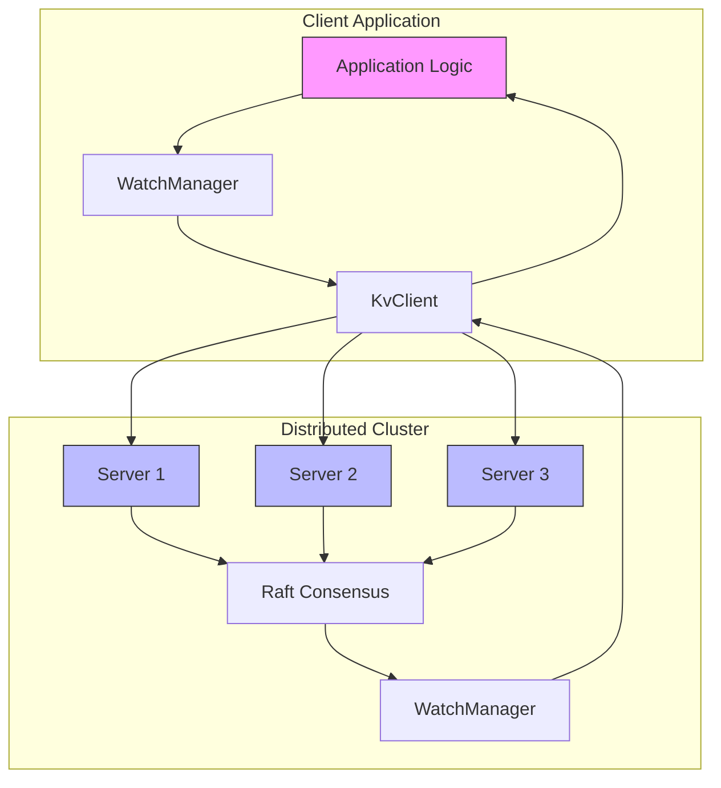
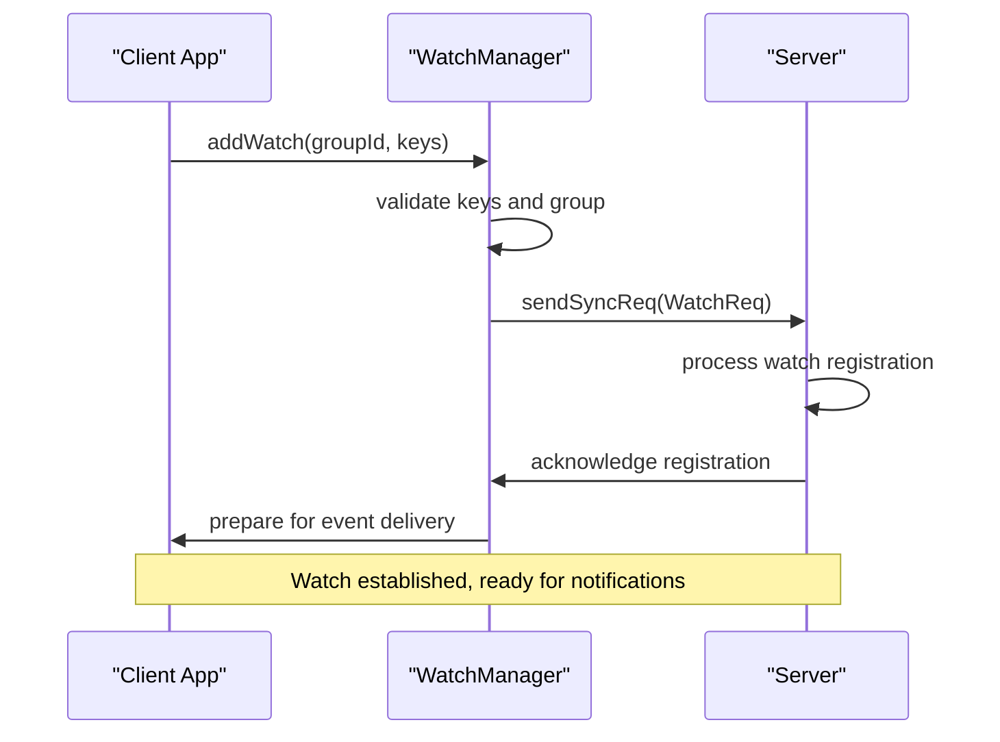
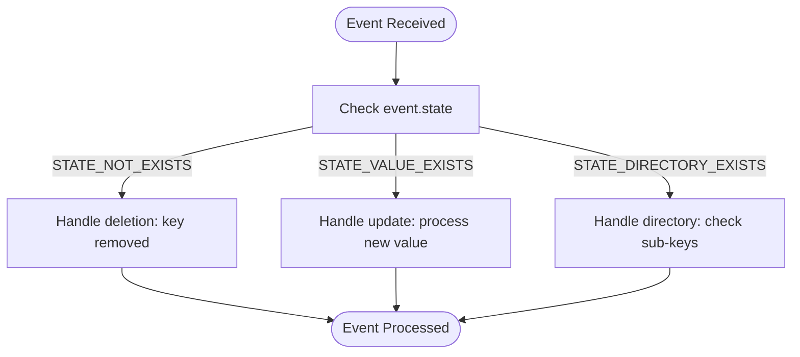
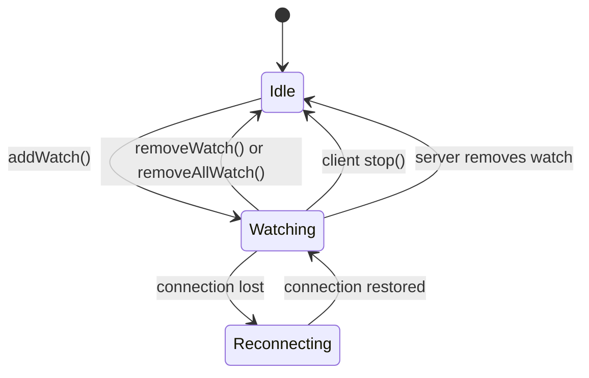
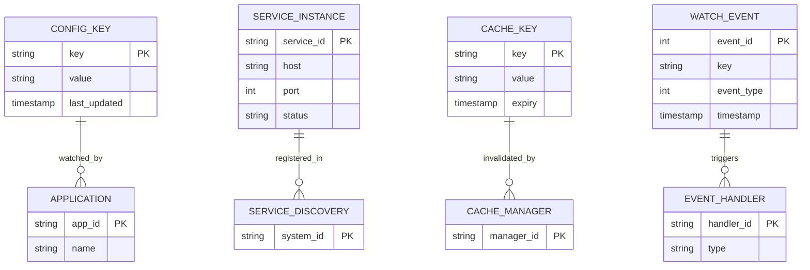

# Watch and Notification Demo

<cite>
**Referenced Files in This Document**   
- [WatchDemoClient.java](file://demos/src/main/java/com/github/dtprj/dongting/demos/watch/WatchDemoClient.java)
- [WatchDemoServer.java](file://demos/src/main/java/com/github/dtprj/dongting/demos/watch/WatchDemoServer.java)
- [WatchManager.java](file://client/src/main/java/com/github/dtprj/dongting/dtkv/WatchManager.java)
- [ServerWatchManager.java](file://server/src/main/java/com/github/dtprj/dongting/dtkv/server/ServerWatchManager.java)
- [WatchEvent.java](file://client/src/main/java/com/github/dtprj/dongting/dtkv/WatchEvent.java)
- [WatchReq.java](file://client/src/main/java/com/github/dtprj/dongting/dtkv/WatchReq.java)
- [WatchNotifyReq.java](file://client/src/main/java/com/github/dtprj/dongting/dtkv/WatchNotifyReq.java)
- [WatchProcessor.java](file://server/src/main/java/com/github/dtprj/dongting/dtkv/server/WatchProcessor.java)
- [KvListener.java](file://client/src/main/java/com/github/dtprj/dongting/dtkv/KvListener.java)
</cite>

## Table of Contents
1. [Introduction](#introduction)
2. [Event-Driven Architecture Overview](#event-driven-architecture-overview)
3. [Setting Up Watchers](#setting-up-watchers)
4. [Handling Watch Events](#handling-watch-events)
5. [Watch Lifecycle Management](#watch-lifecycle-management)
6. [Reactive Patterns and Use Cases](#reactive-patterns-and-use-cases)
7. [Delivery Guarantees and Duplicate Events](#delivery-guarantees-and-duplicate-events)
8. [Best Practices](#best-practices)

## Introduction

The Dongting watch and notification system provides a real-time change detection mechanism for distributed key-value data. This system enables clients to receive immediate notifications when specific keys or directories are modified, allowing applications to react instantly to configuration changes, service discovery events, or cache invalidation scenarios. The implementation is built on an event-driven architecture that leverages the underlying Raft consensus algorithm to ensure consistency across the cluster.

The demo demonstrates how to set up watchers on specific keys or directories, handle different event types (create, update, delete), and manage the complete watch lifecycle. It showcases both one-time and persistent watch patterns, highlighting the system's capabilities for building reactive applications that can respond to configuration changes without requiring polling or restarts.

**Section sources**
- [WatchDemoClient.java](file://demos/src/main/java/com/github/dtprj/dongting/demos/watch/WatchDemoClient.java#L1-L90)
- [WatchDemoServer.java](file://demos/src/main/java/com/github/dtprj/dongting/demos/watch/WatchDemoServer.java#L1-L33)

## Event-Driven Architecture Overview

The watch and notification system follows a distributed event-driven architecture where clients register interest in specific keys or directories, and servers push change notifications when modifications occur. This architecture eliminates the need for clients to poll for changes, reducing network overhead and enabling immediate reaction to state changes.

**Diagram sources **
- [WatchManager.java](file://client/src/main/java/com/github/dtprj/dongting/dtkv/WatchManager.java#L57-L717)
- [ServerWatchManager.java](file://server/src/main/java/com/github/dtprj/dongting/dtkv/server/ServerWatchManager.java#L50-L735)

## Setting Up Watchers

Setting up watchers in the Dongting system involves registering interest in specific keys or directories through the `WatchManager`. Clients can establish watches on individual keys or entire directories, receiving notifications for any changes to the watched paths.

To set up a watcher, clients first create a `KvClient` instance and configure a listener to handle incoming events. The `setListener` method accepts a `KvListener` callback and an `Executor` that determines the thread context in which events are processed. This allows applications to control whether notifications are handled on a dedicated thread or integrated into their existing execution model.

**Diagram sources **
- [WatchManager.java](file://client/src/main/java/com/github/dtprj/dongting/dtkv/WatchManager.java#L132-L157)
- [WatchProcessor.java](file://server/src/main/java/com/github/dtprj/dongting/dtkv/server/WatchProcessor.java#L51-L112)

## Handling Watch Events

The watch system delivers notifications through the `KvListener` interface, which defines the `onUpdate` method for processing `WatchEvent` objects. Each event contains information about the change, including the key, event type, new value (if applicable), and the Raft log index associated with the change.

The system supports three event types:
- **STATE_NOT_EXISTS**: Indicates that a watched key or directory has been deleted
- **STATE_VALUE_EXISTS**: Indicates that a key has been created or updated with a value
- **STATE_DIRECTORY_EXISTS**: Indicates that a directory exists (used for directory watches)

**Diagram sources **
- [WatchEvent.java](file://client/src/main/java/com/github/dtprj/dongting/dtkv/WatchEvent.java#L21-L41)
- [WatchManager.java](file://client/src/main/java/com/github/dtprj/dongting/dtkv/WatchManager.java#L578-L610)

## Watch Lifecycle Management

The watch system provides comprehensive lifecycle management for both one-time and persistent watches. One-time watches are automatically removed after delivering a notification, while persistent watches remain active until explicitly removed or the client disconnects.

Clients can manage watches through several methods:
- `addWatch`: Register new watches on keys or directories
- `removeWatch`: Remove specific watches
- `removeAllWatch`: Remove all watches and clean up resources
- `removeListener`: Remove the event listener

The system automatically handles connection failures and server changes, attempting to re-establish watches when connectivity is restored. When a client shuts down, it should call `removeAllWatch` to properly clean up server-side resources and prevent unnecessary notifications.

**Diagram sources **
- [WatchManager.java](file://client/src/main/java/com/github/dtprj/dongting/dtkv/WatchManager.java#L176-L198)
- [WatchManager.java](file://client/src/main/java/com/github/dtprj/dongting/dtkv/WatchManager.java#L695-L716)

## Reactive Patterns and Use Cases

The watch system enables several reactive patterns for building dynamic applications. The most common use cases include configuration hot-reloading, service discovery, and cache invalidation.

For configuration hot-reloading, applications can watch configuration keys and immediately apply changes without requiring restarts. This allows for dynamic adjustment of application behavior based on external configuration changes.

**Diagram sources **
- [WatchDemoClient.java](file://demos/src/main/java/com/github/dtprj/dongting/demos/watch/WatchDemoClient.java#L67-L89)
- [ServerWatchManager.java](file://server/src/main/java/com/github/dtprj/dongting/dtkv/server/ServerWatchManager.java#L140-L151)

## Delivery Guarantees and Duplicate Events

The watch system provides at-least-once delivery semantics in distributed environments, which means that events are guaranteed to be delivered but may occasionally be duplicated. This design choice prioritizes reliability over perfect deduplication, ensuring that clients never miss important state changes.

Duplicate events can occur due to network retransmissions, server failover, or client reconnection scenarios. Applications should be designed to handle duplicates gracefully, treating event processing as idempotent operations. The `raftIndex` field in `WatchEvent` can be used to detect and filter duplicates when exact ordering and deduplication are required.

The system also provides mechanisms to handle partial failures and ensure eventual consistency. When a server cannot deliver notifications, it implements exponential backoff retry logic with configurable intervals. Clients periodically check server status to ensure they are connected to the current leader, maintaining the linearizability guarantees of the underlying Raft consensus algorithm.

**Section sources**
- [ServerWatchManager.java](file://server/src/main/java/com/github/dtprj/dongting/dtkv/server/ServerWatchManager.java#L453-L462)
- [WatchManager.java](file://client/src/main/java/com/github/dtprj/dongting/dtkv/WatchManager.java#L450-L454)

## Best Practices

When implementing the watch and notification system, several best practices should be followed to ensure reliability and performance:

1. **Always clean up resources**: Call `removeAllWatch` when shutting down clients to prevent resource leaks on the server side.
2. **Handle events idempotently**: Design event handlers to be idempotent since duplicate events may be delivered in distributed environments.
3. **Use appropriate executors**: Select executor services that match your application's threading model and performance requirements.
4. **Monitor connection status**: Implement health checks to detect and recover from network issues.
5. **Batch operations when possible**: When multiple related keys need to be watched, register them in a single call to reduce network overhead.
6. **Handle backpressure**: Ensure that event processing can keep up with the rate of notifications to prevent queue buildup.

The system is designed to be resilient to network partitions and server failures, automatically reconnecting and re-establishing watches when possible. However, applications should implement appropriate error handling and monitoring to detect and respond to prolonged outages.

**Section sources**
- [WatchManager.java](file://client/src/main/java/com/github/dtprj/dongting/dtkv/WatchManager.java#L695-L716)
- [WatchManager.java](file://client/src/main/java/com/github/dtprj/dongting/dtkv/WatchManager.java#L671-L683)