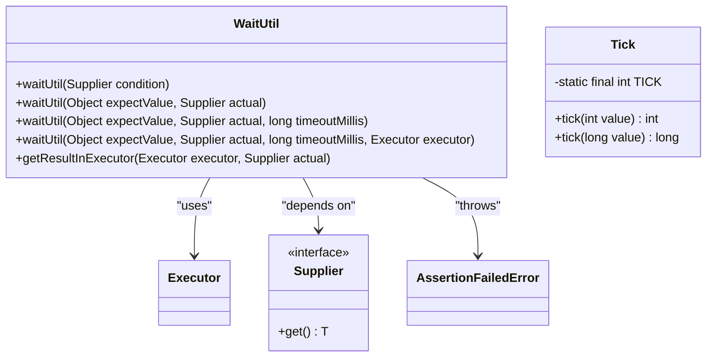
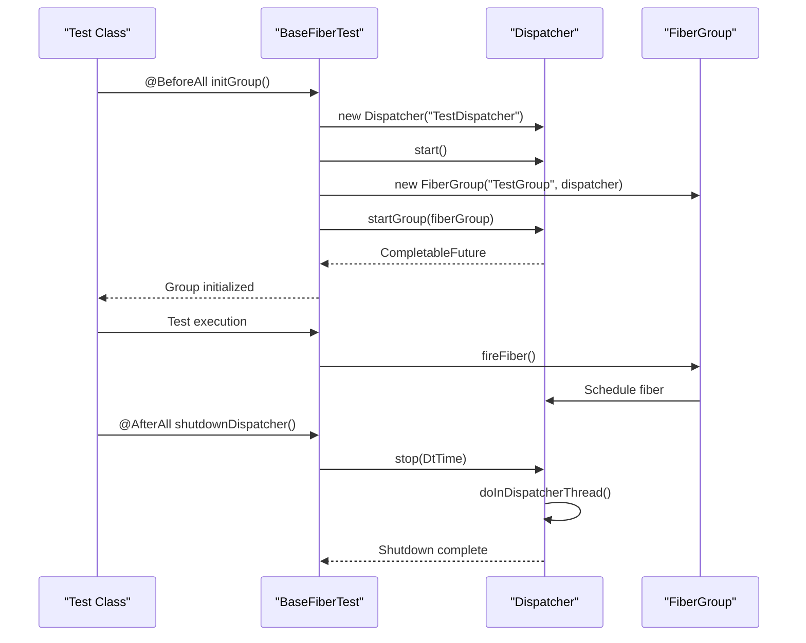
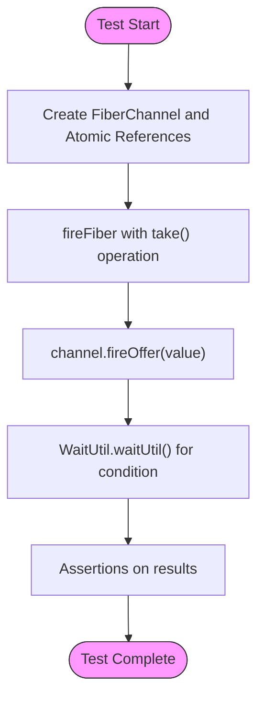
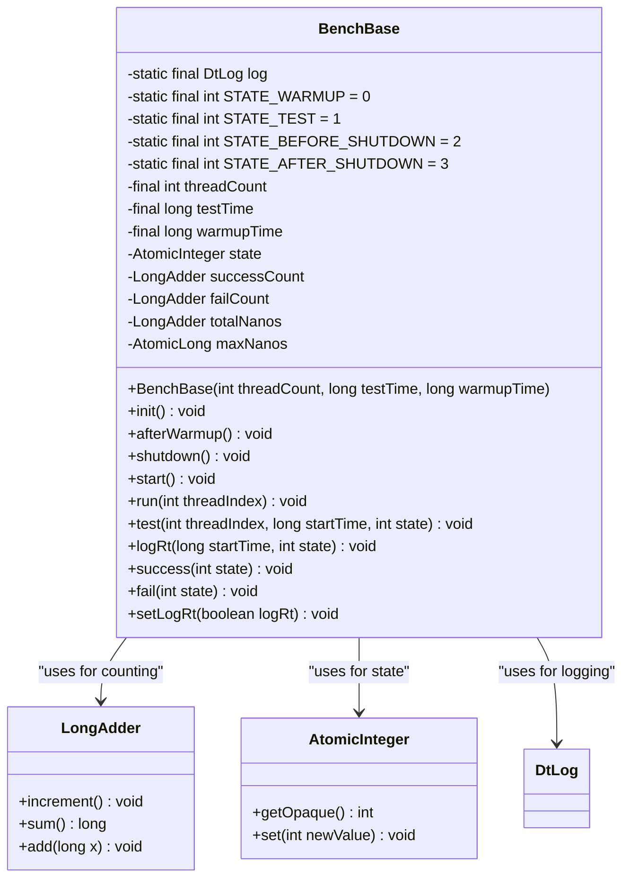

# Development and Testing

<cite>
**Referenced Files in This Document**   
- [developer.md](file://docs/developer.md)
- [pom.xml](file://pom.xml)
- [WaitUtil.java](file://test-support/src/main/java/com/github/dtprj/dongting/test/WaitUtil.java)
- [Tick.java](file://test-support/src/main/java/com/github/dtprj/dongting/test/Tick.java)
- [BenchBase.java](file://benchmark/src/main/java/com/github/dtprj/dongting/bench/common/BenchBase.java)
- [FiberTestUtil.java](file://server/src/test/java/com/github/dtprj/dongting/fiber/FiberTestUtil.java)
- [BaseFiberTest.java](file://server/src/test/java/com/github/dtprj/dongting/fiber/BaseFiberTest.java)
- [AbstractFiberTest.java](file://server/src/test/java/com/github/dtprj/dongting/fiber/AbstractFiberTest.java)
- [ChannelTest.java](file://server/src/test/java/com/github/dtprj/dongting/fiber/ChannelTest.java)
- [it-test/pom.xml](file://it-test/pom.xml)
</cite>

## Table of Contents
1. [Development Environment Setup](#development-environment-setup)
2. [Testing Framework Architecture](#testing-framework-architecture)
3. [Unit Testing Strategies](#unit-testing-strategies)
4. [Integration Testing Patterns](#integration-testing-patterns)
5. [Performance Testing](#performance-testing)
6. [Debugging Techniques](#debugging-techniques)
7. [Code Contribution Guidelines](#code-contribution-guidelines)

## Development Environment Setup

The Dongting project requires specific configuration for proper development environment setup. The project outputs two JAR packages: `dongting-client.jar` requiring Java 8 and `dongting-server.jar` requiring Java 11. However, compiling the entire project requires Java 17 due to the benchmark module's requirements.

To set up the development environment:

1. Generate protobuf source files by running:
```bash
mvn clean compile test-compile
```

2. Add the generated source file paths to the IDE's source configuration. IntelliJ IDEA typically handles this automatically.

3. Configure the client module in IntelliJ IDEA to handle multiple compilation targets (Java 8 to Java 25). The IDE should automatically add required `--add-exports` and `--add-reads` parameters after Maven project synchronization.

4. The demos directory contains executable examples that can be run directly via their main methods, making them ideal for testing the development setup.

**Section sources**
- [developer.md](file://docs/developer.md#L1-L45)
- [pom.xml](file://pom.xml#L114-L195)

## Testing Framework Architecture

Dongting's testing framework is built on JUnit 5 with custom test support utilities. The framework provides specialized tools for handling asynchronous operations, timing, and state verification in a fiber-based concurrency model.

The test-support module provides two key utilities:
- **WaitUtil**: A utility class for waiting until conditions are met, with timeout handling and assertion capabilities
- **Tick**: A time scaling utility that allows test durations to be adjusted via system properties

WaitUtil provides several overloaded methods for waiting on conditions, including support for executing conditions in specific executors. It uses a polling mechanism with 1ms intervals to check conditions until they're satisfied or timeout occurs.

The Tick class enables test time scaling by multiplying time values with a factor specified by the "tick" system property (defaulting to 1). This allows tests to run faster or slower based on environment requirements.



**Diagram sources**
- [WaitUtil.java](file://test-support/src/main/java/com/github/dtprj/dongting/test/WaitUtil.java#L29-L93)
- [Tick.java](file://test-support/src/main/java/com/github/dtprj/dongting/test/Tick.java#L21-L31)

**Section sources**
- [WaitUtil.java](file://test-support/src/main/java/com/github/dtprj/dongting/test/WaitUtil.java#L1-L94)
- [Tick.java](file://test-support/src/main/java/com/github/dtprj/dongting/test/Tick.java#L1-L32)

## Unit Testing Strategies

Dongting's unit testing strategy focuses on the fiber-based concurrency model, RAFT state transitions, and network protocols. The framework provides base test classes that handle the setup and teardown of fiber dispatchers and groups.

### Fiber-Based Code Testing

The testing framework provides several base classes for testing fiber-based code:
- **AbstractFiberTest**: Provides per-test setup/teardown of dispatcher and fiber group
- **BaseFiberTest**: Similar to AbstractFiberTest but with @BeforeAll and @AfterAll annotations
- **FiberTestUtil**: Provides static dispatcher and fiber group instances for shared use

These base classes handle the creation, starting, and stopping of Dispatcher and FiberGroup instances, ensuring proper resource cleanup after tests.



**Diagram sources**
- [BaseFiberTest.java](file://server/src/test/java/com/github/dtprj/dongting/fiber/BaseFiberTest.java#L27-L52)
- [AbstractFiberTest.java](file://server/src/test/java/com/github/dtprj/dongting/fiber/AbstractFiberTest.java#L36-L134)
- [FiberTestUtil.java](file://server/src/test/java/com/github/dtprj/dongting/fiber/FiberTestUtil.java#L21-L37)

### Asynchronous Operation Testing

Testing asynchronous operations in Dongting involves using the WaitUtil class to verify conditions over time. For example, when testing fiber channels, tests fire fiber operations and then wait for expected results:



**Diagram sources**
- [ChannelTest.java](file://server/src/test/java/com/github/dtprj/dongting/fiber/ChannelTest.java#L34-L146)

**Section sources**
- [BaseFiberTest.java](file://server/src/test/java/com/github/dtprj/dongting/fiber/BaseFiberTest.java#L1-L52)
- [AbstractFiberTest.java](file://server/src/test/java/com/github/dtprj/dongting/fiber/AbstractFiberTest.java#L1-L134)
- [FiberTestUtil.java](file://server/src/test/java/com/github/dtprj/dongting/fiber/FiberTestUtil.java#L1-L37)
- [ChannelTest.java](file://server/src/test/java/com/github/dtprj/dongting/fiber/ChannelTest.java#L1-L146)

## Integration Testing Patterns

The it-test module provides integration testing capabilities for Dongting. This module uses the Maven Failsafe plugin to run integration tests, allowing for separate configuration from unit tests.

The integration tests are designed to test multi-node scenarios, network partitions, and other distributed system behaviors that cannot be adequately tested with unit tests alone. The it-test module depends on the dongting-dist artifact, which contains the complete distribution of the Dongting system.

Integration tests follow a pattern of:
1. Setting up multiple server instances
2. Establishing client connections
3. Executing distributed operations
4. Verifying consistency across nodes
5. Testing failure recovery scenarios

The integration test framework can be enabled by setting the skipITs property to false in the it-test module's pom.xml file.

**Section sources**
- [it-test/pom.xml](file://it-test/pom.xml#L1-L75)

## Performance Testing

Dongting's performance testing framework is implemented in the benchmark module, which requires Java 17. The framework is built around the BenchBase abstract class, which provides a standardized structure for performance tests.

Key features of the performance testing framework:
- Warmup phase to stabilize JVM performance
- Test phase with configurable duration
- Thread-count configurable tests
- Success/failure counting with operations per second calculation
- Optional response time logging with min/max/avg calculations

The BenchBase class manages the test lifecycle including initialization, execution across multiple threads, and shutdown. It provides methods for recording successes, failures, and response times, automatically calculating and reporting performance metrics.



**Diagram sources**
- [BenchBase.java](file://benchmark/src/main/java/com/github/dtprj/dongting/bench/common/BenchBase.java#L30-L153)

**Section sources**
- [BenchBase.java](file://benchmark/src/main/java/com/github/dtprj/dongting/bench/common/BenchBase.java#L1-L153)
- [pom.xml](file://benchmark/pom.xml#L1-L58)

## Debugging Techniques

Debugging Dongting applications requires understanding of the fiber-based concurrency model and distributed system behaviors. Key debugging techniques include:

### Concurrency Issues
- Use WaitUtil with appropriate timeouts to identify deadlocks
- Monitor fiber group state and dispatcher thread activity
- Check for proper resource cleanup in finally blocks
- Verify fiber cancellation behavior

### Race Conditions
- Increase test time scaling using the Tick utility
- Use multiple test iterations with varying thread counts
- Implement stress tests with high concurrency
- Verify state consistency across multiple execution paths

### Network Failures
- Simulate network partitions in integration tests
- Test timeout handling in client-server interactions
- Verify reconnection logic and session recovery
- Monitor heartbeat and ping/pong mechanisms

The framework's logging system (using SLF4J with fallback to JDK logging) provides detailed information about fiber execution, network operations, and RAFT state transitions, which can be invaluable for debugging complex distributed scenarios.

**Section sources**
- [WaitUtil.java](file://test-support/src/main/java/com/github/dtprj/dongting/test/WaitUtil.java#L1-L94)
- [Tick.java](file://test-support/src/main/java/com/github/dtprj/dongting/test/Tick.java#L1-L32)
- [AbstractFiberTest.java](file://server/src/test/java/com/github/dtprj/dongting/fiber/AbstractFiberTest.java#L1-L134)

## Code Contribution Guidelines

Contributions to Dongting should follow these guidelines:

1. **Development Environment**: Ensure your IDE is properly configured according to the developer.md guide, with correct source paths and module settings.

2. **Testing Requirements**: All new code must be accompanied by comprehensive tests:
   - Unit tests for fiber-based components using the provided base test classes
   - Integration tests for distributed scenarios in the it-test module
   - Performance benchmarks for critical paths when applicable

3. **Pull Request Requirements**:
   - Clear description of the change and its motivation
   - Reference to any related issues
   - All tests passing (unit, integration, and performance)
   - Code coverage maintained or improved
   - Documentation updates when applicable

4. **Continuous Integration**: The project uses GitHub Actions for CI, which runs:
   - Maven build and test execution
   - Code coverage analysis with JaCoCo
   - Automated testing with the configured test suite

5. **Code Quality**: Maintain the project's performance-oriented programming principles and zero-dependency philosophy.

**Section sources**
- [developer.md](file://docs/developer.md#L1-L45)
- [pom.xml](file://pom.xml#L114-L195)
- [it-test/pom.xml](file://it-test/pom.xml#L1-L75)