# Performance Benchmarking

<cite>
**Referenced Files in This Document**   
- [BenchBase.java](file://benchmark/src/main/java/com/github/dtprj/dongting/bench/common/BenchBase.java)
- [SimplePerfCallback.java](file://benchmark/src/main/java/com/github/dtprj/dongting/bench/common/SimplePerfCallback.java)
- [PrometheusPerfCallback.java](file://benchmark/src/main/java/com/github/dtprj/dongting/bench/common/PrometheusPerfCallback.java)
- [TestProps.java](file://benchmark/src/main/java/com/github/dtprj/dongting/bench/common/TestProps.java)
- [FiberTest.java](file://benchmark/src/main/java/com/github/dtprj/dongting/bench/fiber/FiberTest.java)
- [IoTest.java](file://benchmark/src/main/java/com/github/dtprj/dongting/bench/io/IoTest.java)
- [MpscQueueTest.java](file://benchmark/src/main/java/com/github/dtprj/dongting/bench/queue/MpscQueueTest.java)
- [RpcBenchmark.java](file://benchmark/src/main/java/com/github/dtprj/dongting/bench/rpc/RpcBenchmark.java)
- [RaftPerfCallback.java](file://benchmark/src/main/java/com/github/dtprj/dongting/bench/raft/RaftPerfCallback.java)
- [RpcPerfCallback.java](file://benchmark/src/main/java/com/github/dtprj/dongting/bench/rpc/RpcPerfCallback.java)
- [PerfCallback.java](file://client/src/main/java/com/github/dtprj/dongting/common/PerfCallback.java)
- [SyncTest.java](file://benchmark/src/main/java/com/github/dtprj/dongting/bench/io/SyncTest.java)
- [CreateFiberTest.java](file://benchmark/src/main/java/com/github/dtprj/dongting/bench/fiber/CreateFiberTest.java)
- [OrderMapTest.java](file://benchmark/src/main/java/com/github/dtprj/dongting/bench/map/OrderMapTest.java)
- [pom.xml](file://benchmark/pom.xml)
</cite>

## Table of Contents
1. [Introduction](#introduction)
2. [Benchmark Architecture](#benchmark-architecture)
3. [Core Components](#core-components)
4. [Performance Callback Mechanisms](#performance-callback-mechanisms)
5. [Benchmark Design and Execution](#benchmark-design-and-execution)
6. [Core Component Benchmarks](#core-component-benchmarks)
7. [Result Interpretation](#result-interpretation)
8. [Prometheus Integration](#prometheus-integration)
9. [Creating New Benchmarks](#creating-new-benchmarks)
10. [Best Practices](#best-practices)
11. [Conclusion](#conclusion)

## Introduction
The Dongting performance benchmarking framework provides a comprehensive suite for measuring and analyzing the performance of core components in the Dongting system. This documentation details the architecture, usage patterns, and best practices for conducting performance benchmarks on critical system components such as fiber scheduling, IO operations, and queue performance. The framework is designed to provide accurate, reproducible performance measurements with detailed metrics on throughput, latency, and resource utilization.

**Section sources**
- [BenchBase.java](file://benchmark/src/main/java/com/github/dtprj/dongting/bench/common/BenchBase.java#L1-L153)

## Benchmark Architecture

The Dongting benchmark suite follows a modular architecture built around a base class hierarchy that provides common benchmarking functionality. The framework is organized into specialized benchmark categories, each targeting specific system components.

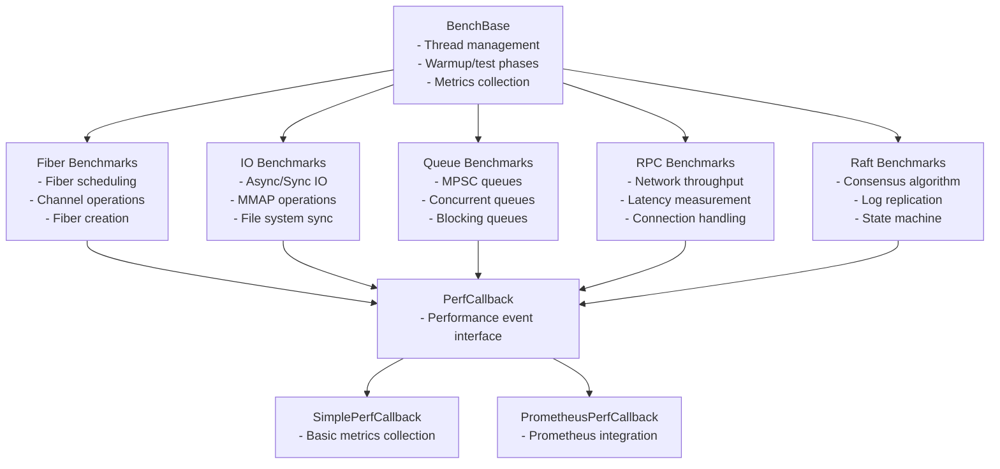

**Diagram sources**
- [BenchBase.java](file://benchmark/src/main/java/com/github/dtprj/dongting/bench/common/BenchBase.java#L30-L152)
- [PerfCallback.java](file://client/src/main/java/com/github/dtprj/dongting/common/PerfCallback.java#L21-L109)

## Core Components

The benchmark framework is built around several core components that provide the foundation for performance testing. The `BenchBase` class serves as the foundation for all benchmarks, providing thread management, warmup periods, and test execution phases. It handles the lifecycle of benchmark execution, including initialization, warmup, testing, and shutdown phases.

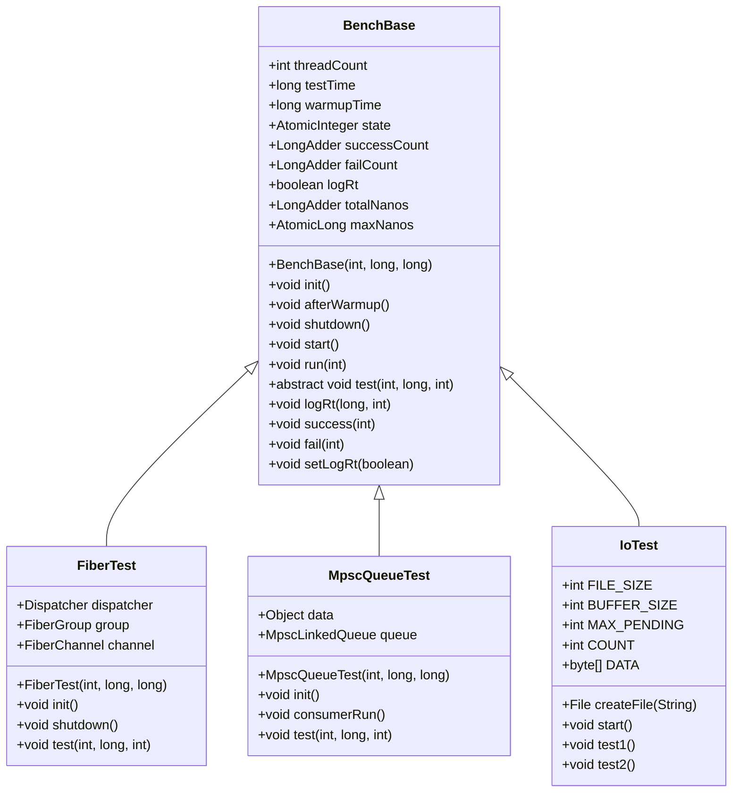

**Diagram sources**
- [BenchBase.java](file://benchmark/src/main/java/com/github/dtprj/dongting/bench/common/BenchBase.java#L30-L152)
- [FiberTest.java](file://benchmark/src/main/java/com/github/dtprj/dongting/bench/fiber/FiberTest.java#L32-L88)
- [MpscQueueTest.java](file://benchmark/src/main/java/com/github/dtprj/dongting/bench/queue/MpscQueueTest.java#L14-L52)
- [IoTest.java](file://benchmark/src/main/java/com/github/dtprj/dongting/bench/io/IoTest.java#L34-L195)

**Section sources**
- [BenchBase.java](file://benchmark/src/main/java/com/github/dtprj/dongting/bench/common/BenchBase.java#L30-L152)
- [FiberTest.java](file://benchmark/src/main/java/com/github/dtprj/dongting/bench/fiber/FiberTest.java#L32-L88)
- [MpscQueueTest.java](file://benchmark/src/main/java/com/github/dtprj/dongting/bench/queue/MpscQueueTest.java#L14-L52)
- [IoTest.java](file://benchmark/src/main/java/com/github/dtprj/dongting/bench/io/IoTest.java#L34-L195)

## Performance Callback Mechanisms

The performance callback system in Dongting provides a flexible mechanism for collecting detailed performance metrics during benchmark execution. The framework supports multiple callback implementations, from simple console output to integration with monitoring systems like Prometheus.

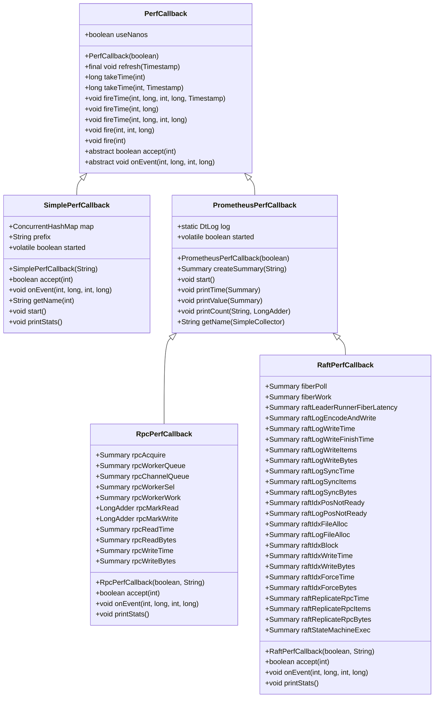

**Diagram sources**
- [PerfCallback.java](file://client/src/main/java/com/github/dtprj/dongting/common/PerfCallback.java#L21-L109)
- [SimplePerfCallback.java](file://benchmark/src/main/java/com/github/dtprj/dongting/bench/common/SimplePerfCallback.java#L29-L151)
- [PrometheusPerfCallback.java](file://benchmark/src/main/java/com/github/dtprj/dongting/bench/common/PrometheusPerfCallback.java#L31-L102)
- [RpcPerfCallback.java](file://benchmark/src/main/java/com/github/dtprj/dongting/bench/rpc/RpcPerfCallback.java#L26-L117)
- [RaftPerfCallback.java](file://benchmark/src/main/java/com/github/dtprj/dongting/bench/raft/RaftPerfCallback.java#L26-L183)

**Section sources**
- [PerfCallback.java](file://client/src/main/java/com/github/dtprj/dongting/common/PerfCallback.java#L21-L109)
- [SimplePerfCallback.java](file://benchmark/src/main/java/com/github/dtprj/dongting/bench/common/SimplePerfCallback.java#L29-L151)
- [PrometheusPerfCallback.java](file://benchmark/src/main/java/com/github/dtprj/dongting/bench/common/PrometheusPerfCallback.java#L31-L102)
- [RpcPerfCallback.java](file://benchmark/src/main/java/com/github/dtprj/dongting/bench/rpc/RpcPerfCallback.java#L26-L117)
- [RaftPerfCallback.java](file://benchmark/src/main/java/com/github/dtprj/dongting/bench/raft/RaftPerfCallback.java#L26-L183)

## Benchmark Design and Execution

The benchmark execution workflow follows a standardized pattern across all benchmark types. Each benchmark extends the `BenchBase` class and implements the required methods to define the specific test behavior. The execution process includes warmup, testing, and shutdown phases to ensure accurate performance measurement.

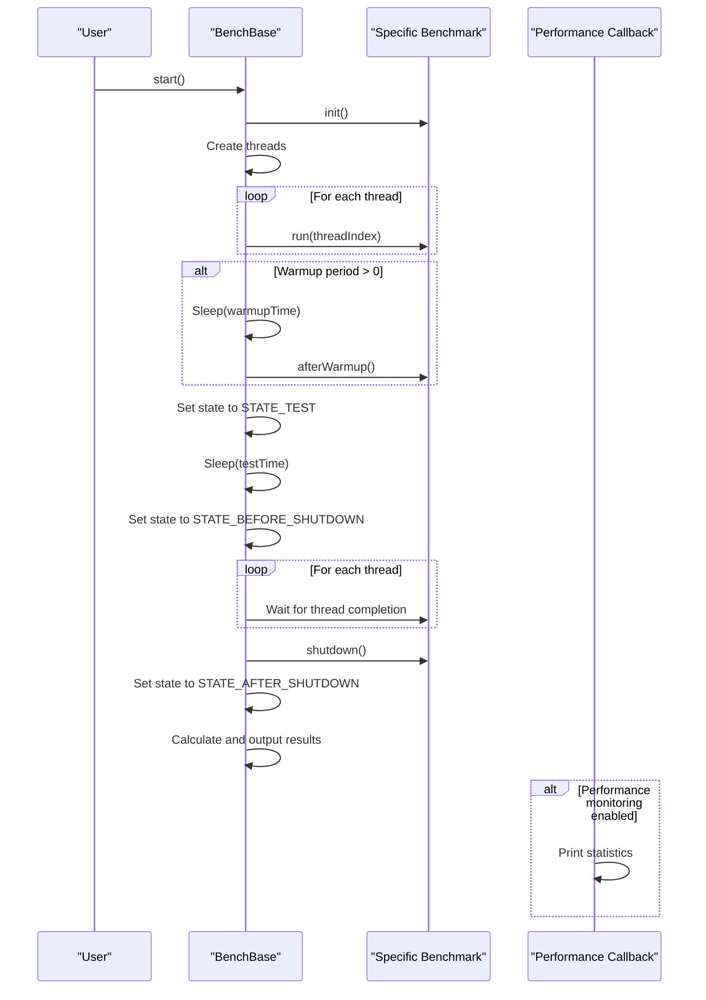

**Diagram sources**
- [BenchBase.java](file://benchmark/src/main/java/com/github/dtprj/dongting/bench/common/BenchBase.java#L65-L107)
- [RpcBenchmark.java](file://benchmark/src/main/java/com/github/dtprj/dongting/bench/rpc/RpcBenchmark.java#L63-L161)

**Section sources**
- [BenchBase.java](file://benchmark/src/main/java/com/github/dtprj/dongting/bench/common/BenchBase.java#L65-L107)
- [RpcBenchmark.java](file://benchmark/src/main/java/com/github/dtprj/dongting/bench/rpc/RpcBenchmark.java#L63-L161)

## Core Component Benchmarks

The Dongting benchmark suite includes specialized benchmarks for various core components. Each benchmark category targets specific aspects of system performance, providing detailed insights into different subsystems.

### Fiber Scheduling Benchmarks
The fiber scheduling benchmarks measure the performance of Dongting's fiber-based concurrency model. These benchmarks evaluate fiber creation, scheduling, and communication through channels.

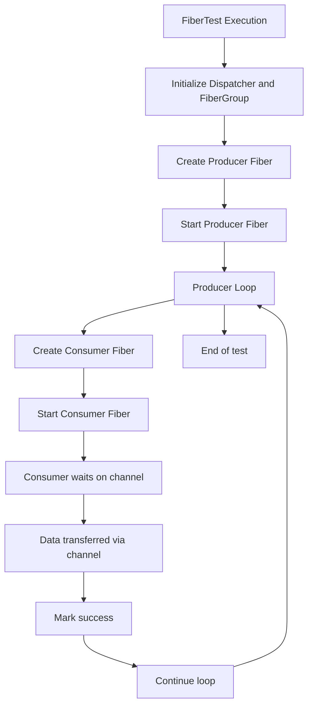

**Diagram sources**
- [FiberTest.java](file://benchmark/src/main/java/com/github/dtprj/dongting/bench/fiber/FiberTest.java#L46-L73)
- [CreateFiberTest.java](file://benchmark/src/main/java/com/github/dtprj/dongting/bench/fiber/CreateFiberTest.java#L50-L67)

### IO Operation Benchmarks
The IO benchmarks evaluate different IO strategies, including asynchronous IO, synchronous IO, and memory-mapped files. These benchmarks help identify the most efficient IO approach for different workloads.

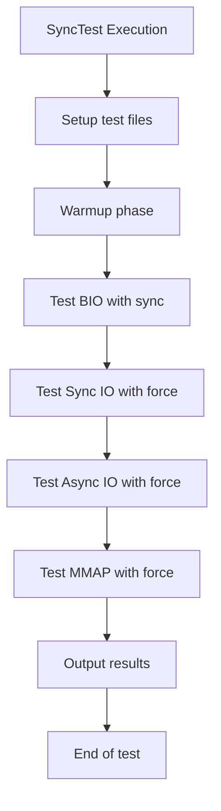

**Diagram sources**
- [IoTest.java](file://benchmark/src/main/java/com/github/dtprj/dongting/bench/io/IoTest.java#L67-L187)
- [SyncTest.java](file://benchmark/src/main/java/com/github/dtprj/dongting/bench/io/SyncTest.java#L56-L162)

### Queue Performance Benchmarks
The queue benchmarks measure the performance of different queue implementations, focusing on multi-producer single-consumer (MPSC) patterns which are common in high-performance systems.

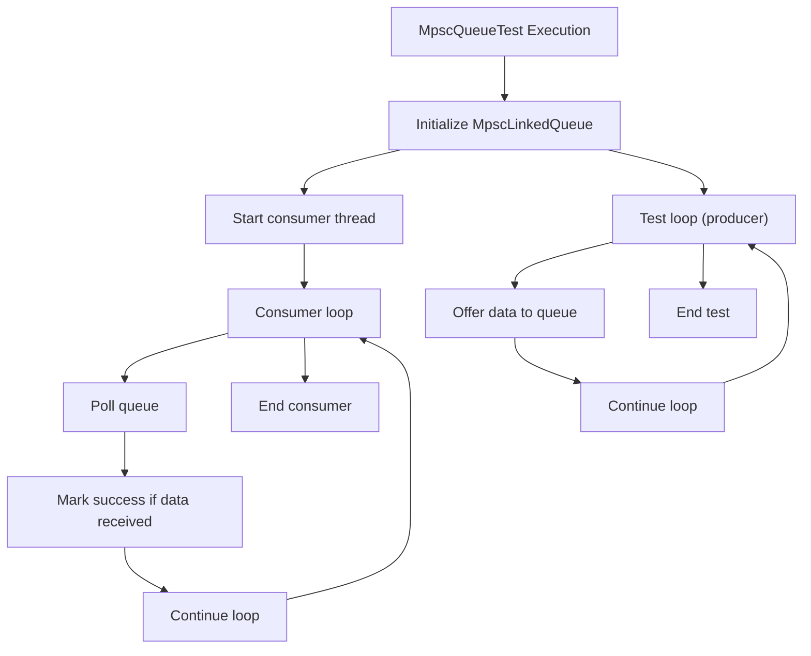

**Diagram sources**
- [MpscQueueTest.java](file://benchmark/src/main/java/com/github/dtprj/dongting/bench/queue/MpscQueueTest.java#L27-L51)
- [ConcurrentLinkedQueueTest.java](file://benchmark/src/main/java/com/github/dtprj/dongting/bench/queue/ConcurrentLinkedQueueTest.java#L1-L30)

**Section sources**
- [FiberTest.java](file://benchmark/src/main/java/com/github/dtprj/dongting/bench/fiber/FiberTest.java#L32-L88)
- [CreateFiberTest.java](file://benchmark/src/main/java/com/github/dtprj/dongting/bench/fiber/CreateFiberTest.java#L30-L111)
- [IoTest.java](file://benchmark/src/main/java/com/github/dtprj/dongting/bench/io/IoTest.java#L34-L195)
- [SyncTest.java](file://benchmark/src/main/java/com/github/dtprj/dongting/bench/io/SyncTest.java#L32-L166)
- [MpscQueueTest.java](file://benchmark/src/main/java/com/github/dtprj/dongting/bench/queue/MpscQueueTest.java#L14-L52)
- [ConcurrentLinkedQueueTest.java](file://benchmark/src/main/java/com/github/dtprj/dongting/bench/queue/ConcurrentLinkedQueueTest.java#L1-L30)

## Result Interpretation

The benchmark framework provides comprehensive metrics for interpreting performance results. Key metrics include throughput, latency, and resource utilization, which are essential for understanding system performance characteristics.

### Throughput Metrics
Throughput is measured in operations per second (ops) and represents the system's capacity to process requests. The framework calculates throughput based on the number of successful operations during the test period.

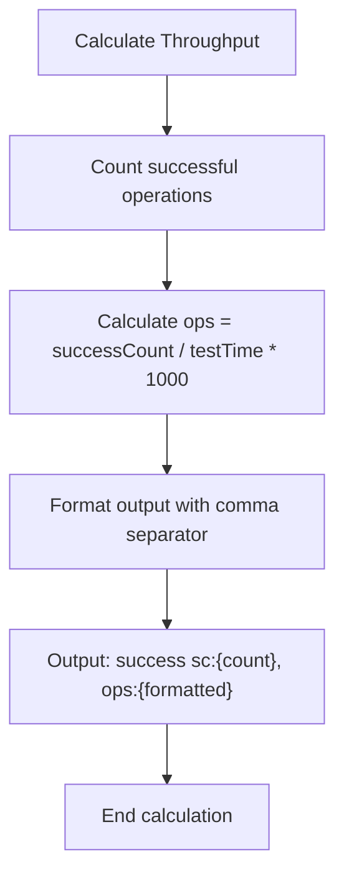

**Diagram sources**
- [BenchBase.java](file://benchmark/src/main/java/com/github/dtprj/dongting/bench/common/BenchBase.java#L93-L97)

### Latency Metrics
Latency metrics measure the time taken for individual operations, providing insights into response times and system responsiveness. The framework can track maximum and average latency when enabled.

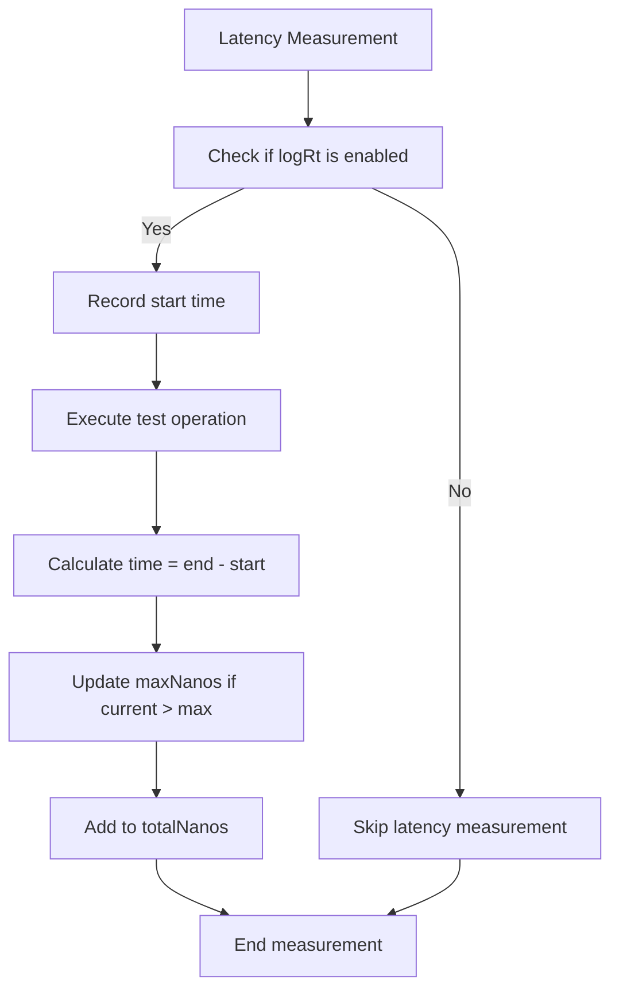

**Diagram sources**
- [BenchBase.java](file://benchmark/src/main/java/com/github/dtprj/dongting/bench/common/BenchBase.java#L114-L134)
- [BenchBase.java](file://benchmark/src/main/java/com/github/dtprj/dongting/bench/common/BenchBase.java#L100-L102)

### Resource Utilization Metrics
Resource utilization metrics, particularly thread utilization, help identify bottlenecks and inefficiencies in system resource usage. The framework calculates thread utilization rates based on time spent in different processing phases.

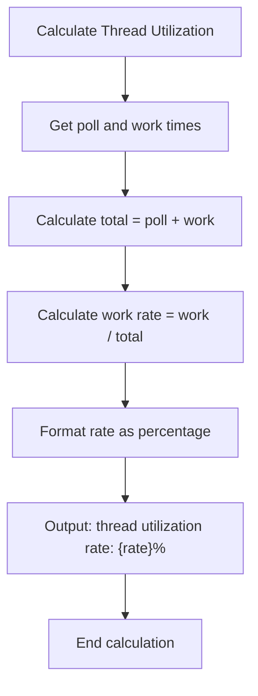

**Diagram sources**
- [RpcPerfCallback.java](file://benchmark/src/main/java/com/github/dtprj/dongting/bench/rpc/RpcPerfCallback.java#L110-L113)
- [RaftPerfCallback.java](file://benchmark/src/main/java/com/github/dtprj/dongting/bench/raft/RaftPerfCallback.java#L176-L179)

**Section sources**
- [BenchBase.java](file://benchmark/src/main/java/com/github/dtprj/dongting/bench/common/BenchBase.java#L93-L102)
- [RpcPerfCallback.java](file://benchmark/src/main/java/com/github/dtprj/dongting/bench/rpc/RpcPerfCallback.java#L110-L113)
- [RaftPerfCallback.java](file://benchmark/src/main/java/com/github/dtprj/dongting/bench/raft/RaftPerfCallback.java#L176-L179)

## Prometheus Integration

The benchmark framework provides seamless integration with Prometheus for monitoring and visualization of performance metrics. The `PrometheusPerfCallback` class and its derivatives enable detailed metric collection that can be exposed to Prometheus.

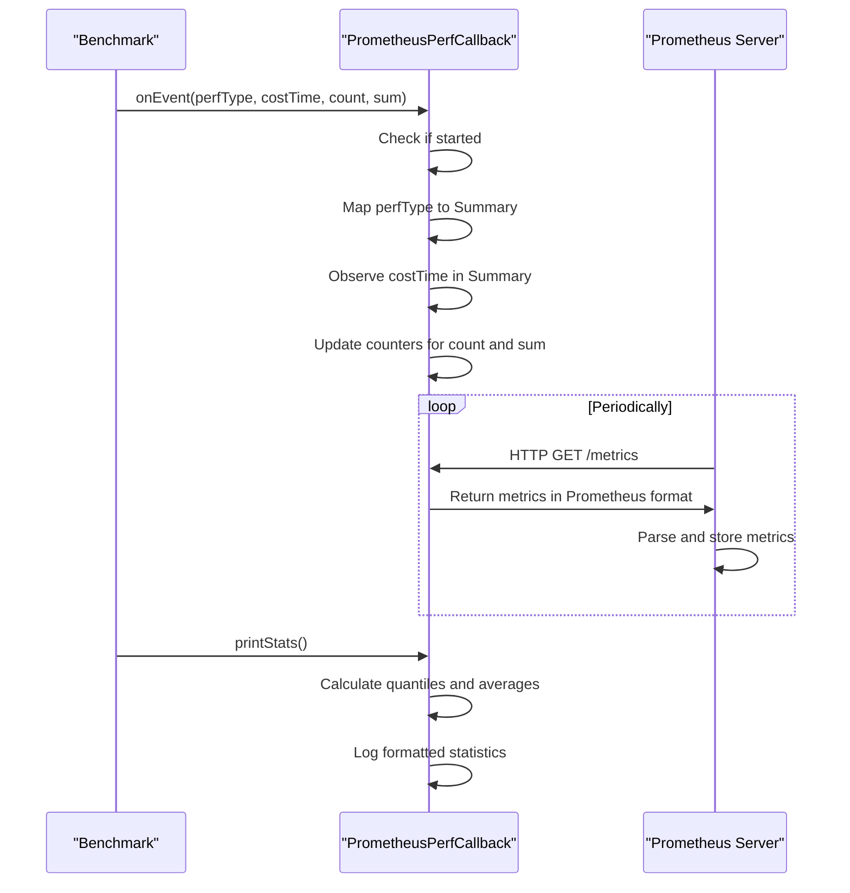

**Diagram sources**
- [PrometheusPerfCallback.java](file://benchmark/src/main/java/com/github/dtprj/dongting/bench/common/PrometheusPerfCallback.java#L50-L72)
- [RpcPerfCallback.java](file://benchmark/src/main/java/com/github/dtprj/dongting/bench/rpc/RpcPerfCallback.java#L58-L93)
- [RaftPerfCallback.java](file://benchmark/src/main/java/com/github/dtprj/dongting/bench/raft/RaftPerfCallback.java#L86-L147)

**Section sources**
- [PrometheusPerfCallback.java](file://benchmark/src/main/java/com/github/dtprj/dongting/bench/common/PrometheusPerfCallback.java#L31-L102)
- [RpcPerfCallback.java](file://benchmark/src/main/java/com/github/dtprj/dongting/bench/rpc/RpcPerfCallback.java#L26-L117)
- [RaftPerfCallback.java](file://benchmark/src/main/java/com/github/dtprj/dongting/bench/raft/RaftPerfCallback.java#L26-L183)

## Creating New Benchmarks

Creating new benchmarks in the Dongting framework follows a consistent pattern that ensures compatibility with the existing infrastructure. New benchmarks should extend `BenchBase` and implement the required methods to define the specific test behavior.

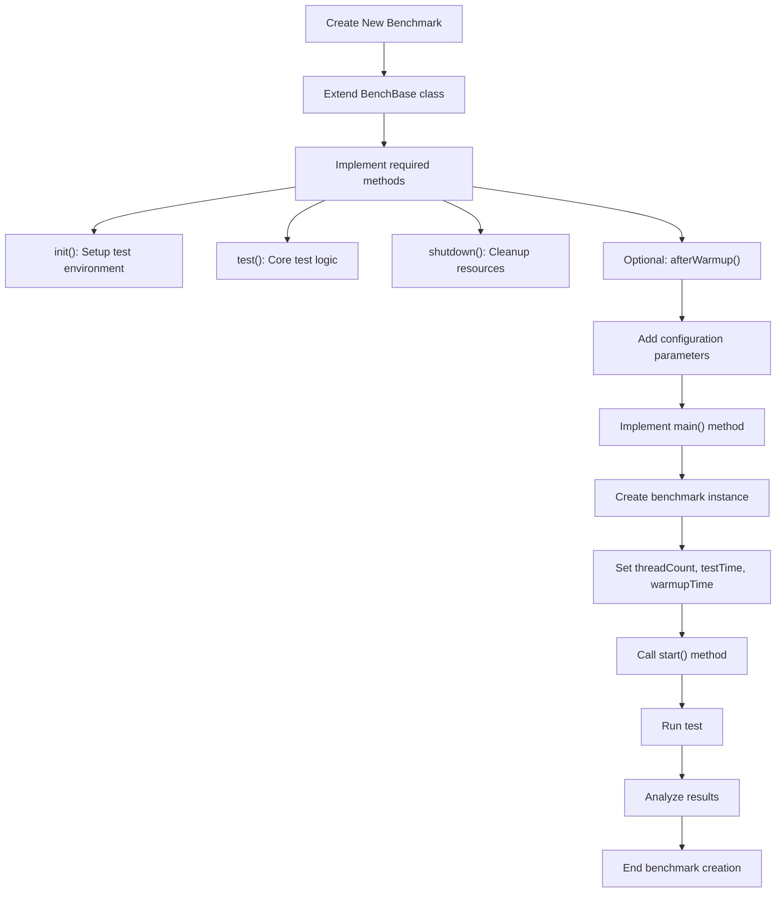

**Diagram sources**
- [BenchBase.java](file://benchmark/src/main/java/com/github/dtprj/dongting/bench/common/BenchBase.java#L30-L152)
- [FiberTest.java](file://benchmark/src/main/java/com/github/dtprj/dongting/bench/fiber/FiberTest.java#L32-L88)
- [MpscQueueTest.java](file://benchmark/src/main/java/com/github/dtprj/dongting/bench/queue/MpscQueueTest.java#L14-L52)

**Section sources**
- [BenchBase.java](file://benchmark/src/main/java/com/github/dtprj/dongting/bench/common/BenchBase.java#L30-L152)
- [FiberTest.java](file://benchmark/src/main/java/com/github/dtprj/dongting/bench/fiber/FiberTest.java#L32-L88)
- [MpscQueueTest.java](file://benchmark/src/main/java/com/github/dtprj/dongting/bench/queue/MpscQueueTest.java#L14-L52)

## Best Practices

To ensure accurate and meaningful performance measurements, several best practices should be followed when conducting benchmarks with the Dongting framework.

### JVM Warmup
Proper JVM warmup is critical for obtaining accurate performance results. The framework includes a dedicated warmup phase to allow the JIT compiler to optimize code paths before measurements begin.

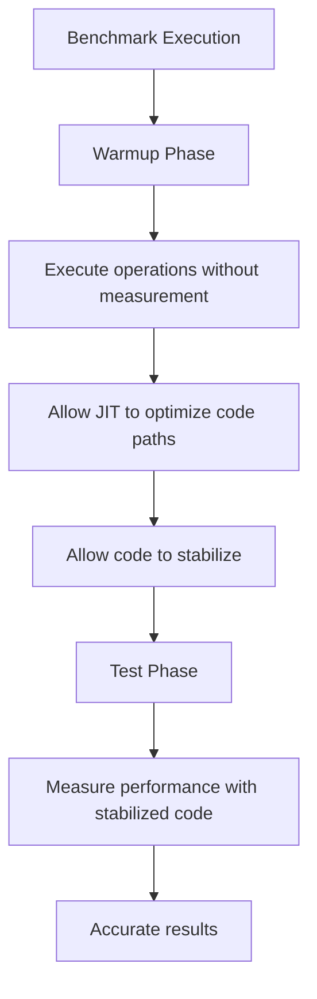

**Diagram sources**
- [BenchBase.java](file://benchmark/src/main/java/com/github/dtprj/dongting/bench/common/BenchBase.java#L75-L77)
- [BenchBase.java](file://benchmark/src/main/java/com/github/dtprj/dongting/bench/common/BenchBase.java#L79-L80)

### Garbage Collection Considerations
Garbage collection can significantly impact performance measurements. Benchmarks should be designed to minimize GC interference and results should be interpreted with GC behavior in mind.

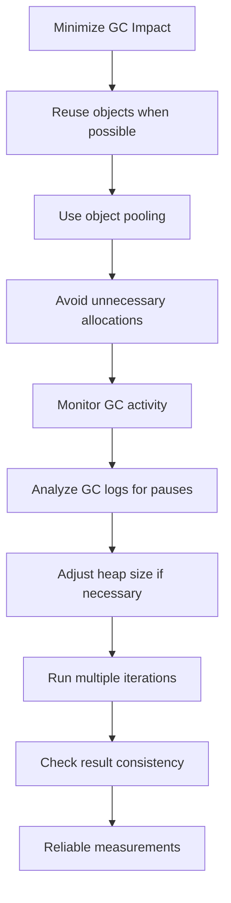

**Diagram sources**
- [BenchBase.java](file://benchmark/src/main/java/com/github/dtprj/dongting/bench/common/BenchBase.java#L41-L42)
- [BenchBase.java](file://benchmark/src/main/java/com/github/dtprj/dongting/bench/common/BenchBase.java#L90-L97)

### Hardware Consistency
Consistent hardware conditions are essential for reproducible benchmark results. Tests should be conducted on dedicated hardware with minimal external interference.

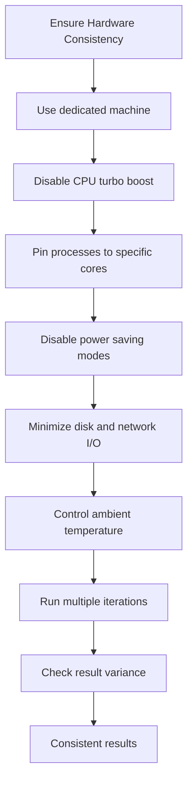

**Section sources**
- [BenchBase.java](file://benchmark/src/main/java/com/github/dtprj/dongting/bench/common/BenchBase.java#L75-L80)
- [TestProps.java](file://benchmark/src/main/java/com/github/dtprj/dongting/bench/common/TestProps.java#L27-L36)

## Conclusion
The Dongting performance benchmarking framework provides a comprehensive and flexible system for measuring the performance of core components. By following the patterns and best practices outlined in this documentation, developers can create accurate, reproducible benchmarks that provide valuable insights into system performance. The framework's modular architecture, combined with detailed performance monitoring and Prometheus integration, enables thorough analysis of throughput, latency, and resource utilization across various subsystems including fiber scheduling, IO operations, and queue performance.

**Section sources**
- [BenchBase.java](file://benchmark/src/main/java/com/github/dtprj/dongting/bench/common/BenchBase.java#L1-L153)
- [SimplePerfCallback.java](file://benchmark/src/main/java/com/github/dtprj/dongting/bench/common/SimplePerfCallback.java#L1-L152)
- [PrometheusPerfCallback.java](file://benchmark/src/main/java/com/github/dtprj/dongting/bench/common/PrometheusPerfCallback.java#L1-L103)
- [TestProps.java](file://benchmark/src/main/java/com/github/dtprj/dongting/bench/common/TestProps.java#L1-L47)