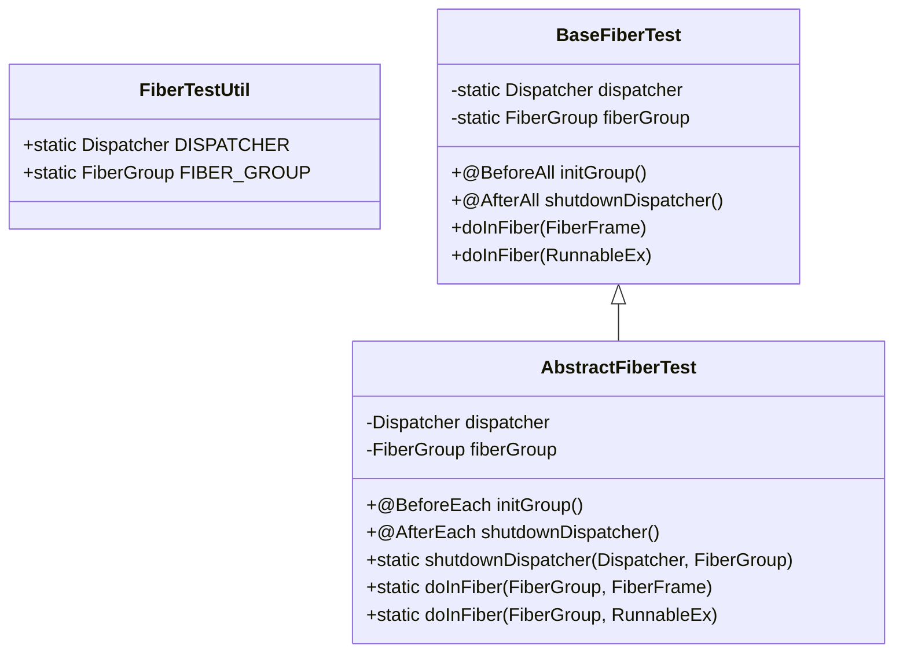
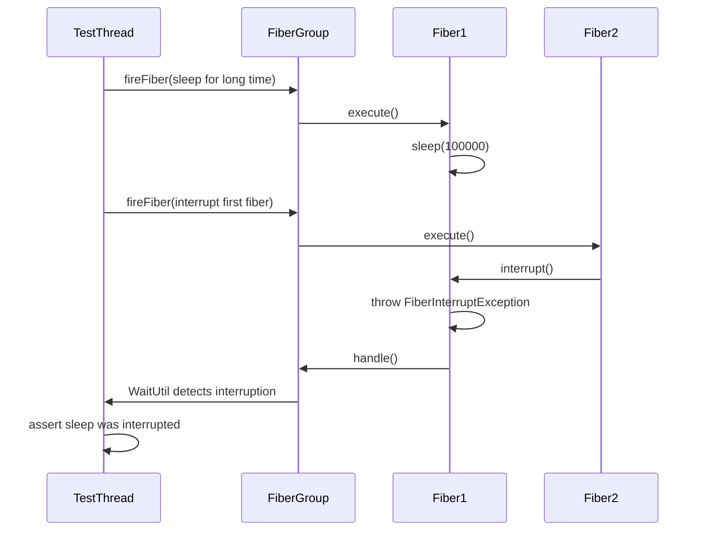
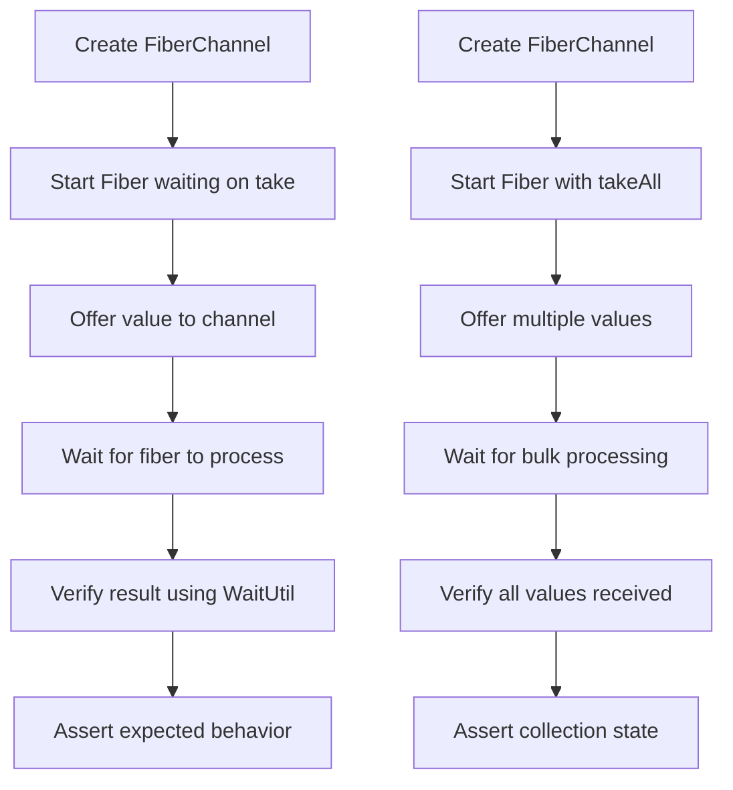
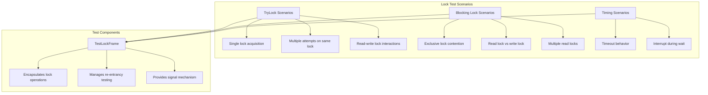

# Unit Testing Strategies

<cite>
**Referenced Files in This Document**   
- [DtJunitListener.java](file://test-support/src/main/java/com/github/dtprj/dongting/test/DtJunitListener.java)
- [Tick.java](file://test-support/src/main/java/com/github/dtprj/dongting/test/Tick.java)
- [WaitUtil.java](file://test-support/src/main/java/com/github/dtprj/dongting/test/WaitUtil.java)
- [FiberTestUtil.java](file://server/src/test/java/com/github/dtprj/dongting/fiber/FiberTestUtil.java)
- [BaseFiberTest.java](file://server/src/test/java/com/github/dtprj/dongting/fiber/BaseFiberTest.java)
- [AbstractFiberTest.java](file://server/src/test/java/com/github/dtprj/dongting/fiber/AbstractFiberTest.java)
- [ChannelTest.java](file://server/src/test/java/com/github/dtprj/dongting/fiber/ChannelTest.java)
- [FiberLifeCycleTest.java](file://server/src/test/java/com/github/dtprj/dongting/fiber/FiberLifeCycleTest.java)
- [SleepTest.java](file://server/src/test/java/com/github/dtprj/dongting/fiber/SleepTest.java)
- [YieldTest.java](file://server/src/test/java/com/github/dtprj/dongting/fiber/YieldTest.java)
- [LockTest.java](file://server/src/test/java/com/github/dtprj/dongting/fiber/LockTest.java)
- [JoinTest.java](file://server/src/test/java/com/github/dtprj/dongting/fiber/JoinTest.java)
</cite>

## Table of Contents
1. [Introduction](#introduction)
2. [Test Utilities Overview](#test-utilities-overview)
3. [Fiber-Based Concurrency Testing](#fiber-based-concurrency-testing)
4. [Synchronization and Time Simulation](#synchronization-and-time-simulation)
5. [Fiber Communication Testing](#fiber-communication-testing)
6. [Concurrency Pattern Testing](#concurrency-pattern-testing)
7. [Best Practices and Common Pitfalls](#best-practices-and-common-pitfalls)
8. [Conclusion](#conclusion)

## Introduction
This document provides comprehensive guidance on unit testing strategies in the Dongting framework, with a specific focus on asynchronous and fiber-based code. The Dongting framework implements a fiber-based concurrency model that requires specialized testing approaches to ensure reliability and determinism. This documentation covers the essential test utilities, testing patterns for fiber concurrency, and best practices for writing effective tests in a concurrent environment. The analysis is based on actual test implementations within the codebase, particularly in the fiber module, which serves as the foundation for Dongting's asynchronous programming model.

## Test Utilities Overview

The Dongting framework provides several specialized test utilities to support testing of asynchronous and fiber-based code. These utilities address the unique challenges of testing concurrent systems, including synchronization, time simulation, and test lifecycle management.

### DtJunitListener for Test Lifecycle Management
The `DtJunitListener` class implements JUnit's `TestExecutionListener` interface to provide detailed test execution monitoring and logging. This utility enhances test visibility by logging the start and completion of each test method, along with execution duration and result status. The listener captures test method names and displays them in a readable format, making it easier to identify which tests are executing and their performance characteristics. This is particularly valuable for debugging test failures and analyzing test execution patterns in complex asynchronous scenarios.

**Section sources**
- [DtJunitListener.java](file://test-support/src/main/java/com/github/dtprj/dongting/test/DtJunitListener.java#L29-L62)

### Tick for Time Simulation
The `Tick` utility class provides a mechanism for time scaling in tests, allowing developers to adjust timing parameters based on a configurable multiplier. This is implemented through a system property named "tick" with a default value of 1. The `tick()` methods multiply input values by this factor, enabling tests to adapt to different execution environments. This utility is particularly useful for making tests more resilient to timing variations across different hardware or CI/CD environments, while maintaining the ability to adjust timing sensitivity when needed.

**Section sources**
- [Tick.java](file://test-support/src/main/java/com/github/dtprj/dongting/test/Tick.java#L21-L31)

### WaitUtil for Synchronization
The `WaitUtil` class provides robust synchronization mechanisms for testing asynchronous code. It offers multiple overloaded `waitUtil()` methods that poll for conditions to be met within a specified timeout period. The utility can wait for boolean conditions or specific object values, with configurable timeouts and support for executing condition checks within specific executors. This is essential for testing fiber-based code where operations complete asynchronously, allowing tests to wait for expected states without introducing brittle sleep-based delays. The implementation includes proper exception handling and detailed failure messages that include expected values, actual values, and timeout information.

**Section sources**
- [WaitUtil.java](file://test-support/src/main/java/com/github/dtprj/dongting/test/WaitUtil.java#L29-L93)

## Fiber-Based Concurrency Testing

Testing fiber-based concurrency in Dongting requires specialized approaches due to the cooperative multitasking nature of fibers. The framework provides several base test classes and utilities that establish the necessary infrastructure for testing fiber operations.

### Test Infrastructure Setup
The testing framework includes multiple base classes that handle the setup and teardown of fiber infrastructure. `FiberTestUtil` provides static instances of `Dispatcher` and `FiberGroup` that are initialized once for all tests, optimizing test execution time. `BaseFiberTest` and `AbstractFiberTest` provide JUnit lifecycle methods that create and destroy dispatcher and fiber group instances for each test or test class. These base classes ensure proper initialization of the fiber execution environment and graceful shutdown, including verification that fiber groups have properly terminated.

**Diagram sources**
- [FiberTestUtil.java](file://server/src/test/java/com/github/dtprj/dongting/fiber/FiberTestUtil.java#L21-L36)
- [BaseFiberTest.java](file://server/src/test/java/com/github/dtprj/dongting/fiber/BaseFiberTest.java#L27-L51)
- [AbstractFiberTest.java](file://server/src/test/java/com/github/dtprj/dongting/fiber/AbstractFiberTest.java#L36-L133)

**Section sources**
- [FiberTestUtil.java](file://server/src/test/java/com/github/dtprj/dongting/fiber/FiberTestUtil.java#L21-L36)
- [BaseFiberTest.java](file://server/src/test/java/com/github/dtprj/dongting/fiber/BaseFiberTest.java#L27-L51)
- [AbstractFiberTest.java](file://server/src/test/java/com/github/dtprj/dongting/fiber/AbstractFiberTest.java#L36-L133)

### Fiber Lifecycle Testing
The `FiberLifeCycleTest` class demonstrates testing of fiber lifecycle operations, including dispatcher shutdown, daemon fibers, and group shutdown coordination. These tests verify that fibers respond appropriately to shutdown signals and that resource cleanup occurs correctly. The tests use `CountDownLatch` and atomic flags to coordinate between test threads and fiber execution, ensuring that lifecycle events are properly observed and validated.

**Section sources**
- [FiberLifeCycleTest.java](file://server/src/test/java/com/github/dtprj/dongting/fiber/FiberLifeCycleTest.java#L27-L70)

## Synchronization and Time Simulation

Effective testing of asynchronous code requires careful handling of timing and synchronization to avoid flaky tests while ensuring thorough validation of concurrent behavior.

### Sleep and Timing Operations
The `SleepTest` class validates fiber sleep operations and interruption handling. These tests verify that fibers can be interrupted during sleep operations and that appropriate exceptions are thrown. The tests also validate the `sleepUntilShouldStop` method, which allows fibers to sleep until their fiber group is requested to shut down. This pattern is commonly used in long-running fiber operations that need to respond to graceful shutdown signals.

**Diagram sources**
- [SleepTest.java](file://server/src/test/java/com/github/dtprj/dongting/fiber/SleepTest.java#L28-L123)

**Section sources**
- [SleepTest.java](file://server/src/test/java/com/github/dtprj/dongting/fiber/SleepTest.java#L28-L123)

### Cooperative Scheduling
The `YieldTest` demonstrates testing of cooperative scheduling through the `yield` operation. This test verifies that when a fiber yields control, other fibers in the same group have an opportunity to execute. The test uses atomic counters and CompletableFuture to coordinate between multiple fibers, ensuring that the yielding fiber properly relinquishes control and that the scheduler correctly resumes execution of other pending fibers.

**Section sources**
- [YieldTest.java](file://server/src/test/java/com/github/dtprj/dongting/fiber/YieldTest.java#L27-L51)

## Fiber Communication Testing

The Dongting framework provides fiber-safe communication mechanisms that require specialized testing approaches to validate their behavior in concurrent scenarios.

### FiberChannel Testing
The `ChannelTest` class provides comprehensive validation of the `FiberChannel` implementation, which enables communication between fibers. The tests cover various scenarios including basic take/offer operations, bulk operations with `takeAll`, and timing characteristics of fiber wakeup. The tests use `WaitUtil` to synchronize between test assertions and fiber execution, ensuring that channel operations complete as expected. The `testWakeup` method specifically validates the responsiveness of the fiber scheduler by measuring the time between offering a value to a channel and the waiting fiber resuming execution.

**Diagram sources**
- [ChannelTest.java](file://server/src/test/java/com/github/dtprj/dongting/fiber/ChannelTest.java#L34-L145)

**Section sources**
- [ChannelTest.java](file://server/src/test/java/com/github/dtprj/dongting/fiber/ChannelTest.java#L34-L145)

## Concurrency Pattern Testing

The Dongting framework includes sophisticated concurrency primitives that require thorough testing to ensure correctness in multi-fiber scenarios.

### Locking Mechanisms
The `LockTest` class provides extensive validation of fiber-based locking mechanisms, including both exclusive locks (`FiberLock`) and read-write locks (`FiberReadLock`). The tests verify various locking patterns such as try-lock operations, re-entrancy, and interaction between read and write locks. The test framework uses a custom `TestLockFrame` class that encapsulates common locking patterns and provides methods for signaling between test threads and fibers. This approach allows testing of complex scenarios where multiple fibers contend for locks, with precise control over the timing of lock acquisition and release.

**Diagram sources**
- [LockTest.java](file://server/src/test/java/com/github/dtprj/dongting/fiber/LockTest.java#L28-L242)

**Section sources**
- [LockTest.java](file://server/src/test/java/com/github/dtprj/dongting/fiber/LockTest.java#L28-L242)

### Fiber Join Operations
The `JoinTest` class validates the fiber joining mechanism, which allows one fiber to wait for the completion of another. The tests cover different join patterns including direct joining, timed joins, and joining via `FiberFuture`. These tests verify that fibers can properly wait for each other's completion and handle interruption scenarios. The test uses `CompletableFuture` to coordinate between the test thread and fiber execution, ensuring that join operations complete within expected timeframes.

**Section sources**
- [JoinTest.java](file://server/src/test/java/com/github/dtprj/dongting/fiber/JoinTest.java#L27-L86)

## Best Practices and Common Pitfalls

Based on the analysis of Dongting's test codebase, several best practices emerge for testing asynchronous and fiber-based code, along with common pitfalls to avoid.

### Testing Best Practices
1. **Use dedicated synchronization utilities**: Leverage `WaitUtil` instead of fixed sleep intervals to make tests more reliable and responsive.
2. **Proper test lifecycle management**: Use base test classes like `AbstractFiberTest` to ensure proper setup and teardown of fiber infrastructure.
3. **Validate error handling**: Test both success and failure paths, including interruption and timeout scenarios.
4. **Test re-entrancy**: Verify that concurrency primitives correctly handle re-entrant access from the same fiber.
5. **Use atomic coordination primitives**: Employ `AtomicBoolean`, `AtomicReference`, and `CountDownLatch` for thread-safe coordination between test code and fibers.

### Common Pitfalls to Avoid
1. **Race conditions in test assertions**: Ensure that test assertions account for the asynchronous nature of fiber execution.
2. **Insufficient timeout handling**: Always provide reasonable timeouts for waiting operations to prevent hanging tests.
3. **Resource leaks**: Verify that all fibers and resources are properly cleaned up after tests complete.
4. **Over-reliance on timing**: Avoid tests that depend on precise timing, as these can be flaky across different environments.
5. **Inadequate error propagation**: Ensure that exceptions in fibers are properly propagated and handled in tests.

The test codebase demonstrates effective patterns for addressing these challenges, such as using `WaitUtil` for synchronization, proper exception handling in fiber frames, and comprehensive validation of fiber lifecycle events.

## Conclusion
The Dongting framework provides a comprehensive set of tools and patterns for testing asynchronous and fiber-based code. The test utilities like `DtJunitListener`, `Tick`, and `WaitUtil` address the fundamental challenges of testing concurrent systems, while the fiber testing infrastructure enables reliable validation of complex concurrency patterns. By following the demonstrated best practices and leveraging the provided testing utilities, developers can create robust, deterministic tests for fiber-based applications. The emphasis on proper synchronization, comprehensive error handling, and thorough validation of concurrency primitives ensures that Dongting applications can be thoroughly tested for reliability and correctness in concurrent environments.