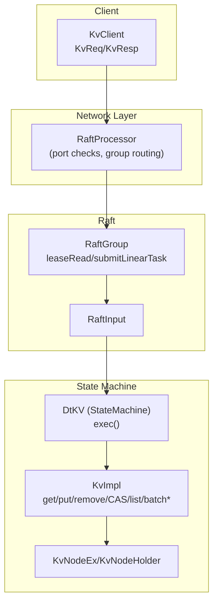
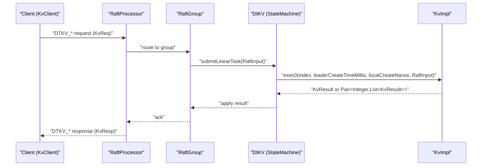
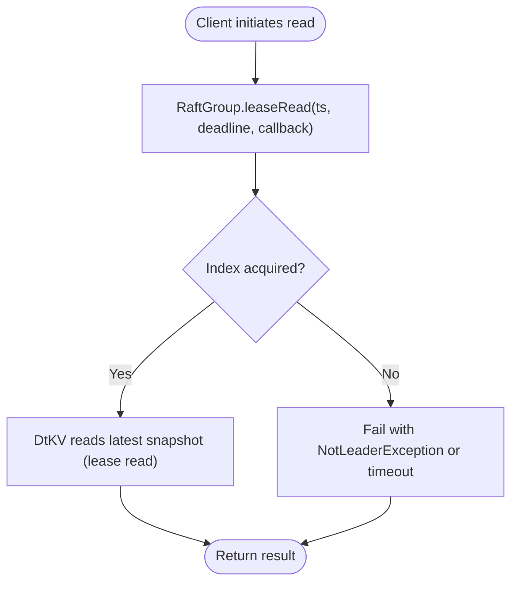
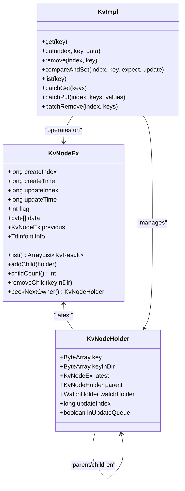
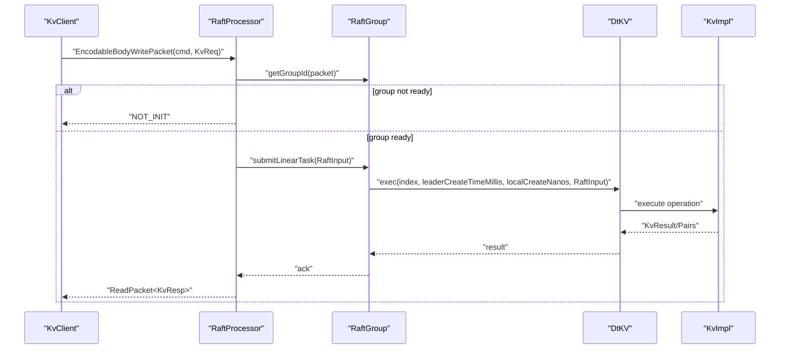
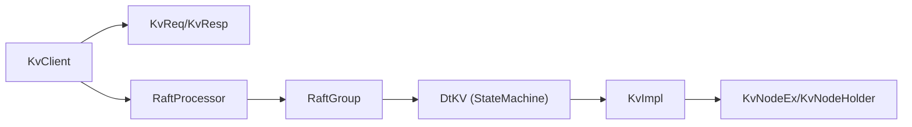

# Core K/V Operations

<cite>
**Referenced Files in This Document**
- [KvImpl.java](file://server/src/main/java/com/github/dtprj/dongting/dtkv/server/KvImpl.java)
- [KvNodeEx.java](file://server/src/main/java/com/github/dtprj/dongting/dtkv/server/KvNodeEx.java)
- [KvNodeHolder.java](file://server/src/main/java/com/github/dtprj/dongting/dtkv/server/KvNodeHolder.java)
- [DtKV.java](file://server/src/main/java/com/github/dtprj/dongting/dtkv/server/DtKV.java)
- [RaftInput.java](file://server/src/main/java/com/github/dtprj/dongting/raft/server/RaftInput.java)
- [RaftGroup.java](file://server/src/main/java/com/github/dtprj/dongting/raft/server/RaftGroup.java)
- [RaftProcessor.java](file://server/src/main/java/com/github/dtprj/dongting/raft/server/RaftProcessor.java)
- [KvClient.java](file://client/src/main/java/com/github/dtprj/dongting/dtkv/KvClient.java)
- [KvReq.java](file://client/src/main/java/com/github/dtprj/dongting/dtkv/KvReq.java)
- [KvResp.java](file://client/src/main/java/com/github/dtprj/dongting/dtkv/KvResp.java)
- [StandaloneDemoClient.java](file://demos/src/main/java/com/github/dtprj/dongting/demos/standalone/StandaloneDemoClient.java)
- [StandaloneDemoServer.java](file://demos/src/main/java/com/github/dtprj/dongting/demos/standalone/StandaloneDemoServer.java)
- [DemoClientBase.java](file://demos/src/main/java/com/github/dtprj/dongting/demos/base/DemoClientBase.java)
</cite>

## Table of Contents
1. [Introduction](#introduction)
2. [Project Structure](#project-structure)
3. [Core Components](#core-components)
4. [Architecture Overview](#architecture-overview)
5. [Detailed Component Analysis](#detailed-component-analysis)
6. [Dependency Analysis](#dependency-analysis)
7. [Performance Considerations](#performance-considerations)
8. [Troubleshooting Guide](#troubleshooting-guide)
9. [Conclusion](#conclusion)
10. [Appendices](#appendices)

## Introduction
This document explains the core key-value operations in DtKV: get, put, remove, compare-and-set (CAS), batch operations, and directory management (mkdir, list). It also details the linearizable consistency model, how operations are serialized through the RAFT consensus log, the tree-based hierarchical namespace and path resolution, and the request/response flow from client to server. It includes examples of basic usage patterns from the demos and explains the role of RaftInput in command submission and how operations are applied to the state machine.

## Project Structure
The core logic resides in the server-side KV implementation and the RAFT state machine integration. The client exposes synchronous and asynchronous APIs for all operations. Demos illustrate basic usage patterns.

**Diagram sources**
- [KvClient.java](file://client/src/main/java/com/github/dtprj/dongting/dtkv/KvClient.java#L1-L200)
- [RaftProcessor.java](file://server/src/main/java/com/github/dtprj/dongting/raft/server/RaftProcessor.java#L1-L166)
- [RaftGroup.java](file://server/src/main/java/com/github/dtprj/dongting/raft/server/RaftGroup.java#L1-L106)
- [RaftInput.java](file://server/src/main/java/com/github/dtprj/dongting/raft/server/RaftInput.java#L1-L100)
- [DtKV.java](file://server/src/main/java/com/github/dtprj/dongting/dtkv/server/DtKV.java#L135-L216)
- [KvImpl.java](file://server/src/main/java/com/github/dtprj/dongting/dtkv/server/KvImpl.java#L235-L336)

**Section sources**
- [KvClient.java](file://client/src/main/java/com/github/dtprj/dongting/dtkv/KvClient.java#L1-L200)
- [RaftProcessor.java](file://server/src/main/java/com/github/dtprj/dongting/raft/server/RaftProcessor.java#L1-L166)
- [RaftGroup.java](file://server/src/main/java/com/github/dtprj/dongting/raft/server/RaftGroup.java#L1-L106)
- [RaftInput.java](file://server/src/main/java/com/github/dtprj/dongting/raft/server/RaftInput.java#L1-L100)
- [DtKV.java](file://server/src/main/java/com/github/dtprj/dongting/dtkv/server/DtKV.java#L135-L216)
- [KvImpl.java](file://server/src/main/java/com/github/dtprj/dongting/dtkv/server/KvImpl.java#L235-L336)

## Core Components
- KvImpl: Implements all core operations (get, put, remove, compareAndSet, list, mkdir, batchGet, batchPut, batchRemove) with a tree-based namespace and concurrency control.
- KvNodeEx/KvNodeHolder: Represent nodes and their hierarchical relationships, including directory semantics and lock ordering.
- DtKV: The RAFT state machine that applies commands submitted via RaftInput and executes them in order.
- KvClient: Client API exposing synchronous and asynchronous operations for all K/V operations, including batch and CAS.

**Section sources**
- [KvImpl.java](file://server/src/main/java/com/github/dtprj/dongting/dtkv/server/KvImpl.java#L235-L336)
- [KvNodeEx.java](file://server/src/main/java/com/github/dtprj/dongting/dtkv/server/KvNodeEx.java#L1-L108)
- [KvNodeHolder.java](file://server/src/main/java/com/github/dtprj/dongting/dtkv/server/KvNodeHolder.java#L1-L42)
- [DtKV.java](file://server/src/main/java/com/github/dtprj/dongting/dtkv/server/DtKV.java#L135-L216)
- [KvClient.java](file://client/src/main/java/com/github/dtprj/dongting/dtkv/KvClient.java#L228-L485)

## Architecture Overview
DtKV uses RAFT for consensus. Writes are submitted as linear tasks and applied to the state machine in log order. Reads leverage lease-based linearizable reads for performance. The state machine (DtKV) delegates to KvImpl for all data operations.

**Diagram sources**
- [RaftProcessor.java](file://server/src/main/java/com/github/dtprj/dongting/raft/server/RaftProcessor.java#L106-L131)
- [RaftGroup.java](file://server/src/main/java/com/github/dtprj/dongting/raft/server/RaftGroup.java#L35-L53)
- [RaftInput.java](file://server/src/main/java/com/github/dtprj/dongting/raft/server/RaftInput.java#L38-L81)
- [DtKV.java](file://server/src/main/java/com/github/dtprj/dongting/dtkv/server/DtKV.java#L151-L216)
- [KvImpl.java](file://server/src/main/java/com/github/dtprj/dongting/dtkv/server/KvImpl.java#L390-L431)

## Detailed Component Analysis

### Linearizable Consistency Model and Lease Read
- Lease read is linearizable. The RaftGroup interface documents that leaseRead returns a read index and that lease read is linearizable. The DtKV implementation notes that it performs lease read and reads the latest snapshot for simplicity, which does not violate linearizability.
- Lease computation ensures safety by selecting a time window based on quorum timestamps.

**Diagram sources**
- [RaftGroup.java](file://server/src/main/java/com/github/dtprj/dongting/raft/server/RaftGroup.java#L38-L53)
- [DtKV.java](file://server/src/main/java/com/github/dtprj/dongting/dtkv/server/DtKV.java#L218-L263)

**Section sources**
- [RaftGroup.java](file://server/src/main/java/com/github/dtprj/dongting/raft/server/RaftGroup.java#L38-L53)
- [DtKV.java](file://server/src/main/java/com/github/dtprj/dongting/dtkv/server/DtKV.java#L218-L263)

### Tree-Based Hierarchical Namespace and Path Resolution
- Root directory is represented by an empty key.
- Keys use a dot separator to form a hierarchical path. Parent resolution is performed by finding the last occurrence of the separator and resolving the parent directory.
- Directory semantics: directories are nodes with a directory flag and maintain a child map; non-directory nodes hold data.
- Lock ordering: directories with the lock flag maintain a sorted queue of potential owners.

**Diagram sources**
- [KvNodeEx.java](file://server/src/main/java/com/github/dtprj/dongting/dtkv/server/KvNodeEx.java#L1-L108)
- [KvNodeHolder.java](file://server/src/main/java/com/github/dtprj/dongting/dtkv/server/KvNodeHolder.java#L1-L42)
- [KvImpl.java](file://server/src/main/java/com/github/dtprj/dongting/dtkv/server/KvImpl.java#L235-L336)

**Section sources**
- [KvNodeEx.java](file://server/src/main/java/com/github/dtprj/dongting/dtkv/server/KvNodeEx.java#L1-L108)
- [KvNodeHolder.java](file://server/src/main/java/com/github/dtprj/dongting/dtkv/server/KvNodeHolder.java#L1-L42)
- [KvImpl.java](file://server/src/main/java/com/github/dtprj/dongting/dtkv/server/KvImpl.java#L235-L336)

### Core Operations: get, put, remove, compareAndSet

#### Get
- Validates key, resolves optimistic read, and returns the latest node if present and not removed.
- Supports root node when key is empty or null.

**Section sources**
- [KvImpl.java](file://server/src/main/java/com/github/dtprj/dongting/dtkv/server/KvImpl.java#L235-L270)

#### Put
- Validates key and value sizes, checks parent existence and type, and updates or creates nodes.
- Handles directory creation and value updates, with TTL initialization and lock-related behavior.
- Uses a write lock and updates parent chain and watch notifications.

**Section sources**
- [KvImpl.java](file://server/src/main/java/com/github/dtprj/dongting/dtkv/server/KvImpl.java#L390-L431)
- [KvImpl.java](file://server/src/main/java/com/github/dtprj/dongting/dtkv/server/KvImpl.java#L433-L517)

#### Remove
- Validates key, checks existence and ownership (for temporary nodes), ensures no children, and marks removal with a tombstone.
- Updates parent chain and TTL manager.

**Section sources**
- [KvImpl.java](file://server/src/main/java/com/github/dtprj/dongting/dtkv/server/KvImpl.java#L662-L717)

#### CompareAndSet
- Supports CAS with expected value semantics; can create if expected is absent or delete if new value is absent.
- Enforces parent checks and node existence rules.

**Section sources**
- [KvImpl.java](file://server/src/main/java/com/github/dtprj/dongting/dtkv/server/KvImpl.java#L738-L800)

### Batch Operations
- batchGet: Performs a batch read across multiple keys with a single read lock acquisition.
- batchPut: Performs a batch write with a single write lock acquisition.
- batchRemove: Performs a batch delete with a single write lock acquisition.

**Section sources**
- [KvImpl.java](file://server/src/main/java/com/github/dtprj/dongting/dtkv/server/KvImpl.java#L278-L300)
- [KvImpl.java](file://server/src/main/java/com/github/dtprj/dongting/dtkv/server/KvImpl.java#L529-L549)
- [KvImpl.java](file://server/src/main/java/com/github/dtprj/dongting/dtkv/server/KvImpl.java#L719-L736)

### Directory Management: mkdir, list
- mkdir: Creates a directory node; returns success or directory exists depending on whether it already exists.
- list: Lists immediate children of a directory node; validates directory type and returns child metadata.

**Section sources**
- [KvImpl.java](file://server/src/main/java/com/github/dtprj/dongting/dtkv/server/KvImpl.java#L308-L336)

### Request/Response Flow and Error Handling
- Client sends commands (e.g., PUT, GET, REMOVE, MKDIR, LIST, BATCH_*), and receives responses with biz codes.
- Errors are mapped to exceptions or returned biz codes; clients handle timeouts and network errors.
- Server-side RaftProcessor validates ports, group readiness, and leader status; returns appropriate error responses.

**Diagram sources**
- [KvClient.java](file://client/src/main/java/com/github/dtprj/dongting/dtkv/KvClient.java#L132-L181)
- [RaftProcessor.java](file://server/src/main/java/com/github/dtprj/dongting/raft/server/RaftProcessor.java#L106-L131)
- [RaftGroup.java](file://server/src/main/java/com/github/dtprj/dongting/raft/server/RaftGroup.java#L35-L53)
- [DtKV.java](file://server/src/main/java/com/github/dtprj/dongting/dtkv/server/DtKV.java#L151-L216)
- [KvResp.java](file://client/src/main/java/com/github/dtprj/dongting/dtkv/KvResp.java#L1-L122)

**Section sources**
- [KvClient.java](file://client/src/main/java/com/github/dtprj/dongting/dtkv/KvClient.java#L132-L181)
- [RaftProcessor.java](file://server/src/main/java/com/github/dtprj/dongting/raft/server/RaftProcessor.java#L106-L131)
- [KvResp.java](file://client/src/main/java/com/github/dtprj/dongting/dtkv/KvResp.java#L1-L122)

### Role of RaftInput in Command Submission
- RaftInput encapsulates the business type, body, deadline, and read-only flag for each command.
- Commands are submitted to RaftGroup as linear tasks; the state machine executes them in log order.

**Section sources**
- [RaftInput.java](file://server/src/main/java/com/github/dtprj/dongting/raft/server/RaftInput.java#L38-L81)
- [RaftGroup.java](file://server/src/main/java/com/github/dtprj/dongting/raft/server/RaftGroup.java#L35-L53)
- [DtKV.java](file://server/src/main/java/com/github/dtprj/dongting/dtkv/server/DtKV.java#L151-L216)

### How Operations Are Applied to the State Machine
- The state machine’s exec method initializes the operation context and delegates to KvImpl based on bizType.
- Results are returned to the RAFT layer and then propagated back to the client.

**Section sources**
- [DtKV.java](file://server/src/main/java/com/github/dtprj/dongting/dtkv/server/DtKV.java#L151-L216)
- [KvImpl.java](file://server/src/main/java/com/github/dtprj/dongting/dtkv/server/KvImpl.java#L390-L431)

### Examples of Basic Usage Patterns (from demos)
- The standalone demos show synchronous put/get loops and demonstrate basic usage of the client API.

**Section sources**
- [StandaloneDemoClient.java](file://demos/src/main/java/com/github/dtprj/dongting/demos/standalone/StandaloneDemoClient.java#L31-L38)
- [DemoClientBase.java](file://demos/src/main/java/com/github/dtprj/dongting/demos/base/DemoClientBase.java#L35-L84)

## Dependency Analysis
- Client depends on RaftClient for transport and uses KvReq/KvResp for encoding/decoding.
- Server-side RaftProcessor validates requests and routes to the correct RaftGroup.
- DtKV implements StateMachine and delegates to KvImpl for all operations.
- KvImpl manages the in-memory tree of nodes and enforces namespace rules.

**Diagram sources**
- [KvClient.java](file://client/src/main/java/com/github/dtprj/dongting/dtkv/KvClient.java#L1-L200)
- [RaftProcessor.java](file://server/src/main/java/com/github/dtprj/dongting/raft/server/RaftProcessor.java#L106-L131)
- [RaftGroup.java](file://server/src/main/java/com/github/dtprj/dongting/raft/server/RaftGroup.java#L35-L53)
- [DtKV.java](file://server/src/main/java/com/github/dtprj/dongting/dtkv/server/DtKV.java#L135-L216)
- [KvImpl.java](file://server/src/main/java/com/github/dtprj/dongting/dtkv/server/KvImpl.java#L235-L336)

**Section sources**
- [KvClient.java](file://client/src/main/java/com/github/dtprj/dongting/dtkv/KvClient.java#L1-L200)
- [RaftProcessor.java](file://server/src/main/java/com/github/dtprj/dongting/raft/server/RaftProcessor.java#L106-L131)
- [RaftGroup.java](file://server/src/main/java/com/github/dtprj/dongting/raft/server/RaftGroup.java#L35-L53)
- [DtKV.java](file://server/src/main/java/com/github/dtprj/dongting/dtkv/server/DtKV.java#L135-L216)
- [KvImpl.java](file://server/src/main/java/com/github/dtprj/dongting/dtkv/server/KvImpl.java#L235-L336)

## Performance Considerations
- Lease read enables linearizable reads without waiting for commit, improving latency.
- Batch operations reduce lock contention by acquiring locks once per batch.
- Optimistic read combined with validation reduces write lock overhead for reads.

[No sources needed since this section provides general guidance]

## Troubleshooting Guide
Common error scenarios and their handling:
- Key not found: Returned as a specific biz code; clients should handle it gracefully.
- Permission denied (not owner): Applies to temporary nodes; only the creator can modify or remove.
- Parent directory not exists or not a directory: Validation prevents invalid writes.
- CAS mismatch: Expected value does not match current value.
- Has children: Cannot remove a non-empty directory.

**Section sources**
- [KvImpl.java](file://server/src/main/java/com/github/dtprj/dongting/dtkv/server/KvImpl.java#L92-L159)
- [KvImpl.java](file://server/src/main/java/com/github/dtprj/dongting/dtkv/server/KvImpl.java#L161-L190)
- [KvImpl.java](file://server/src/main/java/com/github/dtprj/dongting/dtkv/server/KvImpl.java#L662-L717)
- [KvImpl.java](file://server/src/main/java/com/github/dtprj/dongting/dtkv/server/KvImpl.java#L738-L800)

## Conclusion
DtKV provides a robust, linearizable key-value store built on RAFT. Its state machine applies commands in log order, while client-side lease reads deliver low-latency linearizable reads. The tree-based namespace supports hierarchical keys and directory semantics, with batch operations and CAS enabling efficient and safe concurrent updates. The demos illustrate straightforward usage patterns for basic operations.

## Appendices

### Appendix A: Client API Highlights
- Synchronous and asynchronous methods for get, put, remove, mkdir, list, batchGet, batchPut, batchRemove, compareAndSet, and TTL updates.
- Error mapping and timeout handling are integrated into the client.

**Section sources**
- [KvClient.java](file://client/src/main/java/com/github/dtprj/dongting/dtkv/KvClient.java#L228-L485)
- [KvClient.java](file://client/src/main/java/com/github/dtprj/dongting/dtkv/KvClient.java#L132-L181)

### Appendix B: Encoding/Decoding Contracts
- KvReq/KvResp define protobuf-based encoding/decoding for requests and responses.

**Section sources**
- [KvReq.java](file://client/src/main/java/com/github/dtprj/dongting/dtkv/KvReq.java#L1-L170)
- [KvResp.java](file://client/src/main/java/com/github/dtprj/dongting/dtkv/KvResp.java#L1-L122)