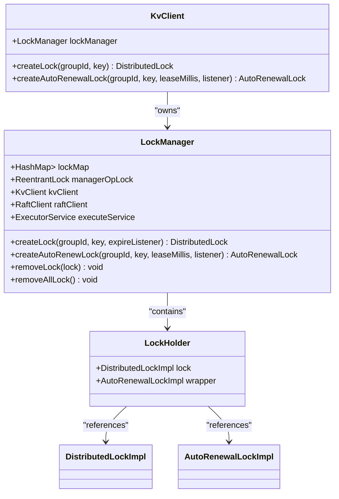
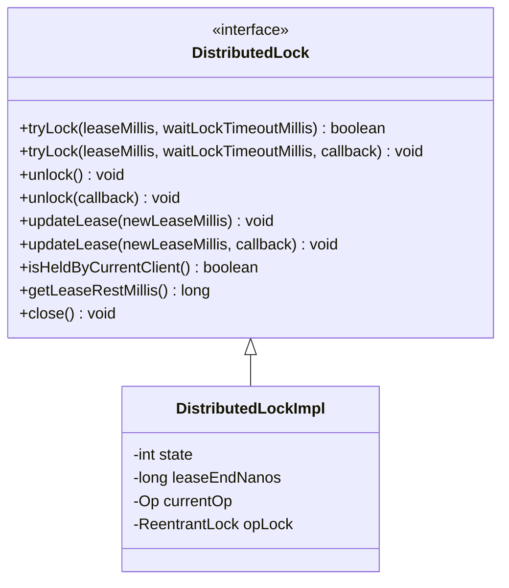
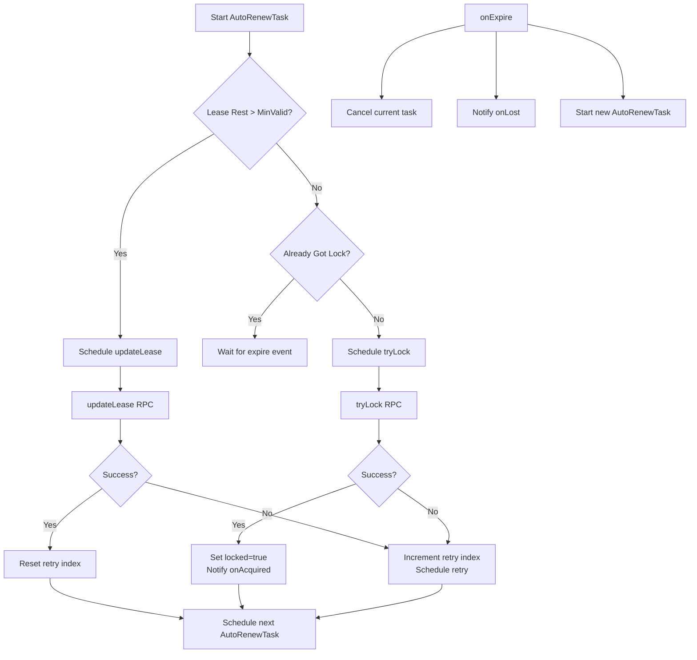
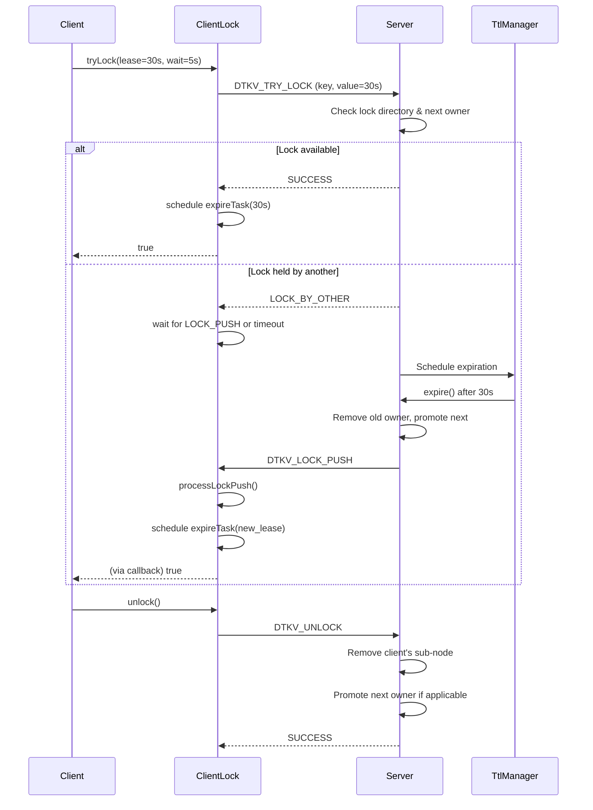
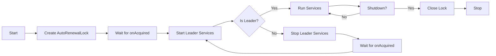

# Distributed Locking

<cite>
**Referenced Files in This Document**   
- [LockManager.java](file://client/src/main/java/com/github/dtprj/dongting/dtkv/LockManager.java)
- [DistributedLock.java](file://client/src/main/java/com/github/dtprj/dongting/dtkv/DistributedLock.java)
- [DistributedLockImpl.java](file://client/src/main/java/com/github/dtprj/dongting/dtkv/DistributedLockImpl.java)
- [AutoRenewalLock.java](file://client/src/main/java/com/github/dtprj/dongting/dtkv/AutoRenewalLock.java)
- [AutoRenewalLockImpl.java](file://client/src/main/java/com/github/dtprj/dongting/dtkv/AutoRenewalLockImpl.java)
- [KvClient.java](file://client/src/main/java/com/github/dtprj/dongting/dtkv/KvClient.java)
- [KvImpl.java](file://server/src/main/java/com/github/dtprj/dongting/dtkv/server/KvImpl.java)
- [KvServerUtil.java](file://server/src/main/java/com/github/dtprj/dongting/dtkv/server/KvServerUtil.java)
- [KvCodes.java](file://client/src/main/java/com/github/dtprj/dongting/dtkv/KvCodes.java)
- [LockDemoClient.java](file://demos/src/main/java/com/github/dtprj/dongting/demos/lock/LockDemoClient.java)
- [AutoRenewalLockDemoClient1.java](file://demos/src/main/java/com/github/dtprj/dongting/demos/lock/AutoRenewalLockDemoClient1.java)
- [DistributedLockImplTest.java](file://server/src/test/java/com/github/dtprj/dongting/dtkv/server/DistributedLockImplTest.java)
- [AutoRenewalLockImplTest.java](file://server/src/test/java/com/github/dtprj/dongting/dtkv/server/AutoRenewalLockImplTest.java)
</cite>

## Table of Contents
1. [Introduction](#introduction)
2. [Lock Representation and Key Hierarchy](#lock-representation-and-key-hierarchy)
3. [LockManager and Lock Lifecycle](#lockmanager-and-lock-lifecycle)
4. [DistributedLock Interface](#distributedlock-interface)
5. [AutoRenewalLock Implementation](#autorenewallock-implementation)
6. [Lock Acquisition and Release Workflow](#lock-acquisition-and-release-workflow)
7. [Failure Scenarios and Resilience](#failure-scenarios-and-resilience)
8. [Timeout Handling and Deadlock Prevention](#timeout-handling-and-deadlock-prevention)
9. [Performance Considerations](#performance-considerations)
10. [Usage Examples](#usage-examples)
11. [Conclusion](#conclusion)

## Introduction
DtKV provides a robust distributed locking mechanism designed for high availability and consistency in distributed systems. The system offers two primary lock types: manual locks and auto-renewal locks, both built on the Raft consensus algorithm to ensure linearizability and fault tolerance. Manual locks require explicit lease management by the client, while auto-renewal locks provide automatic heartbeat renewal to prevent premature expiration, making them ideal for leader election scenarios. This document details the implementation of these locking mechanisms, including the `LockManager`, the `DistributedLock` interface, and the ephemeral node representation in the key-value hierarchy. The analysis covers failure scenarios, timeout handling, deadlock prevention, and performance considerations for high-concurrency environments.

## Lock Representation and Key Hierarchy
In DtKV, distributed locks are implemented as ephemeral nodes within the key-value hierarchy, leveraging the system's TTL (Time-To-Live) mechanism to ensure automatic cleanup upon client failure. A lock is represented as a directory node in the key space, with its path determined by the user-provided key. For example, a lock with the key "my-service/leader" creates a directory at that path. The actual ownership is managed through a sub-node within this directory, constructed using a unique identifier for the client. The `KvServerUtil.buildLockKey` method combines the parent directory key with the client's UUID (most and least significant bits) to form the full key for the ephemeral lock node. This design ensures that only the client that created the lock can modify or delete its specific sub-node. The parent directory acts as a container for the lock, and its existence signifies that a lock operation is in progress. When a client acquires a lock, it creates this ephemeral sub-node with a TTL corresponding to the lease time. The server's `TtlManager` is responsible for monitoring these TTLs and automatically expiring the nodes when their lease expires, which triggers the release of the lock and allows the next waiting client to acquire it.

**Section sources**
- [KvImpl.java](file://server/src/main/java/com/github/dtprj/dongting/dtkv/server/KvImpl.java#L1028-L1052)
- [KvServerUtil.java](file://server/src/main/java/com/github/dtprj/dongting/dtkv/server/KvServerUtil.java#L1-L20)
- [DistributedLockImpl.java](file://client/src/main/java/com/github/dtprj/dongting/dtkv/DistributedLockImpl.java#L403-L409)

## LockManager and Lock Lifecycle
The `LockManager` class is the central coordinator for all distributed locks within a `KvClient` instance. It maintains a thread-safe `HashMap` structure that maps from a Raft group ID and a key to a `LockHolder`, which contains both the `DistributedLockImpl` and an optional `AutoRenewalLockImpl` wrapper. This ensures that only one lock instance exists per key within a client, preventing accidental duplication. The `LockManager` uses a `ReentrantLock` (`managerOpLock`) to synchronize access to its internal state during lock creation and removal. When a client requests a new lock via `createLock` or `createAutoRenewLock`, the `LockManager` first checks if a lock for that key already exists; if so, it throws an `IllegalStateException`. Upon successful creation, the lock is registered in the map. The lifecycle of a lock is managed through the `close()` method. When a lock is closed, the `LockManager`'s `removeLock` method is called, which safely removes the lock from the internal map and initiates the cleanup process. For auto-renewal locks, closing also stops the background renewal task. The `removeAllLock` method is called when the `KvClient` is stopped, ensuring all locks are properly cleaned up.

**Diagram sources **
- [LockManager.java](file://client/src/main/java/com/github/dtprj/dongting/dtkv/LockManager.java#L38-L175)
- [KvClient.java](file://client/src/main/java/com/github/dtprj/dongting/dtkv/KvClient.java#L58-L78)

**Section sources**
- [LockManager.java](file://client/src/main/java/com/github/dtprj/dongting/dtkv/LockManager.java#L38-L175)
- [KvClient.java](file://client/src/main/java/com/github/dtprj/dongting/dtkv/KvClient.java#L697-L740)

## DistributedLock Interface
The `DistributedLock` interface defines the core operations for managing a manual distributed lock. It provides both synchronous and asynchronous methods for acquiring, releasing, and renewing the lease of a lock. The primary method is `tryLock`, which attempts to acquire the lock with a specified lease time and a maximum wait time. The lease time, measured from the client side, determines how long the client will hold the lock before it expires. The wait time specifies how long the client will block (in the synchronous version) or wait for a callback (in the asynchronous version) if the lock is currently held by another client. If the wait time is zero, the method returns immediately with a failure if the lock is not available. The `unlock` method releases the lock, and if the client is not the current owner, it does nothing. The `updateLease` method allows a client to extend its lease time before it expires, which is crucial for long-running operations. The interface also provides `isHeldByCurrentClient()` and `getLeaseRestMillis()` methods to query the current state of the lock without making a network call, relying on local state tracking. All operations are serialized per lock instance to prevent race conditions, and attempting concurrent operations will throw an `IllegalStateException`.

**Diagram sources **
- [DistributedLock.java](file://client/src/main/java/com/github/dtprj/dongting/dtkv/DistributedLock.java#L31-L153)
- [DistributedLockImpl.java](file://client/src/main/java/com/github/dtprj/dongting/dtkv/DistributedLockImpl.java#L45-L652)

**Section sources**
- [DistributedLock.java](file://client/src/main/java/com/github/dtprj/dongting/dtkv/DistributedLock.java#L31-L153)
- [DistributedLockImpl.java](file://client/src/main/java/com/github/dtprj/dongting/dtkv/DistributedLockImpl.java#L338-L578)

## AutoRenewalLock Implementation
The `AutoRenewalLock` is designed for scenarios like leader election, where a client needs to maintain ownership of a lock indefinitely. It wraps a `DistributedLockImpl` and manages the lease renewal process automatically in the background. The implementation uses a state machine driven by a background task (`AutoRenewTask`). The task periodically checks the remaining lease time of the underlying lock. If the remaining time is greater than a configured minimum threshold (`autoRenewalMinValidLeaseMillis`), it schedules an `updateLease` operation. If the lease is near expiration, it attempts to `tryLock` again to acquire the lock. This ensures that the lock is either renewed or re-acquired seamlessly. The `AutoRenewTask` handles network failures and other exceptions by implementing an exponential backoff retry strategy, defined by the `autoRenewalRetryMillis` configuration array. When the lock is acquired or lost, the `AutoRenewalLock` notifies the user via an `AutoRenewalLockListener`, which provides `onAcquired()` and `onLost()` callbacks. The state transitions (locked/unlocked) are managed carefully to ensure that the listener is called exactly once per state change, even in the presence of network flakiness. The `expireListener` of the underlying `DistributedLockImpl` is set to the `onExpire` method of the `AutoRenewalLockImpl`, which triggers the re-acquisition process when the lease expires.

**Diagram sources **
- [AutoRenewalLockImpl.java](file://client/src/main/java/com/github/dtprj/dongting/dtkv/AutoRenewalLockImpl.java#L30-L228)
- [AutoRenewalLock.java](file://client/src/main/java/com/github/dtprj/dongting/dtkv/AutoRenewalLock.java#L34-L67)

**Section sources**
- [AutoRenewalLockImpl.java](file://client/src/main/java/com/github/dtprj/dongting/dtkv/AutoRenewalLockImpl.java#L30-L228)
- [AutoRenewalLock.java](file://client/src/main/java/com/github/dtprj/dongting/dtkv/AutoRenewalLock.java#L34-L67)

## Lock Acquisition and Release Workflow
The lock acquisition and release process involves a coordinated interaction between the client and the server, using the Raft consensus algorithm to ensure consistency. When a client calls `tryLock`, the `DistributedLockImpl` creates a `KvReq` object containing the key and a value that encodes the lease time (as a long) along with the lock's internal `lockId` and `opId` for request tracking. This request is sent as a `DTKV_TRY_LOCK` command to the Raft leader. On the server side, the `KvImpl.tryLock` method first creates the parent lock directory (if it doesn't exist) and then attempts to create the ephemeral sub-node for the client. The server checks if there is already a "next owner" for the lock directory. If there is, and it's not the current client, the server returns a `LOCK_BY_OTHER` code. If the client is the next owner, it returns `LOCK_BY_SELF`. If there is no current owner, the client becomes the owner, and the server returns `SUCCESS`. The client receives this response and, if successful, schedules a local timer to fire an `expireListener` when the lease expires. For lock release, the client sends a `DTKV_UNLOCK` command. The server verifies that the ephemeral sub-node exists and belongs to the requesting client. It then removes the sub-node. If this was the last sub-node in the directory, the directory itself is also removed. If the released client was the current owner, the server promotes the next client in the queue to be the new owner by updating its TTL, which triggers a `LOCK_PUSH` message to that client.

**Diagram sources **
- [DistributedLockImpl.java](file://client/src/main/java/com/github/dtprj/dongting/dtkv/DistributedLockImpl.java#L364-L416)
- [KvImpl.java](file://server/src/main/java/com/github/dtprj/dongting/dtkv/server/KvImpl.java#L1028-L1052)
- [KvImpl.java](file://server/src/main/java/com/github/dtprj/dongting/dtkv/server/KvImpl.java#L1054-L1088)

**Section sources**
- [DistributedLockImpl.java](file://client/src/main/java/com/github/dtprj/dongting/dtkv/DistributedLockImpl.java#L338-L578)
- [KvImpl.java](file://server/src/main/java/com/github/dtprj/dongting/dtkv/server/KvImpl.java#L1028-L1088)

## Failure Scenarios and Resilience
DtKV's distributed locking mechanism is designed to be resilient to various failure scenarios, including client crashes and network partitions. The primary defense against client crashes is the use of ephemeral nodes with TTLs. If a client holding a lock crashes or becomes unresponsive, its lease will eventually expire. The server's `TtlManager` will then automatically remove the client's ephemeral sub-node, which triggers the promotion of the next client in the queue to become the new lock owner. This ensures that the system can make progress even if a leader fails. For network partitions, the system relies on the underlying Raft consensus. If a client is partitioned from the Raft leader, its `tryLock`, `unlock`, and `updateLease` operations will fail with a `NetException`. For a manual lock, this means the client must handle the failure and potentially retry. For an `AutoRenewalLock`, the background task will detect the failure, back off, and continue to retry, allowing the client to regain the lock once the network is restored. The `AutoRenewalLock` is particularly resilient because it continuously attempts to acquire or renew the lock. If a network partition occurs while a client holds the lock, the lease may expire on the server side before the client can renew it. In this case, another client may acquire the lock. When the partition heals, the original client will detect that it no longer holds the lock (via the `expireListener` or `isHeldByCurrentClient()` returning false) and will not perform any conflicting operations.

**Section sources**
- [AutoRenewalLockImpl.java](file://client/src/main/java/com/github/dtprj/dongting/dtkv/AutoRenewalLockImpl.java#L72-L151)
- [DistributedLockImpl.java](file://client/src/main/java/com/github/dtprj/dongting/dtkv/DistributedLockImpl.java#L425-L452)
- [AutoRenewalLockImplTest.java](file://server/src/test/java/com/github/dtprj/dongting/dtkv/server/AutoRenewalLockImplTest.java#L128-L135)

## Timeout Handling and Deadlock Prevention
DtKV employs several mechanisms for timeout handling and deadlock prevention. The most fundamental timeout is the lease time itself, which acts as a fail-safe to prevent a client from holding a lock indefinitely due to a bug or crash. Clients are expected to set a lease time that is longer than the maximum expected duration of their critical section. For operations that may block, the `waitLockTimeoutMillis` parameter in `tryLock` prevents a client from waiting forever. If the lock is not acquired within this time, the operation fails, allowing the client to handle the situation (e.g., retry later or fail gracefully). The system prevents deadlocks by design: locks are acquired in a single, atomic operation. There is no support for acquiring multiple locks in a specific order, which is the primary cause of deadlocks. Instead, the system encourages the use of fine-grained locks or hierarchical locking patterns managed at the application level. The `DistributedLockImpl` also prevents internal deadlocks by serializing all operations (tryLock, unlock, updateLease) on a single lock instance using an `Op` state machine. Attempting a second operation while one is in progress will throw an `IllegalStateException`, preventing the client from getting into a stuck state. The `AutoRenewalLock` further enhances this by automatically canceling a pending `tryLock` operation if an `unlock` is called, ensuring that resources are not tied up.

**Section sources**
- [DistributedLock.java](file://client/src/main/java/com/github/dtprj/dongting/dtkv/DistributedLock.java#L53-L74)
- [DistributedLockImpl.java](file://client/src/main/java/com/github/dtprj/dongting/dtkv/DistributedLockImpl.java#L383-L393)
- [AutoRenewalLockImpl.java](file://client/src/main/java/com/github/dtprj/dongting/dtkv/AutoRenewalLockImpl.java#L126-L135)

## Performance Considerations
The performance of DtKV's distributed locking is optimized for high-concurrency scenarios through several design choices. First, the use of the Raft consensus algorithm ensures that all lock operations are linearizable, providing strong consistency guarantees. However, this comes with a network round-trip cost for each operation. To mitigate this, the `AutoRenewalLock` minimizes network traffic by only performing periodic `updateLease` operations, which are less expensive than full `tryLock` operations. The client-side implementation uses efficient data structures and minimizes locking. The `DistributedLockImpl` uses a `ReentrantLock` (`opLock`) only to serialize operations and manage state transitions, keeping the critical sections very short. Most work, including callback execution, is done outside of this lock. The `LockManager` uses a `HashMap` for O(1) lookup of existing locks. For high-contention locks, the queue-based fairness mechanism ensures that clients are granted the lock in the order they requested it, preventing starvation. The server-side `KvImpl` uses a `StampedLock` for the main key-value map, allowing for efficient optimistic reads for non-lock operations. The `AutoRenewalLock`'s exponential backoff strategy during failures prevents overwhelming the server with retry requests. Overall, the system is designed to handle moderate lock contention efficiently, with the main performance bottleneck being the Raft consensus latency.

**Section sources**
- [DistributedLockImpl.java](file://client/src/main/java/com/github/dtprj/dongting/dtkv/DistributedLockImpl.java#L63-L85)
- [LockManager.java](file://client/src/main/java/com/github/dtprj/dongting/dtkv/LockManager.java#L38-L40)
- [KvImpl.java](file://server/src/main/java/com/github/dtprj/dongting/dtkv/server/KvImpl.java#L66-L69)

## Usage Examples
The DtKV demos provide clear examples of how to use both lock types. For a manual lock, as shown in `LockDemoClient`, a client creates a `DistributedLock` using `kvClient.createLock()`. It then calls `tryLock` with a lease time (e.g., 30 seconds) and a wait time (e.g., 5 seconds). If successful, it performs its critical work and then explicitly calls `unlock()`. This pattern is suitable for short, well-defined operations. For leader election, the `AutoRenewalLockDemoClient1` demonstrates the preferred pattern. The client creates an `AutoRenewalLock` with a lease time and an `AutoRenewalLockListener`. The listener's `onAcquired()` method is called when the client becomes the leader, and `onLost()` is called when it loses leadership. The client can then start and stop leader-specific services in these callbacks. The lock automatically renews its lease in the background, so the client does not need to manage the lease manually. The demo sets up a shutdown hook to call `close()` on the lock, which gracefully releases it. This pattern ensures high availability, as if the leader fails, another client will automatically acquire the lock and become the new leader.

**Diagram sources **
- [AutoRenewalLockDemoClient1.java](file://demos/src/main/java/com/github/dtprj/dongting/demos/lock/AutoRenewalLockDemoClient1.java#L43-L57)
- [LockDemoClient.java](file://demos/src/main/java/com/github/dtprj/dongting/demos/lock/LockDemoClient.java#L37-L46)

**Section sources**
- [LockDemoClient.java](file://demos/src/main/java/com/github/dtprj/dongting/demos/lock/LockDemoClient.java#L30-L48)
- [AutoRenewalLockDemoClient1.java](file://demos/src/main/java/com/github/dtprj/dongting/demos/lock/AutoRenewalLockDemoClient1.java#L29-L57)

## Conclusion
DtKV provides a comprehensive and robust distributed locking solution suitable for a wide range of applications, from simple mutual exclusion to complex leader election scenarios. The dual-lock model, consisting of manual `DistributedLock` and automatic `AutoRenewalLock`, offers flexibility and ease of use. The implementation is built on solid foundations, leveraging the Raft consensus algorithm for consistency and ephemeral nodes with TTLs for fault tolerance. The `LockManager` ensures proper lifecycle management, while the client and server code work together to provide a seamless experience. The system handles failure scenarios gracefully, with automatic recovery from client crashes and network partitions. Performance is optimized through efficient data structures and careful management of network operations. By following the usage patterns demonstrated in the examples, developers can build highly available and resilient distributed systems on top of DtKV.