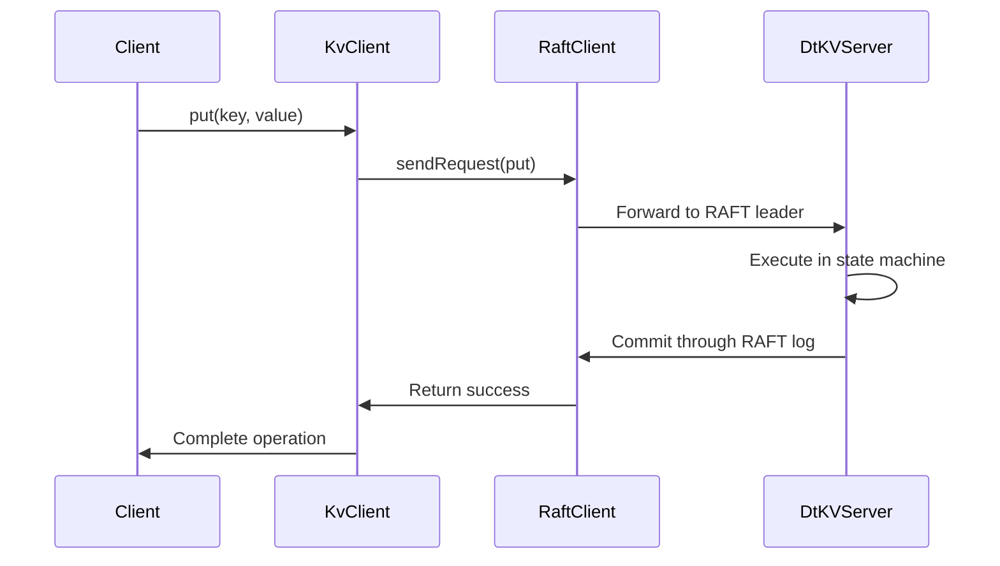
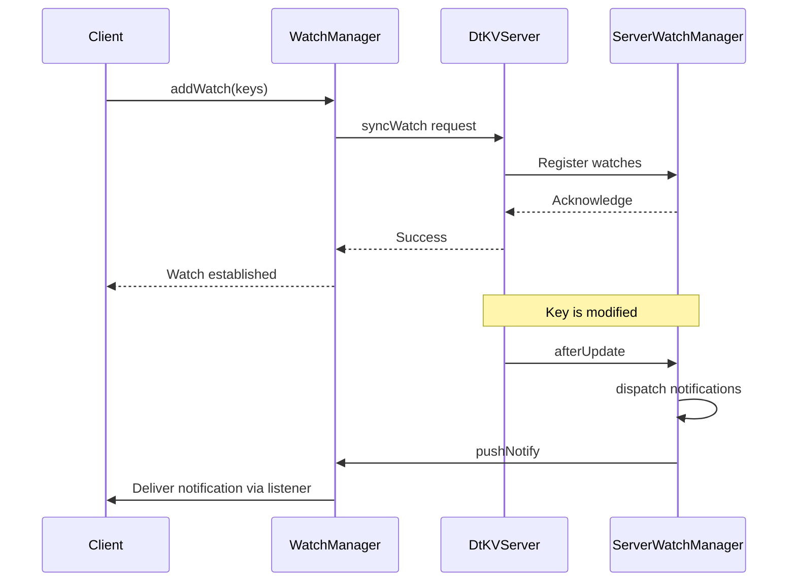
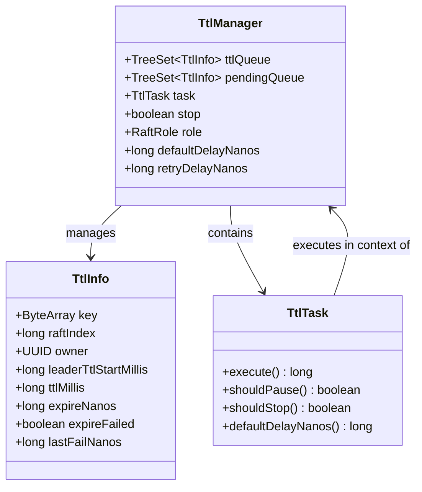
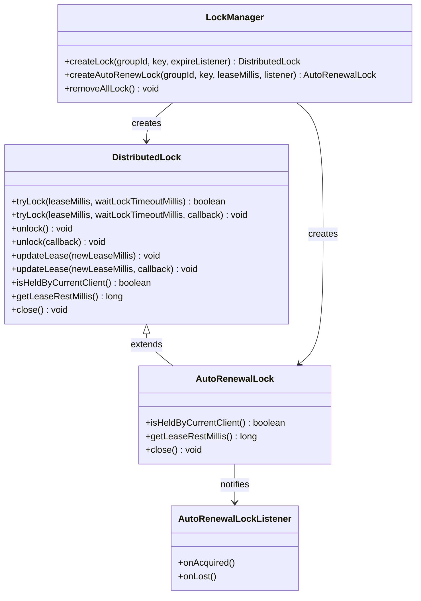
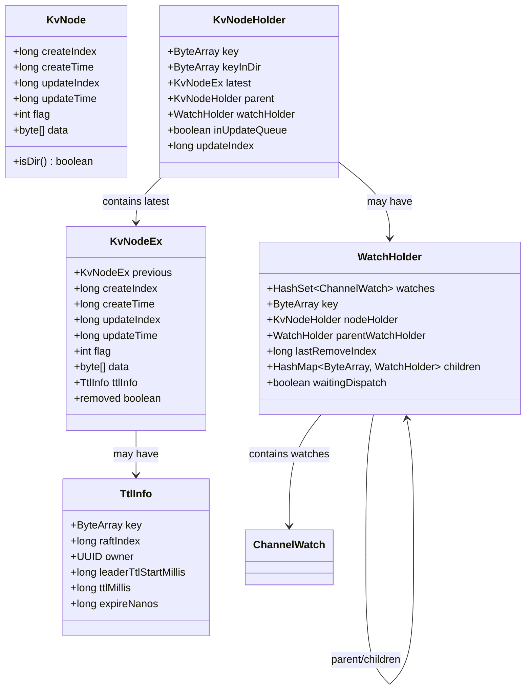

# DtKV Distributed Key-Value Store

<cite>
**Referenced Files in This Document**   
- [README.md](file://README.md)
- [KvClient.java](file://client/src/main/java/com/github/dtprj/dongting/dtkv/KvClient.java)
- [DtKV.java](file://server/src/main/java/com/github/dtprj/dongting/dtkv/server/DtKV.java)
- [KvImpl.java](file://server/src/main/java/com/github/dtprj/dongting/dtkv/server/KvImpl.java)
- [TtlManager.java](file://server/src/main/java/com/github/dtprj/dongting/dtkv/server/TtlManager.java)
- [ServerWatchManager.java](file://server/src/main/java/com/github/dtprj/dongting/dtkv/server/ServerWatchManager.java)
- [WatchManager.java](file://client/src/main/java/com/github/dtprj/dongting/dtkv/WatchManager.java)
- [DistributedLock.java](file://client/src/main/java/com/github/dtprj/dongting/dtkv/DistributedLock.java)
- [AutoRenewalLock.java](file://client/src/main/java/com/github/dtprj/dongting/dtkv/AutoRenewalLock.java)
- [dt_kv.proto](file://server/src/test/proto/dt_kv.proto)
- [KvNode.java](file://client/src/main/java/com/github/dtprj/dongting/dtkv/KvNode.java)
- [KvSnapshot.java](file://server/src/main/java/com/github/dtprj/dongting/dtkv/server/KvSnapshot.java)
</cite>

## Table of Contents
1. [Introduction](#introduction)
2. [Core K/V Operations](#core-kv-operations)
3. [Directory Operations](#directory-operations)
4. [Batch Operations](#batch-operations)
5. [Conditional Updates](#conditional-updates)
6. [Watch/Subscription System](#watchsubscription-system)
7. [TTL Management](#ttl-management)
8. [Distributed Locking](#distributed-locking)
9. [Data Model and Persistence](#data-model-and-persistence)
10. [Performance Characteristics](#performance-characteristics)
11. [Use Cases](#use-cases)

## Introduction

DtKV is a distributed key-value store designed as a linearizable coordination service. Built on a RAFT consensus algorithm, DtKV provides strong consistency guarantees for distributed systems. The system supports core K/V operations, directory operations, batch operations, conditional updates, watch/subscription mechanisms, TTL management, and distributed locking. DtKV is optimized for high performance, with reported throughput of up to 1.7 million TPS in async write mode on a single machine. The system is dependency-free, with client and server components totaling less than 1MB in size, making it suitable for embedding in applications. DtKV supports Java 8+ and can run on various hardware, including HDDs and Raspberry Pis.

**Section sources**
- [README.md](file://README.md#L4-L141)

## Core K/V Operations

DtKV provides linearizable K/V operations with strong consistency guarantees. The core operations include get, put, and remove, all of which are linearizable through the underlying RAFT consensus protocol. The put operation writes a key-value pair to the store, with the key using '.' as a path separator to support hierarchical organization. The get operation retrieves the value associated with a key, returning null if the key does not exist. The remove operation deletes a key-value pair from the store. All operations support both synchronous and asynchronous execution patterns. The system enforces key validation, rejecting keys that are null, empty, or contain invalid characters. Values are limited to a maximum size defined by `KvClientConfig.MAX_VALUE_SIZE`. The operations are designed to be idempotent and safe for retry in case of network failures.

**Diagram sources **
- [KvClient.java](file://client/src/main/java/com/github/dtprj/dongting/dtkv/KvClient.java#L237-L242)
- [DtKV.java](file://server/src/main/java/com/github/dtprj/dongting/dtkv/server/DtKV.java#L175-L215)

**Section sources**
- [KvClient.java](file://client/src/main/java/com/github/dtprj/dongting/dtkv/KvClient.java#L237-L411)
- [KvImpl.java](file://server/src/main/java/com/github/dtprj/dongting/dtkv/server/KvImpl.java#L389-L431)

## Directory Operations

DtKV supports hierarchical directory operations through mkdir and list operations. The mkdir operation creates a directory node in the key space, using the same key structure as regular K/V pairs but with a directory flag set. Directories can contain both regular key-value pairs and subdirectories, enabling a tree-like data structure. The list operation retrieves all child nodes of a directory, returning their metadata and values. Directory operations are subject to the same consistency guarantees as regular K/V operations, ensuring linearizability. The system prevents operations that would create invalid directory structures, such as creating a directory with a key that already exists as a regular key-value pair. Directory nodes cannot have values, and regular key-value pairs cannot have children. The operations support both synchronous and asynchronous execution, with appropriate error handling for cases where the parent directory does not exist or the target key conflicts with an existing node.

**Section sources**
- [KvClient.java](file://client/src/main/java/com/github/dtprj/dongting/dtkv/KvClient.java#L421-L439)
- [KvImpl.java](file://server/src/main/java/com/github/dtprj/dongting/dtkv/server/KvImpl.java#L308-L336)

## Batch Operations

DtKV provides batch operations for improved efficiency when performing multiple K/V operations. The batchPut, batchGet, and batchRemove operations allow clients to execute multiple operations in a single request, reducing network overhead and improving throughput. Batch operations are atomic at the request level, meaning all operations in a batch are processed together, though individual operations may succeed or fail independently. The batchPut operation writes multiple key-value pairs, returning a list of results indicating the success or failure of each individual put operation. Similarly, batchGet retrieves multiple values in a single request, returning null for keys that do not exist. BatchRemove deletes multiple keys, with each removal subject to the same ownership and existence checks as individual remove operations. Batch operations maintain the same linearizability guarantees as individual operations, with the entire batch committed through the RAFT log as a single unit.

**Section sources**
- [KvClient.java](file://client/src/main/java/com/github/dtprj/dongting/dtkv/KvClient.java#L487-L610)
- [KvImpl.java](file://server/src/main/java/com/github/dtprj/dongting/dtkv/server/KvImpl.java#L529-L549)

## Conditional Updates

DtKV supports conditional updates through the compareAndSet (CAS) operation, enabling atomic compare-and-swap semantics. The CAS operation checks if a key's current value matches an expected value before updating it to a new value. This operation is linearizable and provides a foundation for implementing higher-level concurrency control mechanisms. The CAS operation can be used to create, update, or delete keys based on the current state, making it suitable for implementing distributed algorithms and coordination patterns. The operation returns a boolean indicating success or failure, allowing clients to implement retry logic when conflicts occur. CAS operations are committed through the RAFT log, ensuring consistency across the cluster. The operation cannot be used to create directories or operate on temporary nodes, focusing its use on regular key-value pairs. The implementation includes optimizations to minimize the overhead of the comparison operation while maintaining correctness.

**Section sources**
- [KvClient.java](file://client/src/main/java/com/github/dtprj/dongting/dtkv/KvClient.java#L612-L654)
- [KvImpl.java](file://server/src/main/java/com/github/dtprj/dongting/dtkv/server/KvImpl.java#L738-L797)

## Watch/Subscription System

DtKV provides a watch/subscription system for change notifications, allowing clients to receive real-time updates when specific keys or directories change. The watch mechanism enables clients to register interest in one or more keys, receiving notifications when those keys are modified, created, or deleted. Notifications include the key, new value (if applicable), and the RAFT log index of the change, enabling clients to maintain consistent views of the data. The system supports both key-specific watches and directory watches, where changes to any child of a directory trigger notifications. The watch implementation is designed to be efficient, batching multiple changes into single notifications when possible. Client-side and server-side components work together to maintain watch registrations, handle network failures, and ensure at-least-once delivery of notifications. The system includes heartbeat mechanisms to detect and clean up stale watch registrations, preventing resource leaks.

**Diagram sources **
- [WatchManager.java](file://client/src/main/java/com/github/dtprj/dongting/dtkv/WatchManager.java#L132-L157)
- [ServerWatchManager.java](file://server/src/main/java/com/github/dtprj/dongting/dtkv/server/ServerWatchManager.java#L477-L536)

**Section sources**
- [WatchManager.java](file://client/src/main/java/com/github/dtprj/dongting/dtkv/WatchManager.java#L132-L157)
- [ServerWatchManager.java](file://server/src/main/java/com/github/dtprj/dongting/dtkv/server/ServerWatchManager.java#L477-L536)
- [WatchDemoClient.java](file://demos/src/main/java/com/github/dtprj/dongting/demos/watch/WatchDemoClient.java#L37-L58)

## TTL Management

DtKV provides TTL (Time-To-Live) management for temporary nodes, enabling automatic expiration and cleanup of data. Temporary nodes are created with a specified TTL in milliseconds, after which they are automatically removed from the store. The TTL mechanism is implemented at the server level, with the leader responsible for triggering expiration operations. When a temporary node is created or its TTL is updated, the server schedules an expiration task based on the current RAFT log index and the specified TTL. The expiration process is linearizable, with the actual removal committed through the RAFT log to ensure consistency across the cluster. Clients that create temporary nodes are the only ones that can modify or remove them, providing ownership semantics. The system handles network partitions and leader changes gracefully, ensuring that expiration operations are eventually processed. TTL management supports both individual key-value pairs and entire directories, with all children of a temporary directory being removed when the directory expires.

**Diagram sources **
- [TtlManager.java](file://server/src/main/java/com/github/dtprj/dongting/dtkv/server/TtlManager.java#L33-L242)
- [TtlInfo.java](file://server/src/main/java/com/github/dtprj/dongting/dtkv/server/TtlManager.java#L204-L241)

**Section sources**
- [TtlManager.java](file://server/src/main/java/com/github/dtprj/dongting/dtkv/server/TtlManager.java#L33-L242)
- [KvImpl.java](file://server/src/main/java/com/github/dtprj/dongting/dtkv/server/KvImpl.java#L464-L465)
- [TtlDemoClient.java](file://demos/src/main/java/com/github/dtprj/dongting/demos/ttl/TtlDemoClient.java#L41-L50)

## Distributed Locking

DtKV provides distributed locking mechanisms for coordination among distributed processes. The system supports both manual locks and auto-renewal locks, catering to different use cases and complexity requirements. Manual locks require explicit acquisition and release by the client, with a specified lease time after which the lock is automatically released. Auto-renewal locks automatically renew their lease before expiration, providing a simpler programming model for long-running operations. Both lock types are implemented using temporary nodes in the key space, leveraging the TTL mechanism for automatic cleanup. The locking system supports tryLock operations with configurable wait times, allowing clients to either block or fail immediately when a lock is held by another process. Lock ownership is tracked using UUIDs, ensuring that only the acquiring client can modify or release the lock. The system includes mechanisms for handling network failures and process crashes, ensuring that locks are eventually released even if the owning process fails unexpectedly.

**Diagram sources **
- [DistributedLock.java](file://client/src/main/java/com/github/dtprj/dongting/dtkv/DistributedLock.java#L31-L153)
- [AutoRenewalLock.java](file://client/src/main/java/com/github/dtprj/dongting/dtkv/AutoRenewalLock.java#L34-L68)
- [KvClient.java](file://client/src/main/java/com/github/dtprj/dongting/dtkv/KvClient.java#L697-L740)

**Section sources**
- [DistributedLock.java](file://client/src/main/java/com/github/dtprj/dongting/dtkv/DistributedLock.java#L31-L153)
- [AutoRenewalLock.java](file://client/src/main/java/com/github/dtprj/dongting/dtkv/AutoRenewalLock.java#L34-L68)
- [LockManager.java](file://client/src/main/java/com/github/dtprj/dongting/dtkv/LockManager.java)
- [LockDemoClient.java](file://demos/src/main/java/com/github/dtprj/dongting/demos/lock/LockDemoClient.java#L37-L46)

## Data Model and Persistence

DtKV uses a tree-based data model with nodes representing key-value pairs or directories. Each node contains metadata including creation and update timestamps, RAFT log indices, flags indicating node type (regular, directory, or lock), and the actual value data. The data model is persisted through the RAFT log, ensuring consistency and durability across the cluster. The server maintains an in-memory representation of the key space using ConcurrentHashMap for efficient access, protected by StampedLock for write operations. Snapshotting is used to manage memory usage and enable fast recovery, with snapshots capturing the complete state of the key space at a specific RAFT log index. The snapshot mechanism includes garbage collection of historical node versions, balancing memory efficiency with the ability to serve linearizable reads. The persistence design ensures that all state changes are committed through the RAFT consensus algorithm, providing strong consistency guarantees. The system supports dynamic addition and removal of RAFT groups, enabling sharding and horizontal scaling.

**Diagram sources **
- [KvNode.java](file://client/src/main/java/com/github/dtprj/dongting/dtkv/KvNode.java#L30-L174)
- [KvImpl.java](file://server/src/main/java/com/github/dtprj/dongting/dtkv/server/KvImpl.java#L45-L90)
- [KvSnapshot.java](file://server/src/main/java/com/github/dtprj/dongting/dtkv/server/KvSnapshot.java#L36-L201)

**Section sources**
- [KvImpl.java](file://server/src/main/java/com/github/dtprj/dongting/dtkv/server/KvImpl.java#L45-L90)
- [KvNode.java](file://client/src/main/java/com/github/dtprj/dongting/dtkv/KvNode.java#L30-L174)
- [KvSnapshot.java](file://server/src/main/java/com/github/dtprj/dongting/dtkv/server/KvSnapshot.java#L36-L201)
- [DtKV.java](file://server/src/main/java/com/github/dtprj/dongting/dtkv/server/DtKV.java#L265-L319)

## Performance Characteristics

DtKV is designed for high performance, with optimizations at multiple levels of the system. The architecture achieves high throughput through efficient use of resources and minimal overhead. Performance benchmarks show throughput of up to 1.7 million TPS in async write mode and 700,000 TPS in sync write mode on a single machine with a 6-core CPU. The system's performance is influenced by several factors, including write mode (async vs sync), network conditions, and storage performance. Async write mode provides higher throughput by acknowledging writes as soon as data is written to the OS buffer, while sync write mode ensures durability by waiting for fsync completion. The system is optimized to minimize memory allocations and garbage collection pressure, using object pooling and efficient data structures. The fiber-based threading model reduces context switching overhead compared to traditional thread-per-request models. Network communication is optimized with efficient serialization using Protocol Buffers and connection pooling. The system's small footprint (under 1MB for client and server) reduces memory pressure and enables efficient deployment in resource-constrained environments.

**Section sources**
- [README.md](file://README.md#L16-L45)

## Use Cases

DtKV is suitable for various distributed coordination use cases, including service discovery, configuration management, and distributed locking. For service discovery, DtKV can maintain a registry of available services, with temporary nodes representing service instances that automatically expire when services go offline. Clients can watch for changes to service registrations, enabling dynamic service discovery and load balancing. In configuration management, DtKV provides a centralized store for application configuration, with change notifications allowing applications to reload configuration without restart. The linearizable consistency model ensures that all clients see a consistent view of configuration. For distributed coordination, DtKV's locking mechanisms enable leader election, mutual exclusion, and other coordination patterns. The system can also be used for distributed queues, leader election, and cluster membership management. The tree-based data model supports hierarchical organization of data, making it suitable for representing complex system states. The combination of high performance, strong consistency, and small footprint makes DtKV particularly well-suited for microservices architectures and cloud-native applications.

**Section sources**
- [README.md](file://README.md#L72-L122)