# TTL and Node Expiration

<cite>
**Referenced Files in This Document**   
- [TtlManager.java](file://server/src/main/java/com/github/dtprj/dongting/dtkv/server/TtlManager.java)
- [KvClient.java](file://client/src/main/java/com/github/dtprj/dongting/dtkv/KvClient.java)
- [KvImpl.java](file://server/src/main/java/com/github/dtprj/dongting/dtkv/server/KvImpl.java)
- [KvSnapshot.java](file://server/src/main/java/com/github/dtprj/dongting/dtkv/server/KvSnapshot.java)
- [TtlDemoClient.java](file://demos/src/main/java/com/github/dtprj/dongting/demos/ttl/TtlDemoClient.java)
- [TtlDemoServer.java](file://demos/src/main/java/com/github/dtprj/dongting/demos/ttl/TtlDemoServer.java)
- [TtlManagerTest.java](file://server/src/test/java/com/github/dtprj/dongting/dtkv/server/TtlManagerTest.java)
</cite>

## Table of Contents
1. [Introduction](#introduction)
2. [TTL Management Architecture](#ttl-management-architecture)
3. [Background Scanning and Cleanup Process](#background-scanning-and-cleanup-process)
4. [Client API for TTL Operations](#client-api-for-ttl-operations)
5. [Persistence and Snapshot Recovery](#persistence-and-snapshot-recovery)
6. [TTL Demos and Usage Examples](#ttl-demos-and-usage-examples)
7. [Expiration Timing and Watch Notifications](#expiration-timing-and-watch-notifications)
8. [Integration with Distributed Locking and Service Discovery](#integration-with-distributed-locking-and-service-discovery)
9. [Conclusion](#conclusion)

## Introduction

The DtKV TTL (Time-To-Live) management system provides automatic expiration of temporary nodes, enabling use cases such as session management, cache invalidation, and ephemeral service registration. This document details the implementation of TTL functionality in DtKV, covering the background scanning mechanism, client API, persistence model, and integration patterns. The system ensures that temporary nodes are reliably expired according to their configured TTL values while maintaining consistency across the distributed system.

**Section sources**
- [TtlManager.java](file://server/src/main/java/com/github/dtprj/dongting/dtkv/server/TtlManager.java#L1-L242)
- [KvClient.java](file://client/src/main/java/com/github/dtprj/dongting/dtkv/KvClient.java#L1-L771)

## TTL Management Architecture

The TTL management system in DtKV is centered around the `TtlManager` class, which coordinates the expiration of temporary nodes. The architecture consists of several key components that work together to provide reliable TTL functionality:

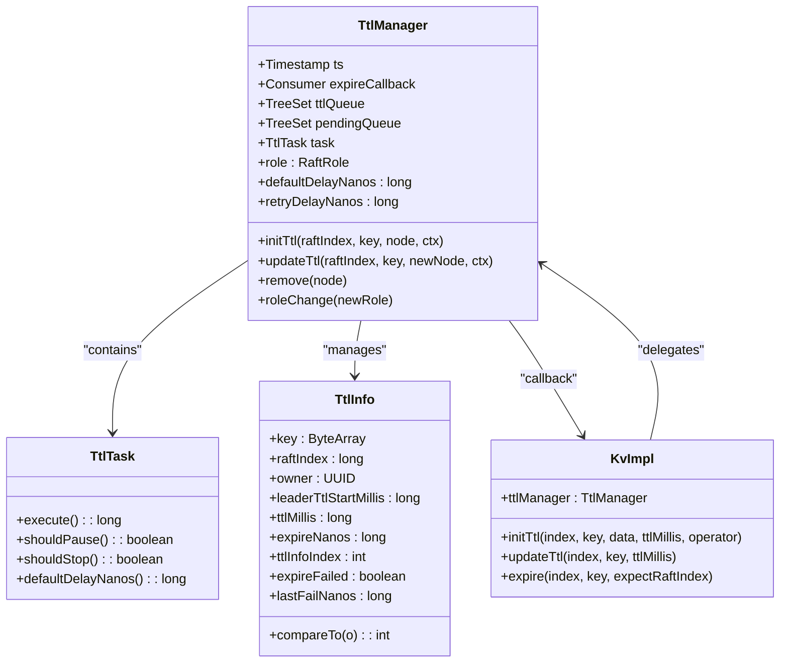

**Diagram sources**
- [TtlManager.java](file://server/src/main/java/com/github/dtprj/dongting/dtkv/server/TtlManager.java#L33-L242)
- [KvImpl.java](file://server/src/main/java/com/github/dtprj/dongting/dtkv/server/KvImpl.java#L100-L200)

The `TtlManager` maintains two priority queues: `ttlQueue` for nodes ready to be checked for expiration, and `pendingQueue` for nodes whose expiration processing has failed and needs to be retried. The `TtlTask` executes periodically to process these queues, while `TtlInfo` objects contain all the metadata needed to manage a node's TTL.

**Section sources**
- [TtlManager.java](file://server/src/main/java/com/github/dtprj/dongting/dtkv/server/TtlManager.java#L33-L242)

## Background Scanning and Cleanup Process

The TTL cleanup process is implemented as a background task that runs on the leader node of each Raft group. The `TtlTask` executes periodically, processing nodes in order of their expiration time:

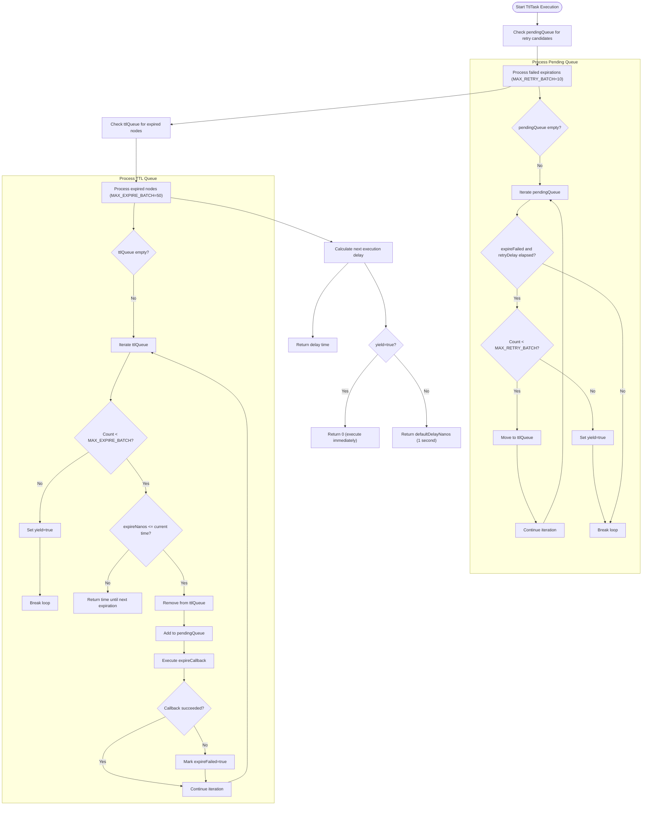

**Diagram sources**
- [TtlManager.java](file://server/src/main/java/com/github/dtprj/dongting/dtkv/server/TtlManager.java#L59-L109)

The cleanup process follows these key principles:
- **Batch Processing**: The system processes up to 50 expired nodes and 10 retry candidates per execution cycle to prevent long pauses
- **Leader-Only Execution**: The `shouldPause()` method ensures cleanup only runs on the leader node
- **Retry Mechanism**: Failed expiration attempts are retried after a configurable delay (default 1 second)
- **Ordered Processing**: Nodes are processed in order of expiration time using a `TreeSet` with `TtlInfo.compareTo()`

The `TtlInfo.compareTo()` method first compares expiration times, then uses a sequence index to ensure consistent ordering for nodes with identical expiration times:

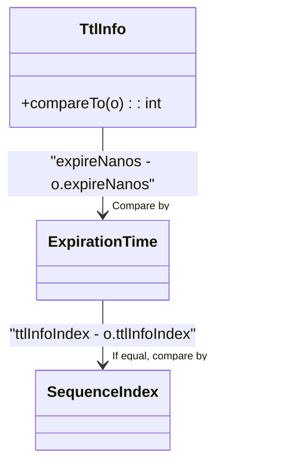

**Diagram sources**
- [TtlManager.java](file://server/src/main/java/com/github/dtprj/dongting/dtkv/server/TtlManager.java#L228-L240)

**Section sources**
- [TtlManager.java](file://server/src/main/java/com/github/dtprj/dongting/dtkv/server/TtlManager.java#L59-L109)

## Client API for TTL Operations

DtKV provides a comprehensive client API for managing temporary nodes with TTL. The `KvClient` class exposes both synchronous and asynchronous methods for creating, updating, and removing temporary nodes.

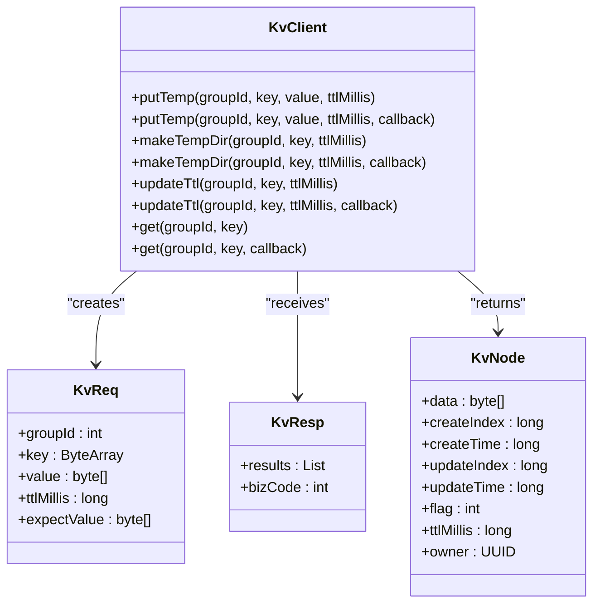

**Diagram sources**
- [KvClient.java](file://client/src/main/java/com/github/dtprj/dongting/dtkv/KvClient.java#L272-L686)

The key TTL operations available to clients are:

### Creating Temporary Nodes
Clients can create temporary nodes using the `putTemp` method, which requires a positive TTL value in milliseconds:

```java
// Synchronous creation
kvClient.putTemp(GROUP_ID, "tempKey1".getBytes(), "tempValue1".getBytes(), 3000);

// Asynchronous creation
kvClient.putTemp(GROUP_ID, "tempKey2".getBytes(), "tempValue2".getBytes(), 5000, callback);
```

### Creating Temporary Directories
Temporary directories can be created using `makeTempDir`, which also accepts a TTL value:

```java
kvClient.makeTempDir(GROUP_ID, "tempDir".getBytes(), 10000);
```

### Updating TTL
The TTL of existing temporary nodes can be updated using the `updateTtl` method:

```java
// Extend TTL to 10 seconds
kvClient.updateTtl(GROUP_ID, "tempKey1".getBytes(), 10000);
```

### Retrieving Node Information
The `get` method returns a `KvNode` object that includes TTL information:

```java
KvNode node = kvClient.get(GROUP_ID, "tempKey1".getBytes());
if (node != null) {
    System.out.println("TTL: " + node.ttlMillis + "ms");
    System.out.println("Owner: " + node.owner);
}
```

The server validates TTL values to ensure they are within acceptable bounds (positive and not exceeding 100 years):

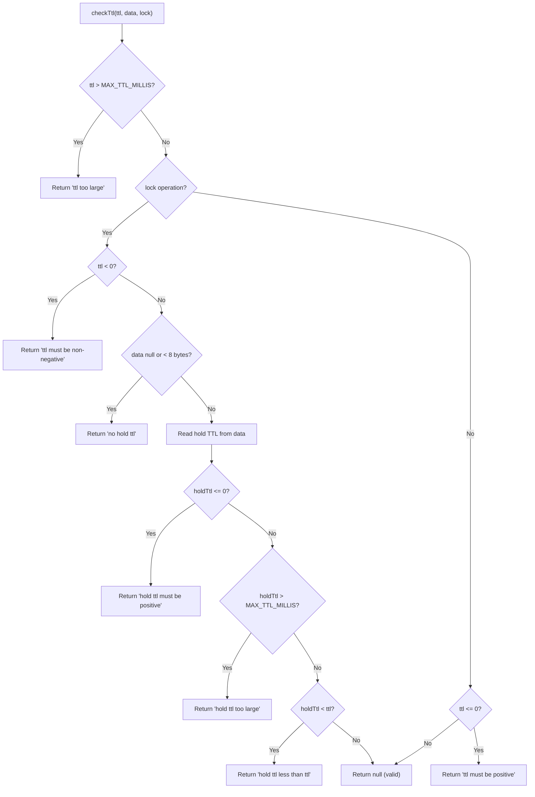

**Diagram sources**
- [KvImpl.java](file://server/src/main/java/com/github/dtprj/dongting/dtkv/server/KvImpl.java#L939-L965)

**Section sources**
- [KvClient.java](file://client/src/main/java/com/github/dtprj/dongting/dtkv/KvClient.java#L272-L686)
- [KvImpl.java](file://server/src/main/java/com/github/dtprj/dongting/dtkv/server/KvImpl.java#L939-L965)

## Persistence and Snapshot Recovery

TTL information is persisted in the RAFT log and recovered during snapshot restoration to ensure durability and consistency across restarts and leader changes.

### RAFT Log Persistence
When a temporary node is created or updated, the TTL information is recorded in the RAFT log as part of the operation:

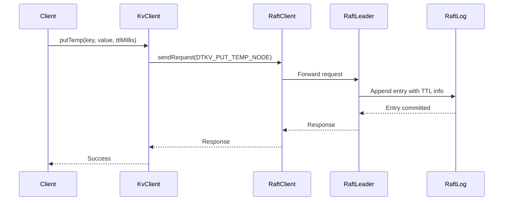

**Diagram sources**
- [KvClient.java](file://client/src/main/java/com/github/dtprj/dongting/dtkv/KvClient.java#L272-L301)
- [KvImpl.java](file://server/src/main/java/com/github/dtprj/dongting/dtkv/server/KvImpl.java#L100-L200)

### Snapshot Serialization
During snapshot creation, TTL information is serialized along with the node data in the `KvSnapshot` class:

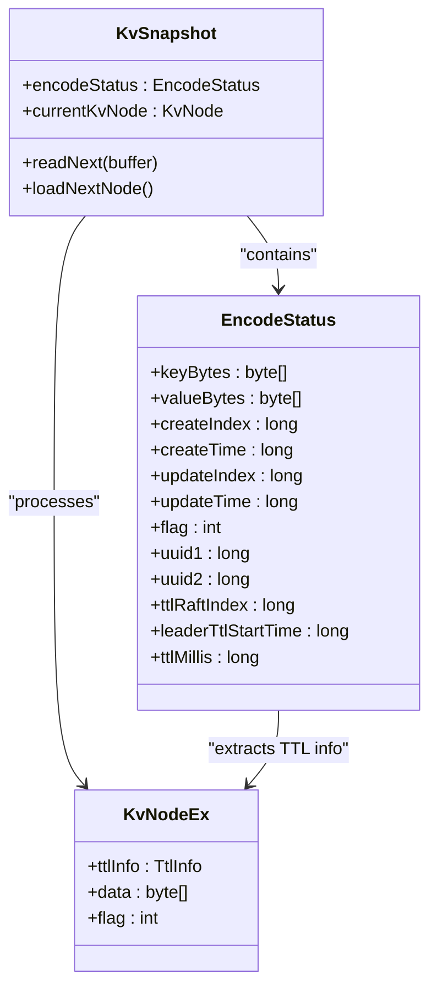

**Diagram sources**
- [KvSnapshot.java](file://server/src/main/java/com/github/dtprj/dongting/dtkv/server/KvSnapshot.java#L1-L201)

The `loadNextNode` method in `KvSnapshot` extracts TTL information from `KvNodeEx` objects and populates the `EncodeStatus` fields for serialization:

```java
if (n.ttlInfo != null) {
    encodeStatus.uuid1 = n.ttlInfo.owner.getMostSignificantBits();
    encodeStatus.uuid2 = n.ttlInfo.owner.getLeastSignificantBits();
    encodeStatus.ttlRaftIndex = n.ttlInfo.raftIndex;
    encodeStatus.leaderTtlStartTime = n.ttlInfo.leaderTtlStartMillis;
    encodeStatus.ttlMillis = n.ttlInfo.ttlMillis;
}
```

### Snapshot Recovery
When a node recovers from a snapshot, the TTL information is restored and reinserted into the `TtlManager`:

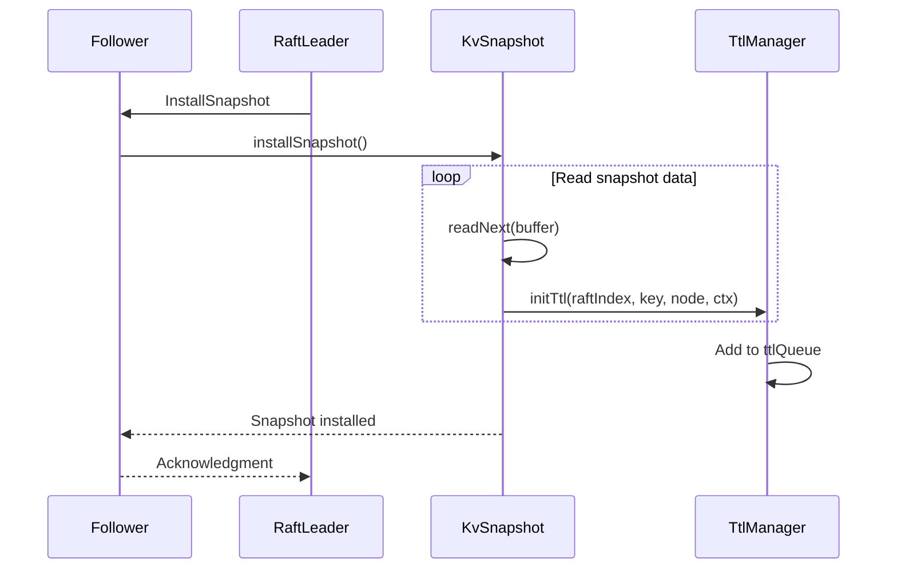

The `initTtl` method in `TtlManager` creates a new `TtlInfo` object and adds it to the expiration queue:

```java
TtlInfo ttlInfo = new TtlInfo(key, raftIndex, ctx.operator, ctx.leaderCreateTimeMillis, 
        ctx.ttlMillis, ctx.localCreateNanos + ctx.ttlMillis * 1_000_000, ttlInfoIndex++);
n.ttlInfo = ttlInfo;
ttlQueue.add(ttlInfo);
```

**Section sources**
- [KvSnapshot.java](file://server/src/main/java/com/github/dtprj/dongting/dtkv/server/KvSnapshot.java#L1-L201)
- [TtlManager.java](file://server/src/main/java/com/github/dtprj/dongting/dtkv/server/TtlManager.java#L137-L144)

## TTL Demos and Usage Examples

The DtKV repository includes demonstration code that illustrates the usage of TTL functionality. The `TtlDemoClient` and `TtlDemoServer` classes provide a complete example of creating and verifying temporary nodes.

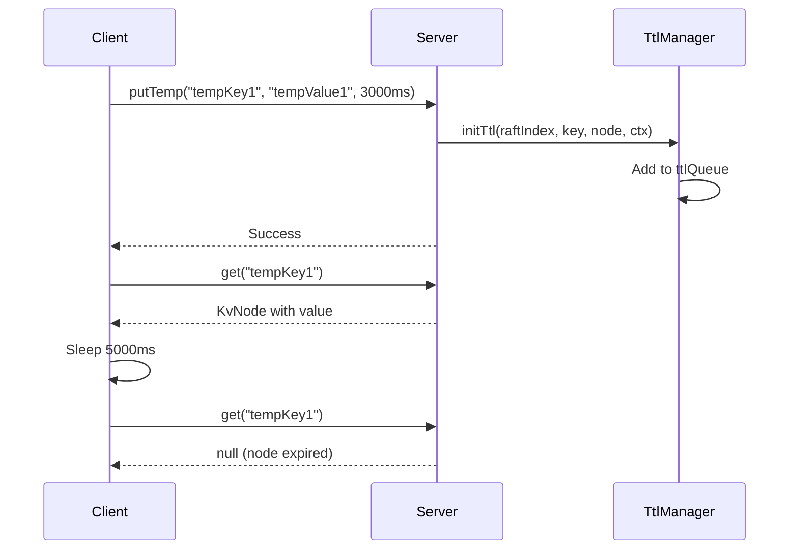

**Diagram sources**
- [TtlDemoClient.java](file://demos/src/main/java/com/github/dtprj/dongting/demos/ttl/TtlDemoClient.java#L1-L58)
- [TtlDemoServer.java](file://demos/src/main/java/com/github/dtprj/dongting/demos/ttl/TtlDemoServer.java#L1-L33)

The demo code demonstrates the following workflow:
1. Create a `KvClient` and connect to the DtKV cluster
2. Put a temporary key-value pair with a 3-second TTL
3. Verify the node exists by retrieving it
4. Wait 5 seconds (longer than the TTL)
5. Verify the node has been automatically expired

```java
// Create temporary node with 3-second TTL
kvClient.putTemp(GROUP_ID, "tempKey1".getBytes(), "tempValue1".getBytes(), 3000);

// Verify node exists
KvNode node = kvClient.get(GROUP_ID, "tempKey1".getBytes());
System.out.println("get tempKey1, value=" + new String(node.data));

// Wait longer than TTL
Thread.sleep(5000);

// Verify node has expired
node = kvClient.get(GROUP_ID, "tempKey1".getBytes());
System.out.println("get tempKey1, value=" + (node == null ? "null" : new String(node.data)));
```

The demo output shows:
```
put tempKey1 with value tempValue1
get tempKey1, value=tempValue1
sleep 5000 millis
get tempKey1, value=null
```

This confirms that the TTL mechanism correctly expired the node after approximately 3 seconds.

**Section sources**
- [TtlDemoClient.java](file://demos/src/main/java/com/github/dtprj/dongting/demos/ttl/TtlDemoClient.java#L1-L58)
- [TtlDemoServer.java](file://demos/src/main/java/com/github/dtprj/dongting/demos/ttl/TtlDemoServer.java#L1-L33)

## Expiration Timing and Watch Notifications

The TTL system provides predictable expiration timing while integrating with DtKV's watch notification mechanism to inform clients of node removals.

### Expiration Timing Accuracy
The expiration timing is designed to be accurate within the constraints of distributed systems:

- **Minimum Delay**: The `defaultDelayNanos` is set to 1 second, meaning expired nodes will be processed within 1 second of their expiration time
- **Batch Processing**: Up to 50 nodes are processed per cycle, which may introduce slight delays when many nodes expire simultaneously
- **Retry Mechanism**: Failed expiration attempts are retried after `retryDelayNanos` (1 second), ensuring eventual consistency

The expiration time is calculated using nanosecond precision:

```java
TtlInfo ttlInfo = new TtlInfo(key, raftIndex, ctx.operator, ctx.leaderCreateTimeMillis, 
        ctx.ttlMillis, ctx.localCreateNanos + ctx.ttlMillis * 1_000_000, ttlInfoIndex++);
```

This ensures that expiration timing is based on the node's creation time with millisecond precision for the TTL value.

### Watch Notifications
When a temporary node expires, the system generates watch notifications to inform registered clients:

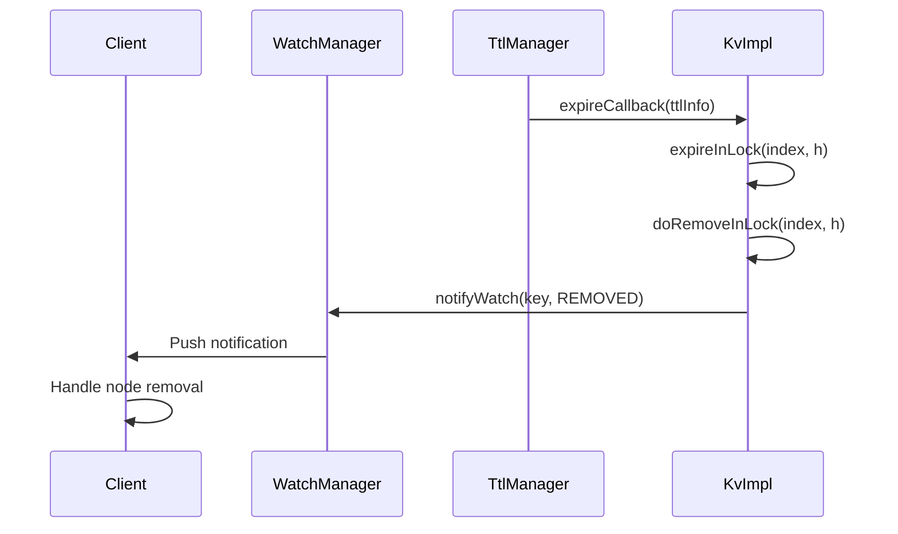

**Diagram sources**
- [TtlManager.java](file://server/src/main/java/com/github/dtprj/dongting/dtkv/server/TtlManager.java#L98-L99)
- [KvImpl.java](file://server/src/main/java/com/github/dtprj/dongting/dtkv/server/KvImpl.java#L967-L1003)

The `expireCallback` in `TtlManager` triggers the expiration process in `KvImpl`, which ultimately calls the watch notification system to inform clients that the node has been removed. This ensures that clients can react promptly to the expiration of temporary nodes.

**Section sources**
- [TtlManager.java](file://server/src/main/java/com/github/dtprj/dongting/dtkv/server/TtlManager.java#L98-L99)
- [KvImpl.java](file://server/src/main/java/com/github/dtprj/dongting/dtkv/server/KvImpl.java#L967-L1003)

## Integration with Distributed Locking and Service Discovery

The TTL system complements DtKV's distributed locking and service discovery patterns by providing mechanisms for automatic cleanup and lease management.

### Distributed Locking
Temporary nodes are used to implement distributed locks, where the TTL serves as the lock lease time:

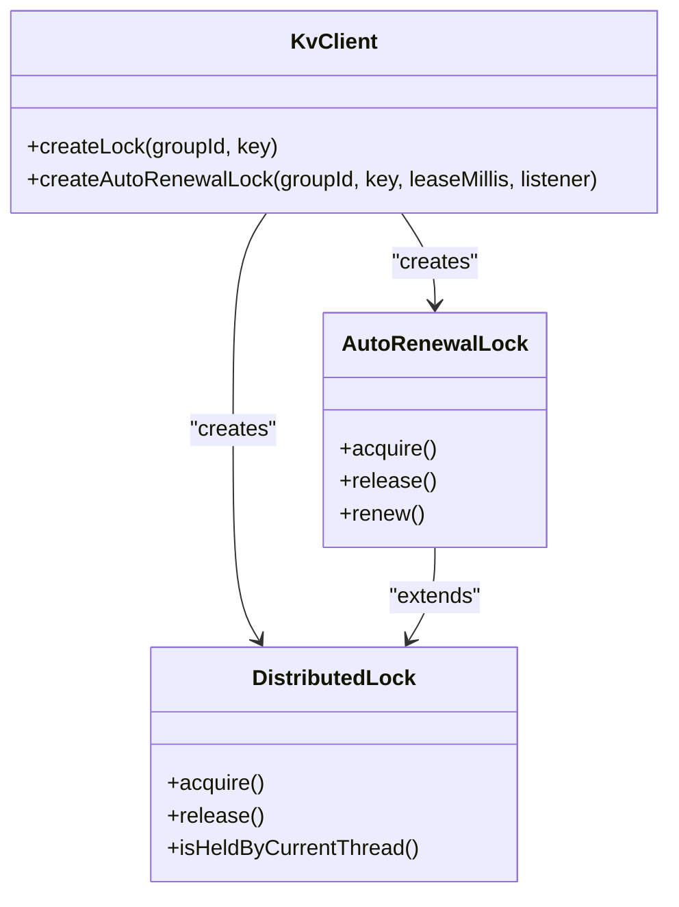

**Diagram sources**
- [KvClient.java](file://client/src/main/java/com/github/dtprj/dongting/dtkv/KvClient.java#L697-L740)

The `AutoRenewalLock` automatically renews the lock's TTL before it expires, preventing accidental release due to network delays or processing pauses. When a lock holder fails, the lock automatically expires after the TTL period, allowing other nodes to acquire it.

### Service Discovery
Temporary nodes are ideal for service discovery, where services register themselves with a TTL that must be periodically renewed:

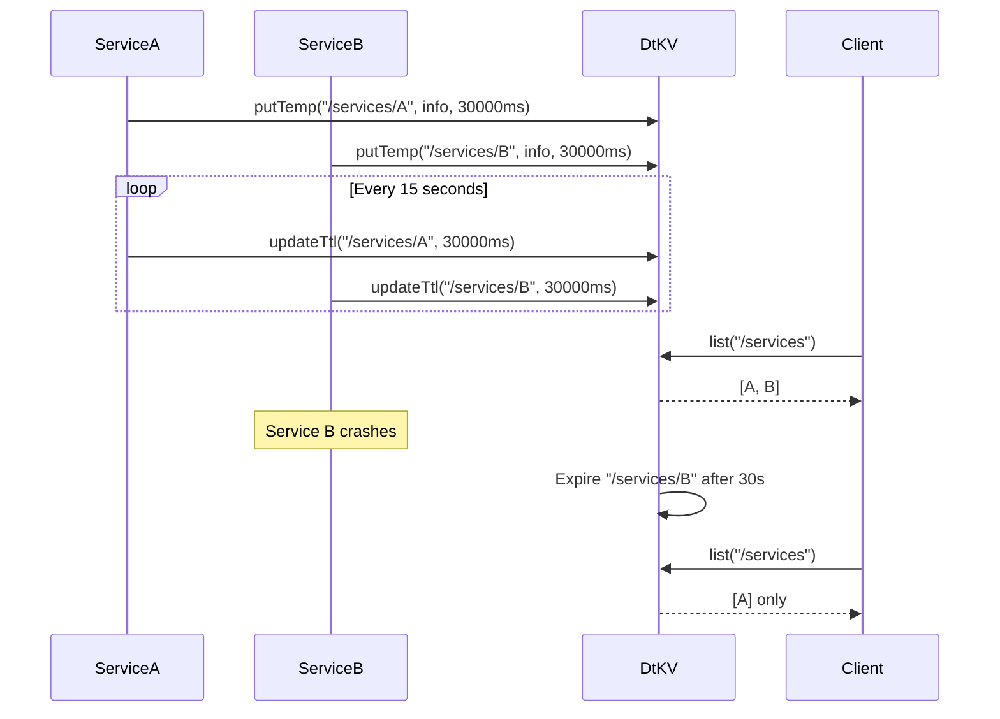

This pattern ensures that only active services appear in the discovery results, as failed services are automatically removed when their TTL expires.

**Section sources**
- [KvClient.java](file://client/src/main/java/com/github/dtprj/dongting/dtkv/KvClient.java#L697-L740)

## Conclusion

The DtKV TTL management system provides a robust mechanism for automatic expiration of temporary nodes through a combination of background scanning, RAFT log persistence, and snapshot recovery. The `TtlManager` implements an efficient cleanup process that runs on the leader node, processing expired nodes in batches while ensuring reliability through retry mechanisms. The client API exposes intuitive methods for creating and managing temporary nodes with configurable TTL values. TTL information is persisted in the RAFT log and snapshots, ensuring durability across restarts and leader changes. The system integrates seamlessly with watch notifications to inform clients of node expirations and complements distributed locking and service discovery patterns by providing automatic cleanup of stale entries. This comprehensive TTL implementation enables reliable, distributed applications that require time-sensitive data management.

**Section sources**
- [TtlManager.java](file://server/src/main/java/com/github/dtprj/dongting/dtkv/server/TtlManager.java#L1-L242)
- [KvClient.java](file://client/src/main/java/com/github/dtprj/dongting/dtkv/KvClient.java#L1-L771)
- [KvImpl.java](file://server/src/main/java/com/github/dtprj/dongting/dtkv/server/KvImpl.java#L939-L965)
- [KvSnapshot.java](file://server/src/main/java/com/github/dtprj/dongting/dtkv/server/KvSnapshot.java#L1-L201)