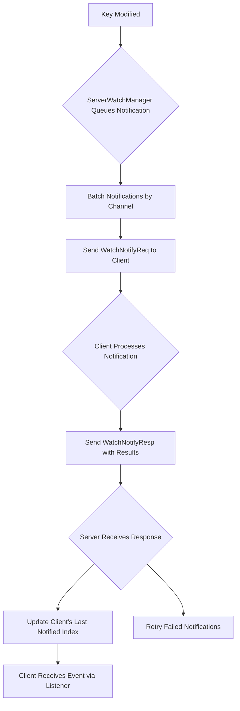
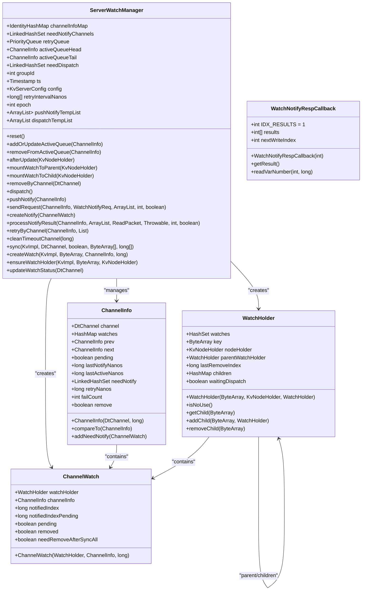
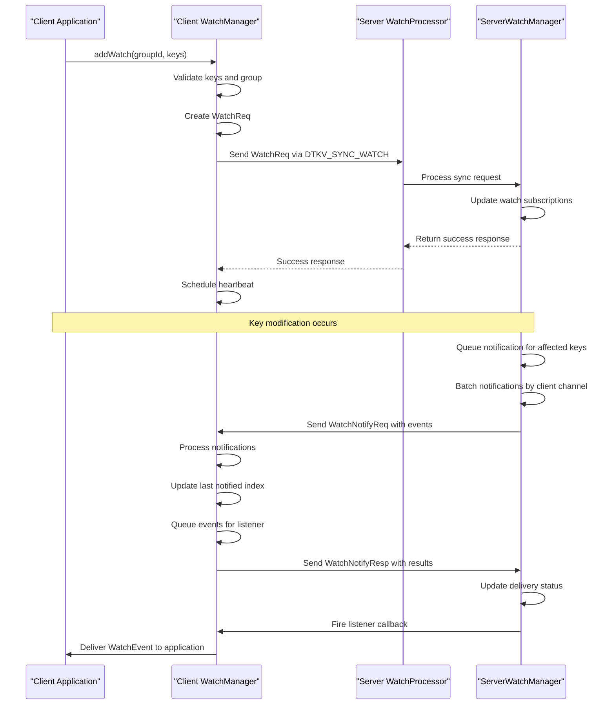

# Watch and Notification System

<cite>
**Referenced Files in This Document**   
- [WatchReq.java](file://client/src/main/java/com/github/dtprj/dongting/dtkv/WatchReq.java)
- [WatchNotify.java](file://client/src/main/java/com/github/dtprj/dongting/dtkv/WatchNotify.java)
- [WatchManager.java](file://client/src/main/java/com/github/dtprj/dongting/dtkv/WatchManager.java)
- [WatchEvent.java](file://client/src/main/java/com/github/dtprj/dongting/dtkv/WatchEvent.java)
- [ServerWatchManager.java](file://server/src/main/java/com/github/dtprj/dongting/dtkv/server/ServerWatchManager.java)
- [WatchProcessor.java](file://server/src/main/java/com/github/dtprj/dongting/dtkv/server/WatchProcessor.java)
- [WatchReqCallback.java](file://server/src/main/java/com/github/dtprj/dongting/dtkv/server/WatchReqCallback.java)
- [WatchNotifyReq.java](file://client/src/main/java/com/github/dtprj/dongting/dtkv/WatchNotifyReq.java)
- [WatchNotifyResp.java](file://client/src/main/java/com/github/dtprj/dongting/dtkv/WatchNotifyResp.java)
- [WatchDemoClient.java](file://demos/src/main/java/com/github/dtprj/dongting/demos/watch/WatchDemoClient.java)
- [KvClient.java](file://client/src/main/java/com/github/dtprj/dongting/dtkv/KvClient.java)
- [KvClientProcessor.java](file://client/src/main/java/com/github/dtprj/dongting/dtkv/KvClientProcessor.java)
- [KvCodes.java](file://client/src/main/java/com/github/dtprj/dongting/dtkv/KvCodes.java)
</cite>

## Table of Contents
1. [Introduction](#introduction)
2. [Watch Registration Mechanism](#watch-registration-mechanism)
3. [Event Types and Notification Delivery](#event-types-and-notification-delivery)
4. [ServerWatchManager Architecture](#serverwatchmanager-architecture)
5. [Message Flow: WatchReq and WatchNotify](#message-flow-watchreq-and-watchnotify)
6. [Watch Persistence and Reconnection](#watch-persistence-and-reconnection)
7. [Resource Management and Best Practices](#resource-management-and-best-practices)
8. [Watch Demo Examples](#watch-demo-examples)
9. [Conclusion](#conclusion)

## Introduction

The DtKV watch and notification system provides a real-time event notification mechanism that enables clients to receive updates when keys in the distributed key-value store are modified. This system is designed to maintain consistency across distributed nodes while providing efficient, low-latency notifications to subscribed clients. The architecture is built around a client-server model where clients register their interest in specific keys or key patterns, and the server propagates change events through a reliable messaging protocol.

The system supports three primary event types: key creation, update, and deletion, each delivered with metadata that allows clients to maintain a consistent view of the key-value store state. The design incorporates mechanisms for handling client reconnections, preventing message loss, and managing resources efficiently to support long-lived watch subscriptions without memory leaks.

This document provides a comprehensive analysis of the watch system's architecture, implementation details, and usage patterns, with a focus on the interaction between client and server components, notification delivery guarantees, and best practices for reliable operation.

## Watch Registration Mechanism

The watch registration mechanism in DtKV allows clients to subscribe to real-time notifications for specific keys within a group. The process begins with the client creating a `WatchReq` object that specifies the group ID, the keys to watch, and the client's knowledge of the current Raft index for each key. This information enables the server to determine which changes need to be delivered to bring the client up to date.

When a client calls `addWatch()` on the `WatchManager`, the system performs validation checks to ensure the keys are valid and belong to an existing group. The `WatchManager` maintains a hierarchical structure of `GroupWatches` and `KeyWatch` objects that track the subscription state for each group and key combination. Each `KeyWatch` contains metadata including the last Raft index the client has been notified about, which is crucial for ensuring notification delivery continuity.

The registration process involves periodic heartbeat checks to maintain the connection with the appropriate server node. The `WatchManager` automatically handles server discovery and failover by querying the Raft group status and establishing connections with available nodes. When a watch is registered, the client sends a `WatchReq` message to the server, which responds by acknowledging the subscription and beginning to queue relevant change events.

For bulk operations, the system supports registering multiple watches in a single request, which is more efficient than individual registrations. The `syncAll` flag in the `WatchReq` message indicates whether this is a full synchronization request (replacing all existing watches for the group) or an incremental update (adding new watches while preserving existing ones).

**Section sources**
- [WatchReq.java](file://client/src/main/java/com/github/dtprj/dongting/dtkv/WatchReq.java#L38-L54)
- [WatchManager.java](file://client/src/main/java/com/github/dtprj/dongting/dtkv/WatchManager.java#L132-L157)
- [WatchProcessor.java](file://server/src/main/java/com/github/dtprj/dongting/dtkv/server/WatchProcessor.java#L90-L109)

## Event Types and Notification Delivery

The DtKV watch system supports three distinct event types that represent different states of a key in the key-value store. These event types are defined in the `WatchEvent` class and include: `STATE_NOT_EXISTS` (0) for keys that have been deleted or never existed, `STATE_VALUE_EXISTS` (1) for keys containing data values, and `STATE_DIRECTORY_EXISTS` (2) for directory nodes that may contain subkeys.

Notification delivery is designed to provide at-least-once semantics, ensuring that clients receive all relevant change events even in the presence of network interruptions or server failures. When a key is modified, the server's `ServerWatchManager` queues a notification for all clients watching that key. The notification includes the Raft consensus index, which serves as a logical timestamp that clients can use to order events and detect gaps in the notification stream.

The system employs a batching mechanism to optimize network utilization, where multiple change events are aggregated into a single `WatchNotifyReq` message when they occur in close succession. This reduces the overhead of individual message processing while maintaining the temporal ordering of events through the Raft index. Clients can distinguish between different types of changes by examining the event state and associated data in the `WatchNotify` message.

Delivery guarantees are enhanced by the client's acknowledgment mechanism. When the server sends notifications, it expects a response containing result codes for each delivered event. If the server does not receive confirmation or receives an error response, it will retry the notification with exponential backoff. This ensures that transient failures do not result in permanent message loss.

**Diagram sources**
- [WatchEvent.java](file://client/src/main/java/com/github/dtprj/dongting/dtkv/WatchEvent.java#L22-L25)
- [ServerWatchManager.java](file://server/src/main/java/com/github/dtprj/dongting/dtkv/server/ServerWatchManager.java#L347-L536)
- [WatchNotify.java](file://client/src/main/java/com/github/dtprj/dongting/dtkv/WatchNotify.java#L36-L46)

**Section sources**
- [WatchEvent.java](file://client/src/main/java/com/github/dtprj/dongting/dtkv/WatchEvent.java#L22-L39)
- [WatchNotify.java](file://client/src/main/java/com/github/dtprj/dongting/dtkv/WatchNotify.java#L36-L46)
- [ServerWatchManager.java](file://server/src/main/java/com/github/dtprj/dongting/dtkv/server/ServerWatchManager.java#L347-L536)

## ServerWatchManager Architecture

The `ServerWatchManager` is the core component responsible for managing watch subscriptions and propagating events in the DtKV system. It maintains a sophisticated data structure that efficiently tracks which clients are watching which keys and ensures timely delivery of change notifications. The architecture is designed to handle high volumes of concurrent watches while minimizing memory overhead and processing latency.

At the heart of the `ServerWatchManager` is a hierarchical watch tree structure implemented through `WatchHolder` objects. Each `WatchHolder` represents a node in the key hierarchy and maintains references to both the data node (`KvNodeHolder`) and any client watches on that key. This structure allows for efficient propagation of change events from the data layer to all interested clients. When a key is modified, the corresponding `WatchHolder` is marked for dispatch, and the `ServerWatchManager` processes these pending dispatches in batches.

The system uses multiple queues to manage different aspects of watch processing. The `needDispatch` queue holds `WatchHolder` objects that have pending changes to notify, while the `needNotifyChannels` queue tracks client channels that have pending notifications to send. A `retryQueue` implements exponential backoff for failed notification attempts, ensuring reliable delivery even during transient network issues.

Resource management is a critical aspect of the architecture. The `ServerWatchManager` employs reference counting and careful lifecycle management to prevent memory leaks. When a client disconnects or explicitly removes watches, the system cleans up the corresponding `ChannelInfo` and `ChannelWatch` objects, and removes unused `WatchHolder` nodes from the hierarchy. The `reset()` method provides a clean mechanism for handling group-level state changes, such as during snapshot installation.

**Diagram sources**
- [ServerWatchManager.java](file://server/src/main/java/com/github/dtprj/dongting/dtkv/server/ServerWatchManager.java#L50-L735)

**Section sources**
- [ServerWatchManager.java](file://server/src/main/java/com/github/dtprj/dongting/dtkv/server/ServerWatchManager.java#L50-L735)

## Message Flow: WatchReq and WatchNotify

The message flow between client and server in the DtKV watch system follows a well-defined pattern that ensures reliable registration and notification delivery. The interaction begins with the client sending a `WatchReq` message to register or update its watch subscriptions, followed by the server responding with acknowledgments and subsequently pushing `WatchNotify` messages when relevant key changes occur.

The `WatchReq` message contains critical information including the group ID, a flag indicating whether this is a full synchronization (`syncAll`), the list of keys to watch, and the client's knowledge of the last Raft index for each key. This last information is essential for the server to determine which changes need to be delivered to bring the client up to date. The message is processed by the `WatchProcessor` on the server side, which validates the request and updates the `ServerWatchManager` state accordingly.

Once registered, the server pushes notifications to the client using the `WatchNotifyReq` message, which contains a list of `WatchNotify` objects representing individual key changes. Each `WatchNotify` includes the Raft index, event state, key, and value (if applicable). The client processes these notifications through the `KvClientProcessor`, which delegates to the `WatchManager`'s `processNotify()` method to handle the incoming events.

The client responds with a `WatchNotifyResp` message containing result codes for each notification, allowing the server to confirm successful delivery or schedule retries for failed notifications. This acknowledgment mechanism ensures at-least-once delivery semantics and provides flow control to prevent overwhelming the client with notifications.

**Diagram sources**
- [WatchReq.java](file://client/src/main/java/com/github/dtprj/dongting/dtkv/WatchReq.java#L38-L54)
- [WatchNotifyReq.java](file://client/src/main/java/com/github/dtprj/dongting/dtkv/WatchNotifyReq.java#L38-L46)
- [WatchNotifyResp.java](file://client/src/main/java/com/github/dtprj/dongting/dtkv/WatchNotifyResp.java#L31-L35)
- [WatchProcessor.java](file://server/src/main/java/com/github/dtprj/dongting/dtkv/server/WatchProcessor.java#L52-L109)
- [KvClientProcessor.java](file://client/src/main/java/com/github/dtprj/dongting/dtkv/KvClientProcessor.java#L58-L64)

**Section sources**
- [WatchReq.java](file://client/src/main/java/com/github/dtprj/dongting/dtkv/WatchReq.java#L38-L54)
- [WatchNotifyReq.java](file://client/src/main/java/com/github/dtprj/dongting/dtkv/WatchNotifyReq.java#L38-L46)
- [WatchNotifyResp.java](file://client/src/main/java/com/github/dtprj/dongting/dtkv/WatchNotifyResp.java#L31-L35)
- [WatchProcessor.java](file://server/src/main/java/com/github/dtprj/dongting/dtkv/server/WatchProcessor.java#L52-L109)
- [KvClientProcessor.java](file://client/src/main/java/com/github/dtprj/dongting/dtkv/KvClientProcessor.java#L58-L64)

## Watch Persistence and Reconnection

The DtKV watch system provides robust handling of client reconnections to ensure continuity of notifications even when network interruptions occur. When a client reconnects, it can resume its watch subscriptions by sending a `WatchReq` message with the last Raft index it received for each watched key. This allows the server to deliver any missed events that occurred during the disconnection period, preventing gaps in the notification stream.

The persistence mechanism relies on the Raft consensus index as a logical timestamp that orders all modifications to the key-value store. When a client reconnects, the `ServerWatchManager` compares the client's known Raft index with the current state of each watched key. If changes have occurred since the client's last notification, the server queues the appropriate `WatchNotify` messages to bring the client up to date.

For long-lived connections, the system employs periodic heartbeat messages to maintain the client-server connection and prevent idle timeouts. The `WatchManager` automatically handles server failover by detecting connection issues and establishing new connections with available nodes in the Raft group. During this process, the client's watch state is preserved, and notifications continue seamlessly once the new connection is established.

The system also handles the case where a client may miss events due to processing delays. Each `WatchNotify` message includes the Raft index, allowing clients to detect when they have missed events by observing gaps in the sequence of indices. Clients can then take appropriate action, such as re-syncing their state from the current key values.

**Section sources**
- [WatchManager.java](file://client/src/main/java/com/github/dtprj/dongting/dtkv/WatchManager.java#L159-L174)
- [ServerWatchManager.java](file://server/src/main/java/com/github/dtprj/dongting/dtkv/server/ServerWatchManager.java#L477-L536)
- [WatchEvent.java](file://client/src/main/java/com/github/dtprj/dongting/dtkv/WatchEvent.java#L27-L31)

## Resource Management and Best Practices

Effective resource management is critical for maintaining system stability when using the DtKV watch system, particularly with long-lived watch subscriptions. The system provides several mechanisms to prevent memory leaks and ensure efficient resource utilization, but clients must follow best practices to avoid performance degradation.

One key consideration is the proper cleanup of watch subscriptions. Clients should call `removeWatch()` or `removeAllWatch()` when they no longer need notifications, especially before shutting down. The `removeAllWatch()` method is particularly important as it notifies the server to stop pushing notifications, preventing the server from accumulating stale client references.

Clients should also be careful about the number of concurrent watches they maintain. While the system can handle many watches, each active watch consumes server resources. For applications that need to monitor many keys, consider using hierarchical watches on directory nodes rather than individual key watches, as this reduces the number of server-side objects.

The listener callback should be designed to process events quickly to avoid blocking the notification delivery pipeline. Long-running operations should be offloaded to separate threads, and clients should ensure their executor services are properly managed to prevent thread leaks.

Memory management on the client side is also important. The `WatchManager` uses internal queues to buffer events before delivery to the listener, so applications should ensure they are processing events at a rate that keeps up with the notification volume to prevent unbounded memory growth.

Finally, clients should handle error conditions gracefully, particularly when the server returns `REMOVE_WATCH` or `REMOVE_ALL_WATCH` codes. These indicate that the server has terminated the watch subscription, and the client should clean up its local state accordingly.

**Section sources**
- [WatchManager.java](file://client/src/main/java/com/github/dtprj/dongting/dtkv/WatchManager.java#L696-L714)
- [ServerWatchManager.java](file://server/src/main/java/com/github/dtprj/dongting/dtkv/server/ServerWatchManager.java#L201-L249)
- [KvCodes.java](file://client/src/main/java/com/github/dtprj/dongting/dtkv/KvCodes.java#L39-L40)

## Watch Demo Examples

The DtKV distribution includes demonstration code that illustrates how to use the watch system in practice. The `WatchDemoClient` provides a complete example of setting up watch subscriptions, handling notifications, and managing the client lifecycle.

In the demo, the client first creates a `KvClient` instance and configures the watch manager with a listener callback and executor service. The listener callback is a static method that processes `WatchEvent` objects and prints information about each change. The executor service ensures that listener callbacks are processed on a dedicated thread, preventing blocking of the notification delivery system.

The demo shows the complete lifecycle of watch operations: initializing data, adding watches, making changes that trigger notifications, and cleaning up resources. It demonstrates how to watch both individual keys and directory nodes, and how to handle the different event types (`STATE_VALUE_EXISTS`, `STATE_DIRECTORY_EXISTS`, and `STATE_NOT_EXISTS`).

Key aspects illustrated in the demo include:
- Setting up the watch listener with `setListener()`
- Registering watches with `addWatch()`
- Processing different event types in the listener callback
- Proper client shutdown with `stop()`

The demo also highlights important timing considerations, such as using `Thread.sleep()` to prevent event squashing when multiple rapid changes occur. This ensures that each change generates a distinct notification rather than being collapsed into a single event.

**Section sources**
- [WatchDemoClient.java](file://demos/src/main/java/com/github/dtprj/dongting/demos/watch/WatchDemoClient.java#L37-L64)
- [WatchDemoServer.java](file://demos/src/main/java/com/github/dtprj/dongting/demos/watch/WatchDemoServer.java#L25-L31)

## Conclusion

The DtKV watch and notification system provides a robust, efficient mechanism for clients to receive real-time updates about key changes in a distributed key-value store. Through a well-designed client-server architecture, the system delivers reliable notifications with at-least-once semantics while maintaining high performance and scalability.

Key strengths of the system include its use of the Raft consensus index for event ordering and gap detection, its efficient batching and delivery mechanisms, and its comprehensive handling of client reconnections and failover scenarios. The hierarchical watch tree structure enables efficient propagation of change events while minimizing memory overhead.

The system's design emphasizes resource management and reliability, with careful attention to preventing memory leaks and ensuring delivery continuity. The provided APIs and demonstration code make it straightforward for developers to integrate watch functionality into their applications while following best practices for performance and stability.

By understanding the message flow, event types, and resource management considerations outlined in this document, developers can effectively leverage the DtKV watch system to build responsive, event-driven applications that maintain consistency with the distributed key-value store.