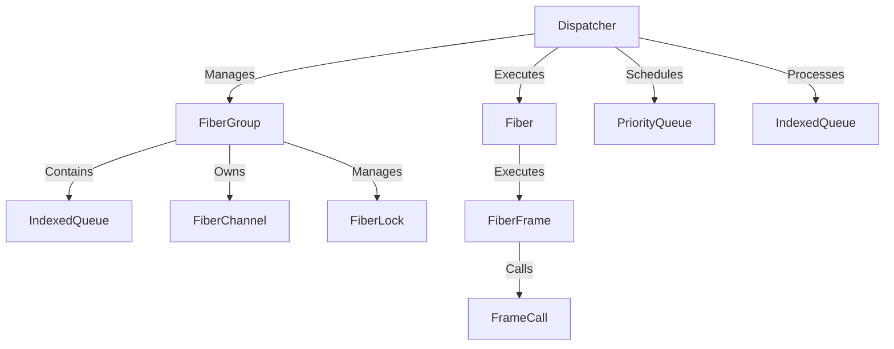
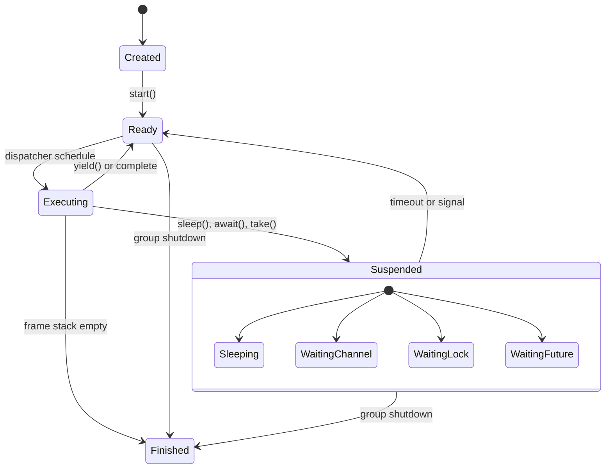
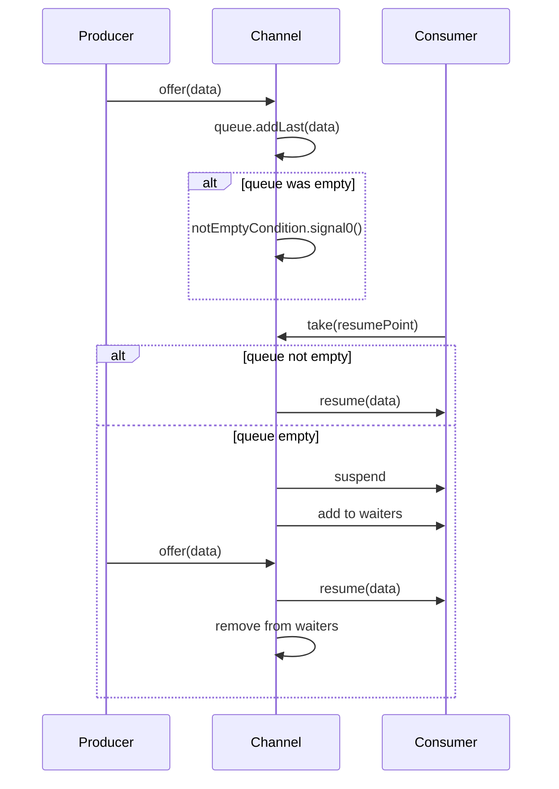
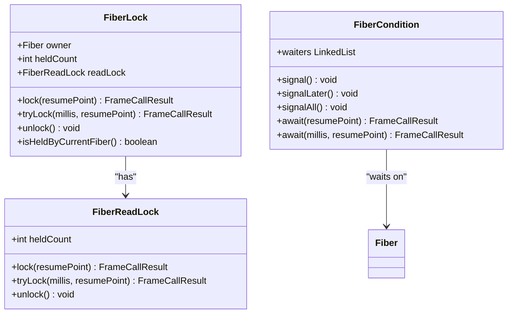
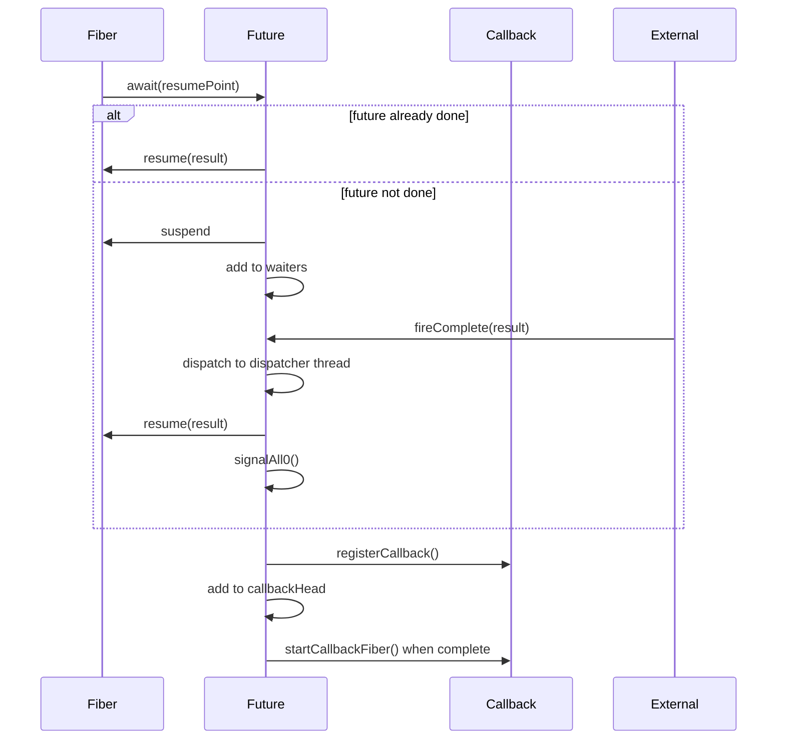
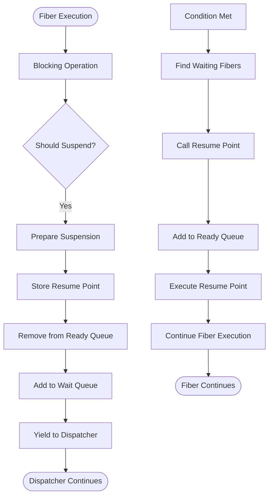
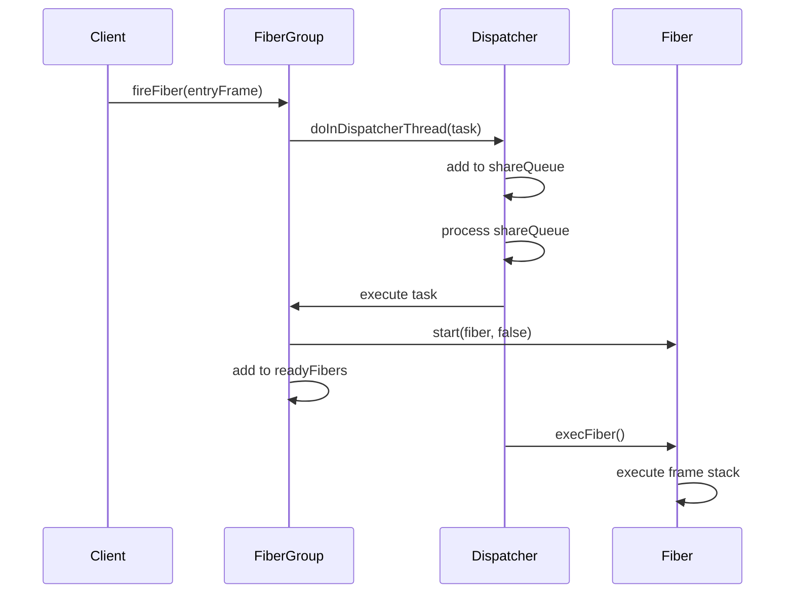
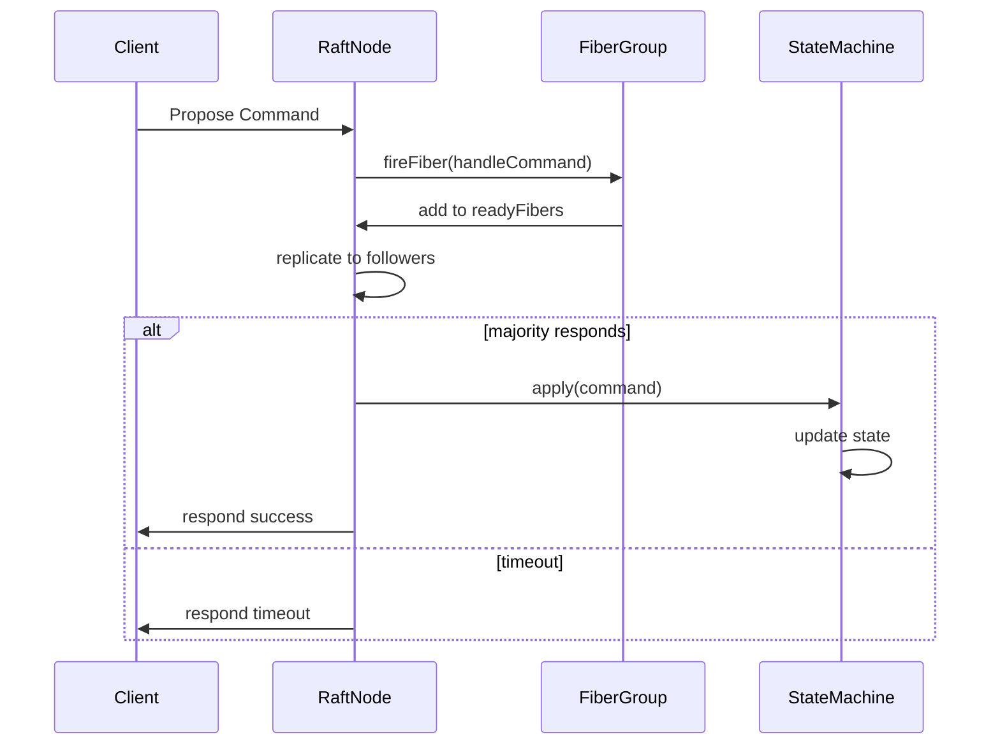

# Fiber Concurrency Framework

<cite>
**Referenced Files in This Document**   
- [Fiber.java](file://server/src/main/java/com/github/dtprj/dongting/fiber/Fiber.java)
- [Dispatcher.java](file://server/src/main/java/com/github/dtprj/dongting/fiber/Dispatcher.java)
- [FiberGroup.java](file://server/src/main/java/com/github/dtprj/dongting/fiber/FiberGroup.java)
- [FiberFrame.java](file://server/src/main/java/com/github/dtprj/dongting/fiber/FiberFrame.java)
- [FiberChannel.java](file://server/src/main/java/com/github/dtprj/dongting/fiber/FiberChannel.java)
- [FiberLock.java](file://server/src/main/java/com/github/dtprj/dongting/fiber/FiberLock.java)
- [FiberCondition.java](file://server/src/main/java/com/github/dtprj/dongting/fiber/FiberCondition.java)
- [FiberFuture.java](file://server/src/main/java/com/github/dtprj/dongting/fiber/FiberFuture.java)
- [FiberTest.java](file://benchmark/src/main/java/com/github/dtprj/dongting/bench/fiber/FiberTest.java)
- [CreateFiberTest.java](file://benchmark/src/main/java/com/github/dtprj/dongting/bench/fiber/CreateFiberTest.java)
- [ChannelTest.java](file://server/src/test/java/com/github/dtprj/dongting/fiber/ChannelTest.java)
- [LockTest.java](file://server/src/test/java/com/github/dtprj/dongting/fiber/LockTest.java)
- [RaftGroupImpl.java](file://server/src/main/java/com/github/dtprj/dongting/raft/impl/RaftGroupImpl.java)
</cite>

## Table of Contents
1. [Introduction](#introduction)
2. [Fiber Concept and Lightweight Execution Model](#fiber-concept-and-lightweight-execution-model)
3. [Dispatcher-Based Scheduling Architecture](#dispatcher-based-scheduling-architecture)
4. [Fiber Lifecycle Management](#fiber-lifecycle-management)
5. [Fiber Primitives](#fiber-primitives)
   - [Channels](#channels)
   - [Locks and Conditions](#locks-and-conditions)
   - [Futures](#futures)
6. [Non-Blocking Operations and Fiber Suspension](#non-blocking-operations-and-fiber-suspension)
7. [Fiber Creation and Coordination](#fiber-creation-and-coordination)
8. [Error Handling](#error-handling)
9. [Integration with I/O Operations and RAFT State Machine](#integration-with-io-operations-and-raft-state-machine)
10. [Performance Benchmarks](#performance-benchmarks)
11. [Debugging Challenges and Best Practices](#debugging-challenges-and-best-practices)
12. [Memory Footprint and Context-Switching Efficiency](#memory-footprint-and-context-switching-efficiency)
13. [Conclusion](#conclusion)

## Introduction
The Dongting fiber concurrency framework provides a user-space threading model that enables massive concurrency with minimal overhead. Unlike traditional OS threads, fibers are lightweight execution units managed entirely in user space, allowing for efficient context switching and reduced memory footprint. This document explores the architecture, implementation, and usage patterns of the fiber framework, focusing on its dispatcher-based scheduling, fiber primitives, and integration with high-performance systems like RAFT state machines.

## Fiber Concept and Lightweight Execution Model
The fiber concept in Dongting represents a user-space thread alternative designed for massive concurrency. Fibers are lightweight execution units that operate within a single OS thread, managed by a dispatcher that schedules their execution. This model eliminates the overhead associated with OS thread creation and context switching, enabling the creation of millions of concurrent fibers with minimal resource consumption.

Fibers in Dongting are implemented as cooperative multitasking units, where each fiber yields control back to the dispatcher at specific suspension points. This cooperative model ensures predictable scheduling and eliminates the need for complex locking mechanisms typically required in preemptive threading models. The lightweight nature of fibers stems from their minimal memory footprint and the absence of kernel involvement in their lifecycle management.

**Section sources**
- [Fiber.java](file://server/src/main/java/com/github/dtprj/dongting/fiber/Fiber.java#L27-L237)
- [FiberGroup.java](file://server/src/main/java/com/github/dtprj/dongting/fiber/FiberGroup.java#L34-L353)

## Dispatcher-Based Scheduling Architecture
The dispatcher-based scheduling architecture in Dongting is centered around the `Dispatcher` class, which manages the execution of fibers within a single OS thread. The dispatcher operates as an event loop, processing ready fibers in each scheduling round and handling time-based scheduling for suspended fibers.

The dispatcher maintains several key data structures:
- A shared queue for inter-thread communication
- A priority queue for time-based fiber scheduling
- Ready queues for fibers ready to execute
- A list of fiber groups that share the dispatcher

The scheduling algorithm follows a round-based approach where fibers are executed in batches, with the dispatcher processing ready fibers from each group in sequence. This design ensures fair scheduling while minimizing context switching overhead. The dispatcher also handles system-level tasks such as object pool cleanup and group lifecycle management.

**Diagram sources**
- [Dispatcher.java](file://server/src/main/java/com/github/dtprj/dongting/fiber/Dispatcher.java#L45-L655)
- [FiberGroup.java](file://server/src/main/java/com/github/dtprj/dongting/fiber/FiberGroup.java#L34-L353)
- [Fiber.java](file://server/src/main/java/com/github/dtprj/dongting/fiber/Fiber.java#L27-L237)

## Fiber Lifecycle Management
Fiber lifecycle management in Dongting follows a well-defined state transition model. Each fiber progresses through several states: creation, ready, executing, suspended, and finished. The lifecycle is managed by the dispatcher and fiber group, ensuring proper resource cleanup and coordination.

The fiber lifecycle begins with creation, where a fiber is instantiated with an entry frame and associated with a fiber group. Upon starting, the fiber transitions to the ready state, where it waits in the group's ready queue. When scheduled by the dispatcher, the fiber enters the executing state, processing its frame stack until it either completes or suspends.

Fibers can suspend their execution through various primitives such as sleep, channel operations, or lock acquisition. During suspension, fibers are removed from the ready queue and placed in wait queues associated with specific conditions. When the suspension condition is met, fibers are returned to the ready state for resumption.

**Diagram sources**
- [Fiber.java](file://server/src/main/java/com/github/dtprj/dongting/fiber/Fiber.java#L27-L237)
- [Dispatcher.java](file://server/src/main/java/com/github/dtprj/dongting/fiber/Dispatcher.java#L45-L655)
- [FiberGroup.java](file://server/src/main/java/com/github/dtprj/dongting/fiber/FiberGroup.java#L34-L353)

## Fiber Primitives

### Channels
Fiber channels in Dongting provide a thread-safe communication mechanism between fibers. Implemented as unbounded queues that block consumers, channels enable asynchronous message passing with minimal overhead. The `FiberChannel` class supports various operations including offer, take, and takeAll, with timeout and interruption handling.

Channels can be used within the same fiber group or across threads through the `fireOffer` method, which safely dispatches messages to the fiber group's dispatcher thread. This design enables efficient inter-thread communication while maintaining the integrity of the fiber execution model.

**Diagram sources**
- [FiberChannel.java](file://server/src/main/java/com/github/dtprj/dongting/fiber/FiberChannel.java#L31-L197)
- [ChannelTest.java](file://server/src/test/java/com/github/dtprj/dongting/fiber/ChannelTest.java#L34-L146)

### Locks and Conditions
The fiber framework provides synchronization primitives including `FiberLock` and `FiberCondition` that operate within the fiber execution model. Unlike traditional Java locks, fiber locks are non-blocking from the OS perspective, allowing fibers to suspend and resume without blocking OS threads.

`FiberLock` supports reentrant locking with both exclusive (write) and shared (read) modes through its `FiberReadLock` component. The lock implementation tracks the owning fiber and held count, ensuring proper reentrancy and preventing deadlocks. Lock operations return `FrameCallResult` to indicate suspension, allowing the dispatcher to manage the fiber's state.

`FiberCondition` provides await and signal operations that work in conjunction with fiber locks. Conditions can be used to implement complex synchronization patterns and support waiting on multiple conditions simultaneously. The condition implementation integrates with the dispatcher's scheduling mechanism to ensure efficient wake-up and resumption.

**Diagram sources**
- [FiberLock.java](file://server/src/main/java/com/github/dtprj/dongting/fiber/FiberLock.java#L25-L116)
- [FiberCondition.java](file://server/src/main/java/com/github/dtprj/dongting/fiber/FiberCondition.java#L23-L99)
- [LockTest.java](file://server/src/test/java/com/github/dtprj/dongting/fiber/LockTest.java#L28-L243)

### Futures
`FiberFuture` provides a mechanism for asynchronous computation and result handling within the fiber framework. Futures represent a value that may not be available yet, allowing fibers to await completion without blocking OS threads. The future implementation integrates with the fiber execution model, supporting both callback-based and suspension-based consumption.

Fiber futures can be completed from any thread using `fireComplete` methods, which safely dispatch completion events to the fiber group's dispatcher thread. This enables integration with external asynchronous systems while maintaining the integrity of the fiber execution model. Futures also support composition operations like `convert`, `convertWithHandle`, and `compose`, enabling complex asynchronous workflows.

**Diagram sources**
- [FiberFuture.java](file://server/src/main/java/com/github/dtprj/dongting/fiber/FiberFuture.java#L29-L354)
- [Fiber.java](file://server/src/main/java/com/github/dtprj/dongting/fiber/Fiber.java#L27-L237)

## Non-Blocking Operations and Fiber Suspension
The fiber framework implements non-blocking operations through a suspension and resumption mechanism that avoids OS thread blocking. When a fiber encounters a blocking operation such as I/O, lock acquisition, or channel receive, it suspends its execution and yields control back to the dispatcher.

Suspension is achieved through the `FrameCallResult.SUSPEND` return value, which signals to the dispatcher that the fiber should be removed from the ready queue. The fiber's state is preserved in its frame stack, allowing for seamless resumption when the blocking condition is satisfied. This approach enables high concurrency without the resource overhead of OS threads.

The suspension mechanism is implemented through various primitives:
- `sleep()` and `sleepUntilShouldStop()` for time-based suspension
- `awaitOn()` for condition-based suspension
- Channel operations (`take()`, `takeAll()`) for message-based suspension
- Lock operations (`lock()`, `tryLock()`) for synchronization-based suspension

When a suspended fiber's condition is met, the dispatcher resumes the fiber by calling its resume point with the appropriate result or exception. This callback-based resumption ensures that fibers continue execution from exactly where they left off, maintaining the illusion of sequential execution.

**Diagram sources**
- [Dispatcher.java](file://server/src/main/java/com/github/dtprj/dongting/fiber/Dispatcher.java#L45-L655)
- [Fiber.java](file://server/src/main/java/com/github/dtprj/dongting/fiber/Fiber.java#L27-L237)
- [FiberFrame.java](file://server/src/main/java/com/github/dtprj/dongting/fiber/FiberFrame.java#L22-L115)

## Fiber Creation and Coordination
Fiber creation in Dongting is accomplished through the `Fiber` constructor and `FiberGroup` factory methods. Fibers are created with an entry frame that defines their initial execution logic and are associated with a fiber group that manages their lifecycle.

The framework provides several methods for fiber coordination:
- `fireFiber()` for submitting fibers from any thread
- `start()` for starting fibers within the same thread
- `join()` for waiting on fiber completion
- Channel-based communication for message passing
- Lock-based synchronization for mutual exclusion

Fiber coordination patterns include:
- Producer-consumer workflows using channels
- Master-worker patterns with result aggregation
- Pipeline processing with chained fibers
- Event-driven architectures with condition signaling

**Diagram sources**
- [Fiber.java](file://server/src/main/java/com/github/dtprj/dongting/fiber/Fiber.java#L27-L237)
- [FiberGroup.java](file://server/src/main/java/com/github/dtprj/dongting/fiber/FiberGroup.java#L34-L353)
- [Dispatcher.java](file://server/src/main/java/com/github/dtprj/dongting/fiber/Dispatcher.java#L45-L655)
- [FiberTest.java](file://benchmark/src/main/java/com/github/dtprj/dongting/bench/fiber/FiberTest.java#L32-L89)

## Error Handling
The fiber framework implements a comprehensive error handling mechanism that distinguishes between recoverable and fatal errors. Recoverable errors are propagated through the fiber's frame stack and can be caught and handled using the `handle()` method in `FiberFrame`. Fatal errors, such as programming errors or system failures, trigger group shutdown to prevent inconsistent state.

Exception handling in fibers follows a structured approach:
- Checked exceptions are wrapped in appropriate fiber exceptions
- Runtime exceptions are propagated through the frame stack
- Errors are treated as fatal conditions that trigger group shutdown
- Suppressed exceptions are properly tracked and reported

The framework also provides mechanisms for interruption handling, timeout exceptions, and cancellation. Fibers can be interrupted using the `interrupt()` method, which sets an interruption flag and causes blocking operations to fail with `FiberInterruptException`. Timeouts are handled through timed operations that return appropriate results or exceptions.

**Section sources**
- [Fiber.java](file://server/src/main/java/com/github/dtprj/dongting/fiber/Fiber.java#L27-L237)
- [Dispatcher.java](file://server/src/main/java/com/github/dtprj/dongting/fiber/Dispatcher.java#L45-L655)
- [FiberFrame.java](file://server/src/main/java/com/github/dtprj/dongting/fiber/FiberFrame.java#L22-L115)

## Integration with I/O Operations and RAFT State Machine
The fiber framework is designed to integrate seamlessly with I/O operations and distributed systems like RAFT state machines. In the RAFT implementation, fibers are used to manage various aspects of the consensus algorithm, including leader election, log replication, and state machine execution.

For I/O operations, the framework provides non-blocking primitives that suspend fibers during I/O waits, allowing a single OS thread to handle thousands of concurrent I/O operations. This is particularly beneficial for network-intensive applications like RAFT, where multiple nodes communicate frequently.

In the RAFT state machine execution, fibers are used to:
- Process client requests in a non-blocking manner
- Handle append entries and vote requests
- Manage snapshot installation and log compaction
- Coordinate leader transfer and configuration changes

The integration is achieved through fiber channels that decouple request reception from processing, allowing for efficient batching and pipelining of operations. This design enables high throughput while maintaining the consistency guarantees required by the RAFT algorithm.

**Diagram sources**
- [RaftGroupImpl.java](file://server/src/main/java/com/github/dtprj/dongting/raft/impl/RaftGroupImpl.java)
- [FiberGroup.java](file://server/src/main/java/com/github/dtprj/dongting/fiber/FiberGroup.java#L34-L353)

## Performance Benchmarks
Performance benchmarks from the benchmark module demonstrate the efficiency of the fiber concurrency framework. The `CreateFiberTest` benchmark measures the overhead of fiber creation and execution, showing that millions of fibers can be created and executed with minimal overhead.

Key performance characteristics include:
- Low memory footprint per fiber (approximately 1KB)
- Fast context switching (sub-microsecond)
- High throughput for channel operations (millions per second)
- Efficient lock acquisition and release
- Scalable performance with increasing fiber count

The benchmarks also compare fiber performance against traditional threading models and virtual threads, highlighting the advantages of the user-space execution model in terms of memory efficiency and predictable scheduling behavior.

**Section sources**
- [CreateFiberTest.java](file://benchmark/src/main/java/com/github/dtprj/dongting/bench/fiber/CreateFiberTest.java#L30-L112)
- [FiberTest.java](file://benchmark/src/main/java/com/github/dtprj/dongting/bench/fiber/FiberTest.java#L32-L89)
- [ChannelCrossThreadTest.java](file://benchmark/src/main/java/com/github/dtprj/dongting/bench/fiber/ChannelCrossThreadTest.java#L32-L79)

## Debugging Challenges and Best Practices
Debugging fiber-based applications presents unique challenges due to the cooperative multitasking model and the potential for complex suspension/resumption patterns. Key challenges include:
- Understanding fiber state and suspension points
- Tracing execution flow across suspension boundaries
- Identifying deadlocks and livelocks in fiber coordination
- Diagnosing performance bottlenecks in fiber scheduling

Best practices for fiber-based programming include:
- Using descriptive names for fibers and primitives
- Implementing proper error handling and cleanup
- Avoiding long-running computations in fibers
- Using timeouts on blocking operations
- Monitoring fiber group state and resource usage
- Leveraging the framework's logging and diagnostic capabilities

The framework provides tools for debugging, including fiber group state inspection through `fireLogGroupInfo()` and comprehensive logging of fiber operations and errors.

**Section sources**
- [FiberGroup.java](file://server/src/main/java/com/github/dtprj/dongting/fiber/FiberGroup.java#L34-L353)
- [Dispatcher.java](file://server/src/main/java/com/github/dtprj/dongting/fiber/Dispatcher.java#L45-L655)

## Memory Footprint and Context-Switching Efficiency
The fiber framework achieves exceptional memory efficiency and context-switching performance compared to traditional threading models. Each fiber requires only a few hundred bytes of memory, primarily for its frame stack and state variables, enabling the creation of millions of concurrent fibers within a single process.

Context switching between fibers is extremely efficient, occurring entirely in user space without kernel involvement. The dispatcher's scheduling algorithm minimizes overhead by batching fiber execution and leveraging efficient data structures for ready queue management. This results in context switch times that are orders of magnitude faster than OS thread switches.

The memory and performance advantages stem from several design choices:
- User-space scheduling eliminates kernel transitions
- Lightweight fiber state reduces memory footprint
- Cooperative multitasking avoids complex locking
- Batched execution improves CPU cache utilization
- Object pooling reduces garbage collection pressure

These characteristics make the fiber framework particularly well-suited for high-concurrency applications such as distributed systems, real-time processing, and microservices architectures.

**Section sources**
- [Fiber.java](file://server/src/main/java/com/github/dtprj/dongting/fiber/Fiber.java#L27-L237)
- [Dispatcher.java](file://server/src/main/java/com/github/dtprj/dongting/fiber/Dispatcher.java#L45-L655)
- [FiberGroup.java](file://server/src/main/java/com/github/dtprj/dongting/fiber/FiberGroup.java#L34-L353)

## Conclusion
The Dongting fiber concurrency framework provides a powerful alternative to traditional threading models, enabling massive concurrency with minimal overhead. By implementing fibers as user-space execution units managed by a dispatcher, the framework achieves exceptional memory efficiency and context-switching performance.

Key strengths of the framework include its comprehensive set of synchronization primitives, seamless integration with I/O operations, and robust error handling. The design enables the development of high-performance distributed systems like RAFT state machines while maintaining code clarity and debuggability.

The fiber model represents a compelling approach to concurrency, particularly for applications requiring high throughput and low latency. By leveraging cooperative multitasking and user-space scheduling, the framework overcomes many of the limitations of traditional threading models while providing familiar programming abstractions.