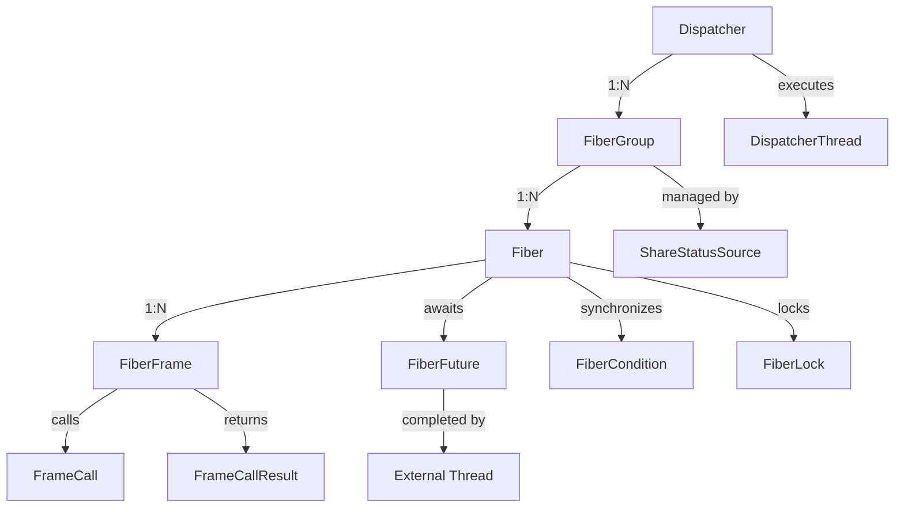

# Fiber Execution and Lifecycle Management

<cite>
**Referenced Files in This Document**   
- [Fiber.java](file://server/src/main/java/com/github/dtprj/dongting/fiber/Fiber.java)
- [FiberFrame.java](file://server/src/main/java/com/github/dtprj/dongting/fiber/FiberFrame.java)
- [FrameCallResult.java](file://server/src/main/java/com/github/dtprj/dongting/fiber/FrameCallResult.java)
- [FiberFuture.java](file://server/src/main/java/com/github/dtprj/dongting/fiber/FiberFuture.java)
- [Dispatcher.java](file://server/src/main/java/com/github/dtprj/dongting/fiber/Dispatcher.java)
- [FiberGroup.java](file://server/src/main/java/com/github/dtprj/dongting/fiber/FiberGroup.java)
- [WaitSource.java](file://server/src/main/java/com/github/dtprj/dongting/fiber/WaitSource.java)
- [2024_07_16_3000行代码实现fiber.md](file://devlogs/2024_07_16_3000行代码实现fiber.md)
- [2024_07_09_第二点阶段性进展.md](file://devlogs/2024_07_09_第二点阶段性进展.md)
- [CatchTest.java](file://server/src/test/java/com/github/dtprj/dongting/fiber/CatchTest.java)
- [FinallyTest.java](file://server/src/test/java/com/github/dtprj/dongting/fiber/FinallyTest.java)
- [SleepTest.java](file://server/src/test/java/com/github/dtprj/dongting/fiber/SleepTest.java)
- [YieldTest.java](file://server/src/test/java/com/github/dtprj/dongting/fiber/YieldTest.java)
</cite>

## Table of Contents
1. [Introduction](#introduction)
2. [Fiber Lifecycle and States](#fiber-lifecycle-and-states)
3. [Fiber Control Methods](#fiber-control-methods)
4. [FiberFrame and Execution Context](#fiberframe-and-execution-context)
5. [FrameCallResult Mechanism](#framecallresult-mechanism)
6. [FiberFuture and Completion Primitives](#fiberfuture-and-completion-primitives)
7. [Exception Handling and Resource Cleanup](#exception-handling-and-resource-cleanup)
8. [Virtual Stack Traces and Debugging](#virtual-stack-traces-and-debugging)
9. [Architecture Overview](#architecture-overview)

## Introduction
The Dongting fiber execution model implements a stackless coroutine system designed to provide synchronous-style programming with asynchronous execution semantics. This model enables developers to write linear, readable code while maintaining high performance through cooperative multitasking within a single thread. The core components of this system include the Fiber class as the fundamental execution unit, FiberFrame for maintaining execution context across suspensions, and FiberFuture for managing asynchronous operations. This documentation provides a comprehensive analysis of the fiber execution model, detailing lifecycle management, control mechanisms, and integration patterns that enable efficient, maintainable code development in the Dongting framework.

## Fiber Lifecycle and States
The Fiber class represents the fundamental execution unit in Dongting's stackless coroutine implementation, managing the complete lifecycle of a coroutine from creation to termination. Each fiber transitions through distinct states that govern its execution behavior: ready, running, and suspended. The lifecycle begins when a fiber is instantiated with an entry FiberFrame and associated with a FiberGroup, which provides the execution context. Upon calling the start() method, the fiber becomes eligible for execution and enters the ready state, where it waits in the dispatcher's ready queue until scheduled.

When the dispatcher selects a ready fiber for execution, it transitions to the running state, where its current FiberFrame executes until completion or suspension. The running state is characterized by active execution of the fiber's logic, with the dispatcher managing the call stack through the FiberFrame chain. If the fiber encounters a blocking operation, it transitions to the suspended state, where it yields control back to the dispatcher while maintaining its execution context. The suspended state allows other fibers to execute, enabling efficient utilization of the underlying thread.

A fiber completes its lifecycle when it reaches termination, either through normal completion or interruption. The finished state is reached when all frames in the fiber's call stack have completed execution, and the fiber has been removed from its FiberGroup. The lifecycle management is tightly integrated with the FiberGroup, which ensures that non-daemon fibers complete before the group shuts down. This lifecycle model provides deterministic resource management and enables clean shutdown procedures, as the FiberGroup can track the completion status of all associated fibers.

**Section sources**
- [Fiber.java](file://server/src/main/java/com/github/dtprj/dongting/fiber/Fiber.java#L27-L237)
- [FiberGroup.java](file://server/src/main/java/com/github/dtprj/dongting/fiber/FiberGroup.java#L34-L353)
- [Dispatcher.java](file://server/src/main/java/com/github/dtprj/dongting/fiber/Dispatcher.java#L45-L655)

## Fiber Control Methods
The Fiber class provides a comprehensive set of control methods that enable precise management of coroutine execution and coordination. These methods allow fibers to suspend, resume, and synchronize their execution while maintaining the illusion of synchronous programming. The sleep method enables time-based suspension, allowing a fiber to yield control for a specified duration before automatically resuming. This is implemented through the dispatcher's scheduling queue, where sleeping fibers are temporarily removed from execution rotation and reinserted upon timeout expiration.

The interrupt method provides a cooperative interruption mechanism, allowing external components to signal a fiber for cancellation. When interrupted, a fiber receives a FiberInterruptException upon its next suspension point, enabling graceful shutdown procedures. This mechanism is particularly useful for implementing timeout logic and cancellation tokens in long-running operations. The join method enables fiber synchronization, allowing one fiber to wait for the completion of another. This creates a parent-child relationship where the joining fiber suspends until the target fiber completes, with optional timeout support for bounded waiting.

The yield method implements cooperative multitasking by voluntarily surrendering execution to other ready fibers in the same FiberGroup. Unlike sleep, which suspends for a time duration, yield immediately yields control to the dispatcher, allowing other fibers to execute in the current scheduling round. This method is essential for implementing fair scheduling and preventing any single fiber from monopolizing the dispatcher thread. All control methods return FrameCallResult to enforce proper suspension semantics, ensuring that callers immediately return to the dispatcher after invoking these methods.

**Section sources**
- [Fiber.java](file://server/src/main/java/com/github/dtprj/dongting/fiber/Fiber.java#L71-L104)
- [Dispatcher.java](file://server/src/main/java/com/github/dtprj/dongting/fiber/Dispatcher.java#L465-L499)
- [SleepTest.java](file://server/src/test/java/com/github/dtprj/dongting/fiber/SleepTest.java#L1-L124)
- [YieldTest.java](file://server/src/test/java/com/github/dtprj/dongting/fiber/YieldTest.java#L1-L52)

## FiberFrame and Execution Context
The FiberFrame class serves as a virtual stack frame that maintains execution context across suspensions in Dongting's stackless coroutine implementation. Unlike traditional threads that rely on the JVM call stack, fibers use FiberFrame instances to preserve state when suspended, enabling asynchronous execution with synchronous programming style. Each FiberFrame represents a logical unit of work and contains the necessary context to resume execution after suspension, including local state, resume points, and exception handling logic.

FiberFrame operates as an abstract base class that developers extend to implement specific functionality. The execute method contains the primary logic that runs when the frame is active, while the resumePoint field maintains the continuation callback that the dispatcher invokes upon resumption. The frame maintains its position in the virtual call stack through the prev reference, creating a linked list of frames that represents the fiber's call hierarchy. This stackless design eliminates the overhead of stack copying during suspension and resumption, contributing to the high performance of the fiber system.

The FiberFrame lifecycle is managed by the fiber's execution context, with the init method setting up the frame for execution and the reset method preparing it for potential reuse. The frame supports three key phases: normal execution in the execute method, exception handling in the handle method, and cleanup in the doFinally method. This triad mirrors traditional try-catch-finally semantics, providing a familiar programming model for resource management and error handling. The virtual stack frame approach enables complex control flows, including nested suspensions and exception propagation across multiple frames, while maintaining the simplicity of linear code structure.

**Section sources**
- [FiberFrame.java](file://server/src/main/java/com/github/dtprj/dongting/fiber/FiberFrame.java#L16-L115)
- [Fiber.java](file://server/src/main/java/com/github/dtprj/dongting/fiber/Fiber.java#L121-L136)
- [Dispatcher.java](file://server/src/main/java/com/github/dtprj/dongting/fiber/Dispatcher.java#L330-L370)
- [2024_07_16_3000行代码实现fiber.md](file://devlogs/2024_07_16_3000行代码实现fiber.md#L1-L303)

## FrameCallResult Mechanism
The FrameCallResult class implements a critical mechanism that enforces proper fiber suspension and resumption semantics in Dongting's execution model. As a simple enum-like class with static instances (CALL_NEXT_FRAME, SUSPEND, RETURN), FrameCallResult serves as a communication protocol between fiber components and the dispatcher, indicating the next action to take in the execution flow. This mechanism ensures that all suspension points are explicitly handled and that control is properly returned to the dispatcher.

The FrameCallResult system operates on a strict contract: any method that returns a FrameCallResult value must be immediately followed by a return statement in the calling code. This prevents the common error of continuing execution after a suspension point, which could lead to undefined behavior or race conditions. The dispatcher performs runtime checks to detect violations of this contract, throwing fatal errors when a fiber attempts to execute additional code after a suspension method call. This enforcement is crucial for maintaining the integrity of the cooperative multitasking model.

Each FrameCallResult value has a specific meaning in the execution context: RETURN indicates that the current frame has completed and should be popped from the call stack; SUSPEND signals that the fiber should yield control and be placed in a waiting state; and CALL_NEXT_FRAME instructs the dispatcher to push a new frame onto the stack and begin its execution. This simple yet effective mechanism enables complex control flows while maintaining the appearance of synchronous code. The immediate return requirement ensures that the dispatcher maintains complete control over fiber scheduling, preventing any single fiber from monopolizing the execution thread.

**Section sources**
- [FrameCallResult.java](file://server/src/main/java/com/github/dtprj/dongting/fiber/FrameCallResult.java#L16-L29)
- [Dispatcher.java](file://server/src/main/java/com/github/dtprj/dongting/fiber/Dispatcher.java#L404-L444)
- [Fiber.java](file://server/src/main/java/com/github/dtprj/dongting/fiber/Fiber.java#L71-L119)
- [2024_07_16_3000行代码实现fiber.md](file://devlogs/2024_07_16_3000行代码实现fiber.md#L1-L303)

## FiberFuture and Completion Primitives
The FiberFuture class provides a fiber-aware completion primitive that integrates seamlessly with Dongting's dispatcher execution model, enabling asynchronous operations with synchronous-style programming. As an extension of WaitSource, FiberFuture represents a pending result that fibers can await, suspending their execution until the result becomes available. This mechanism bridges the gap between traditional callback-based asynchronous programming and the linear code flow desired in fiber-based systems.

FiberFuture supports both synchronous await and asynchronous completion patterns. The await method allows a fiber to suspend until the future completes, automatically resuming with the result or exception. This suspension is implemented through the dispatcher's scheduling mechanism, where the waiting fiber is placed in a suspended state until signaled. For external threads or asynchronous callbacks, the fireComplete and fireCompleteExceptionally methods provide thread-safe completion, posting completion tasks to the dispatcher's system channel for processing in the correct execution context.

The FiberFuture implementation includes sophisticated composition capabilities through methods like convert, convertWithHandle, and compose, enabling complex asynchronous workflows. These methods allow chaining of futures, transformation of results, and sequential execution of dependent operations while maintaining the fiber's execution context. The allOf static method provides parallel composition, allowing a fiber to wait for multiple futures to complete simultaneously. This comprehensive feature set makes FiberFuture a powerful tool for building complex asynchronous pipelines while preserving the readability of synchronous code.

**Section sources**
- [FiberFuture.java](file://server/src/main/java/com/github/dtprj/dongting/fiber/FiberFuture.java#L16-L354)
- [Fiber.java](file://server/src/main/java/com/github/dtprj/dongting/fiber/Fiber.java#L171-L202)
- [Dispatcher.java](file://server/src/main/java/com/github/dtprj/dongting/fiber/Dispatcher.java#L422-L444)
- [WaitSource.java](file://server/src/main/java/com/github/dtprj/dongting/fiber/WaitSource.java#L23-L78)

## Exception Handling and Resource Cleanup
The Dongting fiber system implements a comprehensive exception handling and resource cleanup mechanism that mirrors traditional try-catch-finally semantics while adapting to the asynchronous nature of coroutines. Each FiberFrame provides handle and doFinally methods that form the foundation of this error management system, creating a structured approach to exception handling and resource disposal across suspension boundaries.

The handle method serves as the exception handler for a FiberFrame, intercepting any exceptions thrown during execution or by nested frames. When an exception occurs, the dispatcher invokes the handle method of the appropriate frame, allowing for localized error recovery or transformation. If a frame does not override handle, exceptions propagate to parent frames, enabling hierarchical exception handling similar to traditional call stacks. The handle method can itself suspend the fiber, allowing for complex error recovery procedures that involve asynchronous operations like retry logic or fallback mechanisms.

The doFinally method provides guaranteed cleanup execution, running regardless of whether the frame completes normally or via exception. This method is essential for resource management, ensuring that allocated resources like file handles, network connections, or memory buffers are properly released. Crucially, doFinally can also suspend the fiber, enabling asynchronous cleanup operations such as graceful connection shutdown or transaction rollback. This capability ensures that cleanup procedures can participate in the fiber's asynchronous execution model without blocking the dispatcher thread.

Exception handling is further enhanced by the integration with FiberFuture and other coordination primitives, allowing exceptions to propagate through asynchronous workflows while maintaining proper error context. The system ensures that exceptions are properly chained and that suppressed exceptions from cleanup operations are preserved, providing comprehensive error information for debugging and monitoring.

**Section sources**
- [FiberFrame.java](file://server/src/main/java/com/github/dtprj/dongting/fiber/FiberFrame.java#L34-L40)
- [CatchTest.java](file://server/src/test/java/com/github/dtprj/dongting/fiber/CatchTest.java#L1-L289)
- [FinallyTest.java](file://server/src/test/java/com/github/dtprj/dongting/fiber/FinallyTest.java#L1-L237)
- [Dispatcher.java](file://server/src/main/java/com/github/dtprj/dongting/fiber/Dispatcher.java#L330-L370)

## Virtual Stack Traces and Debugging
The Dongting fiber system addresses the debugging challenges inherent in asynchronous execution through virtual stack traces that preserve call hierarchy information across suspension points. When exceptions occur in fiber execution, the system enhances the exception with virtual stack frame information, making it possible to trace the logical call path even though the actual JVM stack has been unwound during suspensions. This feature is critical for diagnosing issues in complex asynchronous workflows where traditional stack traces would be incomplete or misleading.

The virtual stack trace mechanism is implemented in the FiberException class, which automatically captures the current fiber's call stack when an exception is thrown. By traversing the FiberFrame chain from the current stack top to the bottom, the system constructs a virtual stack trace that represents the logical execution path. This information is attached to exceptions using the addSuppressed mechanism, preserving the hierarchical relationship between frames. The resulting stack trace shows the sequence of FiberFrame classes involved in the execution, providing developers with a clear picture of the call flow.

Debugging is further enhanced by the naming conventions and diagnostic tools built into the fiber system. Each fiber, future, and coordination primitive can be assigned a descriptive name, making it easier to identify components in logs and monitoring tools. The FiberGroup provides diagnostic methods like fireLogGroupInfo that capture the current state of all fibers in a group, including their ready status, waiting conditions, and current execution points. These features combine to create a comprehensive debugging environment that mitigates the traditional difficulties of asynchronous programming while maintaining the performance benefits of the fiber model.

**Section sources**
- [FiberException.java](file://server/src/main/java/com/github/dtprj/dongting/fiber/FiberException.java#L16-L85)
- [FiberGroup.java](file://server/src/main/java/com/github/dtprj/dongting/fiber/FiberGroup.java#L243-L302)
- [2024_07_16_3000行代码实现fiber.md](file://devlogs/2024_07_16_3000行代码实现fiber.md#L1-L303)

## Architecture Overview
The Dongting fiber execution model follows a hierarchical architecture that enables efficient, scalable coroutine management. At the core of this system is the Dispatcher, which manages a pool of threads and coordinates the execution of multiple FiberGroups. Each FiberGroup represents an isolated execution context, typically associated with a specific service or component, and contains multiple fibers that share the same dispatcher thread. This architecture allows for both concurrency within groups and parallelism across groups, optimizing resource utilization while maintaining data isolation.

**Diagram sources**
- [Dispatcher.java](file://server/src/main/java/com/github/dtprj/dongting/fiber/Dispatcher.java#L45-L655)
- [FiberGroup.java](file://server/src/main/java/com/github/dtprj/dongting/fiber/FiberGroup.java#L34-L353)
- [Fiber.java](file://server/src/main/java/com/github/dtprj/dongting/fiber/Fiber.java#L27-L237)

The execution flow begins when a fiber is scheduled by the dispatcher, which selects ready fibers from their respective groups in a round-robin fashion. Each fiber executes its current FiberFrame until completion or suspension, with the dispatcher managing the virtual call stack through frame pushing and popping operations. When a fiber suspends, it registers with appropriate wait sources (such as FiberFuture or FiberCondition) and yields control back to the dispatcher, allowing other fibers to execute. The dispatcher's event loop continuously processes ready fibers, handles timeouts, and dispatches completion events, ensuring efficient utilization of system resources.

This architecture provides several key benefits: isolation through FiberGroups prevents interference between unrelated components; the stackless design minimizes memory overhead and enables rapid context switching; and the cooperative multitasking model ensures predictable execution patterns. The system's design also facilitates graceful shutdown through the FiberGroup lifecycle management, where non-daemon fibers must complete before a group can terminate, ensuring proper resource cleanup and state consistency.

**Section sources**
- [Dispatcher.java](file://server/src/main/java/com/github/dtprj/dongting/fiber/Dispatcher.java#L45-L655)
- [FiberGroup.java](file://server/src/main/java/com/github/dtprj/dongting/fiber/FiberGroup.java#L34-L353)
- [2024_07_09_第二点阶段性进展.md](file://devlogs/2024_07_09_第二点阶段性进展.md#L1-L48)