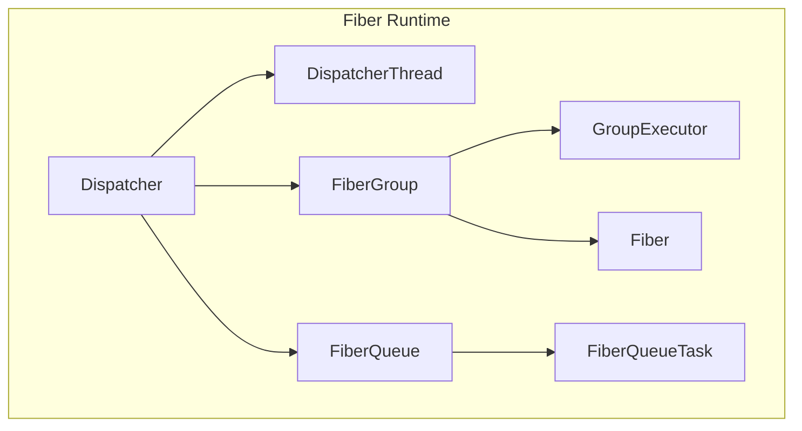
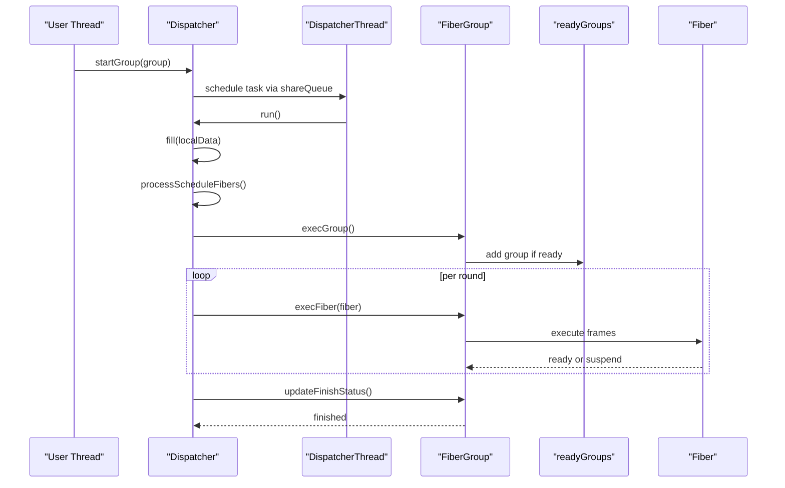
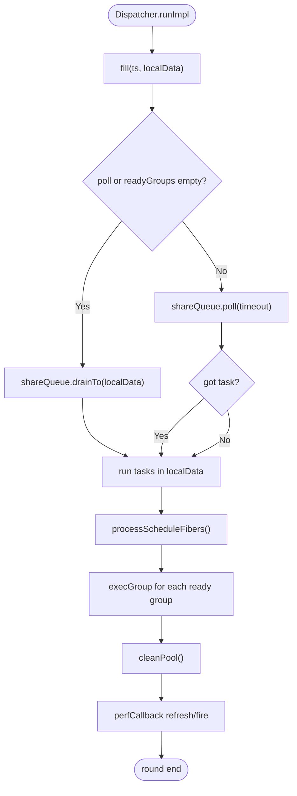
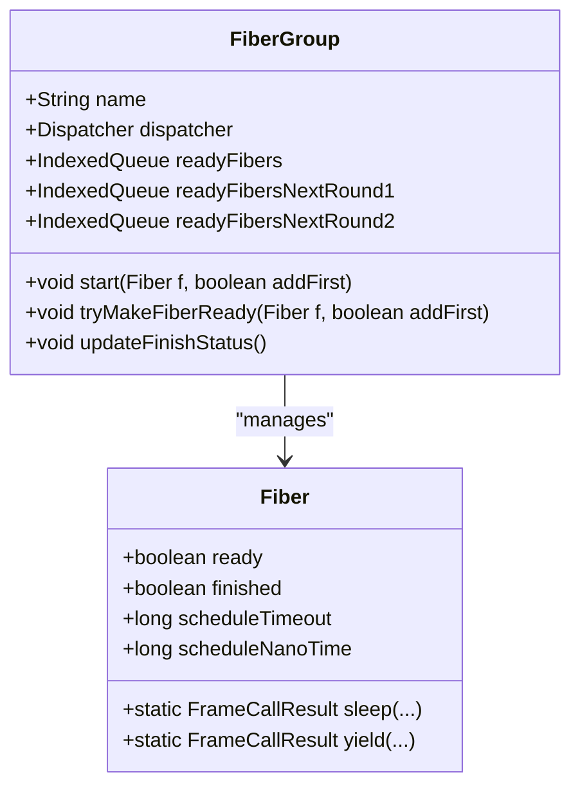
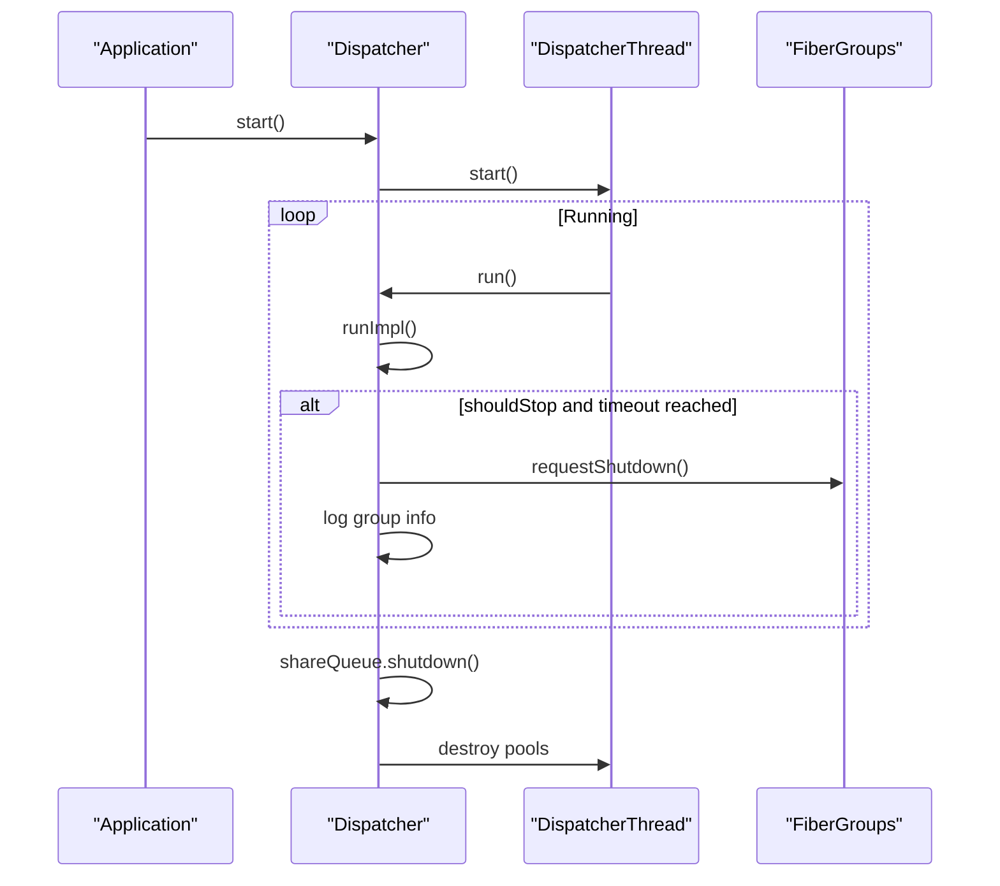
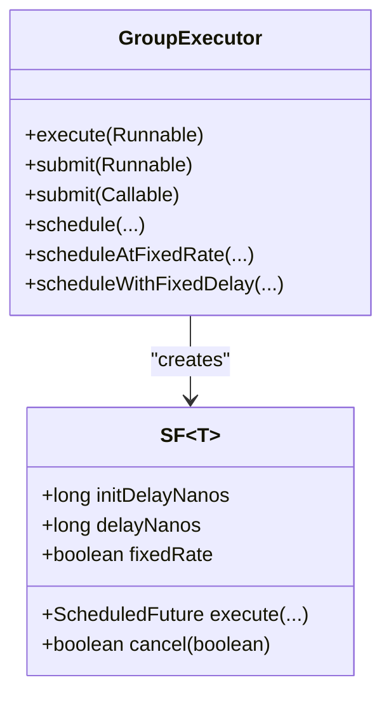
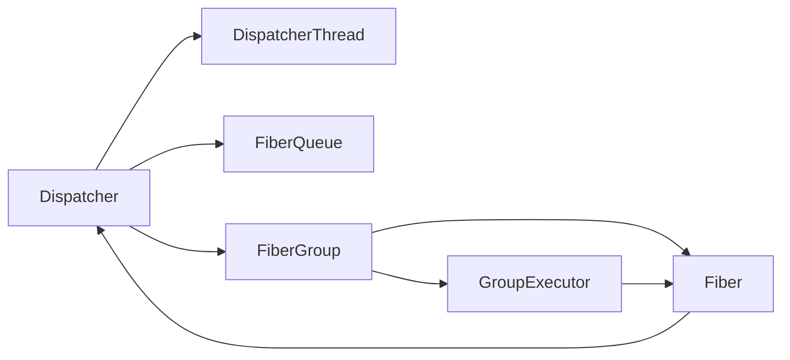

# Fiber Scheduling and Dispatcher

<cite>
**Referenced Files in This Document**
- [Dispatcher.java](file://server/src/main/java/com/github/dtprj/dongting/fiber/Dispatcher.java)
- [FiberGroup.java](file://server/src/main/java/com/github/dtprj/dongting/fiber/FiberGroup.java)
- [DispatcherThread.java](file://server/src/main/java/com/github/dtprj/dongting/fiber/DispatcherThread.java)
- [GroupExecutor.java](file://server/src/main/java/com/github/dtprj/dongting/fiber/GroupExecutor.java)
- [Fiber.java](file://server/src/main/java/com/github/dtprj/dongting/fiber/Fiber.java)
- [FiberQueue.java](file://server/src/main/java/com/github/dtprj/dongting/fiber/FiberQueue.java)
- [FiberQueueTask.java](file://server/src/main/java/com/github/dtprj/dongting/fiber/FiberQueueTask.java)
- [DefaultRaftFactory.java](file://server/src/main/java/com/github/dtprj/dongting/raft/server/DefaultRaftFactory.java)
- [AbstractFiberTest.java](file://server/src/test/java/com/github/dtprj/dongting/fiber/AbstractFiberTest.java)
- [FiberLifeCycleTest.java](file://server/src/test/java/com/github/dtprj/dongting/fiber/FiberLifeCycleTest.java)
- [2023_07_26_dongting线程模型.txt](file://devlogs/2023_07_26_dongting线程模型.txt)
</cite>

## Table of Contents
1. [Introduction](#introduction)
2. [Project Structure](#project-structure)
3. [Core Components](#core-components)
4. [Architecture Overview](#architecture-overview)
5. [Detailed Component Analysis](#detailed-component-analysis)
6. [Dependency Analysis](#dependency-analysis)
7. [Performance Considerations](#performance-considerations)
8. [Troubleshooting Guide](#troubleshooting-guide)
9. [Conclusion](#conclusion)

## Introduction
This document explains the fiber scheduling system centered on Dongting’s Dispatcher and FiberGroup architecture. It focuses on:
- The 1:1 relationship between Dispatcher and thread, and the 1:N relationship between Dispatcher and FiberGroup enabling efficient multi-RAFT group execution.
- The Dispatcher event loop, including shareQueue for inter-group communication, scheduleQueue for time-based fiber scheduling, and readyGroups for fiber group readiness management.
- Lifecycle methods (start, stop, doStart, doStop) and thread-safety considerations.
- Practical examples of dispatcher configuration, group management, and shutdown timeout handling from the source code.
- Performance implications of the polling mechanism and timeout settings.
- Troubleshooting common issues such as dispatcher thread starvation and group shutdown timeouts, with guidance from devlogs.

## Project Structure
The fiber subsystem resides in the server module under the package com.github.dtprj.dongting.fiber. The key classes are:
- Dispatcher: orchestrates scheduling, dispatches tasks, and manages lifecycle.
- FiberGroup: encapsulates a set of fibers and their readiness queues.
- DispatcherThread: the single-threaded worker bound to a Dispatcher.
- GroupExecutor: a scheduled executor service backed by a FiberGroup’s internal channel.
- Fiber: the fiber runtime abstraction with scheduling and waiting primitives.
- FiberQueue and FiberQueueTask: a lock-protected linked queue for cross-thread task delivery.

**Diagram sources**
- [Dispatcher.java](file://server/src/main/java/com/github/dtprj/dongting/fiber/Dispatcher.java#L1-L120)
- [DispatcherThread.java](file://server/src/main/java/com/github/dtprj/dongting/fiber/DispatcherThread.java#L1-L50)
- [FiberGroup.java](file://server/src/main/java/com/github/dtprj/dongting/fiber/FiberGroup.java#L1-L120)
- [GroupExecutor.java](file://server/src/main/java/com/github/dtprj/dongting/fiber/GroupExecutor.java#L1-L120)
- [FiberQueue.java](file://server/src/main/java/com/github/dtprj/dongting/fiber/FiberQueue.java#L1-L80)
- [FiberQueueTask.java](file://server/src/main/java/com/github/dtprj/dongting/fiber/FiberQueueTask.java#L1-L34)
- [Fiber.java](file://server/src/main/java/com/github/dtprj/dongting/fiber/Fiber.java#L1-L120)

**Section sources**
- [Dispatcher.java](file://server/src/main/java/com/github/dtprj/dongting/fiber/Dispatcher.java#L1-L120)
- [FiberGroup.java](file://server/src/main/java/com/github/dtprj/dongting/fiber/FiberGroup.java#L1-L120)
- [DispatcherThread.java](file://server/src/main/java/com/github/dtprj/dongting/fiber/DispatcherThread.java#L1-L50)
- [GroupExecutor.java](file://server/src/main/java/com/github/dtprj/dongting/fiber/GroupExecutor.java#L1-L120)
- [FiberQueue.java](file://server/src/main/java/com/github/dtprj/dongting/fiber/FiberQueue.java#L1-L80)
- [FiberQueueTask.java](file://server/src/main/java/com/github/dtprj/dongting/fiber/FiberQueueTask.java#L1-L34)
- [Fiber.java](file://server/src/main/java/com/github/dtprj/dongting/fiber/Fiber.java#L1-L120)

## Core Components
- Dispatcher: Single-threaded scheduler that runs the event loop, drains tasks from shareQueue, processes scheduleQueue, and executes ready fibers from readyGroups. It also manages shutdown with a timeout and logs group status when shutdown times out.
- FiberGroup: Encapsulates a set of fibers, maintains ready queues for current and next rounds, tracks finish status, and exposes a GroupExecutor for scheduling within the group.
- DispatcherThread: The thread bound to a Dispatcher, carrying per-thread pools and the currently executing FiberGroup.
- GroupExecutor: A ScheduledExecutorService-like interface backed by a FiberGroup’s internal channel, enabling scheduled execution of tasks within a group.
- Fiber: Provides primitives for calling subframes, resuming, sleeping, yielding, and joining fibers. It integrates with Dispatcher for scheduling and waiting.
- FiberQueue and FiberQueueTask: A lock-protected queue for cross-thread task delivery to the dispatcher thread.

Key lifecycle and thread-safety highlights:
- start/doStart: Starts the DispatcherThread.
- stop/doStop: Requests graceful shutdown, sets a stop timeout, and signals all groups to stop.
- Thread affinity: DispatcherThread holds the current FiberGroup and heap/direct pools; most operations occur on the dispatcher thread.
- Inter-thread coordination: shareQueue is the primary mechanism for cross-thread task delivery.

**Section sources**
- [Dispatcher.java](file://server/src/main/java/com/github/dtprj/dongting/fiber/Dispatcher.java#L115-L146)
- [FiberGroup.java](file://server/src/main/java/com/github/dtprj/dongting/fiber/FiberGroup.java#L138-L170)
- [DispatcherThread.java](file://server/src/main/java/com/github/dtprj/dongting/fiber/DispatcherThread.java#L24-L50)
- [GroupExecutor.java](file://server/src/main/java/com/github/dtprj/dongting/fiber/GroupExecutor.java#L1-L120)
- [Fiber.java](file://server/src/main/java/com/github/dtprj/dongting/fiber/Fiber.java#L71-L120)
- [FiberQueue.java](file://server/src/main/java/com/github/dtprj/dongting/fiber/FiberQueue.java#L48-L100)

## Architecture Overview
The system follows a 1:1 Dispatcher-to-thread model and 1:N Dispatcher-to-FiberGroup model. Each FiberGroup has its own ready queues and is scheduled cooperatively by the Dispatcher. The Dispatcher’s event loop coordinates:
- shareQueue: cross-thread tasks delivered to the dispatcher thread.
- scheduleQueue: time-based fibers awaiting wake-up.
- readyGroups: groups with runnable fibers.

**Diagram sources**
- [Dispatcher.java](file://server/src/main/java/com/github/dtprj/dongting/fiber/Dispatcher.java#L115-L211)
- [FiberGroup.java](file://server/src/main/java/com/github/dtprj/dongting/fiber/FiberGroup.java#L174-L213)
- [DispatcherThread.java](file://server/src/main/java/com/github/dtprj/dongting/fiber/DispatcherThread.java#L24-L50)

## Detailed Component Analysis

### Dispatcher Event Loop and Queues
- shareQueue: A lock-protected queue receiving tasks from any thread. The dispatcher drains tasks in batches to reduce lock contention.
- scheduleQueue: A priority queue ordered by wake-up time; the dispatcher periodically pops expired entries and makes them ready.
- readyGroups: An indexed queue holding groups with runnable fibers; the dispatcher rotates through ready groups to execute fibers.

**Diagram sources**
- [Dispatcher.java](file://server/src/main/java/com/github/dtprj/dongting/fiber/Dispatcher.java#L588-L620)
- [Dispatcher.java](file://server/src/main/java/com/github/dtprj/dongting/fiber/Dispatcher.java#L213-L236)
- [Dispatcher.java](file://server/src/main/java/com/github/dtprj/dongting/fiber/Dispatcher.java#L246-L281)
- [FiberQueue.java](file://server/src/main/java/com/github/dtprj/dongting/fiber/FiberQueue.java#L80-L115)

**Section sources**
- [Dispatcher.java](file://server/src/main/java/com/github/dtprj/dongting/fiber/Dispatcher.java#L588-L620)
- [Dispatcher.java](file://server/src/main/java/com/github/dtprj/dongting/fiber/Dispatcher.java#L213-L236)
- [Dispatcher.java](file://server/src/main/java/com/github/dtprj/dongting/fiber/Dispatcher.java#L246-L281)
- [FiberQueue.java](file://server/src/main/java/com/github/dtprj/dongting/fiber/FiberQueue.java#L48-L115)

### FiberGroup Readiness and Scheduling
- readyFibers and next-round queues: Separate queues for immediate and deferred execution to balance fairness and throughput.
- tryMakeFiberReady: Marks a fiber ready and inserts it into appropriate queues; updates group readiness.
- updateFinishStatus: Determines whether a group has finished by checking normal fibers, system channel tasks, and pending tasks in shareQueue.

**Diagram sources**
- [FiberGroup.java](file://server/src/main/java/com/github/dtprj/dongting/fiber/FiberGroup.java#L144-L213)
- [Fiber.java](file://server/src/main/java/com/github/dtprj/dongting/fiber/Fiber.java#L81-L120)

**Section sources**
- [FiberGroup.java](file://server/src/main/java/com/github/dtprj/dongting/fiber/FiberGroup.java#L144-L213)
- [Fiber.java](file://server/src/main/java/com/github/dtprj/dongting/fiber/Fiber.java#L81-L120)

### Dispatcher Lifecycle and Shutdown
- doStart: Starts the DispatcherThread.
- doStop: Schedules a stop task that sets shouldStop, records stopTimeout, and requests all groups to shut down.
- run/runImpl: The event loop; checks stop timeout and logs group info when exceeded; cleans pools periodically; updates perf metrics.

**Diagram sources**
- [Dispatcher.java](file://server/src/main/java/com/github/dtprj/dongting/fiber/Dispatcher.java#L131-L146)
- [Dispatcher.java](file://server/src/main/java/com/github/dtprj/dongting/fiber/Dispatcher.java#L148-L174)
- [DefaultRaftFactory.java](file://server/src/main/java/com/github/dtprj/dongting/raft/server/DefaultRaftFactory.java#L107-L117)

**Section sources**
- [Dispatcher.java](file://server/src/main/java/com/github/dtprj/dongting/fiber/Dispatcher.java#L131-L146)
- [Dispatcher.java](file://server/src/main/java/com/github/dtprj/dongting/fiber/Dispatcher.java#L148-L174)
- [DefaultRaftFactory.java](file://server/src/main/java/com/github/dtprj/dongting/raft/server/DefaultRaftFactory.java#L107-L117)

### GroupExecutor and Time-Based Scheduling
- GroupExecutor implements ScheduledExecutorService for a FiberGroup. It schedules tasks by firing a Fiber into the group and using Dispatcher.sleep/yield to implement delays.
- ScheduledFuture tasks manage state transitions and cancellation, integrating with the fiber stack.

**Diagram sources**
- [GroupExecutor.java](file://server/src/main/java/com/github/dtprj/dongting/fiber/GroupExecutor.java#L1-L120)
- [GroupExecutor.java](file://server/src/main/java/com/github/dtprj/dongting/fiber/GroupExecutor.java#L115-L190)
- [GroupExecutor.java](file://server/src/main/java/com/github/dtprj/dongting/fiber/GroupExecutor.java#L312-L345)

**Section sources**
- [GroupExecutor.java](file://server/src/main/java/com/github/dtprj/dongting/fiber/GroupExecutor.java#L1-L120)
- [GroupExecutor.java](file://server/src/main/java/com/github/dtprj/dongting/fiber/GroupExecutor.java#L115-L190)
- [GroupExecutor.java](file://server/src/main/java/com/github/dtprj/dongting/fiber/GroupExecutor.java#L312-L345)

### Thread Safety and Concurrency
- DispatcherThread is the sole owner of currentGroup and thread-local pools; most operations are performed on this thread.
- shareQueue uses a ReentrantLock and a condition to coordinate producers/consumers safely.
- VarHandle is used for volatile access to shouldStop to minimize overhead.
- FiberGroup.updateFinishStatus synchronizes on shareQueue.lock to ensure visibility of pending tasks.

**Section sources**
- [DispatcherThread.java](file://server/src/main/java/com/github/dtprj/dongting/fiber/DispatcherThread.java#L24-L50)
- [FiberQueue.java](file://server/src/main/java/com/github/dtprj/dongting/fiber/FiberQueue.java#L38-L78)
- [Dispatcher.java](file://server/src/main/java/com/github/dtprj/dongting/fiber/Dispatcher.java#L62-L85)
- [FiberGroup.java](file://server/src/main/java/com/github/dtprj/dongting/fiber/FiberGroup.java#L214-L237)

## Dependency Analysis
- Dispatcher depends on DispatcherThread, FiberQueue, and FiberGroup.
- FiberGroup depends on Dispatcher and uses IndexedQueue for ready fibers.
- GroupExecutor depends on FiberGroup and uses FiberQueueTask to schedule work.
- Fiber depends on Dispatcher for scheduling primitives.

**Diagram sources**
- [Dispatcher.java](file://server/src/main/java/com/github/dtprj/dongting/fiber/Dispatcher.java#L1-L120)
- [FiberGroup.java](file://server/src/main/java/com/github/dtprj/dongting/fiber/FiberGroup.java#L1-L120)
- [GroupExecutor.java](file://server/src/main/java/com/github/dtprj/dongting/fiber/GroupExecutor.java#L1-L120)
- [Fiber.java](file://server/src/main/java/com/github/dtprj/dongting/fiber/Fiber.java#L1-L120)

**Section sources**
- [Dispatcher.java](file://server/src/main/java/com/github/dtprj/dongting/fiber/Dispatcher.java#L1-L120)
- [FiberGroup.java](file://server/src/main/java/com/github/dtprj/dongting/fiber/FiberGroup.java#L1-L120)
- [GroupExecutor.java](file://server/src/main/java/com/github/dtprj/dongting/fiber/GroupExecutor.java#L1-L120)
- [Fiber.java](file://server/src/main/java/com/github/dtprj/dongting/fiber/Fiber.java#L1-L120)

## Performance Considerations
- Polling and batching: The dispatcher batch-drains shareQueue when there are ready groups or when poll is enabled, reducing lock contention and improving throughput.
- Timeout-driven polling: fill computes a poll timeout based on the nearest scheduled fiber, minimizing unnecessary blocking.
- Pool cleanup: Periodic cleaning of heap/direct pools reduces memory footprint and improves GC behavior.
- Round-robin fairness: Separate queues for next-round1/next-round2 help balance fairness across rounds.

Practical tuning tips:
- Adjust pollTimeout to trade off latency vs. CPU usage. Smaller values increase responsiveness but raise overhead.
- Monitor perfCallback metrics to detect hotspots in work/poll cycles.
- Ensure group shutdown completes promptly to avoid dispatcher thread starvation.

[No sources needed since this section provides general guidance]

## Troubleshooting Guide
Common issues and remedies:
- Dispatcher thread starvation:
  - Cause: Excessive blocking or long-running tasks in the dispatcher thread.
  - Symptoms: Delayed processing of shareQueue tasks and scheduleQueue wake-ups.
  - Actions: Reduce blocking in dispatcher thread; move heavy work to group executor or external threads; ensure timely completion of fibers.

- Group shutdown timeouts:
  - Cause: Normal fibers still running or pending tasks in shareQueue.
  - Symptoms: Dispatcher logs group info when stop timeout is reached and marks groups finished only when normal fibers and channel tasks are cleared.
  - Actions: Ensure fibers exit cleanly; avoid indefinite waits; use requestShutdown and await termination; inspect group logs for remaining fibers.

- Interrupted fibers:
  - Cause: Explicit interruption or sleep/awaitOn timeout.
  - Actions: Handle FiberInterruptException appropriately; re-check shouldStop conditions; avoid tight loops without yielding.

- Fatal errors:
  - Cause: Exceptions thrown from fiber frames.
  - Actions: Use Fiber.fatal to propagate and trigger group shutdown; review virtual stack traces; ensure finally blocks are executed.

Evidence from devlogs:
- The thread model emphasizes single-thread ownership for dedicated data and inter-thread coordination via memory queues. This informs the design choices in Dispatcher and FiberGroup.

**Section sources**
- [Dispatcher.java](file://server/src/main/java/com/github/dtprj/dongting/fiber/Dispatcher.java#L148-L174)
- [FiberGroup.java](file://server/src/main/java/com/github/dtprj/dongting/fiber/FiberGroup.java#L214-L237)
- [Fiber.java](file://server/src/main/java/com/github/dtprj/dongting/fiber/Fiber.java#L106-L116)
- [2023_07_26_dongting线程模型.txt](file://devlogs/2023_07_26_dongting线程模型.txt#L1-L15)

## Conclusion
Dongting’s fiber scheduling system centers on a single-threaded Dispatcher paired with multiple FiberGroups. The Dispatcher’s event loop efficiently coordinates cross-thread tasks via shareQueue, time-based scheduling via scheduleQueue, and cooperative execution via readyGroups. Lifecycle management ensures graceful shutdown with timeout handling and group status logging. Thread-safety is achieved through explicit thread affinity, lock-protected queues, and careful synchronization. Proper configuration and monitoring of polling and timeouts, along with disciplined fiber design, lead to predictable performance and robust shutdown behavior.